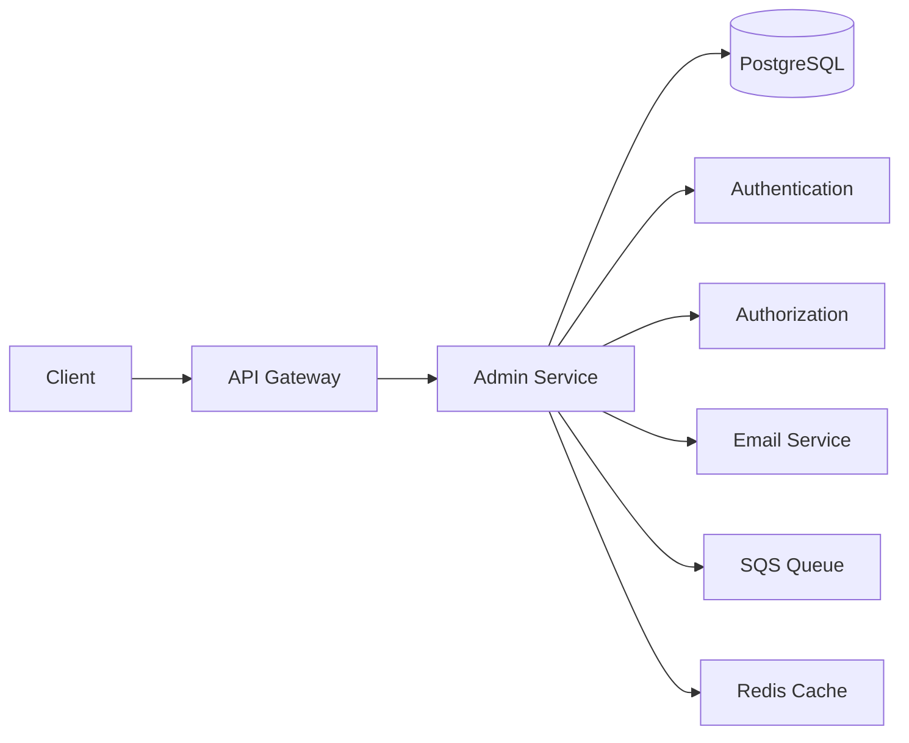
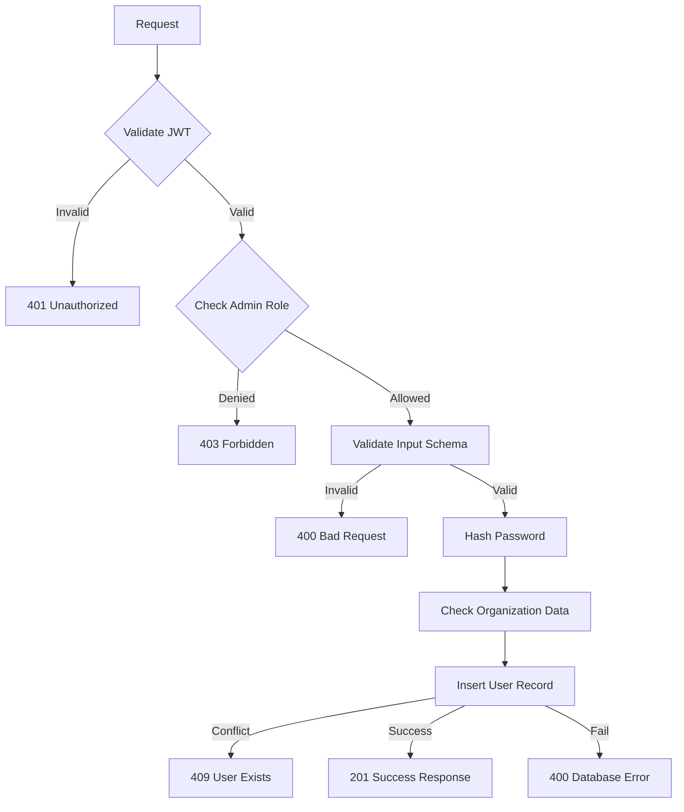
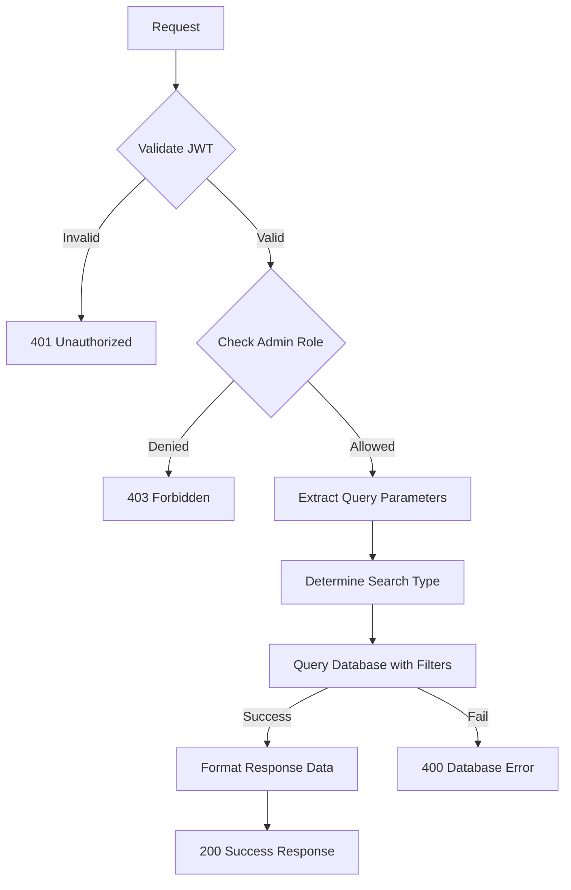
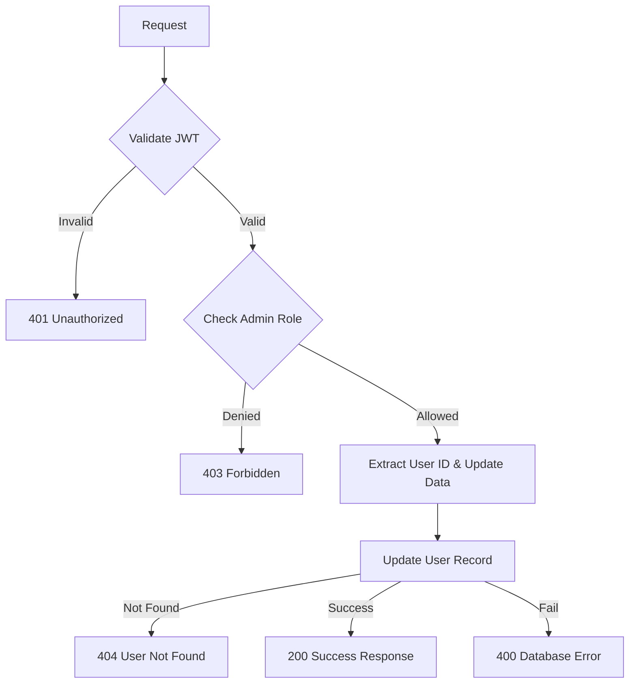
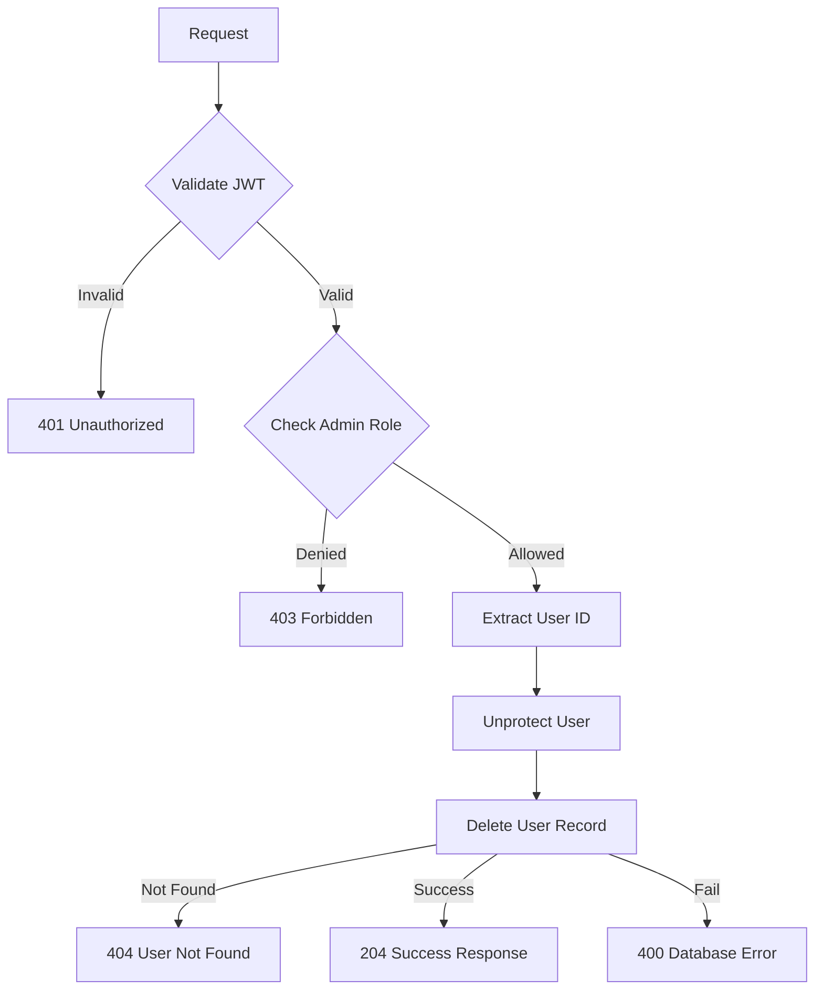
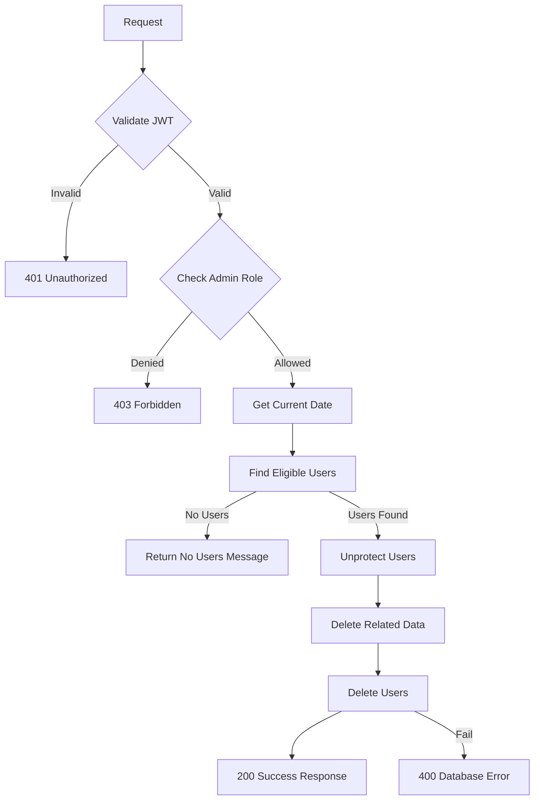
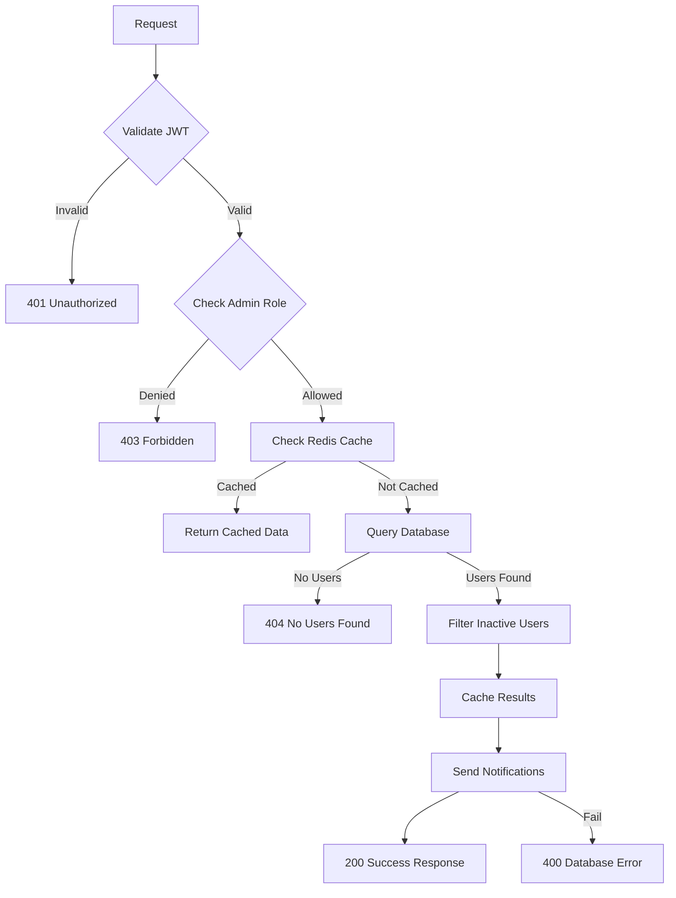

## Overview

The **Admin Service** provides comprehensive user management functionality for the Thryl platform, including user creation, reading, updating, deletion, and administrative operations. This service allows administrators to manage all user accounts, handle user lifecycle, and perform system-wide administrative tasks.

### Tech Stack
- **Backend**: Node.js, Express.js
- **Database**: PostgreSQL
- **Authentication**: JWT
- **Validation**: Joi
- **Authorization**: Role-based access control
- **Email**: AWS SES/Azure Email
- **Queue**: AWS SQS
- **Cache**: Redis

---

## System Architecture



---

## Database Schema

```mermaid
erDiagram
    users ||--o{ users : "creates_users"
    users ||--o{ users : "deletes_users"
    users ||--o{ user_notification : "receives_notifications"
    users ||--o{ team : "owns_teams"
    users ||--o{ team_member : "team_memberships"
    users ||--o{ follow : "follows_users"
    users ||--o{ follow : "followed_by_users"
    users ||--o{ block_user : "blocks_users"
    users ||--o{ block_user : "blocked_by_users"
    users ||--o{ mute_user : "mutes_users"
    users ||--o{ mute_user : "muted_by_users"
    users ||--o{ game_join : "joins_games"
    users ||--o{ follow_notification : "follow_notifications"
    users ||--o{ team_notification : "team_notifications"

    users {
        bigint id PK "Primary Key"
        text username "Unique username"
        text email "User email"
        text mobile "User mobile"
        text password "Hashed password"
        text full_name "User full name"
        text bio "User bio"
        date date_of_birth "Date of birth"
        text google_id "Google OAuth ID"
        text apple_id "Apple Sign-In ID"
        text profile_pic_url "Profile picture URL"
        text image_cover_url "Cover image URL"
        text video_url "Video URL"
        text device_token "Push notification token"
        smallint is_active "Account active status"
        smallint is_deleted "Soft delete flag"
        smallint is_protected "Protected account flag"
        smallint type "User type (1=player, 2=organizer, 3=admin)"
        smallint is_account_notification "Account notification preference"
        smallint is_team_invite_notification "Team invite notification preference"
        smallint is_start_follow_notification "Follow notification preference"
        smallint is_tournament_notification "Tournament notification preference"
        text organization_name "Organization name"
        text address "Address"
        text logo_url "Logo URL"
        text document_url "Document URL"
        text poc_name "Point of contact name"
        text poc_email "Point of contact email"
        text poc_phone "Point of contact phone"
        text website_url "Website URL"
        text facebook_url "Facebook URL"
        text instagram_url "Instagram URL"
        text twitter_url "Twitter URL"
        text linkedin_url "LinkedIn URL"
        text youtube_url "YouTube URL"
        text discord_url "Discord URL"
        smallint is_profile_completed "Profile completion status"
        smallint is_first_signup "First signup flag"
        text referral_code "Unique referral code"
        bigint referred_by_id FK "Referrer user ID"
        text app_version "App version"
        text flag "Additional flags"
        timestamptz created_at "Record creation time"
        timestamptz updated_at "Last update time"
        timestamptz last_login_at "Last login time"
        timestamptz logout_at "Logout time"
        timestamptz deletion_at "Deletion time"
        bigint created_by_id FK "User who created record"
        bigint deleted_by_id FK "User who deleted record"
    }
    
    user_notification {
        bigint id PK "Primary Key"
        bigint user_id FK "User who receives notification"
        text type "Notification type"
        smallint is_read "Read status flag"
        text title "Notification title"
        text description "Notification description"
        timestamptz created_at "Notification creation time"
        bigint created_by_id FK "User who created notification"
        smallint is_deleted "Soft delete flag"
        bigint deleted_by_id FK "User who deleted notification"
        timestamptz updated_at "Last update time"
    }
    
    team {
        bigint id PK "Primary Key"
        text name "Team name"
        text description "Team description"
        text logo_url "Team logo URL"
        bigint owner_id FK "Team owner"
        bigint created_by_id FK "User who created team"
        timestamptz created_at "Team creation time"
        smallint is_deleted "Soft delete flag"
        timestamptz updated_at "Last update time"
    }
    
    team_member {
        bigint id PK "Primary Key"
        bigint team_id FK "Team ID"
        bigint user_id FK "User ID"
        text role "Member role"
        timestamptz created_at "Member creation time"
        smallint is_deleted "Soft delete flag"
        timestamptz updated_at "Last update time"
    }
    
    follow {
        bigint id PK "Primary Key"
        bigint user_id FK "User being followed"
        bigint created_by_id FK "User who follows"
        timestamptz created_at "Follow creation time"
        smallint is_deleted "Soft delete flag"
        timestamptz updated_at "Last update time"
    }
    
    block_user {
        bigint id PK "Primary Key"
        bigint user_id FK "User being blocked"
        bigint created_by_id FK "User who blocks"
        timestamptz created_at "Block creation time"
        smallint is_deleted "Soft delete flag"
        timestamptz updated_at "Last update time"
    }
    
    mute_user {
        bigint id PK "Primary Key"
        bigint user_id FK "User being muted"
        bigint created_by_id FK "User who mutes"
        timestamptz created_at "Mute creation time"
        smallint is_deleted "Soft delete flag"
        timestamptz updated_at "Last update time"
    }
    
    game_join {
        bigint id PK "Primary Key"
        bigint game_id FK "Game being joined"
        bigint created_by_id FK "User who joins"
        text status "Join status"
        timestamptz created_at "Join creation time"
        smallint is_deleted "Soft delete flag"
        timestamptz updated_at "Last update time"
    }
    
    follow_notification {
        bigint id PK "Primary Key"
        bigint user_id FK "User who receives notification"
        bigint created_by_id FK "User who triggered notification"
        text type "Notification type"
        timestamptz created_at "Notification creation time"
        smallint is_deleted "Soft delete flag"
        timestamptz updated_at "Last update time"
    }
    
    team_notification {
        bigint id PK "Primary Key"
        bigint user_id FK "User who receives notification"
        bigint created_by_id FK "User who triggered notification"
        text type "Notification type"
        timestamptz created_at "Notification creation time"
        smallint is_deleted "Soft delete flag"
        timestamptz updated_at "Last update time"
    }
```



## Table Relationship Graph

```mermaid
graph TD
    A[users Table] -->|creates| B[users Table]
    A -->|deletes| B
    A -->|creates| C[user_notification Table]
    A -->|owns| D[team Table]
    A -->|member_of| E[team_member Table]
    A -->|follows| F[follow Table]
    A -->|blocks| G[block_user Table]
    A -->|mutes| H[mute_user Table]
    A -->|joins| I[game_join Table]
    A -->|receives| J[follow_notification Table]
    A -->|receives| K[team_notification Table]
    
    subgraph "users Table"
        A1[users.id PK]
        A2[users.created_by_id FK]
        A3[users.deleted_by_id FK]
    end
    
    subgraph "Related Tables"
        B1[user_notification.user_id FK]
        C1[team.owner_id FK]
        D1[team_member.user_id FK]
        E1[follow.user_id FK]
        F1[block_user.user_id FK]
        G1[mute_user.user_id FK]
        H1[game_join.created_by_id FK]
    end
    
    A1 -.->|references| B1
    A1 -.->|references| C1
    A1 -.->|references| D1
    A1 -.->|references| E1
    A1 -.->|references| F1
    A1 -.->|references| G1
    A1 -.->|references| H1
```



### Relationship Details

| Relationship | Type | Description | Foreign Key |
|--------------|------|-------------|-------------|
| users → users (creation) | One-to-Many | Admin can create multiple users | `users.created_by_id` |
| users → users (deletion) | One-to-Many | Admin can delete multiple users | `users.deleted_by_id` |
| users → user_notification | One-to-Many | User can receive multiple notifications | `user_notification.user_id` |
| users → team (ownership) | One-to-Many | User can own multiple teams | `team.owner_id` |
| users → team_member | One-to-Many | User can be member of multiple teams | `team_member.user_id` |
| users → follow (following) | One-to-Many | User can follow multiple users | `follow.created_by_id` |
| users → follow (followers) | One-to-Many | User can be followed by multiple users | `follow.user_id` |
| users → block_user (blocking) | One-to-Many | User can block multiple users | `block_user.created_by_id` |
| users → block_user (blocked) | One-to-Many | User can be blocked by multiple users | `block_user.user_id` |
| users → mute_user (muting) | One-to-Many | User can mute multiple users | `mute_user.created_by_id` |
| users → mute_user (muted) | One-to-Many | User can be muted by multiple users | `mute_user.user_id` |
| users → game_join | One-to-Many | User can join multiple games | `game_join.created_by_id` |
| users → follow_notification | One-to-Many | User can receive multiple follow notifications | `follow_notification.user_id` |
| users → team_notification | One-to-Many | User can receive multiple team notifications | `team_notification.user_id` |

### Index Information

| Table | Index Type | Indexed Fields | Purpose |
|-------|------------|----------------|---------|
| users | btree | `type, email` | Unique email per type |
| users | btree | `type, username` | Unique username per type |
| users | btree | `type, mobile` | Unique mobile per type |
| users | btree | `is_deleted` | Soft delete filtering |
| users | btree | `deletion_at` | Scheduled deletion queries |
| users | btree | `last_login_at` | Activity tracking |
| users | btree | `is_protected` | Protected user filtering |
| user_notification | btree | `user_id, created_at` | User notification queries |
| team | btree | `owner_id` | Team ownership queries |
| team_member | btree | `team_id, user_id` | Team membership queries |
| follow | btree | `user_id, created_by_id` | Follow relationship queries |
| block_user | btree | `user_id, created_by_id` | Block relationship queries |
| mute_user | btree | `user_id, created_by_id` | Mute relationship queries |

---

## Base URLs

| Environment   | URL                                 |
|---------------|-------------------------------------|
| Production    | `https://thryl-prod.com   ||    https://thryl-production.zapto.org`      |
| Staging       | `https://thryl-staging.zapto.org` |
| Development   | `http://localhost:3000  || http://localhost:3001`      |

---

## Authentication

All Admin Service APIs require JWT authentication. Include the token in the Authorization header:

```http
Authorization: Bearer <your-jwt-token>
```

---

## Authorization

| Role | Permissions |
|------|-------------|
| **Admin** | Full access (create, read, update, delete users, system operations) |

---

## API Reference

### Authentication
All endpoints require JWT token:
```
Authorization: Bearer <jwt-token>
```


### Complete API List

| # | Endpoint | Method | Purpose | Auth Required | Role Required |
|---|----------|--------|---------|---------------|---------------|
| 1 | `/create-user` | POST | Create new user | Yes | admin |
| 2 | `/read-all-users` | GET | Get all users with filtering | Yes | admin |
| 3 | `/update-user` | PUT | Update user by ID | Yes | admin |
| 4 | `/delete-user` | DELETE | Delete user by ID | Yes | admin |
| 5 | `/remove-deleted-user` | GET | Process scheduled user deletions | Yes | admin |
| 6 | `/activity-notification` | GET | Send notifications to inactive users | Yes | admin |

---

## Validation Schemas

### Create User Schema
```javascript
{
  email: Joi.string().email().required(),
  type: Joi.number().valid(1,2,3).required(),
  password: Joi.string().optional()
}
```

### Update User Schema
```javascript
{
  username: Joi.string().min(3).max(30),
  email: Joi.string().email(),
  mobile: Joi.string().pattern(/^[0-9+\s-]+$/),
  bio: Joi.string().max(500),
  full_name: Joi.string().max(100),
  date_of_birth: Joi.date(),
  profile_pic_url: Joi.string().uri(),
  image_cover_url: Joi.string().uri(),
  video_url: Joi.string().uri(),
  device_token: Joi.string(),
  is_account_notification: Joi.number().integer().valid(0, 1),
  is_team_invite_notification: Joi.number().integer().valid(0, 1),
  is_start_follow_notification: Joi.number().integer().valid(0, 1),
  is_tournament_notification: Joi.number().integer().valid(0, 1),
  address: Joi.string(),
  website_url: Joi.string().uri(),
  document_url: Joi.string().uri(),
  facebook_url: Joi.string().uri(),
  instagram_url: Joi.string().uri(),
  twitter_url: Joi.string().uri(),
  linkedin_url: Joi.string().uri(),
  youtube_url: Joi.string().uri(),
  discord_url: Joi.string().uri(),
  is_active: Joi.number().integer().valid(0, 1)
}
```

---

## API Endpoints

### 1. Create User

Creates a new user account with the provided details.

**Endpoint:** `POST /admin/create-user`

**Authorization:** Admin only

**Request Body:**
```json
{
  "email": "newuser@example.com",
  "type": 1,
  "password": "securepassword123"
}
```

**Success Response (201):**
```json
{
  "status": 1,
  "message": "User created successfully"
}
```

**Error Response (400):**
```json
{
  "status": 0,
  "message": "Invalid input data"
}
```

**Error Response (401):**
```json
{
  "status": 0,
  "message": "Unauthorized access"
}
```

**Error Response (403):**
```json
{
  "status": 0,
  "message": "Access denied. Admin role required."
}
```

**Error Response (409):**
```json
{
  "status": 0,
  "message": "User newuser@example.com already exists as a Player."
}
```

**DFD**:


#### Business Logic

1. **Input Validation**: Validates email format and user type
2. **Password Hashing**: Securely hashes password using bcrypt
3. **Organization Inheritance**: Inherits organization data from admin if admin is organization user
4. **Duplicate Prevention**: Prevents duplicate users with same email and type
5. **User Type Validation**: Ensures valid user type (1=player, 2=organizer, 3=admin)
6. **Email Notification**: Sends welcome email with login credentials

#### Database Operations

```sql
-- Check if user exists
WITH exists_check AS (SELECT 1 FROM users WHERE type = $1 AND email = $2 LIMIT 1), 
inserted AS (INSERT INTO users (type, email, created_by_id, password, organization_name, document_url, logo_url, website_url, facebook_url, instagram_url, twitter_url, linkedin_url, youtube_url, discord_url)
SELECT $1, $2, $3, $4, $5, $6, $7, $8, $9, $10, $11, $12, $13, $14 WHERE NOT EXISTS (SELECT * FROM exists_check) RETURNING *)
SELECT * FROM inserted;
```

#### Error Handling

- **Validation Errors**: Invalid email format or user type
- **Authentication Errors**: Missing or invalid JWT token
- **Authorization Errors**: Insufficient permissions
- **Conflict Errors**: User already exists with same email and type
- **Database Errors**: Connection issues or constraint violations

---

### 2. Read All Users

Retrieves all users with optional filtering by type and search functionality.

**Endpoint:** `GET /admin/read-all-users`

**Authorization:** Admin only

**Query Parameters:**
- `type` (optional): Filter by user type (1=player, 2=organizer, 3=admin)
- `keyword` (optional): Search by user ID or username
- `page` (optional): Page number (default: 1)
- `limit` (optional): Items per page (default: 10)

**Example Request:**
```http
GET /admin/read-all-users?type=1&keyword=john&page=1&limit=5
```

**Success Response (200):**
```json
{
  "status": 1,
  "data": [
    {
      "id": 123,
      "username": "john_doe",
      "email": "john@example.com",
      "mobile": "+919876543210",
      "type": 1,
      "full_name": "John Doe",
      "bio": "Gaming enthusiast",
      "date_of_birth": "1990-01-15",
      "profile_pic_url": "https://example.com/profile.jpg",
      "image_cover_url": "https://example.com/cover.jpg",
      "video_url": "https://example.com/video.mp4",
      "device_token": "fcm_token_here",
      "is_active": 1,
      "is_deleted": 0,
      "is_protected": 0,
      "is_account_notification": 1,
      "is_team_invite_notification": 1,
      "is_start_follow_notification": 1,
      "is_tournament_notification": 1,
      "address": "Mumbai, India",
      "website_url": "https://johndoe.com",
      "facebook_url": "https://facebook.com/johndoe",
      "instagram_url": "https://instagram.com/johndoe",
      "twitter_url": "https://twitter.com/johndoe",
      "linkedin_url": "https://linkedin.com/in/johndoe",
      "youtube_url": "https://youtube.com/johndoe",
      "discord_url": "https://discord.gg/johndoe",
      "is_profile_completed": 1,
      "is_first_signup": 0,
      "referral_code": "ABC123XY",
      "app_version": "2.0.0",
      "flag": "active",
      "created_at": "2024-01-15T10:30:00Z",
      "updated_at": "2024-01-15T10:30:00Z",
      "last_login_at": "2024-01-15T10:30:00Z",
      "logout_at": null,
      "deletion_at": null,
      "created_by_id": 456,
      "deleted_by_id": null
    }
  ]
}
```

**Error Response (400):**
```json
{
  "status": 0,
  "message": "Failed to retrieve users."
}
```

**DFD**:


#### Business Logic

1. **Authentication**: Validates admin authentication
2. **Authorization**: Ensures admin role access
3. **Type Filtering**: Optional filtering by user type
4. **Smart Search**: Automatically detects if keyword is numeric (ID) or text (username)
5. **Pagination**: Implements offset-based pagination
6. **Case-Insensitive Search**: Uses ILIKE for username search

#### Database Operations

```sql
-- Search by ID (if keyword is numeric)
SELECT * FROM users WHERE (type = $1 OR $1 IS NULL) AND (id = $2 OR $2 IS NULL) ORDER BY id DESC OFFSET $3 LIMIT $4;

-- Search by username (if keyword is text)
SELECT * FROM users WHERE (type = $1 OR $1 IS NULL) AND (username ILIKE $2 OR $2 IS NULL) ORDER BY id DESC OFFSET $3 LIMIT $4;
```

---

### 3. Update User

Updates an existing user's information.

**Endpoint:** `PUT /admin/update-user`

**Authorization:** Admin only

**Query Parameters:**
- `user_id` (required): ID of user to update

**Request Body:**
```json
{
  "username": "updated_username",
  "email": "updated@example.com",
  "mobile": "+919876543211",
  "full_name": "Updated Name",
  "bio": "Updated bio information",
  "date_of_birth": "1990-01-15",
  "profile_pic_url": "https://example.com/new-profile.jpg",
  "image_cover_url": "https://example.com/new-cover.jpg",
  "video_url": "https://example.com/new-video.mp4",
  "device_token": "new_fcm_token",
  "is_account_notification": 1,
  "is_team_invite_notification": 1,
  "is_start_follow_notification": 0,
  "is_tournament_notification": 1,
  "address": "New Address",
  "website_url": "https://newwebsite.com",
  "facebook_url": "https://facebook.com/newprofile",
  "instagram_url": "https://instagram.com/newprofile",
  "twitter_url": "https://twitter.com/newprofile",
  "linkedin_url": "https://linkedin.com/in/newprofile",
  "youtube_url": "https://youtube.com/newprofile",
  "discord_url": "https://discord.gg/newprofile",
  "is_active": 1
}
```

**Success Response (200):**
```json
{
  "status": 1,
  "data": {
    "id": 123,
    "username": "updated_username",
    "email": "updated@example.com",
    "mobile": "+919876543211",
    "full_name": "Updated Name",
    "bio": "Updated bio information",
    "date_of_birth": "1990-01-15",
    "profile_pic_url": "https://example.com/new-profile.jpg",
    "image_cover_url": "https://example.com/new-cover.jpg",
    "video_url": "https://example.com/new-video.mp4",
    "device_token": "new_fcm_token",
    "is_active": 1,
    "is_deleted": 0,
    "is_protected": 0,
    "type": 1,
    "is_account_notification": 1,
    "is_team_invite_notification": 1,
    "is_start_follow_notification": 0,
    "is_tournament_notification": 1,
    "address": "New Address",
    "website_url": "https://newwebsite.com",
    "facebook_url": "https://facebook.com/newprofile",
    "instagram_url": "https://instagram.com/newprofile",
    "twitter_url": "https://twitter.com/newprofile",
    "linkedin_url": "https://linkedin.com/in/newprofile",
    "youtube_url": "https://youtube.com/newprofile",
    "discord_url": "https://discord.gg/newprofile",
    "created_at": "2024-01-15T10:30:00Z",
    "updated_at": "2024-01-15T12:30:00Z",
    "last_login_at": "2024-01-15T10:30:00Z",
    "logout_at": null,
    "deletion_at": null,
    "created_by_id": 456,
    "deleted_by_id": null
  }
}
```

**Error Response (400):**
```json
{
  "status": 0,
  "message": "Invalid input data"
}
```

**Error Response (404):**
```json
{
  "status": 0,
  "message": "User not found or has been deleted"
}
```

**DFD**:


#### Business Logic

1. **Authorization**: Ensures only admin users can update users
2. **Partial Updates**: Supports updating specific fields only
3. **Existence Check**: Verifies user exists and is not soft-deleted
4. **Timestamp Update**: Automatically updates the `updated_at` timestamp
5. **Data Validation**: Validates all input fields before update

#### Database Operations

```sql
-- Update user with partial updates
UPDATE users SET
    created_by_id = COALESCE($1, created_by_id),
    deleted_by_id = COALESCE($2, deleted_by_id),
    deletion_at = COALESCE($3, deletion_at),
    type = COALESCE($4, type),
    username = COALESCE($5, username),
    flag = COALESCE($6, flag),
    email = COALESCE($7, email),
    mobile = COALESCE($8, mobile),
    password = COALESCE($9, password),
    bio = COALESCE($10, bio),
    full_name = COALESCE($11, full_name),
    date_of_birth = COALESCE($12, date_of_birth),
    google_id = COALESCE($13, google_id),
    profile_pic_url = COALESCE($14, profile_pic_url),
    apple_id = COALESCE($15, apple_id),
    image_cover_url = COALESCE($16, image_cover_url),
    video_url = COALESCE($17, video_url),
    device_token = COALESCE($18, device_token),
    is_account_notification = COALESCE($19, is_account_notification),
    is_team_invite_notification = COALESCE($20, is_team_invite_notification),
    is_start_follow_notification = COALESCE($21, is_start_follow_notification),
    is_tournament_notification = COALESCE($22, is_tournament_notification),
    address = COALESCE($23, address),
    document_url = COALESCE($24, document_url),
    logo_url = COALESCE($25, logo_url),
    website_url = COALESCE($26, website_url),
    facebook_url = COALESCE($27, facebook_url),
    instagram_url = COALESCE($28, instagram_url),
    twitter_url = COALESCE($29, twitter_url),
    linkedin_url = COALESCE($30, linkedin_url),
    youtube_url = COALESCE($31, youtube_url),
    discord_url = COALESCE($32, discord_url),
    poc_name = COALESCE($33, poc_name),
    poc_email = COALESCE($34, poc_email),
    poc_phone = COALESCE($35, poc_phone),
    organization_name = COALESCE($36, organization_name),
    is_active = COALESCE($37, is_active),
    updated_at = NOW()
WHERE id = $38 AND is_deleted IS DISTINCT FROM 1
RETURNING *;
```

---

### 4. Delete User

Permanently deletes a user and all associated data.

**Endpoint:** `DELETE /admin/delete-user`

**Authorization:** Admin only

**Query Parameters:**
- `user_id` (required): ID of user to delete

**Example Request:**
```http
DELETE /admin/delete-user?user_id=123
```

**Success Response (204):**
```json
{
  "status": 1
}
```

**Error Response (400):**
```json
{
  "status": 0,
  "message": "Failed to delete user"
}
```

**Error Response (404):**
```json
{
  "status": 0,
  "message": "User not found"
}
```

**DFD**:


#### Business Logic

1. **Authorization**: Ensures only admin users can delete users
2. **User Unprotection**: Removes protection flag before deletion
3. **Permanent Deletion**: Completely removes user from database
4. **Cascade Cleanup**: Removes all associated data (notifications, relationships, etc.)

#### Database Operations

```sql
-- Unprotect user first
UPDATE users SET is_protected = 0 WHERE id = $1;

-- Delete user permanently
DELETE FROM users WHERE id = $1;
```

---

### 5. Remove Deleted Users

Automatically removes users marked for deletion on the current date.

**Endpoint:** `GET /admin/remove-deleted-user`

**Authorization:** Admin only

**Example Request:**
```http
GET /admin/remove-deleted-user
```

**Success Response (200):**
```json
{
  "status": 1,
  "message": "Successfully deleted 5 users and their associated data."
}
```

**Success Response (200) - No users to delete:**
```json
{
  "status": 1,
  "message": "No users eligible for deletion today."
}
```

**Error Response (400):**
```json
{
  "status": 0,
  "message": "Failed to process user deletions"
}
```

**DFD**:


#### Business Logic

1. **Scheduled Deletion**: Processes users marked for deletion on current date
2. **Bulk Operations**: Handles multiple user deletions efficiently
3. **Data Cleanup**: Removes all associated data before user deletion
4. **Team Cleanup**: Handles team ownership and membership cleanup
5. **Relationship Cleanup**: Removes follows, blocks, mutes, and notifications

#### Database Operations

```sql
-- Find users eligible for deletion
SELECT id FROM users WHERE deletion_at = $1 AND is_deleted = $2;

-- Find affected teams
SELECT id FROM team WHERE owner_id = ANY($1) OR created_by_id = ANY($1);

-- Unprotect users
UPDATE users SET is_protected = 0 WHERE id = ANY($1);

-- Delete related data in parallel
DELETE FROM users WHERE id = ANY($1);
DELETE FROM user_notification WHERE user_id = ANY($1);
DELETE FROM block_user WHERE user_id = ANY($1);
DELETE FROM follow WHERE user_id = ANY($1) OR created_by_id = ANY($1);
DELETE FROM follow_notification WHERE user_id = ANY($1) OR created_by_id = ANY($1);
DELETE FROM mute_user WHERE user_id = ANY($1) OR created_by_id = ANY($1);
DELETE FROM game_join WHERE created_by_id = ANY($1);
DELETE FROM team WHERE id = ANY($1);
DELETE FROM team_member WHERE team_id = ANY($1) OR user_id = ANY($2);
DELETE FROM team_notification WHERE user_id = ANY($1) OR created_by_id = ANY($1);
```

---

### 6. Activity Notification

Sends notifications to inactive users who haven't logged in for 7 days.

**Endpoint:** `GET /admin/activity-notification`

**Authorization:** Admin only

**Example Request:**
```http
GET /admin/activity-notification
```

**Success Response (200):**
```json
{
  "status": 1,
  "data": [
    {
      "id": 123,
      "username": "inactive_user",
      "email": "inactive@example.com",
      "last_login_at": "2024-01-08T10:30:00Z",
      "device_token": "fcm_token_here",
      "is_account_notification": 1
    }
  ]
}
```

**Error Response (400):**
```json
{
  "status": 0,
  "message": "Failed to process activity notifications"
}
```

**Error Response (404):**
```json
{
  "status": 0,
  "message": "No users found"
}
```

**DFD**:


#### Business Logic

1. **Cache Management**: Uses Redis to cache inactive users for 24 hours
2. **Activity Filtering**: Identifies users inactive for 7+ days
3. **Notification Prevention**: Prevents duplicate notifications on same day
4. **Multi-Channel Notifications**: Sends both in-app and push notifications
5. **Queue Processing**: Uses SQS for asynchronous notification delivery

#### Database Operations

```sql
-- Get all users with login history and email
SELECT * FROM users WHERE last_login_at IS NOT NULL AND email IS NOT NULL;

-- Check for existing notification today
SELECT * FROM user_notification WHERE user_id = $1 AND DATE(created_at) = CURRENT_DATE;

-- Insert notification
INSERT INTO user_notification (user_id, is_read, title, description, type) VALUES ($1, $2, $3, $4, $5) RETURNING *;
```

---

## Rate Limiting

| Endpoint | Rate Limit | Window |
|----------|------------|--------|
| All Admin APIs | 50 requests | 15 minutes |

---

## Security Considerations

### Authentication
- JWT token validation on all endpoints
- Token expiration handling
- Secure token transmission

### Authorization
- Role-based access control (RBAC)
- Admin-only operations for all endpoints
- Strict permission validation

### Input Validation
- Request body validation using Joi schemas
- Query parameter validation
- SQL injection prevention through parameterized queries
- Email format validation

### Data Protection
- Password hashing using bcrypt
- Sensitive data encryption
- Secure file URL handling
- Input sanitization

---

## Business Rules

### User Creation
1. Only admin users can create new users
2. Email must be unique per user type
3. Password is automatically hashed
4. Organization data is inherited from admin if applicable
5. Welcome email is sent with login credentials

### User Management
1. Only admin users can read, update, and delete users
2. Partial updates are supported for all user fields
3. User deletion is permanent and removes all associated data
4. Protected users cannot be deleted without unprotection

### Scheduled Operations
1. Users marked for deletion are processed on scheduled date
2. Bulk deletion operations handle related data cleanup
3. Activity notifications are sent to inactive users
4. Cache is used to optimize repeated operations

### Data Integrity
1. Foreign key relationships are maintained
2. Cascade deletion handles related data
3. Soft delete flags prevent accidental data loss
4. Audit trails track user creation and modification

---

## Monitoring & Logging

### Metrics to Monitor
- API response times
- Error rates by endpoint
- Database query performance
- User creation/deletion rates
- Notification delivery success rates
- Cache hit/miss ratios

### Logging
- Request/response logging
- Error logging with stack traces
- Database operation logging
- User lifecycle event logging
- Notification delivery logging

### Alerts
- High error rates (>5%)
- Slow response times (>2s)
- Database connection issues
- Failed user operations
- Notification delivery failures

---

## Integration Examples

### Frontend Integration

```javascript
// Create a new user
const createUser = async (userData) => {
  const response = await fetch('/api/v1/admin/create-user', {
    method: 'POST',
    headers: {
      'Content-Type': 'application/json',
      'Authorization': `Bearer ${token}`
    },
    body: JSON.stringify(userData)
  });
  return response.json();
};

// Get all users with filtering
const getUsers = async (type = null, keyword = null, page = 1, limit = 10) => {
  const params = new URLSearchParams({
    page: page.toString(),
    limit: limit.toString()
  });
  if (type) params.append('type', type);
  if (keyword) params.append('keyword', keyword);
  
  const response = await fetch(`/api/v1/admin/read-all-users?${params}`, {
    headers: {
      'Authorization': `Bearer ${token}`
    }
  });
  return response.json();
};

// Update a user
const updateUser = async (userId, updateData) => {
  const response = await fetch(`/api/v1/admin/update-user?user_id=${userId}`, {
    method: 'PUT',
    headers: {
      'Content-Type': 'application/json',
      'Authorization': `Bearer ${token}`
    },
    body: JSON.stringify(updateData)
  });
  return response.json();
};

// Delete a user
const deleteUser = async (userId) => {
  const response = await fetch(`/api/v1/admin/delete-user?user_id=${userId}`, {
    method: 'DELETE',
    headers: {
      'Authorization': `Bearer ${token}`
    }
  });
  return response.json();
};

// Process scheduled deletions
const processDeletions = async () => {
  const response = await fetch('/api/v1/admin/remove-deleted-user', {
    headers: {
      'Authorization': `Bearer ${token}`
    }
  });
  return response.json();
};

// Send activity notifications
const sendActivityNotifications = async () => {
  const response = await fetch('/api/v1/admin/activity-notification', {
    headers: {
      'Authorization': `Bearer ${token}`
    }
  });
  return response.json();
};
```

### Error Handling

```javascript
const handleAdminOperation = async (operation) => {
  try {
    const result = await operation();
    if (result.status === 1) {
      console.log('Operation successful:', result.data || result.message);
      return result.data || result.message;
    } else {
      console.error('Operation failed:', result.message);
      throw new Error(result.message);
    }
  } catch (error) {
    console.error('Admin operation failed:', error.message);
    // Handle different error types
    if (error.message.includes('Unauthorized')) {
      // Handle authentication error
    } else if (error.message.includes('Access denied')) {
      // Handle authorization error
    } else if (error.message.includes('not found')) {
      // Handle not found error
    } else if (error.message.includes('already exists')) {
      // Handle conflict error
    } else {
      // Handle general error
    }
  }
};
```

---

## Use Cases

### 1. User Management
- Admins create new user accounts
- Manage user profiles and settings
- Handle user lifecycle operations
- Monitor user activity and engagement

### 2. System Administration
- Bulk user operations
- Scheduled maintenance tasks
- System-wide notifications
- Data cleanup and optimization

### 3. User Support
- Account recovery and restoration
- Profile management assistance
- Notification management
- Activity monitoring and intervention

### 4. Compliance & Security
- User data management
- Account deletion processing
- Activity tracking and reporting
- Security monitoring and alerts

---

## Performance Considerations

### Database Optimization
- Indexes on `type`, `email`, `username`, and `is_deleted` for fast lookups
- B-tree indexes on `deletion_at` and `last_login_at` for scheduled operations
- Efficient pagination with offset-based queries
- Optimized bulk operations for scheduled deletions

### Caching Strategy
- Redis cache for inactive user queries with 24-hour TTL
- Cache invalidation on user updates
- Optimized cache keys for repeated queries
- Memory-efficient data structures

### Query Optimization
- Use parameterized queries for security
- Limit result sets with pagination
- Optimize bulk deletion operations
- Efficient soft delete handling

---

## Testing Scenarios

### Unit Tests
- User creation functionality
- User update functionality
- User deletion functionality
- Search and pagination
- Error handling for invalid inputs

### Integration Tests
- End-to-end user management flow
- Authentication and authorization
- Database consistency
- API response validation

### Performance Tests
- Load testing with multiple concurrent users
- Database query performance
- Bulk operation performance
- Memory usage optimization

### Security Tests
- SQL injection prevention
- JWT token validation
- Role-based access control
- Input sanitization
- Password hashing verification

---
