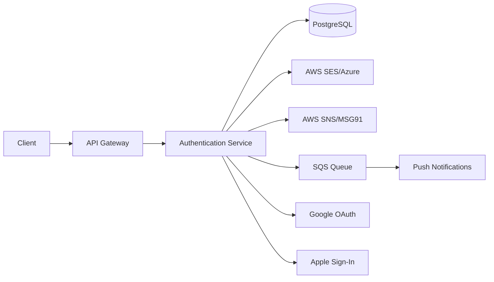
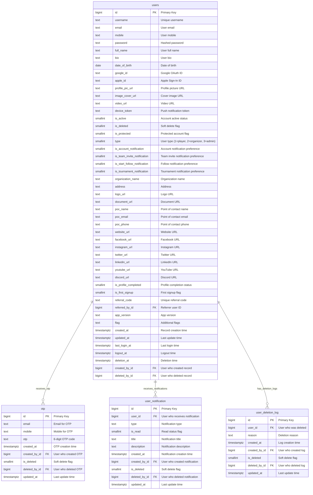
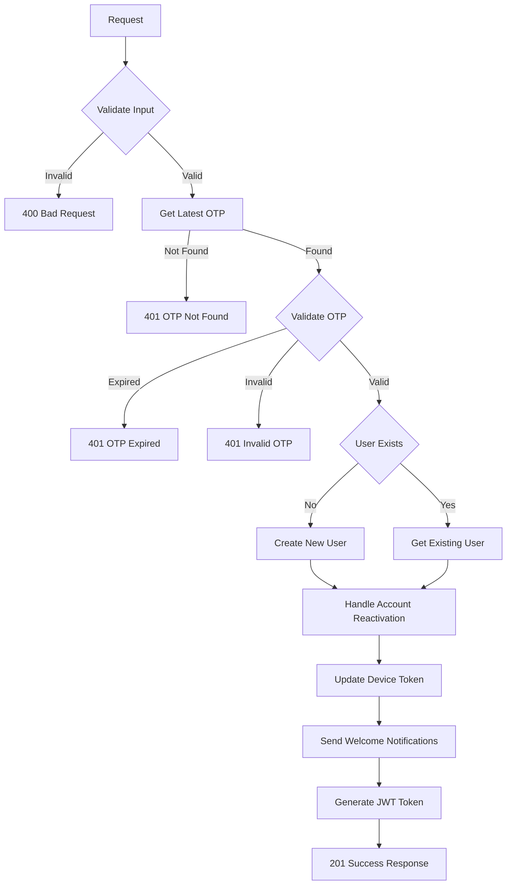
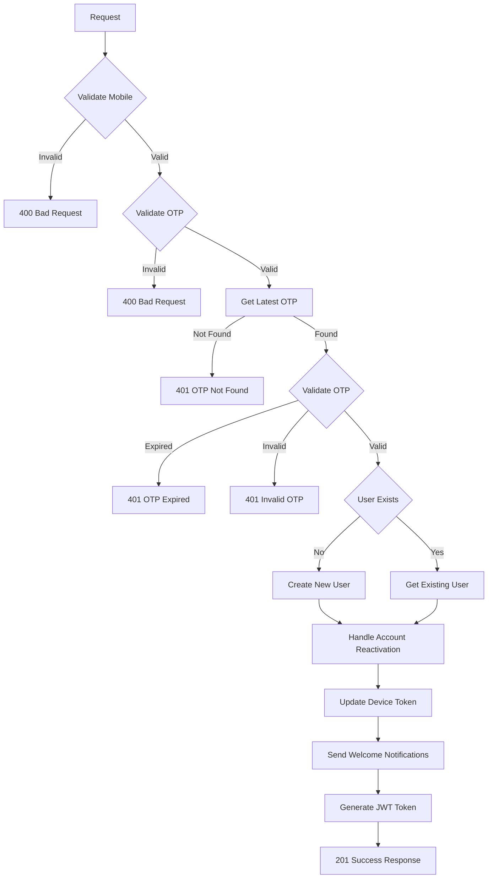
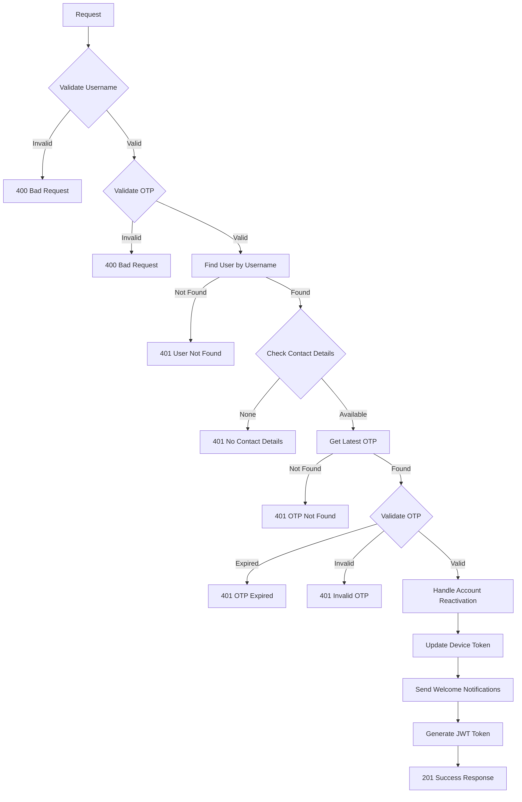
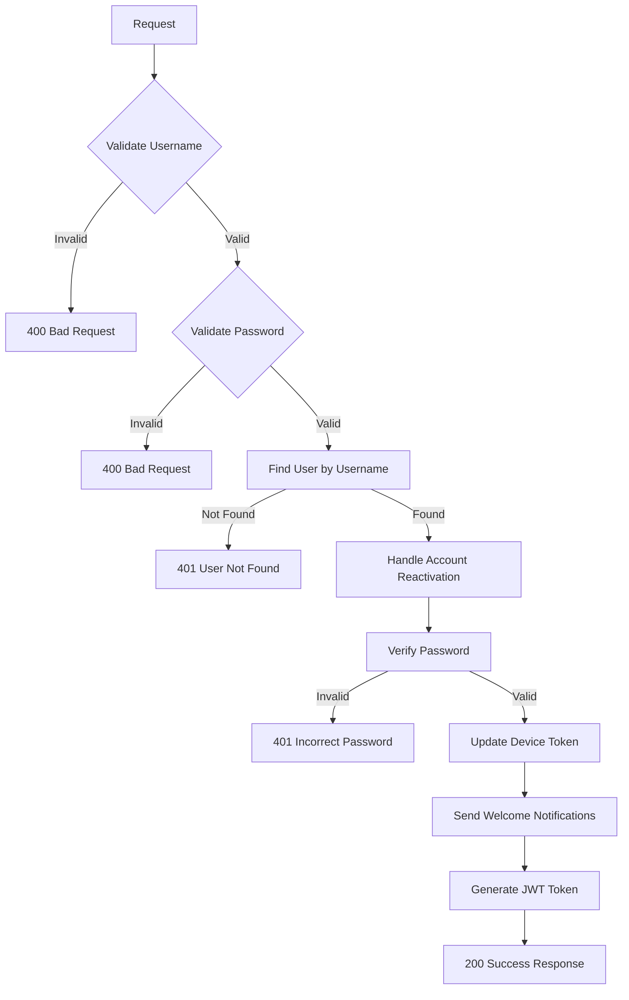
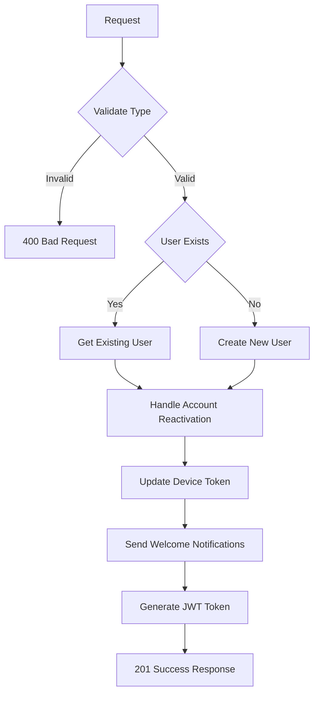
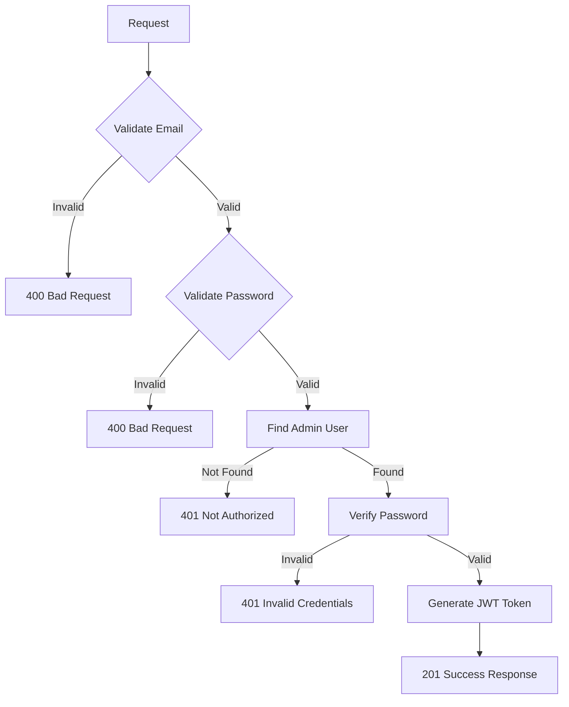

## Overview

The **Authentication Service** provides comprehensive user authentication and authorization functionality for the Thryl platform, supporting multiple login methods including OTP-based authentication, password-based login, and social media integration (Google, Apple).

### Tech Stack
- **Backend**: Node.js, Express.js
- **Database**: PostgreSQL
- **Authentication**: JWT, bcrypt
- **Social Login**: Google OAuth, Apple Sign-In
- **Email**: AWS SES, Azure Email
- **SMS**: AWS SNS, MSG91
- **Queue**: AWS SQS
- **Validation**: Joi

---

## System Architecture



---

## Database Schema



### Relationship Details

| Relationship | Type | Description | Foreign Key |
|--------------|------|-------------|-------------|
| users → otp | One-to-Many | User can have multiple OTP records | `otp.created_by_id` |
| users → user_notification | One-to-Many | User can receive multiple notifications | `user_notification.user_id` |
| users → user_deletion_log | One-to-Many | User can have multiple deletion logs | `user_deletion_log.user_id` |
| users → users (referral) | One-to-Many | User can refer multiple users | `users.referred_by_id` |

### Index Information

| Table | Index Type | Indexed Fields | Purpose |
|-------|------------|----------------|---------|
| users | btree | `type, username` | Unique username per type |
| users | btree | `type, email` | Unique email per type |
| users | btree | `type, mobile` | Unique mobile per type |
| users | btree | `referral_code` | Unique referral code |
| users | btree | `google_id` | Google OAuth lookup |
| users | btree | `apple_id` | Apple Sign-In lookup |
| users | btree | `is_deleted` | Soft delete filtering |
| users | gin | `full_name` | Full-text search |
| users | gin | `username` | Full-text search |
| users | gin | `organization_name` | Full-text search |
| users | gin | `poc_name` | Full-text search |
| otp | btree | `otp, email, mobile` | OTP validation |
| user_notification | btree | `user_id, is_read` | Notification filtering |
| user_deletion_log | btree | `user_id` | Deletion history |

---

## API Reference

### Authentication
Most endpoints require JWT token:
```
Authorization: Bearer <jwt-token>
```

## Base URLs

| Environment   | URL                                 |
|---------------|-------------------------------------|
| Production    | `https://thryl-prod.com   ||    https://thryl-production.zapto.org`      |
| Staging       | `https://thryl-staging.zapto.org` |
| Development   | `http://localhost:3000  || http://localhost:3001`      |

---

### Complete API List

| # | Endpoint | Method | Purpose | Auth Required | Role Required |
|---|----------|--------|---------|---------------|---------------|
| 1 | `/login-otp-email` | POST | Login with email OTP | No | None |
| 2 | `/login-otp-mobile` | POST | Login with mobile OTP | No | None |
| 3 | `/login-otp-username` | POST | Login with username OTP | No | None |
| 4 | `/login-username-password` | POST | Login with username/password | No | None |
| 5 | `/login-google` | POST | Login with Google OAuth | No | None |
| 6 | `/login-email-password` | POST | Admin login with email/password | No | None |
| 7 | `/login-apple` | POST | Login with Apple Sign-In | No | None |

---

## API 1: Login with Email OTP

**Endpoint**: `POST /login-otp-email`

**Purpose**: Authenticate user using email and OTP verification

**Request**:
```json
{
  "email": "user@example.com",
  "otp": "123456",
  "device_token": "fcm_token_here",
  "type": 1
}
```

**Success Response** (201):
```json
{
  "status": 1,
  "token": "eyJhbGciOiJIUzI1NiIsInR5cCI6IkpXVCJ9...",
  "user_type": 1,
  "timestamp": "2024-01-15T10:30:00.000Z"
}
```

**Failure Responses**:

#### 400 - Invalid email format
```json
{
  "status": 0,
  "message": "Email must be a valid email address",
  "error_code": "VALIDATION_ERROR"
}
```

#### 400 - Invalid OTP format
```json
{
  "status": 0,
  "message": "OTP must be 6 digits long",
  "error_code": "VALIDATION_ERROR"
}
```

#### 401 - OTP not found
```json
{
  "status": 0,
  "message": "OTP not found.",
  "error_code": "UNAUTHORIZED"
}
```

#### 401 - OTP expired
```json
{
  "status": 0,
  "message": "Your OTP has expired. Please request a new one to continue.",
  "error_code": "UNAUTHORIZED"
}
```

#### 401 - Invalid OTP
```json
{
  "status": 0,
  "message": "The OTP you entered is incorrect. Please try again or request a new one.",
  "error_code": "UNAUTHORIZED"
}
```

**DFD**:


**Instructions & Business Logic**:
- Email must be valid format
- OTP must be exactly 6 digits
- Type must be provided (1=player, 2=organizer, 3=admin)
- Device token is optional
- OTP expires after 5 minutes
- Special number +919033385088 always accepts OTP '123456'
- If user doesn't exist, creates new user account
- Reactivates account if previously deleted
- Updates device token if different
- Sends welcome notifications via email and push
- Generates encrypted JWT token

**Database Operations**:
- `SELECT` from `otp` to get latest OTP
- `SELECT` from `users` to find existing user
- `INSERT` into `users` if new user
- `UPDATE` users for account reactivation
- `UPDATE` users for device token

---

## API 2: Login with Mobile OTP

**Endpoint**: `POST /login-otp-mobile`

**Purpose**: Authenticate user using mobile number and OTP verification

**Request**:
```json
{
  "mobile": "+919876543210",
  "otp": "123456",
  "device_token": "fcm_token_here",
  "type": 1
}
```

**Success Response** (201):
```json
{
  "status": 1,
  "token": "eyJhbGciOiJIUzI1NiIsInR5cCI6IkpXVCJ9...",
  "user_type": 1
}
```

**Failure Responses**:

#### 400 - Invalid mobile format
```json
{
  "status": 0,
  "message": "Mobile number must be a valid format with country code (e.g., +917881125100).",
  "error_code": "VALIDATION_ERROR"
}
```

#### 400 - Invalid OTP format
```json
{
  "status": 0,
  "message": "OTP must be 6 digits long",
  "error_code": "VALIDATION_ERROR"
}
```

#### 401 - OTP not found
```json
{
  "status": 0,
  "message": "OTP not found.",
  "error_code": "UNAUTHORIZED"
}
```

#### 401 - OTP expired
```json
{
  "status": 0,
  "message": "Your OTP has expired. Please request a new one to continue.",
  "error_code": "UNAUTHORIZED"
}
```

#### 401 - Invalid OTP
```json
{
  "status": 0,
  "message": "The OTP you entered is incorrect. Please try again or request a new one.",
  "error_code": "UNAUTHORIZED"
}
```

**DFD**:


**Instructions & Business Logic**:
- Mobile must be in format: +91XXXXXXXXXX
- OTP must be exactly 6 digits
- Type must be provided (1=player, 2=organizer, 3=admin)
- Device token is optional
- OTP expires after 5 minutes
- Special number +919033385088 always accepts OTP '123456'
- If user doesn't exist, creates new user account
- Reactivates account if previously deleted
- Updates device token if different
- Sends welcome notifications via email and push
- Generates encrypted JWT token

**Database Operations**:
- `SELECT` from `otp` to get latest OTP
- `SELECT` from `users` to find existing user
- `INSERT` into `users` if new user
- `UPDATE` users for account reactivation
- `UPDATE` users for device token

---

## API 3: Login with Username OTP

**Endpoint**: `POST /login-otp-username`

**Purpose**: Authenticate user using username and OTP verification

**Request**:
```json
{
  "username": "alice",
  "otp": "123456",
  "device_token": "fcm_token_here",
  "type": 1
}
```

**Success Response** (201):
```json
{
  "status": 1,
  "token": "eyJhbGciOiJIUzI1NiIsInR5cCI6IkpXVCJ9...",
  "user_type": 1
}
```

**Failure Responses**:

#### 400 - Missing username
```json
{
  "status": 0,
  "message": "Username is required.",
  "error_code": "VALIDATION_ERROR"
}
```

#### 400 - Invalid OTP format
```json
{
  "status": 0,
  "message": "OTP must be 6 digits long",
  "error_code": "VALIDATION_ERROR"
}
```

#### 401 - User not found
```json
{
  "status": 0,
  "message": "User not found.",
  "error_code": "UNAUTHORIZED"
}
```

#### 401 - No contact details
```json
{
  "status": 0,
  "message": "No contact details available.",
  "error_code": "UNAUTHORIZED"
}
```

#### 401 - OTP not found
```json
{
  "status": 0,
  "message": "OTP not found.",
  "error_code": "UNAUTHORIZED"
}
```

#### 401 - OTP expired
```json
{
  "status": 0,
  "message": "Your OTP has expired. Please request a new one to continue.",
  "error_code": "UNAUTHORIZED"
}
```

#### 401 - Invalid OTP
```json
{
  "status": 0,
  "message": "The OTP you entered is incorrect. Please try again or request a new one.",
  "error_code": "UNAUTHORIZED"
}
```

**DFD**:


**Instructions & Business Logic**:
- Username is case-insensitive
- OTP must be exactly 6 digits
- Type must be provided (1=player, 2=organizer, 3=admin)
- Device token is optional
- Finds user by username and type
- Requires email or mobile to be available
- OTP expires after 5 minutes
- Reactivates account if previously deleted
- Updates device token if different
- Sends welcome notifications
- Generates encrypted JWT token

**Database Operations**:
- `SELECT` from `users` to find user by username
- `SELECT` from `otp` to get latest OTP
- `UPDATE` users for account reactivation
- `UPDATE` users for device token

---

## API 4: Login with Username and Password

**Endpoint**: `POST /login-username-password`

**Purpose**: Authenticate user using username and password

**Request**:
```json
{
  "username": "alice",
  "password": "securepassword123",
  "device_token": "fcm_token_here",
  "type": 1
}
```

**Success Response** (200):
```json
{
  "status": 1,
  "token": "eyJhbGciOiJIUzI1NiIsInR5cCI6IkpXVCJ9...",
  "user_type": 1
}
```

**Failure Responses**:

#### 400 - Missing username
```json
{
  "status": 0,
  "message": "Username is required.",
  "error_code": "VALIDATION_ERROR"
}
```

#### 400 - Missing password
```json
{
  "status": 0,
  "message": "Password is required.",
  "error_code": "VALIDATION_ERROR"
}
```

#### 401 - User not found
```json
{
  "status": 0,
  "message": "User not found.",
  "error_code": "UNAUTHORIZED"
}
```

#### 401 - Incorrect password
```json
{
  "status": 0,
  "message": "Incorrect password provided.",
  "error_code": "UNAUTHORIZED"
}
```

**DFD**:


**Instructions & Business Logic**:
- Username is case-insensitive
- Password is required
- Type must be provided (1=player, 2=organizer, 3=admin)
- Device token is optional
- Finds user by username and type
- Password is verified using bcrypt
- Reactivates account if previously deleted
- Updates device token if different
- Sends welcome notifications
- Generates encrypted JWT token

**Database Operations**:
- `SELECT` from `users` to find user by username
- `UPDATE` users for account reactivation
- `UPDATE` users for device token

---

## API 5: Login with Google OAuth

**Endpoint**: `POST /login-google`

**Purpose**: Authenticate user using Google OAuth credentials

**Request**:
```json
{
  "email": "user@gmail.com",
  "google_id": "google_oauth_id_here",
  "device_token": "fcm_token_here",
  "type": 1
}
```

**Success Response** (201):
```json
{
  "status": 1,
  "data": {
    "id": 123,
    "email": "user@gmail.com",
    "google_id": "google_oauth_id_here",
    "username": "user123",
    "full_name": "John Doe",
    "type": 1,
    "is_first_signup": 1
  },
  "token": "eyJhbGciOiJIUzI1NiIsInR5cCI6IkpXVCJ9...",
  "user_type": 1
}
```

**Failure Responses**:

#### 400 - Missing type
```json
{
  "status": 0,
  "message": "Type is required.",
  "error_code": "VALIDATION_ERROR"
}
```

#### 400 - Service error
```json
{
  "status": 0,
  "message": "Error during Google login process.",
  "error_code": "INTERNAL_ERROR"
}
```

**DFD**:


**Instructions & Business Logic**:
- Email and google_id are optional (can be null)
- Type must be provided (1=player, 2=organizer, 3=admin)
- Device token is optional
- Checks for existing user by email or google_id
- If user exists, reactivates account and updates device token
- If user doesn't exist, creates new user with Google credentials
- Generates unique referral code for new users
- Sets is_first_signup flag for new users
- Sends welcome notifications
- Generates encrypted JWT token

**Database Operations**:
- `SELECT` from `users` to find existing user
- `INSERT` into `users` if new user
- `UPDATE` users for account reactivation
- `UPDATE` users for device token

---

## API 6: Admin Login with Email and Password

**Endpoint**: `POST /login-email-password`

**Purpose**: Authenticate admin user using email and password

**Request**:
```json
{
  "email": "admin@thryl.io",
  "password": "adminpassword123",
  "type": 3
}
```

**Success Response** (201):
```json
{
  "status": 1,
  "token": "eyJhbGciOiJIUzI1NiIsInR5cCI6IkpXVCJ9...",
  "user_type": 3
}
```

**Failure Responses**:

#### 400 - Missing email
```json
{
  "status": 0,
  "message": "Email is required.",
  "error_code": "VALIDATION_ERROR"
}
```

#### 400 - Missing password
```json
{
  "status": 0,
  "message": "Password is required.",
  "error_code": "VALIDATION_ERROR"
}
```

#### 401 - User not authorized
```json
{
  "status": 0,
  "message": "user not authorized to access",
  "error_code": "UNAUTHORIZED"
}
```

#### 401 - Invalid credentials
```json
{
  "status": 0,
  "message": "Invalid credentials.",
  "error_code": "UNAUTHORIZED"
}
```

**DFD**:


**Instructions & Business Logic**:
- Email must be valid format
- Password is required
- Type must be provided (typically 3 for admin)
- Email is case-insensitive
- Finds user by email and type
- Excludes deleted users (is_deleted != 1)
- Password is verified using bcrypt
- Generates encrypted JWT token
- No device token updates or welcome notifications

**Database Operations**:
- `SELECT` from `users` to find admin user by email

---

## API 7: Login with Apple Sign-In

**Endpoint**: `POST /login-apple`

**Purpose**: Authenticate user using Apple Sign-In credentials

**Request**:
```json
{
  "email": "user@privaterelay.appleid.com",
  "apple_id": "apple_signin_id_here",
  "device_token": "fcm_token_here",
  "type": 1,
  "full_name": "John Doe"
}
```

**Success Response** (201):
```json
{
  "status": 1,
  "data": {
    "id": 123,
    "email": "user@privaterelay.appleid.com",
    "apple_id": "apple_signin_id_here",
    "full_name": "John Doe",
    "username": "user123",
    "type": 1,
    "is_first_signup": 1
  },
  "token": "eyJhbGciOiJIUzI1NiIsInR5cCI6IkpXVCJ9...",
  "user_type": 1
}
```

**Failure Responses**:

#### 400 - Missing type
```json
{
  "status": 0,
  "message": "Type is required.",
  "error_code": "VALIDATION_ERROR"
}
```

#### 400 - Service error
```json
{
  "status": 0,
  "message": "Error during Apple login process.",
  "error_code": "INTERNAL_ERROR"
}
```

**DFD**:


**Instructions & Business Logic**:
- Email, apple_id, and full_name are optional (can be null)
- Type must be provided (1=player, 2=organizer, 3=admin)
- Device token is optional
- Checks for existing user by email or apple_id
- If user exists, reactivates account and updates device token
- If user doesn't exist, creates new user with Apple credentials
- Generates unique referral code for new users
- Sets is_first_signup flag for new users
- Sends welcome notifications
- Generates encrypted JWT token

**Database Operations**:
- `SELECT` from `users` to find existing user
- `INSERT` into `users` if new user
- `UPDATE` users for account reactivation
- `UPDATE` users for device token

---

## Error Handling

### Common Error Codes

| Code | Description |
|------|-------------|
| 400 | Bad Request - Invalid input data |
| 401 | Unauthorized - Invalid credentials or OTP |
| 500 | Internal Server Error - Server error |

### Error Response Format
```json
{
  "status": 0,
  "message": "Error description",
  "error_code": "ERROR_TYPE"
}
```

---

## Rate Limiting

- **OTP Login APIs**: 5 requests per minute per IP
- **Password Login APIs**: 10 requests per minute per IP
- **Social Login APIs**: 20 requests per minute per IP

---

## Security Considerations

1. **JWT Authentication**: All successful logins return encrypted JWT tokens
2. **Password Hashing**: Passwords stored using bcrypt with salt
3. **OTP Security**: OTP expires after 5 minutes, rate limited
4. **Input Validation**: All inputs validated using Joi schemas
5. **Account Protection**: Protected accounts cannot be deleted
6. **Soft Delete**: Users are soft deleted, can be reactivated
7. **Device Token Management**: Device tokens updated on login
8. **Social Login Security**: OAuth tokens validated with providers

---

## Monitoring & Logging

- All login attempts logged with success/failure status
- Failed login attempts tracked for security monitoring
- OTP validation attempts logged
- Social login success/failure tracking
- Device token update tracking
- Account reactivation logging

---

## Integration Examples

### Mobile App Integration
```javascript
// Login with email OTP
const response = await fetch('/login-otp-email', {
  method: 'POST',
  headers: { 'Content-Type': 'application/json' },
  body: JSON.stringify({
    email: 'user@example.com',
    otp: '123456',
    device_token: 'fcm_token',
    type: 1
  })
});

const { token, user_type } = await response.json();
```

### Web App Integration
```javascript
// Login with username and password
const response = await fetch('/login-username-password', {
  method: 'POST',
  headers: { 'Content-Type': 'application/json' },
  body: JSON.stringify({
    username: 'alice',
    password: 'securepassword',
    type: 1
  })
});

const { token } = await response.json();
```

### Social Login Integration
```javascript
// Google OAuth login
const response = await fetch('/login-google', {
  method: 'POST',
  headers: { 'Content-Type': 'application/json' },
  body: JSON.stringify({
    email: 'user@gmail.com',
    google_id: 'google_oauth_id',
    device_token: 'fcm_token',
    type: 1
  })
});

const { token, data: user } = await response.json();
``` 