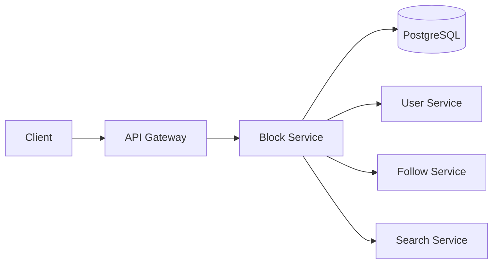
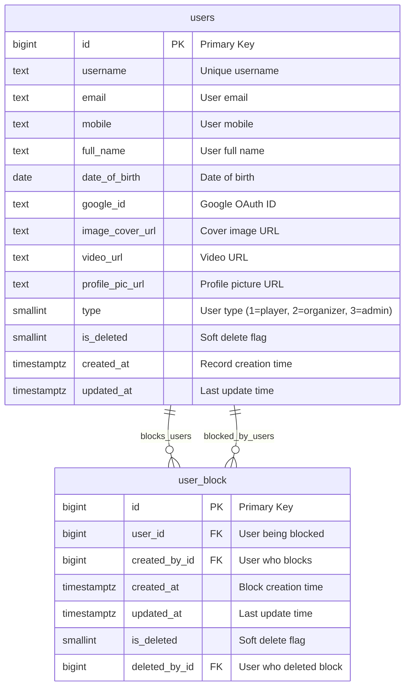
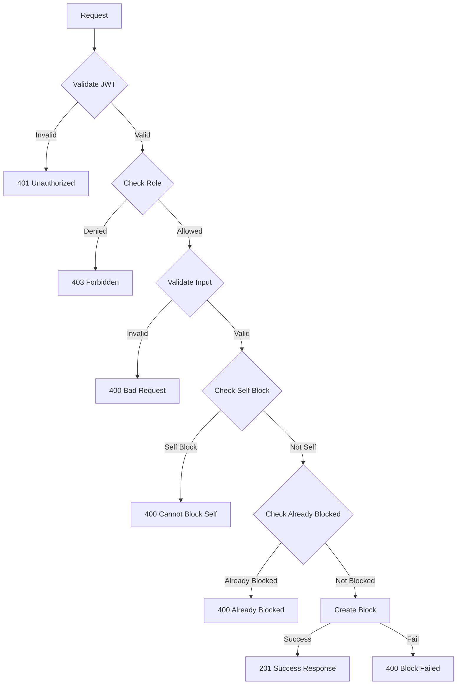
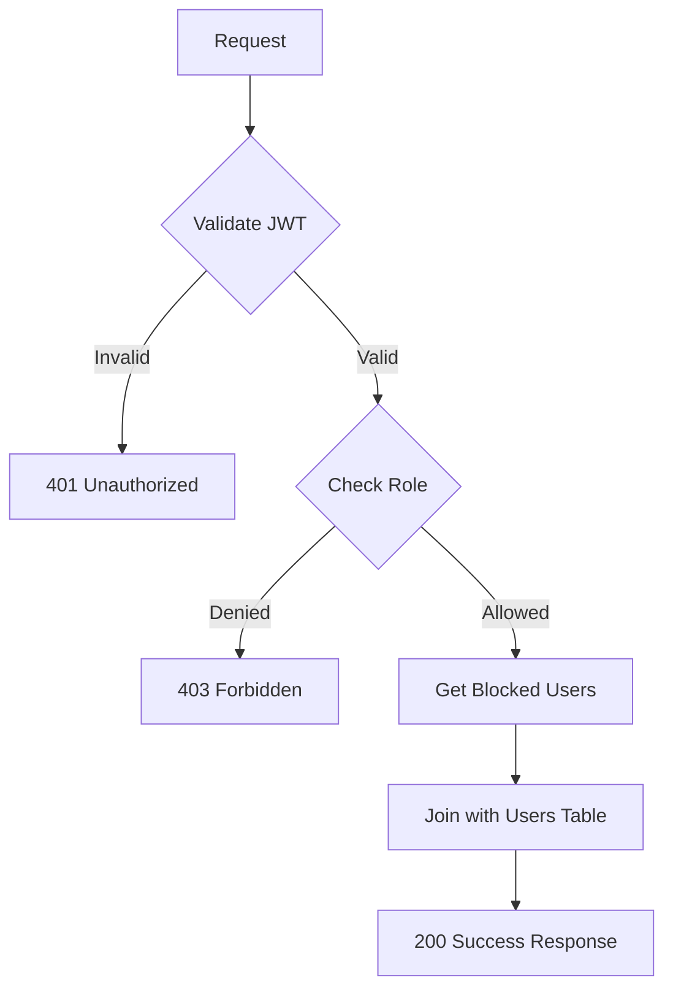
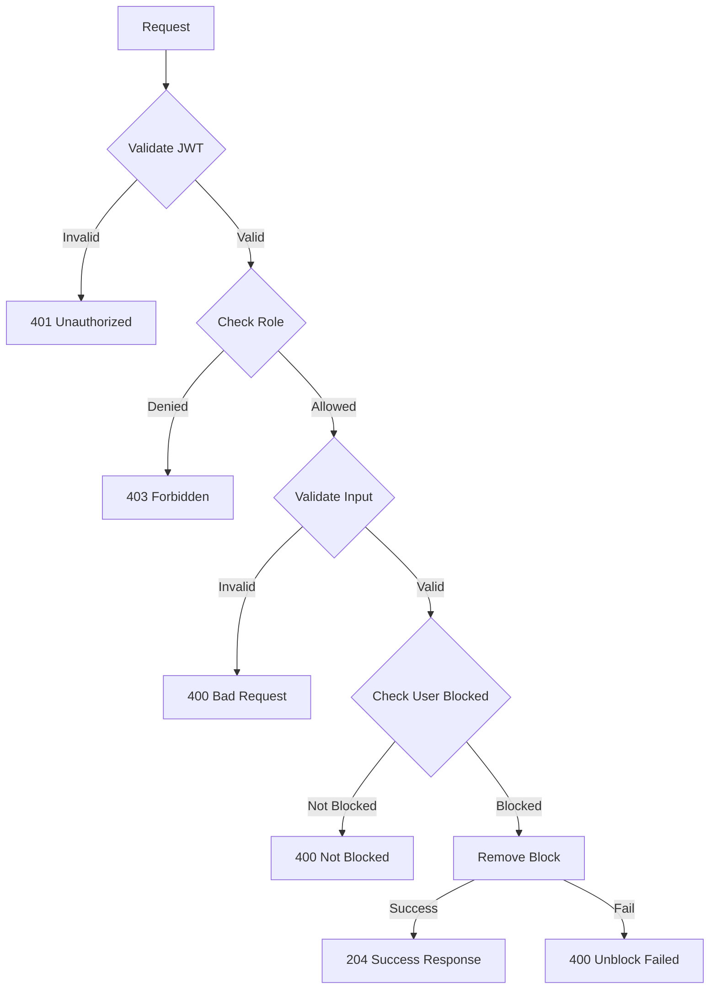
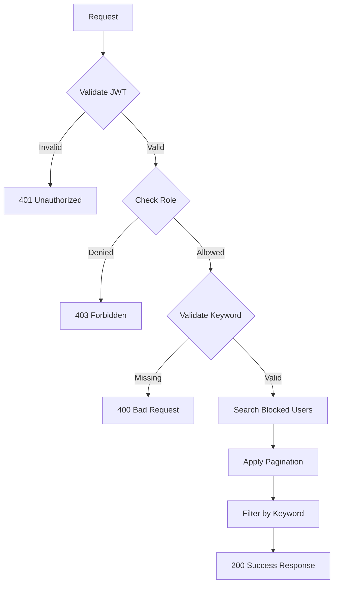
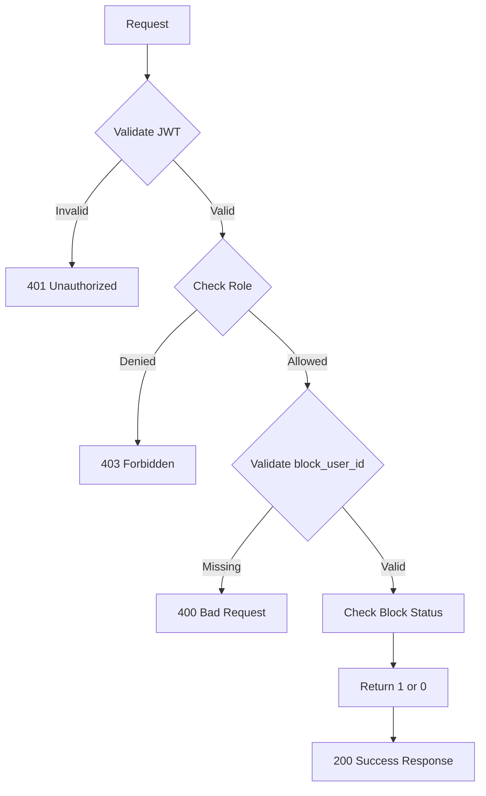

## Overview

The **Block Service** provides user blocking functionality for the Thryl platform, allowing users to block other users to prevent unwanted interactions, messages, and visibility. This service helps users maintain personal boundaries and control their social experience.

### Tech Stack
- **Backend**: Node.js, Express.js
- **Database**: PostgreSQL
- **Authentication**: JWT, bcrypt
- **Validation**: Joi
- **Error Handling**: Custom ApiError class

---

## System Architecture



---

## Database Schema



### Relationship Details

| Relationship | Type | Description | Foreign Key |
|--------------|------|-------------|-------------|
| users → user_block (blocking) | One-to-Many | User can block multiple users | `user_block.created_by_id` |
| users → user_block (blocked) | One-to-Many | User can be blocked by multiple users | `user_block.user_id` |

### Index Information

| Table | Index Type | Indexed Fields | Purpose |
|-------|------------|----------------|---------|
| user_block | btree | `user_id` | Fast lookup of blocked users |
| user_block | btree | `created_by_id` | Fast lookup of users who blocked |
| user_block | btree | `is_deleted` | Soft delete filtering |

### Table Structure

#### user_block
| Column | Type | Constraints | Index |
|--------|------|-------------|-------|
| id | bigint | PRIMARY KEY | - |
| user_id | bigint | NOT NULL, FK to users.id | btree |
| created_by_id | bigint | NOT NULL, FK to users.id | btree |
| created_at | timestamptz | DEFAULT now() | - |
| updated_at | timestamptz | DEFAULT now() | - |
| is_deleted | smallint | DEFAULT 0 | btree |
| deleted_by_id | bigint | - | - |

---

## API Reference

### Authentication
All endpoints require JWT token:
```
Authorization: Bearer <jwt-token>
```

## Base URLs

| Environment   | URL                                 |
|---------------|-------------------------------------|
| Production    | `https://thryl-prod.com   ||    https://thryl-production.zapto.org`      |
| Staging       | `https://thryl-staging.zapto.org` |
| Development   | `http://localhost:3000  || http://localhost:3001`      |

---

### Complete API List

| # | Endpoint | Method | Purpose | Auth Required | Role Required |
|---|----------|--------|---------|---------------|---------------|
| 1 | `/create` | POST | Block a user | Yes | player |
| 2 | `/read` | GET | Get all blocked users | Yes | player |
| 3 | `/delete` | DELETE | Unblock a user | Yes | player |
| 4 | `/search` | GET | Search blocked users | Yes | player |
| 5 | `/read-by-id` | GET | Check if user is blocked | Yes | player |

---

## API 1: Block User

**Endpoint**: `POST /create`

**Purpose**: Block a user to prevent interactions and visibility

**Headers**:
```
Authorization: Bearer <jwt-token>
Content-Type: application/json
```

**Request Body**:
```json
{
  "user_id": 123
}
```

**Success Response** (201):
```json
{
  "status": 1,
  "message": "User blocked successfully."
}
```

**Failure Responses**:

#### 400 - Cannot block yourself
```json
{
  "status": 0,
  "message": "Cannot block yourself",
  "error_code": "SELF_BLOCK_ERROR"
}
```

#### 400 - User already blocked
```json
{
  "status": 0,
  "message": "User is already blocked.",
  "error_code": "ALREADY_BLOCKED"
}
```

#### 400 - Failed to block user
```json
{
  "status": 0,
  "message": "Failed to block user.",
  "error_code": "BLOCK_FAILED"
}
```

#### 401 - Unauthorized
```json
{
  "status": 0,
  "message": "User not authenticated",
  "error_code": "UNAUTHORIZED"
}
```

#### 403 - Insufficient permissions
```json
{
  "status": 0,
  "message": "Access denied",
  "error_code": "FORBIDDEN"
}
```

**DFD**:


**Instructions & Business Logic**:
- JWT token required for authentication
- Role: player only
- user_id required in request body
- Validates user cannot block themselves
- Prevents duplicate blocks from same user
- Creates block record with timestamp
- Returns success message

**Validation Schema**:
```javascript
const blockUserSchema = Joi.object({
    user_id: Joi.number().optional(),
    created_by_id: Joi.number().optional(),
});
```

**Database Operations**:
```sql
-- Check if already blocked
SELECT * FROM user_block WHERE created_by_id = $1 AND user_id = $2

-- Create block record
INSERT INTO user_block (created_by_id, user_id) VALUES ($1, $2)
```

**Implementation Details**:
- Uses `catchAsync` wrapper for error handling
- Extracts `userId` from JWT token (`req.user.id`)
- Uses parameterized queries to prevent SQL injection
- Throws `ApiError` with appropriate status codes
- Validates self-block prevention in service layer
- Soft delete support with `is_deleted` flag

---

## API 2: Get Blocked Users

**Endpoint**: `GET /read`

**Purpose**: Retrieve list of all users blocked by the authenticated user

**Headers**:
```
Authorization: Bearer <jwt-token>
```

**Success Response** (200):
```json
{
  "status": 1,
  "data": [
    {
      "id": 123,
      "username": "blocked_user",
      "email": "user@example.com",
      "mobile": "+1234567890",
      "full_name": "Blocked User",
      "date_of_birth": "1990-01-01",
      "google_id": "google123",
      "image_cover_url": "https://example.com/cover.jpg",
      "video_url": "https://example.com/video.mp4",
      "profile_pic_url": "https://example.com/profile.jpg"
    }
  ]
}
```

**Failure Responses**:

#### 401 - Unauthorized
```json
{
  "status": 0,
  "message": "User not authenticated",
  "error_code": "UNAUTHORIZED"
}
```

#### 403 - Insufficient permissions
```json
{
  "status": 0,
  "message": "Access denied",
  "error_code": "FORBIDDEN"
}
```

**DFD**:


**Instructions & Business Logic**:
- JWT token required for authentication
- Role: player only
- Retrieves all blocked users for authenticated user
- Joins with users table to get complete user details
- Returns formatted user information array

**Database Operations**:
```sql
SELECT u.id, u.username, u.email, u.mobile, u.full_name, 
       u.date_of_birth, u.google_id, u.image_cover_url, 
       u.video_url, u.profile_pic_url 
FROM user_block ub 
JOIN users u ON ub.user_id = u.id 
WHERE ub.created_by_id = $1
```

**Implementation Details**:
- Uses `catchAsync` wrapper for error handling
- Extracts `userId` from JWT token (`req.user.id`)
- Uses parameterized queries to prevent SQL injection
- Returns complete user profile data for blocked users
- Handles empty result sets gracefully

---

## API 3: Unblock User

**Endpoint**: `DELETE /delete`

**Purpose**: Remove a user from the blocked list

**Headers**:
```
Authorization: Bearer <jwt-token>
Content-Type: application/json
```

**Request Body**:
```json
{
  "user_id": 123
}
```

**Success Response** (204):
```json
{
  "status": 1,
  "message": "User unblocked successfully."
}
```

**Failure Responses**:

#### 400 - User not blocked
```json
{
  "status": 0,
  "message": "User is not blocked.",
  "error_code": "NOT_BLOCKED"
}
```

#### 400 - Failed to unblock user
```json
{
  "status": 0,
  "message": "Failed to unblock user.",
  "error_code": "UNBLOCK_FAILED"
}
```

#### 401 - Unauthorized
```json
{
  "status": 0,
  "message": "User not authenticated",
  "error_code": "UNAUTHORIZED"
}
```

#### 403 - Insufficient permissions
```json
{
  "status": 0,
  "message": "Access denied",
  "error_code": "FORBIDDEN"
}
```

**DFD**:


**Instructions & Business Logic**:
- JWT token required for authentication
- Role: player only
- user_id required in request body
- Validates user is currently blocked
- Removes block record from database
- Returns success message with 204 status

**Database Operations**:
```sql
-- Check if user is blocked
SELECT * FROM user_block WHERE created_by_id = $1 AND user_id = $2

-- Remove block record
DELETE FROM user_block WHERE created_by_id = $1 AND user_id = $2
```

**Implementation Details**:
- Uses `catchAsync` wrapper for error handling
- Extracts `userId` from JWT token (`req.user.id`)
- Uses parameterized queries to prevent SQL injection
- Throws `ApiError` with appropriate status codes
- Validates block exists before deletion
- Returns 204 No Content status on success

---

## API 4: Search Blocked Users

**Endpoint**: `GET /search`

**Purpose**: Search blocked users by username or full name with pagination

**Headers**:
```
Authorization: Bearer <jwt-token>
```

**Query Parameters**:
- `keyword` (required): Search term for username or full name
- `page` (optional): Page number (default: 1)
- `limit` (optional): Items per page (default: 10)

**Example Request**:
```
GET /search?keyword=john&page=1&limit=5
```

**Success Response** (200):
```json
{
  "status": 1,
  "data": [
    {
      "block_id": 1,
      "user_id": 123,
      "username": "john_doe",
      "full_name": "John Doe",
      "profile_pic_url": "https://example.com/profile.jpg"
    }
  ],
  "page": 1,
  "limit": 5
}
```

**Failure Responses**:

#### 400 - Missing keyword
```json
{
  "status": 0,
  "message": "Search keyword is required.",
  "error_code": "VALIDATION_ERROR"
}
```

#### 401 - Unauthorized
```json
{
  "status": 0,
  "message": "User not authenticated",
  "error_code": "UNAUTHORIZED"
}
```

#### 403 - Insufficient permissions
```json
{
  "status": 0,
  "message": "Access denied",
  "error_code": "FORBIDDEN"
}
```

**DFD**:


**Instructions & Business Logic**:
- JWT token required for authentication
- Role: player only
- keyword required in query parameters
- Implements pagination for large result sets
- Searches by username or full name using ILIKE
- Returns limited results with pagination info

**Database Operations**:
```sql
WITH 
x AS (SELECT * FROM user_block WHERE created_by_id = $1 LIMIT $2 OFFSET $3),
y AS (SELECT x.id AS block_id, u.id AS user_id, u.username, u.full_name, u.profile_pic_url 
      FROM x LEFT JOIN users AS u ON x.user_id = u.id)
SELECT * FROM y WHERE username ILIKE $4 OR full_name ILIKE $4;
```

**Implementation Details**:
- Uses `catchAsync` wrapper for error handling
- Extracts `userId` from JWT token (`req.user.id`)
- Uses Common Table Expressions (CTEs) for efficient pagination
- First CTE gets paginated block records
- Second CTE joins with users table to get user details
- Final WHERE clause filters by username or full name using ILIKE
- Parameters: `[userId, limit, offset, '%${keyword}%']`

---

## API 5: Check Block Status

**Endpoint**: `GET /read-by-id`

**Purpose**: Check if a specific user is blocked by the authenticated user

**Headers**:
```
Authorization: Bearer <jwt-token>
```

**Query Parameters**:
- `block_user_id` (required): ID of user to check block status

**Example Request**:
```
GET /read-by-id?block_user_id=123
```

**Success Response** (200):
```json
{
  "status": 1,
  "data": 1
}
```

**Response Values**:
- `1`: User is blocked
- `0`: User is not blocked

**Failure Responses**:

#### 400 - Missing block_user_id
```json
{
  "status": 0,
  "message": "Block user ID is required.",
  "error_code": "VALIDATION_ERROR"
}
```

#### 401 - Unauthorized
```json
{
  "status": 0,
  "message": "User not authenticated",
  "error_code": "UNAUTHORIZED"
}
```

#### 403 - Insufficient permissions
```json
{
  "status": 0,
  "message": "Access denied",
  "error_code": "FORBIDDEN"
}
```

**DFD**:


**Instructions & Business Logic**:
- JWT token required for authentication
- Role: player only
- block_user_id required in query parameters
- Checks if specific user is in blocked list
- Returns 1 if blocked, 0 if not blocked
- Used for UI state management (block/unblock button toggle)

**Database Operations**:
```sql
SELECT created_by_id, user_id FROM user_block 
WHERE user_id = $1 AND created_by_id = $2
```

**Implementation Details**:
- Uses `catchAsync` wrapper for error handling
- Extracts `userId` from JWT token (`req.user.id`)
- Uses parameterized queries to prevent SQL injection
- Parameters: `[userId, blockUserId]` (note the parameter order)
- Returns boolean-like value (1 or 0) for easy UI integration
- Efficient single query for status check

---

## Error Handling

### Common Error Codes

| Code | Description |
|------|-------------|
| 400 | Bad Request - Invalid input data or business rule violation |
| 401 | Unauthorized - Missing or invalid JWT |
| 403 | Forbidden - Insufficient permissions |
| 404 | Not Found - Resource not found |
| 500 | Internal Server Error - Server error |

### Error Response Format
```json
{
  "status": 0,
  "message": "Error description",
  "error_code": "ERROR_TYPE"
}
```

---

## Rate Limiting

- **Block/Unblock**: 10 requests per minute per user
- **Read Operations**: 60 requests per minute per user
- **Search Operations**: 30 requests per minute per user

---

## Security Considerations

1. **JWT Authentication**: All endpoints require valid JWT tokens
2. **Role-based Access**: Only player role can manage blocks
3. **Input Validation**: All inputs validated using Joi schemas
4. **Self-block Prevention**: Users cannot block themselves
5. **User Validation**: Verifies user exists before blocking
6. **SQL Injection Prevention**: Uses parameterized queries
7. **Soft Delete**: Block records are soft-deleted, not permanently removed

---

## Business Rules

### Blocking Rules
1. Users cannot block themselves
2. Users cannot block the same person twice
3. Blocking is one-way (A blocks B doesn't mean B blocks A)
4. Blocked users cannot see each other's content
5. Blocked users cannot send messages to each other
6. Only players can block users (organizers and admins cannot block)

### Unblocking Rules
1. Only the user who created the block can unblock
2. Unblocking restores full visibility and interaction
3. No notification is sent when unblocking
4. Unblocking is immediate and permanent

### Search and Visibility
1. Blocked users are hidden from search results
2. Blocked users cannot see each other's profiles
3. Block status is private (only visible to blocker)
4. Search results include pagination for large lists

---

## Monitoring & Logging

- All block/unblock operations logged with user IDs and timestamp
- Block frequency monitoring for abuse detection
- Search query patterns analyzed for user behavior
- Failed block attempts tracked for security
- Block status checks logged for UI optimization

---

## Integration Examples

### Frontend Integration

```javascript
// Block a user
const blockUser = async (userId) => {
  const response = await fetch('/api/v1/block-user/create', {
    method: 'POST',
    headers: {
      'Authorization': `Bearer ${token}`,
      'Content-Type': 'application/json'
    },
    body: JSON.stringify({ user_id: userId })
  });
  
  const result = await response.json();
  return result;
};

// Get blocked users
const getBlockedUsers = async () => {
  const response = await fetch('/api/v1/block-user/read', {
    headers: {
      'Authorization': `Bearer ${token}`
    }
  });
  
  const result = await response.json();
  return result.data;
};

// Check if user is blocked
const checkBlockStatus = async (blockUserId) => {
  const response = await fetch(`/api/v1/block-user/read-by-id?block_user_id=${blockUserId}`, {
    headers: {
      'Authorization': `Bearer ${token}`
    }
  });
  
  const result = await response.json();
  return result.data === 1; // Returns boolean
};

// Example usage
try {
  await blockUser(123);
  console.log('User blocked successfully');
  
  const blockedUsers = await getBlockedUsers();
  console.log('Blocked users:', blockedUsers);
  
  const isBlocked = await checkBlockStatus(123);
  console.log('Is user blocked:', isBlocked);
} catch (error) {
  console.error('Block operation failed:', error.message);
}
```

### Mobile App Integration

```swift
// Swift example for iOS
func blockUser(userId: Int) async throws -> BlockResponse {
    let url = URL(string: "\(baseURL)/block-user/create")!
    var request = URLRequest(url: url)
    request.httpMethod = "POST"
    request.setValue("Bearer \(authToken)", forHTTPHeaderField: "Authorization")
    request.setValue("application/json", forHTTPHeaderField: "Content-Type")
    
    let body = ["user_id": userId]
    request.httpBody = try JSONSerialization.data(withJSONObject: body)
    
    let (data, _) = try await URLSession.shared.data(for: request)
    return try JSONDecoder().decode(BlockResponse.self, from: data)
}

func getBlockedUsers() async throws -> [BlockedUser] {
    let url = URL(string: "\(baseURL)/block-user/read")!
    var request = URLRequest(url: url)
    request.setValue("Bearer \(authToken)", forHTTPHeaderField: "Authorization")
    
    let (data, _) = try await URLSession.shared.data(for: request)
    let response = try JSONDecoder().decode(BlockedUsersResponse.self, from: data)
    return response.data
}
```

### React Component Example

```jsx
import React, { useState, useEffect } from 'react';

const UserProfile = ({ userId, username }) => {
  const [isBlocked, setIsBlocked] = useState(false);
  const [loading, setLoading] = useState(false);

  useEffect(() => {
    checkBlockStatus();
  }, [userId]);

  const checkBlockStatus = async () => {
    try {
      const response = await fetch(`/api/v1/block-user/read-by-id?block_user_id=${userId}`, {
        headers: {
          'Authorization': `Bearer ${localStorage.getItem('token')}`
        }
      });
      const result = await response.json();
      setIsBlocked(result.data === 1);
    } catch (error) {
      console.error('Failed to check block status:', error);
    }
  };

  const handleBlock = async () => {
    setLoading(true);
    try {
      const response = await fetch('/api/v1/block-user/create', {
        method: 'POST',
        headers: {
          'Authorization': `Bearer ${localStorage.getItem('token')}`,
          'Content-Type': 'application/json'
        },
        body: JSON.stringify({ user_id: userId })
      });

      const result = await response.json();
      if (result.status === 1) {
        setIsBlocked(true);
        alert('User blocked successfully');
      } else {
        alert(result.message);
      }
    } catch (error) {
      alert('Failed to block user');
    } finally {
      setLoading(false);
    }
  };

  const handleUnblock = async () => {
    setLoading(true);
    try {
      const response = await fetch('/api/v1/block-user/delete', {
        method: 'DELETE',
        headers: {
          'Authorization': `Bearer ${localStorage.getItem('token')}`,
          'Content-Type': 'application/json'
        },
        body: JSON.stringify({ user_id: userId })
      });

      const result = await response.json();
      if (result.status === 1) {
        setIsBlocked(false);
        alert('User unblocked successfully');
      } else {
        alert(result.message);
      }
    } catch (error) {
      alert('Failed to unblock user');
    } finally {
      setLoading(false);
    }
  };

  return (
    <div className="user-profile">
      <h3>{username}</h3>
      <button 
        onClick={isBlocked ? handleUnblock : handleBlock}
        disabled={loading}
        className={isBlocked ? 'unblock-btn' : 'block-btn'}
      >
        {loading ? 'Processing...' : (isBlocked ? 'Unblock' : 'Block')}
      </button>
    </div>
  );
};
```

---

## Use Cases

### 1. Personal Privacy
- Users block ex-friends or acquaintances
- Prevents unwanted social interactions
- Maintains personal boundaries
- Controls who can see their content

### 2. Harassment Prevention
- Users block harassers and bullies
- Prevents unwanted messages and interactions
- Creates safer gaming environment
- Protects vulnerable users

### 3. Content Control
- Users block users with inappropriate content
- Filters out unwanted posts and comments
- Maintains personal feed quality
- Customizes social experience

### 4. Tournament Management
- Tournament organizers can block problematic participants
- Prevents disruptive behavior during events
- Ensures fair and enjoyable competition
- Maintains event quality

---

## Performance Considerations

### Database Optimization
- Indexes on `user_id` and `created_by_id` for fast lookups
- B-tree index on `is_deleted` for soft delete filtering
- Efficient JOIN operations with proper indexing
- CTEs for complex search queries

### Caching Strategy
- Cache block status for frequently checked users
- Redis cache for block lists with TTL
- Invalidate cache on block/unblock operations
- Cache search results for repeated queries

### Query Optimization
- Use parameterized queries for security
- Limit result sets with pagination
- Optimize JOIN operations with proper indexing
- Use CTEs for complex search queries

---

## Testing Scenarios

### Unit Tests
- Block user functionality
- Unblock user functionality
- Search blocked users
- Check block status
- Error handling for invalid inputs

### Integration Tests
- End-to-end block/unblock flow
- Authentication and authorization
- Database consistency
- API response validation

### Performance Tests
- Load testing with multiple concurrent users
- Database query performance
- Response time under load
- Memory usage optimization

### Security Tests
- SQL injection prevention
- JWT token validation
- Role-based access control
- Input sanitization

---

## Future Enhancements

### Planned Features
1. **Block Categories**: Different types of blocks (temporary, permanent)
2. **Block Notifications**: Notify users when they're blocked
3. **Block Analytics**: Track block patterns and reasons
4. **Auto-block**: Automatic blocking based on behavior patterns
5. **Block Appeals**: Allow users to appeal blocks
6. **Block Sharing**: Share block lists with trusted users
7. **Block Expiry**: Temporary blocks that expire automatically
8. **Block History**: Track block/unblock history for moderation 