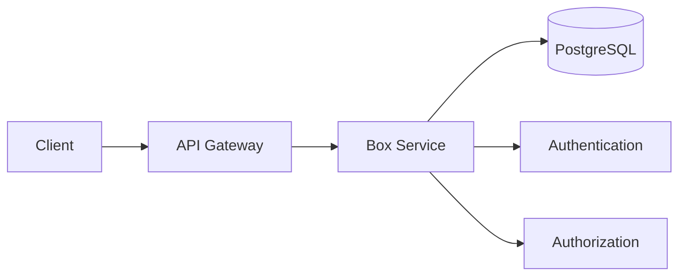
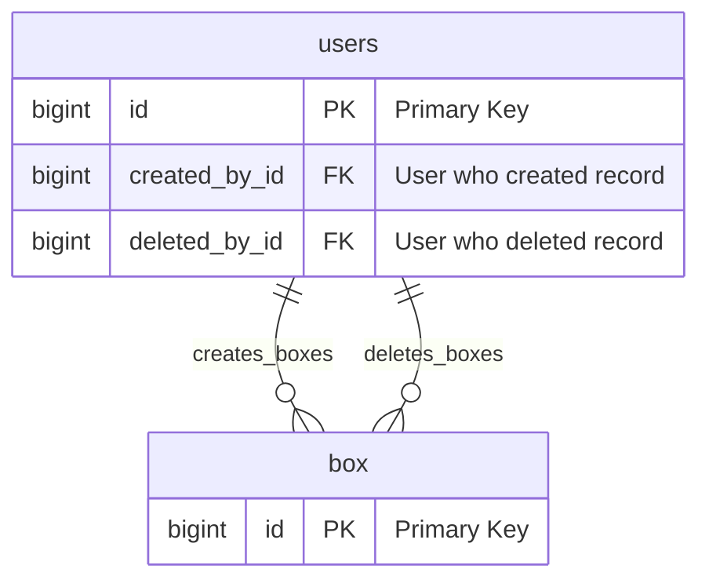
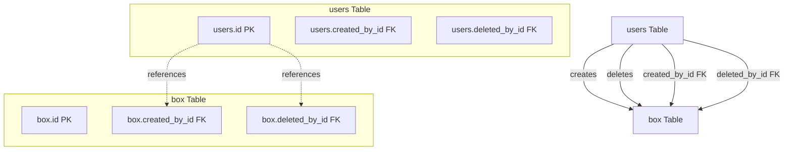
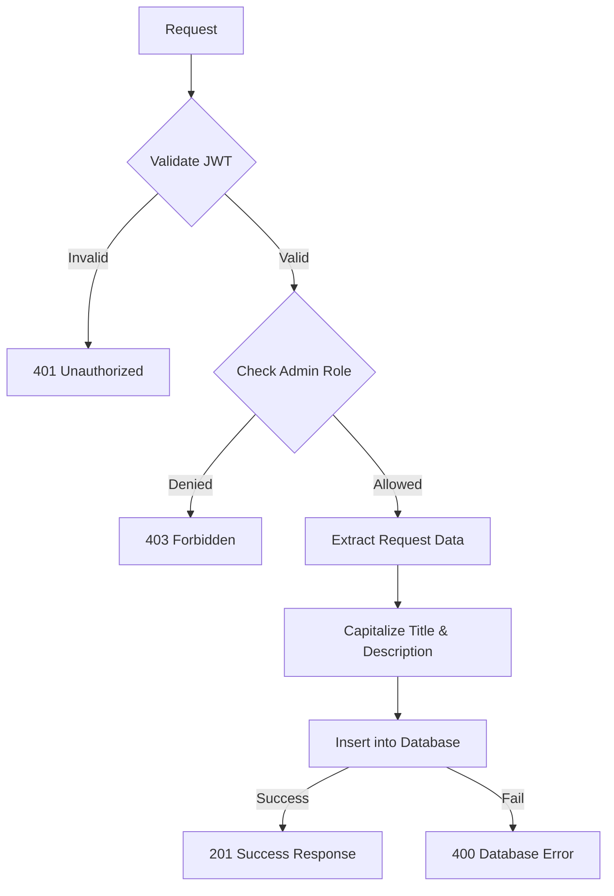
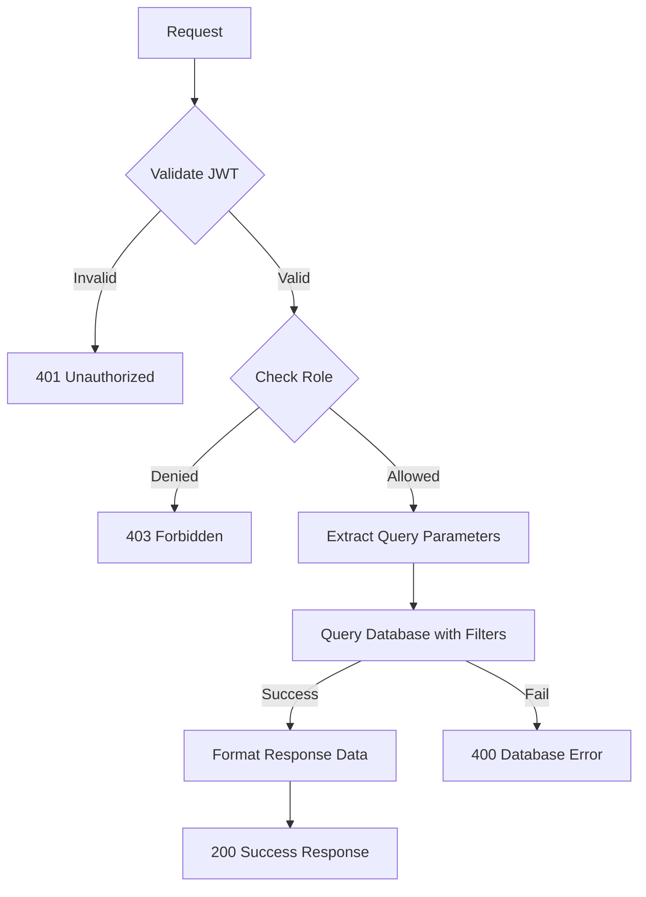
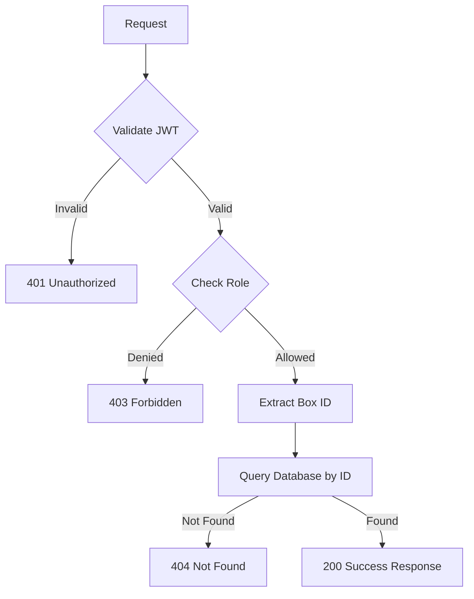
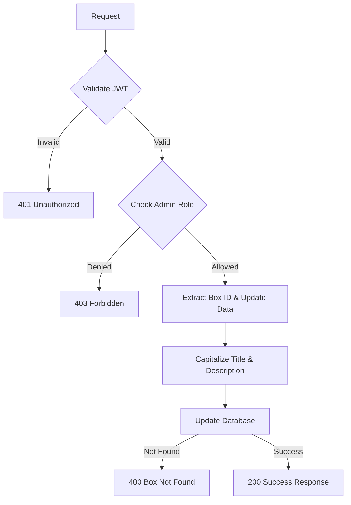
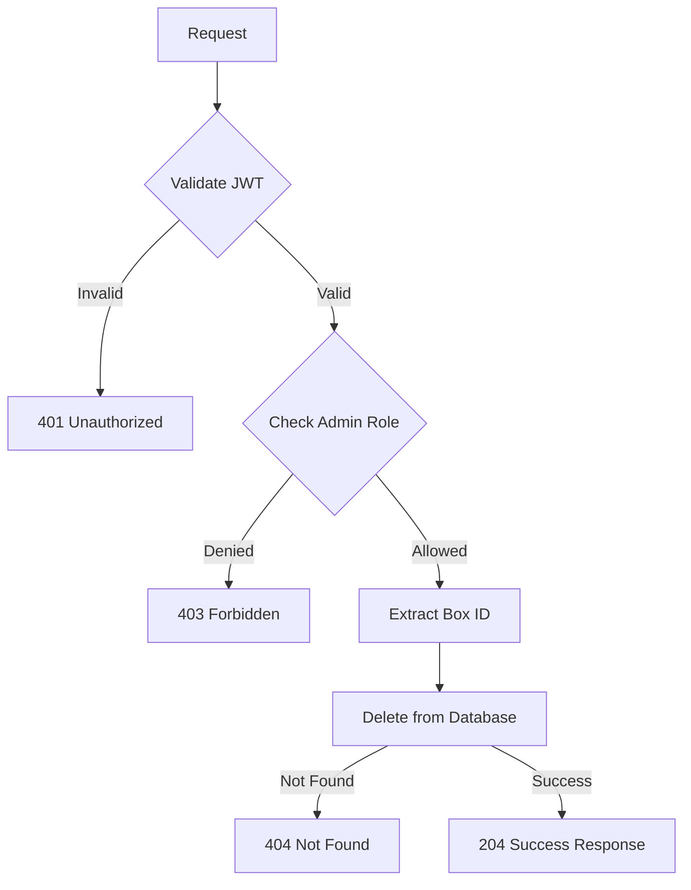
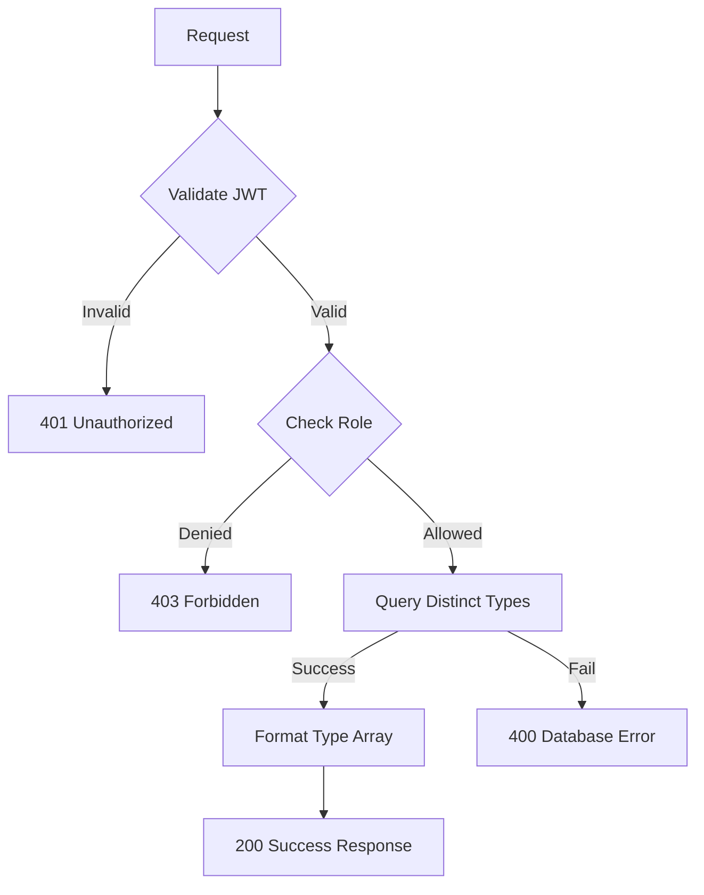

## Overview

The **Box Service** provides comprehensive asset/box management functionality for the Thryl platform, including box creation, reading, updating, deletion, and type-based filtering. This service manages various types of content boxes that can contain images, videos, and descriptive content.

### Tech Stack
- **Backend**: Node.js, Express.js
- **Database**: PostgreSQL
- **Authentication**: JWT
- **Validation**: Joi
- **Authorization**: Role-based access control

---

## System Architecture



---

## Database Schema



## Table Relationship Graph



### Relationship Details

| Relationship | Type | Description | Foreign Key |
|--------------|------|-------------|-------------|
| users → box (creation) | One-to-Many | User can create multiple boxes | `box.created_by_id` |
| users → box (deletion) | One-to-Many | User can delete multiple boxes | `box.deleted_by_id` |

### Index Information

| Table | Index Type | Indexed Fields | Purpose |
|-------|------------|----------------|---------|
| box | BRIN | created_at | Time-based queries |
| box | B-tree | created_by_id | User-based queries |
| box | B-tree | is_deleted | Soft delete filtering |
| box | B-tree | title | Title search |
| box | B-tree | description | Description search |
| box | B-tree | type | Type-based filtering |

---

## Base URLs

| Environment   | URL                                 |
|---------------|-------------------------------------|
| Production    | `https://thryl-prod.com   ||    https://thryl-production.zapto.org`      |
| Staging       | `https://thryl-staging.zapto.org` |
| Development   | `http://localhost:3000  || http://localhost:3001`      |

---

## Authentication

All Box Service APIs require JWT authentication. Include the token in the Authorization header:

```http
Authorization: Bearer <your-jwt-token>
```

---

## Authorization

| Role | Permissions |
|------|-------------|
| **Admin** | Full access (create, read, update, delete) |
| **Player** | Read-only access (view boxes) |

---

## API Endpoints

### 1. Create Box

Creates a new box/asset with the provided details.

**Endpoint:** `POST /box/create`

**Authorization:** Admin only

**Request Body:**
```json
{
  "title": "Sample Box Title",
  "description": "This is a sample box description",
  "image_url": "https://example.com/image.jpg",
  "video_url": "https://example.com/video.mp4",
  "type": "featured"
}
```

**Success Response (201):**
```json
{
  "status": 1,
  "data": {
    "id": 123,
    "title": "Sample Box Title",
    "description": "This Is A Sample Box Description",
    "image_url": "https://example.com/image.jpg",
    "video_url": "https://example.com/video.mp4",
    "type": "featured",
    "created_at": "2024-01-15T10:30:00Z",
    "created_by_id": 456,
    "is_deleted": 0,
    "deleted_by_id": null,
    "updated_at": null
  }
}
```

**Error Response (400):**
```json
{
  "status": 0,
  "message": "Failed to insert record into the database."
}
```

**Error Response (401):**
```json
{
  "status": 0,
  "message": "Unauthorized access"
}
```

**Error Response (403):**
```json
{
  "status": 0,
  "message": "Access denied. Admin role required."
}
```

**DFD**:


#### Business Logic

1. **Input Validation**: Validates required fields and data types
2. **Text Capitalization**: Automatically capitalizes title and description using Title Case
3. **User Authentication**: Ensures only authenticated users can create boxes
4. **Role Authorization**: Restricts creation to admin users only
5. **Database Insertion**: Inserts the box data with proper foreign key relationships
6. **Response Formatting**: Returns formatted data with proper data types

#### Database Operations

```sql
-- Insert new box record
INSERT INTO box (title, description, image_url, video_url, type, created_by_id) 
VALUES ($1, $2, $3, $4, $5, $6) 
RETURNING *;
```

#### Error Handling

- **Validation Errors**: Invalid input data format
- **Authentication Errors**: Missing or invalid JWT token
- **Authorization Errors**: Insufficient permissions
- **Database Errors**: Connection issues or constraint violations
- **Business Logic Errors**: Invalid business rules

---

### 2. Get All Boxes

Retrieves all boxes with optional filtering by type and pagination.

**Endpoint:** `GET /box/read`

**Authorization:** Admin, Player

**Query Parameters:**
- `type` (optional): Filter by box type
- `page` (optional): Page number (default: 1)
- `limit` (optional): Items per page (default: 10)

**Example Request:**
```http
GET /box/read?type=featured&page=1&limit=5
```

**Success Response (200):**
```json
{
  "status": 1,
  "data": [
    {
      "id": 123,
      "title": "Featured Box 1",
      "description": "This Is A Featured Box",
      "image_url": "https://example.com/image1.jpg",
      "video_url": "https://example.com/video1.mp4",
      "type": "featured",
      "created_at": "2024-01-15T10:30:00Z",
      "created_by_id": 456,
      "is_deleted": 0,
      "deleted_by_id": null,
      "updated_at": null
    },
    {
      "id": 124,
      "title": "Featured Box 2",
      "description": "Another Featured Box",
      "image_url": "https://example.com/image2.jpg",
      "video_url": "https://example.com/video2.mp4",
      "type": "featured",
      "created_at": "2024-01-15T11:30:00Z",
      "created_by_id": 456,
      "is_deleted": 0,
      "deleted_by_id": null,
      "updated_at": null
    }
  ],
  "total": 2,
  "limit": 5,
  "offset": 0
}
```

**Error Response (400):**
```json
{
  "status": 0,
  "message": "Failed to retrieve boxes."
}
```

**DFD**:


#### Business Logic

1. **Authentication**: Validates user authentication
2. **Authorization**: Allows admin and player roles
3. **Type Filtering**: Optional filtering by box type
4. **Pagination**: Implements offset-based pagination
5. **Sorting**: Orders results by ID in descending order
6. **Data Formatting**: Ensures proper data types in response

#### Database Operations

```sql
-- Get boxes with optional type filtering and pagination
SELECT * FROM box 
WHERE ($1::text IS NULL OR box.type = $1::text) 
ORDER BY id DESC 
LIMIT $2 OFFSET $3;
```

---

### 3. Get Box by ID

Retrieves a specific box by its ID.

**Endpoint:** `GET /box/read/{id}`

**Authorization:** Admin, Player

**Path Parameters:**
- `id`: Box ID (integer)

**Example Request:**
```http
GET /box/read/123
```

**Success Response (200):**
```json
{
  "status": 1,
  "data": {
    "id": 123,
    "title": "Sample Box Title",
    "description": "This Is A Sample Box Description",
    "image_url": "https://example.com/image.jpg",
    "video_url": "https://example.com/video.mp4",
    "type": "featured",
    "created_at": "2024-01-15T10:30:00Z",
    "created_by_id": 456,
    "is_deleted": 0,
    "deleted_by_id": null,
    "updated_at": null
  }
}
```

**Error Response (404):**
```json
{
  "status": 0,
  "message": "Box not found."
}
```

**DFD**:


#### Business Logic

1. **ID Validation**: Validates the provided box ID
2. **Soft Delete Check**: Excludes soft-deleted boxes
3. **Data Retrieval**: Fetches complete box information
4. **Error Handling**: Returns appropriate error for non-existent boxes

#### Database Operations

```sql
-- Get box by ID (excluding soft-deleted)
SELECT * FROM box 
WHERE id = $1 AND is_deleted IS DISTINCT FROM 1;
```

---

### 4. Update Box

Updates an existing box with new information.

**Endpoint:** `PUT /box/update/{id}`

**Authorization:** Admin only

**Path Parameters:**
- `id`: Box ID (integer)

**Request Body:**
```json
{
  "title": "Updated Box Title",
  "description": "Updated box description",
  "image_url": "https://example.com/new-image.jpg",
  "video_url": "https://example.com/new-video.mp4",
  "type": "updated"
}
```

**Success Response (200):**
```json
{
  "status": 1,
  "data": {
    "id": 123,
    "title": "Updated Box Title",
    "description": "Updated Box Description",
    "image_url": "https://example.com/new-image.jpg",
    "video_url": "https://example.com/new-video.mp4",
    "type": "updated",
    "created_at": "2024-01-15T10:30:00Z",
    "created_by_id": 456,
    "is_deleted": 0,
    "deleted_by_id": null,
    "updated_at": "2024-01-15T12:30:00Z"
  }
}
```

**Error Response (400):**
```json
{
  "status": 0,
  "message": "Box not found or has been deleted."
}
```

**Error Response (403):**
```json
{
  "status": 0,
  "message": "Access denied. Admin role required."
}
```

**DFD**:


#### Business Logic

1. **Authorization**: Ensures only admin users can update boxes
2. **Text Capitalization**: Automatically capitalizes updated title and description
3. **Partial Updates**: Allows updating specific fields only
4. **Existence Check**: Verifies box exists and is not soft-deleted
5. **Timestamp Update**: Automatically updates the `updated_at` timestamp

#### Database Operations

```sql
-- Update box with partial updates
UPDATE box 
SET title = COALESCE($1, title), 
    description = COALESCE($2, description), 
    image_url = COALESCE($3, image_url), 
    video_url = COALESCE($4, video_url), 
    type = COALESCE($5, type), 
    updated_at = NOW() 
WHERE id = $6 AND is_deleted IS DISTINCT FROM 1
RETURNING *;
```

---

### 5. Delete Box

Permanently deletes a box from the system.

**Endpoint:** `DELETE /box/delete`

**Authorization:** Admin only

**Request Body:**
```json
{
  "id": 123
}
```

**Success Response (204):**
```json
{
  "status": 1,
  "data": {
    "id": 123,
    "title": "Deleted Box Title",
    "description": "Deleted Box Description",
    "image_url": "https://example.com/image.jpg",
    "video_url": "https://example.com/video.mp4",
    "type": "featured",
    "created_at": "2024-01-15T10:30:00Z",
    "created_by_id": 456,
    "is_deleted": 0,
    "deleted_by_id": null,
    "updated_at": null
  }
}
```

**Error Response (404):**
```json
{
  "status": 0,
  "message": "Box not found or already deleted."
}
```

**Error Response (403):**
```json
{
  "status": 0,
  "message": "Access denied. Admin role required."
}
```

**DFD**:


#### Business Logic

1. **Authorization**: Ensures only admin users can delete boxes
2. **Permanent Deletion**: Completely removes the box from the database
3. **Existence Check**: Verifies box exists before deletion
4. **Response Data**: Returns the deleted box data for confirmation

#### Database Operations

```sql
-- Permanently delete box
DELETE FROM box WHERE id = $1 RETURNING *;
```

---

### 6. Get All Distinct Types

Retrieves all distinct box types available in the system.

**Endpoint:** `GET /box/read-all-type`

**Authorization:** Admin, Player

**Example Request:**
```http
GET /box/read-all-type
```

**Success Response (200):**
```json
{
  "status": 1,
  "data": [
    "featured",
    "promotional",
    "news",
    "event",
    "tutorial"
  ]
}
```

**Error Response (400):**
```json
{
  "status": 0,
  "message": "Failed to retrieve distinct types."
}
```

**DFD**:


#### Business Logic

1. **Authentication**: Validates user authentication
2. **Authorization**: Allows admin and player roles
3. **Distinct Query**: Retrieves unique box types only
4. **Soft Delete Filter**: Excludes soft-deleted boxes
5. **Array Response**: Returns simple array of type strings

#### Database Operations

```sql
-- Get distinct box types (excluding soft-deleted)
SELECT DISTINCT type FROM box 
WHERE is_deleted IS DISTINCT FROM 1;
```

---

## Rate Limiting

| Endpoint | Rate Limit | Window |
|----------|------------|--------|
| All Box APIs | 100 requests | 15 minutes |

---

## Security Considerations

### Authentication
- JWT token validation on all endpoints
- Token expiration handling
- Secure token transmission

### Authorization
- Role-based access control (RBAC)
- Admin-only operations for create, update, delete
- Read access for both admin and player roles

### Input Validation
- Request body validation
- Path parameter validation
- Query parameter validation
- SQL injection prevention through parameterized queries

### Data Protection
- Sensitive data encryption
- Secure file URL handling
- Input sanitization

---

## Business Rules

### Box Creation
1. Only admin users can create boxes
2. Title and description are automatically capitalized
3. All fields are optional except created_by_id
4. Box type can be any string value

### Box Reading
1. Both admin and player roles can read boxes
2. Soft-deleted boxes are excluded from results
3. Pagination is implemented for large datasets
4. Type filtering is optional

### Box Updates
1. Only admin users can update boxes
2. Partial updates are supported
3. Updated title and description are capitalized
4. Updated_at timestamp is automatically set

### Box Deletion
1. Only admin users can delete boxes
2. Deletion is permanent (not soft delete)
3. Deleted box data is returned for confirmation

### Box Types
1. Types are user-defined strings
2. Distinct types query excludes soft-deleted boxes
3. Type filtering is case-sensitive

---

## Monitoring & Logging

### Metrics to Monitor
- API response times
- Error rates by endpoint
- Database query performance
- Authentication failures
- Authorization failures

### Logging
- Request/response logging
- Error logging with stack traces
- Database operation logging
- Authentication event logging

### Alerts
- High error rates (>5%)
- Slow response times (>2s)
- Database connection issues
- Authentication failures

---

## Integration Examples

### Frontend Integration

```javascript
// Create a new box
const createBox = async (boxData) => {
  const response = await fetch('/api/v1/box/create', {
    method: 'POST',
    headers: {
      'Content-Type': 'application/json',
      'Authorization': `Bearer ${token}`
    },
    body: JSON.stringify(boxData)
  });
  return response.json();
};

// Get all boxes with filtering
const getBoxes = async (type = null, page = 1, limit = 10) => {
  const params = new URLSearchParams({
    page: page.toString(),
    limit: limit.toString()
  });
  if (type) params.append('type', type);
  
  const response = await fetch(`/api/v1/box/read?${params}`, {
    headers: {
      'Authorization': `Bearer ${token}`
    }
  });
  return response.json();
};

// Update a box
const updateBox = async (id, updateData) => {
  const response = await fetch(`/api/v1/box/update/${id}`, {
    method: 'PUT',
    headers: {
      'Content-Type': 'application/json',
      'Authorization': `Bearer ${token}`
    },
    body: JSON.stringify(updateData)
  });
  return response.json();
};

// Delete a box
const deleteBox = async (id) => {
  const response = await fetch('/api/v1/box/delete', {
    method: 'DELETE',
    headers: {
      'Content-Type': 'application/json',
      'Authorization': `Bearer ${token}`
    },
    body: JSON.stringify({ id })
  });
  return response.json();
};

// Get distinct types
const getBoxTypes = async () => {
  const response = await fetch('/api/v1/box/read-all-type', {
    headers: {
      'Authorization': `Bearer ${token}`
    }
  });
  return response.json();
};
```

### Error Handling

```javascript
const handleBoxOperation = async (operation) => {
  try {
    const result = await operation();
    if (result.status === 1) {
      console.log('Operation successful:', result.data);
      return result.data;
    } else {
      console.error('Operation failed:', result.message);
      throw new Error(result.message);
    }
  } catch (error) {
    console.error('Box operation failed:', error.message);
    // Handle different error types
    if (error.message.includes('Unauthorized')) {
      // Handle authentication error
    } else if (error.message.includes('Access denied')) {
      // Handle authorization error
    } else if (error.message.includes('not found')) {
      // Handle not found error
    } else {
      // Handle general error
    }
  }
};
```

---

## Use Cases

### 1. Content Management
- Admins create and manage content boxes
- Organize content by types (featured, promotional, news)
- Update content without affecting other systems
- Maintain content versioning through timestamps

### 2. Content Display
- Players view content boxes based on types
- Implement content filtering and search
- Display content with images and videos
- Paginate large content collections

### 3. Content Organization
- Categorize content using box types
- Filter content by specific types
- Maintain content hierarchy
- Support content discovery

### 4. Content Administration
- Centralized content management
- Role-based content access
- Content lifecycle management
- Content analytics and reporting

---

## Performance Considerations

### Database Optimization
- Indexes on `created_by_id`, `is_deleted`, and `type` for fast lookups
- B-tree indexes on `title` and `description` for search
- BRIN index on `created_at` for time-based queries
- Efficient filtering and pagination

### Caching Strategy
- Cache frequently accessed boxes
- Redis cache for type-based queries with TTL
- Invalidate cache on box updates/deletions
- Cache pagination results

### Query Optimization
- Use parameterized queries for security
- Limit result sets with pagination
- Optimize type filtering queries
- Efficient soft delete handling

---

## Testing Scenarios

### Unit Tests
- Box creation functionality
- Box update functionality
- Box deletion functionality
- Type filtering and pagination
- Error handling for invalid inputs

### Integration Tests
- End-to-end box management flow
- Authentication and authorization
- Database consistency
- API response validation

### Performance Tests
- Load testing with multiple concurrent users
- Database query performance
- Pagination performance under load
- Memory usage optimization

### Security Tests
- SQL injection prevention
- JWT token validation
- Role-based access control
- Input sanitization

 