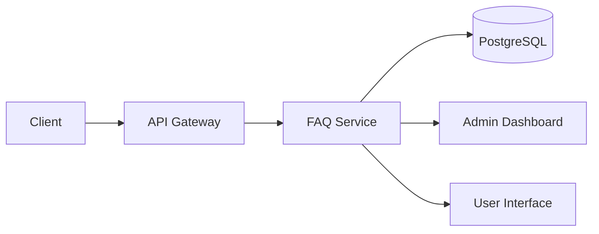
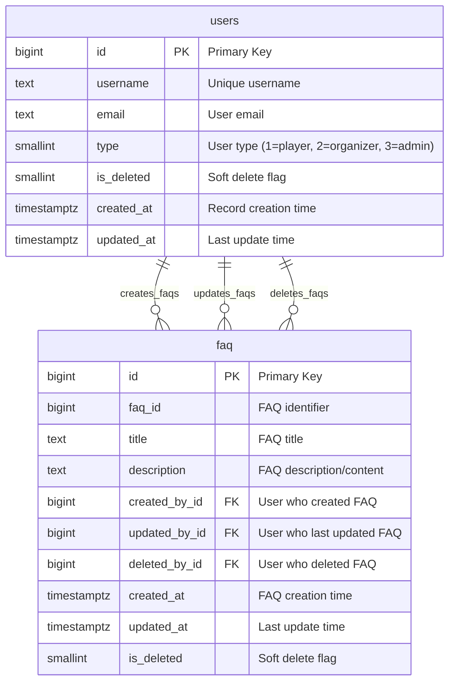
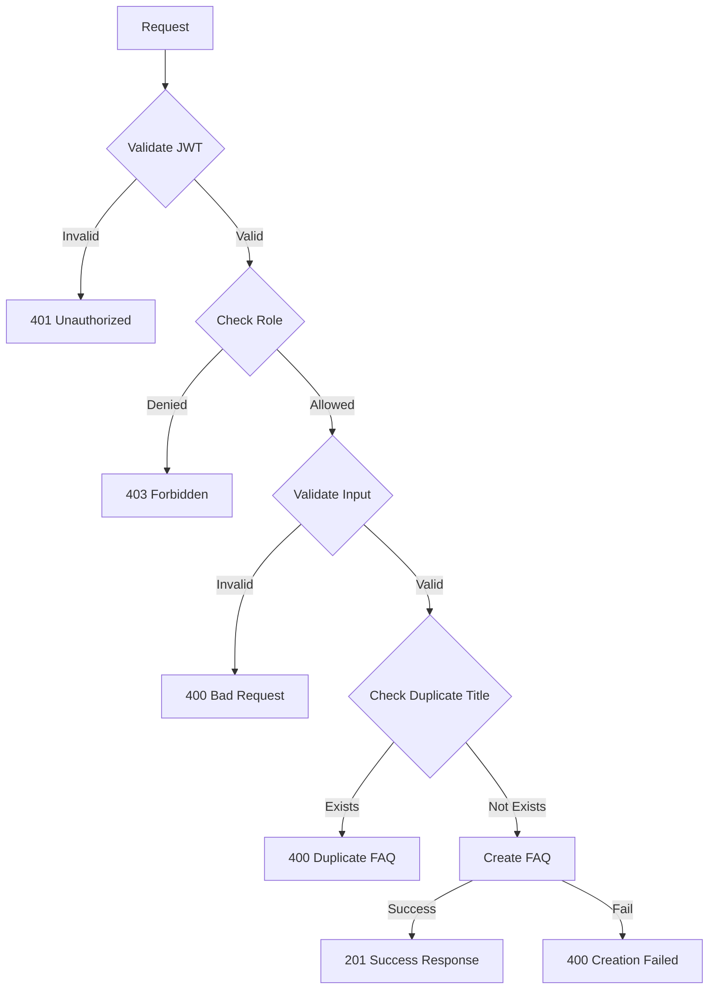
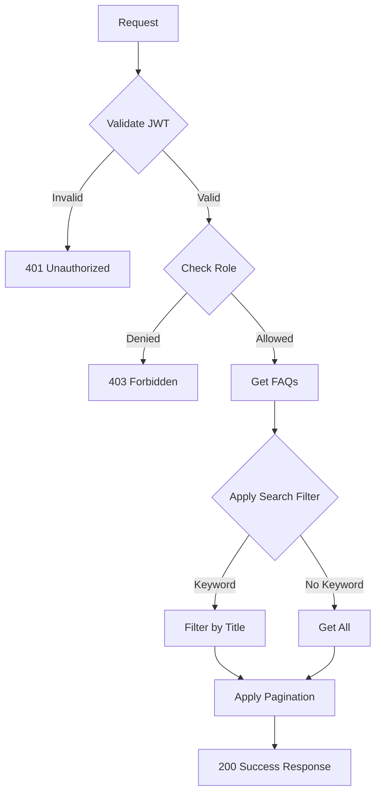
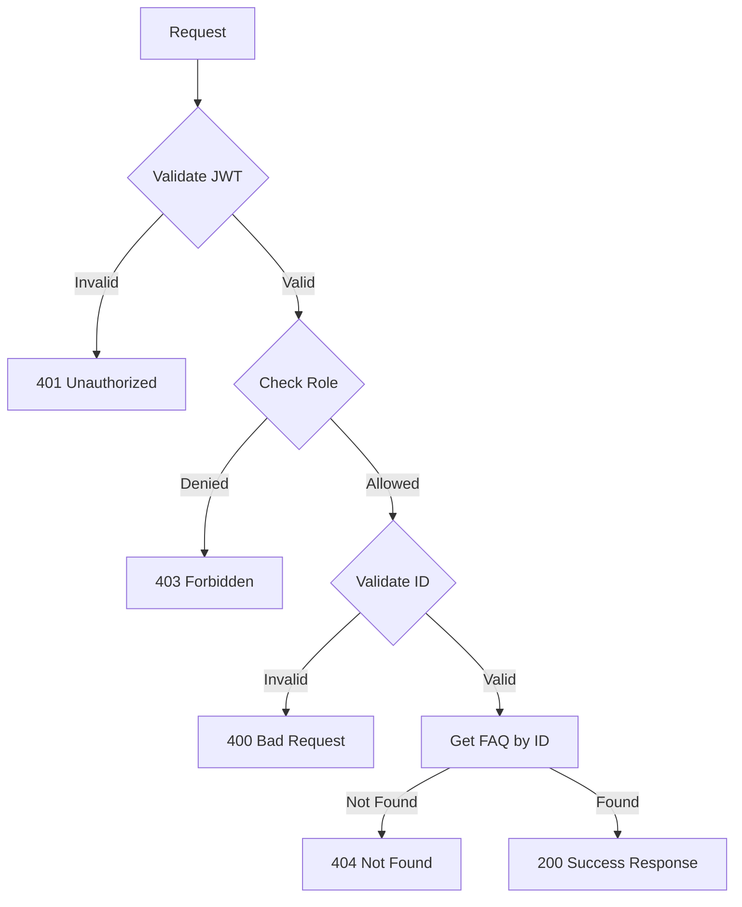
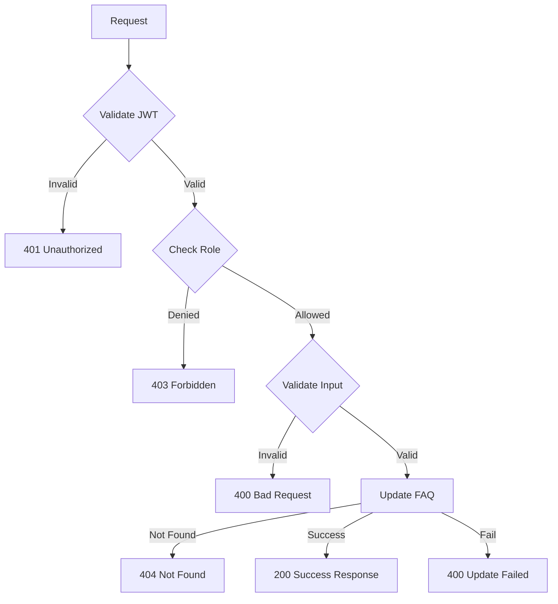
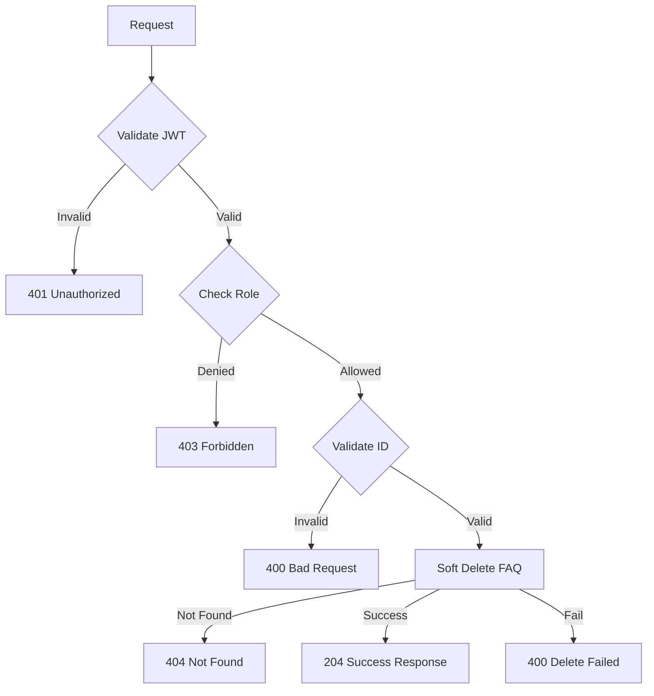

## Overview

The **FAQ Service** provides comprehensive FAQ (Frequently Asked Questions) management functionality for the Thryl platform, allowing administrators to create, read, update, and delete FAQ entries, while users can search and view FAQs to get answers to common questions.

### Tech Stack
- **Backend**: Node.js, Express.js
- **Database**: PostgreSQL
- **Authentication**: JWT, bcrypt
- **Validation**: Joi
- **Error Handling**: Custom ApiError class

---

## System Architecture



---

## Database Schema



### Relationship Details

| Relationship | Type | Description | Foreign Key |
|--------------|------|-------------|-------------|
| users → faq (creator) | One-to-Many | User can create multiple FAQs | `faq.created_by_id` |
| users → faq (updater) | One-to-Many | User can update multiple FAQs | `faq.updated_by_id` |
| users → faq (deleter) | One-to-Many | User can delete multiple FAQs | `faq.deleted_by_id` |

### Index Information

| Table | Index Type | Indexed Fields | Purpose |
|-------|------------|----------------|---------|
| faq | btree | `created_by_id` | Fast lookup of FAQs by creator |
| faq | btree | `is_deleted` | Soft delete filtering |
| faq | btree | `faq_id` | FAQ identifier lookup |
| faq | btree, gin | `title` | Title search and full-text search |
| faq | brin | `created_at` | Time-based queries |

### Table Structure

#### faq
| Column | Type | Constraints | Index |
|--------|------|-------------|-------|
| id | bigint | PRIMARY KEY | - |
| faq_id | bigint | - | btree |
| title | text | - | btree, gin |
| description | text | - | - |
| created_by_id | bigint | NOT NULL, FK to users.id | btree |
| updated_by_id | bigint | FK to users.id | - |
| deleted_by_id | bigint | FK to users.id | - |
| created_at | timestamptz | DEFAULT now() | brin |
| updated_at | timestamptz | DEFAULT now() | - |
| is_deleted | smallint | DEFAULT 0 | btree |

---

## API Reference

### Authentication
All endpoints require JWT token:
```
Authorization: Bearer <jwt-token>
```

## Base URLs

| Environment   | URL                                 |
|---------------|-------------------------------------|
| Production    | `https://thryl-prod.com   ||    https://thryl-production.zapto.org`      |
| Staging       | `https://thryl-staging.zapto.org` |
| Development   | `http://localhost:3000  || http://localhost:3001`      |

---

### Complete API List

| # | Endpoint | Method | Purpose | Auth Required | Role Required |
|---|----------|--------|---------|---------------|---------------|
| 1 | `/create` | POST | Create new FAQ | Yes | admin |
| 2 | `/read` | GET | Get all FAQs with search | Yes | admin, player |
| 3 | `/read/:id` | GET | Get FAQ by ID | Yes | admin, player |
| 4 | `/update/:id` | PUT | Update FAQ | Yes | admin |
| 5 | `/delete/:id` | DELETE | Delete FAQ (soft delete) | Yes | admin |

---

## API 1: Create FAQ

**Endpoint**: `POST /create`

**Purpose**: Create a new FAQ entry (admin only)

**Headers**:
```
Authorization: Bearer <jwt-token>
Content-Type: application/json
```

**Request Body**:
```json
{
  "title": "How do I join a tournament?",
  "description": "To join a tournament, navigate to the tournaments section, select the tournament you want to join, and click the 'Join' button. Make sure you meet all the requirements before joining.",
  "faq_id": 1
}
```

**Success Response** (201):
```json
{
  "status": 1,
  "data": {
    "id": 123,
    "faq_id": 1,
    "title": "How do I join a tournament?",
    "description": "To join a tournament, navigate to the tournaments section, select the tournament you want to join, and click the 'Join' button. Make sure you meet all the requirements before joining.",
    "created_by_id": 456,
    "created_at": "2024-01-15T10:30:00.000Z",
    "updated_at": "2024-01-15T10:30:00.000Z",
    "is_deleted": 0
  },
  "message": "FAQ created successfully"
}
```

**Failure Responses**:

#### 400 - FAQ already exists
```json
{
  "status": 0,
  "message": "FAQ already exists",
  "error_code": "DUPLICATE_FAQ"
}
```

#### 400 - Missing title
```json
{
  "status": 0,
  "message": "Title is required",
  "error_code": "VALIDATION_ERROR"
}
```

#### 401 - Unauthorized
```json
{
  "status": 0,
  "message": "User not authenticated",
  "error_code": "UNAUTHORIZED"
}
```

#### 403 - Insufficient permissions
```json
{
  "status": 0,
  "message": "Access denied",
  "error_code": "FORBIDDEN"
}
```

**DFD**:


**Instructions & Business Logic**:
- JWT token required for authentication
- Role: admin only
- title required in request body
- description and faq_id are optional
- Validates unique title to prevent duplicates
- Creates FAQ record with timestamp and creator ID
- Returns created FAQ data

**Validation Schema**:
```javascript
const createFaqSchema = Joi.object({
    title: Joi.string().required(),
    description: Joi.string().optional().allow(null),
    faq_id: Joi.number().optional().allow(null),
});
```

**Database Operations**:
```sql
-- Check if FAQ already exists
SELECT * FROM faq WHERE title = $1

-- Create FAQ
INSERT INTO faq (title, description, created_by_id, faq_id) 
VALUES ($1, $2, $3, $4) RETURNING *
```

**Implementation Details**:
- Uses `catchAsync` wrapper for error handling
- Extracts `created_by_id` from JWT token (`req.user.id`)
- Uses parameterized queries to prevent SQL injection
- Throws `ApiError` with appropriate status codes
- Validates duplicate title before creation
- Returns complete FAQ record after creation

---

## API 2: Get All FAQs

**Endpoint**: `GET /read`

**Purpose**: Retrieve all FAQs with optional search and pagination

**Headers**:
```
Authorization: Bearer <jwt-token>
```

**Query Parameters**:
- `keyword` (optional): Search term for FAQ title
- `page` (optional): Page number for pagination
- `limit` (optional): Number of items per page

**Example Request**:
```
GET /read?keyword=tournament&page=1&limit=10
```

**Success Response** (200):
```json
{
  "status": 1,
  "data": [
    {
      "id": 123,
      "faq_id": 1,
      "title": "How do I join a tournament?",
      "description": "To join a tournament, navigate to the tournaments section...",
      "created_by_id": 456,
      "created_at": "2024-01-15T10:30:00.000Z",
      "updated_at": "2024-01-15T10:30:00.000Z",
      "is_deleted": 0
    },
    {
      "id": 124,
      "faq_id": 2,
      "title": "What are tournament rules?",
      "description": "Tournament rules vary by event. Check the specific tournament page for detailed rules...",
      "created_by_id": 456,
      "created_at": "2024-01-15T11:00:00.000Z",
      "updated_at": "2024-01-15T11:00:00.000Z",
      "is_deleted": 0
    }
  ],
  "message": "FAQ fetched successfully"
}
```

**Failure Responses**:

#### 401 - Unauthorized
```json
{
  "status": 0,
  "message": "User not authenticated",
  "error_code": "UNAUTHORIZED"
}
```

#### 403 - Insufficient permissions
```json
{
  "status": 0,
  "message": "Access denied",
  "error_code": "FORBIDDEN"
}
```

**DFD**:


**Instructions & Business Logic**:
- JWT token required for authentication
- Roles: admin, player
- Optional keyword search in title using ILIKE
- Implements pagination with offset and limit
- Excludes soft-deleted FAQs
- Orders by faq_id (nulls last) and id descending
- Returns array of FAQ objects

**Database Operations**:
```sql
SELECT * FROM faq 
WHERE is_deleted is distinct from 1 
AND ($3::text IS NULL OR title ILIKE $3::text) 
ORDER BY (faq_id IS NULL) DESC, id DESC 
OFFSET $1 LIMIT $2
```

**Implementation Details**:
- Uses `catchAsync` wrapper for error handling
- Extracts query parameters with defaults
- Uses parameterized queries to prevent SQL injection
- Handles null keyword gracefully
- Applies wildcard search with `%keyword%`
- Orders FAQs with faq_id priority (non-null first)

---

## API 3: Get FAQ by ID

**Endpoint**: `GET /read/:id`

**Purpose**: Retrieve a specific FAQ by its ID

**Headers**:
```
Authorization: Bearer <jwt-token>
```

**Path Parameters**:
- `id` (required): FAQ ID to retrieve

**Example Request**:
```
GET /read/123
```

**Success Response** (200):
```json
{
  "status": 1,
  "data": [
    {
      "id": 123,
      "faq_id": 1,
      "title": "How do I join a tournament?",
      "description": "To join a tournament, navigate to the tournaments section, select the tournament you want to join, and click the 'Join' button. Make sure you meet all the requirements before joining.",
      "created_by_id": 456,
      "created_at": "2024-01-15T10:30:00.000Z",
      "updated_at": "2024-01-15T10:30:00.000Z",
      "is_deleted": 0
    }
  ],
  "message": "FAQ fetched successfully"
}
```

**Failure Responses**:

#### 401 - Unauthorized
```json
{
  "status": 0,
  "message": "User not authenticated",
  "error_code": "UNAUTHORIZED"
}
```

#### 403 - Insufficient permissions
```json
{
  "status": 0,
  "message": "Access denied",
  "error_code": "FORBIDDEN"
}
```

#### 404 - FAQ not found
```json
{
  "status": 0,
  "message": "FAQ not found",
  "error_code": "NOT_FOUND"
}
```

**DFD**:


**Instructions & Business Logic**:
- JWT token required for authentication
- Roles: admin, player
- id required in path parameters
- Retrieves FAQ by faq_id field
- Excludes soft-deleted FAQs
- Returns array with single FAQ object

**Database Operations**:
```sql
SELECT * FROM faq 
WHERE faq_id = $1 AND is_deleted is distinct from 1
```

**Implementation Details**:
- Uses `catchAsync` wrapper for error handling
- Extracts `id` from path parameters (`req.params.id`)
- Uses parameterized queries to prevent SQL injection
- Searches by `faq_id` field, not primary key `id`
- Returns array format for consistency
- Handles empty results gracefully

---

## API 4: Update FAQ

**Endpoint**: `PUT /update/:id`

**Purpose**: Update an existing FAQ entry (admin only)

**Headers**:
```
Authorization: Bearer <jwt-token>
Content-Type: application/json
```

**Path Parameters**:
- `id` (required): FAQ ID to update

**Request Body**:
```json
{
  "title": "Updated: How do I join a tournament?",
  "description": "Updated description with more detailed steps...",
  "faq_id": 1
}
```

**Success Response** (200):
```json
{
  "status": 1,
  "data": {
    "id": 123,
    "faq_id": 1,
    "title": "Updated: How do I join a tournament?",
    "description": "Updated description with more detailed steps...",
    "created_by_id": 456,
    "updated_by_id": 456,
    "created_at": "2024-01-15T10:30:00.000Z",
    "updated_at": "2024-01-15T12:00:00.000Z",
    "is_deleted": 0
  },
  "message": "FAQ updated successfully"
}
```

**Failure Responses**:

#### 400 - Invalid input
```json
{
  "status": 0,
  "message": "Invalid input data",
  "error_code": "VALIDATION_ERROR"
}
```

#### 401 - Unauthorized
```json
{
  "status": 0,
  "message": "User not authenticated",
  "error_code": "UNAUTHORIZED"
}
```

#### 403 - Insufficient permissions
```json
{
  "status": 0,
  "message": "Access denied",
  "error_code": "FORBIDDEN"
}
```

#### 404 - FAQ not found
```json
{
  "status": 0,
  "message": "FAQ not found",
  "error_code": "NOT_FOUND"
}
```

**DFD**:


**Instructions & Business Logic**:
- JWT token required for authentication
- Role: admin only
- id required in path parameters
- All fields in request body are optional (partial updates)
- Uses COALESCE for partial updates
- Updates updated_by_id and updated_at timestamp
- Returns updated FAQ data

**Validation Schema**:
```javascript
const updateFaqSchema = Joi.object({
    title: Joi.string().optional().allow(null),
    description: Joi.string().optional().allow(null),
    faq_id: Joi.number().optional().allow(null),
});
```

**Database Operations**:
```sql
UPDATE faq SET 
    title = COALESCE($1, title), 
    description = COALESCE($2, description), 
    updated_by_id = COALESCE($3, updated_by_id),
    faq_id = COALESCE($4, faq_id)
WHERE id = $4 AND is_deleted IS DISTINCT FROM 1 
RETURNING *
```

**Implementation Details**:
- Uses `catchAsync` wrapper for error handling
- Extracts `id` from path parameters and `updated_by_id` from JWT token
- Uses COALESCE for partial updates (only update provided fields)
- Uses parameterized queries to prevent SQL injection
- Excludes soft-deleted FAQs from updates
- Returns complete updated FAQ record

---

## API 5: Delete FAQ

**Endpoint**: `DELETE /delete/:id`

**Purpose**: Soft delete an FAQ entry (admin only)

**Headers**:
```
Authorization: Bearer <jwt-token>
```

**Path Parameters**:
- `id` (required): FAQ ID to delete

**Example Request**:
```
DELETE /delete/123
```

**Success Response** (204):
```json
{
  "status": 1,
  "data": {
    "id": 123,
    "faq_id": 1,
    "title": "How do I join a tournament?",
    "description": "To join a tournament...",
    "created_by_id": 456,
    "deleted_by_id": 456,
    "created_at": "2024-01-15T10:30:00.000Z",
    "updated_at": "2024-01-15T10:30:00.000Z",
    "is_deleted": 1
  },
  "message": "FAQ deleted successfully"
}
```

**Failure Responses**:

#### 401 - Unauthorized
```json
{
  "status": 0,
  "message": "User not authenticated",
  "error_code": "UNAUTHORIZED"
}
```

#### 403 - Insufficient permissions
```json
{
  "status": 0,
  "message": "Access denied",
  "error_code": "FORBIDDEN"
}
```

#### 404 - FAQ not found
```json
{
  "status": 0,
  "message": "FAQ not found",
  "error_code": "NOT_FOUND"
}
```

**DFD**:


**Instructions & Business Logic**:
- JWT token required for authentication
- Role: admin only
- id required in path parameters
- Performs soft delete (sets is_deleted = 1)
- Records deleted_by_id and timestamp
- Returns deleted FAQ data with is_deleted flag

**Database Operations**:
```sql
UPDATE faq SET is_deleted = 1, deleted_by_id = $1 
WHERE id = $2 RETURNING *
```

**Implementation Details**:
- Uses `catchAsync` wrapper for error handling
- Extracts `id` from path parameters and `deleted_by_id` from JWT token
- Uses parameterized queries to prevent SQL injection
- Performs soft delete (data remains in database)
- Returns complete FAQ record with deletion info
- Returns 204 No Content status

---

## Error Handling

### Common Error Codes

| Code | Description |
|------|-------------|
| 400 | Bad Request - Invalid input data or business rule violation |
| 401 | Unauthorized - Missing or invalid JWT |
| 403 | Forbidden - Insufficient permissions |
| 404 | Not Found - FAQ not found |
| 500 | Internal Server Error - Server error |

### Error Response Format
```json
{
  "status": 0,
  "message": "Error description",
  "error_code": "ERROR_TYPE"
}
```

---

## Rate Limiting

- **Create/Update/Delete**: 10 requests per minute per admin
- **Read Operations**: 60 requests per minute per user
- **Search Operations**: 30 requests per minute per user

---

## Security Considerations

1. **JWT Authentication**: All endpoints require valid JWT tokens
2. **Role-based Access**: Admin-only for create/update/delete operations
3. **Input Validation**: All inputs validated using Joi schemas
4. **Duplicate Prevention**: Unique title validation for new FAQs
5. **Soft Delete**: FAQs are soft-deleted, not permanently removed
6. **SQL Injection Prevention**: Uses parameterized queries
7. **Audit Trail**: Tracks creator, updater, and deleter information

---

## Business Rules

### FAQ Management Rules
1. Only admins can create, update, and delete FAQs
2. All users (admin, player) can read and search FAQs
3. FAQ titles must be unique to prevent duplicates
4. FAQs are soft-deleted, not permanently removed
5. Search is case-insensitive using ILIKE
6. FAQs are ordered by faq_id priority (non-null first)

### Content Rules
1. Title is required for all FAQs
2. Description is optional but recommended
3. faq_id is optional for categorization
4. All fields support partial updates
5. Deleted FAQs are excluded from all queries

---

## Monitoring & Logging

- All FAQ operations logged with user IDs and action
- FAQ creation and update patterns tracked
- Search query patterns analyzed for user behavior
- Failed operations tracked for debugging
- Admin activity monitored for content management

---

## Integration Examples

### Frontend Integration

```javascript
// Get all FAQs
const getAllFaqs = async (keyword = '', page = 1, limit = 10) => {
  const response = await fetch(`/api/v1/faqs/read?keyword=${keyword}&page=${page}&limit=${limit}`, {
    headers: {
      'Authorization': `Bearer ${token}`
    }
  });
  
  const result = await response.json();
  return result.data;
};

// Get FAQ by ID
const getFaqById = async (id) => {
  const response = await fetch(`/api/v1/faqs/read/${id}`, {
    headers: {
      'Authorization': `Bearer ${token}`
    }
  });
  
  const result = await response.json();
  return result.data[0];
};

// Create FAQ (admin only)
const createFaq = async (faqData) => {
  const response = await fetch('/api/v1/faqs/create', {
    method: 'POST',
    headers: {
      'Authorization': `Bearer ${adminToken}`,
      'Content-Type': 'application/json'
    },
    body: JSON.stringify(faqData)
  });
  
  const result = await response.json();
  return result.data;
};

// Example usage
try {
  const faqs = await getAllFaqs('tournament', 1, 5);
  console.log('FAQs:', faqs);
  
  const faq = await getFaqById(123);
  console.log('FAQ details:', faq);
  
  const newFaq = await createFaq({
    title: 'New FAQ',
    description: 'FAQ description',
    faq_id: 5
  });
  console.log('Created FAQ:', newFaq);
} catch (error) {
  console.error('FAQ operation failed:', error.message);
}
```

## Use Cases

### 1. User Support
- Users search FAQs for quick answers
- Reduces support ticket volume
- Provides 24/7 self-service support
- Improves user experience

### 2. Content Management
- Admins manage FAQ content centrally
- Easy updates and maintenance
- Version control through audit trail
- Organized content structure

### 3. Knowledge Base
- Build comprehensive knowledge base
- Categorize FAQs with faq_id
- Searchable content for users
- Scalable information management

### 4. Platform Onboarding
- Help new users understand platform
- Common questions and answers
- Feature explanations and tutorials
- Troubleshooting guides

---

## Performance Considerations

### Database Optimization
- Indexes on `created_by_id`, `is_deleted`, and `faq_id` for fast lookups
- B-tree and GIN indexes on `title` for search and full-text search
- BRIN index on `created_at` for time-based queries
- Efficient soft delete filtering

### Caching Strategy
- Cache frequently accessed FAQs
- Redis cache for search results with TTL
- Invalidate cache on FAQ updates
- Cache pagination results

### Query Optimization
- Use parameterized queries for security
- Limit result sets with pagination
- Optimize search queries with proper indexing
- Efficient soft delete handling

---

## Testing Scenarios

### Unit Tests
- FAQ creation functionality
- FAQ update functionality
- FAQ deletion functionality
- Search and pagination
- Error handling for invalid inputs

### Integration Tests
- End-to-end FAQ management flow
- Authentication and authorization
- Database consistency
- API response validation

### Performance Tests
- Load testing with multiple concurrent users
- Database query performance
- Search performance under load
- Memory usage optimization

### Security Tests
- SQL injection prevention
- JWT token validation
- Role-based access control
- Input sanitization

---

## Future Enhancements

### Planned Features
1. **FAQ Categories**: Organize FAQs by categories
2. **FAQ Tags**: Add tags for better searchability
3. **FAQ Analytics**: Track most viewed/searched FAQs
4. **FAQ Versioning**: Track FAQ change history
5. **FAQ Templates**: Predefined FAQ templates
6. **FAQ Import/Export**: Bulk FAQ management
7. **FAQ Comments**: Allow user feedback on FAQs
8. **FAQ Search Suggestions**: Auto-complete search suggestions 