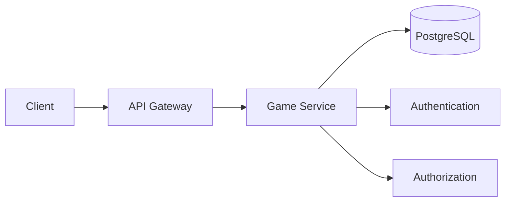
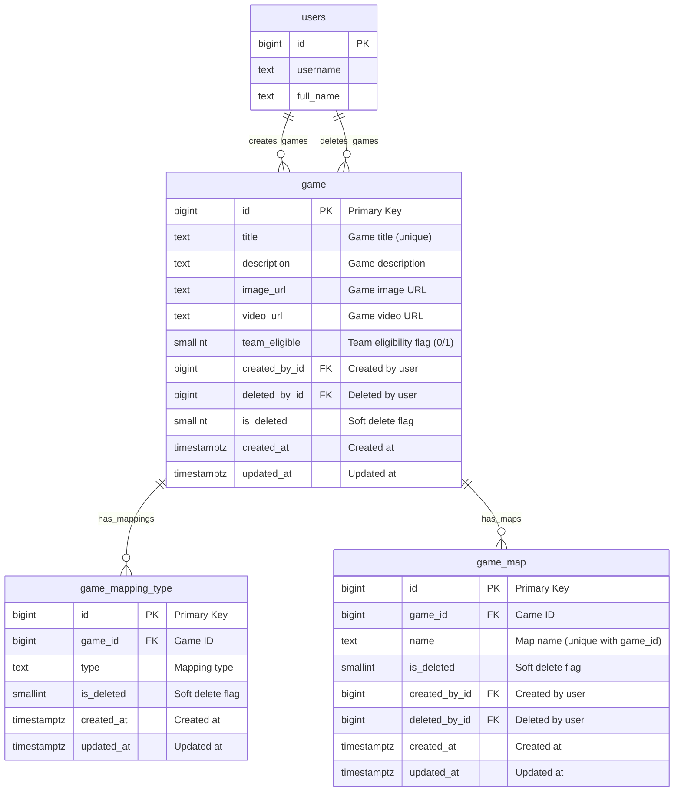
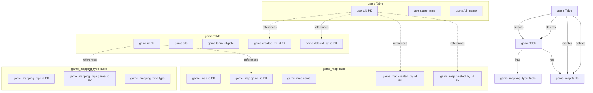
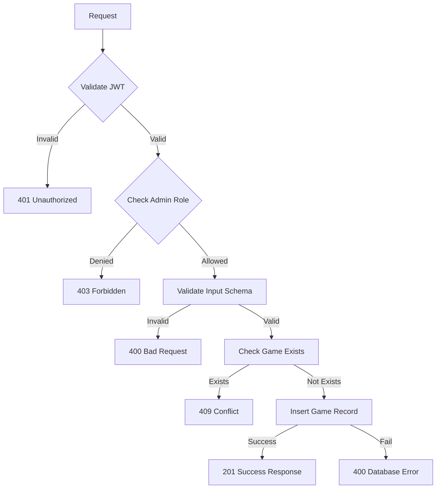
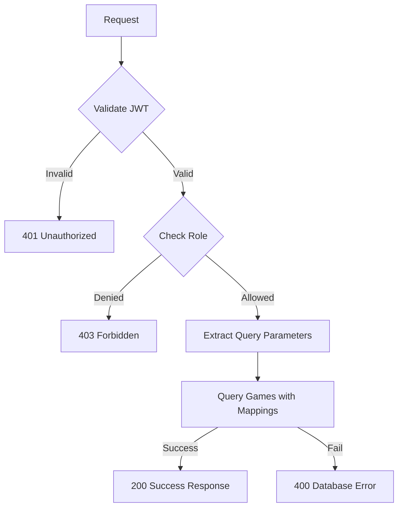
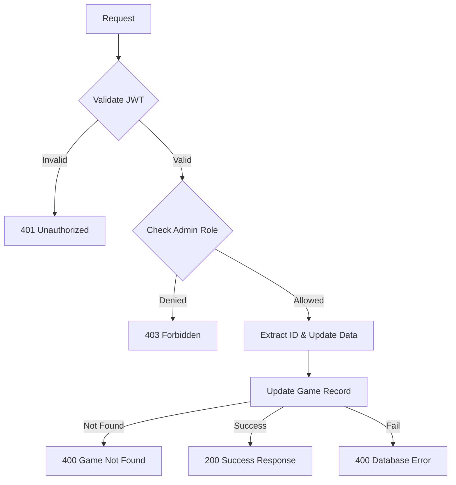
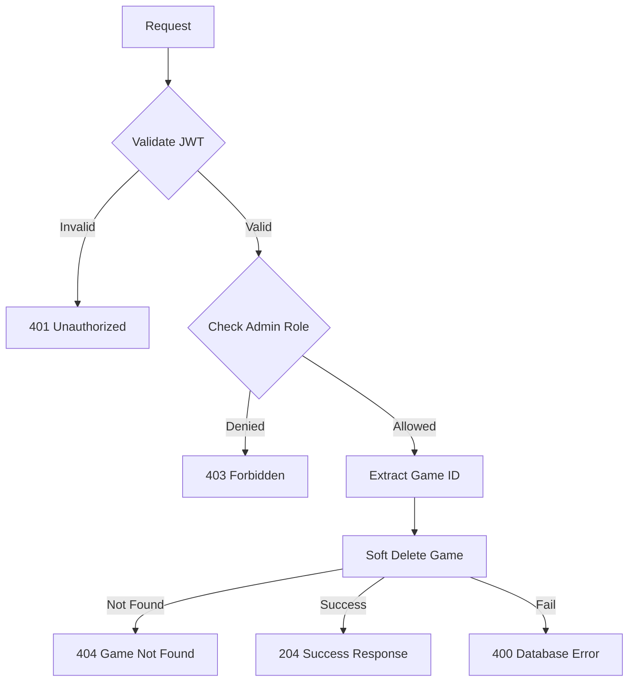
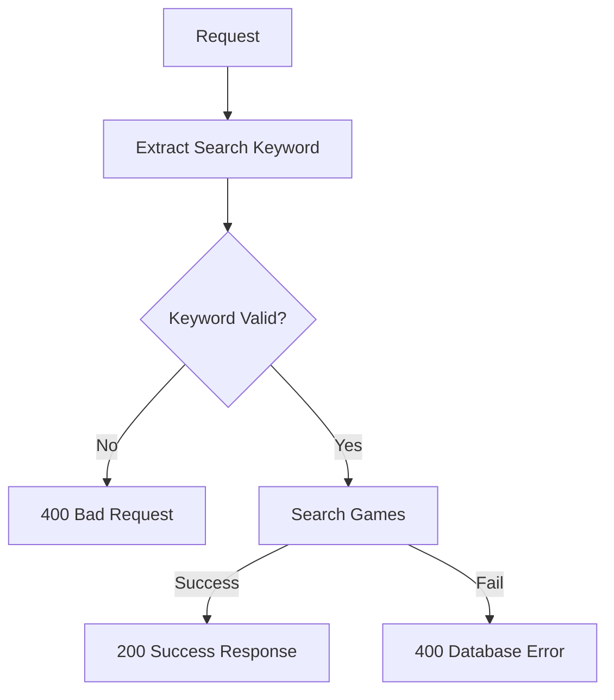
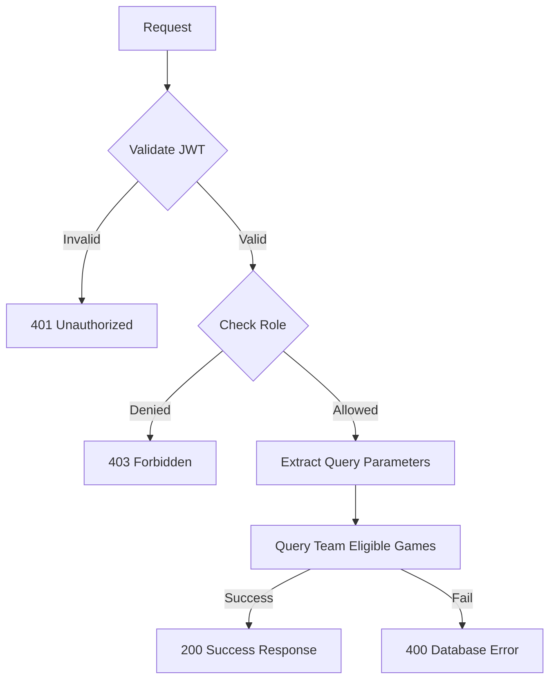
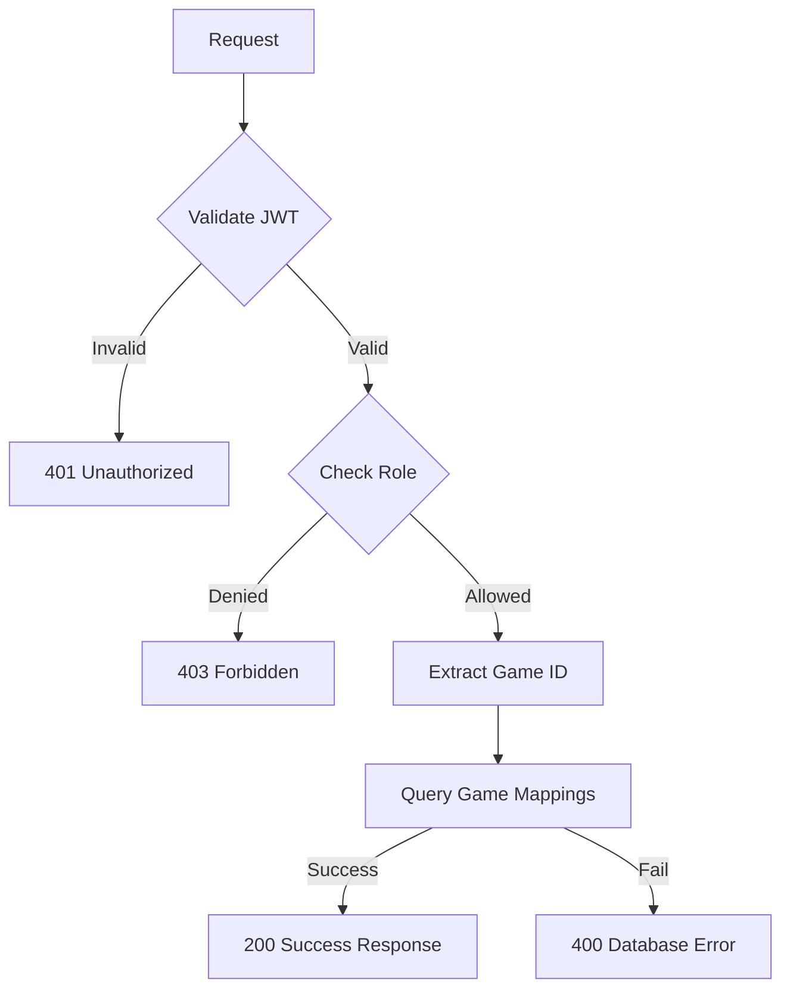

## Overview

The **Game Service** provides comprehensive game management functionality for the Thryl platform, enabling admins to create, update, and manage games while users can search, view, and check game eligibility. The service supports game mapping, team eligibility, and advanced search capabilities. Games can be categorized, mapped to specific types, and filtered based on various criteria.

### Tech Stack
- **Backend**: Node.js, Express.js
- **Database**: PostgreSQL
- **Authentication**: JWT
- **Validation**: Joi
- **Authorization**: Role-based access control

---

## System Architecture



---

## Database Schema



## Table Relationship Graph



### Relationship Details

| Relationship | Type | Description | Foreign Key |
|--------------|------|-------------|-------------|
| users → game (creation) | One-to-Many | User can create multiple games | `game.created_by_id` |
| users → game (deletion) | One-to-Many | User can delete multiple games | `game.deleted_by_id` |
| users → game_map (creation) | One-to-Many | User can create multiple game maps | `game_map.created_by_id` |
| users → game_map (deletion) | One-to-Many | User can delete multiple game maps | `game_map.deleted_by_id` |
| game → game_mapping_type | One-to-Many | Game can have multiple mapping types | `game_mapping_type.game_id` |
| game → game_map | One-to-Many | Game can have multiple maps | `game_map.game_id` |

### Index Information

| Table | Index Type | Indexed Fields | Purpose |
|-------|------------|----------------|---------|
| game | btree | `created_by_id` | Creator-based queries |
| game | brin | `created_at` | Fast time-based queries |
| game | btree | `is_deleted` | Soft delete filtering |
| game | btree, gin | `title` | Title-based queries and full-text search |
| game | btree, gin | `description` | Description-based queries and full-text search |
| game | btree | `team_eligible` | Team eligibility filtering |
| game_mapping_type | btree | `game_id` | Game-based mapping queries |
| game_mapping_type | btree | `is_deleted` | Soft delete filtering |
| game_map | btree | `game_id` | Game-based map queries |
| game_map | btree, gin | `name` | Name-based queries and full-text search |
| game_map | btree | `created_by_id` | Creator-based queries |
| game_map | btree | `is_deleted` | Soft delete filtering |

---

## Base URLs

| Environment   | URL                                 |
|---------------|-------------------------------------|
| Production    | `https://thryl-prod.com   ||    https://thryl-production.zapto.org`      |
| Staging       | `https://thryl-staging.zapto.org` |
| Development   | `http://localhost:3000  || http://localhost:3001`      |

---

## Authentication

All Game Service APIs require JWT authentication (except search). Include the token in the Authorization header:

```http
Authorization: Bearer <your-jwt-token>
```

---

## Authorization

| Role         | Permissions                                      |
|--------------|--------------------------------------------------|
| **Admin**    | Create, read, update, delete games, check eligibility, get mappings |
| **Player**   | Read games, check eligibility                    |
| **Organizer**| Read games, check eligibility, get mappings     |
| **Organizer Team**| Read games, check eligibility, get mappings |

---

## API Reference

### Complete API List

| # | Endpoint                    | Method | Purpose                                 | Auth Required | Role Required         |
|---|-----------------------------|--------|-----------------------------------------|---------------|----------------------|
| 1 | `/create`                   | POST   | Create a new game                       | Yes           | admin                |
| 2 | `/read`                     | GET    | Get all games with pagination           | Yes           | admin, player, organizer, organizer_team |
| 3 | `/update/:id`               | PUT    | Update an existing game                 | Yes           | admin                |
| 4 | `/delete`                   | DELETE | Delete a game (soft delete)             | Yes           | admin                |
| 5 | `/search`                   | GET    | Search games by title/description       | No            | Public               |
| 6 | `/check-eligibility`        | GET    | Get team-eligible games                 | Yes           | player, admin, organizer, organizer_team |
| 7 | `/map/:game_id`             | GET    | Get game mapping names                  | Yes           | admin, organizer, organizer_team |

---

## Validation Schemas

### Create Game Schema
```javascript
{
  title: Joi.string().required(),
  description: Joi.string().required(),
  image_url: Joi.string().optional(),
  video_url: Joi.string().optional(),
  team_eligible: Joi.number().valid(0, 1).optional()
}
```

### Get All Games Schema
```javascript
{
  id: Joi.number().integer().positive().optional(),
  limit: Joi.number().integer().positive().default(10),
  page: Joi.number().integer().positive().default(1)
}
```

### Update Game Schema
```javascript
{
  id: Joi.number().integer().optional(),
  title: Joi.string().max(255).optional(),
  description: Joi.string().max(1000).optional(),
  image_url: Joi.string().uri().optional(),
  video_url: Joi.string().uri().optional(),
  team_eligible: Joi.number().valid(0, 1).optional()
}
```

### Delete Game Schema
```javascript
{
  id: Joi.number().integer().optional(),
  deleted_by_id: Joi.number().integer().optional()
}
```

---

## API Endpoints

### 1. Create Game

Creates a new game with title, description, and optional media URLs.

**Endpoint:** `POST /game/create`

**Authorization:** Admin only

**Request Body:**
```json
{
  "title": "PUBG Mobile",
  "description": "Battle Royale mobile game",
  "image_url": "https://example.com/pubg.jpg",
  "video_url": "https://example.com/pubg-video.mp4",
  "team_eligible": 1
}
```

**Success Response (201):**
```json
{
  "status": 1,
  "data": {
    "id": 1,
    "title": "pubg mobile",
    "description": "battle royale mobile game",
    "image_url": "https://example.com/pubg.jpg",
    "video_url": "https://example.com/pubg-video.mp4",
    "team_eligible": 1,
    "created_by_id": 123,
    "created_at": "2024-01-15T10:30:00Z",
    "updated_at": "2024-01-15T10:30:00Z"
  }
}
```

**Error Response (409):**
```json
{
  "status": 0,
  "message": "Game Already Exists."
}
```

**DFD:**


#### Business Logic

1. **Input Validation**: Validates required fields and data types
2. **Title Case Conversion**: Converts title and description to lowercase
3. **Duplicate Check**: Prevents creation of games with duplicate titles
4. **Creator Tracking**: Records who created the game
5. **Team Eligibility**: Sets whether game is eligible for team play

#### Database Operations

```sql
-- Check for existing game
SELECT LOWER(title) FROM game WHERE LOWER(title) = $1;

-- Insert new game
INSERT INTO game (title, description, image_url, video_url, created_by_id, team_eligible)
VALUES ($1, $2, $3, $4, $5, $6)
RETURNING *;
```

---

### 2. Get All Games

Retrieves all games with pagination, filtering, and game mapping information.

**Endpoint:** `GET /game/read`

**Authorization:** Admin, player, organizer, organizer_team

**Query Parameters:**
- `id` (optional): Get specific game by ID
- `page` (optional): Page number (default: 1)
- `limit` (optional): Items per page (default: 10)

**Example Request:**
```http
GET /game/read?page=1&limit=10
```

**Success Response (200):**
```json
{
  "status": 1,
  "data": {
    "games": [
      {
        "id": 1,
        "title": "pubg mobile",
        "description": "battle royale mobile game",
        "image_url": "https://example.com/pubg.jpg",
        "video_url": "https://example.com/pubg-video.mp4",
        "team_eligible": 1,
        "created_by_id": 123,
        "deleted_by_id": null,
        "created_at": "2024-01-15T10:30:00Z",
        "updated_at": "2024-01-15T10:30:00Z",
        "game_mapping": [
          {
            "id": 1,
            "game_id": 1,
            "type": "battle_royale"
          }
        ]
      }
    ]
  },
  "pageNumber": 1,
  "limit": 10
}
```

**Error Response (400):**
```json
{
  "status": 0,
  "message": "Failed to retrieve games."
}
```

**DFD:**


#### Business Logic

1. **Pagination**: Efficient offset-based pagination
2. **Game Filtering**: Optional filtering by specific game ID
3. **Mapping Integration**: Includes game mapping types for each game
4. **BGMI Exclusion**: Excludes 'BGMI' game from results
5. **Soft Delete Protection**: Only returns non-deleted games

#### Database Operations

```sql
-- Get games with pagination
SELECT * FROM game 
WHERE ($1::INTEGER IS NULL OR id = $1) 
  AND is_deleted IS DISTINCT FROM 1 
  AND title != 'BGMI' 
ORDER BY id DESC OFFSET $2 LIMIT $3;

-- Get game mappings
SELECT * FROM game_mapping_type 
WHERE game_id = ANY($1) AND is_deleted IS DISTINCT FROM 1;
```

---

### 3. Update Game

Updates an existing game with partial updates.

**Endpoint:** `PUT /game/update/:id`

**Authorization:** Admin only

**Request Body:**
```json
{
  "title": "Updated PUBG Mobile",
  "description": "Updated battle royale description",
  "image_url": "https://example.com/updated-pubg.jpg",
  "video_url": "https://example.com/updated-pubg-video.mp4",
  "team_eligible": 0
}
```

**Success Response (200):**
```json
{
  "status": 1,
  "data": {
    "id": 1,
    "title": "updated pubg mobile",
    "description": "updated battle royale description",
    "image_url": "https://example.com/updated-pubg.jpg",
    "video_url": "https://example.com/updated-pubg-video.mp4",
    "team_eligible": 0,
    "created_by_id": 123,
    "updated_at": "2024-01-15T12:30:00Z"
  }
}
```

**Error Response (400):**
```json
{
  "status": 0,
  "message": "Game not found or has been deleted."
}
```

**DFD:**


#### Business Logic

1. **Partial Updates**: Supports updating specific fields only
2. **Title Case Conversion**: Converts title and description to lowercase
3. **Admin Only**: Restricted to admin users
4. **Existence Check**: Verifies game exists before update
5. **Soft Delete Protection**: Only updates non-deleted games

#### Database Operations

```sql
UPDATE game 
SET title = COALESCE($1, title), 
    description = COALESCE($2, description), 
    image_url = COALESCE($3, image_url), 
    video_url = COALESCE($4, video_url), 
    created_by_id = $5,
    team_eligible = $6,
    updated_at = NOW() 
WHERE id = $7 AND is_deleted IS DISTINCT FROM 1
RETURNING *;
```

---

### 4. Delete Game

Soft deletes a game (marks as deleted but keeps data).

**Endpoint:** `DELETE /game/delete`

**Authorization:** Admin only

**Request Body:**
```json
{
  "id": 1
}
```

**Success Response (204):**
```json
{
  "status": 1,
  "data": {
    "id": 1,
    "title": "pubg mobile",
    "description": "battle royale mobile game",
    "is_deleted": 1,
    "deleted_by_id": 123,
    "updated_at": "2024-01-15T12:30:00Z"
  }
}
```

**Error Response (404):**
```json
{
  "status": 0,
  "message": "Game not found or already deleted."
}
```

**DFD:**


#### Business Logic

1. **Soft Delete**: Marks game as deleted without removing data
2. **Admin Only**: Restricted to admin users
3. **Existence Check**: Verifies game exists before deletion
4. **Deletion Tracking**: Records who deleted the game

#### Database Operations

```sql
UPDATE game 
SET is_deleted = 1, 
    updated_at = NOW(), 
    deleted_by_id = $2 
WHERE id = $1 AND is_deleted IS DISTINCT FROM 1 
RETURNING *;
```

---

### 5. Search Games

Searches games by title or description (public endpoint).

**Endpoint:** `GET /game/search`

**Authorization:** Public (no authentication required)

**Query Parameters:**
- `keyword` (required): Search keyword

**Example Request:**
```http
GET /game/search?keyword=battle
```

**Success Response (200):**
```json
{
  "status": 1,
  "data": {
    "totalGames": 1,
    "games": [
      {
        "id": 1,
        "title": "pubg mobile",
        "description": "battle royale mobile game",
        "image_url": "https://example.com/pubg.jpg",
        "video_url": "https://example.com/pubg-video.mp4",
        "created_by_id": 123,
        "created_at": "2024-01-15T10:30:00Z",
        "updated_at": "2024-01-15T10:30:00Z"
      }
    ]
  }
}
```

**Error Response (400):**
```json
{
  "status": 0,
  "message": "Invalid search term provided."
}
```

**DFD:**


#### Business Logic

1. **Public Access**: No authentication required
2. **Keyword Search**: Searches both title and description
3. **Case Insensitive**: Case-insensitive search
4. **BGMI Exclusion**: Excludes 'BGMI' game from results
5. **Soft Delete Protection**: Only returns non-deleted games

#### Database Operations

```sql
SELECT * FROM game 
WHERE (LOWER(title) LIKE LOWER($1) OR LOWER(description) LIKE LOWER($1)) 
  AND is_deleted IS DISTINCT FROM 1 
  AND title != 'BGMI' 
ORDER BY id DESC;
```

---

### 6. Check Game Eligibility

Retrieves games that are eligible for team play.

**Endpoint:** `GET /game/check-eligibility`

**Authorization:** Player, admin, organizer, organizer_team

**Query Parameters:**
- `page` (optional): Page number (default: 1)
- `limit` (optional): Items per page (default: 10)

**Example Request:**
```http
GET /game/check-eligibility?page=1&limit=10
```

**Success Response (200):**
```json
{
  "status": 1,
  "data": [
    {
      "id": 1,
      "title": "pubg mobile",
      "description": "battle royale mobile game",
      "image_url": "https://example.com/pubg.jpg",
      "video_url": "https://example.com/pubg-video.mp4",
      "team_eligible": 1,
      "created_at": "2024-01-15T10:30:00Z",
      "updated_at": "2024-01-15T10:30:00Z"
    }
  ]
}
```

**Error Response (400):**
```json
{
  "status": 0,
  "message": "Failed to retrieve eligible games."
}
```

**DFD:**


#### Business Logic

1. **Team Eligibility**: Only returns games with team_eligible = 1
2. **Pagination**: Efficient offset-based pagination
3. **Soft Delete Protection**: Only returns non-deleted games
4. **Role Access**: Accessible to players, admins, and organizers

#### Database Operations

```sql
SELECT * FROM game 
WHERE team_eligible = $1 
  AND is_deleted IS DISTINCT FROM 1 
ORDER BY id DESC OFFSET $2 LIMIT $3;
```

---

### 7. Get Game Mapping

Retrieves mapping names for a specific game.

**Endpoint:** `GET /game/map/:game_id`

**Authorization:** Admin, organizer, organizer_team

**Example Request:**
```http
GET /game/map/1
```

**Success Response (200):**
```json
{
  "status": 1,
  "data": [
    "Erangel",
    "Miramar",
    "Sanhok",
    "Vikendi"
  ]
}
```

**Error Response (400):**
```json
{
  "status": 0,
  "message": "Failed to retrieve game mappings."
}
```

**DFD:**


#### Business Logic

1. **Map Names Only**: Returns only the map names, not full objects
2. **Game-Specific**: Returns mappings for the specified game only
3. **Soft Delete Protection**: Only returns non-deleted mappings
4. **Role Access**: Accessible to admins and organizers

#### Database Operations

```sql
SELECT name, game_id FROM game_map 
WHERE game_id = $1 AND is_deleted IS DISTINCT FROM 1;
```

---

## Rate Limiting

| Endpoint                | Rate Limit | Window      |
|-------------------------|------------|-------------|
| All Game APIs           | 100        | 15 minutes  |

---

## Security Considerations

### Authentication
- JWT token validation on all endpoints (except search)
- Token expiration handling
- Secure token transmission

### Authorization
- Role-based access control for different user types
- Admin-only creation, update, and deletion operations
- Public access for game search

### Input Validation
- Request body validation using Joi schemas
- Query parameter validation
- SQL injection prevention through parameterized queries
- Input sanitization

### Data Protection
- Soft delete for data preservation
- Unique constraints on game titles and map names
- Input sanitization and case normalization

---

## Business Rules

### Game Management
1. Only admins can create, update, and delete games
2. Game titles must be unique across the system
3. Games are soft deleted to preserve data integrity
4. BGMI game is excluded from search and listing results

### Game Mapping
1. Map names must be unique within a game
2. Only admins and organizers can view game mappings
3. Mappings are game-specific and cannot be shared

### Team Eligibility
1. Games can be marked as team-eligible or not
2. Team eligibility is used for tournament and team formation
3. All user types can check game eligibility

### Data Integrity
1. Foreign key relationships are maintained
2. Soft delete flags prevent accidental data loss
3. Audit trails track game creation and modification
4. Unique constraints prevent duplicate entries

---

## Monitoring & Logging

### Metrics to Monitor
- API response times
- Error rates by endpoint
- Database query performance
- Game creation and update rates
- Search query performance

### Logging
- Request/response logging
- Error logging with stack traces
- Database operation logging
- Game lifecycle event logging

### Alerts
- High error rates (>5%)
- Slow response times (>2s)
- Database connection issues
- Failed game operations

---

## Integration Examples

### Frontend Integration

```javascript
// Create a new game
const createGame = async (gameData) => {
  const response = await fetch('/api/v1/game/create', {
    method: 'POST',
    headers: {
      'Content-Type': 'application/json',
      'Authorization': `Bearer ${token}`
    },
    body: JSON.stringify(gameData)
  });
  return response.json();
};

// Get all games
const getAllGames = async (page = 1, limit = 10, id = null) => {
  const params = new URLSearchParams({
    page: page.toString(),
    limit: limit.toString(),
    ...(id && { id: id.toString() })
  });
  const response = await fetch(`/api/v1/game/read?${params}`, {
    headers: {
      'Authorization': `Bearer ${token}`
    }
  });
  return response.json();
};

// Update a game
const updateGame = async (id, updateData) => {
  const response = await fetch(`/api/v1/game/update/${id}`, {
    method: 'PUT',
    headers: {
      'Content-Type': 'application/json',
      'Authorization': `Bearer ${token}`
    },
    body: JSON.stringify(updateData)
  });
  return response.json();
};

// Delete a game
const deleteGame = async (id) => {
  const response = await fetch('/api/v1/game/delete', {
    method: 'DELETE',
    headers: {
      'Content-Type': 'application/json',
      'Authorization': `Bearer ${token}`
    },
    body: JSON.stringify({ id })
  });
  return response.json();
};

// Search games
const searchGames = async (keyword) => {
  const params = new URLSearchParams({ keyword });
  const response = await fetch(`/api/v1/game/search?${params}`);
  return response.json();
};

// Check game eligibility
const checkGameEligibility = async (page = 1, limit = 10) => {
  const params = new URLSearchParams({
    page: page.toString(),
    limit: limit.toString()
  });
  const response = await fetch(`/api/v1/game/check-eligibility?${params}`, {
    headers: {
      'Authorization': `Bearer ${token}`
    }
  });
  return response.json();
};

// Get game mappings
const getGameMappings = async (gameId) => {
  const response = await fetch(`/api/v1/game/map/${gameId}`, {
    headers: {
      'Authorization': `Bearer ${token}`
    }
  });
  return response.json();
};
```

### Error Handling

```javascript
const handleGameOperation = async (operation) => {
  try {
    const result = await operation();
    if (result.status === 1) {
      console.log('Operation successful:', result.data);
      return result.data;
    } else {
      console.error('Operation failed:', result.message);
      throw new Error(result.message);
    }
  } catch (error) {
    console.error('Game operation failed:', error.message);
    // Handle different error types
    if (error.message.includes('Game Already Exists')) {
      // Handle duplicate game error
    } else if (error.message.includes('Game not found')) {
      // Handle not found error
    } else if (error.message.includes('Unauthorized')) {
      // Handle authentication error
    } else if (error.message.includes('Forbidden')) {
      // Handle authorization error
    } else {
      // Handle general error
    }
  }
};
```

---

## Use Cases

### 1. Game Management
- Admins create and manage games for the platform
- Update game information and media assets
- Soft delete games while preserving data

### 2. Game Discovery
- Users search for games by title or description
- View game details and eligibility for team play
- Access game mappings for tournament organization

### 3. Tournament Organization
- Organizers check game eligibility for team tournaments
- Access game mappings for tournament setup
- Filter games based on team eligibility

---

## Performance Considerations

### Database Optimization
- Indexes on `title`, `description`, `team_eligible`, and `created_by_id` for fast lookups
- Efficient pagination with offset-based queries
- Optimized JOIN operations for game mappings
- Full-text search capabilities with GIN indexes

### Query Optimization
- Use parameterized queries for security
- Limit result sets with pagination
- Efficient filtering by team eligibility and deletion status
- Optimized search queries with LIKE patterns

---

## Testing Scenarios

### Unit Tests
- Game creation and validation
- Game update functionality
- Game deletion (soft delete)
- Search functionality
- Game mapping retrieval

### Integration Tests
- End-to-end game lifecycle
- Authentication and authorization
- Database consistency
- API response validation

### Performance Tests
- Load testing with multiple concurrent game operations
- Database query performance
- Search performance with large datasets

### Security Tests
- SQL injection prevention
- JWT token validation
- Role-based access control
- Input sanitization
- Authorization validation

--- 