## Overview

The **Game Join Service** provides comprehensive game joining functionality for the Thryl platform, enabling players to join games, manage their game status, and track their gaming profile. The service supports multiple game joining, status management (wishlist, playing, played), game discovery, and detailed game profiles with tournament and team information.

### Tech Stack
- **Backend**: Node.js, Express.js
- **Database**: PostgreSQL
- **Authentication**: JWT
- **Validation**: Joi
- **Authorization**: Role-based access control
- **Caching**: Redis (optional)

---

## System Architecture

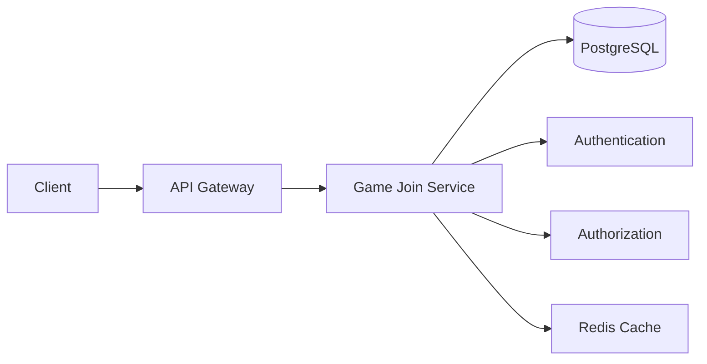

---

## Database Schema

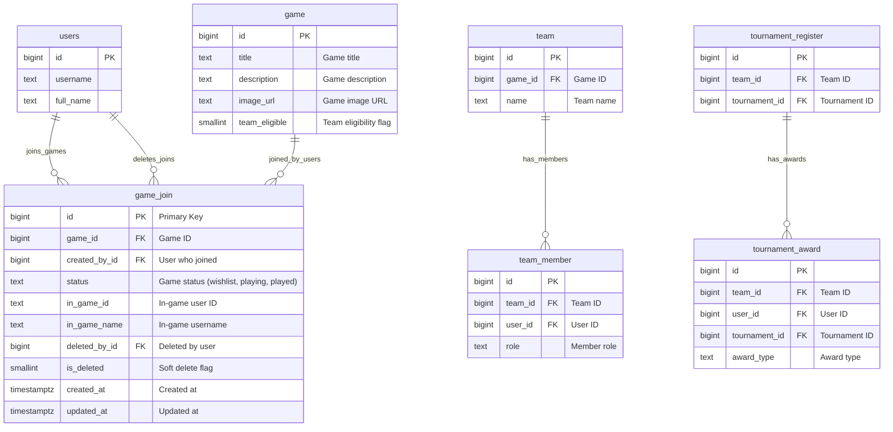

## Table Relationship Graph

```mermaid
graph TD
    A[users Table] -->|joins| B[game_join Table]
    A -->|deletes| B
    A -->|member_of| C[team_member Table]
    A -->|receives| D[tournament_award Table]
    E[game Table] -->|joined_by| B
    F[team Table] -->|has| C
    F -->|registers| G[tournament_register Table]
    G -->|has| D
    
    subgraph "users Table"
        A1[users.id PK]
        A2[users.username]
        A3[users.full_name]
    end
    
    subgraph "game_join Table"
        B1[game_join.id PK]
        B2[game_join.game_id FK]
        B3[game_join.created_by_id FK]
        B4[game_join.status]
        B5[game_join.in_game_id]
        B6[game_join.in_game_name]
        B7[game_join.deleted_by_id FK]
    end
    
    subgraph "game Table"
        E1[game.id PK]
        E2[game.title]
        E3[game.team_eligible]
    end
    
    subgraph "team_member Table"
        C1[team_member.id PK]
        C2[team_member.team_id FK]
        C3[team_member.user_id FK]
        C4[team_member.role]
    end
    
    subgraph "tournament_award Table"
        D1[tournament_award.id PK]
        D2[tournament_award.team_id FK]
        D3[tournament_award.user_id FK]
        D4[tournament_award.tournament_id FK]
    end
    
    A1 -.->|references| B3
    A1 -.->|references| B7
    A1 -.->|references| C3
    A1 -.->|references| D3
    E1 -.->|references| B2
```

### Relationship Details

| Relationship | Type | Description | Foreign Key |
|--------------|------|-------------|-------------|
| users → game_join (joining) | One-to-Many | User can join multiple games | `game_join.created_by_id` |
| users → game_join (deletion) | One-to-Many | User can delete multiple joins | `game_join.deleted_by_id` |
| users → team_member | One-to-Many | User can be member of multiple teams | `team_member.user_id` |
| users → tournament_award | One-to-Many | User can receive multiple awards | `tournament_award.user_id` |
| game → game_join | One-to-Many | Game can be joined by multiple users | `game_join.game_id` |
| team → team_member | One-to-Many | Team can have multiple members | `team_member.team_id` |
| team → tournament_register | One-to-Many | Team can register for multiple tournaments | `tournament_register.team_id` |
| tournament_register → tournament_award | One-to-Many | Registration can have multiple awards | `tournament_award.tournament_id` |

### Index Information

| Table | Index Type | Indexed Fields | Purpose |
|-------|------------|----------------|---------|
| game_join | btree | `created_by_id` | User-based join queries |
| game_join | btree | `game_id` | Game-based join queries |
| game_join | btree | `status` | Status-based filtering |
| game_join | brin | `created_at` | Fast time-based queries |
| game_join | btree | `is_deleted` | Soft delete filtering |
| team_member | btree | `user_id` | User-based team queries |
| team_member | btree | `team_id` | Team-based member queries |
| tournament_award | btree | `user_id` | User-based award queries |
| tournament_award | btree | `team_id` | Team-based award queries |

---

## Base URLs

| Environment   | URL                                 |
|---------------|-------------------------------------|
| Production    | `https://thryl-prod.com   ||    https://thryl-production.zapto.org`      |
| Staging       | `https://thryl-staging.zapto.org` |
| Development   | `http://localhost:3000  || http://localhost:3001`      |

---

## Authentication

All Game Join Service APIs require JWT authentication. Include the token in the Authorization header:

```http
Authorization: Bearer <your-jwt-token>
```

---

## Authorization

| Role         | Permissions                                      |
|--------------|--------------------------------------------------|
| **Player**   | Join games, manage status, view profiles, search games |

---

## API Reference

### Complete API List

| # | Endpoint                    | Method | Purpose                                 | Auth Required | Role Required         |
|---|-----------------------------|--------|-----------------------------------------|---------------|----------------------|
| 1 | `/create`                   | POST   | Join multiple games                     | Yes           | player               |
| 2 | `/read`                     | GET    | Get joined games                        | Yes           | player               |
| 3 | `/update`                   | PATCH  | Update game join status                 | Yes           | player               |
| 4 | `/delete`                   | DELETE | Delete game join                        | Yes           | player               |
| 5 | `/not-present`              | GET    | Search games not joined                 | Yes           | player               |
| 6 | `/unselected-game-list`     | GET    | Get all unselected games                | Yes           | player               |
| 7 | `/my-game-profile`          | GET    | Get user's game profile                 | Yes           | player               |
| 8 | `/game-profile-detail`      | GET    | Get game profile detail by game ID      | Yes           | player               |

---

## Validation Schemas

### Join Multiple Games Schema
```javascript
{
  game_ids: Joi.array().items(Joi.number().integer().required()).required(),
  created_by_id: Joi.number().integer().optional(),
  status: Joi.string().valid("wishlist", "playing", "played").required()
}
```

### Get All Joined Games Schema
```javascript
{
  game_id: Joi.number().integer().optional().allow(null).description("Filter by game ID")
}
```

### Delete Game Join Schema
```javascript
{
  game_id: Joi.number().integer().optional(),
  deleted_by_id: Joi.number().integer().optional()
}
```

### Update Game Join Status Schema
```javascript
{
  game_id: Joi.number().integer().required(),
  deleted_by_id: Joi.number().integer().optional(),
  newStatus: Joi.string().valid("wishlist", "playing", "played").required()
}
```

---

## API Endpoints

### 1. Join Multiple Games

Joins multiple games with specified status for the authenticated user.

**Endpoint:** `POST /gameJoin/create`

**Authorization:** Player only

**Request Body:**
```json
{
  "game_ids": [1, 2, 3],
  "status": "playing"
}
```

**Success Response (201):**
```json
{
  "status": 1,
  "data": [
    {
      "id": 1,
      "game_id": 1,
      "created_by_id": 123,
      "status": "playing",
      "created_at": "2024-01-15T10:30:00Z",
      "updated_at": "2024-01-15T10:30:00Z"
    },
    {
      "id": 2,
      "game_id": 2,
      "created_by_id": 123,
      "status": "playing",
      "created_at": "2024-01-15T10:30:00Z",
      "updated_at": "2024-01-15T10:30:00Z"
    }
  ]
}
```

**Error Response (400):**
```json
{
  "status": 0,
  "message": "Failed to insert record into the database."
}
```

**DFD:**
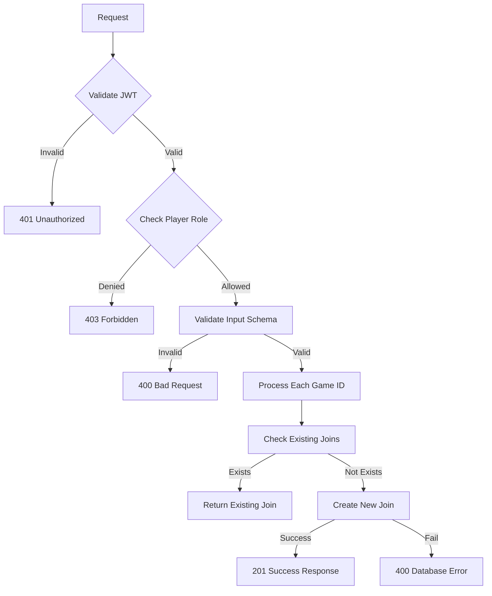

#### Business Logic

1. **Input Validation**: Validates required fields and data types
2. **Concurrent Processing**: Processes multiple game IDs concurrently
3. **Duplicate Prevention**: Checks for existing joins before creating new ones
4. **Status Management**: Sets default status to "playing" if not provided
5. **Creator Tracking**: Records who joined the games

#### Database Operations

```sql
-- Check existing join
SELECT * FROM game_join WHERE game_id = $1 AND created_by_id = $2;

-- Insert new join
INSERT INTO game_join (game_id, created_by_id, status) VALUES ($1, $2, $3) RETURNING *;
```

---

### 2. Get Joined Games

Retrieves all games joined by the authenticated user with optional filtering.

**Endpoint:** `GET /gameJoin/read`

**Authorization:** Player only

**Query Parameters:**
- `game_id` (optional): Filter by specific game ID

**Example Request:**
```http
GET /gameJoin/read?game_id=1
```

**Success Response (200):**
```json
{
  "status": 1,
  "data": [
    {
      "id": 1,
      "game_id": 1,
      "created_by_id": 123,
      "created_at": "2024-01-15T10:30:00Z",
      "updated_at": "2024-01-15T10:30:00Z",
      "is_deleted": 0,
      "deleted_by_id": null,
      "status": "playing",
      "title": "PUBG Mobile",
      "description": "Battle Royale mobile game",
      "image_url": "https://example.com/pubg.jpg"
    }
  ]
}
```

**Error Response (400):**
```json
{
  "status": 0,
  "message": "Failed to retrieve joined games."
}
```

**DFD:**
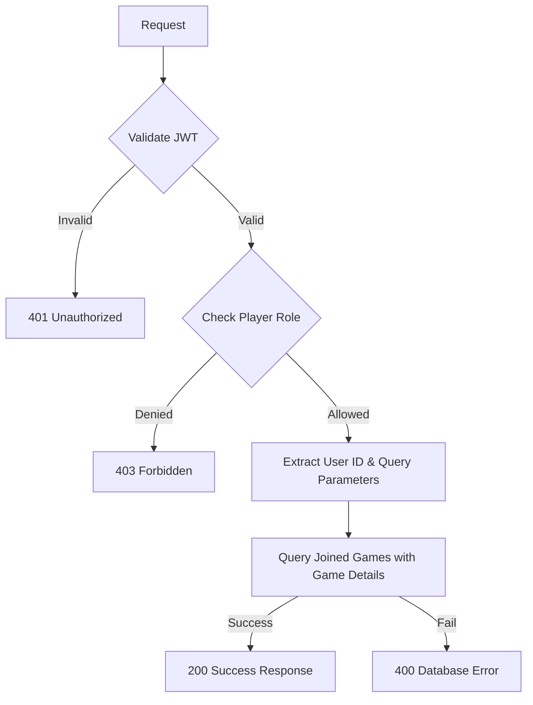

#### Business Logic

1. **User-Specific**: Only returns games joined by the authenticated user
2. **Game Details**: Includes game title, description, and image
3. **Optional Filtering**: Supports filtering by specific game ID
4. **BGMI Exclusion**: Excludes 'BGMI' game from results

#### Database Operations

```sql
SELECT 
  game_join.*, 
  game.title AS game_title, 
  game.description AS game_description, 
  game.image_url AS game_image_url 
FROM game_join 
LEFT JOIN game ON game_join.game_id = game.id 
WHERE game.title != 'BGMI' AND game_join.created_by_id = $1 
  ${game_id ? "AND game_join.game_id = $2" : ""};
```

---

### 3. Update Game Join Status

Updates the status of a joined game.

**Endpoint:** `PATCH /gameJoin/update`

**Authorization:** Player only

**Request Body:**
```json
{
  "game_id": 1,
  "newStatus": "played"
}
```

**Success Response (200):**
```json
{
  "status": 1,
  "data": {
    "id": 1,
    "game_id": 1,
    "created_by_id": 123,
    "status": "played",
    "created_at": "2024-01-15T10:30:00Z",
    "updated_at": "2024-01-15T12:30:00Z",
    "general_id": 1
  }
}
```

**Error Response (404):**
```json
{
  "status": 0,
  "message": "No joined game found to update."
}
```

**DFD:**
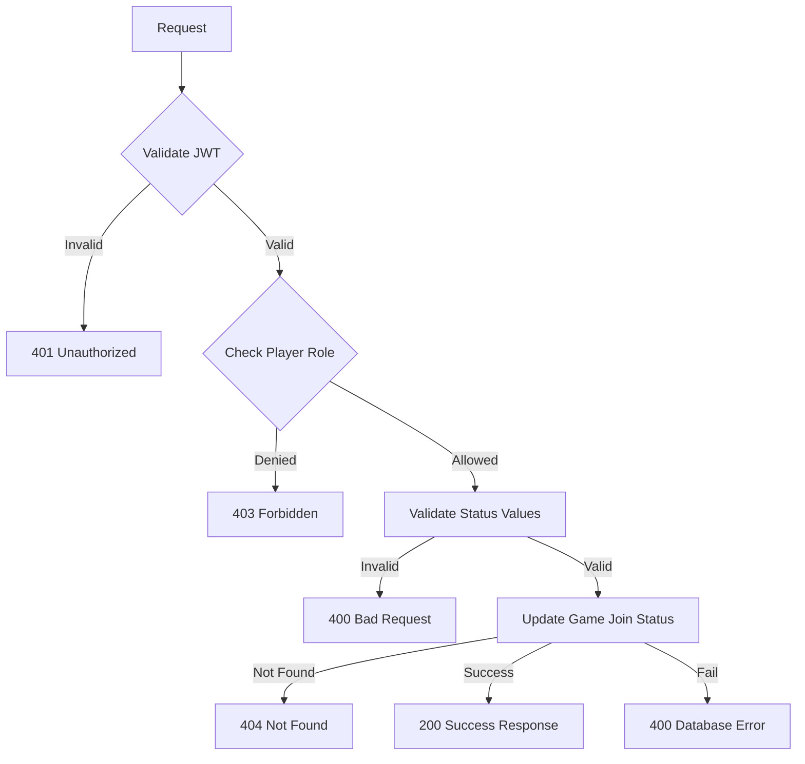

#### Business Logic

1. **Status Validation**: Validates status against allowed values (wishlist, playing, played)
2. **Player Only**: Restricted to player users
3. **Existence Check**: Verifies game join exists before update
4. **Status Update**: Updates only the status field

#### Database Operations

```sql
UPDATE game_join 
SET status = $3, updated_at = NOW() 
WHERE game_id = $1 AND created_by_id = $2 
RETURNING *;
```

---

### 4. Delete Game Join

Deletes a game join (hard delete).

**Endpoint:** `DELETE /gameJoin/delete`

**Authorization:** Player only

**Request Body:**
```json
{
  "game_id": 1
}
```

**Success Response (204):**
```json
{
  "status": 1,
  "data": {
    "id": 1,
    "game_id": 1,
    "created_by_id": 123
  }
}
```

**Error Response (404):**
```json
{
  "status": 0,
  "message": "No joined game found to delete."
}
```

**DFD:**
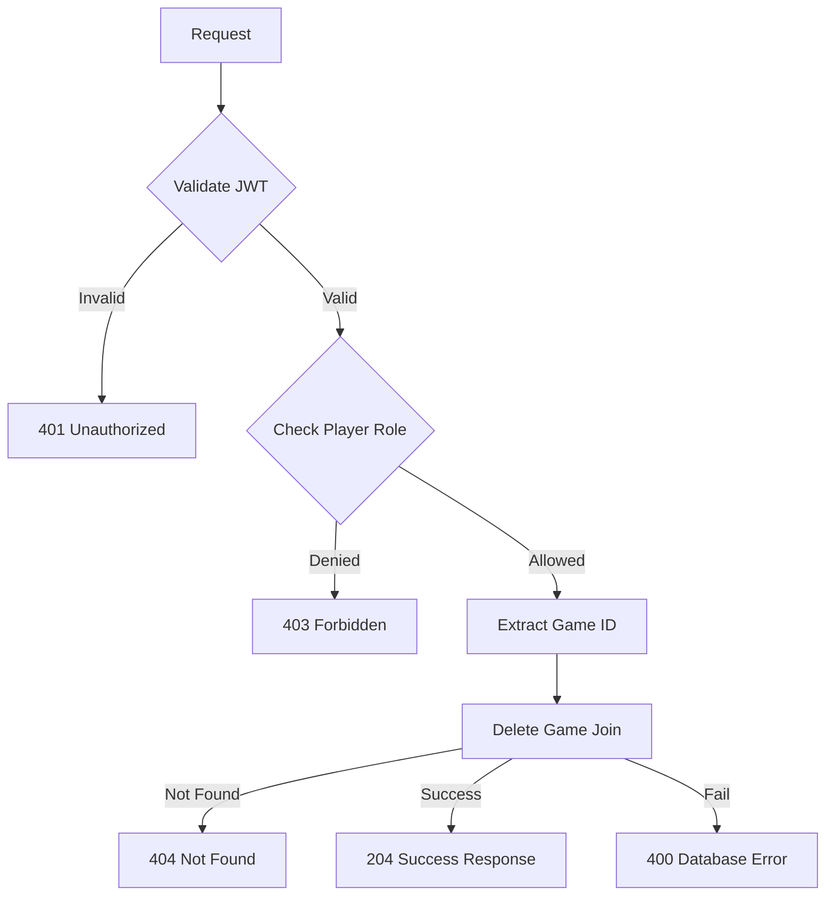

#### Business Logic

1. **Hard Delete**: Permanently removes the game join record
2. **Player Only**: Restricted to player users
3. **Existence Check**: Verifies game join exists before deletion

#### Database Operations

```sql
DELETE FROM game_join 
WHERE game_id = $1 AND created_by_id = $2 
RETURNING *;
```

---

### 5. Search Not Joined Games

Searches for games that the user has not joined.

**Endpoint:** `GET /gameJoin/not-present`

**Authorization:** Player only

**Query Parameters:**
- `keyword` (optional): Search keyword
- `page` (optional): Page number (default: 1)
- `limit` (optional): Items per page (default: 10)

**Example Request:**
```http
GET /gameJoin/not-present?keyword=battle&page=1&limit=10
```

**Success Response (200):**
```json
{
  "status": 1,
  "data": [
    {
      "id": 4,
      "title": "Call of Duty Mobile",
      "description": "Battle Royale FPS game",
      "image_url": "https://example.com/cod.jpg",
      "team_eligible": 1
    }
  ],
  "pageNumber": 1,
  "limit": 10
}
```

**Error Response (400):**
```json
{
  "status": 0,
  "message": "Failed to search games."
}
```

**DFD:**
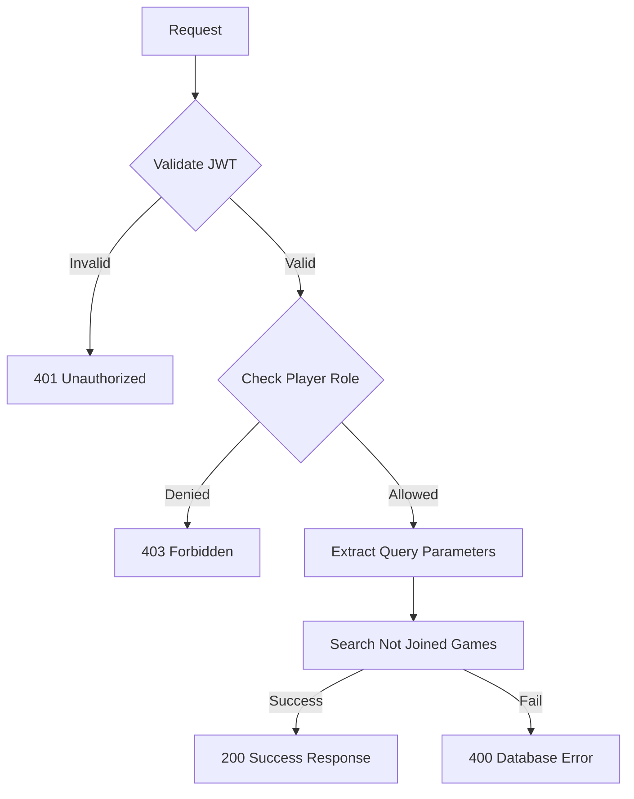

#### Business Logic

1. **Exclusion Logic**: Excludes games already joined by the user
2. **Search Functionality**: Case-insensitive search by title or description
3. **Pagination**: Efficient offset-based pagination
4. **BGMI Exclusion**: Excludes 'BGMI' game from results

#### Database Operations

```sql
WITH x AS (
  SELECT * FROM game 
  WHERE is_deleted IS DISTINCT FROM 1 
    AND title != 'BGMI' 
    AND id NOT IN (SELECT game_id FROM game_join WHERE created_by_id = $1)
)
SELECT * FROM x 
WHERE title ILIKE $2 OR description ILIKE $2 
ORDER BY id DESC 
LIMIT $3 OFFSET $4;
```

---

### 6. Get Unselected Games List

Retrieves all games that the user has not joined with pagination.

**Endpoint:** `GET /gameJoin/unselected-game-list`

**Authorization:** Player only

**Query Parameters:**
- `page` (optional): Page number (default: 1)
- `limit` (optional): Items per page (default: 10)

**Example Request:**
```http
GET /gameJoin/unselected-game-list?page=1&limit=10
```

**Success Response (200):**
```json
{
  "status": 1,
  "data": [
    {
      "id": 4,
      "title": "Call of Duty Mobile",
      "description": "Battle Royale FPS game",
      "image_url": "https://example.com/cod.jpg",
      "team_eligible": 1,
      "totalGames": 15
    }
  ],
  "pageNumber": 1,
  "limit": 10
}
```

**Error Response (400):**
```json
{
  "status": 0,
  "message": "Failed to retrieve unselected games."
}
```

**DFD:**
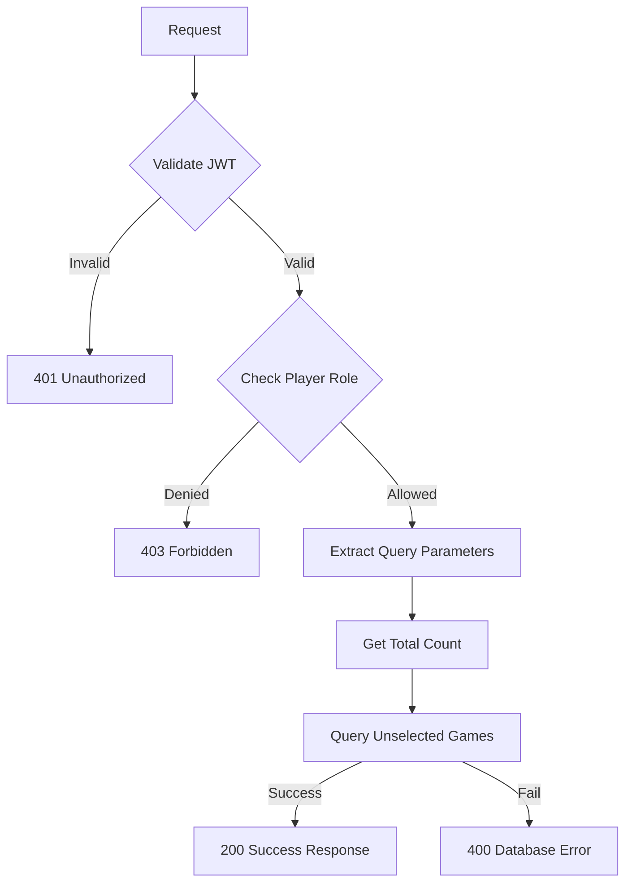

#### Business Logic

1. **Total Count**: Includes total count of unselected games
2. **Exclusion Logic**: Excludes games already joined by the user
3. **Pagination**: Efficient offset-based pagination
4. **BGMI Exclusion**: Excludes 'BGMI' game from results

#### Database Operations

```sql
-- Get total count
SELECT count(*) FROM game 
WHERE is_deleted IS DISTINCT FROM 1 
  AND title != 'BGMI' 
  AND id NOT IN (SELECT game_id FROM game_join WHERE created_by_id = $1);

-- Get unselected games
SELECT * FROM game 
WHERE is_deleted IS DISTINCT FROM 1 
  AND title != 'BGMI' 
  AND id NOT IN (SELECT game_id FROM game_join WHERE created_by_id = $1) 
OFFSET $2 LIMIT $3;
```

---

### 7. Get Game Profile

Retrieves the user's comprehensive game profile with team and tournament information.

**Endpoint:** `GET /gameJoin/my-game-profile`

**Authorization:** Player only

**Query Parameters:**
- `user_id` (required): User ID to get profile for
- `page` (optional): Page number (default: 1)
- `limit` (optional): Items per page (default: 10)

**Example Request:**
```http
GET /gameJoin/my-game-profile?user_id=123&page=1&limit=10
```

**Success Response (200):**
```json
{
  "status": 1,
  "data": [
    {
      "id": 1,
      "title": "PUBG Mobile",
      "description": "Battle Royale mobile game",
      "image_url": "https://example.com/pubg.jpg",
      "team_eligible": 1,
      "team_count": 2,
      "in_game_id": "PUBG123",
      "in_game_name": "PlayerOne",
      "tournament_count": 5,
      "awards": [
        {
          "id": 1,
          "award_type": "Winner",
          "tournament_id": 1
        }
      ]
    }
  ]
}
```

**Error Response (400):**
```json
{
  "status": 0,
  "message": "Failed to retrieve game profile."
}
```

**DFD:**
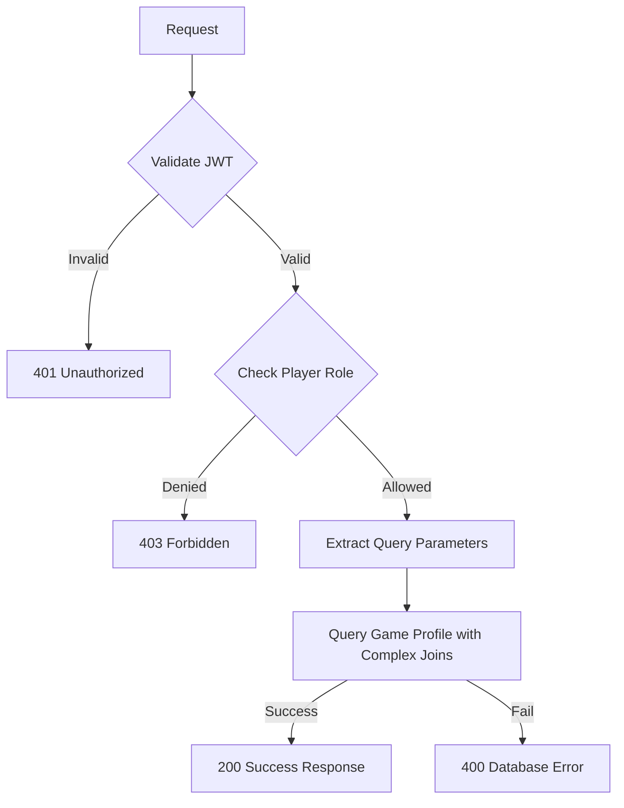

#### Business Logic

1. **Complex Query**: Uses CTEs for efficient data aggregation
2. **Team Information**: Includes team count and roles
3. **Tournament Data**: Includes tournament count and awards
4. **Game Details**: Includes in-game ID and username
5. **Team Eligibility**: Only includes team-eligible games

#### Database Operations

```sql
WITH 
    g AS (SELECT * FROM game WHERE team_eligible = 1),
    t AS (SELECT * FROM team WHERE game_id IN (SELECT id FROM g)),
    tm AS (SELECT COUNT(*) AS team_count FROM team_member WHERE team_id IN (SELECT id FROM t) AND user_id = $1 AND role IN ('Team Lead', 'member', 'substitute')),
    tmd AS (SELECT role, team_id FROM team_member WHERE team_id IN (SELECT id FROM t) AND user_id = $1 AND role IN ('Team Lead', 'member', 'substitute') ORDER BY team_id DESC LIMIT 1),
    tr_ids AS (SELECT tournament_id FROM tournament_register WHERE team_id IN (SELECT id FROM t)),
    tr AS (SELECT COUNT(*) AS tournament_count FROM tr_ids),
    tra_raw AS (SELECT * FROM tournament_award WHERE (team_id IN (SELECT id FROM t) AND tournament_id IN (SELECT tournament_id FROM tr_ids)) OR (user_id = $1 AND tournament_id IN (SELECT tournament_id FROM tr_ids)) ORDER by tournament_id OFFSET $2 LIMIT $3),
    tra AS (SELECT COALESCE(json_agg(tra_raw), '[]'::json) AS awards FROM tra_raw),
    gj AS (SELECT in_game_name, in_game_id, created_by_id, id, game_id FROM game_join WHERE created_by_id = $1 AND game_id IN (SELECT id FROM g))
SELECT g.*, tm.team_count, gj.in_game_id, gj.in_game_name, tr.tournament_count, tra.awards
FROM g
LEFT JOIN gj ON gj.game_id = g.id, tm, tmd, tr, tra;
```

---

### 8. Get Game Profile Detail by Game ID

Retrieves detailed profile information for a specific game.

**Endpoint:** `GET /gameJoin/game-profile-detail`

**Authorization:** Player only

**Query Parameters:**
- `game_id` (required): Game ID to get details for

**Example Request:**
```http
GET /gameJoin/game-profile-detail?game_id=1
```

**Success Response (200):**
```json
{
  "status": 1,
  "data": {
    "id": 1,
    "title": "PUBG Mobile",
    "description": "Battle Royale mobile game",
    "image_url": "https://example.com/pubg.jpg",
    "team_eligible": 1,
    "types": ["battle_royale", "mobile", "fps"]
  }
}
```

**Error Response (400):**
```json
{
  "status": 0,
  "message": "Failed to retrieve game profile detail."
}
```

**DFD:**
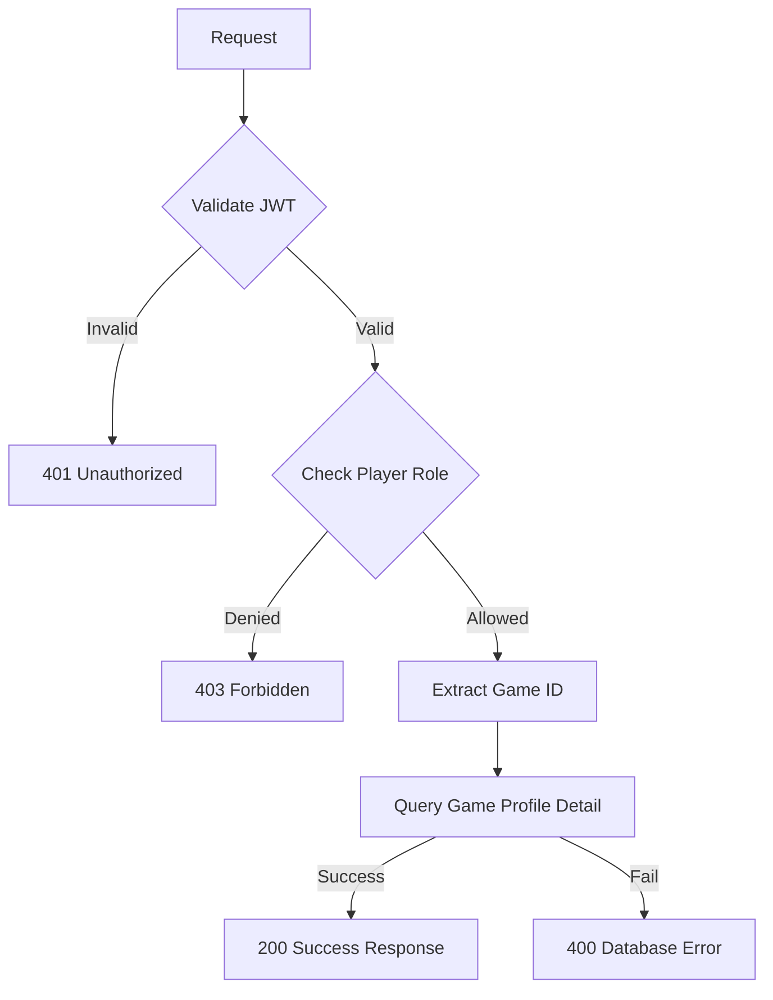

#### Business Logic

1. **Game Details**: Returns comprehensive game information
2. **Mapping Types**: Includes game mapping types as array
3. **Existence Check**: Returns null if game not found

#### Database Operations

```sql
SELECT g.*, ARRAY_AGG(gtm.type) AS types 
FROM game g 
LEFT JOIN game_mapping_type gtm ON g.id = gtm.game_id 
WHERE g.id = $1 
GROUP BY g.id;
```

---

## Rate Limiting

| Endpoint                | Rate Limit | Window      |
|-------------------------|------------|-------------|
| All Game Join APIs      | 100        | 15 minutes  |

---

## Security Considerations

### Authentication
- JWT token validation on all endpoints
- Token expiration handling
- Secure token transmission

### Authorization
- Role-based access control for player users
- User-specific data access
- Game join ownership validation

### Input Validation
- Request body validation using Joi schemas
- Query parameter validation
- SQL injection prevention through parameterized queries
- Input sanitization

### Data Protection
- User-specific game join access
- Unique constraints on user-game combinations
- Input sanitization

---

## Business Rules

### Game Joining
1. Users can join multiple games with different statuses
2. Each user can only join a game once (unique constraint)
3. Game joins are user-specific and cannot be shared
4. BGMI game is excluded from all operations

### Status Management
1. Game status can be: wishlist, playing, played
2. Status updates are restricted to the game owner
3. Default status is "playing" for new joins

### Game Discovery
1. Users can search for games they haven't joined
2. Search is case-insensitive and supports partial matching
3. Pagination is available for large result sets

### Profile Management
1. Game profiles include team and tournament information
2. Only team-eligible games are included in profiles
3. Profile data is aggregated from multiple related tables

### Data Integrity
1. Foreign key relationships are maintained
2. Unique constraints prevent duplicate joins
3. Audit trails track game join creation and modification

---

## Monitoring & Logging

### Metrics to Monitor
- API response times
- Error rates by endpoint
- Database query performance
- Game join creation and update rates
- Search query performance

### Logging
- Request/response logging
- Error logging with stack traces
- Database operation logging
- Game join lifecycle event logging

### Alerts
- High error rates (>5%)
- Slow response times (>2s)
- Database connection issues
- Failed game join operations

---

## Integration Examples

### Frontend Integration

```javascript
// Join multiple games
const joinMultipleGames = async (gameIds, status) => {
  const response = await fetch('/api/v1/gameJoin/create', {
    method: 'POST',
    headers: {
      'Content-Type': 'application/json',
      'Authorization': `Bearer ${token}`
    },
    body: JSON.stringify({
      game_ids: gameIds,
      status: status
    })
  });
  return response.json();
};

// Get joined games
const getJoinedGames = async (gameId = null) => {
  const params = new URLSearchParams();
  if (gameId) params.append('game_id', gameId.toString());
  
  const response = await fetch(`/api/v1/gameJoin/read?${params}`, {
    headers: {
      'Authorization': `Bearer ${token}`
    }
  });
  return response.json();
};

// Update game join status
const updateGameJoinStatus = async (gameId, newStatus) => {
  const response = await fetch('/api/v1/gameJoin/update', {
    method: 'PATCH',
    headers: {
      'Content-Type': 'application/json',
      'Authorization': `Bearer ${token}`
    },
    body: JSON.stringify({
      game_id: gameId,
      newStatus: newStatus
    })
  });
  return response.json();
};

// Delete game join
const deleteGameJoin = async (gameId) => {
  const response = await fetch('/api/v1/gameJoin/delete', {
    method: 'DELETE',
    headers: {
      'Content-Type': 'application/json',
      'Authorization': `Bearer ${token}`
    },
    body: JSON.stringify({
      game_id: gameId
    })
  });
  return response.json();
};

// Search not joined games
const searchNotJoinedGames = async (keyword, page = 1, limit = 10) => {
  const params = new URLSearchParams({
    keyword: keyword || '',
    page: page.toString(),
    limit: limit.toString()
  });
  const response = await fetch(`/api/v1/gameJoin/not-present?${params}`, {
    headers: {
      'Authorization': `Bearer ${token}`
    }
  });
  return response.json();
};

// Get unselected games
const getUnselectedGames = async (page = 1, limit = 10) => {
  const params = new URLSearchParams({
    page: page.toString(),
    limit: limit.toString()
  });
  const response = await fetch(`/api/v1/gameJoin/unselected-game-list?${params}`, {
    headers: {
      'Authorization': `Bearer ${token}`
    }
  });
  return response.json();
};

// Get game profile
const getGameProfile = async (userId, page = 1, limit = 10) => {
  const params = new URLSearchParams({
    user_id: userId.toString(),
    page: page.toString(),
    limit: limit.toString()
  });
  const response = await fetch(`/api/v1/gameJoin/my-game-profile?${params}`, {
    headers: {
      'Authorization': `Bearer ${token}`
    }
  });
  return response.json();
};

// Get game profile detail
const getGameProfileDetail = async (gameId) => {
  const params = new URLSearchParams({
    game_id: gameId.toString()
  });
  const response = await fetch(`/api/v1/gameJoin/game-profile-detail?${params}`, {
    headers: {
      'Authorization': `Bearer ${token}`
    }
  });
  return response.json();
};
```

### Error Handling

```javascript
const handleGameJoinOperation = async (operation) => {
  try {
    const result = await operation();
    if (result.status === 1) {
      console.log('Operation successful:', result.data);
      return result.data;
    } else {
      console.error('Operation failed:', result.message);
      throw new Error(result.message);
    }
  } catch (error) {
    console.error('Game join operation failed:', error.message);
    // Handle different error types
    if (error.message.includes('No joined game found')) {
      // Handle not found error
    } else if (error.message.includes('Invalid status')) {
      // Handle validation error
    } else if (error.message.includes('Unauthorized')) {
      // Handle authentication error
    } else if (error.message.includes('Forbidden')) {
      // Handle authorization error
    } else {
      // Handle general error
    }
  }
};
```

---

## Use Cases

### 1. Game Management
- Players join games they want to play
- Track game status (wishlist, playing, played)
- Remove games from their list

### 2. Game Discovery
- Search for new games to join
- Browse unselected games
- Find games based on keywords

### 3. Profile Management
- View comprehensive game profiles
- Track team participation
- Monitor tournament achievements

---

## Performance Considerations

### Database Optimization
- Indexes on `created_by_id`, `game_id`, and `status` for fast lookups
- Efficient pagination with offset-based queries
- Optimized JOIN operations for complex profile queries
- CTEs for complex aggregations

### Query Optimization
- Use parameterized queries for security
- Limit result sets with pagination
- Efficient filtering by user and game
- Optimized search queries with LIKE patterns

---

## Testing Scenarios

### Unit Tests
- Game join creation and validation
- Status update functionality
- Game join deletion
- Search functionality
- Profile retrieval

### Integration Tests
- End-to-end game join lifecycle
- Authentication and authorization
- Database consistency
- API response validation

### Performance Tests
- Load testing with multiple concurrent game joins
- Database query performance
- Search performance with large datasets

### Security Tests
- SQL injection prevention
- JWT token validation
- Role-based access control
- Input sanitization
- Authorization validation

--- 