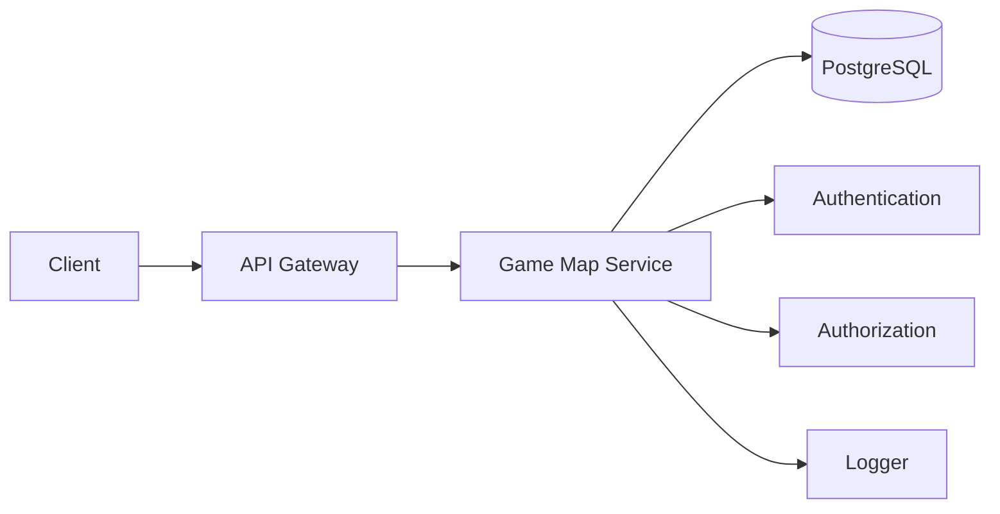
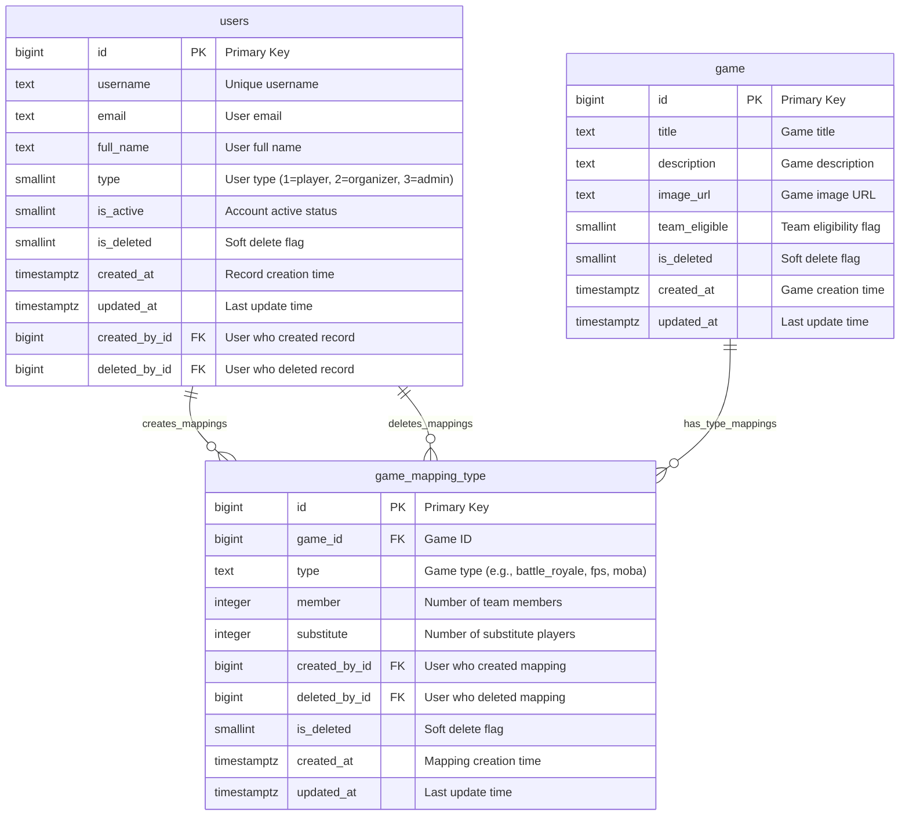
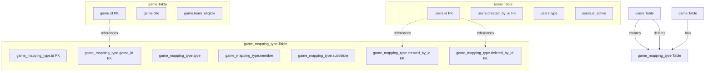
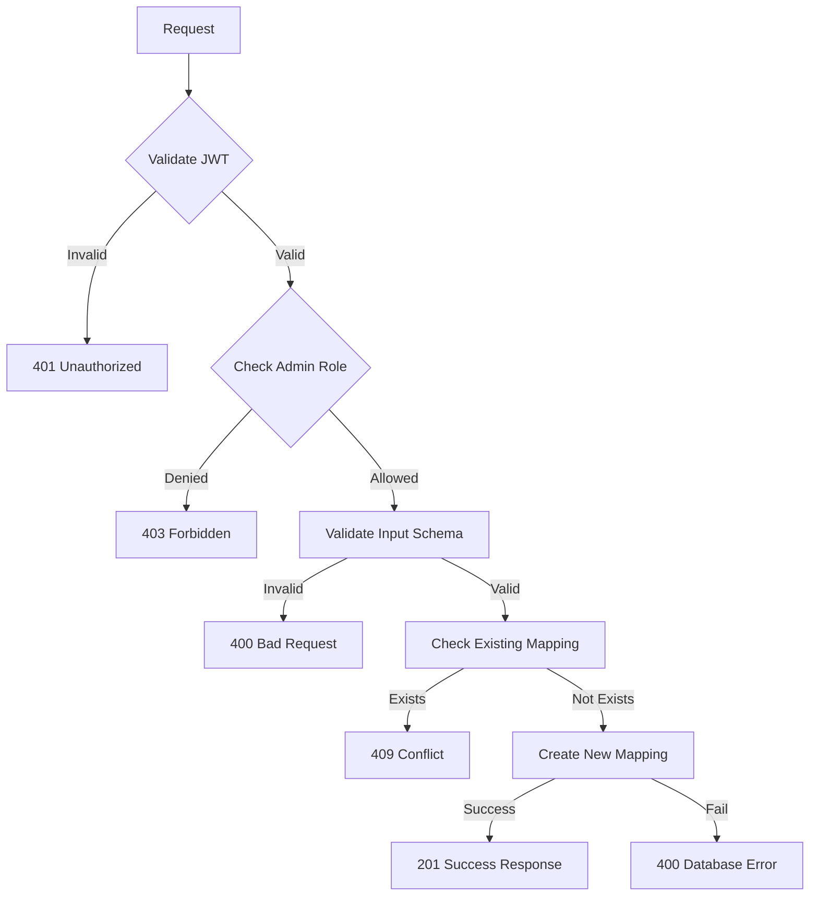
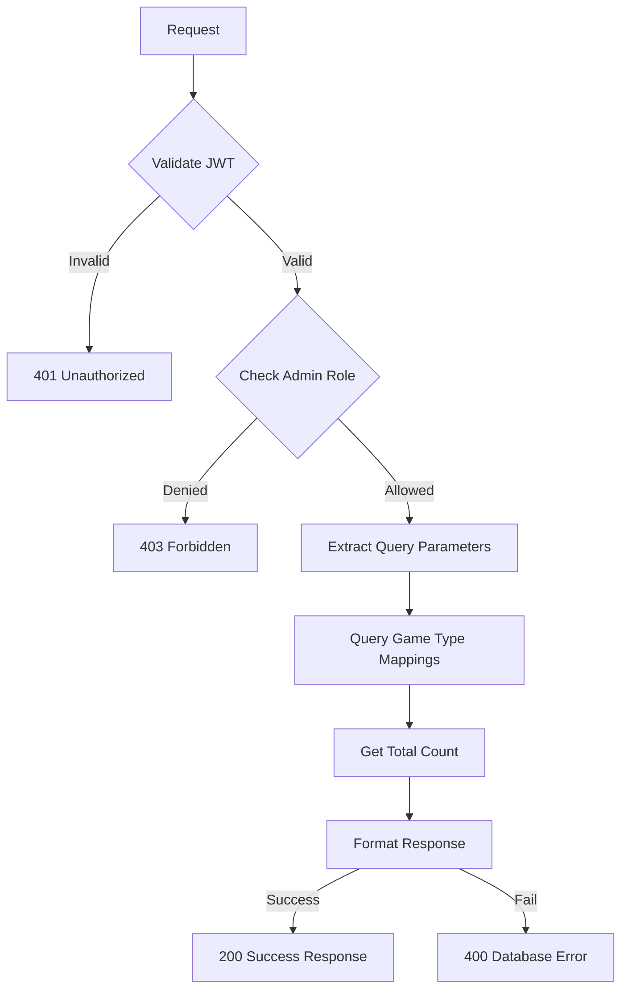
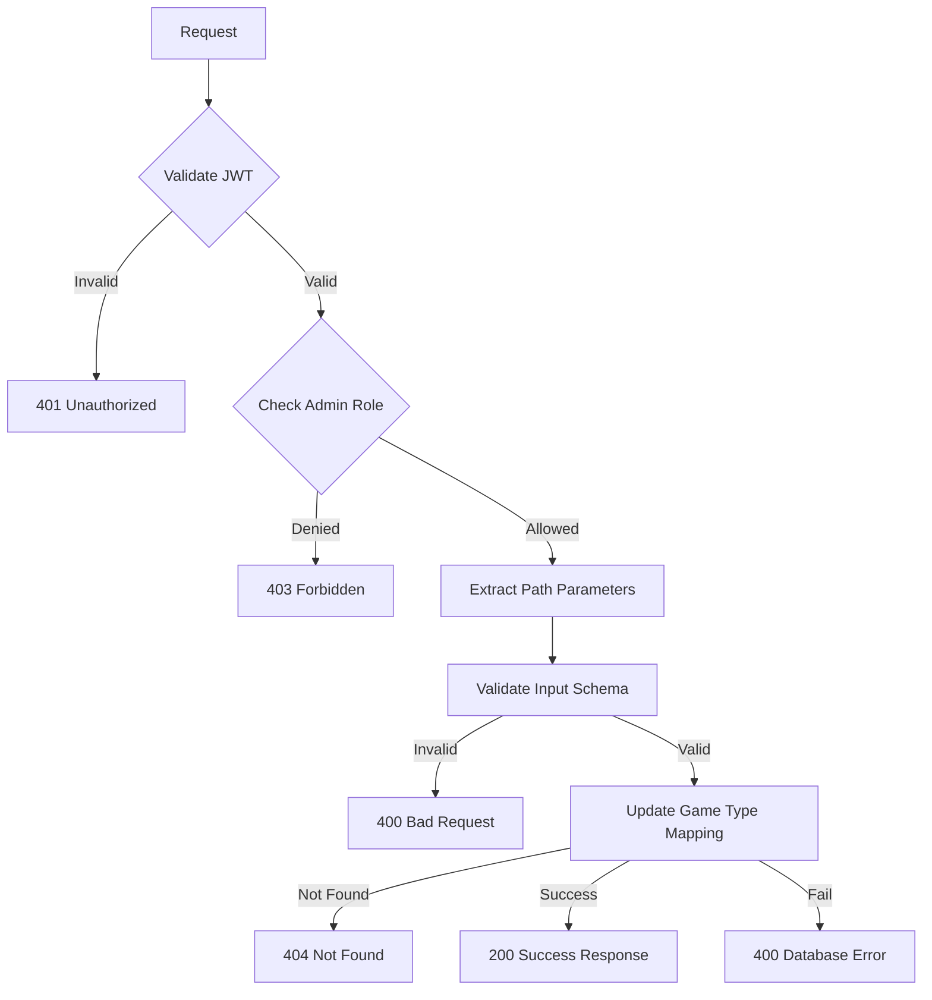
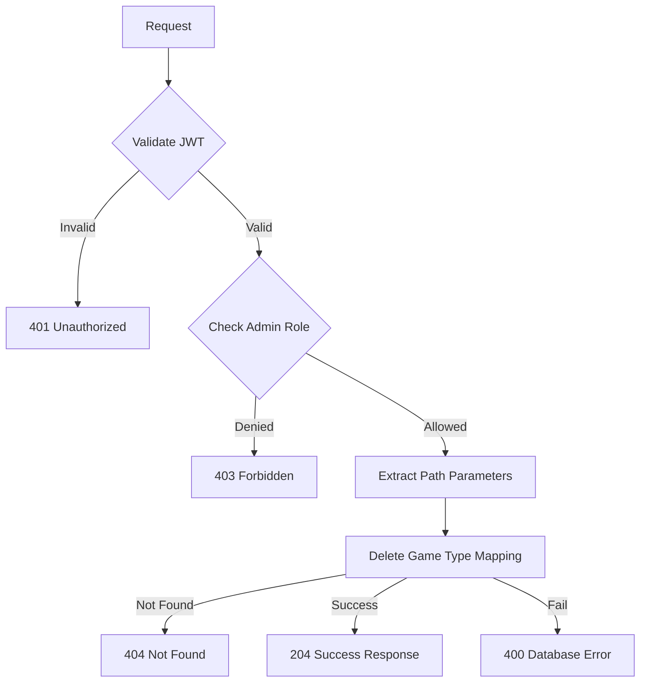

## Overview

The **Game Map Service** provides comprehensive game type mapping functionality for the Thryl platform, enabling administrators to manage game type configurations, team member allocations, and substitute player settings. The service supports creating, reading, updating, and deleting game type mappings with advanced features like unique constraint validation, pagination, and role-based access control.

### Tech Stack
- **Backend**: Node.js, Express.js
- **Database**: PostgreSQL
- **Authentication**: JWT
- **Validation**: Joi
- **Authorization**: Role-based access control
- **Logging**: Custom logger

---

## System Architecture



---

## Database Schema



## Table Relationship Graph



### Relationship Details

| Relationship | Type | Description | Foreign Key |
|--------------|------|-------------|-------------|
| users → game_mapping_type (creation) | One-to-Many | User can create multiple game type mappings | `game_mapping_type.created_by_id` |
| users → game_mapping_type (deletion) | One-to-Many | User can delete multiple mappings | `game_mapping_type.deleted_by_id` |
| game → game_mapping_type | One-to-Many | Game can have multiple type mappings | `game_mapping_type.game_id` |

### Index Information

| Table | Index Type | Indexed Fields | Purpose |
|-------|------------|----------------|---------|
| game_mapping_type | btree | `game_id` | Game-based mapping queries |
| game_mapping_type | btree | `type` | Type-based filtering |
| game_mapping_type | btree | `member` | Member count queries |
| game_mapping_type | btree | `substitute` | Substitute count queries |
| game_mapping_type | btree | `created_by_id` | Creator-based queries |
| game_mapping_type | brin | `created_at` | Fast time-based queries |
| game_mapping_type | brin | `updated_at` | Fast update time queries |

### Unique Constraints

| Constraint | Fields | Description |
|------------|--------|-------------|
| `constraint_unique_game_mapping_type_gt` | `game_id, type` | Prevents duplicate game-type combinations |

---

## Base URLs

| Environment   | URL                                 |
|---------------|-------------------------------------|
| Production    | `https://thryl-prod.com   ||    https://thryl-production.zapto.org`      |
| Staging       | `https://thryl-staging.zapto.org` |
| Development   | `http://localhost:3000  || http://localhost:3001`      |

---

## Authentication

All Game Map Service APIs require JWT authentication. Include the token in the Authorization header:

```http
Authorization: Bearer <your-jwt-token>
```

---

## Authorization

| Role         | Permissions                                      |
|--------------|--------------------------------------------------|
| **Admin**    | Create, read, update, delete game type mappings |

---

## API Reference

### Complete API List

| # | Endpoint                    | Method | Purpose                                 | Auth Required | Role Required         |
|---|-----------------------------|--------|-----------------------------------------|---------------|----------------------|
| 1 | `/create`                   | POST   | Create game type mapping                | Yes           | admin                |
| 2 | `/read`                     | GET    | Get game type mappings                  | Yes           | admin                |
| 3 | `/update/:id`               | PUT    | Update game type mapping                | Yes           | admin                |
| 4 | `/delete/:id`               | DELETE | Delete game type mapping                | Yes           | admin                |

---

## Validation Schemas

### Create Game Type Mapping Schema
```javascript
{
  game_id: Joi.number().integer().required(),
  type: Joi.string().required(),
  member: Joi.number().integer().required(),
  substitute: Joi.number().integer().required()
}
```

### Update Game Type Mapping Schema
```javascript
{
  game_id: Joi.number().integer().optional(),
  type: Joi.string().optional(),
  member: Joi.number().integer().optional(),
  substitute: Joi.number().integer().optional()
}
```

---

## API Endpoints

### 1. Create Game Type Mapping

Creates a new game type mapping with specified member and substitute configurations.

**Endpoint:** `POST /gameMap/create`

**Authorization:** Admin only

**Request Body:**
```json
{
  "game_id": 1,
  "type": "battle_royale",
  "member": 4,
  "substitute": 2
}
```

**Success Response (201):**
```json
{
  "status": 1,
  "data": {
    "id": 1,
    "game_id": 1,
    "type": "battle_royale",
    "member": 4,
    "substitute": 2,
    "created_by_id": 123,
    "created_at": "2024-01-15T10:30:00Z",
    "updated_at": "2024-01-15T10:30:00Z"
  }
}
```

**Error Response (409):**
```json
{
  "status": 0,
  "message": "Game type mapping with the same game_id and type already exists"
}
```

**Error Response (400):**
```json
{
  "status": 0,
  "message": "Failed to create game type mapping"
}
```

**DFD:**


#### Business Logic

1. **Input Validation**: Validates required fields and data types
2. **Duplicate Prevention**: Checks for existing game-type combinations
3. **Unique Constraint**: Enforces unique game_id and type combinations
4. **Creator Tracking**: Records who created the mapping
5. **Admin Only**: Restricted to admin users

#### Database Operations

```sql
-- Check existing mapping
SELECT * FROM game_mapping_type WHERE game_id = $1 AND type = $2;

-- Insert new mapping
INSERT INTO game_mapping_type (game_id, type, member, substitute, created_by_id) 
VALUES ($1, $2, $3, $4, $5) RETURNING *;
```

---

### 2. Get Game Type Mappings

Retrieves game type mappings with optional filtering and pagination.

**Endpoint:** `GET /gameMap/read`

**Authorization:** Admin only

**Query Parameters:**
- `id` (optional): Filter by specific mapping ID
- `page` (optional): Page number (default: 1)
- `limit` (optional): Items per page (default: 10)

**Example Request:**
```http
GET /gameMap/read?id=1&page=1&limit=10
```

**Success Response (200):**
```json
{
  "status": 1,
  "data": [
    {
      "id": 1,
      "is_deleted": 0,
      "deleted_by_id": null,
      "created_by_id": 123,
      "type": "battle_royale",
      "created_at": "2024-01-15T10:30:00Z",
      "updated_at": "2024-01-15T10:30:00Z",
      "game_id": 1,
      "member": 4,
      "substitute": 2
    }
  ],
  "totalTeams": 1,
  "totalPages": 1,
  "currentPage": 1,
  "limit": 10
}
```

**Error Response (400):**
```json
{
  "status": 0,
  "message": "Failed to retrieve game type mappings"
}
```

**DFD:**


#### Business Logic

1. **Admin Only**: Restricted to admin users
2. **Optional Filtering**: Supports filtering by specific mapping ID
3. **Pagination**: Efficient offset-based pagination
4. **Total Count**: Includes total count for pagination
5. **Data Formatting**: Converts numeric fields to numbers

#### Database Operations

```sql
-- Get mappings with pagination
SELECT * FROM game_mapping_type 
WHERE ($1::int IS NULL OR game_mapping_type.id = $1) 
LIMIT $2 OFFSET $3;

-- Get total count
SELECT COUNT(*) as total FROM game_mapping_type 
WHERE ($1::int IS NULL OR game_mapping_type.id = $1);
```

---

### 3. Update Game Type Mapping

Updates an existing game type mapping with new values.

**Endpoint:** `PUT /gameMap/update/:id`

**Authorization:** Admin only

**Path Parameters:**
- `id`: Game type mapping ID

**Request Body:**
```json
{
  "type": "fps",
  "member": 5,
  "substitute": 1
}
```

**Success Response (200):**
```json
{
  "status": 1,
  "data": {
    "id": 1,
    "game_id": 1,
    "type": "fps",
    "member": 5,
    "substitute": 1,
    "created_by_id": 123,
    "created_at": "2024-01-15T10:30:00Z",
    "updated_at": "2024-01-15T12:30:00Z"
  }
}
```

**Error Response (404):**
```json
{
  "status": 0,
  "message": "Game type mapping not found"
}
```

**Error Response (400):**
```json
{
  "status": 0,
  "message": "Failed to update game type mapping"
}
```

**DFD:**


#### Business Logic

1. **Admin Only**: Restricted to admin users
2. **Existence Check**: Verifies mapping exists before update
3. **Partial Updates**: Supports updating individual fields
4. **COALESCE Logic**: Uses existing values if new values not provided
5. **Timestamp Update**: Automatically updates the updated_at timestamp

#### Database Operations

```sql
UPDATE game_mapping_type 
SET type = COALESCE($1, type), 
    member = COALESCE($2, member), 
    substitute = COALESCE($3, substitute), 
    updated_at = now() 
WHERE id = $4 
RETURNING *;
```

---

### 4. Delete Game Type Mapping

Deletes a game type mapping (hard delete).

**Endpoint:** `DELETE /gameMap/delete/:id`

**Authorization:** Admin only

**Path Parameters:**
- `id`: Game type mapping ID

**Success Response (204):**
```json
{
  "status": 1,
  "message": "Game type mapping deleted successfully"
}
```

**Error Response (404):**
```json
{
  "status": 0,
  "message": "Game type mapping not found"
}
```

**Error Response (400):**
```json
{
  "status": 0,
  "message": "Failed to delete game type mapping"
}
```

**DFD:**


#### Business Logic

1. **Admin Only**: Restricted to admin users
2. **Hard Delete**: Permanently removes the mapping record
3. **Existence Check**: Verifies mapping exists before deletion
4. **Cascade Considerations**: May affect related game configurations

#### Database Operations

```sql
DELETE FROM game_mapping_type 
WHERE id = $1 
RETURNING *;
```

---

## Rate Limiting

| Endpoint                | Rate Limit | Window      |
|-------------------------|------------|-------------|
| All Game Map APIs       | 100        | 15 minutes  |

---

## Security Considerations

### Authentication
- JWT token validation on all endpoints
- Token expiration handling
- Secure token transmission

### Authorization
- Role-based access control for admin users only
- Admin-specific data access
- Mapping ownership validation

### Input Validation
- Request body validation using Joi schemas
- Path parameter validation
- SQL injection prevention through parameterized queries
- Input sanitization

### Data Protection
- Admin-only access to game type mappings
- Unique constraints on game-type combinations
- Input sanitization

---

## Business Rules

### Game Type Mapping
1. Each game can have multiple type mappings
2. Game-type combinations must be unique
3. Member and substitute counts must be positive integers
4. Only admins can manage game type mappings

### Data Integrity
1. Foreign key relationships are maintained
2. Unique constraints prevent duplicate mappings
3. Audit trails track mapping creation and modification
4. Hard deletes remove mappings permanently

### Validation Rules
1. Game ID must reference an existing game
2. Type must be a valid string
3. Member count must be greater than 0
4. Substitute count must be non-negative

---

## Monitoring & Logging

### Metrics to Monitor
- API response times
- Error rates by endpoint
- Database query performance
- Game type mapping creation and update rates
- Admin activity patterns

### Logging
- Request/response logging
- Error logging with stack traces
- Database operation logging
- Game type mapping lifecycle event logging

### Alerts
- High error rates (>5%)
- Slow response times (>2s)
- Database connection issues
- Failed game type mapping operations

---

## Integration Examples

### Frontend Integration

```javascript
// Create game type mapping
const createGameTypeMapping = async (mappingData) => {
  const response = await fetch('/api/v1/gameMap/create', {
    method: 'POST',
    headers: {
      'Content-Type': 'application/json',
      'Authorization': `Bearer ${token}`
    },
    body: JSON.stringify(mappingData)
  });
  return response.json();
};

// Get game type mappings
const getGameTypeMappings = async (id = null, page = 1, limit = 10) => {
  const params = new URLSearchParams({
    page: page.toString(),
    limit: limit.toString()
  });
  if (id) params.append('id', id.toString());
  
  const response = await fetch(`/api/v1/gameMap/read?${params}`, {
    headers: {
      'Authorization': `Bearer ${token}`
    }
  });
  return response.json();
};

// Update game type mapping
const updateGameTypeMapping = async (id, updateData) => {
  const response = await fetch(`/api/v1/gameMap/update/${id}`, {
    method: 'PUT',
    headers: {
      'Content-Type': 'application/json',
      'Authorization': `Bearer ${token}`
    },
    body: JSON.stringify(updateData)
  });
  return response.json();
};

// Delete game type mapping
const deleteGameTypeMapping = async (id) => {
  const response = await fetch(`/api/v1/gameMap/delete/${id}`, {
    method: 'DELETE',
    headers: {
      'Authorization': `Bearer ${token}`
    }
  });
  return response.json();
};
```

### Error Handling

```javascript
const handleGameMapOperation = async (operation) => {
  try {
    const result = await operation();
    if (result.status === 1) {
      console.log('Operation successful:', result.data);
      return result.data;
    } else {
      console.error('Operation failed:', result.message);
      throw new Error(result.message);
    }
  } catch (error) {
    console.error('Game map operation failed:', error.message);
    // Handle different error types
    if (error.message.includes('Game type mapping not found')) {
      // Handle not found error
    } else if (error.message.includes('already exists')) {
      // Handle conflict error
    } else if (error.message.includes('Unauthorized')) {
      // Handle authentication error
    } else if (error.message.includes('Forbidden')) {
      // Handle authorization error
    } else {
      // Handle general error
    }
  }
};
```

---

## Use Cases

### 1. Game Configuration Management
- Admins create game type mappings for different game modes
- Configure team member and substitute player counts
- Manage game type categories (battle_royale, fps, moba, etc.)

### 2. Tournament Setup
- Define team compositions for different game types
- Set member and substitute player limits
- Ensure consistent team structures across tournaments

### 3. Game Type Administration
- View all game type mappings with pagination
- Update existing mappings as game rules change
- Remove obsolete game type configurations

---

## Performance Considerations

### Database Optimization
- Indexes on `game_id`, `type`, `member`, and `substitute` for fast lookups
- Efficient pagination with offset-based queries
- Optimized SELECT operations for mapping retrieval
- Unique constraint enforcement

### Query Optimization
- Use parameterized queries for security
- Limit result sets with pagination
- Efficient filtering by game and type
- Optimized COUNT queries for pagination

---

## Testing Scenarios

### Unit Tests
- Game type mapping creation and validation
- Update functionality with partial data
- Delete operations
- Unique constraint validation

### Integration Tests
- End-to-end game type mapping lifecycle
- Authentication and authorization
- Database consistency
- API response validation

### Performance Tests
- Load testing with multiple concurrent operations
- Database query performance
- Pagination performance with large datasets

### Security Tests
- SQL injection prevention
- JWT token validation
- Role-based access control
- Input sanitization
- Authorization validation

--- 