## Overview

The **Gem Service** provides comprehensive gem management functionality for the Thryl platform, including gem rules, coupon management, and transaction processing. The service supports gem rule creation and management, coupon integration with external APIs (Coupomated), merchant and category management, and gem transaction processing with credit/debit operations. The service includes advanced features like external API callbacks, coupon validation, and comprehensive transaction tracking.

### Tech Stack
- **Backend**: Node.js, Express.js
- **Database**: PostgreSQL
- **Authentication**: JWT
- **Validation**: Joi
- **Authorization**: Role-based access control
- **External APIs**: Coupomated, Pubscale, Torox
- **Logging**: Custom logger

---

## System Architecture

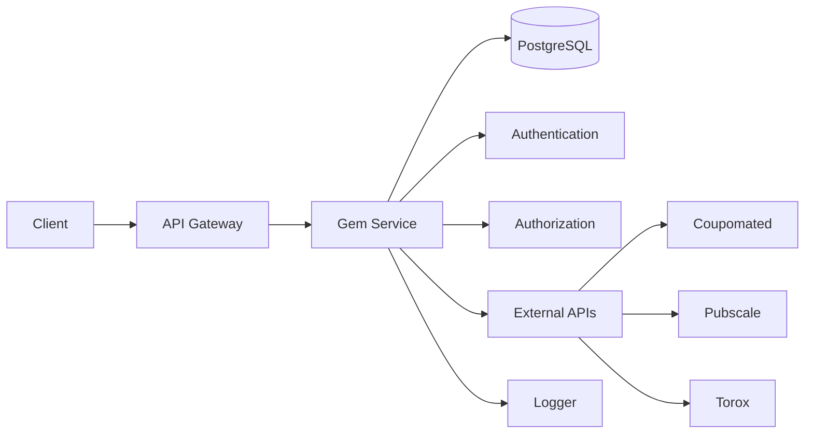
```mermaid
graph LR
    A[Client] --> B[API Gateway]
    B --> C[Gem Service]
    C --> D[(PostgreSQL)]
    C --> E[Authentication]
    C --> F[Authorization]
    C --> G[External APIs]
    C --> H[Logger]
    
    G --> I[Coupomated]
    G --> J[Pubscale]
    G --> K[Torox]
```

---

## Database Schema

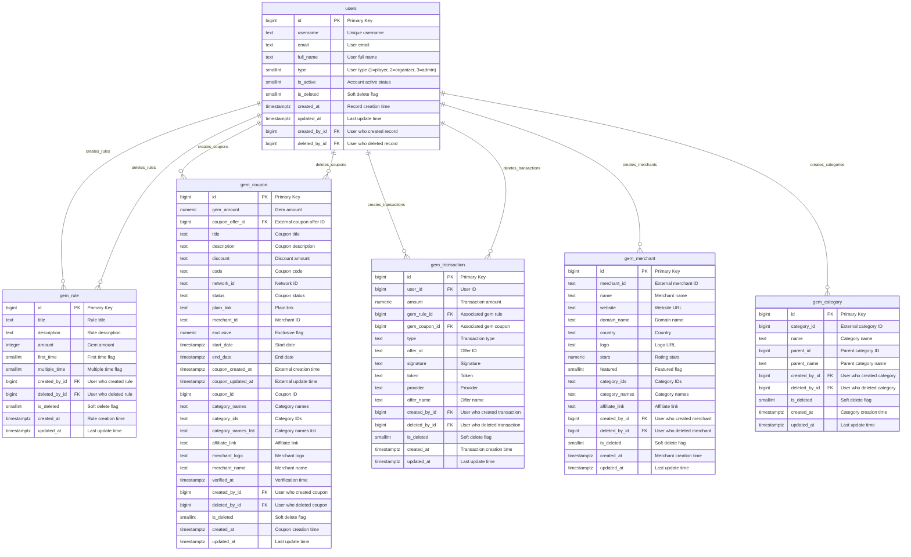
```mermaid
erDiagram
    users ||--o{ gem_rule : "creates_rules"
    users ||--o{ gem_rule : "deletes_rules"
    users ||--o{ gem_coupon : "creates_coupons"
    users ||--o{ gem_coupon : "deletes_coupons"
    users ||--o{ gem_transaction : "creates_transactions"
    users ||--o{ gem_transaction : "deletes_transactions"
    users ||--o{ gem_merchant : "creates_merchants"
    users ||--o{ gem_category : "creates_categories"

    users {
        bigint id PK "Primary Key"
        text username "Unique username"
        text email "User email"
        text full_name "User full name"
        smallint type "User type (1=player, 2=organizer, 3=admin)"
        smallint is_active "Account active status"
        smallint is_deleted "Soft delete flag"
        timestamptz created_at "Record creation time"
        timestamptz updated_at "Last update time"
        bigint created_by_id FK "User who created record"
        bigint deleted_by_id FK "User who deleted record"
    }
    
    gem_rule {
        bigint id PK "Primary Key"
        text title "Rule title"
        text description "Rule description"
        integer amount "Gem amount"
        smallint first_time "First time flag"
        smallint multiple_time "Multiple time flag"
        bigint created_by_id FK "User who created rule"
        bigint deleted_by_id FK "User who deleted rule"
        smallint is_deleted "Soft delete flag"
        timestamptz created_at "Rule creation time"
        timestamptz updated_at "Last update time"
    }
    
    gem_coupon {
        bigint id PK "Primary Key"
        numeric gem_amount "Gem amount"
        bigint coupon_offer_id FK "External coupon offer ID"
        text title "Coupon title"
        text description "Coupon description"
        text discount "Discount amount"
        text code "Coupon code"
        text network_id "Network ID"
        text status "Coupon status"
        text plain_link "Plain link"
        text merchant_id "Merchant ID"
        numeric exclusive "Exclusive flag"
        timestamptz start_date "Start date"
        timestamptz end_date "End date"
        timestamptz coupon_created_at "External creation time"
        timestamptz coupon_updated_at "External update time"
        bigint coupon_id "Coupon ID"
        text category_names "Category names"
        text category_ids "Category IDs"
        text category_names_list "Category names list"
        text affiliate_link "Affiliate link"
        text merchant_logo "Merchant logo"
        text merchant_name "Merchant name"
        timestamptz verified_at "Verification time"
        bigint created_by_id FK "User who created coupon"
        bigint deleted_by_id FK "User who deleted coupon"
        smallint is_deleted "Soft delete flag"
        timestamptz created_at "Coupon creation time"
        timestamptz updated_at "Last update time"
    }
    
    gem_transaction {
        bigint id PK "Primary Key"
        bigint user_id FK "User ID"
        numeric amount "Transaction amount"
        bigint gem_rule_id FK "Associated gem rule"
        bigint gem_coupon_id FK "Associated gem coupon"
        text type "Transaction type"
        text offer_id "Offer ID"
        text signature "Signature"
        text token "Token"
        text provider "Provider"
        text offer_name "Offer name"
        bigint created_by_id FK "User who created transaction"
        bigint deleted_by_id FK "User who deleted transaction"
        smallint is_deleted "Soft delete flag"
        timestamptz created_at "Transaction creation time"
        timestamptz updated_at "Last update time"
    }
    
    gem_merchant {
        bigint id PK "Primary Key"
        text merchant_id "External merchant ID"
        text name "Merchant name"
        text website "Website URL"
        text domain_name "Domain name"
        text country "Country"
        text logo "Logo URL"
        numeric stars "Rating stars"
        smallint featured "Featured flag"
        text category_ids "Category IDs"
        text category_names "Category names"
        text affiliate_link "Affiliate link"
        bigint created_by_id FK "User who created merchant"
        bigint deleted_by_id FK "User who deleted merchant"
        smallint is_deleted "Soft delete flag"
        timestamptz created_at "Merchant creation time"
        timestamptz updated_at "Last update time"
    }
    
    gem_category {
        bigint id PK "Primary Key"
        bigint category_id "External category ID"
        text name "Category name"
        bigint parent_id "Parent category ID"
        text parent_name "Parent category name"
        bigint created_by_id FK "User who created category"
        bigint deleted_by_id FK "User who deleted category"
        smallint is_deleted "Soft delete flag"
        timestamptz created_at "Category creation time"
        timestamptz updated_at "Last update time"
    }
```

## Table Relationship Graph


```mermaid
graph TD
    A[users Table] -->|creates| B[gem_rule Table]
    A -->|deletes| B
    A -->|creates| C[gem_coupon Table]
    A -->|deletes| C
    A -->|creates| D[gem_transaction Table]
    A -->|deletes| D
    A -->|creates| E[gem_merchant Table]
    A -->|creates| F[gem_category Table]
    
    B -->|references| D
    C -->|references| D
    
    subgraph "users Table"
        A1[users.id PK]
        A2[users.created_by_id FK]
        A3[users.type]
        A4[users.is_active]
    end
    
    subgraph "gem_rule Table"
        B1[gem_rule.id PK]
        B2[gem_rule.title]
        B3[gem_rule.amount]
        B4[gem_rule.created_by_id FK]
        B5[gem_rule.deleted_by_id FK]
    end
    
    subgraph "gem_coupon Table"
        C1[gem_coupon.id PK]
        C2[gem_coupon.coupon_offer_id]
        C3[gem_coupon.title]
        C4[gem_coupon.merchant_id]
        C5[gem_coupon.created_by_id FK]
        C6[gem_coupon.deleted_by_id FK]
    end
    
    subgraph "gem_transaction Table"
        D1[gem_transaction.id PK]
        D2[gem_transaction.user_id FK]
        D3[gem_transaction.amount]
        D4[gem_transaction.gem_rule_id FK]
        D5[gem_transaction.gem_coupon_id FK]
        D6[gem_transaction.type]
        D7[gem_transaction.created_by_id FK]
        D8[gem_transaction.deleted_by_id FK]
    end
    
    subgraph "gem_merchant Table"
        E1[gem_merchant.id PK]
        E2[gem_merchant.merchant_id]
        E3[gem_merchant.name]
        E4[gem_merchant.created_by_id FK]
        E5[gem_merchant.deleted_by_id FK]
    end
    
    subgraph "gem_category Table"
        F1[gem_category.id PK]
        F2[gem_category.category_id]
        F3[gem_category.name]
        F4[gem_category.parent_id]
        F5[gem_category.created_by_id FK]
        F6[gem_category.deleted_by_id FK]
    end
    
    A1 -.->|references| B4
    A1 -.->|references| B5
    A1 -.->|references| C5
    A1 -.->|references| C6
    A1 -.->|references| D7
    A1 -.->|references| D8
    A1 -.->|references| E4
    A1 -.->|references| E5
    A1 -.->|references| F5
    A1 -.->|references| F6
    B1 -.->|references| D4
    C1 -.->|references| D5
```

### Relationship Details

| Relationship | Type | Description | Foreign Key |
|--------------|------|-------------|-------------|
| users → gem_rule (creation) | One-to-Many | User can create multiple gem rules | `gem_rule.created_by_id` |
| users → gem_rule (deletion) | One-to-Many | User can delete multiple rules | `gem_rule.deleted_by_id` |
| users → gem_coupon (creation) | One-to-Many | User can create multiple coupons | `gem_coupon.created_by_id` |
| users → gem_coupon (deletion) | One-to-Many | User can delete multiple coupons | `gem_coupon.deleted_by_id` |
| users → gem_transaction (creation) | One-to-Many | User can create multiple transactions | `gem_transaction.created_by_id` |
| users → gem_transaction (deletion) | One-to-Many | User can delete multiple transactions | `gem_transaction.deleted_by_id` |
| users → gem_merchant (creation) | One-to-Many | User can create multiple merchants | `gem_merchant.created_by_id` |
| users → gem_category (creation) | One-to-Many | User can create multiple categories | `gem_category.created_by_id` |
| gem_rule → gem_transaction | One-to-Many | Rule can have multiple transactions | `gem_transaction.gem_rule_id` |
| gem_coupon → gem_transaction | One-to-Many | Coupon can have multiple transactions | `gem_transaction.gem_coupon_id` |

### Index Information

| Table | Index Type | Indexed Fields | Purpose |
|-------|------------|----------------|---------|
| gem_rule | btree | `title` | Title-based queries |
| gem_rule | btree | `description` | Description-based queries |
| gem_rule | btree | `amount` | Amount-based filtering |
| gem_rule | btree | `is_deleted` | Soft delete filtering |
| gem_coupon | btree | `coupon_offer_id` | External offer queries |
| gem_coupon | btree | `gem_amount` | Amount-based queries |
| gem_coupon | btree | `merchant_id` | Merchant-based queries |
| gem_coupon | btree | `status` | Status-based filtering |
| gem_coupon | btree | `is_deleted` | Soft delete filtering |
| gem_transaction | btree | `user_id` | User-based queries |
| gem_transaction | btree | `amount` | Amount-based queries |
| gem_transaction | btree | `gem_rule_id` | Rule-based queries |
| gem_transaction | btree | `gem_coupon_id` | Coupon-based queries |
| gem_transaction | btree | `type` | Type-based filtering |
| gem_transaction | btree | `is_deleted` | Soft delete filtering |
| gem_merchant | btree | `merchant_id` | External merchant queries |
| gem_merchant | btree | `name` | Name-based queries |
| gem_merchant | btree | `website` | Website-based queries |
| gem_merchant | btree | `domain_name` | Domain-based queries |
| gem_merchant | btree | `country` | Country-based queries |
| gem_merchant | btree | `logo` | Logo-based queries |
| gem_merchant | btree | `stars` | Rating-based queries |
| gem_merchant | btree | `featured` | Featured filtering |
| gem_merchant | btree | `is_deleted` | Soft delete filtering |
| gem_category | btree | `category_id` | External category queries |
| gem_category | btree | `name` | Name-based queries |
| gem_category | btree | `is_deleted` | Soft delete filtering |

### Unique Constraints

| Constraint | Fields | Description |
|------------|--------|-------------|
| `constraint_unique_gem_coupon_coupon_offer_id` | `coupon_offer_id` | Prevents duplicate external coupon offers |

---

## Base URLs

| Environment   | URL                                 |
|---------------|-------------------------------------|
| Production    | `https://thryl-prod.com   ||    https://thryl-production.zapto.org`      |
| Staging       | `https://thryl-staging.zapto.org` |
| Development   | `http://localhost:3000  || http://localhost:3001`      |

---

## Authentication

All Gem Service APIs require JWT authentication. Include the token in the Authorization header:

```http
Authorization: Bearer <your-jwt-token>
```

---

## Authorization

| Role         | Permissions                                      |
|--------------|--------------------------------------------------|
| **Admin**    | Create, read, update, delete gem rules, manage coupons, view all data |
| **Player**   | Read gem rules, create transactions, view coupons |

---

## API Reference

### Complete API List

#### Coupon APIs
| # | Endpoint                    | Method | Purpose                                 | Auth Required | Role Required         |
|---|-----------------------------|--------|-----------------------------------------|---------------|----------------------|
| 1 | `/new-coupon-insert`        | GET    | Insert new coupons from external API   | No            | None                 |
| 2 | `/get-merchants`            | GET    | Get all merchants                      | No            | None                 |
| 3 | `/get-categories`           | GET    | Get all categories                     | No            | None                 |
| 4 | `/unique-brand`             | GET    | Read unique brands                     | Yes           | admin, player        |
| 5 | `/app-read`                 | GET    | App read all coupons                   | Yes           | player               |
| 6 | `/read`                     | GET    | Dashboard show coupons                 | Yes           | admin                |
| 7 | `/delete`                   | DELETE | Delete coupon                          | Yes           | admin                |
| 8 | `/enable-disable`           | PUT    | Enable/disable coupon                  | Yes           | admin                |
| 9 | `/update`                   | PUT    | Update coupon                          | Yes           | admin                |

#### Rule APIs
| # | Endpoint                    | Method | Purpose                                 | Auth Required | Role Required         |
|---|-----------------------------|--------|-----------------------------------------|---------------|----------------------|
| 10 | `/create`                   | POST   | Create gem rule                        | Yes           | admin                |
| 11 | `/admin-read`               | GET    | Read all gem rules (admin)             | Yes           | admin, player        |
| 12 | `/update/:id`               | PUT    | Update gem rule                        | Yes           | admin                |
| 13 | `/delete/:id`               | DELETE | Delete gem rule                        | Yes           | admin                |
| 14 | `/read`                     | GET    | App show gem rules with claim status   | Yes           | player               |
| 15 | `/read-by-title`            | GET    | Get rule by title                      | Yes           | player               |
| 16 | `/update-status/:id`        | PUT    | Update rule status                     | Yes           | player               |

#### Transaction APIs
| # | Endpoint                    | Method | Purpose                                 | Auth Required | Role Required         |
|---|-----------------------------|--------|-----------------------------------------|---------------|----------------------|
| 17 | `/credit`                   | POST   | Credit gem transaction                  | Yes           | player               |
| 18 | `/read`                     | GET    | Get transaction history                 | Yes           | player               |
| 19 | `/debit`                    | POST   | Debit gem transaction                   | Yes           | player               |
| 20 | `/pubscale-callback`        | GET    | Pubscale callback                      | No            | None                 |
| 21 | `/torox-callback`           | GET    | Torox callback                         | No            | None                 |

---

## Validation Schemas

### Create Gem Rule Schema
```javascript
{
  title: Joi.string().required(),
  description: Joi.string().required(),
  amount: Joi.number().required()
}
```

### Update Gem Rule Schema
```javascript
{
  title: Joi.string().optional().allow(null),
  description: Joi.string().optional().allow(null),
  amount: Joi.number().optional().allow(null)
}
```

### Credit Transaction Schema
```javascript
{
  amount: Joi.number().required(),
  gem_rule_id: Joi.number().required(),
  type: Joi.string().required()
}
```

### Debit Transaction Schema
```javascript
{
  amount: Joi.number().required(),
  gem_coupon_id: Joi.number().required(),
  type: Joi.string().required()
}
```

---

## API Endpoints

### Coupon Management

#### 1. Insert New Coupons

Inserts new coupons from external Coupomated API.

**Endpoint:** `GET /gem/coupon/new-coupon-insert`

**Authorization:** None required

**Success Response (200):**
```json
{
  "status": 1,
  "data": {
    "message": "Coupons inserted successfully",
    "count": 150
  }
}
```

**Error Response (500):**
```json
{
  "status": 0,
  "message": "Failed to insert coupons"
}
```

**DFD:**
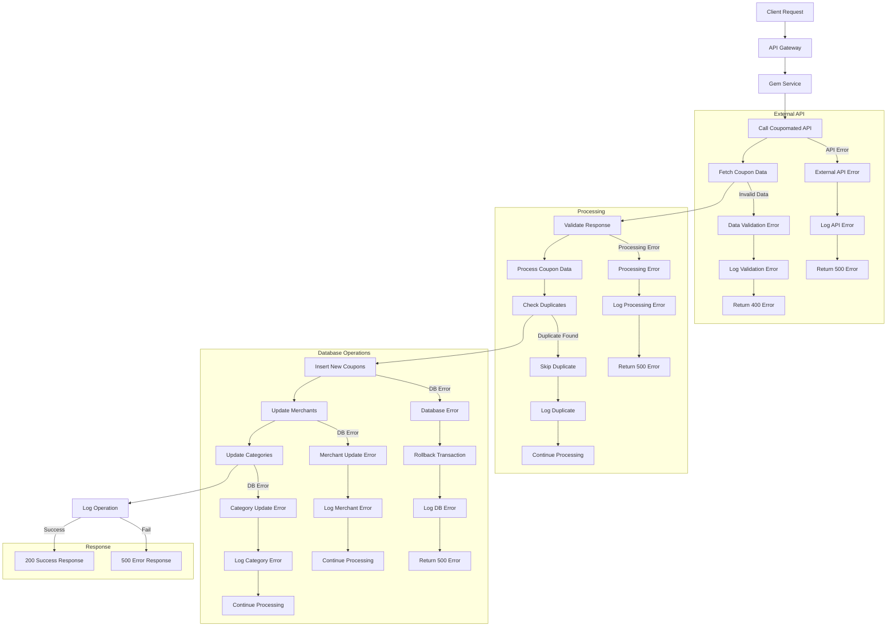
```mermaid
graph TD
    A[Client Request] --> B[API Gateway]
    B --> C[Gem Service]
    C --> D[Call Coupomated API]
    D --> E[Fetch Coupon Data]
    E --> F[Validate Response]
    F --> G[Process Coupon Data]
    G --> H[Check Duplicates]
    H --> I[Insert New Coupons]
    I --> J[Update Merchants]
    J --> K[Update Categories]
    K --> L[Log Operation]
    L -->|Success| M[200 Success Response]
    L -->|Fail| N[500 Error Response]
    
    D -->|API Error| D1[External API Error]
    D1 --> D2[Log API Error]
    D2 --> D3[Return 500 Error]
    
    E -->|Invalid Data| E1[Data Validation Error]
    E1 --> E2[Log Validation Error]
    E2 --> E3[Return 400 Error]
    
    F -->|Processing Error| F1[Processing Error]
    F1 --> F2[Log Processing Error]
    F2 --> F3[Return 500 Error]
    
    H -->|Duplicate Found| H1[Skip Duplicate]
    H1 --> H2[Log Duplicate]
    H2 --> H3[Continue Processing]
    
    I -->|DB Error| I1[Database Error]
    I1 --> I2[Rollback Transaction]
    I2 --> I3[Log DB Error]
    I3 --> I4[Return 500 Error]
    
    J -->|DB Error| J1[Merchant Update Error]
    J1 --> J2[Log Merchant Error]
    J2 --> J3[Continue Processing]
    
    K -->|DB Error| K1[Category Update Error]
    K1 --> K2[Log Category Error]
    K2 --> K3[Continue Processing]
    
    subgraph "External API"
        D
        E
        D1
        D2
        D3
        E1
        E2
        E3
    end
    
    subgraph "Processing"
        F
        F1
        F2
        F3
        G
        H
        H1
        H2
        H3
    end
    
    subgraph "Database Operations"
        I
        I1
        I2
        I3
        I4
        J
        J1
        J2
        J3
        K
        K1
        K2
        K3
    end
    
    subgraph "Response"
        M
        N
    end
```

#### 2. Get All Merchants

Retrieves all merchants from the database.

**Endpoint:** `GET /gem/coupon/get-merchants`

**Authorization:** None required

**Success Response (200):**
```json
{
  "status": 1,
  "data": [
    {
      "id": 1,
      "merchant_id": "merchant_123",
      "name": "Amazon",
      "website": "https://amazon.com",
      "logo": "https://example.com/logo.png",
      "stars": 4.5,
      "featured": 1
    }
  ]
}
```

**DFD:**
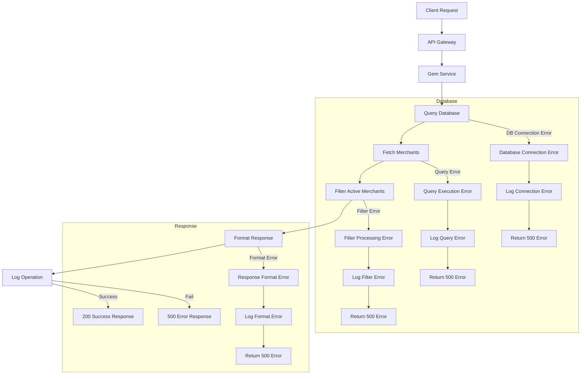
```mermaid
graph TD
    A[Client Request] --> B[API Gateway]
    B --> C[Gem Service]
    C --> D[Query Database]
    D --> E[Fetch Merchants]
    E --> F[Filter Active Merchants]
    F --> G[Format Response]
    G --> H[Log Operation]
    H -->|Success| I[200 Success Response]
    H -->|Fail| J[500 Error Response]
    
    D -->|DB Connection Error| D1[Database Connection Error]
    D1 --> D2[Log Connection Error]
    D2 --> D3[Return 500 Error]
    
    E -->|Query Error| E1[Query Execution Error]
    E1 --> E2[Log Query Error]
    E2 --> E3[Return 500 Error]
    
    F -->|Filter Error| F1[Filter Processing Error]
    F1 --> F2[Log Filter Error]
    F2 --> F3[Return 500 Error]
    
    G -->|Format Error| G1[Response Format Error]
    G1 --> G2[Log Format Error]
    G2 --> G3[Return 500 Error]
    
    subgraph "Database"
        D
        D1
        D2
        D3
        E
        E1
        E2
        E3
        F
        F1
        F2
        F3
    end
    
    subgraph "Response"
        G
        G1
        G2
        G3
        I
        J
    end
```

#### 3. Get All Categories

Retrieves all categories from the database.

**Endpoint:** `GET /gem/coupon/get-categories`

**Authorization:** None required

**Success Response (200):**
```json
{
  "status": 1,
  "data": [
    {
      "id": 1,
      "category_id": "cat_123",
      "name": "Electronics",
      "parent_id": null,
      "parent_name": null
    }
  ]
}
```

**DFD:**
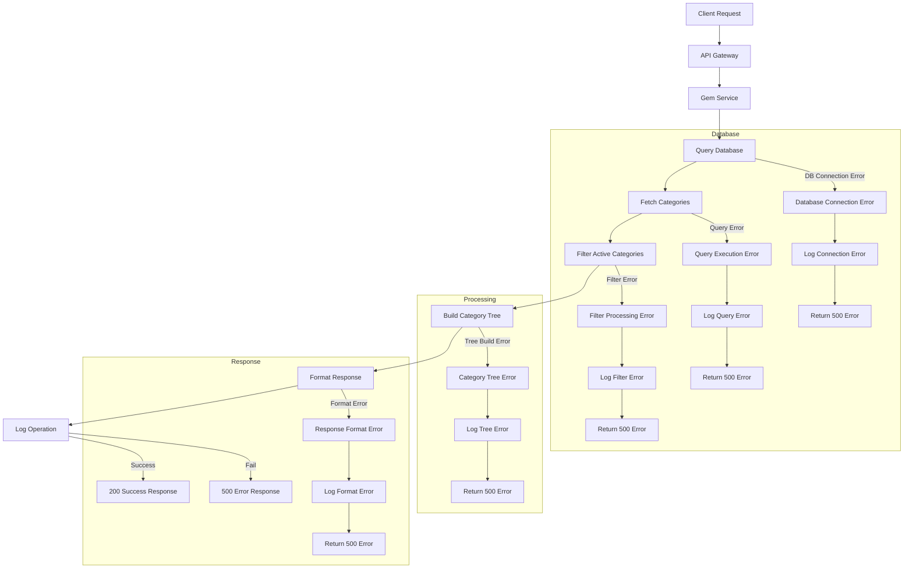
```mermaid
graph TD
    A[Client Request] --> B[API Gateway]
    B --> C[Gem Service]
    C --> D[Query Database]
    D --> E[Fetch Categories]
    E --> F[Filter Active Categories]
    F --> G[Build Category Tree]
    G --> H[Format Response]
    H --> I[Log Operation]
    I -->|Success| J[200 Success Response]
    I -->|Fail| K[500 Error Response]
    
    D -->|DB Connection Error| D1[Database Connection Error]
    D1 --> D2[Log Connection Error]
    D2 --> D3[Return 500 Error]
    
    E -->|Query Error| E1[Query Execution Error]
    E1 --> E2[Log Query Error]
    E2 --> E3[Return 500 Error]
    
    F -->|Filter Error| F1[Filter Processing Error]
    F1 --> F2[Log Filter Error]
    F2 --> F3[Return 500 Error]
    
    G -->|Tree Build Error| G1[Category Tree Error]
    G1 --> G2[Log Tree Error]
    G2 --> G3[Return 500 Error]
    
    H -->|Format Error| H1[Response Format Error]
    H1 --> H2[Log Format Error]
    H2 --> H3[Return 500 Error]
    
    subgraph "Database"
        D
        D1
        D2
        D3
        E
        E1
        E2
        E3
        F
        F1
        F2
        F3
    end
    
    subgraph "Processing"
        G
        G1
        G2
        G3
    end
    
    subgraph "Response"
        H
        H1
        H2
        H3
        J
        K
    end
```

#### 4. Read Unique Brands

Retrieves unique brands with pagination.

**Endpoint:** `GET /gem/coupon/unique-brand`

**Authorization:** Admin, Player

**Query Parameters:**
- `page` (optional): Page number (default: 1)
- `limit` (optional): Items per page (default: 10)

**Success Response (200):**
```json
{
  "status": 1,
  "data": [
    {
      "merchant_name": "Amazon",
      "merchant_logo": "https://example.com/logo.png",
      "coupon_count": 25
    }
  ]
}
```

**DFD:**
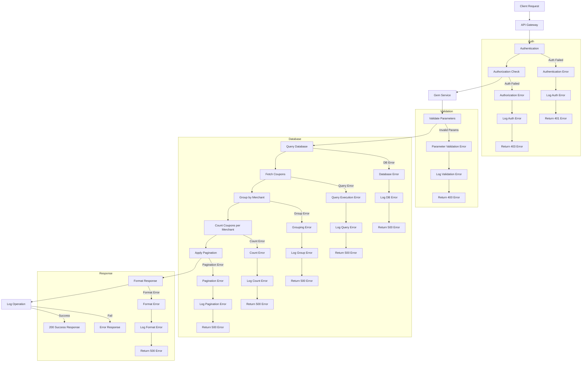
```mermaid
graph TD
    A[Client Request] --> B[API Gateway]
    B --> C[Authentication]
    C --> D[Authorization Check]
    D --> E[Gem Service]
    E --> F[Validate Parameters]
    F --> G[Query Database]
    G --> H[Fetch Coupons]
    H --> I[Group by Merchant]
    I --> J[Count Coupons per Merchant]
    J --> K[Apply Pagination]
    K --> L[Format Response]
    L --> M[Log Operation]
    M -->|Success| N[200 Success Response]
    M -->|Fail| O[Error Response]
    
    C -->|Auth Failed| C1[Authentication Error]
    C1 --> C2[Log Auth Error]
    C2 --> C3[Return 401 Error]
    
    D -->|Auth Failed| D1[Authorization Error]
    D1 --> D2[Log Auth Error]
    D2 --> D3[Return 403 Error]
    
    F -->|Invalid Params| F1[Parameter Validation Error]
    F1 --> F2[Log Validation Error]
    F2 --> F3[Return 400 Error]
    
    G -->|DB Error| G1[Database Error]
    G1 --> G2[Log DB Error]
    G2 --> G3[Return 500 Error]
    
    H -->|Query Error| H1[Query Execution Error]
    H1 --> H2[Log Query Error]
    H2 --> H3[Return 500 Error]
    
    I -->|Group Error| I1[Grouping Error]
    I1 --> I2[Log Group Error]
    I2 --> I3[Return 500 Error]
    
    J -->|Count Error| J1[Count Error]
    J1 --> J2[Log Count Error]
    J2 --> J3[Return 500 Error]
    
    K -->|Pagination Error| K1[Pagination Error]
    K1 --> K2[Log Pagination Error]
    K2 --> K3[Return 500 Error]
    
    L -->|Format Error| L1[Format Error]
    L1 --> L2[Log Format Error]
    L2 --> L3[Return 500 Error]
    
    subgraph "Auth"
        C
        C1
        C2
        C3
        D
        D1
        D2
        D3
    end
    
    subgraph "Validation"
        F
        F1
        F2
        F3
    end
    
    subgraph "Database"
        G
        G1
        G2
        G3
        H
        H1
        H2
        H3
        I
        I1
        I2
        I3
        J
        J1
        J2
        J3
        K
        K1
        K2
        K3
    end
    
    subgraph "Response"
        L
        L1
        L2
        L3
        N
        O
    end
```

#### 5. App Read All Coupons

Retrieves coupons for app users with pagination.

**Endpoint:** `GET /gem/coupon/app-read`

**Authorization:** Player only

**Query Parameters:**
- `page` (optional): Page number (default: 1)
- `limit` (optional): Items per page (default: 10)

**Success Response (200):**
```json
{
  "status": 1,
  "data": [
    {
      "id": 1,
      "title": "20% Off Electronics",
      "description": "Get 20% off on all electronics",
      "discount": "20%",
      "merchant_name": "Amazon",
      "merchant_logo": "https://example.com/logo.png",
      "affiliate_link": "https://example.com/coupon",
      "gem_amount": 50
    }
  ]
}
```

**DFD:**
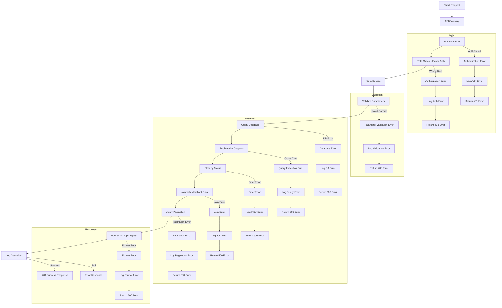
```mermaid
graph TD
    A[Client Request] --> B[API Gateway]
    B --> C[Authentication]
    C --> D[Role Check - Player Only]
    D --> E[Gem Service]
    E --> F[Validate Parameters]
    F --> G[Query Database]
    G --> H[Fetch Active Coupons]
    H --> I[Filter by Status]
    I --> J[Join with Merchant Data]
    J --> K[Apply Pagination]
    K --> L[Format for App Display]
    L --> M[Log Operation]
    M -->|Success| N[200 Success Response]
    M -->|Fail| O[Error Response]
    
    C -->|Auth Failed| C1[Authentication Error]
    C1 --> C2[Log Auth Error]
    C2 --> C3[Return 401 Error]
    
    D -->|Wrong Role| D1[Authorization Error]
    D1 --> D2[Log Auth Error]
    D2 --> D3[Return 403 Error]
    
    F -->|Invalid Params| F1[Parameter Validation Error]
    F1 --> F2[Log Validation Error]
    F2 --> F3[Return 400 Error]
    
    G -->|DB Error| G1[Database Error]
    G1 --> G2[Log DB Error]
    G2 --> G3[Return 500 Error]
    
    H -->|Query Error| H1[Query Execution Error]
    H1 --> H2[Log Query Error]
    H2 --> H3[Return 500 Error]
    
    I -->|Filter Error| I1[Filter Error]
    I1 --> I2[Log Filter Error]
    I2 --> I3[Return 500 Error]
    
    J -->|Join Error| J1[Join Error]
    J1 --> J2[Log Join Error]
    J2 --> J3[Return 500 Error]
    
    K -->|Pagination Error| K1[Pagination Error]
    K1 --> K2[Log Pagination Error]
    K2 --> K3[Return 500 Error]
    
    L -->|Format Error| L1[Format Error]
    L1 --> L2[Log Format Error]
    L2 --> L3[Return 500 Error]
    
    subgraph "Auth"
        C
        C1
        C2
        C3
        D
        D1
        D2
        D3
    end
    
    subgraph "Validation"
        F
        F1
        F2
        F3
    end
    
    subgraph "Database"
        G
        G1
        G2
        G3
        H
        H1
        H2
        H3
        I
        I1
        I2
        I3
        J
        J1
        J2
        J3
        K
        K1
        K2
        K3
    end
    
    subgraph "Response"
        L
        L1
        L2
        L3
        N
        O
    end
```

#### 6. Dashboard Show Coupons

Retrieves coupons for admin dashboard with filtering.

**Endpoint:** `GET /gem/coupon/read`

**Authorization:** Admin only

**Query Parameters:**
- `page` (optional): Page number (default: 1)
- `limit` (optional): Items per page (default: 10)
- `keyword` (optional): Search keyword
- `date` (optional): Filter by date

**Success Response (200):**
```json
{
  "status": 1,
  "data": [
    {
      "id": 1,
      "title": "20% Off Electronics",
      "description": "Get 20% off on all electronics",
      "status": "active",
      "start_date": "2024-01-01T00:00:00Z",
      "end_date": "2024-12-31T23:59:59Z",
      "merchant_name": "Amazon",
      "gem_amount": 50
    }
  ]
}
```

**DFD:**
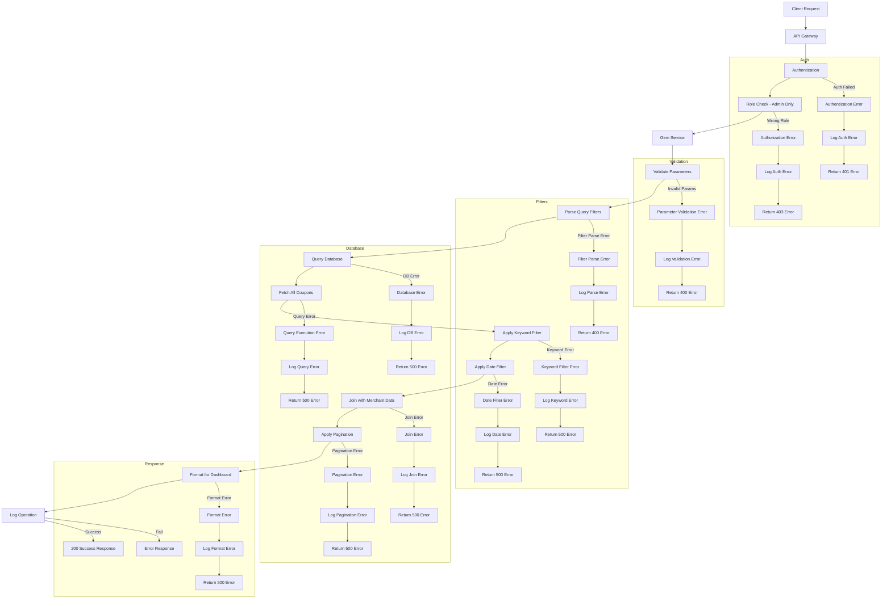
```mermaid
graph TD
    A[Client Request] --> B[API Gateway]
    B --> C[Authentication]
    C --> D[Role Check - Admin Only]
    D --> E[Gem Service]
    E --> F[Validate Parameters]
    F --> G[Parse Query Filters]
    G --> H[Query Database]
    H --> I[Fetch All Coupons]
    I --> J[Apply Keyword Filter]
    J --> K[Apply Date Filter]
    K --> L[Join with Merchant Data]
    L --> M[Apply Pagination]
    M --> N[Format for Dashboard]
    N --> O[Log Operation]
    O -->|Success| P[200 Success Response]
    O -->|Fail| Q[Error Response]
    
    C -->|Auth Failed| C1[Authentication Error]
    C1 --> C2[Log Auth Error]
    C2 --> C3[Return 401 Error]
    
    D -->|Wrong Role| D1[Authorization Error]
    D1 --> D2[Log Auth Error]
    D2 --> D3[Return 403 Error]
    
    F -->|Invalid Params| F1[Parameter Validation Error]
    F1 --> F2[Log Validation Error]
    F2 --> F3[Return 400 Error]
    
    G -->|Filter Parse Error| G1[Filter Parse Error]
    G1 --> G2[Log Parse Error]
    G2 --> G3[Return 400 Error]
    
    H -->|DB Error| H1[Database Error]
    H1 --> H2[Log DB Error]
    H2 --> H3[Return 500 Error]
    
    I -->|Query Error| I1[Query Execution Error]
    I1 --> I2[Log Query Error]
    I2 --> I3[Return 500 Error]
    
    J -->|Keyword Error| J1[Keyword Filter Error]
    J1 --> J2[Log Keyword Error]
    J2 --> J3[Return 500 Error]
    
    K -->|Date Error| K1[Date Filter Error]
    K1 --> K2[Log Date Error]
    K2 --> K3[Return 500 Error]
    
    L -->|Join Error| L1[Join Error]
    L1 --> L2[Log Join Error]
    L2 --> L3[Return 500 Error]
    
    M -->|Pagination Error| M1[Pagination Error]
    M1 --> M2[Log Pagination Error]
    M2 --> M3[Return 500 Error]
    
    N -->|Format Error| N1[Format Error]
    N1 --> N2[Log Format Error]
    N2 --> N3[Return 500 Error]
    
    subgraph "Auth"
        C
        C1
        C2
        C3
        D
        D1
        D2
        D3
    end
    
    subgraph "Validation"
        F
        F1
        F2
        F3
    end
    
    subgraph "Filters"
        G
        G1
        G2
        G3
        J
        J1
        J2
        J3
        K
        K1
        K2
        K3
    end
    
    subgraph "Database"
        H
        H1
        H2
        H3
        I
        I1
        I2
        I3
        L
        L1
        L2
        L3
        M
        M1
        M2
        M3
    end
    
    subgraph "Response"
        N
        N1
        N2
        N3
        P
        Q
    end
```

#### 7. Delete Coupon

Deletes a coupon by ID.

**Endpoint:** `DELETE /gem/coupon/delete`

**Authorization:** Admin only

**Query Parameters:**
- `id`: Coupon ID to delete

**Success Response (204):**
```json
{
  "status": 1,
  "data": {
    "message": "Coupon deleted successfully"
  }
}
```

**DFD:**
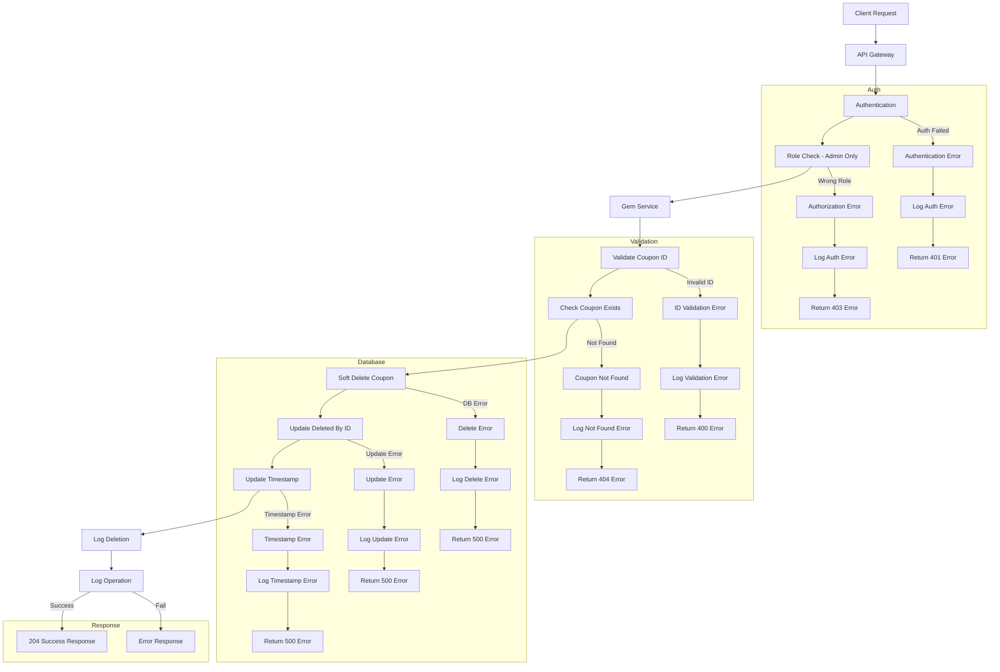
```mermaid
graph TD
    A[Client Request] --> B[API Gateway]
    B --> C[Authentication]
    C --> D[Role Check - Admin Only]
    D --> E[Gem Service]
    E --> F[Validate Coupon ID]
    F --> G[Check Coupon Exists]
    G --> H[Soft Delete Coupon]
    H --> I[Update Deleted By ID]
    I --> J[Update Timestamp]
    J --> K[Log Deletion]
    K --> L[Log Operation]
    L -->|Success| M[204 Success Response]
    L -->|Fail| N[Error Response]
    
    C -->|Auth Failed| C1[Authentication Error]
    C1 --> C2[Log Auth Error]
    C2 --> C3[Return 401 Error]
    
    D -->|Wrong Role| D1[Authorization Error]
    D1 --> D2[Log Auth Error]
    D2 --> D3[Return 403 Error]
    
    F -->|Invalid ID| F1[ID Validation Error]
    F1 --> F2[Log Validation Error]
    F2 --> F3[Return 400 Error]
    
    G -->|Not Found| G1[Coupon Not Found]
    G1 --> G2[Log Not Found Error]
    G2 --> G3[Return 404 Error]
    
    H -->|DB Error| H1[Delete Error]
    H1 --> H2[Log Delete Error]
    H2 --> H3[Return 500 Error]
    
    I -->|Update Error| I1[Update Error]
    I1 --> I2[Log Update Error]
    I2 --> I3[Return 500 Error]
    
    J -->|Timestamp Error| J1[Timestamp Error]
    J1 --> J2[Log Timestamp Error]
    J2 --> J3[Return 500 Error]
    
    subgraph "Auth"
        C
        C1
        C2
        C3
        D
        D1
        D2
        D3
    end
    
    subgraph "Validation"
        F
        F1
        F2
        F3
        G
        G1
        G2
        G3
    end
    
    subgraph "Database"
        H
        H1
        H2
        H3
        I
        I1
        I2
        I3
        J
        J1
        J2
        J3
    end
    
    subgraph "Response"
        M
        N
    end
```

#### 8. Enable/Disable Coupon

Enables or disables a coupon.

**Endpoint:** `PUT /gem/coupon/enable-disable`

**Authorization:** Admin only

**Query Parameters:**
- `id`: Coupon ID
- `is_deleted`: 0 to enable, 1 to disable

**Success Response (200):**
```json
{
  "status": 1,
  "data": {
    "message": "Coupon status updated successfully"
  }
}
```

**DFD:**
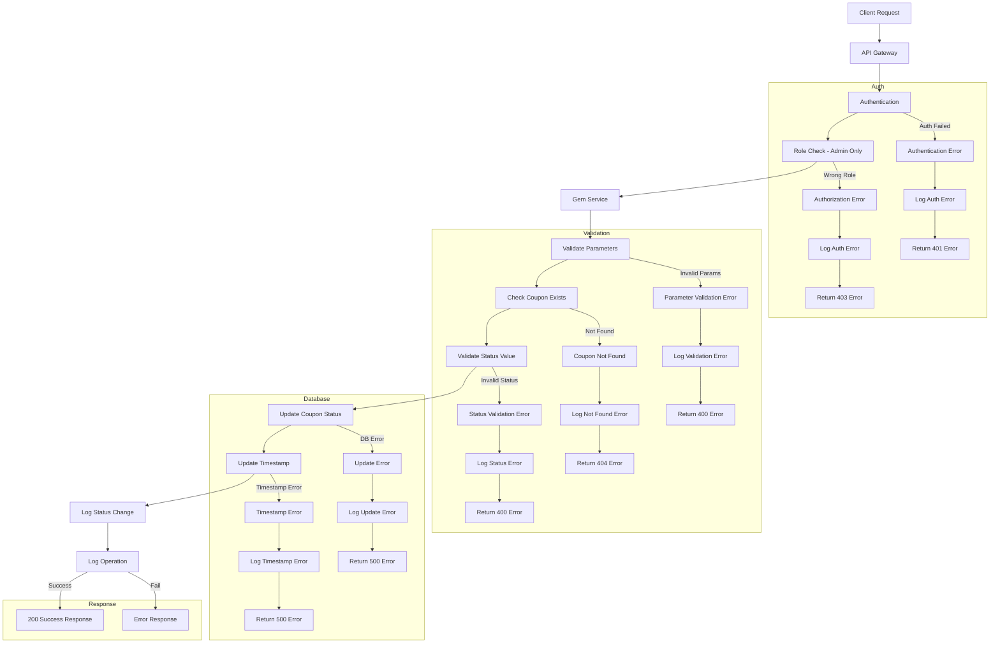
```mermaid
graph TD
    A[Client Request] --> B[API Gateway]
    B --> C[Authentication]
    C --> D[Role Check - Admin Only]
    D --> E[Gem Service]
    E --> F[Validate Parameters]
    F --> G[Check Coupon Exists]
    G --> H[Validate Status Value]
    H --> I[Update Coupon Status]
    I --> J[Update Timestamp]
    J --> K[Log Status Change]
    K --> L[Log Operation]
    L -->|Success| M[200 Success Response]
    L -->|Fail| N[Error Response]
    
    C -->|Auth Failed| C1[Authentication Error]
    C1 --> C2[Log Auth Error]
    C2 --> C3[Return 401 Error]
    
    D -->|Wrong Role| D1[Authorization Error]
    D1 --> D2[Log Auth Error]
    D2 --> D3[Return 403 Error]
    
    F -->|Invalid Params| F1[Parameter Validation Error]
    F1 --> F2[Log Validation Error]
    F2 --> F3[Return 400 Error]
    
    G -->|Not Found| G1[Coupon Not Found]
    G1 --> G2[Log Not Found Error]
    G2 --> G3[Return 404 Error]
    
    H -->|Invalid Status| H1[Status Validation Error]
    H1 --> H2[Log Status Error]
    H2 --> H3[Return 400 Error]
    
    I -->|DB Error| I1[Update Error]
    I1 --> I2[Log Update Error]
    I2 --> I3[Return 500 Error]
    
    J -->|Timestamp Error| J1[Timestamp Error]
    J1 --> J2[Log Timestamp Error]
    J2 --> J3[Return 500 Error]
    
    subgraph "Auth"
        C
        C1
        C2
        C3
        D
        D1
        D2
        D3
    end
    
    subgraph "Validation"
        F
        F1
        F2
        F3
        G
        G1
        G2
        G3
        H
        H1
        H2
        H3
    end
    
    subgraph "Database"
        I
        I1
        I2
        I3
        J
        J1
        J2
        J3
    end
    
    subgraph "Response"
        M
        N
    end
```

#### 9. Update Coupon

Updates coupon information.

**Endpoint:** `PUT /gem/coupon/update`

**Authorization:** Admin only

**Query Parameters:**
- `id`: Coupon ID

**Request Body:**
```json
{
  "title": "Updated Coupon Title",
  "description": "Updated description",
  "gem_amount": 75
}
```

**Success Response (200):**
```json
{
  "status": 1,
  "data": {
    "id": 1,
    "title": "Updated Coupon Title",
    "description": "Updated description",
    "gem_amount": 75
  }
}
```

**DFD:**
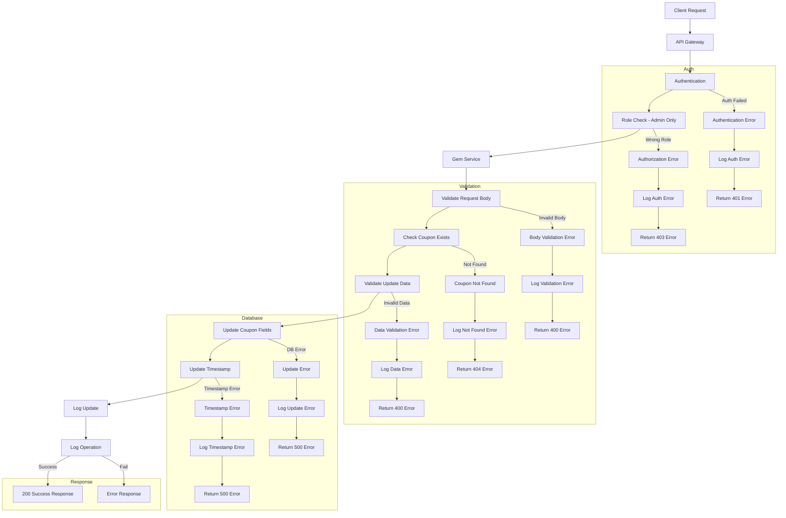
```mermaid
graph TD
    A[Client Request] --> B[API Gateway]
    B --> C[Authentication]
    C --> D[Role Check - Admin Only]
    D --> E[Gem Service]
    E --> F[Validate Request Body]
    F --> G[Check Coupon Exists]
    G --> H[Validate Update Data]
    H --> I[Update Coupon Fields]
    I --> J[Update Timestamp]
    J --> K[Log Update]
    K --> L[Log Operation]
    L -->|Success| M[200 Success Response]
    L -->|Fail| N[Error Response]
    
    C -->|Auth Failed| C1[Authentication Error]
    C1 --> C2[Log Auth Error]
    C2 --> C3[Return 401 Error]
    
    D -->|Wrong Role| D1[Authorization Error]
    D1 --> D2[Log Auth Error]
    D2 --> D3[Return 403 Error]
    
    F -->|Invalid Body| F1[Body Validation Error]
    F1 --> F2[Log Validation Error]
    F2 --> F3[Return 400 Error]
    
    G -->|Not Found| G1[Coupon Not Found]
    G1 --> G2[Log Not Found Error]
    G2 --> G3[Return 404 Error]
    
    H -->|Invalid Data| H1[Data Validation Error]
    H1 --> H2[Log Data Error]
    H2 --> H3[Return 400 Error]
    
    I -->|DB Error| I1[Update Error]
    I1 --> I2[Log Update Error]
    I2 --> I3[Return 500 Error]
    
    J -->|Timestamp Error| J1[Timestamp Error]
    J1 --> J2[Log Timestamp Error]
    J2 --> J3[Return 500 Error]
    
    subgraph "Auth"
        C
        C1
        C2
        C3
        D
        D1
        D2
        D3
    end
    
    subgraph "Validation"
        F
        F1
        F2
        F3
        G
        G1
        G2
        G3
        H
        H1
        H2
        H3
    end
    
    subgraph "Database"
        I
        I1
        I2
        I3
        J
        J1
        J2
        J3
    end
    
    subgraph "Response"
        M
        N
    end
```

### Gem Rule Management

#### 10. Create Gem Rule

Creates a new gem rule.

**Endpoint:** `POST /gem/rule/create`

**Authorization:** Admin only

**Request Body:**
```json
{
  "title": "7-Day Login Streak",
  "description": "Reward for 7 consecutive days of login",
  "amount": 100
}
```

**Success Response (200):**
```json
{
  "status": 1,
  "data": {
    "id": 1,
    "title": "7-Day Login Streak",
    "description": "Reward for 7 consecutive days of login",
    "amount": 100,
    "created_by_id": 123,
    "created_at": "2024-01-15T10:30:00Z"
  }
}
```

**DFD:**
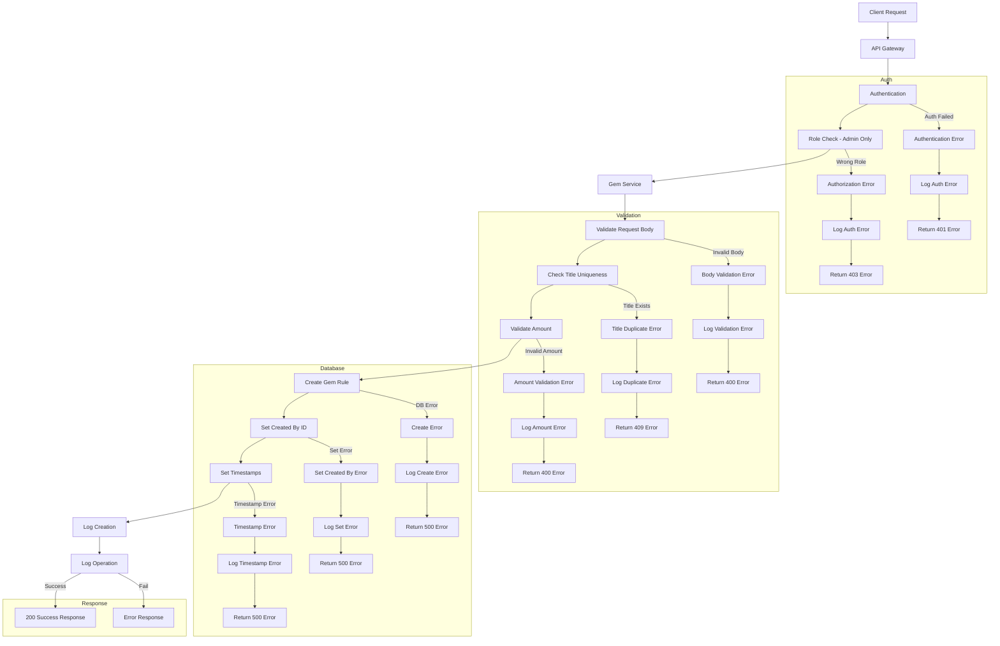
```mermaid
graph TD
    A[Client Request] --> B[API Gateway]
    B --> C[Authentication]
    C --> D[Role Check - Admin Only]
    D --> E[Gem Service]
    E --> F[Validate Request Body]
    F --> G[Check Title Uniqueness]
    G --> H[Validate Amount]
    H --> I[Create Gem Rule]
    I --> J[Set Created By ID]
    J --> K[Set Timestamps]
    K --> L[Log Creation]
    L --> M[Log Operation]
    M -->|Success| N[200 Success Response]
    M -->|Fail| O[Error Response]
    
    C -->|Auth Failed| C1[Authentication Error]
    C1 --> C2[Log Auth Error]
    C2 --> C3[Return 401 Error]
    
    D -->|Wrong Role| D1[Authorization Error]
    D1 --> D2[Log Auth Error]
    D2 --> D3[Return 403 Error]
    
    F -->|Invalid Body| F1[Body Validation Error]
    F1 --> F2[Log Validation Error]
    F2 --> F3[Return 400 Error]
    
    G -->|Title Exists| G1[Title Duplicate Error]
    G1 --> G2[Log Duplicate Error]
    G2 --> G3[Return 409 Error]
    
    H -->|Invalid Amount| H1[Amount Validation Error]
    H1 --> H2[Log Amount Error]
    H2 --> H3[Return 400 Error]
    
    I -->|DB Error| I1[Create Error]
    I1 --> I2[Log Create Error]
    I2 --> I3[Return 500 Error]
    
    J -->|Set Error| J1[Set Created By Error]
    J1 --> J2[Log Set Error]
    J2 --> J3[Return 500 Error]
    
    K -->|Timestamp Error| K1[Timestamp Error]
    K1 --> K2[Log Timestamp Error]
    K2 --> K3[Return 500 Error]
    
    subgraph "Auth"
        C
        C1
        C2
        C3
        D
        D1
        D2
        D3
    end
    
    subgraph "Validation"
        F
        F1
        F2
        F3
        G
        G1
        G2
        G3
        H
        H1
        H2
        H3
    end
    
    subgraph "Database"
        I
        I1
        I2
        I3
        J
        J1
        J2
        J3
        K
        K1
        K2
        K3
    end
    
    subgraph "Response"
        N
        O
    end
```

#### 11. Read All Gem Rules (Admin)

Retrieves all gem rules for admin.

**Endpoint:** `GET /gem/rule/admin-read`

**Authorization:** Admin, Player

**Query Parameters:**
- `page` (optional): Page number (default: 1)
- `limit` (optional): Items per page (default: 10)

**Success Response (200):**
```json
{
  "status": 1,
  "data": [
    {
      "id": 1,
      "title": "7-Day Login Streak",
      "description": "Reward for 7 consecutive days of login",
      "amount": 100,
      "first_time": 1,
      "multiple_time": 0
    }
  ]
}
```

**DFD:**
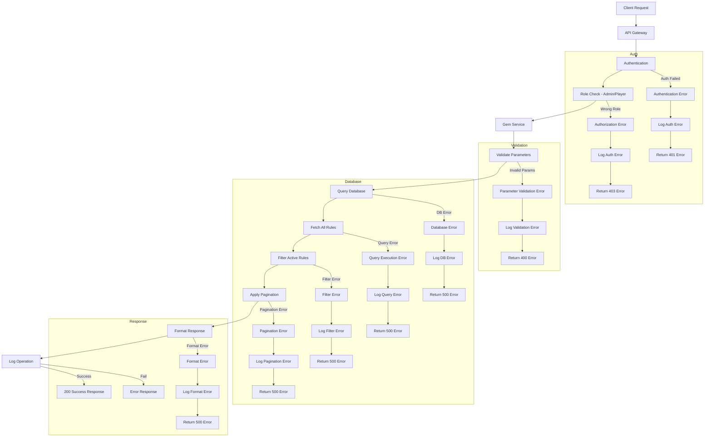
```mermaid
graph TD
    A[Client Request] --> B[API Gateway]
    B --> C[Authentication]
    C --> D[Role Check - Admin/Player]
    D --> E[Gem Service]
    E --> F[Validate Parameters]
    F --> G[Query Database]
    G --> H[Fetch All Rules]
    H --> I[Filter Active Rules]
    I --> J[Apply Pagination]
    J --> K[Format Response]
    K --> L[Log Operation]
    L -->|Success| M[200 Success Response]
    L -->|Fail| N[Error Response]
    
    C -->|Auth Failed| C1[Authentication Error]
    C1 --> C2[Log Auth Error]
    C2 --> C3[Return 401 Error]
    
    D -->|Wrong Role| D1[Authorization Error]
    D1 --> D2[Log Auth Error]
    D2 --> D3[Return 403 Error]
    
    F -->|Invalid Params| F1[Parameter Validation Error]
    F1 --> F2[Log Validation Error]
    F2 --> F3[Return 400 Error]
    
    G -->|DB Error| G1[Database Error]
    G1 --> G2[Log DB Error]
    G2 --> G3[Return 500 Error]
    
    H -->|Query Error| H1[Query Execution Error]
    H1 --> H2[Log Query Error]
    H2 --> H3[Return 500 Error]
    
    I -->|Filter Error| I1[Filter Error]
    I1 --> I2[Log Filter Error]
    I2 --> I3[Return 500 Error]
    
    J -->|Pagination Error| J1[Pagination Error]
    J1 --> J2[Log Pagination Error]
    J2 --> J3[Return 500 Error]
    
    K -->|Format Error| K1[Format Error]
    K1 --> K2[Log Format Error]
    K2 --> K3[Return 500 Error]
    
    subgraph "Auth"
        C
        C1
        C2
        C3
        D
        D1
        D2
        D3
    end
    
    subgraph "Validation"
        F
        F1
        F2
        F3
    end
    
    subgraph "Database"
        G
        G1
        G2
        G3
        H
        H1
        H2
        H3
        I
        I1
        I2
        I3
        J
        J1
        J2
        J3
    end
    
    subgraph "Response"
        K
        K1
        K2
        K3
        M
        N
    end
```

#### 12. Update Gem Rule

Updates an existing gem rule.

**Endpoint:** `PUT /gem/rule/update/:id`

**Authorization:** Admin only

**Path Parameters:**
- `id`: Gem rule ID

**Request Body:**
```json
{
  "title": "Updated Rule Title",
  "amount": 150
}
```

**Success Response (200):**
```json
{
  "status": 1,
  "data": {
    "id": 1,
    "title": "Updated Rule Title",
    "description": "Reward for 7 consecutive days of login",
    "amount": 150,
    "updated_at": "2024-01-15T12:30:00Z"
  }
}
```

**DFD:**
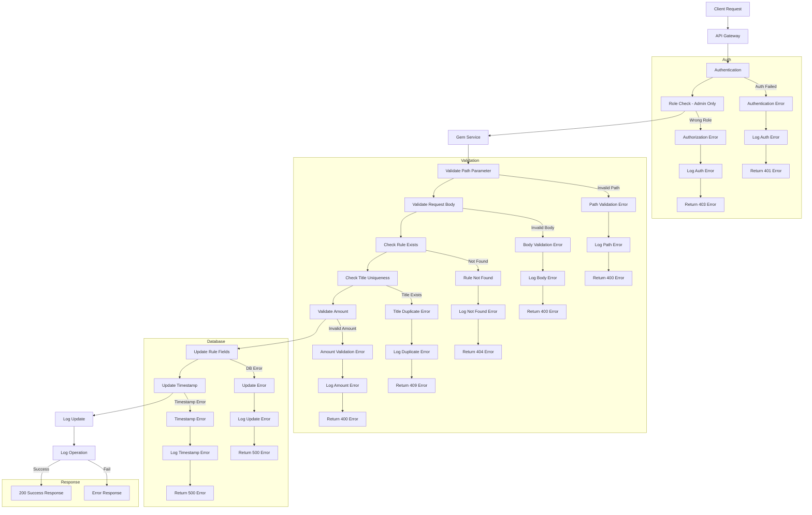
```mermaid
graph TD
    A[Client Request] --> B[API Gateway]
    B --> C[Authentication]
    C --> D[Role Check - Admin Only]
    D --> E[Gem Service]
    E --> F[Validate Path Parameter]
    F --> G[Validate Request Body]
    G --> H[Check Rule Exists]
    H --> I[Check Title Uniqueness]
    I --> J[Validate Amount]
    J --> K[Update Rule Fields]
    K --> L[Update Timestamp]
    L --> M[Log Update]
    M --> N[Log Operation]
    N -->|Success| O[200 Success Response]
    N -->|Fail| P[Error Response]
    
    C -->|Auth Failed| C1[Authentication Error]
    C1 --> C2[Log Auth Error]
    C2 --> C3[Return 401 Error]
    
    D -->|Wrong Role| D1[Authorization Error]
    D1 --> D2[Log Auth Error]
    D2 --> D3[Return 403 Error]
    
    F -->|Invalid Path| F1[Path Validation Error]
    F1 --> F2[Log Path Error]
    F2 --> F3[Return 400 Error]
    
    G -->|Invalid Body| G1[Body Validation Error]
    G1 --> G2[Log Body Error]
    G2 --> G3[Return 400 Error]
    
    H -->|Not Found| H1[Rule Not Found]
    H1 --> H2[Log Not Found Error]
    H2 --> H3[Return 404 Error]
    
    I -->|Title Exists| I1[Title Duplicate Error]
    I1 --> I2[Log Duplicate Error]
    I2 --> I3[Return 409 Error]
    
    J -->|Invalid Amount| J1[Amount Validation Error]
    J1 --> J2[Log Amount Error]
    J2 --> J3[Return 400 Error]
    
    K -->|DB Error| K1[Update Error]
    K1 --> K2[Log Update Error]
    K2 --> K3[Return 500 Error]
    
    L -->|Timestamp Error| L1[Timestamp Error]
    L1 --> L2[Log Timestamp Error]
    L2 --> L3[Return 500 Error]
    
    subgraph "Auth"
        C
        C1
        C2
        C3
        D
        D1
        D2
        D3
    end
    
    subgraph "Validation"
        F
        F1
        F2
        F3
        G
        G1
        G2
        G3
        H
        H1
        H2
        H3
        I
        I1
        I2
        I3
        J
        J1
        J2
        J3
    end
    
    subgraph "Database"
        K
        K1
        K2
        K3
        L
        L1
        L2
        L3
    end
    
    subgraph "Response"
        O
        P
    end
```

#### 13. Delete Gem Rule

Deletes a gem rule.

**Endpoint:** `DELETE /gem/rule/delete/:id`

**Authorization:** Admin only

**Path Parameters:**
- `id`: Gem rule ID

**Success Response (204):**
```json
{
  "status": 1,
  "data": {
    "message": "Gem rule deleted successfully"
  }
}
```

**DFD:**
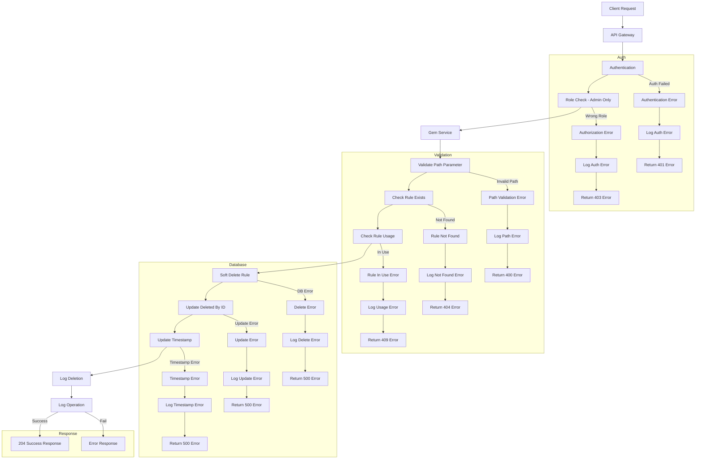
```mermaid
graph TD
    A[Client Request] --> B[API Gateway]
    B --> C[Authentication]
    C --> D[Role Check - Admin Only]
    D --> E[Gem Service]
    E --> F[Validate Path Parameter]
    F --> G[Check Rule Exists]
    G --> H[Check Rule Usage]
    H --> I[Soft Delete Rule]
    I --> J[Update Deleted By ID]
    J --> K[Update Timestamp]
    K --> L[Log Deletion]
    L --> M[Log Operation]
    M -->|Success| N[204 Success Response]
    M -->|Fail| O[Error Response]
    
    C -->|Auth Failed| C1[Authentication Error]
    C1 --> C2[Log Auth Error]
    C2 --> C3[Return 401 Error]
    
    D -->|Wrong Role| D1[Authorization Error]
    D1 --> D2[Log Auth Error]
    D2 --> D3[Return 403 Error]
    
    F -->|Invalid Path| F1[Path Validation Error]
    F1 --> F2[Log Path Error]
    F2 --> F3[Return 400 Error]
    
    G -->|Not Found| G1[Rule Not Found]
    G1 --> G2[Log Not Found Error]
    G2 --> G3[Return 404 Error]
    
    H -->|In Use| H1[Rule In Use Error]
    H1 --> H2[Log Usage Error]
    H2 --> H3[Return 409 Error]
    
    I -->|DB Error| I1[Delete Error]
    I1 --> I2[Log Delete Error]
    I2 --> I3[Return 500 Error]
    
    J -->|Update Error| J1[Update Error]
    J1 --> J2[Log Update Error]
    J2 --> J3[Return 500 Error]
    
    K -->|Timestamp Error| K1[Timestamp Error]
    K1 --> K2[Log Timestamp Error]
    K2 --> K3[Return 500 Error]
    
    subgraph "Auth"
        C
        C1
        C2
        C3
        D
        D1
        D2
        D3
    end
    
    subgraph "Validation"
        F
        F1
        F2
        F3
        G
        G1
        G2
        G3
        H
        H1
        H2
        H3
    end
    
    subgraph "Database"
        I
        I1
        I2
        I3
        J
        J1
        J2
        J3
        K
        K1
        K2
        K3
    end
    
    subgraph "Response"
        N
        O
    end
```

#### 14. App Show Gem Rules with Claim Status

Retrieves gem rules with user claim status for app.

**Endpoint:** `GET /gem/rule/read`

**Authorization:** Player only

**Query Parameters:**
- `page` (optional): Page number (default: 1)
- `limit` (optional): Items per page (default: 10)

**Success Response (200):**
```json
{
  "status": 1,
  "data": [
    {
      "id": 1,
      "title": "7-Day Login Streak",
      "description": "Reward for 7 consecutive days of login",
      "amount": 100,
      "has_claimed": false,
      "can_claim": true
    }
  ]
}
```

**DFD:**
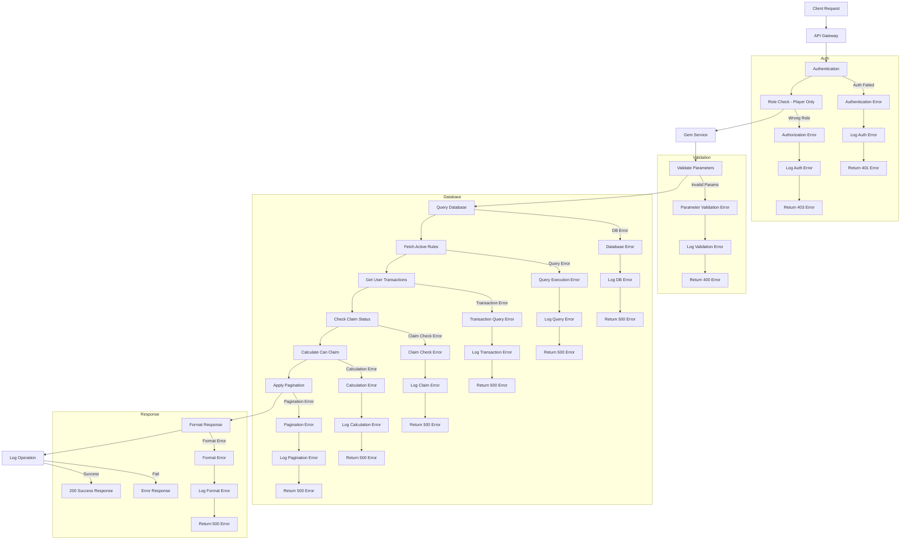
```mermaid
graph TD
    A[Client Request] --> B[API Gateway]
    B --> C[Authentication]
    C --> D[Role Check - Player Only]
    D --> E[Gem Service]
    E --> F[Validate Parameters]
    F --> G[Query Database]
    G --> H[Fetch Active Rules]
    H --> I[Get User Transactions]
    I --> J[Check Claim Status]
    J --> K[Calculate Can Claim]
    K --> L[Apply Pagination]
    L --> M[Format Response]
    M --> N[Log Operation]
    N -->|Success| O[200 Success Response]
    N -->|Fail| P[Error Response]
    
    C -->|Auth Failed| C1[Authentication Error]
    C1 --> C2[Log Auth Error]
    C2 --> C3[Return 401 Error]
    
    D -->|Wrong Role| D1[Authorization Error]
    D1 --> D2[Log Auth Error]
    D2 --> D3[Return 403 Error]
    
    F -->|Invalid Params| F1[Parameter Validation Error]
    F1 --> F2[Log Validation Error]
    F2 --> F3[Return 400 Error]
    
    G -->|DB Error| G1[Database Error]
    G1 --> G2[Log DB Error]
    G2 --> G3[Return 500 Error]
    
    H -->|Query Error| H1[Query Execution Error]
    H1 --> H2[Log Query Error]
    H2 --> H3[Return 500 Error]
    
    I -->|Transaction Error| I1[Transaction Query Error]
    I1 --> I2[Log Transaction Error]
    I2 --> I3[Return 500 Error]
    
    J -->|Claim Check Error| J1[Claim Check Error]
    J1 --> J2[Log Claim Error]
    J2 --> J3[Return 500 Error]
    
    K -->|Calculation Error| K1[Calculation Error]
    K1 --> K2[Log Calculation Error]
    K2 --> K3[Return 500 Error]
    
    L -->|Pagination Error| L1[Pagination Error]
    L1 --> L2[Log Pagination Error]
    L2 --> L3[Return 500 Error]
    
    M -->|Format Error| M1[Format Error]
    M1 --> M2[Log Format Error]
    M2 --> M3[Return 500 Error]
    
    subgraph "Auth"
        C
        C1
        C2
        C3
        D
        D1
        D2
        D3
    end
    
    subgraph "Validation"
        F
        F1
        F2
        F3
    end
    
    subgraph "Database"
        G
        G1
        G2
        G3
        H
        H1
        H2
        H3
        I
        I1
        I2
        I3
        J
        J1
        J2
        J3
        K
        K1
        K2
        K3
        L
        L1
        L2
        L3
    end
    
    subgraph "Response"
        M
        M1
        M2
        M3
        O
        P
    end
```

#### 15. Get Rule by Title

Retrieves a specific gem rule by title.

**Endpoint:** `GET /gem/rule/read-by-title`

**Authorization:** Player only

**Query Parameters:**
- `title`: Rule title

**Success Response (200):**
```json
{
  "status": 1,
  "data": [
    {
      "id": 1,
      "title": "7-Day Login Streak",
      "description": "Reward for 7 consecutive days of login",
      "amount": 100,
      "has_claimed": false,
      "can_claim": true
    }
  ]
}
```

**DFD:**
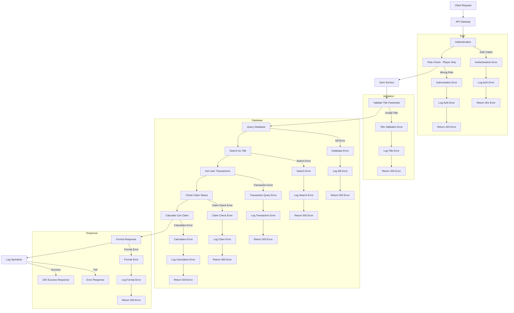
```mermaid
graph TD
    A[Client Request] --> B[API Gateway]
    B --> C[Authentication]
    C --> D[Role Check - Player Only]
    D --> E[Gem Service]
    E --> F[Validate Title Parameter]
    F --> G[Query Database]
    G --> H[Search by Title]
    H --> I[Get User Transactions]
    I --> J[Check Claim Status]
    J --> K[Calculate Can Claim]
    K --> L[Format Response]
    L --> M[Log Operation]
    M -->|Success| N[200 Success Response]
    M -->|Fail| O[Error Response]
    
    C -->|Auth Failed| C1[Authentication Error]
    C1 --> C2[Log Auth Error]
    C2 --> C3[Return 401 Error]
    
    D -->|Wrong Role| D1[Authorization Error]
    D1 --> D2[Log Auth Error]
    D2 --> D3[Return 403 Error]
    
    F -->|Invalid Title| F1[Title Validation Error]
    F1 --> F2[Log Title Error]
    F2 --> F3[Return 400 Error]
    
    G -->|DB Error| G1[Database Error]
    G1 --> G2[Log DB Error]
    G2 --> G3[Return 500 Error]
    
    H -->|Search Error| H1[Search Error]
    H1 --> H2[Log Search Error]
    H2 --> H3[Return 500 Error]
    
    I -->|Transaction Error| I1[Transaction Query Error]
    I1 --> I2[Log Transaction Error]
    I2 --> I3[Return 500 Error]
    
    J -->|Claim Check Error| J1[Claim Check Error]
    J1 --> J2[Log Claim Error]
    J2 --> J3[Return 500 Error]
    
    K -->|Calculation Error| K1[Calculation Error]
    K1 --> K2[Log Calculation Error]
    K2 --> K3[Return 500 Error]
    
    L -->|Format Error| L1[Format Error]
    L1 --> L2[Log Format Error]
    L2 --> L3[Return 500 Error]
    
    subgraph "Auth"
        C
        C1
        C2
        C3
        D
        D1
        D2
        D3
    end
    
    subgraph "Validation"
        F
        F1
        F2
        F3
    end
    
    subgraph "Database"
        G
        G1
        G2
        G3
        H
        H1
        H2
        H3
        I
        I1
        I2
        I3
        J
        J1
        J2
        J3
        K
        K1
        K2
        K3
    end
    
    subgraph "Response"
        L
        L1
        L2
        L3
        N
        O
    end
```

#### 16. Update Rule Status

Updates gem rule status for first time and multiple time flags.

**Endpoint:** `PUT /gem/rule/update-status/:id`

**Authorization:** Player only

**Path Parameters:**
- `id`: Gem rule ID

**Request Body:**
```json
{
  "first_time": 1,
  "multiple_time": 0
}
```

**Success Response (200):**
```json
{
  "status": 1,
  "data": {
    "id": 1,
    "first_time": 1,
    "multiple_time": 0,
    "updated_at": "2024-01-15T12:30:00Z"
  }
}
```

**DFD:**
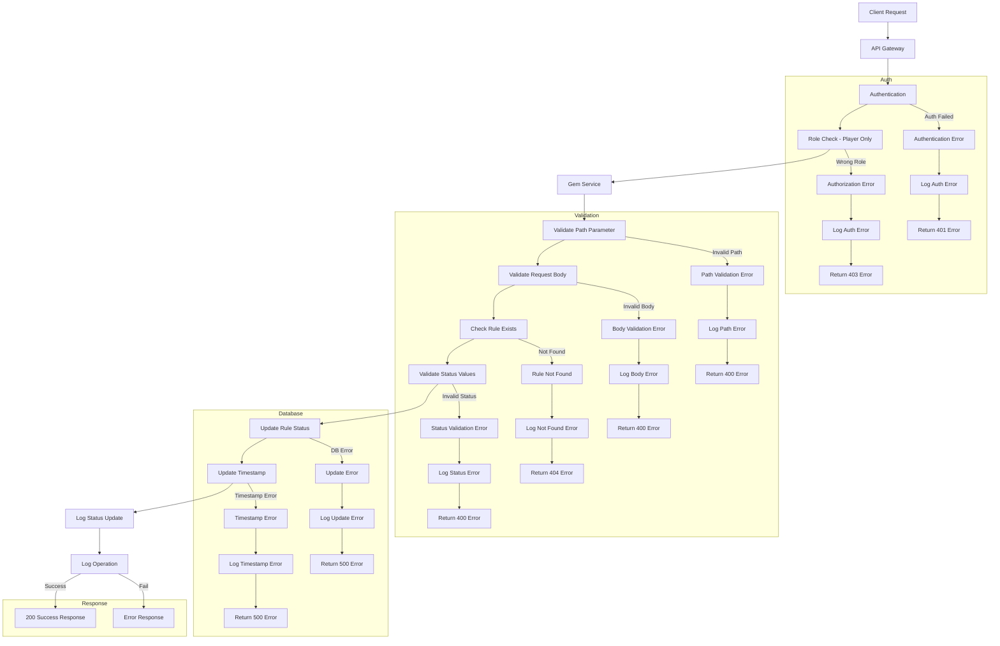
```mermaid
graph TD
    A[Client Request] --> B[API Gateway]
    B --> C[Authentication]
    C --> D[Role Check - Player Only]
    D --> E[Gem Service]
    E --> F[Validate Path Parameter]
    F --> G[Validate Request Body]
    G --> H[Check Rule Exists]
    H --> I[Validate Status Values]
    I --> J[Update Rule Status]
    J --> K[Update Timestamp]
    K --> L[Log Status Update]
    L --> M[Log Operation]
    M -->|Success| N[200 Success Response]
    M -->|Fail| O[Error Response]
    
    C -->|Auth Failed| C1[Authentication Error]
    C1 --> C2[Log Auth Error]
    C2 --> C3[Return 401 Error]
    
    D -->|Wrong Role| D1[Authorization Error]
    D1 --> D2[Log Auth Error]
    D2 --> D3[Return 403 Error]
    
    F -->|Invalid Path| F1[Path Validation Error]
    F1 --> F2[Log Path Error]
    F2 --> F3[Return 400 Error]
    
    G -->|Invalid Body| G1[Body Validation Error]
    G1 --> G2[Log Body Error]
    G2 --> G3[Return 400 Error]
    
    H -->|Not Found| H1[Rule Not Found]
    H1 --> H2[Log Not Found Error]
    H2 --> H3[Return 404 Error]
    
    I -->|Invalid Status| I1[Status Validation Error]
    I1 --> I2[Log Status Error]
    I2 --> I3[Return 400 Error]
    
    J -->|DB Error| J1[Update Error]
    J1 --> J2[Log Update Error]
    J2 --> J3[Return 500 Error]
    
    K -->|Timestamp Error| K1[Timestamp Error]
    K1 --> K2[Log Timestamp Error]
    K2 --> K3[Return 500 Error]
    
    subgraph "Auth"
        C
        C1
        C2
        C3
        D
        D1
        D2
        D3
    end
    
    subgraph "Validation"
        F
        F1
        F2
        F3
        G
        G1
        G2
        G3
        H
        H1
        H2
        H3
        I
        I1
        I2
        I3
    end
    
    subgraph "Database"
        J
        J1
        J2
        J3
        K
        K1
        K2
        K3
    end
    
    subgraph "Response"
        N
        O
    end
```

### Transaction Management

#### 17. Credit Gem Transaction

Creates a credit transaction for gems.

**Endpoint:** `POST /gem/transaction/credit`

**Authorization:** Player only

**Request Body:**
```json
{
  "amount": 100,
  "gem_rule_id": 1,
  "type": "login_streak"
}
```

**Success Response (201):**
```json
{
  "status": 1,
  "data": {
    "id": 1,
    "user_id": 123,
    "amount": 100,
    "gem_rule_id": 1,
    "type": "login_streak",
    "created_at": "2024-01-15T10:30:00Z"
  }
}
```

**DFD:**
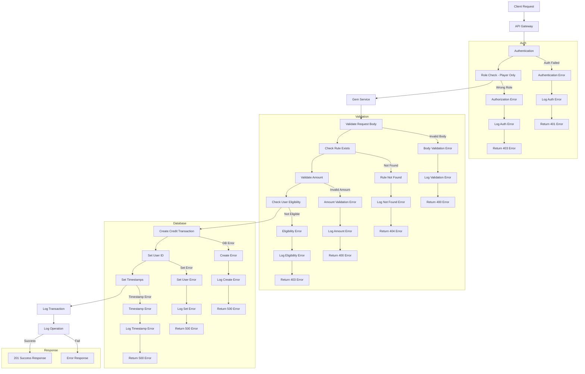
```mermaid
graph TD
    A[Client Request] --> B[API Gateway]
    B --> C[Authentication]
    C --> D[Role Check - Player Only]
    D --> E[Gem Service]
    E --> F[Validate Request Body]
    F --> G[Check Rule Exists]
    G --> H[Validate Amount]
    H --> I[Check User Eligibility]
    I --> J[Create Credit Transaction]
    J --> K[Set User ID]
    K --> L[Set Timestamps]
    L --> M[Log Transaction]
    M --> N[Log Operation]
    N -->|Success| O[201 Success Response]
    N -->|Fail| P[Error Response]
    
    C -->|Auth Failed| C1[Authentication Error]
    C1 --> C2[Log Auth Error]
    C2 --> C3[Return 401 Error]
    
    D -->|Wrong Role| D1[Authorization Error]
    D1 --> D2[Log Auth Error]
    D2 --> D3[Return 403 Error]
    
    F -->|Invalid Body| F1[Body Validation Error]
    F1 --> F2[Log Validation Error]
    F2 --> F3[Return 400 Error]
    
    G -->|Not Found| G1[Rule Not Found]
    G1 --> G2[Log Not Found Error]
    G2 --> G3[Return 404 Error]
    
    H -->|Invalid Amount| H1[Amount Validation Error]
    H1 --> H2[Log Amount Error]
    H2 --> H3[Return 400 Error]
    
    I -->|Not Eligible| I1[Eligibility Error]
    I1 --> I2[Log Eligibility Error]
    I2 --> I3[Return 403 Error]
    
    J -->|DB Error| J1[Create Error]
    J1 --> J2[Log Create Error]
    J2 --> J3[Return 500 Error]
    
    K -->|Set Error| K1[Set User Error]
    K1 --> K2[Log Set Error]
    K2 --> K3[Return 500 Error]
    
    L -->|Timestamp Error| L1[Timestamp Error]
    L1 --> L2[Log Timestamp Error]
    L2 --> L3[Return 500 Error]
    
    subgraph "Auth"
        C
        C1
        C2
        C3
        D
        D1
        D2
        D3
    end
    
    subgraph "Validation"
        F
        F1
        F2
        F3
        G
        G1
        G2
        G3
        H
        H1
        H2
        H3
        I
        I1
        I2
        I3
    end
    
    subgraph "Database"
        J
        J1
        J2
        J3
        K
        K1
        K2
        K3
        L
        L1
        L2
        L3
    end
    
    subgraph "Response"
        O
        P
    end
```

#### 18. Get Transaction History

Retrieves gem transaction history for a user.

**Endpoint:** `GET /gem/transaction/read`

**Authorization:** Player only

**Query Parameters:**
- `offset` (optional): Offset for pagination
- `limit` (optional): Items per page

**Success Response (200):**
```json
{
  "status": 1,
  "data": {
    "transactions": [
      {
        "id": 1,
        "amount": 100,
        "type": "login_streak",
        "created_at": "2024-01-15T10:30:00Z"
      }
    ],
    "total_amount": 500
  }
}
```

**DFD:**
```mermaid
graph TD
    A[Client Request] --> B[API Gateway]
    B --> C[Authentication]
    C --> D[Role Check - Player Only]
    D --> E[Gem Service]
    E --> F[Validate Parameters]
    F --> G[Query Database]
    G --> H[Fetch User Transactions]
    H --> I[Calculate Total Amount]
    I --> J[Apply Pagination]
    J --> K[Format Response]
    K --> L[Log Operation]
    L -->|Success| M[200 Success Response]
    L -->|Fail| N[Error Response]
    
    C -->|Auth Failed| C1[Authentication Error]
    C1 --> C2[Log Auth Error]
    C2 --> C3[Return 401 Error]
    
    D -->|Wrong Role| D1[Authorization Error]
    D1 --> D2[Log Auth Error]
    D2 --> D3[Return 403 Error]
    
    F -->|Invalid Params| F1[Parameter Validation Error]
    F1 --> F2[Log Validation Error]
    F2 --> F3[Return 400 Error]
    
    G -->|DB Error| G1[Database Error]
    G1 --> G2[Log DB Error]
    G2 --> G3[Return 500 Error]
    
    H -->|Query Error| H1[Query Execution Error]
    H1 --> H2[Log Query Error]
    H2 --> H3[Return 500 Error]
    
    I -->|Calculation Error| I1[Calculation Error]
    I1 --> I2[Log Calculation Error]
    I2 --> I3[Return 500 Error]
    
    J -->|Pagination Error| J1[Pagination Error]
    J1 --> J2[Log Pagination Error]
    J2 --> J3[Return 500 Error]
    
    K -->|Format Error| K1[Format Error]
    K1 --> K2[Log Format Error]
    K2 --> K3[Return 500 Error]
    
    subgraph "Auth"
        C
        C1
        C2
        C3
        D
        D1
        D2
        D3
    end
    
    subgraph "Validation"
        F
        F1
        F2
        F3
    end
    
    subgraph "Database"
        G
        G1
        G2
        G3
        H
        H1
        H2
        H3
        I
        I1
        I2
        I3
        J
        J1
        J2
        J3
    end
    
    subgraph "Response"
        K
        K1
        K2
        K3
        M
        N
    end
```

#### 19. Debit Gem Transaction

Creates a debit transaction for gems.

**Endpoint:** `POST /gem/transaction/debit`

**Authorization:** Player only

**Request Body:**
```json
{
  "amount": 50,
  "gem_coupon_id": 1,
  "type": "coupon_purchase"
}
```

**Success Response (201):**
```json
{
  "status": 1,
  "data": {
    "id": 2,
    "user_id": 123,
    "amount": -50,
    "gem_coupon_id": 1,
    "type": "coupon_purchase",
    "created_at": "2024-01-15T10:30:00Z"
  }
}
```

**DFD:**
```mermaid
graph TD
    A[Client Request] --> B[API Gateway]
    B --> C[Authentication]
    C --> D[Role Check - Player Only]
    D --> E[Gem Service]
    E --> F[Validate Request Body]
    F --> G[Check Coupon Exists]
    G --> H[Validate Amount]
    H --> I[Check User Balance]
    I --> J[Check Coupon Availability]
    J --> K[Create Debit Transaction]
    K --> L[Set User ID]
    L --> M[Set Negative Amount]
    M --> N[Set Timestamps]
    N --> O[Log Transaction]
    O --> P[Log Operation]
    P -->|Success| Q[201 Success Response]
    P -->|Fail| R[Error Response]
    
    C -->|Auth Failed| C1[Authentication Error]
    C1 --> C2[Log Auth Error]
    C2 --> C3[Return 401 Error]
    
    D -->|Wrong Role| D1[Authorization Error]
    D1 --> D2[Log Auth Error]
    D2 --> D3[Return 403 Error]
    
    F -->|Invalid Body| F1[Body Validation Error]
    F1 --> F2[Log Validation Error]
    F2 --> F3[Return 400 Error]
    
    G -->|Not Found| G1[Coupon Not Found]
    G1 --> G2[Log Not Found Error]
    G2 --> G3[Return 404 Error]
    
    H -->|Invalid Amount| H1[Amount Validation Error]
    H1 --> H2[Log Amount Error]
    H2 --> H3[Return 400 Error]
    
    I -->|Insufficient Balance| I1[Balance Error]
    I1 --> I2[Log Balance Error]
    I2 --> I3[Return 400 Error]
    
    J -->|Not Available| J1[Availability Error]
    J1 --> J2[Log Availability Error]
    J2 --> J3[Return 400 Error]
    
    K -->|DB Error| K1[Create Error]
    K1 --> K2[Log Create Error]
    K2 --> K3[Return 500 Error]
    
    L -->|Set Error| L1[Set User Error]
    L1 --> L2[Log Set Error]
    L2 --> L3[Return 500 Error]
    
    M -->|Amount Error| M1[Amount Set Error]
    M1 --> M2[Log Amount Error]
    M2 --> M3[Return 500 Error]
    
    N -->|Timestamp Error| N1[Timestamp Error]
    N1 --> N2[Log Timestamp Error]
    N2 --> N3[Return 500 Error]
    
    subgraph "Auth"
        C
        C1
        C2
        C3
        D
        D1
        D2
        D3
    end
    
    subgraph "Validation"
        F
        F1
        F2
        F3
        G
        G1
        G2
        G3
        H
        H1
        H2
        H3
        I
        I1
        I2
        I3
        J
        J1
        J2
        J3
    end
    
    subgraph "Database"
        K
        K1
        K2
        K3
        L
        L1
        L2
        L3
        M
        M1
        M2
        M3
        N
        N1
        N2
        N3
    end
    
    subgraph "Response"
        Q
        R
    end
```

#### 20. Pubscale Callback

Handles Pubscale callback for gem rewards.

**Endpoint:** `GET /gem/transaction/pubscale-callback`

**Authorization:** None required

**Query Parameters:**
- `signature`: Callback signature
- `token`: User token
- `user_id`: User ID
- `value`: Reward value
- `offer_id`: Offer ID
- `offer_name`: Offer name

**Success Response (200):**
```json
{
  "status": 1,
  "data": {
    "message": "Pubscale callback processed successfully",
    "gems_added": 100
  }
}
```

**DFD:**
```mermaid
graph TD
    A[Pubscale Callback] --> B[API Gateway]
    B --> C[Gem Service]
    C --> D[Validate Parameters]
    D --> E[Verify Signature]
    E --> F[Decode User Token]
    F --> G[Validate User ID]
    G --> H[Check Duplicate Callback]
    H --> I[Calculate Gem Amount]
    I --> J[Create Credit Transaction]
    J --> K[Set External Provider]
    K --> L[Set Offer Details]
    L --> M[Log Callback]
    M --> N[Log Operation]
    N -->|Success| O[200 Success Response]
    N -->|Fail| P[Error Response]
    
    D -->|Invalid Params| D1[Parameter Validation Error]
    D1 --> D2[Log Validation Error]
    D2 --> D3[Return 400 Error]
    
    E -->|Invalid Signature| E1[Signature Error]
    E1 --> E2[Log Signature Error]
    E2 --> E3[Return 401 Error]
    
    F -->|Token Error| F1[Token Decode Error]
    F1 --> F2[Log Token Error]
    F2 --> F3[Return 400 Error]
    
    G -->|Invalid User| G1[User Validation Error]
    G1 --> G2[Log User Error]
    G2 --> G3[Return 400 Error]
    
    H -->|Duplicate| H1[Duplicate Callback]
    H1 --> H2[Log Duplicate]
    H2 --> H3[Return 200 Success]
    
    I -->|Calculation Error| I1[Calculation Error]
    I1 --> I2[Log Calculation Error]
    I2 --> I3[Return 500 Error]
    
    J -->|DB Error| J1[Create Error]
    J1 --> J2[Log Create Error]
    J2 --> J3[Return 500 Error]
    
    K -->|Set Error| K1[Set Provider Error]
    K1 --> K2[Log Provider Error]
    K2 --> K3[Return 500 Error]
    
    L -->|Set Error| L1[Set Offer Error]
    L1 --> L2[Log Offer Error]
    L2 --> L3[Return 500 Error]
    
    subgraph "External API"
        A
    end
    
    subgraph "Validation"
        D
        D1
        D2
        D3
        E
        E1
        E2
        E3
        F
        F1
        F2
        F3
        G
        G1
        G2
        G3
        H
        H1
        H2
        H3
    end
    
    subgraph "Database"
        I
        I1
        I2
        I3
        J
        J1
        J2
        J3
        K
        K1
        K2
        K3
        L
        L1
        L2
        L3
    end
    
    subgraph "Response"
        O
        P
    end
```

#### 21. Torox Callback

Handles Torox callback for gem rewards.

**Endpoint:** `GET /gem/transaction/torox-callback`

**Authorization:** None required

**Query Parameters:**
- `oid`: Order ID
- `amount`: Reward amount
- `user_id`: User ID

**Success Response (200):**
```json
{
  "status": 1,
  "data": {
    "message": "Torox callback processed successfully",
    "gems_added": 75
  }
}
```

**DFD:**
```mermaid
graph TD
    A[Torox Callback] --> B[API Gateway]
    B --> C[Gem Service]
    C --> D[Validate Parameters]
    D --> E[Validate Order ID]
    E --> F[Validate User ID]
    F --> G[Check Duplicate Callback]
    G --> H[Calculate Gem Amount]
    H --> I[Create Credit Transaction]
    I --> J[Set External Provider]
    J --> K[Set Order Details]
    K --> L[Log Callback]
    L --> M[Log Operation]
    M -->|Success| N[200 Success Response]
    M -->|Fail| O[Error Response]
    
    D -->|Invalid Params| D1[Parameter Validation Error]
    D1 --> D2[Log Validation Error]
    D2 --> D3[Return 400 Error]
    
    E -->|Invalid Order| E1[Order Validation Error]
    E1 --> E2[Log Order Error]
    E2 --> E3[Return 400 Error]
    
    F -->|Invalid User| F1[User Validation Error]
    F1 --> F2[Log User Error]
    F2 --> F3[Return 400 Error]
    
    G -->|Duplicate| G1[Duplicate Callback]
    G1 --> G2[Log Duplicate]
    G2 --> G3[Return 200 Success]
    
    H -->|Calculation Error| H1[Calculation Error]
    H1 --> H2[Log Calculation Error]
    H2 --> H3[Return 500 Error]
    
    I -->|DB Error| I1[Create Error]
    I1 --> I2[Log Create Error]
    I2 --> I3[Return 500 Error]
    
    J -->|Set Error| J1[Set Provider Error]
    J1 --> J2[Log Provider Error]
    J2 --> J3[Return 500 Error]
    
    K -->|Set Error| K1[Set Order Error]
    K1 --> K2[Log Order Error]
    K2 --> K3[Return 500 Error]
    
    subgraph "External API"
        A
    end
    
    subgraph "Validation"
        D
        D1
        D2
        D3
        E
        E1
        E2
        E3
        F
        F1
        F2
        F3
        G
        G1
        G2
        G3
    end
    
    subgraph "Database"
        H
        H1
        H2
        H3
        I
        I1
        I2
        I3
        J
        J1
        J2
        J3
        K
        K1
        K2
        K3
    end
    
    subgraph "Response"
        N
        O
    end
```

---

## Rate Limiting

| Endpoint                | Rate Limit | Window      |
|-------------------------|------------|-------------|
| All Gem APIs            | 100        | 15 minutes  |
| External API calls      | 50         | 1 minute    |

---

## Security Considerations

### Authentication
- JWT token validation on protected endpoints
- Token expiration handling
- Secure token transmission

### Authorization
- Role-based access control for admin and player users
- Admin-specific data access for management operations
- Player-specific access for transactions and rule viewing

### Input Validation
- Request body validation using Joi schemas
- Query parameter validation
- SQL injection prevention through parameterized queries
- Input sanitization

### External API Security
- Secure callback handling for Pubscale and Torox
- Signature verification for external callbacks
- Rate limiting for external API calls

### Data Protection
- User-specific transaction access
- Admin-only access to rule and coupon management
- Secure handling of external API credentials

---

## Business Rules

### Gem Rule Management
1. Only admins can create, update, and delete gem rules
2. Rules can be configured for first-time or multiple-time rewards
3. Each rule has a specific gem amount
4. Rules can be associated with specific activities or achievements

### Coupon Management
1. Coupons are synced from external Coupomated API
2. Each coupon has a unique external offer ID
3. Coupons can be enabled/disabled by admins
4. Coupons have expiration dates and merchant associations

### Transaction Processing
1. Credit transactions add gems to user balance
2. Debit transactions subtract gems from user balance
3. Transactions are linked to specific rules or coupons
4. External callbacks automatically credit gems to users

### Data Integrity
1. Foreign key relationships are maintained
2. Unique constraints prevent duplicate external IDs
3. Audit trails track all transactions
4. Soft delete support for data preservation

### Validation Rules
1. Gem amounts must be positive numbers
2. Rule titles must be unique
3. Coupon offer IDs must be unique
4. Transaction types must be valid

---

## Monitoring & Logging

### Metrics to Monitor
- API response times
- Error rates by endpoint
- Database query performance
- External API call success rates
- Transaction processing rates
- Coupon sync performance

### Logging
- Request/response logging
- Error logging with stack traces
- Database operation logging
- External API call logging
- Transaction lifecycle event logging

### Alerts
- High error rates (>5%)
- Slow response times (>2s)
- Database connection issues
- Failed external API calls
- Transaction processing failures

---

## Integration Examples

### Frontend Integration

```javascript
// Create gem rule
const createGemRule = async (ruleData) => {
  const response = await fetch('/api/v1/gem/rule/create', {
    method: 'POST',
    headers: {
      'Content-Type': 'application/json',
      'Authorization': `Bearer ${token}`
    },
    body: JSON.stringify(ruleData)
  });
  return response.json();
};

// Get gem rules for app
const getGemRules = async (page = 1, limit = 10) => {
  const params = new URLSearchParams({
    page: page.toString(),
    limit: limit.toString()
  });
  const response = await fetch(`/api/v1/gem/rule/read?${params}`, {
    headers: {
      'Authorization': `Bearer ${token}`
    }
  });
  return response.json();
};

// Credit gem transaction
const creditGems = async (amount, gemRuleId, type) => {
  const response = await fetch('/api/v1/gem/transaction/credit', {
    method: 'POST',
    headers: {
      'Content-Type': 'application/json',
      'Authorization': `Bearer ${token}`
    },
    body: JSON.stringify({
      amount: amount,
      gem_rule_id: gemRuleId,
      type: type
    })
  });
  return response.json();
};

// Get transaction history
const getTransactionHistory = async (offset = 0, limit = 10) => {
  const params = new URLSearchParams({
    offset: offset.toString(),
    limit: limit.toString()
  });
  const response = await fetch(`/api/v1/gem/transaction/read?${params}`, {
    headers: {
      'Authorization': `Bearer ${token}`
    }
  });
  return response.json();
};

// Get coupons for app
const getCoupons = async (page = 1, limit = 10) => {
  const params = new URLSearchParams({
    page: page.toString(),
    limit: limit.toString()
  });
  const response = await fetch(`/api/v1/gem/coupon/app-read?${params}`, {
    headers: {
      'Authorization': `Bearer ${token}`
    }
  });
  return response.json();
};
```

### Error Handling

```javascript
const handleGemOperation = async (operation) => {
  try {
    const result = await operation();
    if (result.status === 1) {
      console.log('Operation successful:', result.data);
      return result.data;
    } else {
      console.error('Operation failed:', result.message);
      throw new Error(result.message);
    }
  } catch (error) {
    console.error('Gem operation failed:', error.message);
    // Handle different error types
    if (error.message.includes('Unauthorized')) {
      // Handle authentication error
    } else if (error.message.includes('Forbidden')) {
      // Handle authorization error
    } else if (error.message.includes('Validation failed')) {
      // Handle validation error
    } else if (error.message.includes('External API error')) {
      // Handle external API error
    } else {
      // Handle general error
    }
  }
};
```

---

## Use Cases

### 1. Gem Rule Management
- Admins create rules for different achievements
- Configure gem rewards for login streaks, game wins, etc.
- Set first-time vs multiple-time reward flags
- Manage rule lifecycle (create, update, delete)

### 2. Coupon Integration
- Sync coupons from external Coupomated API
- Display coupons to players with gem costs
- Enable/disable coupons based on availability
- Track coupon usage and performance

### 3. Transaction Processing
- Credit gems for achievements and activities
- Debit gems for coupon purchases
- Process external callbacks for rewards
- Maintain transaction history and balance

### 4. External API Integration
- Handle Pubscale callbacks for ad rewards
- Process Torox callbacks for offers
- Sync merchant and category data
- Maintain data consistency across systems

---

## Performance Considerations

### Database Optimization
- Indexes on frequently queried fields
- Efficient pagination with offset-based queries
- Optimized JOIN operations for complex queries
- Unique constraint enforcement

### External API Optimization
- Rate limiting for external API calls
- Caching for merchant and category data
- Efficient coupon sync processes
- Callback processing optimization

### Query Optimization
- Use parameterized queries for security
- Limit result sets with pagination
- Efficient filtering and sorting
- Optimized transaction queries

---

## Testing Scenarios

### Unit Tests
- Gem rule creation and validation
- Transaction processing logic
- Coupon management operations
- External API integration

### Integration Tests
- End-to-end gem system workflow
- Authentication and authorization
- Database consistency
- External API integration

### Performance Tests
- Load testing with multiple concurrent users
- Database query performance
- External API call performance
- Transaction processing performance

### Security Tests
- SQL injection prevention
- JWT token validation
- Role-based access control
- External callback security
- Input sanitization

--- 