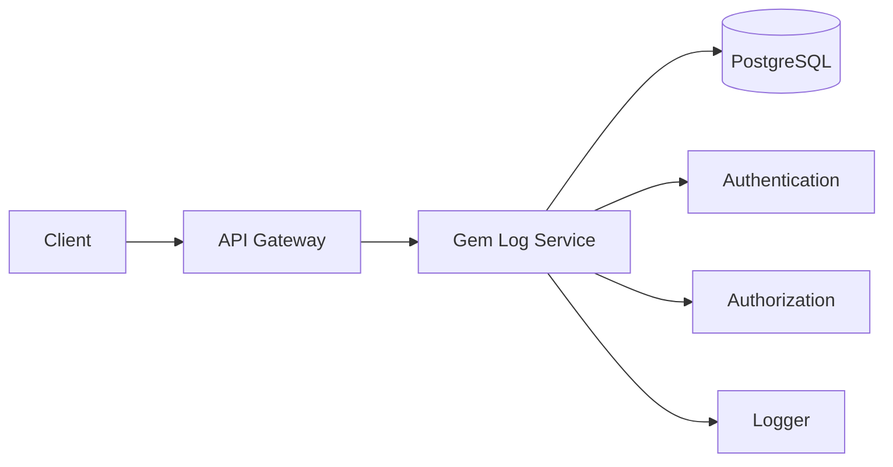
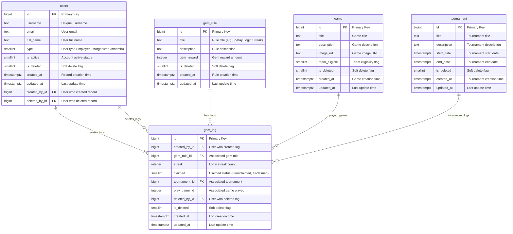
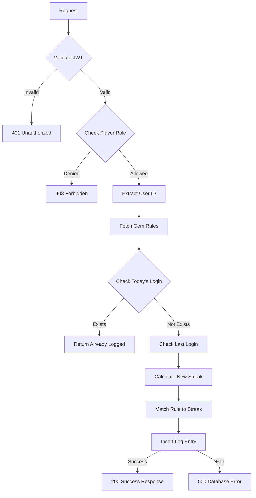
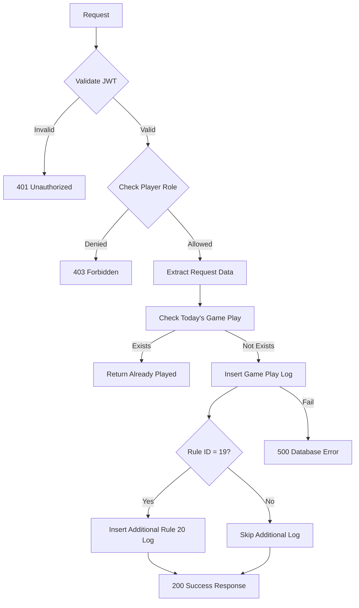

## Overview

The **Gem Log Service** provides comprehensive gem logging functionality for the Thryl platform, enabling players to track login streaks, game play activities, and gem rule achievements. The service supports 7-day and 15-day login streak tracking, game play logging, and automatic streak calculation with advanced features like duplicate prevention, streak management, and rule-based logging.

### Tech Stack
- **Backend**: Node.js, Express.js
- **Database**: PostgreSQL
- **Authentication**: JWT
- **Authorization**: Role-based access control
- **Logging**: Custom logger

---

## System Architecture



---

## Database Schema



## Table Relationship Graph

```mermaid
graph TD
    A[users Table] -->|creates| B[gem_log Table]
    A -->|deletes| B
    C[gem_rule Table] -->|has| B
    D[game Table] -->|played| B
    E[tournament Table] -->|has| B
    
    subgraph "users Table"
        A1[users.id PK]
        A2[users.created_by_id FK]
        A3[users.type]
        A4[users.is_active]
    end
    
    subgraph "gem_log Table"
        B1[gem_log.id PK]
        B2[gem_log.created_by_id FK]
        B3[gem_log.gem_rule_id FK]
        B4[gem_log.streak]
        B5[gem_log.claimed]
        B6[gem_log.tournament_id FK]
        B7[gem_log.play_game_id]
        B8[gem_log.deleted_by_id FK]
    end
    
    subgraph "gem_rule Table"
        C1[gem_rule.id PK]
        C2[gem_rule.title]
        C3[gem_rule.gem_reward]
    end
    
    subgraph "game Table"
        D1[game.id PK]
        D2[game.title]
        D3[game.team_eligible]
    end
    
    subgraph "tournament Table"
        E1[tournament.id PK]
        E2[tournament.title]
        E3[tournament.start_date]
    end
    
    A1 -.->|references| B2
    A1 -.->|references| B8
    C1 -.->|references| B3
    D1 -.->|references| B7
    E1 -.->|references| B6
```



### Relationship Details

| Relationship | Type | Description | Foreign Key |
|--------------|------|-------------|-------------|
| users → gem_log (creation) | One-to-Many | User can create multiple gem logs | `gem_log.created_by_id` |
| users → gem_log (deletion) | One-to-Many | User can delete multiple logs | `gem_log.deleted_by_id` |
| gem_rule → gem_log | One-to-Many | Rule can have multiple logs | `gem_log.gem_rule_id` |
| game → gem_log | One-to-Many | Game can have multiple play logs | `gem_log.play_game_id` |
| tournament → gem_log | One-to-Many | Tournament can have multiple logs | `gem_log.tournament_id` |

### Index Information

| Table | Index Type | Indexed Fields | Purpose |
|-------|------------|----------------|---------|
| gem_log | btree | `created_by_id` | User-based log queries |
| gem_log | btree | `gem_rule_id` | Rule-based log queries |
| gem_log | btree | `streak` | Streak-based filtering |
| gem_log | btree | `claimed` | Claim status filtering |
| gem_log | btree | `tournament_id` | Tournament-based queries |
| gem_log | btree | `play_game_id` | Game play queries |
| gem_log | brin | `created_at` | Fast time-based queries |

---

## Base URLs

## Base URLs

| Environment   | URL                                 |
|---------------|-------------------------------------|
| Production    | `https://thryl-prod.com   ||    https://thryl-production.zapto.org`      |
| Staging       | `https://thryl-staging.zapto.org` |
| Development   | `http://localhost:3000  || http://localhost:3001`      |

---

## Authentication

All Gem Log Service APIs require JWT authentication. Include the token in the Authorization header:

```http
Authorization: Bearer <your-jwt-token>
```

---

## Authorization

| Role         | Permissions                                      |
|--------------|--------------------------------------------------|
| **Player**   | Create login streak logs, create game play logs |

---

## API Reference

### Complete API List

| # | Endpoint                    | Method | Purpose                                 | Auth Required | Role Required         |
|---|-----------------------------|--------|-----------------------------------------|---------------|----------------------|
| 1 | `/create7dayAnd15DayLogs`   | GET    | Create login streak log                 | Yes           | player               |
| 2 | `/game-played`              | POST   | Create game play log                    | Yes           | player               |

---

## API Endpoints

### 1. Create Login Streak Log

Creates a log entry for 7-day and 15-day login streaks with automatic streak calculation.

**Endpoint:** `GET /gemLog/create7dayAnd15DayLogs`

**Authorization:** Player only

**Success Response (200):**
```json
{
  "status": 1,
  "data": {
    "message": "Logged day 5 of login streak",
    "log": {
      "id": 1,
      "created_by_id": 123,
      "gem_rule_id": 1,
      "streak": 5,
      "claimed": 0,
      "created_at": "2024-01-15T10:30:00Z"
    },
    "streak": 5
  }
}
```

**Already Logged Response (200):**
```json
{
  "status": 1,
  "data": {
    "message": "Already logged in today",
    "streak": 5
  }
}
```

**No Rule Response (200):**
```json
{
  "status": 1,
  "data": {
    "message": "No applicable login streak rule found."
  }
}
```

**Error Response (500):**
```json
{
  "status": 0,
  "message": "Internal server error"
}
```

**DFD:**


#### Business Logic

1. **Rule Fetching**: Retrieves 7-day and 15-day login streak rules
2. **Duplicate Prevention**: Checks if user already logged in today
3. **Streak Calculation**: Calculates streak based on last login date
4. **Rule Matching**: Associates appropriate rule based on streak count
5. **Streak Reset**: Resets streak to 1 if gap > 1 day or streak > 15
6. **Player Only**: Restricted to player users

#### Database Operations

```sql
-- Fetch gem rules
SELECT title, id FROM gem_rule WHERE is_deleted IS DISTINCT FROM 1;

-- Check today's login
SELECT created_at, streak FROM gem_log 
WHERE created_by_id = $1 AND DATE(created_at) = CURRENT_DATE 
AND gem_rule_id = ANY($2) ORDER BY created_at DESC LIMIT 1;

-- Check last login
SELECT created_at, streak FROM gem_log 
WHERE created_by_id = $1 AND DATE(created_at) < CURRENT_DATE 
ORDER BY created_at DESC LIMIT 1;

-- Insert new log
INSERT INTO gem_log (created_by_id, streak, gem_rule_id) 
VALUES ($1, $2, $3) RETURNING *;
```

---

### 2. Create Game Play Log

Creates a log entry for game play activities with duplicate prevention.

**Endpoint:** `POST /gemLog/game-played`

**Authorization:** Player only

**Request Body:**
```json
{
  "ruleId": 19,
  "play_game_id": 1
}
```

**Success Response (200):**
```json
{
  "status": 1,
  "data": {
    "log": {
      "id": 1,
      "created_by_id": 123,
      "gem_rule_id": 19,
      "claimed": 0,
      "play_game_id": 1,
      "created_at": "2024-01-15T10:30:00Z"
    },
    "claimed": 0
  }
}
```

**Already Played Response (200):**
```json
{
  "status": 1,
  "data": {
    "message": "Already played a game today for this rule",
    "log": {
      "id": 1,
      "created_by_id": 123,
      "gem_rule_id": 19,
      "claimed": 0,
      "play_game_id": 1,
      "created_at": "2024-01-15T10:30:00Z"
    }
  }
}
```

**Error Response (500):**
```json
{
  "status": 0,
  "message": "Internal server error"
}
```

**DFD:**


#### Business Logic

1. **Duplicate Prevention**: Checks if user already played today for this rule
2. **Game Play Logging**: Creates log entry for game play activity
3. **Special Rule Handling**: Automatically creates rule 20 log when rule 19 is triggered
4. **Claim Status**: Sets claimed to 0 by default
5. **Player Only**: Restricted to player users

#### Database Operations

```sql
-- Check today's game play
SELECT * FROM gem_log 
WHERE created_by_id = $1 AND gem_rule_id = $2 
AND play_game_id = $3 AND DATE(created_at) = CURRENT_DATE;

-- Insert game play log
INSERT INTO gem_log (created_by_id, gem_rule_id, claimed, play_game_id) 
VALUES ($1, $2, $3, $4) RETURNING *;

-- Insert additional rule 20 log (when rule 19 is triggered)
INSERT INTO gem_log (created_by_id, gem_rule_id, claimed, play_game_id) 
VALUES ($1, 20, 0, $2) RETURNING *;
```

---

## Rate Limiting

| Endpoint                | Rate Limit | Window      |
|-------------------------|------------|-------------|
| All Gem Log APIs        | 100        | 15 minutes  |

---

## Security Considerations

### Authentication
- JWT token validation on all endpoints
- Token expiration handling
- Secure token transmission

### Authorization
- Role-based access control for player users only
- Player-specific data access
- Log ownership validation

### Input Validation
- Request body validation
- SQL injection prevention through parameterized queries
- Input sanitization

### Data Protection
- Player-only access to gem logs
- User-specific log creation
- Input sanitization

---

## Business Rules

### Login Streak Management
1. Users can only log one login per day per rule
2. Streak calculation based on consecutive days
3. Streak resets to 1 if gap > 1 day
4. Maximum streak capped at 15 days
5. Automatic rule association based on streak count

### Game Play Logging
1. Users can only log one game play per day per rule
2. Game play logs are unclaimed by default
3. Special handling for rule 19 (triggers rule 20)
4. Play game ID tracking for specific games

### Data Integrity
1. Foreign key relationships are maintained
2. Duplicate prevention for daily activities
3. Audit trails track log creation
4. Soft delete support

### Validation Rules
1. User ID must reference an existing user
2. Rule ID must reference an existing gem rule
3. Game ID must reference an existing game (if provided)
4. Tournament ID must reference an existing tournament (if provided)

---

## Monitoring & Logging

### Metrics to Monitor
- API response times
- Error rates by endpoint
- Database query performance
- Login streak creation rates
- Game play log creation rates
- Player activity patterns

### Logging
- Request/response logging
- Error logging with stack traces
- Database operation logging
- Gem log lifecycle event logging

### Alerts
- High error rates (>5%)
- Slow response times (>2s)
- Database connection issues
- Failed gem log operations

---

## Integration Examples

### Frontend Integration

```javascript
// Create login streak log
const createLoginStreakLog = async () => {
  const response = await fetch('/api/v1/gemLog/create7dayAnd15DayLogs', {
    method: 'GET',
    headers: {
      'Authorization': `Bearer ${token}`
    }
  });
  return response.json();
};

// Create game play log
const createGamePlayLog = async (ruleId, playGameId = null) => {
  const response = await fetch('/api/v1/gemLog/game-played', {
    method: 'POST',
    headers: {
      'Content-Type': 'application/json',
      'Authorization': `Bearer ${token}`
    },
    body: JSON.stringify({
      ruleId: ruleId,
      play_game_id: playGameId
    })
  });
  return response.json();
};
```

### Error Handling

```javascript
const handleGemLogOperation = async (operation) => {
  try {
    const result = await operation();
    if (result.status === 1) {
      console.log('Operation successful:', result.data);
      return result.data;
    } else {
      console.error('Operation failed:', result.message);
      throw new Error(result.message);
    }
  } catch (error) {
    console.error('Gem log operation failed:', error.message);
    // Handle different error types
    if (error.message.includes('Already logged in today')) {
      // Handle duplicate login
    } else if (error.message.includes('Already played a game today')) {
      // Handle duplicate game play
    } else if (error.message.includes('No applicable login streak rule')) {
      // Handle missing rules
    } else if (error.message.includes('Unauthorized')) {
      // Handle authentication error
    } else if (error.message.includes('Forbidden')) {
      // Handle authorization error
    } else {
      // Handle general error
    }
  }
};
```

---

## Use Cases

### 1. Login Streak Tracking
- Players log daily logins to maintain streaks
- Automatic streak calculation and rule association
- 7-day and 15-day milestone tracking
- Streak reset on missed days

### 2. Game Play Achievement
- Players log game play activities for rewards
- Rule-based achievement tracking
- Duplicate prevention for daily limits
- Special rule combinations (19 + 20)

### 3. Gem Reward System
- Track unclaimed vs claimed rewards
- Rule-based reward distribution
- Tournament and game-specific rewards
- Streak-based bonus rewards

---

## Performance Considerations

### Database Optimization
- Indexes on `created_by_id`, `gem_rule_id`, and `created_at` for fast lookups
- Efficient date-based queries with DATE() function
- Optimized streak calculation queries
- Duplicate prevention with efficient checks

### Query Optimization
- Use parameterized queries for security
- Efficient date range filtering
- Optimized JOIN operations for rule matching
- Indexed foreign key relationships

---

## Testing Scenarios

### Unit Tests
- Login streak calculation logic
- Game play log creation and validation
- Duplicate prevention mechanisms
- Rule matching algorithms

### Integration Tests
- End-to-end gem log lifecycle
- Authentication and authorization
- Database consistency
- API response validation

### Performance Tests
- Load testing with multiple concurrent logins
- Database query performance
- Streak calculation performance
- Duplicate check performance

### Security Tests
- SQL injection prevention
- JWT token validation
- Role-based access control
- Input sanitization
- Authorization validation

--- 