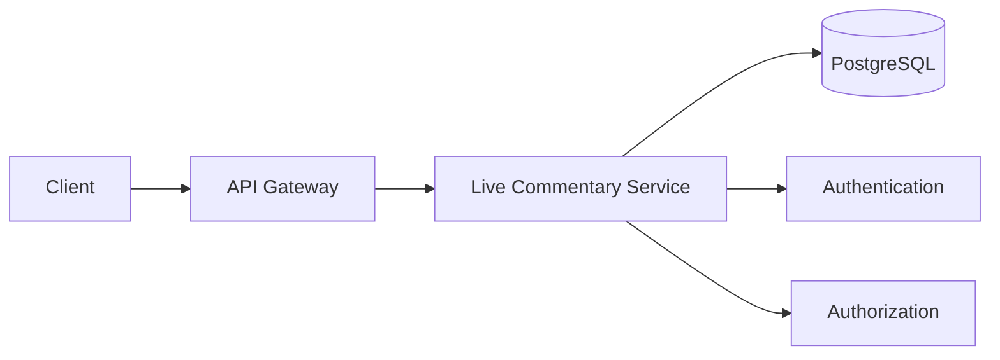
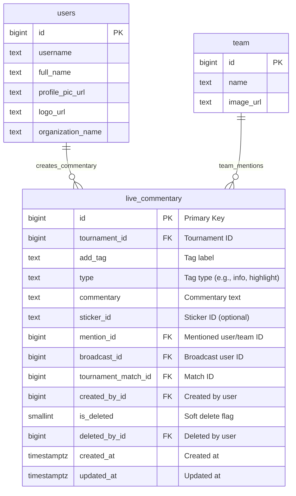
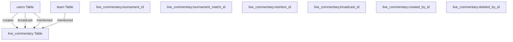
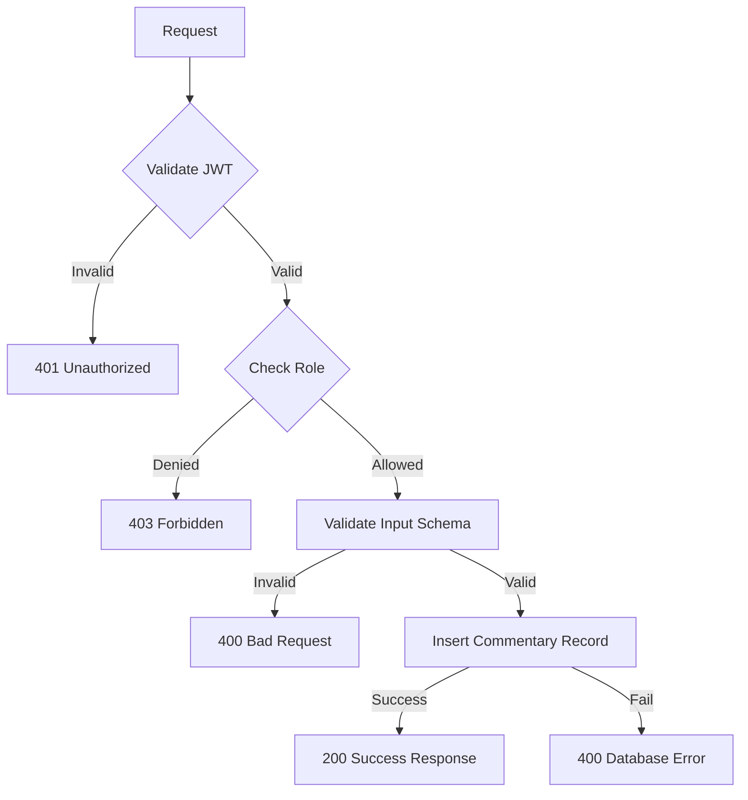
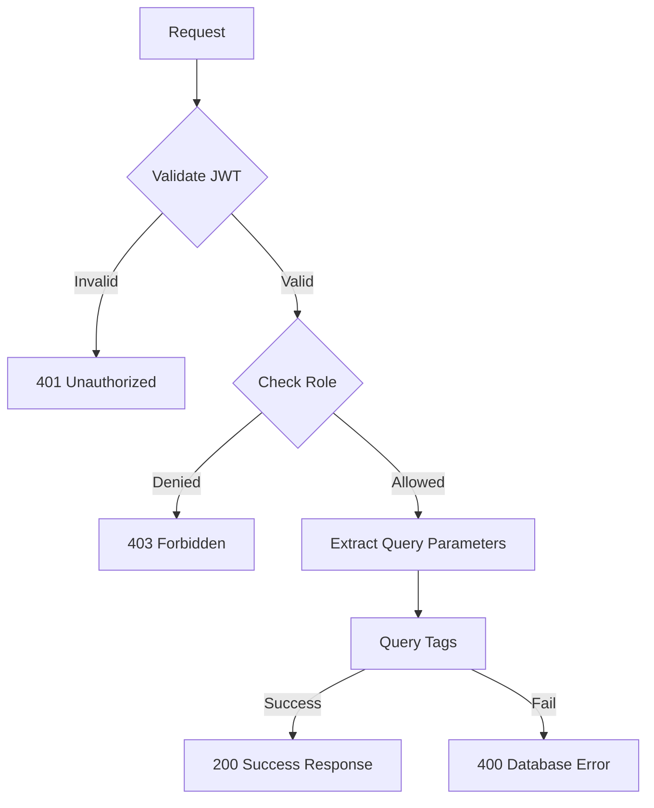
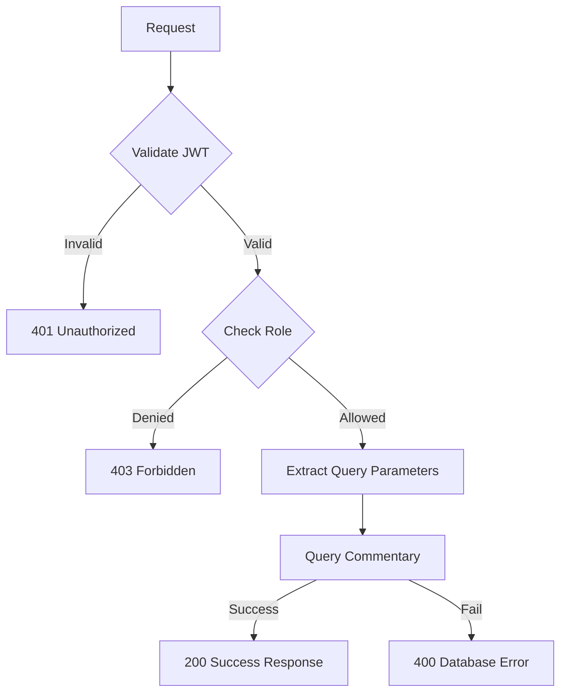
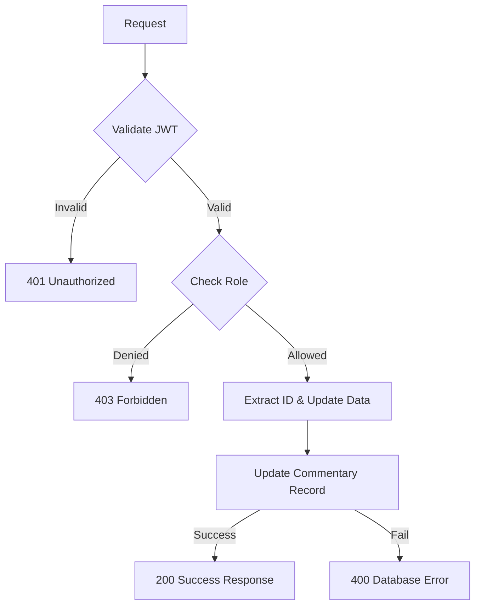
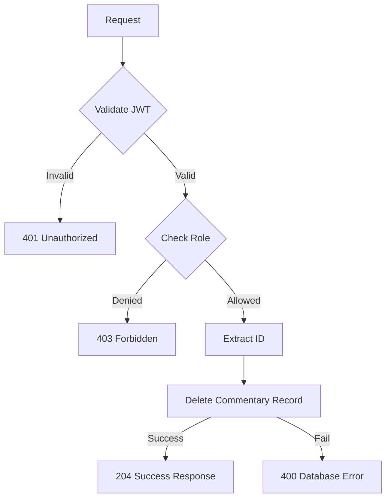
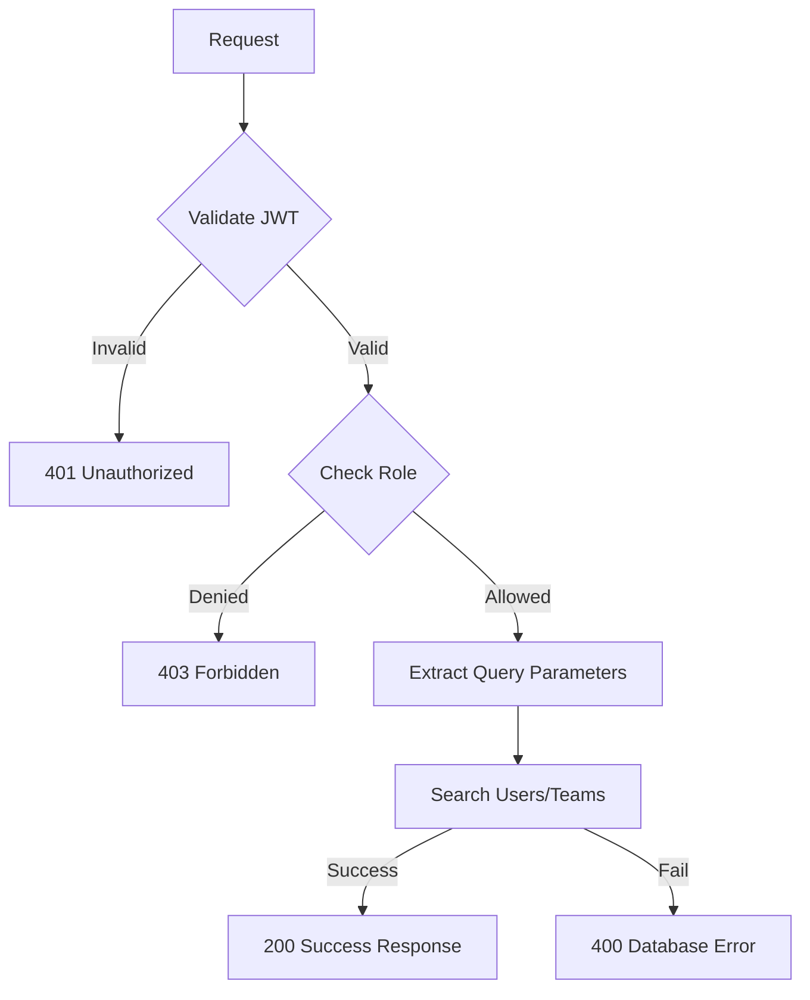

## Overview

The **Live Commentary Service** enables real-time commentary, tagging, and mentions for tournaments and matches on the Thryl platform. Organizers can create, update, and manage live commentary, while users and teams can be mentioned and tagged. The service supports advanced search, tagging, and broadcast features for a rich, interactive experience during live events.

### Tech Stack
- **Backend**: Node.js, Express.js
- **Database**: PostgreSQL
- **Authentication**: JWT
- **Validation**: Joi
- **Authorization**: Role-based access control

---

## System Architecture



---

## Database Schema



## Table Relationship Graph



### Relationship Details

| Relationship | Type | Description | Foreign Key |
|--------------|------|-------------|-------------|
| users → live_commentary (creation) | One-to-Many | User can create multiple commentary entries | `live_commentary.created_by_id` |
| users → live_commentary (broadcast) | One-to-Many | User can broadcast commentary | `live_commentary.broadcast_id` |
| users → live_commentary (mentioned) | One-to-Many | User can be mentioned in commentary | `live_commentary.mention_id` |
| team → live_commentary (mentioned) | One-to-Many | Team can be mentioned in commentary | `live_commentary.mention_id` |

### Index Information

| Table | Index Type | Indexed Fields | Purpose |
|-------|------------|----------------|---------|
| live_commentary | brin | `created_at` | Fast time-based queries |
| live_commentary | btree | `created_by_id` | Creator-based queries |
| live_commentary | btree | `is_deleted` | Soft delete filtering |
| live_commentary | btree | `tournament_id` | Tournament-based queries |
| live_commentary | btree | `add_tag` | Tag-based filtering |
| live_commentary | btree | `type` | Type-based filtering |
| live_commentary | btree | `sticker_id` | Sticker-based filtering |
| live_commentary | btree | `mention_id` | Mention-based queries |
| live_commentary | btree | `broadcast_id` | Broadcast-based queries |
| live_commentary | btree | `tournament_match_id` | Match-based queries |

---

## Base URLs

| Environment   | URL                                 |
|---------------|-------------------------------------|
| Production    | `https://thryl-prod.com   ||    https://thryl-production.zapto.org`      |
| Staging       | `https://thryl-staging.zapto.org` |
| Development   | `http://localhost:3000  || http://localhost:3001`      |

---

## Authentication

All Live Commentary Service APIs require JWT authentication. Include the token in the Authorization header:

```http
Authorization: Bearer <your-jwt-token>
```

---

## Authorization

| Role         | Permissions                                      |
|--------------|--------------------------------------------------|
| **Organizer**| Create, read, update, delete commentary, search   |
| **Organizer Team**| Create, read, update, delete commentary, search |
| **Player**   | Search users/teams for mention                   |

---

## API Reference

### Complete API List

| # | Endpoint                    | Method | Purpose                                 | Auth Required | Role Required         |
|---|-----------------------------|--------|-----------------------------------------|---------------|----------------------|
| 1 | `/create`                   | POST   | Create a new live commentary            | Yes           | organizer, organizer_team |
| 2 | `/read-all-tags`            | GET    | Get all tags for dropdown               | Yes           | organizer, organizer_team |
| 3 | `/read`                     | GET    | Get all live commentary                 | Yes           | organizer, organizer_team |
| 4 | `/update/:id`               | PUT    | Update live commentary                  | Yes           | organizer, organizer_team |
| 5 | `/delete/:id`               | DELETE | Delete live commentary                  | Yes           | organizer, organizer_team |
| 6 | `/search`                   | GET    | Search user or team and mention         | Yes           | organizer, organizer_team, player |

---

## Validation Schemas

### Create Live Commentary Schema
```javascript
{
  tournament_id: Joi.number().required(),
  add_tag: Joi.string().optional().allow(null),
  type: Joi.string().optional().allow(null),
  commentary: Joi.string().required(),
  sticker_id: Joi.string().optional().allow(null),
  mention_id: Joi.number().optional().allow(null),
  broadcast_id: Joi.number().optional().allow(null),
  tournament_match_id: Joi.number().required()
}
```

### Get All Tags Schema
```javascript
{
  tournament_match_id: Joi.number().required(),
  type: Joi.string().optional().allow(null),
  page: Joi.number().optional(),
  limit: Joi.number().optional()
}
```

### Get All Live Commentary Schema
```javascript
{
  tournament_match_id: Joi.number().required(),
  page: Joi.number().optional(),
  limit: Joi.number().optional()
}
```

### Update Live Commentary Schema
```javascript
{
  add_tag: Joi.string().optional().allow(null),
  type: Joi.string().optional().allow(null),
  commentary: Joi.string().optional().allow(null),
  sticker_id: Joi.string().optional().allow(null),
  mention_id: Joi.number().optional().allow(null),
  broadcast_id: Joi.number().optional().allow(null),
  tournament_id: Joi.number().optional().allow(null),
  tournament_match_id: Joi.number().optional().allow(null)
}
```

---

## API Endpoints

### 1. Create Live Commentary

Creates a new live commentary entry for a tournament match.

**Endpoint:** `POST /liveCommentary/create`

**Authorization:** Organizer, organizer_team

**Request Body:**
```json
{
  "tournament_id": 101,
  "add_tag": "Goal",
  "type": "highlight",
  "commentary": "Amazing goal by player X!",
  "sticker_id": "sticker123",
  "mention_id": 202,
  "broadcast_id": 303,
  "tournament_match_id": 404
}
```

**Success Response (200):**
```json
{
  "status": 1,
  "data": {
    "id": 1,
    "tournament_id": 101,
    "add_tag": "Goal",
    "type": "highlight",
    "commentary": "Amazing goal by player X!",
    "sticker_id": "sticker123",
    "mention_id": 202,
    "broadcast_id": 303,
    "tournament_match_id": 404,
    "created_by_id": 1,
    "created_at": "2024-01-15T10:30:00Z"
  },
  "message": "Commentary created successfully"
}
```

**Error Response (400):**
```json
{
  "status": 0,
  "message": "Validation error"
}
```

**DFD:**


#### Business Logic

1. **Input Validation**: Validates required fields and data types
2. **Creator Tracking**: Records who created the commentary
3. **Tagging & Mention**: Supports tagging and mentioning users/teams

#### Database Operations

```sql
INSERT INTO live_commentary (tournament_id, add_tag, type, commentary, sticker_id, mention_id, broadcast_id, tournament_match_id, created_by_id)
VALUES ($1, $2, $3, $4, $5, $6, $7, $8, $9)
RETURNING *;
```

---

### 2. Get All Tags

Retrieves all tags for a specific tournament match, with optional type filtering and pagination.

**Endpoint:** `GET /liveCommentary/read-all-tags`

**Authorization:** Organizer, organizer_team

**Query Parameters:**
- `tournament_match_id` (required): Match ID
- `type` (optional): Tag type
- `page` (optional): Page number
- `limit` (optional): Items per page

**Success Response (200):**
```json
{
  "status": 1,
  "data": [
    {
      "id": 1,
      "add_tag": "Goal",
      "type": "highlight",
      "tournament_id": 101,
      "tournament_match_id": 404
    }
  ],
  "message": "Tags fetched successfully"
}
```

**Error Response (400):**
```json
{
  "status": 0,
  "message": "Failed to fetch tags"
}
```

**DFD:**


#### Business Logic

1. **Tag Filtering**: Supports filtering by tag type
2. **Pagination**: Efficient offset-based pagination

#### Database Operations

```sql
SELECT id, add_tag, type, tournament_id, tournament_match_id FROM live_commentary WHERE tournament_match_id = $1 AND ($2::TEXT IS NULL OR type = $2::TEXT) LIMIT $3 OFFSET $4;
```

---

### 3. Get All Live Commentary

Retrieves all live commentary for a tournament match, with user and broadcast info.

**Endpoint:** `GET /liveCommentary/read`

**Authorization:** Organizer, organizer_team

**Query Parameters:**
- `tournament_match_id` (required): Match ID
- `page` (optional): Page number
- `limit` (optional): Items per page

**Success Response (200):**
```json
{
  "status": 1,
  "data": [
    {
      "id": 1,
      "add_tag": "Goal",
      "type": "highlight",
      "tournament_id": 101,
      "tournament_match_id": 404,
      "commentary": "Amazing goal by player X!",
      "sticker_id": "sticker123",
      "mention_id": 202,
      "broadcast_id": 303,
      "created_at": "2024-01-15T10:30:00Z",
      "updated_at": "2024-01-15T11:00:00Z",
      "created_by_id": 1,
      "username": "broadcaster",
      "full_name": "Broadcaster Name",
      "profile_pic_url": "https://example.com/profile.jpg",
      "organization_name": "Org Name",
      "logo_url": "https://example.com/logo.png"
    }
  ],
  "message": "Live commentary fetched successfully"
}
```

**Error Response (400):**
```json
{
  "status": 0,
  "message": "Failed to fetch commentary"
}
```

**DFD:**


#### Business Logic

1. **User & Broadcast Info**: Joins user data for broadcast/mention
2. **Pagination**: Efficient offset-based pagination

#### Database Operations

```sql
WITH 
    lc AS (SELECT id,add_tag,type,tournament_id,tournament_match_id,commentary,sticker_id,mention_id,broadcast_id,created_at,updated_at,created_by_id,is_deleted FROM live_commentary WHERE tournament_match_id = $1 ORDER BY id DESC LIMIT $2 OFFSET $3),
    u AS (SELECT id, username, full_name, profile_pic_url, logo_url, organization_name FROM users WHERE id IN (SELECT broadcast_id FROM lc))
SELECT lc.*, u.username, u.full_name, u.profile_pic_url, u.organization_name, u.logo_url FROM lc LEFT JOIN u ON lc.broadcast_id = u.id;
```

---

### 4. Update Live Commentary

Updates an existing live commentary entry.

**Endpoint:** `PUT /liveCommentary/update/:id`

**Authorization:** Organizer, organizer_team

**Request Body:**
```json
{
  "add_tag": "Assist",
  "type": "info",
  "commentary": "Great assist by player Y!",
  "sticker_id": "sticker456",
  "mention_id": 203,
  "broadcast_id": 304,
  "tournament_id": 102,
  "tournament_match_id": 405
}
```

**Success Response (200):**
```json
{
  "status": 1,
  "data": {
    "id": 1,
    "add_tag": "Assist",
    "type": "info",
    "commentary": "Great assist by player Y!",
    "sticker_id": "sticker456",
    "mention_id": 203,
    "broadcast_id": 304,
    "tournament_id": 102,
    "tournament_match_id": 405
  },
  "message": "Live commentary updated successfully"
}
```

**Error Response (400):**
```json
{
  "status": 0,
  "message": "Failed to update commentary"
}
```

**DFD:**


#### Business Logic

1. **Partial Updates**: Supports updating specific fields only
2. **Existence Check**: Verifies commentary exists before update

#### Database Operations

```sql
UPDATE live_commentary SET add_tag = COALESCE($1, add_tag), type = COALESCE($2, type), commentary = COALESCE($3, commentary), sticker_id = COALESCE($4, sticker_id), mention_id = COALESCE($5, mention_id), broadcast_id = COALESCE($6, broadcast_id), tournament_id = COALESCE($7, tournament_id), tournament_match_id = COALESCE($8, tournament_match_id) WHERE id = $9 RETURNING *;
```

---

### 5. Delete Live Commentary

Deletes a live commentary entry.

**Endpoint:** `DELETE /liveCommentary/delete/:id`

**Authorization:** Organizer, organizer_team

**Success Response (204):**
```json
{
  "status": 1,
  "data": null,
  "message": "Live commentary deleted successfully"
}
```

**Error Response (400):**
```json
{
  "status": 0,
  "message": "Failed to delete commentary"
}
```

**DFD:**


#### Business Logic

1. **Delete Operation**: Removes commentary entry
2. **Existence Check**: Verifies commentary exists before deletion

#### Database Operations

```sql
DELETE FROM live_commentary WHERE id = $1;
```

---

### 6. Search User or Team and Mention

Searches users or teams by keyword for mention in commentary.

**Endpoint:** `GET /liveCommentary/search`

**Authorization:** Organizer, organizer_team, player

**Query Parameters:**
- `keyword` (required): Search keyword
- `page` (optional): Page number
- `limit` (optional): Items per page

**Success Response (200):**
```json
{
  "status": 1,
  "data": [
    {
      "id": 1,
      "username": "player1",
      "profile_pic_url": "https://example.com/profile.jpg",
      "type": "user"
    },
    {
      "id": 2,
      "username": "Team Alpha",
      "profile_pic_url": "https://example.com/team.png",
      "type": "team"
    }
  ],
  "message": "User or team and mention fetched successfully"
}
```

**Error Response (400):**
```json
{
  "status": 0,
  "message": "Failed to search user or team"
}
```

**DFD:**


#### Business Logic

1. **Keyword Search**: Searches both users and teams by keyword
2. **Type Labeling**: Distinguishes between user and team in results

#### Database Operations

```sql
SELECT id, username, profile_pic_url, 'user' AS type FROM users WHERE username ILIKE $1
UNION
SELECT id, name AS username, image_url AS profile_pic_url, 'team' AS type FROM team WHERE name ILIKE $1
ORDER BY id DESC LIMIT $3 OFFSET $2;
```

---

## Rate Limiting

| Endpoint                | Rate Limit | Window      |
|-------------------------|------------|-------------|
| All Live Commentary APIs| 100        | 15 minutes  |

---

## Security Considerations

### Authentication
- JWT token validation on all endpoints
- Token expiration handling
- Secure token transmission

### Authorization
- Role-based access control for different user types
- Only organizers/teams can create, update, delete commentary
- Player-only search for mentions

### Input Validation
- Request body validation using Joi schemas
- Query parameter validation
- SQL injection prevention through parameterized queries
- Input sanitization

### Data Protection
- Soft delete for data preservation (if implemented)
- User/team-specific mention handling
- Input sanitization

---

## Business Rules

### Commentary Management
1. Only organizers and organizer teams can create, update, or delete commentary
2. Commentary can be tagged and associated with matches
3. Mentions can reference users or teams

### Search & Tagging
1. Tags and types are filterable for analytics and UI
2. Mentions support both users and teams

### Data Integrity
1. Foreign key relationships are maintained
2. Audit trails track commentary creation and modification

---

## Monitoring & Logging

### Metrics to Monitor
- API response times
- Error rates by endpoint
- Database query performance
- Commentary creation and update rates
- Search query performance

### Logging
- Request/response logging
- Error logging with stack traces
- Database operation logging
- Commentary lifecycle event logging

### Alerts
- High error rates (>5%)
- Slow response times (>2s)
- Database connection issues
- Failed commentary operations

---

## Integration Examples

### Frontend Integration

```javascript
// Create live commentary
const createCommentary = async (commentaryData) => {
  const response = await fetch('/api/v1/liveCommentary/create', {
    method: 'POST',
    headers: {
      'Content-Type': 'application/json',
      'Authorization': `Bearer ${token}`
    },
    body: JSON.stringify(commentaryData)
  });
  return response.json();
};

// Get all tags
const getAllTags = async (matchId, type, page = 1, limit = 10) => {
  const params = new URLSearchParams({
    tournament_match_id: matchId,
    type,
    page: page.toString(),
    limit: limit.toString()
  });
  const response = await fetch(`/api/v1/liveCommentary/read-all-tags?${params}`, {
    headers: {
      'Authorization': `Bearer ${token}`
    }
  });
  return response.json();
};

// Get all live commentary
const getAllCommentary = async (matchId, page = 1, limit = 10) => {
  const params = new URLSearchParams({
    tournament_match_id: matchId,
    page: page.toString(),
    limit: limit.toString()
  });
  const response = await fetch(`/api/v1/liveCommentary/read?${params}`, {
    headers: {
      'Authorization': `Bearer ${token}`
    }
  });
  return response.json();
};

// Update live commentary
const updateCommentary = async (id, updateData) => {
  const response = await fetch(`/api/v1/liveCommentary/update/${id}`, {
    method: 'PUT',
    headers: {
      'Content-Type': 'application/json',
      'Authorization': `Bearer ${token}`
    },
    body: JSON.stringify(updateData)
  });
  return response.json();
};

// Delete live commentary
const deleteCommentary = async (id) => {
  const response = await fetch(`/api/v1/liveCommentary/delete/${id}`, {
    method: 'DELETE',
    headers: {
      'Authorization': `Bearer ${token}`
    }
  });
  return response.json();
};

// Search user or team for mention
const searchUserOrTeam = async (keyword, page = 1, limit = 10) => {
  const params = new URLSearchParams({
    keyword,
    page: page.toString(),
    limit: limit.toString()
  });
  const response = await fetch(`/api/v1/liveCommentary/search?${params}`, {
    headers: {
      'Authorization': `Bearer ${token}`
    }
  });
  return response.json();
};
```

### Error Handling

```javascript
const handleCommentaryOperation = async (operation) => {
  try {
    const result = await operation();
    if (result.status === 1) {
      console.log('Operation successful:', result.message);
      return result.data || result.message;
    } else {
      console.error('Operation failed:', result.message);
      throw new Error(result.message);
    }
  } catch (error) {
    console.error('Commentary operation failed:', error.message);
    // Handle different error types
    if (error.message.includes('Validation error')) {
      // Handle validation error
    } else if (error.message.includes('Failed to fetch')) {
      // Handle fetch error
    } else if (error.message.includes('Unauthorized')) {
      // Handle authentication error
    } else if (error.message.includes('Forbidden')) {
      // Handle authorization error
    } else {
      // Handle general error
    }
  }
};
```

---

## Use Cases

### 1. Real-Time Commentary
- Organizers create and update live commentary during matches
- Tagging and mentioning users/teams for interactive experience
- Broadcast commentary to all viewers

### 2. Analytics & Tagging
- Filter commentary by tags and types for analytics
- Use tags for UI highlights and event tracking

### 3. User/Team Mentions
- Search and mention users or teams in commentary
- Enhance engagement and recognition

---

## Performance Considerations

### Database Optimization
- Indexes on `tournament_id`, `tournament_match_id`, `add_tag`, `type`, and `created_by_id` for fast lookups
- Efficient pagination with offset-based queries
- Optimized JOIN operations for user/team data

### Query Optimization
- Use parameterized queries for security
- Limit result sets with pagination
- Efficient filtering by tag/type

---

## Testing Scenarios

### Unit Tests
- Commentary creation and validation
- Commentary update functionality
- Tag and mention management
- Error handling for invalid inputs

### Integration Tests
- End-to-end commentary lifecycle
- Authentication and authorization
- Database consistency
- API response validation

### Performance Tests
- Load testing with multiple concurrent commentary entries
- Database query performance

### Security Tests
- SQL injection prevention
- JWT token validation
- Role-based access control
- Input sanitization
- Authorization validation

--- 