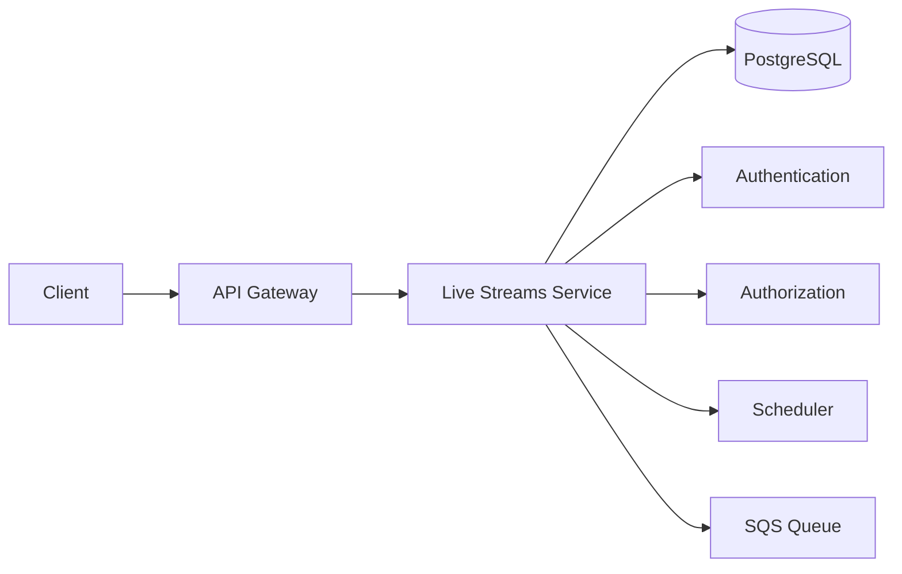
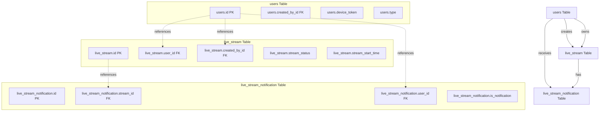
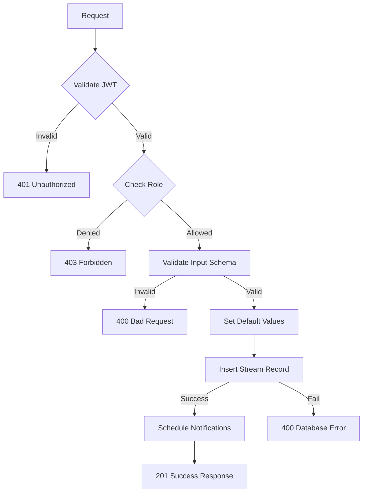
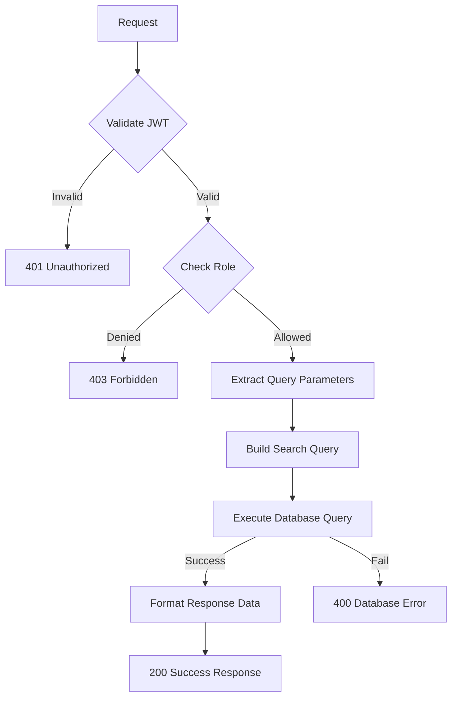
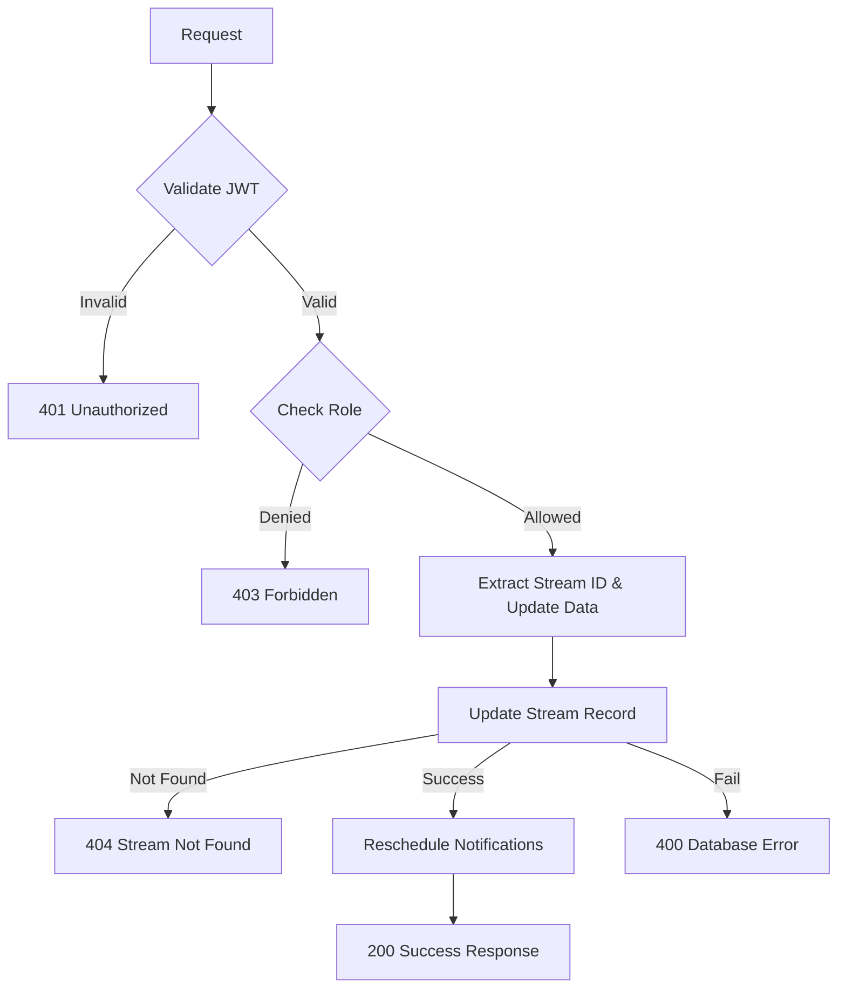
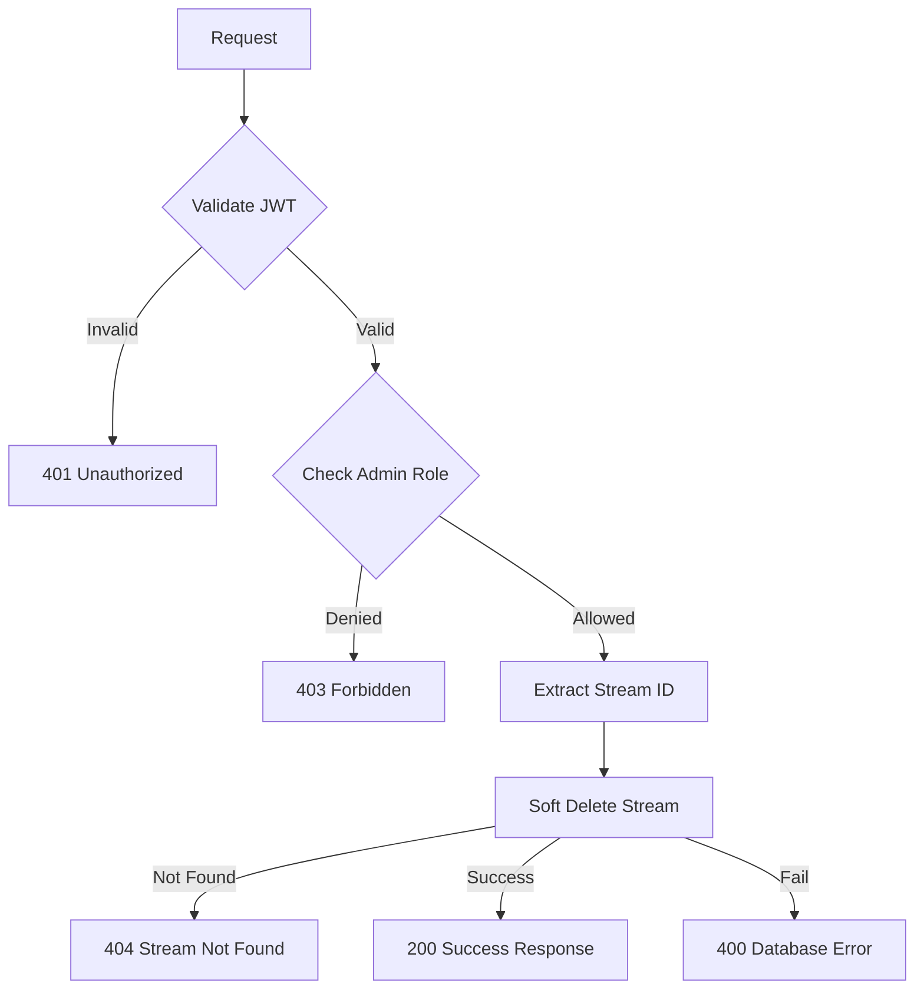
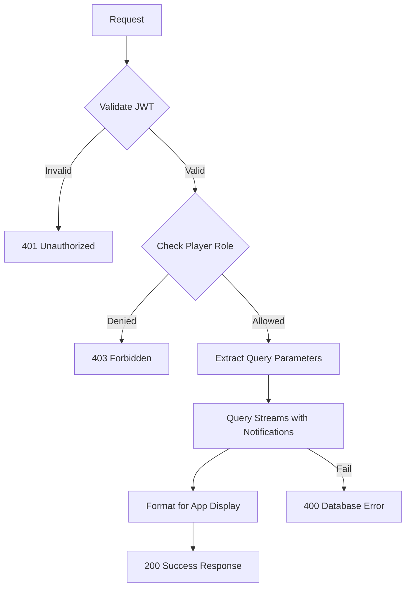
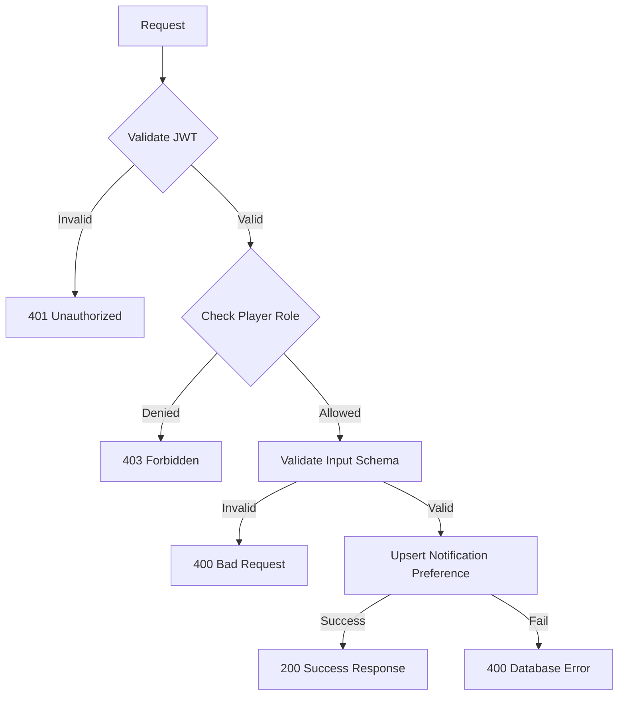
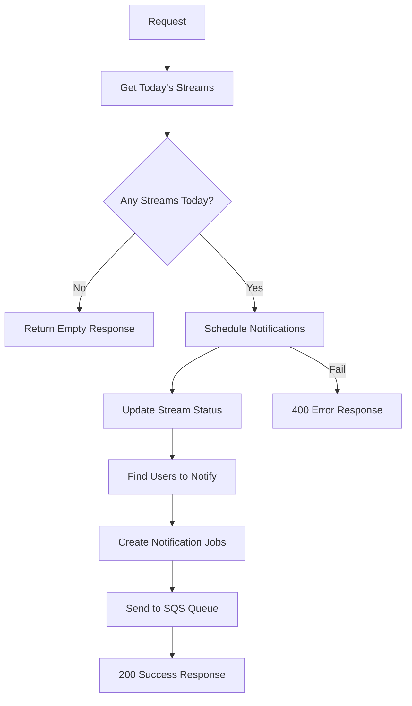

## Overview

The **Live Streams Service** provides comprehensive live streaming functionality for the Thryl platform, including stream creation, management, scheduling, and notification systems. This service enables organizers to create and manage live streams, while players can view streams and receive notifications when streams go live. The service includes advanced features like scheduled notifications, stream status management, and real-time status updates.

### Tech Stack
- **Backend**: Node.js, Express.js
- **Database**: PostgreSQL
- **Authentication**: JWT
- **Validation**: Joi
- **Authorization**: Role-based access control
- **Queue System**: AWS SQS
- **Scheduler**: Custom task scheduler

---

## System Architecture



---

## Database Schema

```mermaid
erDiagram
    users ||--o{ live_stream : "creates_streams"
    users ||--o{ live_stream : "owns_streams"
    users ||--o{ live_stream_notification : "receives_notifications"
    live_stream ||--o{ live_stream_notification : "has_notifications"

    users {
        bigint id PK "Primary Key"
        text username "Unique username"
        text email "User email"
        text mobile "User mobile"
        text password "Hashed password"
        text full_name "User full name"
        text bio "User bio"
        date date_of_birth "Date of birth"
        text google_id "Google OAuth ID"
        text apple_id "Apple Sign-In ID"
        text profile_pic_url "Profile picture URL"
        text image_cover_url "Cover image URL"
        text video_url "Video URL"
        text device_token "Push notification token"
        smallint is_active "Account active status"
        smallint is_deleted "Soft delete flag"
        smallint is_protected "Protected account flag"
        smallint type "User type (1=player, 2=organizer, 3=admin)"
        smallint is_account_notification "Account notification preference"
        smallint is_team_invite_notification "Team invite notification preference"
        smallint is_start_follow_notification "Follow notification preference"
        smallint is_tournament_notification "Tournament notification preference"
        text organization_name "Organization name"
        text address "Address"
        text logo_url "Logo URL"
        text document_url "Document URL"
        text poc_name "Point of contact name"
        text poc_email "Point of contact email"
        text poc_phone "Point of contact phone"
        text website_url "Website URL"
        text facebook_url "Facebook URL"
        text instagram_url "Instagram URL"
        text twitter_url "Twitter URL"
        text linkedin_url "LinkedIn URL"
        text youtube_url "YouTube URL"
        text discord_url "Discord URL"
        smallint is_profile_completed "Profile completion status"
        smallint is_first_signup "First signup flag"
        text referral_code "Unique referral code"
        bigint referred_by_id FK "Referrer user ID"
        text app_version "App version"
        text flag "Additional flags"
        timestamptz created_at "Record creation time"
        timestamptz updated_at "Last update time"
        timestamptz last_login_at "Last login time"
        timestamptz logout_at "Logout time"
        timestamptz deletion_at "Deletion time"
        bigint created_by_id FK "User who created record"
        bigint deleted_by_id FK "User who deleted record"
    }
    
    live_stream {
        bigint id PK "Primary Key"
        text title "Stream title"
        text description "Stream description"
        text thumbnail "Stream thumbnail URL"
        text stream_url "Stream URL"
        timestamptz stream_start_time "Stream start time"
        bigint user_id FK "Stream owner"
        text stream_status "Stream status (upcoming, live, completed)"
        bigint created_by_id FK "User who created stream"
        smallint is_deleted "Soft delete flag"
        timestamptz created_at "Stream creation time"
        timestamptz updated_at "Last update time"
    }
    
    live_stream_notification {
        bigint id PK "Primary Key"
        bigint stream_id FK "Stream ID"
        bigint user_id FK "User who receives notification"
        smallint is_notification "Notification enabled flag"
        timestamptz created_at "Notification creation time"
        timestamptz updated_at "Last update time"
    }
```



## Table Relationship Graph



### Relationship Details

| Relationship | Type | Description | Foreign Key |
|--------------|------|-------------|-------------|
| users → live_stream (creation) | One-to-Many | User can create multiple streams | `live_stream.created_by_id` |
| users → live_stream (ownership) | One-to-Many | User can own multiple streams | `live_stream.user_id` |
| users → live_stream_notification | One-to-Many | User can have multiple stream notifications | `live_stream_notification.user_id` |
| live_stream → live_stream_notification | One-to-Many | Stream can have multiple notifications | `live_stream_notification.stream_id` |

### Index Information

| Table | Index Type | Indexed Fields | Purpose |
|-------|------------|----------------|---------|
| live_stream | btree | `user_id` | Stream ownership queries |
| live_stream | btree | `created_by_id` | Stream creation queries |
| live_stream | btree | `stream_status` | Status-based filtering |
| live_stream | btree | `stream_start_time` | Time-based queries |
| live_stream | btree | `is_deleted` | Soft delete filtering |
| live_stream_notification | btree | `stream_id, user_id` | Notification preference queries |
| live_stream_notification | btree | `is_notification` | Notification status filtering |

---

## Base URLs

| Environment   | URL                                 |
|---------------|-------------------------------------|
| Production    | `https://thryl-prod.com   ||    https://thryl-production.zapto.org`      |
| Staging       | `https://thryl-staging.zapto.org` |
| Development   | `http://localhost:3000  || http://localhost:3001`      |

---

## Authentication

All Live Streams Service APIs require JWT authentication. Include the token in the Authorization header:

```http
Authorization: Bearer <your-jwt-token>
```

---

## Authorization

| Role         | Permissions                                      |
|--------------|--------------------------------------------------|
| **Organizer**| Create, read, update streams                     |
| **Organizer Team**| Create, read, update streams                |
| **Admin**    | Create, read, update, delete streams            |
| **Player**   | Read streams, manage notifications              |

---

## API Reference

### Complete API List

| # | Endpoint                    | Method | Purpose                                 | Auth Required | Role Required         |
|---|-----------------------------|--------|-----------------------------------------|---------------|----------------------|
| 1 | `/create`                   | POST   | Create a new live stream                | Yes           | organizer, organizer_team, admin |
| 2 | `/read`                     | GET    | Get all streams with search/filtering   | Yes           | admin, organizer, organizer_team |
| 3 | `/update`                   | PATCH  | Update a stream                         | Yes           | organizer, organizer_team, admin |
| 4 | `/delete`                   | DELETE | Delete a stream                         | Yes           | admin                |
| 5 | `/app-read`                 | GET    | Get streams for app (players)           | Yes           | player               |
| 6 | `/enable-notification`      | POST   | Enable/disable stream notifications     | Yes           | player               |
| 7 | `/schedule`                 | GET    | Send stream notifications               | No            | Public               |

---

## Validation Schemas

### Create Stream Schema
```javascript
{
  title: Joi.string().required(),
  description: Joi.string().optional().allow(null),
  thumbnail: Joi.string().optional().allow(null),
  stream_url: Joi.string().required(),
  stream_start_time: Joi.string().optional().allow(null),
  user_id: Joi.number().optional().allow(null),
  stream_status: Joi.string().optional().allow(null)
}
```

### Get All Streams Schema
```javascript
{
  searchTerm: Joi.string().optional().allow(null),
  limit: Joi.number().optional().allow(null),
  offset: Joi.number().optional().allow(null)
}
```

### Update Stream Schema
```javascript
{
  title: Joi.string().optional().allow(null),
  description: Joi.string().optional().allow(null),
  stream_status: Joi.string().optional().allow(null),
  thumbnail: Joi.string().optional().allow(null),
  stream_url: Joi.string().optional().allow(null),
  stream_start_time: Joi.string().optional().allow(null),
  user_id: Joi.number().optional().allow(null)
}
```

### Enable Stream Notification Schema
```javascript
{
  stream_id: Joi.number().required(),
  is_notification: Joi.number().valid(0, 1).required()
}
```

---

## API Endpoints

### 1. Create Stream

Creates a new live stream with scheduling and notification capabilities.

**Endpoint:** `POST /liveStreams/create`

**Authorization:** Organizer, organizer_team, admin

**Request Body:**
```json
{
  "title": "Epic Gaming Tournament Live",
  "description": "Watch the most exciting gaming tournament live!",
  "thumbnail": "https://example.com/thumbnail.jpg",
  "stream_url": "https://stream.example.com/live/123",
  "stream_start_time": "2024-01-15T20:00:00Z",
  "user_id": 123,
  "stream_status": "upcoming"
}
```

**Success Response (201):**
```json
{
  "status": 1,
  "message": "Stream created successfully",
  "stream": {
    "id": 456,
    "title": "Epic Gaming Tournament Live",
    "description": "Watch the most exciting gaming tournament live!",
    "thumbnail": "https://example.com/thumbnail.jpg",
    "stream_url": "https://stream.example.com/live/123",
    "stream_start_time": "2024-01-15T20:00:00Z",
    "user_id": 123,
    "stream_status": "upcoming",
    "created_by_id": 789,
    "created_at": "2024-01-15T10:30:00Z",
    "updated_at": "2024-01-15T10:30:00Z"
  }
}
```

**Error Response (400):**
```json
{
  "status": 0,
  "message": "Title is required"
}
```

**Error Response (401):**
```json
{
  "status": 0,
  "message": "Unauthorized access"
}
```

**DFD:**


#### Business Logic

1. **Input Validation**: Validates required fields and data types
2. **Default Values**: Sets default stream_start_time to current time if not provided
3. **Status Management**: Sets default stream_status to 'upcoming' if not provided
4. **Scheduling**: Automatically schedules notifications for stream start time
5. **Creator Tracking**: Records who created the stream

#### Database Operations

```sql
INSERT INTO live_stream (title, description, thumbnail, stream_url, stream_start_time, user_id, stream_status, created_by_id) 
VALUES ($1, $2, $3, $4, $5, $6, $7, $8) 
RETURNING *;
```

---

### 2. Get All Streams

Retrieves all streams with advanced search, filtering, and pagination capabilities.

**Endpoint:** `GET /liveStreams/read`

**Authorization:** Admin, organizer, organizer_team

**Query Parameters:**
- `search_term` (optional): Search by username, title, or date (YYYY-MM-DD format)
- `limit` (optional): Number of items per page
- `page` (optional): Page number

**Example Request:**
```http
GET /liveStreams/read?search_term=gaming&limit=10&page=1
```

**Success Response (200):**
```json
{
  "status": 1,
  "message": "Streams fetched successfully",
  "streams": [
    {
      "stream_id": 456,
      "username": "gaming_org",
      "full_name": "Gaming Organization",
      "profile_pic_url": "https://example.com/profile.jpg",
      "user_id": 123,
      "created_by_id": 789,
      "title": "Epic Gaming Tournament Live",
      "description": "Watch the most exciting gaming tournament live!",
      "thumbnail": "https://example.com/thumbnail.jpg",
      "stream_url": "https://stream.example.com/live/123",
      "stream_start_time": "2024-01-15T20:00:00Z",
      "display_status": "upcoming"
    }
  ]
}
```

**Error Response (400):**
```json
{
  "status": 0,
  "message": "Failed to fetch streams"
}
```

**DFD:**


#### Business Logic

1. **Advanced Search**: Supports search by username, title, or specific date
2. **Smart Filtering**: Uses CTE (Common Table Expression) for efficient queries
3. **Status Display**: Shows 'live' status prominently for active streams
4. **User Information**: Includes creator details with profile information
5. **Pagination**: Efficient offset-based pagination

#### Database Operations

```sql
WITH 
ls AS (SELECT id, user_id, created_by_id, title, description, thumbnail, stream_url, stream_start_time, stream_status FROM live_stream where is_deleted is distinct from 1),
u AS (SELECT id, username, full_name, profile_pic_url FROM users)
SELECT ls.id AS stream_id, u.username, u.full_name, u.profile_pic_url, ls.user_id, ls.created_by_id, ls.title, ls.description, ls.thumbnail, ls.stream_url, ls.stream_start_time,
  CASE 
      WHEN ls.stream_status = 'live' THEN 'live'
      ELSE ls.stream_status
   END AS display_status
FROM ls 
JOIN u ON ls.user_id = u.id 
WHERE 
    ($1::TEXT = 'all' OR (
        u.username ILIKE '%' || $1::TEXT || '%' OR
        ls.title ILIKE '%' || $1::TEXT || '%' OR
        ($1 ~ '^[0-9]{4}-[0-9]{2}-[0-9]{2}$' AND ls.stream_start_time::DATE = $1::DATE)
    )) ORDER BY stream_id DESC LIMIT $2 OFFSET $3;
```

---

### 3. Update Stream

Updates an existing stream with partial updates and reschedules notifications.

**Endpoint:** `PATCH /liveStreams/update`

**Authorization:** Organizer, organizer_team, admin

**Query Parameters:**
- `stream_id` (required): ID of stream to update

**Request Body:**
```json
{
  "title": "Updated Gaming Tournament Live",
  "description": "Updated description for the tournament",
  "thumbnail": "https://example.com/new-thumbnail.jpg",
  "stream_url": "https://stream.example.com/live/456",
  "stream_status": "live",
  "stream_start_time": "2024-01-15T21:00:00Z",
  "user_id": 123
}
```

**Success Response (200):**
```json
{
  "status": 1,
  "message": "Stream updated successfully",
  "stream": {
    "id": 456,
    "title": "Updated Gaming Tournament Live",
    "description": "Updated description for the tournament",
    "thumbnail": "https://example.com/new-thumbnail.jpg",
    "stream_url": "https://stream.example.com/live/456",
    "stream_start_time": "2024-01-15T21:00:00Z",
    "user_id": 123,
    "stream_status": "live",
    "created_by_id": 789,
    "created_at": "2024-01-15T10:30:00Z",
    "updated_at": "2024-01-15T12:30:00Z"
  }
}
```

**Error Response (404):**
```json
{
  "status": 0,
  "message": "Stream not found"
}
```

**DFD:**


#### Business Logic

1. **Partial Updates**: Supports updating specific fields only
2. **Notification Rescheduling**: Automatically reschedules notifications for new start time
3. **Time Validation**: Skips scheduling for past times
4. **Status Management**: Updates stream status and related notifications
5. **Existence Check**: Verifies stream exists before update

#### Database Operations

```sql
UPDATE live_stream 
SET 
    title = COALESCE($1, title),
    description = COALESCE($2, description),
    thumbnail = COALESCE($3, thumbnail), 
    stream_url = COALESCE($4, stream_url), 
    stream_status = COALESCE($5, stream_status),
    stream_start_time = COALESCE($6, stream_start_time),
    user_id = COALESCE($7, user_id)
WHERE id = $8 
RETURNING *;
```

---

### 4. Delete Stream

Soft deletes a stream (marks as deleted but keeps data).

**Endpoint:** `DELETE /liveStreams/delete`

**Authorization:** Admin only

**Query Parameters:**
- `stream_id` (required): ID of stream to delete

**Example Request:**
```http
DELETE /liveStreams/delete?stream_id=456
```

**Success Response (200):**
```json
{
  "status": 1,
  "message": "Stream deleted successfully"
}
```

**Error Response (404):**
```json
{
  "status": 0,
  "message": "Stream not found"
}
```

**DFD:**


#### Business Logic

1. **Soft Delete**: Marks stream as deleted without removing data
2. **Admin Only**: Restricted to admin users only
3. **Existence Check**: Verifies stream exists before deletion
4. **Data Preservation**: Keeps stream data for audit purposes

#### Database Operations

```sql
UPDATE live_stream SET is_deleted = 1 WHERE id = $1 RETURNING *;
```

---

### 5. App Show All Streams

Retrieves streams optimized for mobile app display with notification status.

**Endpoint:** `GET /liveStreams/app-read`

**Authorization:** Player only

**Query Parameters:**
- `page` (optional): Page number
- `limit` (optional): Items per page

**Example Request:**
```http
GET /liveStreams/app-read?page=1&limit=10
```

**Success Response (200):**
```json
{
  "status": 1,
  "message": "Streams fetched successfully",
  "streams": [
    {
      "stream_id": 456,
      "username": "gaming_org",
      "full_name": "Gaming Organization",
      "profile_image": "https://example.com/logo.png",
      "user_id": 123,
      "created_by_id": 789,
      "title": "Epic Gaming Tournament Live",
      "description": "Watch the most exciting gaming tournament live!",
      "thumbnail": "https://example.com/thumbnail.jpg",
      "stream_url": "https://stream.example.com/live/123",
      "stream_start_time": "2024-01-15T20:00:00Z",
      "stream_status": "live",
      "notification_enabled": 1
    }
  ]
}
```

**Error Response (400):**
```json
{
  "status": 0,
  "message": "Failed to fetch streams"
}
```

**DFD:**


#### Business Logic

1. **App Optimization**: Optimized query for mobile app performance
2. **User Type Handling**: Shows username for players, organization name for organizers
3. **Profile Image Logic**: Uses profile pic for players, logo for organizations
4. **Live Priority**: Live streams appear first in results
5. **Notification Status**: Includes user's notification preference for each stream

#### Database Operations

```sql
WITH 
ls AS (SELECT id, user_id, created_by_id, title, description, thumbnail, stream_url, stream_start_time, stream_status FROM live_stream where is_deleted is distinct from 1),
u AS (SELECT id, username, full_name, profile_pic_url, organization_name, logo_url, type FROM users),
lsn AS (SELECT DISTINCT ON (stream_id) stream_id, is_notification FROM live_stream_notification ORDER BY stream_id, is_notification DESC)
SELECT ls.id AS stream_id,
CASE 
    WHEN u.type = 2 THEN u.username ELSE u.organization_name END AS username,
CASE 
    WHEN u.type = 2 THEN u.full_name ELSE NULL END AS full_name,
CASE 
    WHEN u.type = 2 THEN u.profile_pic_url ELSE u.logo_url  END AS profile_image,
ls.user_id, ls.created_by_id, ls.title, ls.description, ls.thumbnail, ls.stream_url, ls.stream_start_time,
CASE 
    WHEN ls.stream_status = 'live' THEN 'live' ELSE ls.stream_status END AS stream_status,
CASE WHEN lsn.is_notification = 1 THEN 1 ELSE 0 END AS notification_enabled
FROM ls LEFT JOIN u ON ls.user_id = u.id LEFT JOIN lsn ON ls.id = lsn.stream_id ORDER BY  CASE 
    WHEN ls.stream_status = 'live' THEN 1 ELSE 0 END DESC, 
ls.stream_start_time DESC offset $1 limit $2;
```

---

### 6. Enable Stream Notification

Enables or disables notifications for a specific stream.

**Endpoint:** `POST /liveStreams/enable-notification`

**Authorization:** Player only

**Request Body:**
```json
{
  "stream_id": 456,
  "is_notification": 1
}
```

**Success Response (200):**
```json
{
  "status": 1,
  "message": "Stream notification enabled successfully",
  "stream": {
    "id": 789,
    "stream_id": 456,
    "user_id": 123,
    "is_notification": 1,
    "created_at": "2024-01-15T10:30:00Z",
    "updated_at": "2024-01-15T10:30:00Z"
  }
}
```

**Error Response (400):**
```json
{
  "status": 0,
  "message": "Stream ID must be a number"
}
```

**DFD:**


#### Business Logic

1. **Upsert Operation**: Creates or updates notification preference
2. **Player Only**: Restricted to player users
3. **Preference Management**: Tracks individual user preferences per stream
4. **Validation**: Ensures stream_id is valid number and notification flag is 0 or 1

#### Database Operations

```sql
WITH 
upsert AS (
  UPDATE live_stream_notification
  SET is_notification = $2
  WHERE stream_id = $1 AND user_id = $3
  RETURNING *
)
INSERT INTO live_stream_notification (stream_id, is_notification, user_id)
SELECT $1, $2, $3
WHERE NOT EXISTS (SELECT 1 FROM upsert)
RETURNING *;
```

---

### 7. Send Stream Notifications

Schedules and sends notifications for streams going live (public endpoint).

**Endpoint:** `GET /liveStreams/schedule`

**Authorization:** Public (no authentication required)

**Example Request:**
```http
GET /liveStreams/schedule
```

**Success Response (200):**
```json
{
  "status": 1,
  "message": "Stream notifications sent successfully",
  "streams": [
    {
      "id": 456,
      "title": "Epic Gaming Tournament Live",
      "description": "Watch the most exciting gaming tournament live!",
      "stream_start_time": "2024-01-15T20:00:00Z",
      "stream_status": "live"
    }
  ]
}
```

**DFD:**


#### Business Logic

1. **Daily Processing**: Processes all streams scheduled for current date
2. **Status Updates**: Automatically updates stream status to 'live' when time matches
3. **User Filtering**: Only notifies users with device tokens and notification preferences
4. **Queue Processing**: Sends notifications via SQS for reliable delivery
5. **Time Window**: Uses 30-second window around scheduled time

#### Database Operations

```sql
-- Get today's streams
SELECT * FROM live_stream WHERE DATE(stream_start_time) = CURRENT_DATE;

-- Update stream status and get users to notify
WITH updated_streams AS (
  UPDATE live_stream
  SET stream_status = 'live'
  WHERE stream_start_time BETWEEN NOW() - INTERVAL '30 seconds' AND NOW() + INTERVAL '30 seconds'
    AND (stream_status = 'upcoming' OR stream_status NOT IN ('live', 'completed'))
    AND is_deleted IS DISTINCT FROM 1
  RETURNING id, title, description
),
users_to_notify AS (
  SELECT DISTINCT u.device_token, u.id AS user_id, us.id as stream_id, us.title as stream_title
  FROM users u
  LEFT JOIN live_stream_notification lsn ON lsn.user_id = u.id
  JOIN updated_streams us ON true
  WHERE u.device_token IS NOT NULL 
    AND u.type = 2
    AND u.is_deleted IS DISTINCT FROM 1
)
SELECT * FROM users_to_notify;
```

---

## Rate Limiting

| Endpoint                | Rate Limit | Window      |
|-------------------------|------------|-------------|
| All Live Streams APIs   | 100        | 15 minutes  |

---

## Security Considerations

### Authentication
- JWT token validation on all endpoints (except schedule)
- Token expiration handling
- Secure token transmission

### Authorization
- Role-based access control for different user types
- Admin-only deletion operations
- Player-only notification management
- Organizer-only stream creation and management

### Input Validation
- Request body validation using Joi schemas
- Query parameter validation
- SQL injection prevention through parameterized queries
- Stream URL validation

### Data Protection
- Soft delete for data preservation
- User-specific notification preferences
- Secure stream URL handling
- Input sanitization

---

## Business Rules

### Stream Management
1. Only organizers and admins can create and update streams
2. Only admins can delete streams (soft delete)
3. Stream status automatically updates based on scheduled time
4. Notifications are automatically scheduled for stream start time

### Notification System
1. Players can enable/disable notifications per stream
2. Notifications are sent only to users with device tokens
3. Stream status updates trigger automatic notifications
4. Notifications are processed via SQS for reliability

### Scheduling
1. Streams can be scheduled for future times
2. Past streams are automatically marked as completed
3. Live streams take priority in display order
4. Notification scheduling skips past times

### Data Integrity
1. Foreign key relationships are maintained
2. Soft delete flags prevent accidental data loss
3. Audit trails track stream creation and modification
4. User preferences are preserved across sessions

---

## Monitoring & Logging

### Metrics to Monitor
- API response times
- Error rates by endpoint
- Database query performance
- Stream creation and update rates
- Notification delivery success rates
- SQS queue processing times

### Logging
- Request/response logging
- Error logging with stack traces
- Database operation logging
- Stream lifecycle event logging
- Notification delivery logging
- Scheduler execution logging

### Alerts
- High error rates (>5%)
- Slow response times (>2s)
- Database connection issues
- Failed stream operations
- Notification delivery failures
- SQS queue backlogs

---

## Integration Examples

### Frontend Integration

```javascript
// Create a new stream
const createStream = async (streamData) => {
  const response = await fetch('/api/v1/liveStreams/create', {
    method: 'POST',
    headers: {
      'Content-Type': 'application/json',
      'Authorization': `Bearer ${token}`
    },
    body: JSON.stringify(streamData)
  });
  return response.json();
};

// Get all streams
const getAllStreams = async (searchTerm = 'all', limit = 10, page = 1) => {
  const params = new URLSearchParams({
    search_term: searchTerm,
    limit: limit.toString(),
    page: page.toString()
  });
  
  const response = await fetch(`/api/v1/liveStreams/read?${params}`, {
    headers: {
      'Authorization': `Bearer ${token}`
    }
  });
  return response.json();
};

// Update a stream
const updateStream = async (streamId, updateData) => {
  const response = await fetch(`/api/v1/liveStreams/update?stream_id=${streamId}`, {
    method: 'PATCH',
    headers: {
      'Content-Type': 'application/json',
      'Authorization': `Bearer ${token}`
    },
    body: JSON.stringify(updateData)
  });
  return response.json();
};

// Delete a stream
const deleteStream = async (streamId) => {
  const response = await fetch(`/api/v1/liveStreams/delete?stream_id=${streamId}`, {
    method: 'DELETE',
    headers: {
      'Authorization': `Bearer ${token}`
    }
  });
  return response.json();
};

// Get streams for app
const getAppStreams = async (page = 1, limit = 10) => {
  const params = new URLSearchParams({
    page: page.toString(),
    limit: limit.toString()
  });
  
  const response = await fetch(`/api/v1/liveStreams/app-read?${params}`, {
    headers: {
      'Authorization': `Bearer ${token}`
    }
  });
  return response.json();
};

// Enable stream notification
const enableStreamNotification = async (streamId, isNotification) => {
  const response = await fetch('/api/v1/liveStreams/enable-notification', {
    method: 'POST',
    headers: {
      'Content-Type': 'application/json',
      'Authorization': `Bearer ${token}`
    },
    body: JSON.stringify({
      stream_id: streamId,
      is_notification: isNotification
    })
  });
  return response.json();
};
```

### Error Handling

```javascript
const handleStreamOperation = async (operation) => {
  try {
    const result = await operation();
    if (result.status === 1) {
      console.log('Operation successful:', result.message);
      return result.stream || result.streams || result.message;
    } else {
      console.error('Operation failed:', result.message);
      throw new Error(result.message);
    }
  } catch (error) {
    console.error('Stream operation failed:', error.message);
    // Handle different error types
    if (error.message.includes('Title is required')) {
      // Handle validation error
    } else if (error.message.includes('Stream not found')) {
      // Handle not found error
    } else if (error.message.includes('Unauthorized')) {
      // Handle authentication error
    } else if (error.message.includes('Forbidden')) {
      // Handle authorization error
    } else {
      // Handle general error
    }
  }
};
```

---

## Use Cases

### 1. Stream Management
- Organizers create and schedule live streams
- Update stream details and reschedule notifications
- Monitor stream status and performance
- Manage stream lifecycle from creation to completion

### 2. User Experience
- Players discover and watch live streams
- Enable notifications for favorite streams
- Real-time stream status updates
- Personalized stream recommendations

### 3. Notification System
- Automated notifications when streams go live
- User preference management
- Reliable notification delivery via SQS
- Cross-platform notification support

### 4. Analytics & Insights
- Track stream engagement and viewership
- Monitor notification effectiveness
- Analyze user behavior patterns
- Generate stream performance reports

---

## Performance Considerations

### Database Optimization
- Indexes on `user_id`, `stream_status`, and `stream_start_time` for fast lookups
- Efficient pagination with offset-based queries
- Optimized JOIN operations for user data
- Proper indexing on notification preferences

### Query Optimization
- Use parameterized queries for security
- Limit result sets with pagination
- Efficient filtering by stream status and time
- Optimized data aggregation and sorting

### Caching Strategy
- Consider caching frequently accessed streams
- Cache user notification preferences
- Implement cache invalidation on updates
- Cache stream metadata for faster retrieval

### Scheduler Optimization
- Efficient task scheduling for notifications
- Batch processing for multiple streams
- Time window optimization for status updates
- Queue management for notification delivery

---

## Testing Scenarios

### Unit Tests
- Stream creation and validation
- Stream update functionality
- Notification preference management
- Error handling for invalid inputs

### Integration Tests
- End-to-end stream lifecycle
- Authentication and authorization
- Database consistency
- API response validation

### Performance Tests
- Load testing with multiple concurrent streams
- Database query performance
- Notification delivery performance
- Scheduler execution performance

### Security Tests
- SQL injection prevention
- JWT token validation
- Role-based access control
- Input sanitization
- Authorization validation

--- 