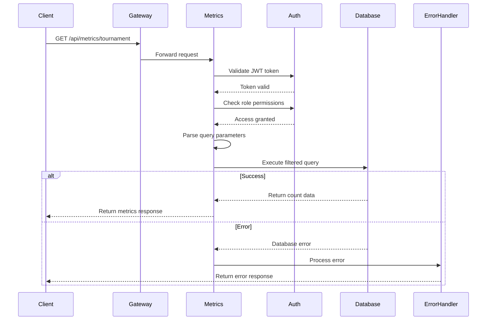
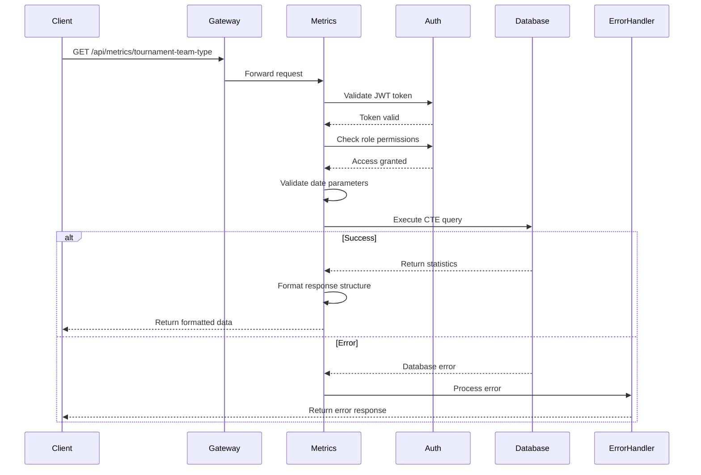

## Overview

The **Metrics API** provides powerful analytics capabilities for the Thryl gaming platform, enabling administrators and organizers to gain deep insights into tournament performance, participant engagement, and platform usage patterns. This API delivers comprehensive data-driven insights to support strategic decision-making and platform optimization.

### Key Features
- **Tournament Analytics**: Detailed tournament statistics with flexible filtering
- **Participant Insights**: Average participant counts and engagement metrics
- **Status Tracking**: Real-time tournament status distribution
- **Team Type Analysis**: Performance metrics by team configuration
- **First-time Player Tracking**: New user acquisition analytics

### Tech Stack
- **Backend**: Node.js, Express.js
- **Database**: PostgreSQL with advanced CTE queries
- **Authentication**: JWT-based security
- **Authorization**: Role-based access control (RBAC)
- **Error Handling**: Custom API error management

---

## Authentication & Authorization

All endpoints require JWT authentication and support the following roles:

| Role | Access Level | Description |
|------|-------------|-------------|
| `admin` | Full Access | Complete metrics access across all organizers |
| `organizer` | Limited Access | Metrics for own tournaments and platform-wide stats |
| `organizer_team` | Limited Access | Same access as organizer role |

---

## API Endpoints

### 1. Get Tournament Metrics

Retrieves filtered tournament counts based on various criteria including organizer, team type, status, and date ranges.

**Endpoint:** `GET /api/metrics/tournament`

**Authentication:** Required (JWT)

**Authorization:** `admin`, `organizer`, `organizer_team`

#### Query Parameters

| Parameter | Type | Required | Description | Example |
|-----------|------|----------|-------------|---------|
| `organizer_id` | string | No | Filter by specific organizer | `"org_123"` |
| `team_type` | string | No | Filter by team type | `"solo"`, `"duo"`, `"squad"` |
| `status` | string | No | Filter by tournament status | `"live"`, `"upcoming"`, `"finished"` |
| `limit` | number | No | Records per page (default: 10) | `20` |
| `offset` | number | No | Records to skip (default: 0) | `10` |
| `created_at_start` | string | No | Start date (ISO format) | `"2024-01-01T00:00:00Z"` |
| `created_at_end` | string | No | End date (ISO format) | `"2024-12-31T23:59:59Z"` |

#### Request Example

```bash
curl -X GET "https://api.thryl.com/api/metrics/tournament" \
  -H "Authorization: Bearer YOUR_JWT_TOKEN" \
  -H "Content-Type: application/json" \
  -G \
  -d "organizer_id=org_123" \
  -d "team_type=solo" \
  -d "status=live" \
  -d "limit=20" \
  -d "offset=0" \
  -d "created_at_start=2024-01-01T00:00:00Z" \
  -d "created_at_end=2024-12-31T23:59:59Z"
```

#### Success Response (200)

```json
{
  "status": "ok",
  "data": [
    {
      "count": "45"
    }
  ]
}
```

#### Error Responses

| Status | Error Type | Description |
|--------|------------|-------------|
| `400` | Bad Request | Invalid query parameters or date format |
| `401` | Unauthorized | Missing or invalid JWT token |
| `403` | Forbidden | Insufficient role permissions |
| `500` | Internal Server Error | Database or server error |

---

### 2. Get Average Participant Count

Calculates the average number of participants per team across all tournaments in the platform.

**Endpoint:** `GET /api/metrics/avg-participant-count`

**Authentication:** Required (JWT)

**Authorization:** `admin`, `organizer`, `organizer_team`

#### Request Example

```bash
curl -X GET "https://api.thryl.com/api/metrics/avg-participant-count" \
  -H "Authorization: Bearer YOUR_JWT_TOKEN" \
  -H "Content-Type: application/json"
```

#### Success Response (200)

```json
{
  "status": "ok",
  "data": "3.45"
}
```

#### Business Logic

This endpoint calculates the average participant count using a subquery approach:

1. **Team Grouping**: Groups tournament registrations by team
2. **Member Counting**: Counts team members for each registered team
3. **Average Calculation**: Computes the arithmetic mean across all teams
4. **Formatting**: Returns result rounded to 2 decimal places

**SQL Query:**
```sql
SELECT AVG(member_count) AS avg_participant_count
FROM (
    SELECT COUNT(*) AS member_count
    FROM tournament_register tr
    JOIN team_member tm ON tr.team_id = tm.team_id
    GROUP BY tr.team_id
) AS team_counts;
```

---

### 3. Get Tournament Count by Status

Provides tournament distribution across different status categories with optional filtering.

**Endpoint:** `GET /api/metrics/tournament-count`

**Authentication:** Required (JWT)

**Authorization:** `admin`, `organizer`, `organizer_team`

#### Query Parameters

| Parameter | Type | Required | Description | Example |
|-----------|------|----------|-------------|---------|
| `organizer_id` | string | No | Filter by specific organizer | `"org_123"` |
| `created_at_start` | string | No | Start date (ISO format) | `"2024-01-01T00:00:00Z"` |
| `created_at_end` | string | No | End date (ISO format) | `"2024-12-31T23:59:59Z"` |

#### Request Example

```bash
curl -X GET "https://api.thryl.com/api/metrics/tournament-count" \
  -H "Authorization: Bearer YOUR_JWT_TOKEN" \
  -H "Content-Type: application/json" \
  -G \
  -d "organizer_id=org_123" \
  -d "created_at_start=2024-01-01T00:00:00Z" \
  -d "created_at_end=2024-12-31T23:59:59Z"
```

#### Success Response (200)

```json
{
  "status": "ok",
  "data": {
    "live": 5,
    "upcoming": 12,
    "finished": 25,
    "ongoing": 8
  }
}
```

#### Status Categories

| Status | Description |
|--------|-------------|
| `live` | Currently active tournaments |
| `upcoming` | Scheduled tournaments |
| `finished` | Completed tournaments |
| `ongoing` | Tournaments in progress |

#### Business Logic

The endpoint groups tournaments by status and excludes draft tournaments:

```sql
SELECT 
    CASE 
        WHEN status = 'live' THEN 'live'
        WHEN status = 'upcoming' THEN 'upcoming'
        WHEN status = 'finished' THEN 'finished'
        ELSE 'ongoing'
    END AS status_group,
    COUNT(*) AS count
FROM tournament
WHERE status != 'draft'
    AND created_by_id = $1 (if organizer_id provided)
    AND created_at BETWEEN $2 AND $3 (if date range provided)
GROUP BY status_group;
```

---

### 4. Get Tournament Team Type Statistics

Provides comprehensive analytics about tournament performance grouped by team type, including first-time player insights.

**Endpoint:** `GET /api/metrics/tournament-team-type`

**Authentication:** Required (JWT)

**Authorization:** `admin`, `organizer`, `organizer_team`

#### Query Parameters

| Parameter | Type | Required | Description | Example |
|-----------|------|----------|-------------|---------|
| `organizer_id` | string | No | Filter by specific organizer | `"org_123"` |
| `created_at_start` | string | Yes | Start date (ISO format) | `"2024-01-01T00:00:00Z"` |
| `created_at_end` | string | Yes | End date (ISO format) | `"2024-12-31T23:59:59Z"` |

#### Request Example

```bash
curl -X GET "https://api.thryl.com/api/metrics/tournament-team-type" \
  -H "Authorization: Bearer YOUR_JWT_TOKEN" \
  -H "Content-Type: application/json" \
  -G \
  -d "organizer_id=org_123" \
  -d "created_at_start=2024-01-01T00:00:00Z" \
  -d "created_at_end=2024-12-31T23:59:59Z"
```

#### Success Response (200)

```json
{
  "status": "ok",
  "data": {
    "solo": {
      "tournament_count": 15,
      "avg_participants": 45.67,
      "first_time_player_count": 120
    },
    "duo": {
      "tournament_count": 8,
      "avg_participants": 32.12,
      "first_time_player_count": 85
    },
    "squad": {
      "tournament_count": 12,
      "avg_participants": 78.45,
      "first_time_player_count": 200
    }
  }
}
```

#### Metrics Explained

| Metric | Description |
|--------|-------------|
| `tournament_count` | Number of tournaments for this team type |
| `avg_participants` | Average participants per tournament |
| `first_time_player_count` | New players who joined tournaments in the period |

#### Business Logic

This endpoint uses complex CTE (Common Table Expression) queries to calculate:

1. **Tournament Statistics**: Count and average participants per team type
2. **First-time Player Analysis**: Identifies new players in the specified period
3. **Data Aggregation**: Efficient processing using PostgreSQL CTEs

**Key SQL Structure:**
```sql
WITH tournament_stats AS (
  -- Calculate tournament and participant statistics
),
first_time_users AS (
  -- Identify new players in the period
),
first_time_user_counts AS (
  -- Count new players by team type
)
SELECT 
  ts.team_type,
  COUNT(*) AS tournament_count,
  AVG(ts.participant_count) AS avg_participants,
  COALESCE(ft.first_time_player_count, 0) AS first_time_player_count
FROM tournament_stats ts
LEFT JOIN first_time_user_counts ft ON ts.team_type = ft.team_type
GROUP BY ts.team_type, ft.first_time_player_count;
```

---

## Data Flow Diagrams

### Tournament Metrics Flow



### Team Type Statistics Flow



---

## Error Handling

### Error Response Format

All error responses follow a consistent structure:

```json
{
  "status": "error",
  "message": "Human-readable error description",
  "code": "ERROR_CODE",
  "details": {
    "field": "Additional context if applicable"
  }
}
```

### Common Error Scenarios

| Error Code | HTTP Status | Description | Resolution |
|------------|-------------|-------------|------------|
| `UNAUTHORIZED` | 401 | Missing or invalid JWT token | Include valid Authorization header |
| `FORBIDDEN` | 403 | Insufficient role permissions | Contact admin for role assignment |
| `BAD_REQUEST` | 400 | Invalid query parameters | Check parameter format and values |
| `INTERNAL_SERVER_ERROR` | 500 | Database or server error | Contact support team |

---

## Performance Considerations

### Database Optimization
- **Indexed Queries**: All frequently filtered columns are indexed
- **Efficient Aggregations**: Optimized SQL queries with proper joins
- **Connection Pooling**: Database connections are pooled for performance

### Caching Strategy
- **Redis Integration**: Frequently accessed metrics are cached
- **TTL Management**: Cache expiration based on data freshness requirements
- **Cache Invalidation**: Automatic invalidation on data updates

### Query Optimization
- **Parameterized Queries**: SQL injection prevention with prepared statements
- **Pagination Support**: Efficient handling of large datasets
- **Date Range Filtering**: Optimized date-based queries

---

## Security Features

### Authentication
- **JWT Validation**: Secure token-based authentication
- **Token Expiration**: Automatic token expiry management
- **Secure Headers**: HTTPS-only communication

### Authorization
- **Role-Based Access**: Granular permission control
- **Resource Isolation**: Organizers can only access their data
- **Audit Logging**: Complete access trail for security monitoring

### Data Protection
- **Input Validation**: Comprehensive parameter validation
- **SQL Injection Prevention**: Parameterized queries
- **Sensitive Data Filtering**: Automatic data sanitization

---

## Rate Limiting

The API implements rate limiting to ensure fair usage:

| Endpoint | Rate Limit | Window |
|----------|------------|--------|
| All endpoints | 100 requests | Per minute per user |
| Tournament metrics | 50 requests | Per minute per user |
| Team type statistics | 30 requests | Per minute per user |

---

## Monitoring & Analytics

### Metrics Tracking
- **Response Times**: Average and percentile response times
- **Error Rates**: Error frequency and type tracking
- **Usage Patterns**: API usage analytics and trends

### Health Checks
- **Database Connectivity**: Real-time database health monitoring
- **Service Availability**: Uptime and performance tracking
- **Dependency Status**: External service health verification

### Alerting
- **Error Thresholds**: Automatic alerts for high error rates
- **Performance Degradation**: Response time threshold alerts
- **Security Incidents**: Suspicious activity detection

---

## Testing

### Unit Tests
- **Service Layer**: Individual function testing
- **Controller Methods**: Request/response handling tests
- **Database Queries**: Query logic and performance tests

### Integration Tests
- **End-to-End Flows**: Complete API workflow testing
- **Authentication**: JWT validation and role testing
- **Error Scenarios**: Comprehensive error handling tests

### Performance Tests
- **Load Testing**: High-traffic scenario simulation
- **Database Performance**: Query optimization testing
- **Memory Usage**: Resource consumption monitoring

---

## Deployment

### Environment Configuration
```bash
# Database Configuration
DB_HOST=your-db-host
DB_PORT=5432
DB_NAME=thryl_metrics
DB_USER=metrics_user

# JWT Configuration
JWT_SECRET=your-jwt-secret
JWT_EXPIRY=24h

# Redis Configuration
REDIS_HOST=your-redis-host
REDIS_PORT=6379
REDIS_TTL=3600
```

### Health Check Endpoint
```bash
GET /api/metrics/health
```

**Response:**
```json
{
  "status": "healthy",
  "database": "connected",
  "redis": "connected",
  "timestamp": "2024-01-01T00:00:00Z"
}
```

---

## Support & Contact

For technical support, feature requests, or bug reports:

- **Email**: api-support@thryl.com
- **Documentation**: https://docs.thryl.com/api
- **Status Page**: https://status.thryl.com
- **GitHub Issues**: https://github.com/thryl/api-issues

---

## Changelog

### Version 1.0.0 (Current)
- Initial release of Metrics API
- Tournament metrics and participant analytics
- Team type statistics with first-time player tracking
- Comprehensive error handling and security features

### Upcoming Features
- Real-time metrics streaming
- Advanced filtering options
- Export functionality for reports
- Custom metric definitions

---

## Conclusion

The Metrics API provides essential analytics capabilities for the Thryl platform, enabling data-driven decision making through comprehensive tournament and participant insights. With robust security, performance optimization, and comprehensive error handling, the API delivers reliable analytics for platform administrators and tournament organizers.

For additional information or integration support, please refer to the complete API documentation or contact our technical team. 