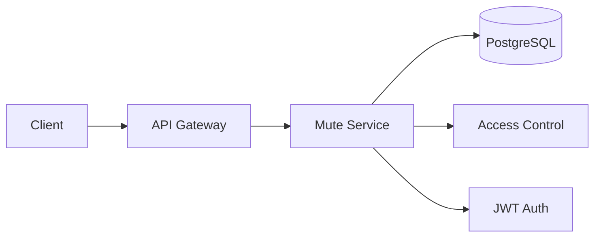
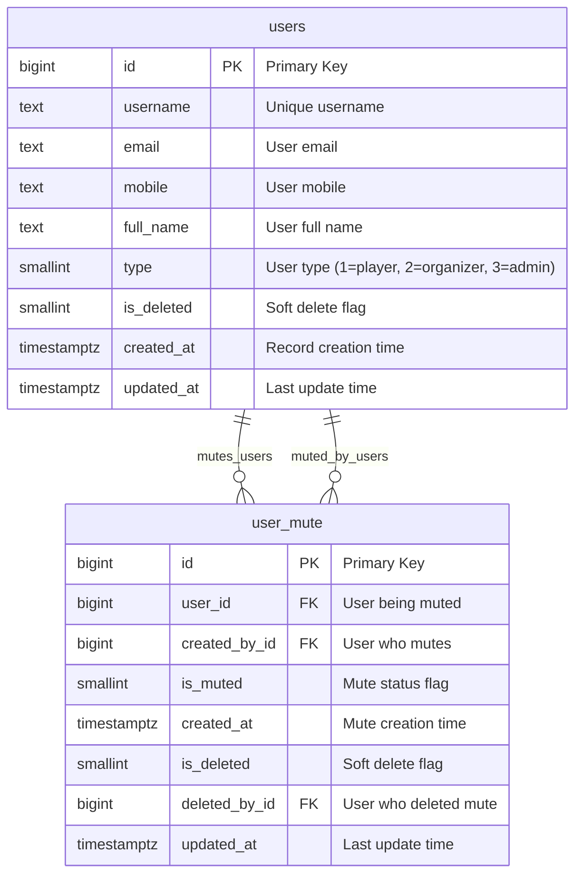
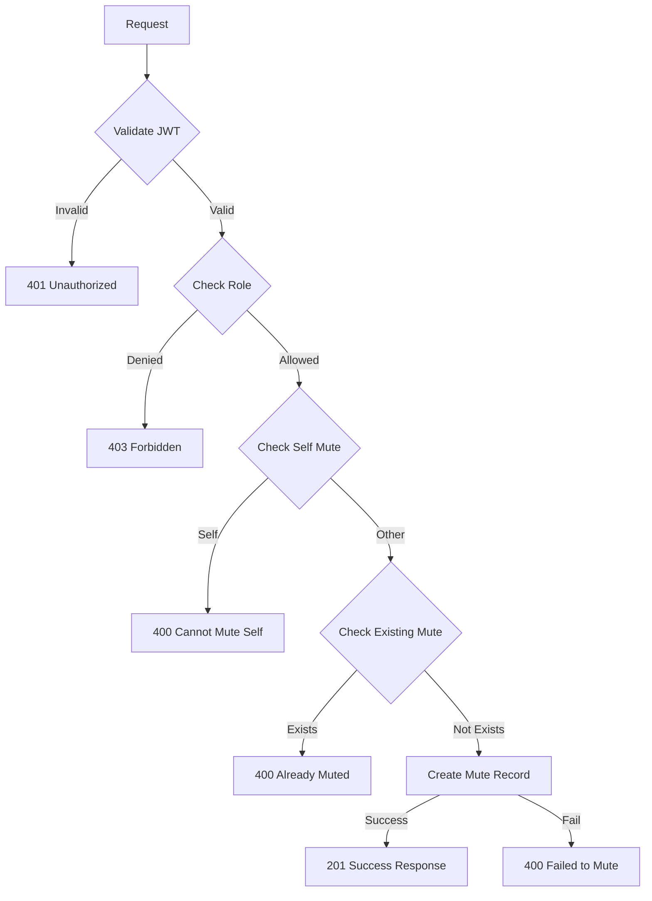
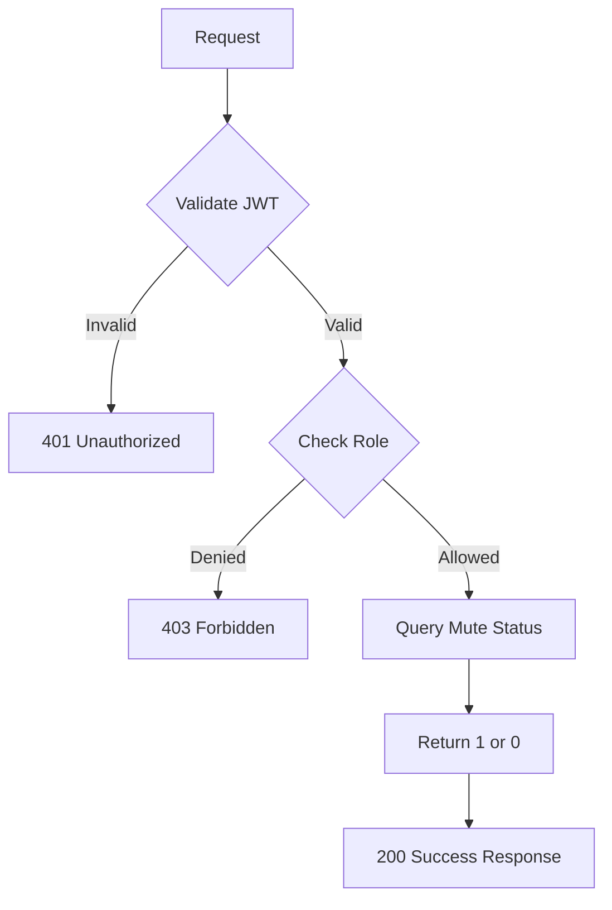
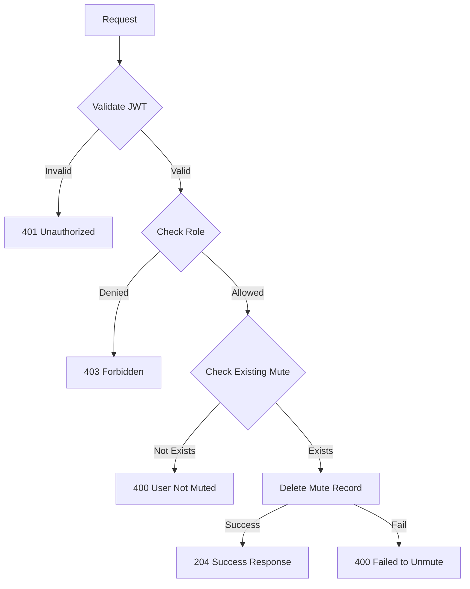

## Overview

The **Mute Service** provides user muting functionality for the Thryl platform, allowing users to mute other users to control their content visibility and interactions. This service enables users to manage their social experience by temporarily hiding content from specific users.

### Tech Stack
- **Backend**: Node.js, Express.js
- **Database**: PostgreSQL
- **Authentication**: JWT
- **Validation**: Joi
- **Access Control**: Role-based permissions

---

## System Architecture



---

## Database Schema



### Relationship Details

| Relationship | Type | Description | Foreign Key |
|--------------|------|-------------|-------------|
| users → user_mute (muting) | One-to-Many | User can mute multiple users | `user_mute.created_by_id` |
| users → user_mute (muted) | One-to-Many | User can be muted by multiple users | `user_mute.user_id` |

### Index Information

| Table | Index Type | Indexed Fields | Purpose |
|-------|------------|----------------|---------|
| user_mute | btree | `created_by_id` | Fast lookup of users muted by a user |
| user_mute | btree | `user_id` | Fast lookup of users who muted a user |
| user_mute | btree | `is_muted` | Filter by mute status |

---

## API Reference

### Authentication
All endpoints require JWT token:
```
Authorization: Bearer <jwt-token>
```

## Base URLs

| Environment   | URL                                 |
|---------------|-------------------------------------|
| Production    | `https://thryl-prod.com   ||    https://thryl-production.zapto.org`      |
| Staging       | `https://thryl-staging.zapto.org` |
| Development   | `http://localhost:3000  || http://localhost:3001`      |

---

### Complete API List

| # | Endpoint | Method | Purpose | Auth Required | Role Required |
|---|----------|--------|---------|---------------|---------------|
| 1 | `/create` | POST | Mute a user | Yes | player |
| 2 | `/read` | GET | Check if user is muted | Yes | player |
| 3 | `/delete` | DELETE | Unmute a user | Yes | player |

---

## API 1: Mute User

**Endpoint**: `POST /create?user_id=123&is_muted=1`

**Purpose**: Mute a specific user to hide their content and interactions

**Headers**:
```
Authorization: Bearer <jwt-token>
```

**Query Parameters**:
- `user_id` (required): ID of user to mute
- `is_muted` (optional): Mute status (0 or 1, default: 0)

**Validation Schema**:
```javascript
{
    userId: Joi.number().optional(),
    muteUserId: Joi.number().optional(),
    is_muted: Joi.number().valid(0, 1).optional().default(0)
}
```

**Success Response** (201):
```json
{
  "status": 1,
  "message": "User muted successfully."
}
```

**Failure Responses**:

#### 400 - Cannot mute yourself
```json
{
  "status": 0,
  "message": "Cannot mute yourself",
  "error_code": "BAD_REQUEST"
}
```

#### 400 - User already muted
```json
{
  "status": 0,
  "message": "User is already muted for this post.",
  "error_code": "BAD_REQUEST"
}
```

**Note**: The error message mentions "for this post" but the mute system is user-based, not post-based. This appears to be a legacy message.

#### 400 - Failed to mute user
```json
{
  "status": 0,
  "message": "Failed to mute user.",
  "error_code": "BAD_REQUEST"
}
```

#### 401 - Unauthorized
```json
{
  "status": 0,
  "message": "User not authenticated",
  "error_code": "UNAUTHORIZED"
}
```

#### 403 - Insufficient permissions
```json
{
  "status": 0,
  "message": "Access denied",
  "error_code": "FORBIDDEN"
}
```

**DFD**:


**Instructions & Business Logic**:
- JWT token required for authentication
- Role: player only
- Cannot mute yourself (userId === muteUserId check)
- Cannot mute the same user twice (checks existing record)
- Creates mute record in user_mute table
- Sets is_muted flag (default: 0)
- Records created_by_id and user_id
- Uses query parameters (not request body)
- Validates is_muted value (0 or 1 only)

**Database Operations**:
- `SELECT * FROM user_mute WHERE created_by_id = $1 AND user_id = $2` (check existing mute)
- `INSERT INTO user_mute (created_by_id, user_id, is_muted) VALUES ($1, $2, $3)` (create mute record)

---

## API 2: Check Mute Status

**Endpoint**: `GET /read?user_id=123`

**Purpose**: Check if a specific user is muted by the authenticated user

**Headers**:
```
Authorization: Bearer <jwt-token>
```

**Query Parameters**:
- `user_id` (required): ID of user to check mute status

**Success Response** (200):
```json
{
  "status": 1,
  "message": 1
}
```

**Response Values**:
- `1`: User is muted
- `0`: User is not muted

**Failure Responses**:

#### 401 - Unauthorized
```json
{
  "status": 0,
  "message": "User not authenticated",
  "error_code": "UNAUTHORIZED"
}
```

#### 403 - Insufficient permissions
```json
{
  "status": 0,
  "message": "Access denied",
  "error_code": "FORBIDDEN"
}
```

**DFD**:


**Instructions & Business Logic**:
- JWT token required for authentication
- Role: player only
- Returns 1 if user is muted, 0 if not muted
- Simple boolean check in database using rowCount
- No error if user doesn't exist (returns 0)
- Uses query parameters (not request body)
- Returns integer value in message field

**Database Operations**:
- `SELECT * FROM user_mute WHERE created_by_id = $1 AND user_id = $2 LIMIT 1` (check mute status)

---

## API 3: Unmute User

**Endpoint**: `DELETE /delete?user_id=123`

**Purpose**: Remove mute status from a previously muted user

**Headers**:
```
Authorization: Bearer <jwt-token>
```

**Query Parameters**:
- `user_id` (required): ID of user to unmute

**Success Response** (204):
```json
{
  "status": 1,
  "message": "User unmuted successfully."
}
```

**Failure Responses**:

#### 400 - User not muted
```json
{
  "status": 0,
  "message": "User is not muted",
  "error_code": "BAD_REQUEST"
}
```

#### 400 - Failed to unmute user
```json
{
  "status": 0,
  "message": "Failed to unmute user.",
  "error_code": "BAD_REQUEST"
}
```

#### 401 - Unauthorized
```json
{
  "status": 0,
  "message": "User not authenticated",
  "error_code": "UNAUTHORIZED"
}
```

#### 403 - Insufficient permissions
```json
{
  "status": 0,
  "message": "Access denied",
  "error_code": "FORBIDDEN"
}
```

**DFD**:


**Instructions & Business Logic**:
- JWT token required for authentication
- Role: player only
- Cannot unmute a user who is not muted (checks existing record first)
- Permanently deletes mute record from database
- Returns 204 No Content on success
- Uses query parameters (not request body)
- Validates mute exists before deletion

**Database Operations**:
- `SELECT * FROM user_mute WHERE created_by_id = $1 AND user_id = $2` (check existing mute)
- `DELETE FROM user_mute WHERE created_by_id = $1 AND user_id = $2` (remove mute record)

---

## Error Handling

### Common Error Codes

| Code | Description | Specific Cases |
|------|-------------|----------------|
| 400 | Bad Request - Invalid input or business logic error | Self-mute, duplicate mute, user not muted, failed operations |
| 401 | Unauthorized - Missing or invalid JWT | Missing or invalid authorization header |
| 403 | Forbidden - Insufficient permissions | Non-player role access |
| 500 | Internal Server Error - Server error | Database connection issues, unexpected errors |

### Error Response Format
```json
{
  "status": 0,
  "message": "Error description",
  "error_code": "ERROR_TYPE"
}
```

### Specific Error Messages
- "Cannot mute yourself" - When userId === muteUserId
- "User is already muted for this post." - When duplicate mute attempt
- "User is not muted" - When trying to unmute non-muted user
- "Failed to mute user." - When database insert fails
- "Failed to unmute user." - When database delete fails

---

## Rate Limiting

- **Mute Operations**: 10 requests per minute per user
- **Read Operations**: 50 requests per minute per user

---

## Security Considerations

1. **JWT Authentication**: All endpoints require valid JWT tokens
2. **Role-based Access**: Only players can perform mute operations
3. **Self-mute Prevention**: Users cannot mute themselves
4. **Duplicate Prevention**: Users cannot mute the same person twice
5. **Existence Validation**: Cannot unmute users who are not muted
6. **Input Validation**: All inputs validated using Joi schemas

---

## Business Logic Rules

### Mute Rules
1. **Self-mute Prevention**: Users cannot mute themselves (userId === muteUserId check)
2. **Duplicate Prevention**: Users cannot mute the same person multiple times (checks existing record)
3. **Role Restriction**: Only players can mute/unmute users
4. **Existence Check**: Cannot unmute users who are not currently muted
5. **Parameter Validation**: is_muted must be 0 or 1 only
6. **Query-based**: All operations use query parameters, not request body

### Mute Effects
1. **Content Visibility**: Muted users' content is hidden from the muting user
2. **Interaction Control**: Muting prevents direct interactions
3. **Temporary Nature**: Mutes can be removed at any time
4. **One-way Relationship**: Muting is not reciprocal

---

## Monitoring & Logging

- All mute operations logged with user IDs and timestamps
- Failed mute attempts tracked for security monitoring
- Unmute operations logged for audit trail
- Rate limit violations monitored
- Authentication failures tracked

---

## Integration Examples

### Mobile App Integration
```javascript
// Mute a user
const response = await fetch('/create?user_id=123&is_muted=1', {
  method: 'POST',
  headers: { 'Authorization': 'Bearer ' + token }
});

const { message } = await response.json();
```

### Web App Integration
```javascript
// Check if user is muted
const response = await fetch('/read?user_id=123', {
  headers: { 'Authorization': 'Bearer ' + token }
});

const { message: isMuted } = await response.json();
// isMuted will be 1 if muted, 0 if not muted
```

### Unmute Integration
```javascript
// Unmute a user
const response = await fetch('/delete?user_id=123', {
  method: 'DELETE',
  headers: { 'Authorization': 'Bearer ' + token }
});

const { message } = await response.json();
```

---

## Use Cases

### Content Moderation
Users can mute other users whose content they find inappropriate or unwanted, providing a self-moderation tool.

### Social Experience Control
Players can customize their social experience by muting users they don't want to interact with.

### Temporary Blocking
Unlike permanent blocks, mutes can be easily reversed, allowing for temporary content filtering.

### Privacy Management
Users can mute others to control what content appears in their feeds and notifications.

---

## Database Operations Summary

| Operation | Table | Query Type | Purpose | Query Details |
|-----------|-------|------------|---------|---------------|
| Check Mute | user_mute | SELECT | Verify if user is already muted | `WHERE created_by_id = $1 AND user_id = $2` |
| Create Mute | user_mute | INSERT | Create new mute relationship | `(created_by_id, user_id, is_muted) VALUES ($1, $2, $3)` |
| Read Mute | user_mute | SELECT | Check mute status | `WHERE created_by_id = $1 AND user_id = $2 LIMIT 1` |
| Delete Mute | user_mute | DELETE | Remove mute relationship | `WHERE created_by_id = $1 AND user_id = $2` |

---

## Performance Considerations

- **Indexed Queries**: All mute operations use indexed fields for fast lookups
- **Minimal Data**: Mute table contains only essential fields
- **Efficient Checks**: Simple boolean checks for mute status using rowCount
- **Soft Delete**: Supports soft deletion for audit trails
- **LIMIT 1**: Read operations use LIMIT 1 for efficiency
- **Parameterized Queries**: All queries use parameterized statements for security

## Implementation Details

### Controller Layer
- Uses `catchAsync` wrapper for error handling
- Extracts parameters from `req.query` (query parameters)
- Extracts user ID from `req.user.id` (JWT token)
- Returns appropriate HTTP status codes (201, 200, 204)

### Service Layer
- Implements business logic validation
- Uses parameterized SQL queries
- Handles both ApiError and generic errors
- Returns structured response objects

### Validation Layer
- Joi schema validation for request parameters
- Optional fields with defaults
- Numeric validation for user IDs and mute status 