```mermaid
graph TD
    A[Request] --> B{Validate JWT}
    B -->|Invalid| C[401 Unauthorized]
    B -->|Valid| D[Extract Request Data]
    D --> E[Determine Notification Type]
    E -->|user_notification| F[Check Follow Notification]
    E -->|tournament_notification| G[Update Tournament Notification]
    E -->|team_notification| H[Update Team Notification]
    F -->|is_following| I[Update Follow Notification]
    F -->|not_following| J[Update User Notification]
    I --> K[200 Success Response]
    J --> K
    G --> K
    H --> K
    E -->|invalid| L[400 Invalid Request Type]
```

## Overview

The **Notification Service** provides comprehensive notification management functionality for the Thryl platform, including reading notifications, updating notification read status, and logging notification clicks. This service handles multiple types of notifications (user activity, team, tournament, follow) and provides unified access to all user notifications with filtering and pagination capabilities.

### Tech Stack
- **Backend**: Node.js, Express.js
- **Database**: PostgreSQL
- **Authentication**: JWT
- **Validation**: Joi
- **Authorization**: Role-based access control

---

## System Architecture


---

## Database Schema


## Table Relationship Graph


### Relationship Details

| Relationship | Type | Description | Foreign Key |
|--------------|------|-------------|-------------|
| users → user_notification | One-to-Many | User can receive multiple user notifications | `user_notification.user_id` |
| users → team_notification | One-to-Many | User can receive multiple team notifications | `team_notification.user_id` |
| users → tournament_notification | One-to-Many | User can receive multiple tournament notifications | `tournament_notification.user_id` |
| users → follow_notification | One-to-Many | User can receive multiple follow notifications | `follow_notification.user_id` |
| users → notification_clicked_log | One-to-Many | User can log multiple notification clicks | `notification_clicked_log.created_by_id` |
| team → team_notification | One-to-Many | Team can have multiple notifications | `team_notification.team_id` |
| tournament → tournament_notification | One-to-Many | Tournament can have multiple notifications | `tournament_notification.tournament_id` |
| game → team | One-to-Many | Game can have multiple teams | `team.game_id` |
| game_mapping_type → team | One-to-Many | Game mapping can apply to multiple teams | `game_mapping_type.game_id` |
| tournament_meta → tournament | One-to-Many | Tournament can have multiple meta records | `tournament_meta.tournament_id` |

### Index Information

| Table | Index Type | Indexed Fields | Purpose |
|-------|------------|----------------|---------|
| user_notification | btree | `user_id, created_at` | User notification queries |
| user_notification | btree | `is_read` | Read status filtering |
| team_notification | btree | `user_id, created_at` | Team notification queries |
| team_notification | btree | `team_id` | Team-specific notifications |
| tournament_notification | btree | `user_id, created_at` | Tournament notification queries |
| tournament_notification | btree | `tournament_id` | Tournament-specific notifications |
| follow_notification | btree | `user_id, created_at` | Follow notification queries |
| follow_notification | btree | `created_by_id` | Follow relationship queries |
| notification_clicked_log | btree | `created_by_id, created_at` | Click log queries |
| notification_clicked_log | btree | `category` | Category-based filtering |

---

## Base URLs

| Environment   | URL                                 |
|---------------|-------------------------------------|
| Production    | `https://thryl-prod.com   ||    https://thryl-production.zapto.org`      |
| Staging       | `https://thryl-staging.zapto.org` |
| Development   | `http://localhost:3000  || http://localhost:3001`      |

---

## Authentication

All Notification Service APIs require JWT authentication. Include the token in the Authorization header:

```http
Authorization: Bearer <your-jwt-token>
```

---

## Authorization

| Role         | Permissions                                      |
|--------------|--------------------------------------------------|
| **All Users**| Read own notifications, update read status, log clicks |

---

## API Reference

### Complete API List

| # | Endpoint                    | Method | Purpose                                 | Auth Required | Role Required         |
|---|-----------------------------|--------|-----------------------------------------|---------------|----------------------|
| 1 | `/read`                     | GET    | Get user notifications                  | Yes           | All authenticated users |
| 2 | `/update-notification-read` | PUT    | Update notification read status         | Yes           | All authenticated users |
| 3 | `/log-click`                | POST   | Log notification click                  | Yes           | All authenticated users |

---

## Validation Schemas

### Update Notification Read Schema
```javascript
{
  notification_id: Joi.number().integer().required(),
  request_type: Joi.string().valid('user_notification', 'team_notification', 'tournament_notification').required(),
  is_read: Joi.number().integer().valid(0, 1).required()
}
```

### Log Notification Click Schema
```javascript
{
  category: Joi.string().valid('user_activity', 'team', 'tournament', 'follow').required()
}
```

---

## API Endpoints

### 1. Get Notifications

Retrieves user notifications with filtering by type and pagination.

**Endpoint:** `GET /notification/read`

**Authorization:** All authenticated users

**Query Parameters:**
- `request_type` (optional): Filter by notification type (`all`, `user_notification`, `team_notification`, `tournament_notification`, `follow_notification`)
- `page` (optional): Page number (default: 1)
- `limit` (optional): Items per page (default: 10)

**Example Request:**
```http
GET /notification/read?request_type=all&page=1&limit=5
```

**Success Response (200):**
```json
{
  "status": 1,
  "data": [
    {
      "notification_id": 123,
      "notification_type": "following",
      "notification_created_at": "2024-01-15T10:30:00Z",
      "user_id": 456,
      "username": "john_doe",
      "profile": "https://example.com/profile.jpg",
      "image_cover": "https://example.com/cover.jpg",
      "name": "John Doe",
      "created_by_id": 789,
      "created_by_username": "jane_smith",
      "created_by_profile": "https://example.com/jane.jpg",
      "created_by_image_cover": "https://example.com/jane-cover.jpg",
      "created_by_name": "Jane Smith",
      "category": "follow"
    },
    {
      "notification_id": 124,
      "notification_type": "team_invite",
      "notification_created_at": "2024-01-15T09:30:00Z",
      "team_id": 101,
      "name": "Team Alpha",
      "description": "Professional gaming team",
      "logo_url": "https://example.com/team-logo.png",
      "game_title": "Battle Royale",
      "game_description": "Epic battle game",
      "game_image_url": "https://example.com/game.jpg",
      "substitute": "substitute_type",
      "member": "member_type",
      "game_type": "tournament",
      "game_id": 201,
      "category": "team"
    },
    {
      "notification_id": 125,
      "notification_type": "tournament_start",
      "notification_created_at": "2024-01-15T08:30:00Z",
      "tournament_id": 301,
      "title": "Tournament Start",
      "description": "Your tournament is starting soon",
      "tournament_image_url": "https://example.com/tournament.jpg",
      "organizer_image_url": "https://example.com/organizer.jpg",
      "category": "tournament"
    },
    {
      "notification_id": 126,
      "notification_type": "get_referred",
      "notification_created_at": "2024-01-15T07:30:00Z",
      "user_id": 456,
      "username": "john_doe",
      "profile": "https://example.com/profile.jpg",
      "image_cover": "https://example.com/cover.jpg",
      "name": "John Doe",
      "category": "user_activity"
    }
  ],
  "offset": 0,
  "limit": 5
}
```

**Error Response (400):**
```json
{
  "status": 0,
  "message": "Internal server error"
}
```

**Error Response (401):**
```json
{
  "status": 0,
  "message": "User not authenticated"
}
```

**DFD:**


#### Business Logic

1. **Authentication**: Validates user authentication
2. **Type Filtering**: Supports filtering by notification type or retrieves all types
3. **Multi-Table Queries**: Queries different notification tables based on type
4. **Data Enrichment**: Joins with related tables to provide complete notification data
5. **Smart Sorting**: Sorts all notifications by creation date (newest first)
6. **Pagination**: Applies offset and limit after sorting

#### Database Operations

```sql
-- User Notifications Query
SELECT 
    fn.*, 
    fn.type AS notification_type, 
    fn.id AS notification_id, 
    fn.created_at AS notification_created_at,
    u1.id AS user_id, 
    u1.username AS username, 
    COALESCE(
        CASE 
            WHEN fn.type IN ('get_referred', 'refer') THEN u2.profile_pic_url 
            ELSE u1.profile_pic_url 
        END,
        u1.profile_pic_url
    ) AS profile,
    COALESCE(
        CASE 
            WHEN fn.type IN ('get_referred', 'refer') THEN u2.image_cover_url 
            ELSE u1.image_cover_url 
        END,
        u1.image_cover_url
    ) AS image_cover,
    u1.full_name AS name
FROM user_notification fn
LEFT JOIN users u1 ON fn.user_id = u1.id
LEFT JOIN users u2 ON fn.created_by_id = u2.id
WHERE fn.user_id = $1
ORDER BY fn.created_at DESC;

-- Team Notifications Query
SELECT DISTINCT ON (n.id) n.*, 
    n.type AS notification_type, n.id AS notification_id, n.created_at AS notification_created_at, 
    t.id AS team_id, t.*, 
    game.title AS game_title, game.description AS game_description, game.image_url AS game_image_url, 
    gtm.substitute, gtm.member, gtm.type AS game_type, gtm.game_id
FROM team_notification n 
LEFT JOIN team t ON n.team_id = t.id 
LEFT JOIN game ON t.game_id = game.id 
LEFT JOIN game_mapping_type gtm ON t.game_id = gtm.game_id 
WHERE n.user_id = $1 
ORDER BY n.id DESC, n.created_at DESC;

-- Tournament Notifications Query
SELECT tn.*,
    tn.type AS notification_type, tn.id AS notification_id, tn.created_at AS notification_created_at, 
    t.image_url AS tournament_image_url, tm.image_url AS organizer_image_url
FROM tournament_notification tn 
LEFT JOIN tournament t ON tn.tournament_id = t.id 
LEFT JOIN tournament_meta tm ON tn.tournament_id = tm.tournament_id AND tm.type = 'organizer' 
WHERE tn.user_id = $1 AND tn.is_deleted IS DISTINCT FROM 1
ORDER BY tn.created_at DESC;

-- Follow Notifications Query
SELECT fn.*, 
    fn.type AS notification_type, fn.id AS notification_id, fn.created_at AS notification_created_at,
    u1.id AS user_id, u1.username AS username, u1.profile_pic_url AS profile,
    u1.image_cover_url AS image_cover, u1.full_name AS name,
    u2.id AS created_by_id, u2.username AS created_by_username, u2.profile_pic_url AS created_by_profile,
    u2.image_cover_url AS created_by_image_cover, u2.full_name AS created_by_name
FROM follow_notification fn
LEFT JOIN users u1 ON fn.user_id = u1.id
LEFT JOIN users u2 ON fn.created_by_id = u2.id
WHERE fn.user_id = $1
ORDER BY fn.created_at DESC;
```

---

### 2. Update Notification Read Status

Updates the read status of a specific notification.

**Endpoint:** `PUT /notification/update-notification-read`

**Authorization:** All authenticated users

**Request Body:**
```json
{
  "notification_id": 123,
  "request_type": "user_notification",
  "is_read": 1
}
```

**Success Response (200):**
```json
{
  "status": 1,
  "message": "Notification status updated successfully"
}
```

**Error Response (400):**
```json
{
  "status": 0,
  "message": "Invalid requestType"
}
```

**Error Response (401):**
```json
{
  "status": 0,
  "message": "User not authenticated"
}
```

**DFD:**


#### Business Logic

1. **Type Validation**: Validates the request type parameter
2. **Smart Table Selection**: Automatically determines the correct notification table
3. **Follow Notification Handling**: Special handling for follow notifications in user_notification table
4. **User Authorization**: Ensures user can only update their own notifications
5. **Status Update**: Updates the `is_read` flag for the specified notification

#### Database Operations

```sql
-- For user_notification (with follow notification check)
SELECT * FROM follow_notification WHERE id = $1 AND user_id = $2;

-- Update based on notification type
UPDATE user_notification SET is_read = $1 WHERE id = $2 AND user_id = $3;
UPDATE follow_notification SET is_read = $1 WHERE id = $2 AND user_id = $3;
UPDATE tournament_notification SET is_read = $1 WHERE id = $2 AND user_id = $3;
UPDATE team_notification SET is_read = $1 WHERE id = $2 AND user_id = $3;
```

---

### 3. Log Notification Click

Logs when a user clicks on a notification for analytics and tracking purposes.

**Endpoint:** `POST /notification/log-click`

**Authorization:** All authenticated users

**Request Body:**
```json
{
  "category": "user_activity"
}
```

**Success Response (200):**
```json
{
  "status": 1,
  "message": "Notification click logged successfully",
  "data": {
    "id": 456,
    "created_by_id": 123,
    "category": "user_activity",
    "created_at": "2024-01-15T10:30:00Z",
    "updated_at": "2024-01-15T10:30:00Z"
  }
}
```

**Error Response (400):**
```json
{
  "status": 0,
  "message": "Category is required"
}
```

**DFD:**


#### Business Logic

1. **Category Validation**: Validates the notification category
2. **User Tracking**: Associates click with the authenticated user
3. **Analytics Data**: Stores click data for user behavior analysis
4. **Timestamp Recording**: Automatically records click timestamp

#### Database Operations

```sql
INSERT INTO notification_clicked_log (created_by_id, category) VALUES ($1, $2) RETURNING *;
```

---

## Rate Limiting

| Endpoint                | Rate Limit | Window      |
|-------------------------|------------|-------------|
| All Notification APIs   | 100        | 15 minutes  |

---

## Security Considerations

### Authentication
- JWT token validation on all endpoints
- Token expiration handling
- Secure token transmission

### Authorization
- Users can only access their own notifications
- Users can only update their own notification read status
- Users can only log their own notification clicks

### Input Validation
- Request body validation using Joi schemas
- Query parameter validation
- SQL injection prevention through parameterized queries
- Category validation for click logging

### Data Protection
- Sensitive data filtering in responses
- User-specific data isolation
- Secure database queries with proper joins

---

## Business Rules

### Notification Retrieval
1. Users can only view their own notifications
2. Notifications are sorted by creation date (newest first)
3. Support for filtering by notification type
4. Pagination is applied after sorting all notifications
5. Data enrichment from related tables

### Notification Status Updates
1. Users can only update their own notification read status
2. Smart table selection based on notification type
3. Special handling for follow notifications
4. Validation of request type parameter

### Click Logging
1. All notification clicks are logged for analytics
2. Category validation ensures data quality
3. User association for tracking purposes
4. Timestamp recording for temporal analysis

### Data Integrity
1. Foreign key relationships are maintained
2. Soft delete flags prevent accidental data loss
3. Audit trails track notification interactions
4. Data sanitization removes sensitive information

---

## Monitoring & Logging

### Metrics to Monitor
- API response times
- Error rates by endpoint
- Database query performance
- Notification retrieval patterns
- Click logging success rates

### Logging
- Request/response logging
- Error logging with stack traces
- Database operation logging
- Notification interaction logging
- Click analytics logging

### Alerts
- High error rates (>5%)
- Slow response times (>2s)
- Database connection issues
- Failed notification operations
- Click logging failures

---

## Integration Examples

### Frontend Integration

```javascript
// Get user notifications
const getNotifications = async (requestType = 'all', page = 1, limit = 10) => {
  const params = new URLSearchParams({
    request_type: requestType,
    page: page.toString(),
    limit: limit.toString()
  });
  
  const response = await fetch(`/api/v1/notification/read?${params}`, {
    headers: {
      'Authorization': `Bearer ${token}`
    }
  });
  return response.json();
};

// Update notification read status
const updateNotificationRead = async (notificationId, requestType, isRead) => {
  const response = await fetch('/api/v1/notification/update-notification-read', {
    method: 'PUT',
    headers: {
      'Content-Type': 'application/json',
      'Authorization': `Bearer ${token}`
    },
    body: JSON.stringify({
      notification_id: notificationId,
      request_type: requestType,
      is_read: isRead
    })
  });
  return response.json();
};

// Log notification click
const logNotificationClick = async (category) => {
  const response = await fetch('/api/v1/notification/log-click', {
    method: 'POST',
    headers: {
      'Content-Type': 'application/json',
      'Authorization': `Bearer ${token}`
    },
    body: JSON.stringify({
      category: category
    })
  });
  return response.json();
};
```

### Error Handling

```javascript
const handleNotificationOperation = async (operation) => {
  try {
    const result = await operation();
    if (result.status === 1) {
      console.log('Operation successful:', result.data || result.message);
      return result.data || result.message;
    } else {
      console.error('Operation failed:', result.message);
      throw new Error(result.message);
    }
  } catch (error) {
    console.error('Notification operation failed:', error.message);
    // Handle different error types
    if (error.message.includes('not authenticated')) {
      // Handle authentication error
    } else if (error.message.includes('Invalid requestType')) {
      // Handle validation error
    } else if (error.message.includes('Category is required')) {
      // Handle missing category error
    } else {
      // Handle general error
    }
  }
};
```

---

## Use Cases

### 1. Notification Management
- Users view all their notifications in a unified interface
- Filter notifications by type (user activity, team, tournament, follow)
- Mark notifications as read/unread
- Track notification engagement through click logging

### 2. User Experience
- Real-time notification updates
- Personalized notification preferences
- Notification history and analytics
- Cross-platform notification synchronization

### 3. Analytics & Insights
- Track user engagement with notifications
- Analyze notification click patterns
- Monitor notification effectiveness
- Generate user behavior reports

### 4. System Integration
- Integration with other services (user, team, tournament)
- Push notification delivery tracking
- Notification preference management
- Cross-service notification aggregation

---

## Performance Considerations

### Database Optimization
- Indexes on `user_id`, `created_at`, and `is_read` for fast lookups
- Efficient pagination with offset-based queries
- Optimized JOIN operations for data enrichment
- Proper indexing on notification type fields

### Query Optimization
- Use parameterized queries for security
- Limit result sets with pagination
- Efficient filtering by notification type
- Optimized data aggregation and sorting

### Caching Strategy
- Consider caching frequently accessed notifications
- Cache user notification preferences
- Implement cache invalidation on updates
- Cache notification metadata for faster retrieval

---

## Testing Scenarios

### Unit Tests
- Notification retrieval functionality
- Read status update functionality
- Click logging functionality
- Error handling for invalid inputs

### Integration Tests
- End-to-end notification flow
- Authentication and authorization
- Database consistency
- API response validation

### Performance Tests
- Load testing with multiple concurrent users
- Database query performance
- Pagination performance
- Memory usage optimization

### Security Tests
- SQL injection prevention
- JWT token validation
- User data isolation
- Input sanitization
- Authorization validation

--- 