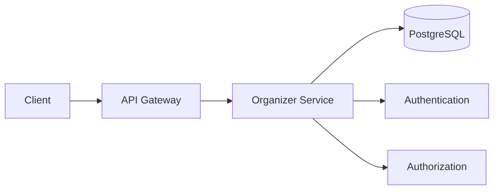
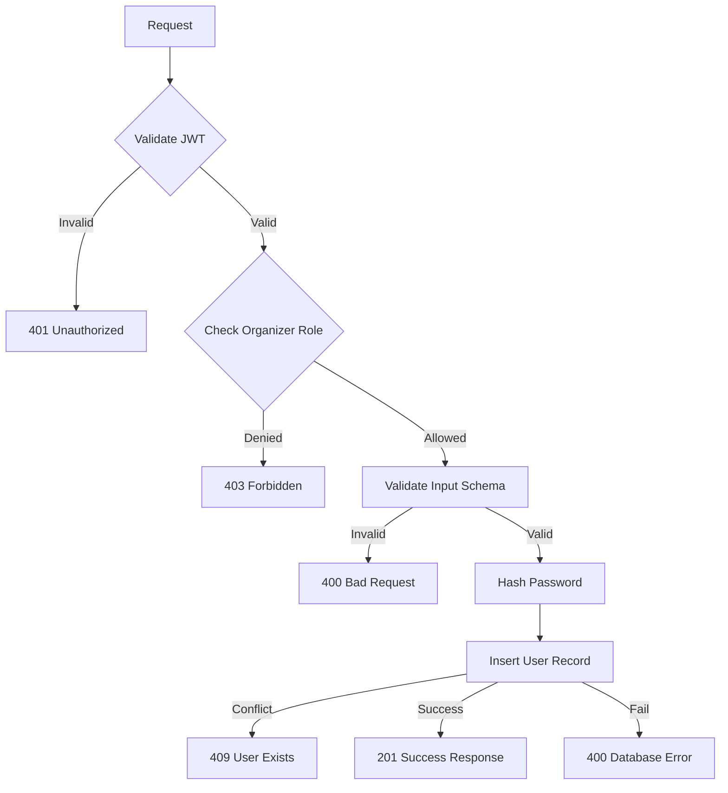
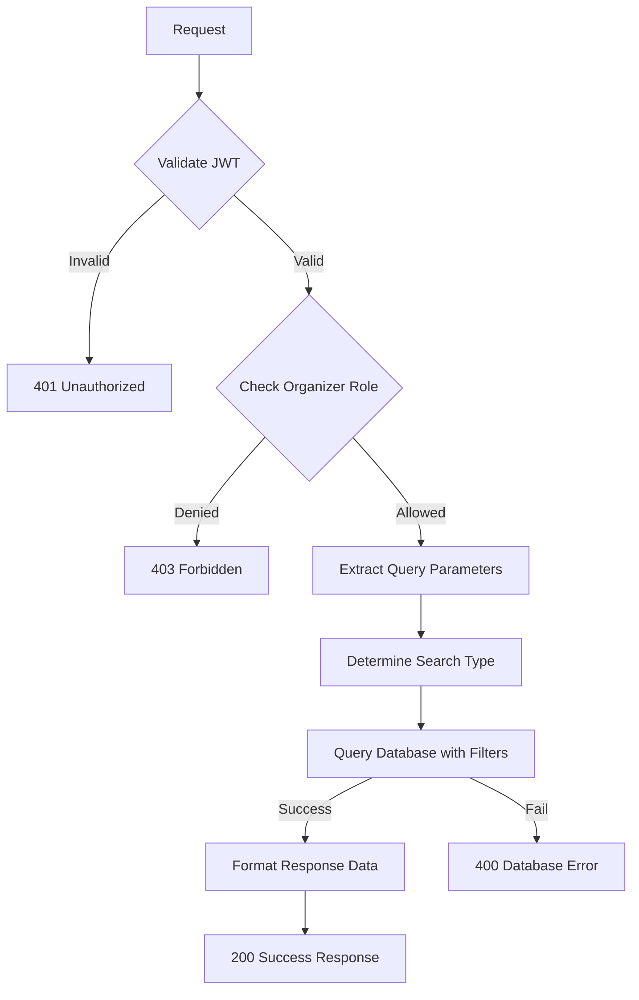
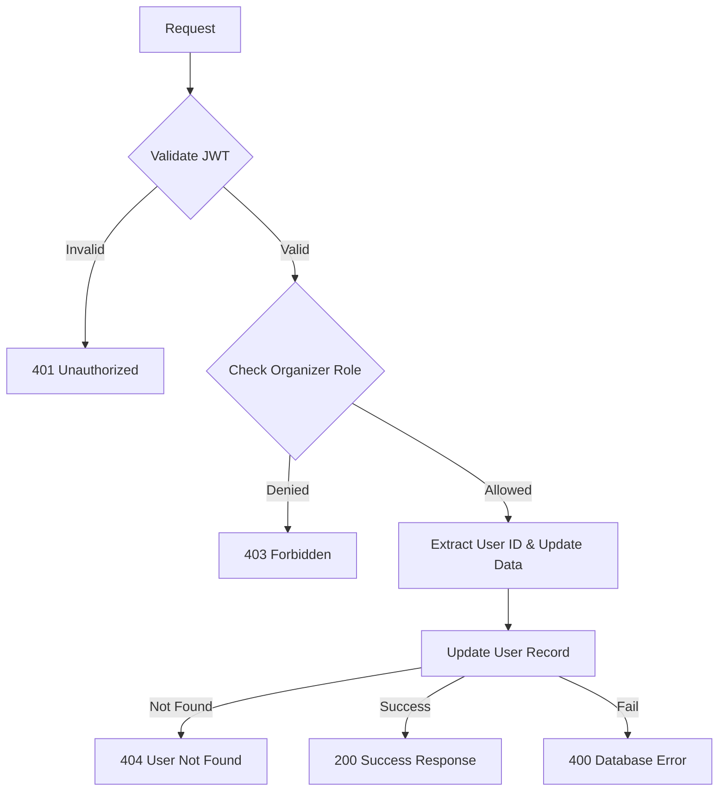
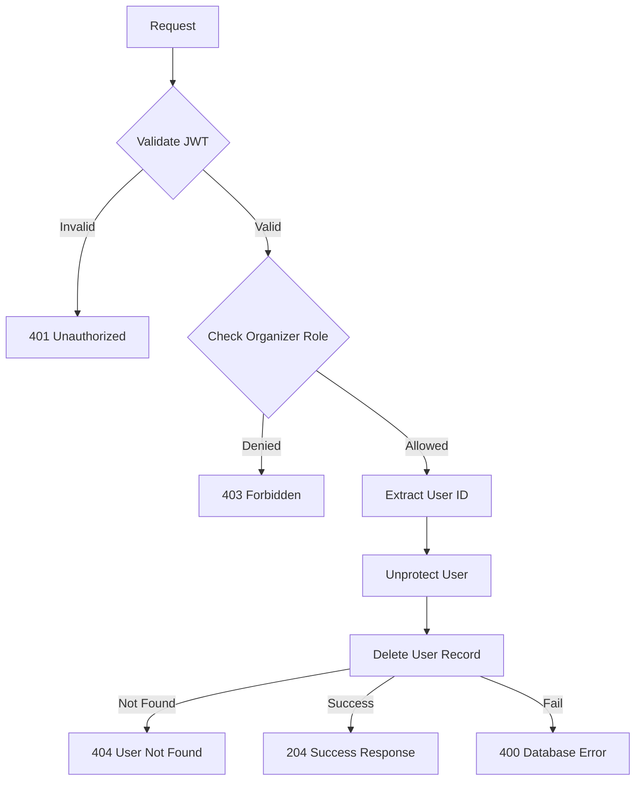
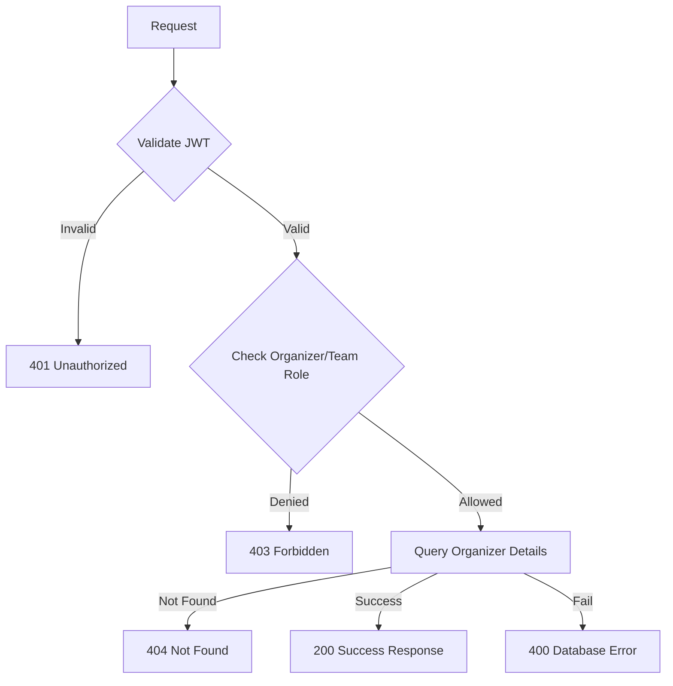
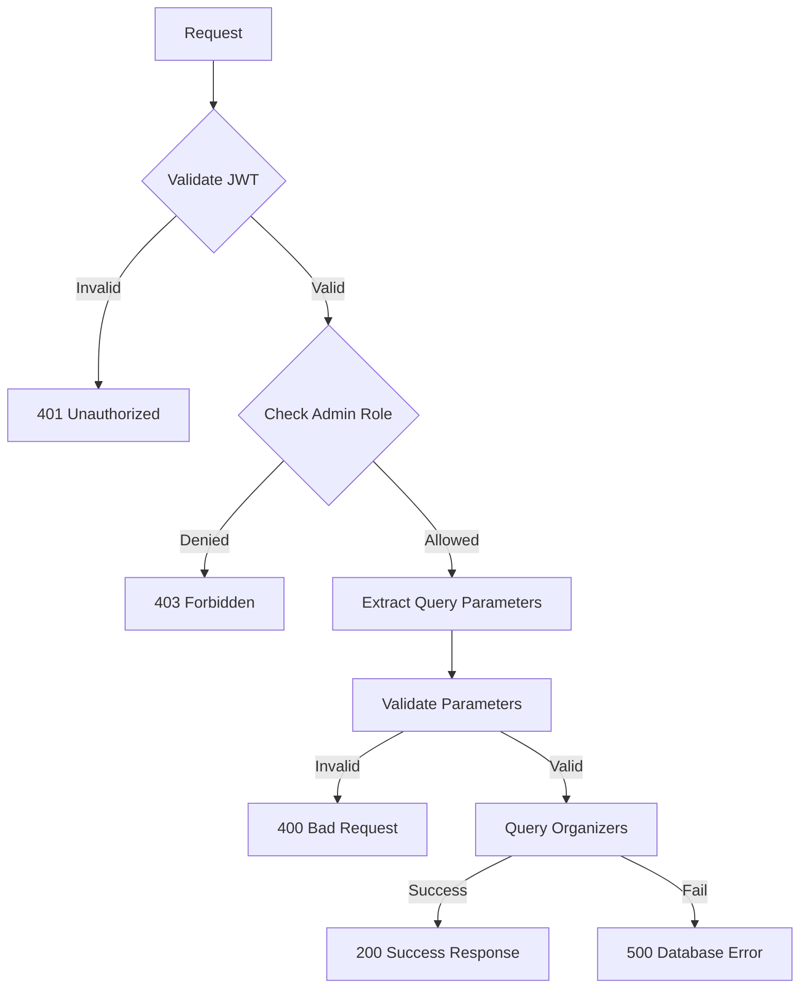

## Overview

The **Organizer Service** enables organizers to manage their teams and organizational profiles on the Thryl platform. Organizers can create, read, update, and delete team members, as well as view and update their own organization details. This service is essential for tournament organizers and organizations to efficiently manage their teams and organizational data.

### Tech Stack
- **Backend**: Node.js, Express.js
- **Database**: PostgreSQL
- **Authentication**: JWT
- **Validation**: Joi
- **Authorization**: Role-based access control

---

## System Architecture



---

## Database Schema

```mermaid
erDiagram
    users ||--o{ users : "creates_users"
    users ||--o{ users : "deletes_users"
    users ||--o{ user_notification : "receives_notifications"
    users ||--o{ team : "owns_teams"
    users ||--o{ team_member : "team_memberships"
    users ||--o{ follow : "follows_users"
    users ||--o{ follow : "followed_by_users"
    users ||--o{ block_user : "blocks_users"
    users ||--o{ block_user : "blocked_by_users"
    users ||--o{ mute_user : "mutes_users"
    users ||--o{ mute_user : "muted_by_users"
    users ||--o{ game_join : "joins_games"
    users ||--o{ follow_notification : "follow_notifications"
    users ||--o{ team_notification : "team_notifications"

    users {
        bigint id PK "Primary Key"
        text username "Unique username"
        text email "User email"
        text mobile "User mobile"
        text password "Hashed password"
        text full_name "User full name"
        text bio "User bio"
        date date_of_birth "Date of birth"
        text google_id "Google OAuth ID"
        text apple_id "Apple Sign-In ID"
        text profile_pic_url "Profile picture URL"
        text image_cover_url "Cover image URL"
        text video_url "Video URL"
        text device_token "Push notification token"
        smallint is_active "Account active status"
        smallint is_deleted "Soft delete flag"
        smallint is_protected "Protected account flag"
        smallint type "User type (1=player, 2=organizer, 3=admin)"
        smallint is_account_notification "Account notification preference"
        smallint is_team_invite_notification "Team invite notification preference"
        smallint is_start_follow_notification "Follow notification preference"
        smallint is_tournament_notification "Tournament notification preference"
        text organization_name "Organization name"
        text address "Address"
        text logo_url "Logo URL"
        text document_url "Document URL"
        text poc_name "Point of contact name"
        text poc_email "Point of contact email"
        text poc_phone "Point of contact phone"
        text website_url "Website URL"
        text facebook_url "Facebook URL"
        text instagram_url "Instagram URL"
        text twitter_url "Twitter URL"
        text linkedin_url "LinkedIn URL"
        text youtube_url "YouTube URL"
        text discord_url "Discord URL"
        smallint is_profile_completed "Profile completion status"
        smallint is_first_signup "First signup flag"
        text referral_code "Unique referral code"
        bigint referred_by_id FK "Referrer user ID"
        text app_version "App version"
        text flag "Additional flags"
        timestamptz created_at "Record creation time"
        timestamptz updated_at "Last update time"
        timestamptz last_login_at "Last login time"
        timestamptz logout_at "Logout time"
        timestamptz deletion_at "Deletion time"
        bigint created_by_id FK "User who created record"
        bigint deleted_by_id FK "User who deleted record"
    }
    
    user_notification {
        bigint id PK "Primary Key"
        bigint user_id FK "User who receives notification"
        text type "Notification type"
        smallint is_read "Read status flag"
        text title "Notification title"
        text description "Notification description"
        timestamptz created_at "Notification creation time"
        bigint created_by_id FK "User who created notification"
        smallint is_deleted "Soft delete flag"
        bigint deleted_by_id FK "User who deleted notification"
        timestamptz updated_at "Last update time"
    }
    
    team {
        bigint id PK "Primary Key"
        text name "Team name"
        text description "Team description"
        text logo_url "Team logo URL"
        bigint owner_id FK "Team owner"
        bigint created_by_id FK "User who created team"
        timestamptz created_at "Team creation time"
        smallint is_deleted "Soft delete flag"
        timestamptz updated_at "Last update time"
    }
    
    team_member {
        bigint id PK "Primary Key"
        bigint team_id FK "Team ID"
        bigint user_id FK "User ID"
        text role "Member role"
        timestamptz created_at "Member creation time"
        smallint is_deleted "Soft delete flag"
        timestamptz updated_at "Last update time"
    }
    
    follow {
        bigint id PK "Primary Key"
        bigint user_id FK "User being followed"
        bigint created_by_id FK "User who follows"
        timestamptz created_at "Follow creation time"
        smallint is_deleted "Soft delete flag"
        timestamptz updated_at "Last update time"
    }
    
    block_user {
        bigint id PK "Primary Key"
        bigint user_id FK "User being blocked"
        bigint created_by_id FK "User who blocks"
        timestamptz created_at "Block creation time"
        smallint is_deleted "Soft delete flag"
        timestamptz updated_at "Last update time"
    }
    
    mute_user {
        bigint id PK "Primary Key"
        bigint user_id FK "User being muted"
        bigint created_by_id FK "User who mutes"
        timestamptz created_at "Mute creation time"
        smallint is_deleted "Soft delete flag"
        timestamptz updated_at "Last update time"
    }
    
    game_join {
        bigint id PK "Primary Key"
        bigint game_id FK "Game being joined"
        bigint created_by_id FK "User who joins"
        text status "Join status"
        timestamptz created_at "Join creation time"
        smallint is_deleted "Soft delete flag"
        timestamptz updated_at "Last update time"
    }
    
    follow_notification {
        bigint id PK "Primary Key"
        bigint user_id FK "User who receives notification"
        bigint created_by_id FK "User who triggered notification"
        text type "Notification type"
        timestamptz created_at "Notification creation time"
        smallint is_deleted "Soft delete flag"
        timestamptz updated_at "Last update time"
    }
    
    team_notification {
        bigint id PK "Primary Key"
        bigint user_id FK "User who receives notification"
        bigint created_by_id FK "User who triggered notification"
        text type "Notification type"
        timestamptz created_at "Notification creation time"
        smallint is_deleted "Soft delete flag"
        timestamptz updated_at "Last update time"
    }
```



## Table Relationship Graph

```mermaid
graph TD
    A[users Table] -->|creates| B[users Table]
    A -->|deletes| B
    A -->|creates| C[user_notification Table]
    A -->|owns| D[team Table]
    A -->|member_of| E[team_member Table]
    A -->|follows| F[follow Table]
    A -->|blocks| G[block_user Table]
    A -->|mutes| H[mute_user Table]
    A -->|joins| I[game_join Table]
    A -->|receives| J[follow_notification Table]
    A -->|receives| K[team_notification Table]
    
    subgraph "users Table"
        A1[users.id PK]
        A2[users.created_by_id FK]
        A3[users.deleted_by_id FK]
    end
    
    subgraph "Related Tables"
        B1[user_notification.user_id FK]
        C1[team.owner_id FK]
        D1[team_member.user_id FK]
        E1[follow.user_id FK]
        F1[block_user.user_id FK]
        G1[mute_user.user_id FK]
        H1[game_join.created_by_id FK]
    end
    
    A1 -.->|references| B1
    A1 -.->|references| C1
    A1 -.->|references| D1
    A1 -.->|references| E1
    A1 -.->|references| F1
    A1 -.->|references| G1
    A1 -.->|references| H1
```



### Relationship Details

| Relationship | Type | Description | Foreign Key |
|--------------|------|-------------|-------------|
| users → users (creation) | One-to-Many | Organizer can create multiple team members | `users.created_by_id` |
| users → users (deletion) | One-to-Many | Organizer can delete multiple team members | `users.deleted_by_id` |
| users → user_notification | One-to-Many | User can receive multiple notifications | `user_notification.user_id` |
| users → team (ownership) | One-to-Many | User can own multiple teams | `team.owner_id` |
| users → team_member | One-to-Many | User can be member of multiple teams | `team_member.user_id` |
| users → follow (following) | One-to-Many | User can follow multiple users | `follow.created_by_id` |
| users → follow (followers) | One-to-Many | User can be followed by multiple users | `follow.user_id` |
| users → block_user (blocking) | One-to-Many | User can block multiple users | `block_user.created_by_id` |
| users → block_user (blocked) | One-to-Many | User can be blocked by multiple users | `block_user.user_id` |
| users → mute_user (muting) | One-to-Many | User can mute multiple users | `mute_user.created_by_id` |
| users → mute_user (muted) | One-to-Many | User can be muted by multiple users | `mute_user.user_id` |
| users → game_join | One-to-Many | User can join multiple games | `game_join.created_by_id` |
| users → follow_notification | One-to-Many | User can receive multiple follow notifications | `follow_notification.user_id` |
| users → team_notification | One-to-Many | User can receive multiple team notifications | `team_notification.user_id` |

### Index Information

| Table | Index Type | Indexed Fields | Purpose |
|-------|------------|----------------|---------|
| users | btree | `type, email` | Unique email per type |
| users | btree | `type, username` | Unique username per type |
| users | btree | `type, mobile` | Unique mobile per type |
| users | btree | `is_deleted` | Soft delete filtering |
| users | btree | `deletion_at` | Scheduled deletion queries |
| users | btree | `last_login_at` | Activity tracking |
| users | btree | `is_protected` | Protected user filtering |
| users | btree | `created_by_id` | Team member queries |
| user_notification | btree | `user_id, created_at` | User notification queries |
| team | btree | `owner_id` | Team ownership queries |
| team_member | btree | `team_id, user_id` | Team membership queries |
| follow | btree | `user_id, created_by_id` | Follow relationship queries |
| block_user | btree | `user_id, created_by_id` | Block relationship queries |
| mute_user | btree | `user_id, created_by_id` | Mute relationship queries |

---

## Base URLs

| Environment   | URL                                 |
|---------------|-------------------------------------|
| Production    | `https://thryl-prod.com   ||    https://thryl-production.zapto.org`      |
| Staging       | `https://thryl-staging.zapto.org` |
| Development   | `http://localhost:3000  || http://localhost:3001`      |

---

## Authentication

All Organizer Service APIs require JWT authentication. Include the token in the Authorization header:

```http
Authorization: Bearer <your-jwt-token>
```

---

## Authorization

| Role         | Permissions                                      |
|--------------|--------------------------------------------------|
| **Organizer**| Manage team members, view/update organization    |
| **Admin**    | View all organizers                              |

---

## API Reference

### Complete API List

| # | Endpoint                    | Method | Purpose                                 | Auth Required | Role Required         |
|---|-----------------------------|--------|-----------------------------------------|---------------|----------------------|
| 1 | `/create-team`              | POST   | Create a new team member                | Yes           | organizer            |
| 2 | `/team-read`                | GET    | List team members                       | Yes           | organizer            |
| 3 | `/update-team`              | PUT    | Update a team member                    | Yes           | organizer            |
| 4 | `/delete-team`              | DELETE | Delete a team member                    | Yes           | organizer            |
| 5 | `/get-organizer-details`    | GET    | Get organizer details                   | Yes           | organizer, organizer_team |
| 6 | `/all-get`                  | GET    | List all organizers (admin only)        | Yes           | admin                |

---

## Validation Schemas

### Create Team Member Schema
```javascript
{
  email: Joi.string().email().required(),
  type: Joi.number().valid(1,2,3).required(),
  password: Joi.string().optional()
}
```

### Update Team Member Schema
```javascript
{
  username: Joi.string().min(3).max(30),
  email: Joi.string().email(),
  mobile: Joi.string().pattern(/^[0-9+\s-]+$/),
  bio: Joi.string().max(500),
  full_name: Joi.string().max(100),
  date_of_birth: Joi.date(),
  profile_pic_url: Joi.string().uri(),
  image_cover_url: Joi.string().uri(),
  video_url: Joi.string().uri(),
  device_token: Joi.string(),
  is_account_notification: Joi.number().integer().valid(0, 1),
  is_team_invite_notification: Joi.number().integer().valid(0, 1),
  is_start_follow_notification: Joi.number().integer().valid(0, 1),
  is_tournament_notification: Joi.number().integer().valid(0, 1),
  address: Joi.string(),
  website_url: Joi.string().uri(),
  document_url: Joi.string().uri(),
  facebook_url: Joi.string().uri(),
  instagram_url: Joi.string().uri(),
  twitter_url: Joi.string().uri(),
  linkedin_url: Joi.string().uri(),
  youtube_url: Joi.string().uri(),
  discord_url: Joi.string().uri(),
  is_active: Joi.number().integer().valid(0, 1)
}
```

---

## API Endpoints

### 1. Create Team Member

Creates a new team member (user) under the organizer.

**Endpoint:** `POST /organizer/create-team`

**Authorization:** Organizer only

**Request Body:**
```json
{
  "email": "teammember@example.com",
  "type": 1,
  "password": "securepassword123"
}
```

**Success Response (201):**
```json
{
  "status": 1,
  "message": "User created successfully"
}
```

**Error Response (400):**
```json
{
  "status": 0,
  "message": "Invalid input data"
}
```

**Error Response (401):**
```json
{
  "status": 0,
  "message": "Unauthorized access"
}
```

**Error Response (403):**
```json
{
  "status": 0,
  "message": "Access denied. Organizer role required."
}
```

**Error Response (409):**
```json
{
  "status": 0,
  "message": "User teammember@example.com already exists as a Player."
}
```

**DFD:**


#### Business Logic

1. **Input Validation**: Validates email format and user type
2. **Password Hashing**: Securely hashes password using bcrypt
3. **Organizer Association**: Sets `created_by_id` to organizer's user ID
4. **Duplicate Prevention**: Prevents duplicate users with same email and type
5. **User Type Validation**: Ensures valid user type (1=player, 2=organizer, 3=admin)

#### Database Operations

```sql
WITH exists_check AS (SELECT 1 FROM users WHERE type = $1 AND email = $2 LIMIT 1), 
inserted AS (INSERT INTO users (type, email, created_by_id, password)
SELECT $1, $2, $3, $4 WHERE NOT EXISTS (SELECT * FROM exists_check) RETURNING *)
SELECT * FROM inserted;
```

#### Error Handling

- **Validation Errors**: Invalid email format or user type
- **Authentication Errors**: Missing or invalid JWT token
- **Authorization Errors**: Insufficient permissions
- **Conflict Errors**: User already exists with same email and type
- **Database Errors**: Connection issues or constraint violations

---

### 2. List Team Members

Lists all team members created by the organizer, with pagination, type, and keyword search.

**Endpoint:** `GET /organizer/team-read`

**Authorization:** Organizer only

**Query Parameters:**
- `type` (required): User type (1=player, 2=organizer, 3=admin)
- `keyword` (optional): Search by user ID or username
- `page` (optional): Page number (default: 1)
- `limit` (optional): Items per page (default: 10)

**Example Request:**
```http
GET /organizer/team-read?type=1&keyword=john&page=1&limit=5
```

**Success Response (200):**
```json
{
  "status": 1,
  "data": [
    {
      "id": 123,
      "username": "john_doe",
      "email": "john@example.com",
      "type": 1,
      "full_name": "John Doe",
      "bio": "Gaming enthusiast",
      "date_of_birth": "1990-01-15",
      "profile_pic_url": "https://example.com/profile.jpg",
      "organization_name": "OrgName",
      "address": "Mumbai, India",
      "logo_url": "https://example.com/logo.png",
      "document_url": "https://example.com/doc.pdf",
      "poc_name": "POC Name",
      "poc_email": "poc@example.com",
      "poc_phone": "+911234567890",
      "website_url": "https://org.com"
    }
  ]
}
```

**Error Response (400):**
```json
{
  "status": 0,
  "message": "Failed to retrieve team members."
}
```

**DFD:**


#### Business Logic

1. **Authentication**: Validates organizer authentication
2. **Authorization**: Ensures organizer role access
3. **Type Filtering**: Required filtering by user type
4. **Smart Search**: Automatically detects if keyword is numeric (ID) or text (username)
5. **Pagination**: Implements offset-based pagination
6. **Data Sanitization**: Removes sensitive fields (password, etc.) from response

#### Database Operations

```sql
-- Search by ID (if keyword is numeric)
SELECT * FROM users WHERE type = $1 AND created_by_id = $2 AND (id = $3 OR $3 IS NULL);

-- Search by username (if keyword is text)
SELECT * FROM users WHERE type = $1 AND created_by_id = $2 AND (username ILIKE $3 OR $3 IS NULL) ORDER BY id DESC OFFSET $4 LIMIT $5;
```

---

### 3. Update Team Member

Updates a team member's information.

**Endpoint:** `PUT /organizer/update-team`

**Authorization:** Organizer only

**Query Parameters:**
- `user_id` (required): ID of user to update

**Request Body:**
```json
{
  "username": "updated_username",
  "email": "updated@example.com",
  "mobile": "+919876543211",
  "full_name": "Updated Name",
  "bio": "Updated bio information",
  "date_of_birth": "1990-01-15",
  "profile_pic_url": "https://example.com/new-profile.jpg",
  "image_cover_url": "https://example.com/new-cover.jpg",
  "video_url": "https://example.com/new-video.mp4",
  "device_token": "new_fcm_token",
  "is_account_notification": 1,
  "is_team_invite_notification": 1,
  "is_start_follow_notification": 0,
  "is_tournament_notification": 1,
  "address": "New Address",
  "website_url": "https://newwebsite.com",
  "facebook_url": "https://facebook.com/newprofile",
  "instagram_url": "https://instagram.com/newprofile",
  "twitter_url": "https://twitter.com/newprofile",
  "linkedin_url": "https://linkedin.com/in/newprofile",
  "youtube_url": "https://youtube.com/newprofile",
  "discord_url": "https://discord.gg/newprofile",
  "is_active": 1
}
```

**Success Response (200):**
```json
{
  "status": 1,
  "data": {
    "id": 123,
    "username": "updated_username",
    "email": "updated@example.com",
    "mobile": "+919876543211",
    "full_name": "Updated Name",
    "bio": "Updated bio information",
    "date_of_birth": "1990-01-15",
    "profile_pic_url": "https://example.com/new-profile.jpg",
    "image_cover_url": "https://example.com/new-cover.jpg",
    "video_url": "https://example.com/new-video.mp4",
    "device_token": "new_fcm_token",
    "is_active": 1,
    "is_deleted": 0,
    "is_protected": 0,
    "type": 1,
    "is_account_notification": 1,
    "is_team_invite_notification": 1,
    "is_start_follow_notification": 0,
    "is_tournament_notification": 1,
    "address": "New Address",
    "website_url": "https://newwebsite.com",
    "facebook_url": "https://facebook.com/newprofile",
    "instagram_url": "https://instagram.com/newprofile",
    "twitter_url": "https://twitter.com/newprofile",
    "linkedin_url": "https://linkedin.com/in/newprofile",
    "youtube_url": "https://youtube.com/newprofile",
    "discord_url": "https://discord.gg/newprofile",
    "created_at": "2024-01-15T10:30:00Z",
    "updated_at": "2024-01-15T12:30:00Z",
    "last_login_at": "2024-01-15T10:30:00Z",
    "logout_at": null,
    "deletion_at": null,
    "created_by_id": 456,
    "deleted_by_id": null
  }
}
```

**Error Response (400):**
```json
{
  "status": 0,
  "message": "Invalid input data"
}
```

**Error Response (404):**
```json
{
  "status": 0,
  "message": "User not found or has been deleted"
}
```

**DFD:**


#### Business Logic

1. **Authorization**: Ensures only organizer can update their team members
2. **Partial Updates**: Supports updating specific fields only
3. **Existence Check**: Verifies user exists and is not soft-deleted
4. **Timestamp Update**: Automatically updates the `updated_at` timestamp
5. **Data Validation**: Validates all input fields before update

#### Database Operations

```sql
-- Update user with partial updates
UPDATE users SET
    created_by_id = COALESCE($1, created_by_id),
    deleted_by_id = COALESCE($2, deleted_by_id),
    deletion_at = COALESCE($3, deletion_at),
    type = COALESCE($4, type),
    username = COALESCE($5, username),
    flag = COALESCE($6, flag),
    email = COALESCE($7, email),
    mobile = COALESCE($8, mobile),
    password = COALESCE($9, password),
    bio = COALESCE($10, bio),
    full_name = COALESCE($11, full_name),
    date_of_birth = COALESCE($12, date_of_birth),
    google_id = COALESCE($13, google_id),
    profile_pic_url = COALESCE($14, profile_pic_url),
    apple_id = COALESCE($15, apple_id),
    image_cover_url = COALESCE($16, image_cover_url),
    video_url = COALESCE($17, video_url),
    device_token = COALESCE($18, device_token),
    is_account_notification = COALESCE($19, is_account_notification),
    is_team_invite_notification = COALESCE($20, is_team_invite_notification),
    is_start_follow_notification = COALESCE($21, is_start_follow_notification),
    is_tournament_notification = COALESCE($22, is_tournament_notification),
    address = COALESCE($23, address),
    document_url = COALESCE($24, document_url),
    logo_url = COALESCE($25, logo_url),
    website_url = COALESCE($26, website_url),
    facebook_url = COALESCE($27, facebook_url),
    instagram_url = COALESCE($28, instagram_url),
    twitter_url = COALESCE($29, twitter_url),
    linkedin_url = COALESCE($30, linkedin_url),
    youtube_url = COALESCE($31, youtube_url),
    discord_url = COALESCE($32, discord_url),
    poc_name = COALESCE($33, poc_name),
    poc_email = COALESCE($34, poc_email),
    poc_phone = COALESCE($35, poc_phone),
    organization_name = COALESCE($36, organization_name),
    is_active = COALESCE($37, is_active),
    updated_at = NOW()
WHERE id = $38 AND is_deleted IS DISTINCT FROM 1
RETURNING *;
```

---

### 4. Delete Team Member

Deletes a team member.

**Endpoint:** `DELETE /organizer/delete-team`

**Authorization:** Organizer only

**Query Parameters:**
- `user_id` (required): ID of user to delete

**Example Request:**
```http
DELETE /organizer/delete-team?user_id=123
```

**Success Response (204):**
```json
{
  "status": 1
}
```

**Error Response (400):**
```json
{
  "status": 0,
  "message": "Failed to delete user"
}
```

**Error Response (404):**
```json
{
  "status": 0,
  "message": "User not found"
}
```

**DFD:**


#### Business Logic

1. **Authorization**: Ensures only organizer can delete their team members
2. **User Unprotection**: Removes protection flag before deletion
3. **Permanent Deletion**: Completely removes user from database
4. **Cascade Cleanup**: Removes all associated data

#### Database Operations

```sql
-- Unprotect user first
UPDATE users SET is_protected = 0 WHERE id = $1;

-- Delete user permanently
DELETE FROM users WHERE id = $1;
```

---

### 5. Get Organizer Details

Fetches organizer details by user_id or created_by_id.

**Endpoint:** `GET /organizer/get-organizer-details`

**Authorization:** Organizer, organizer_team

**Example Request:**
```http
GET /organizer/get-organizer-details
```

**Success Response (200):**
```json
{
  "status": 1,
  "data": [
    {
      "id": 321,
      "full_name": "Org Admin",
      "email": "orgadmin@example.com",
      "profile_pic_url": "https://example.com/profile.jpg",
      "type": 3,
      "organization_name": "OrgName",
      "username": "orgadmin",
      "poc_name": "POC Name",
      "poc_email": "poc@example.com",
      "poc_phone": "+911234567890",
      "address": "Mumbai, India",
      "document_url": "https://example.com/doc.pdf",
      "logo_url": "https://example.com/logo.png",
      "website_url": "https://org.com"
    }
  ]
}
```

**Error Response (404):**
```json
{
  "status": 0,
  "message": "Organizer details not found"
}
```

**DFD:**


#### Business Logic

1. **Authorization**: Allows both organizer and organizer_team roles
2. **Smart Lookup**: Returns organizer details for current user or their creator
3. **Data Aggregation**: Uses complex SQL to determine correct organizer details
4. **JSON Response**: Returns structured JSON object with organizer information

#### Database Operations

```sql
SELECT 
COALESCE(jsonb_build_object(
  'id',       CASE WHEN u1.type = 3 THEN u1.id ELSE u2.id END,
  'full_name',CASE WHEN u1.type = 3 THEN u1.full_name ELSE u2.full_name END,
  'email',    CASE WHEN u1.type = 3 THEN u1.email ELSE u2.email END,
  'profile_pic_url', CASE WHEN u1.type = 3 THEN u1.profile_pic_url ELSE u2.profile_pic_url END,
  'type',     CASE WHEN u1.type = 3 THEN u1.type ELSE u2.type END,
  'organization_name', CASE WHEN u1.type = 3 THEN u1.organization_name ELSE u2.organization_name END,
  'username', CASE WHEN u1.type = 3 THEN u1.username ELSE u2.username END,
  'poc_name', CASE WHEN u1.type = 3 THEN u1.poc_name ELSE u2.poc_name END,
  'poc_email', CASE WHEN u1.type = 3 THEN u1.poc_email ELSE u2.poc_email END,
  'poc_phone', CASE WHEN u1.type = 3 THEN u1.poc_phone ELSE u2.poc_phone END,
  'address', CASE WHEN u1.type = 3 THEN u1.address ELSE u2.address END,
  'document_url', CASE WHEN u1.type = 3 THEN u1.document_url ELSE u2.document_url END,
  'logo_url', CASE WHEN u1.type = 3 THEN u1.logo_url ELSE u2.logo_url END,
  'website_url', CASE WHEN u1.type = 3 THEN u1.website_url ELSE u2.website_url END
), '{}'::jsonb) AS result
FROM users u1
LEFT JOIN users u2 ON u1.created_by_id = u2.id
WHERE u1.id = $1;
```

---

### 6. List All Organizers

Lists all organizers (admin only), paginated, with optional name search.

**Endpoint:** `GET /organizer/all-get`

**Authorization:** Admin only

**Query Parameters:**
- `name` (optional): Search by organization name or username
- `page` (optional): Page number (default: 1)
- `limit` (optional): Items per page (default: 10)

**Example Request:**
```http
GET /organizer/all-get?name=tech&page=1&limit=5
```

**Success Response (200):**
```json
{
  "status": 1,
  "data": [
    {
      "id": 321,
      "full_name": "Org Admin",
      "email": "orgadmin@example.com",
      "profile_pic_url": "https://example.com/profile.jpg",
      "type": 3,
      "organization_name": "TechOrg",
      "username": "orgadmin",
      "poc_name": "POC Name",
      "poc_email": "poc@example.com",
      "poc_phone": "+911234567890",
      "address": "Mumbai, India",
      "document_url": "https://example.com/doc.pdf",
      "logo_url": "https://example.com/logo.png",
      "website_url": "https://org.com",
      "created_at": "2024-01-15T10:30:00Z",
      "updated_at": "2024-01-15T12:30:00Z"
    }
  ],
  "offset": 0,
  "limit": 10
}
```

**Error Response (400):**
```json
{
  "status": 0,
  "message": "Failed to fetch organizers"
}
```

**Error Response (500):**
```json
{
  "status": 0,
  "message": "Failed to fetch organizers"
}
```

**DFD:**


#### Business Logic

1. **Authorization**: Ensures only admin can list all organizers
2. **Parameter Validation**: Validates offset and limit are valid numbers
3. **Search Functionality**: Supports search by organization name or username
4. **Pagination**: Implements offset-based pagination
5. **Data Filtering**: Only returns users with type = 3 (organizers)

#### Database Operations

```sql
-- Base query with filters
SELECT 
    id,
    full_name,
    email,
    profile_pic_url,
    type,
    organization_name,
    username,
    poc_name,
    poc_email,
    poc_phone,
    address,
    document_url,
    logo_url,
    website_url,
    created_at,
    updated_at
FROM users 
WHERE type = 3 
AND (organization_name ILIKE $1 OR username ILIKE $1)
ORDER BY id DESC
OFFSET $2 LIMIT $3;
```

---

## Rate Limiting

| Endpoint                | Rate Limit | Window      |
|-------------------------|------------|-------------|
| All Organizer APIs      | 50         | 15 minutes  |

---

## Security Considerations

### Authentication
- JWT token validation on all endpoints
- Token expiration handling
- Secure token transmission

### Authorization
- Role-based access control (RBAC)
- Organizer-only operations for team management
- Admin-only operations for organizer listing
- Strict permission validation

### Input Validation
- Request body validation using Joi schemas
- Query parameter validation
- SQL injection prevention through parameterized queries
- Email format validation

### Data Protection
- Password hashing using bcrypt
- Sensitive data removal from responses
- Secure file URL handling
- Input sanitization

---

## Business Rules

### Team Management
1. Only organizers can create, read, update, and delete their team members
2. Email must be unique per user type
3. Password is automatically hashed
4. Team members are associated with organizer via `created_by_id`
5. Organizers can only manage users they created

### Organizer Details
1. Organizer details can be viewed by organizer and organizer_team roles
2. Smart lookup determines correct organizer (self or creator)
3. Returns comprehensive organization information

### Admin Operations
1. Only admin users can list all organizers
2. Search functionality supports organization name and username
3. Pagination is required for large datasets

### Data Integrity
1. Foreign key relationships are maintained
2. Soft delete flags prevent accidental data loss
3. Audit trails track user creation and modification
4. Data sanitization removes sensitive information

---

## Monitoring & Logging

### Metrics to Monitor
- API response times
- Error rates by endpoint
- Database query performance
- Team member creation/deletion rates
- Organizer search performance

### Logging
- Request/response logging
- Error logging with stack traces
- Database operation logging
- User lifecycle event logging
- Authorization failure logging

### Alerts
- High error rates (>5%)
- Slow response times (>2s)
- Database connection issues
- Failed team operations
- Authorization failures

---

## Integration Examples

### Frontend Integration

```javascript
// Create a new team member
const createTeamMember = async (userData) => {
  const response = await fetch('/api/v1/organizer/create-team', {
    method: 'POST',
    headers: {
      'Content-Type': 'application/json',
      'Authorization': `Bearer ${token}`
    },
    body: JSON.stringify(userData)
  });
  return response.json();
};

// List team members
const getTeamMembers = async (type, keyword = null, page = 1, limit = 10) => {
  const params = new URLSearchParams({
    type: type.toString(),
    page: page.toString(),
    limit: limit.toString()
  });
  if (keyword) params.append('keyword', keyword);
  
  const response = await fetch(`/api/v1/organizer/team-read?${params}`, {
    headers: {
      'Authorization': `Bearer ${token}`
    }
  });
  return response.json();
};

// Update a team member
const updateTeamMember = async (userId, updateData) => {
  const response = await fetch(`/api/v1/organizer/update-team?user_id=${userId}`, {
    method: 'PUT',
    headers: {
      'Content-Type': 'application/json',
      'Authorization': `Bearer ${token}`
    },
    body: JSON.stringify(updateData)
  });
  return response.json();
};

// Delete a team member
const deleteTeamMember = async (userId) => {
  const response = await fetch(`/api/v1/organizer/delete-team?user_id=${userId}`, {
    method: 'DELETE',
    headers: {
      'Authorization': `Bearer ${token}`
    }
  });
  return response.json();
};

// Get organizer details
const getOrganizerDetails = async () => {
  const response = await fetch('/api/v1/organizer/get-organizer-details', {
    headers: {
      'Authorization': `Bearer ${token}`
    }
  });
  return response.json();
};

// List all organizers (admin only)
const getAllOrganizers = async (name = null, page = 1, limit = 10) => {
  const params = new URLSearchParams({
    page: page.toString(),
    limit: limit.toString()
  });
  if (name) params.append('name', name);
  
  const response = await fetch(`/api/v1/organizer/all-get?${params}`, {
    headers: {
      'Authorization': `Bearer ${token}`
    }
  });
  return response.json();
};
```

### Error Handling

```javascript
const handleOrganizerOperation = async (operation) => {
  try {
    const result = await operation();
    if (result.status === 1) {
      console.log('Operation successful:', result.data || result.message);
      return result.data || result.message;
    } else {
      console.error('Operation failed:', result.message);
      throw new Error(result.message);
    }
  } catch (error) {
    console.error('Organizer operation failed:', error.message);
    // Handle different error types
    if (error.message.includes('Unauthorized')) {
      // Handle authentication error
    } else if (error.message.includes('Access denied')) {
      // Handle authorization error
    } else if (error.message.includes('not found')) {
      // Handle not found error
    } else if (error.message.includes('already exists')) {
      // Handle conflict error
    } else {
      // Handle general error
    }
  }
};
```

---

## Use Cases

### 1. Team Management
- Organizers create team members for tournaments
- Manage team member profiles and settings
- Handle team member lifecycle operations
- Monitor team member activity

### 2. Organization Administration
- View and update organization details
- Manage point of contact information
- Update organization branding (logo, website)
- Handle organization documentation

### 3. Tournament Organization
- Create teams for tournament participation
- Manage team member assignments
- Track team member performance
- Handle team member communications

### 4. Admin Oversight
- Monitor all organizers in the system
- Search and filter organizers by name
- Audit organizer activities
- Manage organizer permissions

---

## Performance Considerations

### Database Optimization
- Indexes on `type`, `email`, `username`, and `created_by_id` for fast lookups
- Efficient pagination with offset-based queries
- Optimized search queries with ILIKE for case-insensitive matching
- Proper JOIN operations for organizer details

### Query Optimization
- Use parameterized queries for security
- Limit result sets with pagination
- Efficient filtering by user type
- Optimized data sanitization

### Caching Strategy
- Consider caching organizer details for frequently accessed data
- Cache search results for repeated queries
- Implement cache invalidation on updates

---

## Testing Scenarios

### Unit Tests
- Team member creation functionality
- Team member update functionality
- Team member deletion functionality
- Search and pagination
- Error handling for invalid inputs

### Integration Tests
- End-to-end team management flow
- Authentication and authorization
- Database consistency
- API response validation

### Performance Tests
- Load testing with multiple concurrent organizers
- Database query performance
- Search functionality performance
- Memory usage optimization

### Security Tests
- SQL injection prevention
- JWT token validation
- Role-based access control
- Input sanitization
- Password hashing verification

--- 