## Overview

The **Profile Service** provides comprehensive user profile management functionality for the Thryl platform, including profile viewing, updating, password management, account deletion, user search, and social features like follower/following counts.

### Tech Stack
- **Backend**: Node.js, Express.js
- **Database**: PostgreSQL
- **Authentication**: JWT, bcrypt
- **Email**: AWS SES, Azure Email
- **Queue**: AWS SQS
- **Validation**: Joi
- **Encryption**: Custom encryption/decryption

---

## System Architecture

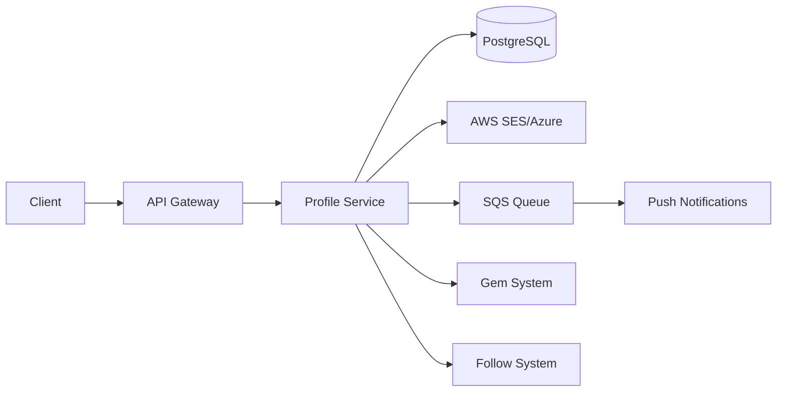

---

## Database Schema

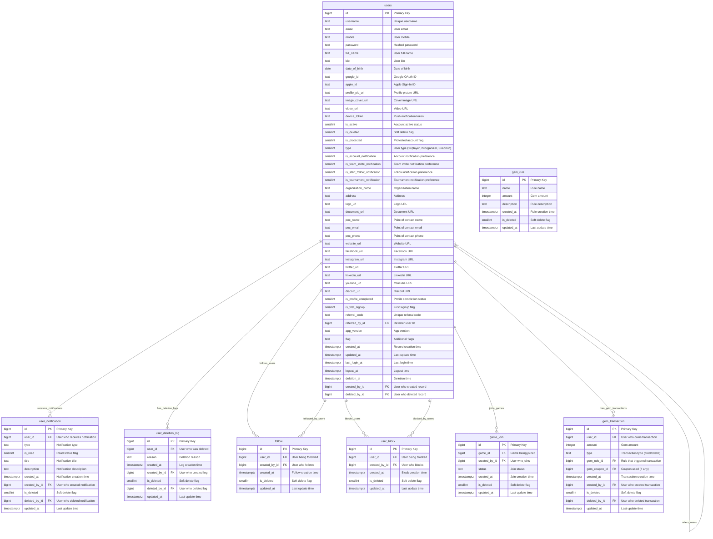

### Relationship Details

| Relationship | Type | Description | Foreign Key |
|--------------|------|-------------|-------------|
| users → user_notification | One-to-Many | User can receive multiple notifications | `user_notification.user_id` |
| users → user_deletion_log | One-to-Many | User can have multiple deletion logs | `user_deletion_log.user_id` |
| users → follow (following) | One-to-Many | User can follow multiple users | `follow.created_by_id` |
| users → follow (followers) | One-to-Many | User can be followed by multiple users | `follow.user_id` |
| users → user_block (blocking) | One-to-Many | User can block multiple users | `user_block.created_by_id` |
| users → user_block (blocked) | One-to-Many | User can be blocked by multiple users | `user_block.user_id` |
| users → game_join | One-to-Many | User can join multiple games | `game_join.created_by_id` |
| users → gem_transaction | One-to-Many | User can have multiple gem transactions | `gem_transaction.user_id` |
| users → users (referral) | One-to-Many | User can refer multiple users | `users.referred_by_id` |

### Index Information

| Table | Index Type | Indexed Fields | Purpose |
|-------|------------|----------------|---------|
| users | btree | `type, username` | Unique username per type |
| users | btree | `type, email` | Unique email per type |
| users | btree | `type, mobile` | Unique mobile per type |
| users | btree | `referral_code` | Unique referral code |
| users | btree | `is_deleted` | Soft delete filtering |
| users | gin | `full_name` | Full-text search |
| users | gin | `username` | Full-text search |
| follow | btree | `user_id, created_by_id` | Follow relationship lookup |
| user_block | btree | `user_id, created_by_id` | Block relationship lookup |
| game_join | btree | `created_by_id` | User's game participation |
| gem_transaction | btree | `user_id` | User's gem history |

---

## API Reference

### Authentication
All endpoints require JWT token:
```
Authorization: Bearer <jwt-token>
```

## Base URLs

| Environment   | URL                                 |
|---------------|-------------------------------------|
| Production    | `https://thryl-prod.com   ||    https://thryl-production.zapto.org`      |
| Staging       | `https://thryl-staging.zapto.org` |
| Development   | `http://localhost:3000  || http://localhost:3001`      |

---

### Complete API List

| # | Endpoint | Method | Purpose | Auth Required | Role Required |
|---|----------|--------|---------|---------------|---------------|
| 1 | `/read` | GET | Get user profile | Yes | admin/player/organizer/organizer_team |
| 2 | `/update` | PUT | Update user profile | Yes | admin/player/organizer |
| 3 | `/update-password` | PUT | Update password (forgot password) | Yes | admin/player/organizer |
| 4 | `/change-password` | PUT | Change password (with old password) | Yes | admin/player/organizer |
| 5 | `/refresh-token` | GET | Refresh JWT token | Yes | All roles |
| 6 | `/logout` | GET | Logout user | Yes | All roles |
| 7 | `/delete` | DELETE | Delete account | Yes | admin/player/organizer |
| 8 | `/search` | GET | Search users | Yes | admin/player/organizer/organizer_team |
| 9 | `/third-user` | GET | Get other user's profile | Yes | admin/player/organizer/organizer_team |

---

## API 1: Get User Profile

**Endpoint**: `GET /read`

**Purpose**: Retrieve authenticated user's profile information with follower/following counts

**Headers**:
```
Authorization: Bearer <jwt-token>
```

**Success Response** (200):
```json
{
  "status": 1,
  "data": {
    "id": 123,
    "username": "alice",
    "email": "alice@example.com",
    "mobile": "+919876543210",
    "type": 1,
    "date_of_birth": "1990-01-15",
    "profile_pic_url": "https://s3.amazonaws.com/thryl-bucket/user/profile.jpg",
    "image_cover_url": "https://s3.amazonaws.com/thryl-bucket/user/cover.jpg",
    "bio": "Gaming enthusiast and tournament player",
    "full_name": "Alice Johnson",
    "follower_count": 45,
    "following_count": 23,
    "last_login_at": "2024-01-15T10:30:00.000Z",
    "google_id": "google_oauth_id",
    "community": 1,
    "logout_at": null,
    "device_token": "fcm_token_here",
    "account_notification": 1,
    "team_invite_notification": 1,
    "start_follow_notification": 1,
    "is_tournament_notification": 1,
    "flag": "active",
    "apple_id": null,
    "address": "Mumbai, India",
    "document_url": "https://s3.amazonaws.com/thryl-bucket/user/document.pdf",
    "website_url": "https://alicegaming.com",
    "facebook_url": "https://facebook.com/alicegaming",
    "instagram_url": "https://instagram.com/alicegaming",
    "twitter_url": "https://twitter.com/alicegaming",
    "linkedin_url": "https://linkedin.com/in/alicegaming",
    "youtube_url": "https://youtube.com/alicegaming",
    "discord_url": "https://discord.gg/alicegaming",
    "organization_name": "Gaming Club",
    "logo_url": "https://s3.amazonaws.com/thryl-bucket/user/logo.jpg",
    "poc_name": "Alice Johnson",
    "poc_email": "poc@alicegaming.com",
    "poc_phone": "+919876543211",
    "password": "hashed_password",
    "video_url": "https://s3.amazonaws.com/thryl-bucket/user/video.mp4",
    "is_profile_completed": 1,
    "is_first_signup": 0,
    "referral_code": "ABC123XY",
    "app_version": "2.0.0"
  }
}
```

**Failure Responses**:

#### 401 - Unauthorized
```json
{
  "status": 0,
  "message": "User not authenticated",
  "error_code": "UNAUTHORIZED"
}
```

#### 403 - Insufficient permissions
```json
{
  "status": 0,
  "message": "Access denied",
  "error_code": "FORBIDDEN"
}
```

#### 404 - User not found
```json
{
  "status": 0,
  "message": "User not found",
  "error_code": "NOT_FOUND"
}
```

**DFD**:
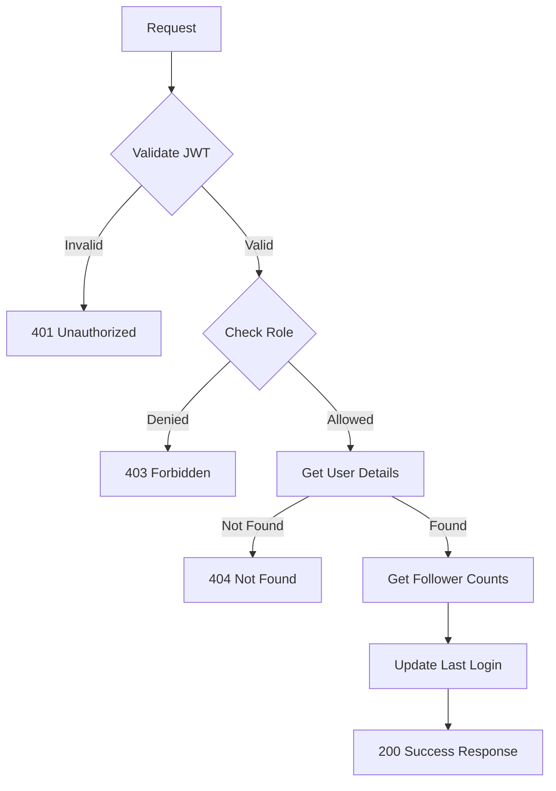

**Instructions & Business Logic**:
- JWT token required for authentication
- Roles: admin, player, organizer, organizer_team
- Returns complete user profile with all fields
- Includes follower and following counts (excluding blocked users)
- Updates last_login_at timestamp
- Excludes deleted users

**Database Operations**:
- `SELECT` from `users` with follower/following subqueries
- `UPDATE` users to set last_login_at

---

## API 2: Update User Profile

**Endpoint**: `PUT /update`

**Purpose**: Update authenticated user's profile information

**Headers**:
```
Authorization: Bearer <jwt-token>
Content-Type: application/json
```

**Request**:
```json
{
  "username": "alice_gaming",
  "full_name": "Alice Johnson",
  "bio": "Professional gamer and tournament organizer",
  "date_of_birth": "1990-01-15",
  "profile_pic_url": "https://s3.amazonaws.com/thryl-bucket/user/new-profile.jpg",
  "image_cover_url": "https://s3.amazonaws.com/thryl-bucket/user/new-cover.jpg",
  "email": "alice.gaming@example.com",
  "mobile": "+919876543210",
  "password": "newsecurepassword123",
  "is_account_notification": 1,
  "is_team_invite_notification": 1,
  "is_start_follow_notification": 0,
  "is_tournament_notification": 1,
  "referral_code": "XYZ789AB"
}
```

**Success Response** (201):
```json
{
  "status": 1,
  "data": {
    "id": 123,
    "username": "alice_gaming",
    "email": "alice.gaming@example.com",
    "mobile": "+919876543210",
    "full_name": "Alice Johnson",
    "bio": "Professional gamer and tournament organizer",
    "date_of_birth": "1990-01-15",
    "profile_pic_url": "https://s3.amazonaws.com/thryl-bucket/user/new-profile.jpg",
    "image_cover_url": "https://s3.amazonaws.com/thryl-bucket/user/new-cover.jpg",
    "is_account_notification": 1,
    "is_team_invite_notification": 1,
    "is_start_follow_notification": 0,
    "is_tournament_notification": 1,
    "referred_by_id": 456,
    "updated_at": "2024-01-15T10:30:00.000Z"
  }
}
```

**Failure Responses**:

#### 400 - Invalid email format
```json
{
  "status": 0,
  "message": "Email must be a valid email address",
  "error_code": "VALIDATION_ERROR"
}
```

#### 400 - Invalid mobile format
```json
{
  "status": 0,
  "message": "Mobile number must be a valid format with country code (e.g., +917881125100).",
  "error_code": "VALIDATION_ERROR"
}
```

#### 409 - Username already taken
```json
{
  "status": 0,
  "message": "That username is already taken. Try a different one.",
  "error_code": "CONFLICT"
}
```

#### 409 - Email already exists
```json
{
  "status": 0,
  "message": "Email already exists. Please use a different email address.",
  "error_code": "CONFLICT"
}
```

#### 409 - Mobile already exists
```json
{
  "status": 0,
  "message": "Mobile number already exists. Please choose another one.",
  "error_code": "CONFLICT"
}
```

#### 404 - Invalid referral code
```json
{
  "status": 0,
  "message": "The referral code you entered is invalid. Please check and try again",
  "error_code": "NOT_FOUND"
}
```

#### 404 - User not found
```json
{
  "status": 0,
  "message": "User profile not found or no changes detected",
  "error_code": "NOT_FOUND"
}
```

**DFD**:
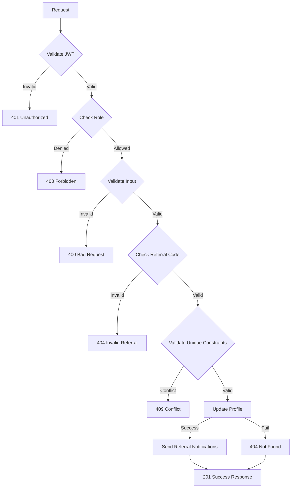

**Instructions & Business Logic**:
- JWT token required for authentication
- Roles: admin, player, organizer
- All fields are optional (partial updates supported)
- Username is converted to lowercase
- Password is hashed using bcrypt
- Validates unique constraints for username, email, mobile
- Referral code validation and gem rewards
- Sends notifications for referral rewards
- Updates updated_at timestamp

**Database Operations**:
- `SELECT` from `users` to validate referral code
- `SELECT` from `users` to check unique constraints
- `UPDATE` users to update profile
- `INSERT` into `user_notification` for referral notifications
- `INSERT` into `gem_transaction` for referral rewards

---

## API 3: Update Password (Forgot Password)

**Endpoint**: `PUT /update-password`

**Purpose**: Update user password without requiring old password (forgot password flow)

**Headers**:
```
Authorization: Bearer <jwt-token>
Content-Type: application/json
```

**Request**:
```json
{
  "password": "newsecurepassword123"
}
```

**Success Response** (200):
```json
{
  "status": 1,
  "message": "Password changed successfully."
}
```

**Failure Responses**:

#### 400 - Missing password
```json
{
  "status": 0,
  "message": "Password is required.",
  "error_code": "VALIDATION_ERROR"
}
```

#### 404 - User not found
```json
{
  "status": 0,
  "message": "User not found.",
  "error_code": "NOT_FOUND"
}
```

**DFD**:
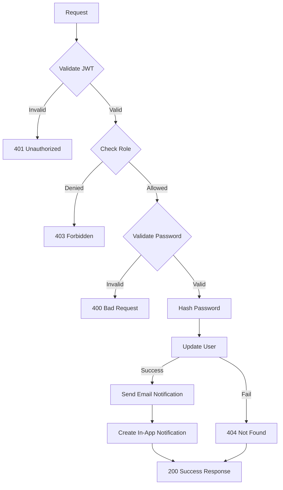

**Instructions & Business Logic**:
- JWT token required for authentication
- Roles: admin, player, organizer
- Password is required
- Password is hashed using bcrypt
- Sends email notification (currently commented out)
- Creates in-app notification
- Updates updated_at timestamp

**Database Operations**:
- `UPDATE` users to set new password
- `INSERT` into `user_notification` for password change notification

---

## API 4: Change Password

**Endpoint**: `PUT /change-password`

**Purpose**: Change user password with old password verification

**Headers**:
```
Authorization: Bearer <jwt-token>
Content-Type: application/json
```

**Request**:
```json
{
  "old_password": "currentpassword123",
  "new_password": "newsecurepassword123"
}
```

**Success Response** (200):
```json
{
  "status": 1,
  "message": "Password changed successfully"
}
```

**Failure Responses**:

#### 400 - Missing old password
```json
{
  "status": 0,
  "message": "Old password is required.",
  "error_code": "VALIDATION_ERROR"
}
```

#### 400 - Missing new password
```json
{
  "status": 0,
  "message": "New password is required.",
  "error_code": "VALIDATION_ERROR"
}
```

#### 401 - Incorrect old password
```json
{
  "status": 0,
  "message": "Incorrect old password.",
  "error_code": "UNAUTHORIZED"
}
```

#### 404 - User not found
```json
{
  "status": 0,
  "message": "User not found.",
  "error_code": "NOT_FOUND"
}
```

**DFD**:
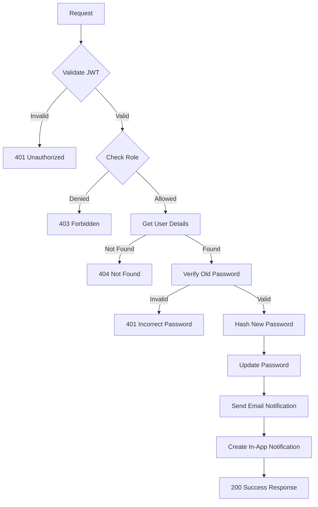

**Instructions & Business Logic**:
- JWT token required for authentication
- Roles: admin, player, organizer
- Both old_password and new_password are required
- Old password is verified using bcrypt
- New password is hashed using bcrypt
- Sends email notification (currently commented out)
- Creates in-app notification

**Database Operations**:
- `SELECT` from `users` to get current password
- `UPDATE` users to set new password
- `INSERT` into `user_notification` for password change notification

---

## API 5: Refresh Token

**Endpoint**: `GET /refresh-token`

**Purpose**: Refresh JWT token using existing token

**Headers**:
```
Authorization: Bearer <encrypted-jwt-token>
```

**Success Response** (200):
```json
{
  "status": 1,
  "token": "eyJhbGciOiJIUzI1NiIsInR5cCI6IkpXVCJ9..."
}
```

**Failure Responses**:

#### 400 - Missing refresh token
```json
{
  "status": 0,
  "message": "Refresh token is required",
  "error_code": "BAD_REQUEST"
}
```

#### 401 - Invalid refresh token
```json
{
  "status": 0,
  "message": "Invalid refresh token",
  "error_code": "UNAUTHORIZED"
}
```

**DFD**:
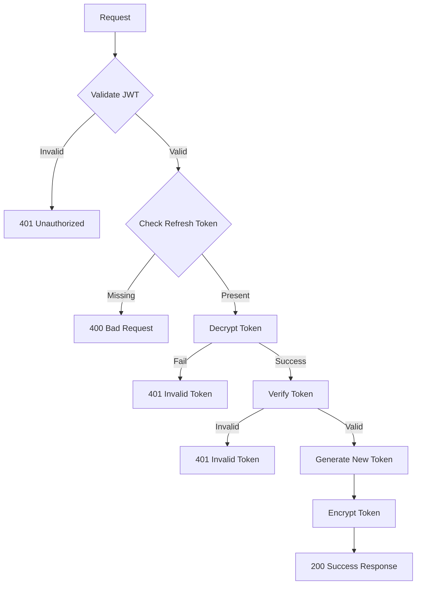

**Instructions & Business Logic**:
- JWT token required for authentication
- All roles allowed
- Decrypts the provided token
- Verifies token validity
- Generates new token with same user data
- Encrypts new token before returning

**Database Operations**:
- No database operations (token-based only)

---

## API 6: Logout User

**Endpoint**: `GET /logout`

**Purpose**: Logout user and clear device token

**Headers**:
```
Authorization: Bearer <jwt-token>
```

**Success Response** (200):
```json
{
  "status": 1,
  "message": "User logged out successfully"
}
```

**Failure Responses**:

#### 401 - Unauthorized
```json
{
  "status": 0,
  "message": "User not authenticated",
  "error_code": "UNAUTHORIZED"
}
```

**DFD**:
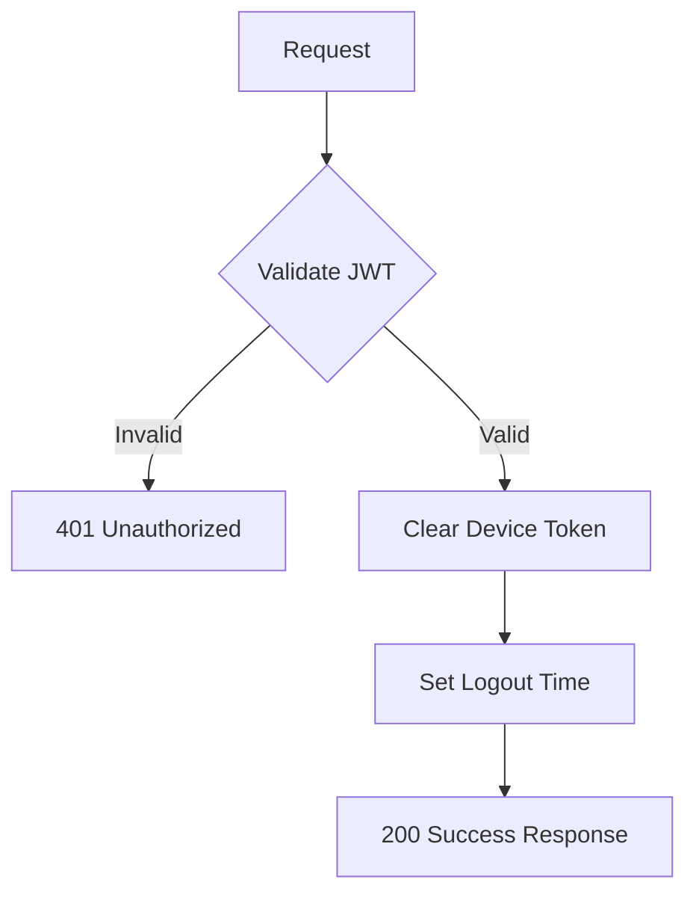

**Instructions & Business Logic**:
- JWT token required for authentication
- All roles allowed
- Clears device_token (sets to NULL)
- Sets logout_at timestamp
- Updates updated_at timestamp

**Database Operations**:
- `UPDATE` users to clear device_token and set logout_at

---

## API 7: Delete Account

**Endpoint**: `DELETE /delete`

**Purpose**: Mark user account for deletion (soft delete)

**Headers**:
```
Authorization: Bearer <jwt-token>
Content-Type: application/json
```

**Request**:
```json
{
  "reason": "No longer interested in gaming"
}
```

**Success Response** (204):
```json
{
  "status": 1,
  "message": "Your account is marked for deletion. It will be stored for 30 days until 15 Feb 2024, during which you can restore it. After that, it will be permanently deleted."
}
```

**Failure Responses**:

#### 401 - Unauthorized
```json
{
  "status": 0,
  "message": "User not authenticated",
  "error_code": "UNAUTHORIZED"
}
```

#### 403 - Insufficient permissions
```json
{
  "status": 0,
  "message": "Access denied",
  "error_code": "FORBIDDEN"
}
```

#### 404 - User not found
```json
{
  "status": 0,
  "message": "User not found",
  "error_code": "NOT_FOUND"
}
```

**DFD**:
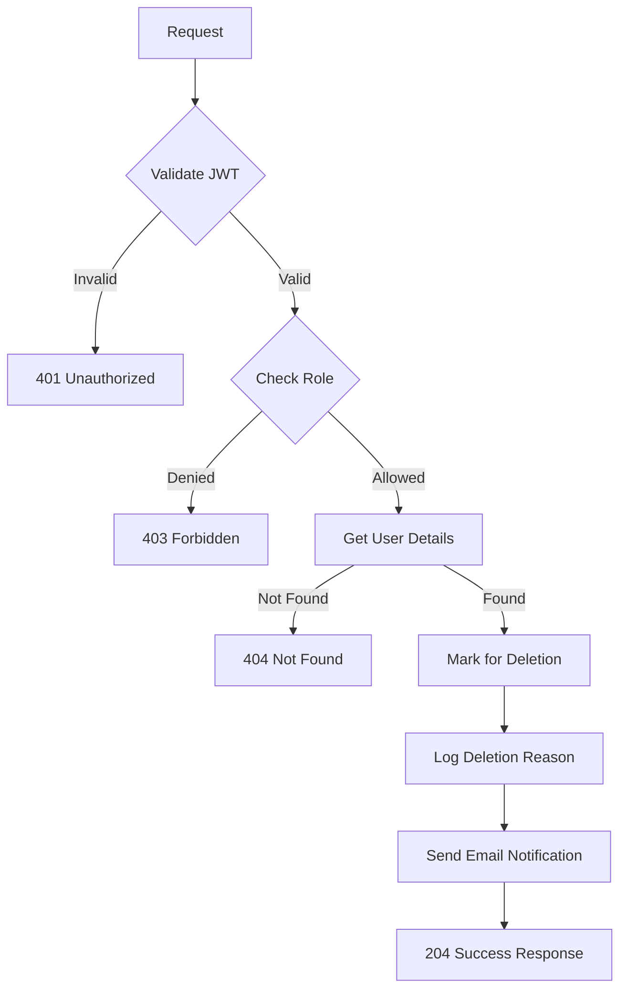

**Instructions & Business Logic**:
- JWT token required for authentication
- Roles: admin, player, organizer
- Reason is required in request body
- Sets is_deleted = 1
- Sets deletion_at to 30 days from now
- Logs deletion reason
- Sends email notification
- Account can be restored within 30 days

**Database Operations**:
- `SELECT` from `users` to get user details
- `UPDATE` users to mark for deletion
- `INSERT` into `user_deletion_log` for audit trail

---

## API 8: Search Users

**Endpoint**: `GET /search?keyword=alice&limit=10&page=1&type=1`

**Purpose**: Search users by username, email, mobile, or full name

**Headers**:
```
Authorization: Bearer <jwt-token>
```

**Query Parameters**:
- `keyword` (required): Search term
- `limit` (optional): Number of results (default: 10)
- `page` (optional): Page number (default: 1)
- `type` (optional): User type filter (default: user's type)

**Success Response** (200):
```json
{
  "status": 1,
  "data": [
    {
      "id": 123,
      "username": "alice_gaming",
      "email": "alice@example.com",
      "mobile": "+919876543210",
      "full_name": "Alice Johnson",
      "profile_pic_url": "https://s3.amazonaws.com/thryl-bucket/user/profile.jpg",
      "image_cover_url": "https://s3.amazonaws.com/thryl-bucket/user/cover.jpg"
    },
    {
      "id": 124,
      "username": "alice_pro",
      "email": "alice.pro@example.com",
      "mobile": "+919876543211",
      "full_name": "Alice Professional",
      "profile_pic_url": "https://s3.amazonaws.com/thryl-bucket/user/profile2.jpg",
      "image_cover_url": null
    }
  ]
}
```

**Failure Responses**:

#### 400 - Missing search term
```json
{
  "status": 0,
  "message": "Search term is required.",
  "error_code": "BAD_REQUEST"
}
```

#### 401 - Unauthorized
```json
{
  "status": 0,
  "message": "User not authenticated",
  "error_code": "UNAUTHORIZED"
}
```

**DFD**:
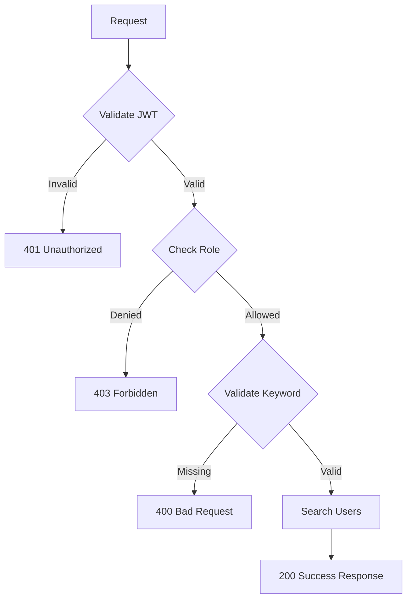

**Instructions & Business Logic**:
- JWT token required for authentication
- Roles: admin, player, organizer, organizer_team
- Keyword is required
- Case-insensitive search using ILIKE
- Searches username and full_name fields
- Filters by user type
- Returns limited results with pagination
- Orders by username descending

**Database Operations**:
- `SELECT` from `users` with ILIKE search

---

## API 9: Get Other User's Profile

**Endpoint**: `GET /third-user?other_user_id=456`

**Purpose**: Get another user's profile information with games and follower counts

**Headers**:
```
Authorization: Bearer <jwt-token>
```

**Query Parameters**:
- `other_user_id` (required): ID of user to view

**Success Response** (200):
```json
{
  "status": 1,
  "data": {
    "id": 456,
    "created_at": "2023-01-15T10:30:00.000Z",
    "username": "bob_gamer",
    "email": "bob@example.com",
    "mobile": "+919876543212",
    "bio": "Professional gamer",
    "full_name": "Bob Smith",
    "date_of_birth": "1992-05-20",
    "google_id": "google_oauth_id",
    "profile_pic_url": "https://s3.amazonaws.com/thryl-bucket/user/bob-profile.jpg",
    "image_cover_url": "https://s3.amazonaws.com/thryl-bucket/user/bob-cover.jpg",
    "video_url": "https://s3.amazonaws.com/thryl-bucket/user/bob-video.mp4",
    "type": 1,
    "follower_count": 23,
    "following_count": 12,
    "games": [
      {
        "game_join_id": 789,
        "game_join_created_at": "2024-01-10T15:30:00.000Z",
        "status": "active",
        "game_id": 101,
        "id": 101,
        "name": "PUBG Tournament",
        "description": "Battle Royale tournament",
        "start_date": "2024-01-20T10:00:00.000Z",
        "end_date": "2024-01-20T18:00:00.000Z"
      }
    ]
  }
}
```

**Failure Responses**:

#### 400 - Missing other_user_id
```json
{
  "status": 0,
  "message": "Other user ID is required.",
  "error_code": "BAD_REQUEST"
}
```

#### 401 - Unauthorized
```json
{
  "status": 0,
  "message": "User not authenticated",
  "error_code": "UNAUTHORIZED"
}
```

#### 404 - User not found
```json
{
  "status": 0,
  "message": "User not found.",
  "error_code": "NOT_FOUND"
}
```

**DFD**:
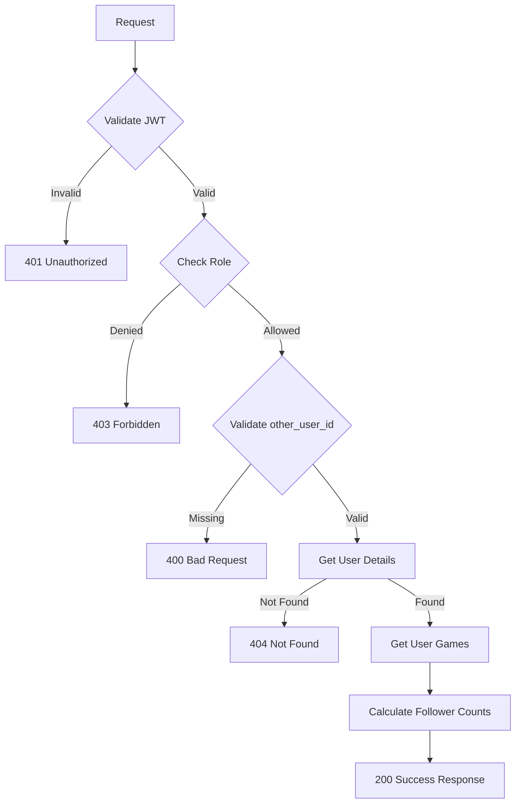

**Instructions & Business Logic**:
- JWT token required for authentication
- Roles: admin, player, organizer, organizer_team
- other_user_id is required
- Returns user profile with games and follower counts
- Excludes blocked users from follower/following counts
- Includes user's game participation history

**Database Operations**:
- `SELECT` from `users` with follower/following subqueries
- `SELECT` from `game_join` and `game` for user's games

---

## Error Handling

### Common Error Codes

| Code | Description |
|------|-------------|
| 400 | Bad Request - Invalid input data |
| 401 | Unauthorized - Missing or invalid JWT |
| 403 | Forbidden - Insufficient permissions |
| 404 | Not Found - Resource not found |
| 409 | Conflict - Resource already exists |
| 500 | Internal Server Error - Server error |

### Error Response Format
```json
{
  "status": 0,
  "message": "Error description",
  "error_code": "ERROR_TYPE"
}
```

---

## Rate Limiting

- **Profile Read APIs**: 100 requests per minute per user
- **Profile Update APIs**: 10 requests per minute per user
- **Password APIs**: 5 requests per minute per user
- **Search APIs**: 50 requests per minute per user

---

## Security Considerations

1. **JWT Authentication**: All endpoints require valid JWT tokens
2. **Role-based Access**: Different endpoints have different role requirements
3. **Password Security**: Passwords hashed using bcrypt with salt
4. **Input Validation**: All inputs validated using Joi schemas
5. **Unique Constraints**: Username, email, mobile uniqueness enforced
6. **Soft Delete**: Accounts marked for deletion, not permanently removed
7. **Referral Security**: Referral codes validated before rewards
8. **Block System**: Blocked users excluded from follower counts

---

## Monitoring & Logging

- All profile operations logged with user ID and action
- Password change attempts tracked for security
- Account deletion requests logged with reasons
- Search queries logged for analytics
- Referral reward transactions tracked
- Failed authentication attempts monitored

---

## Integration Examples

### Mobile App Integration
```javascript
// Get user profile
const response = await fetch('/read', {
  headers: { 'Authorization': 'Bearer ' + token }
});

const { data: profile } = await response.json();
```

### Web App Integration
```javascript
// Update user profile
const response = await fetch('/update', {
  method: 'PUT',
  headers: { 
    'Authorization': 'Bearer ' + token,
    'Content-Type': 'application/json' 
  },
  body: JSON.stringify({
    full_name: 'Alice Johnson',
    bio: 'Professional gamer',
    profile_pic_url: 'https://s3.amazonaws.com/thryl-bucket/user/profile.jpg'
  })
});

const { data: updatedProfile } = await response.json();
```

### Search Integration
```javascript
// Search users
const response = await fetch('/search?keyword=alice&limit=10&page=1', {
  headers: { 'Authorization': 'Bearer ' + token }
});

const { data: users } = await response.json();
```
