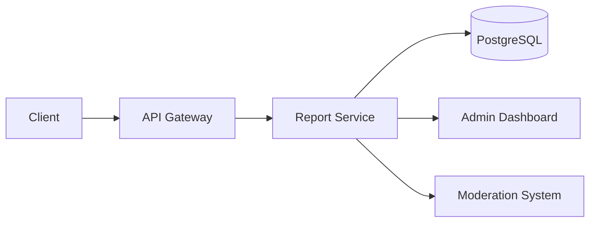
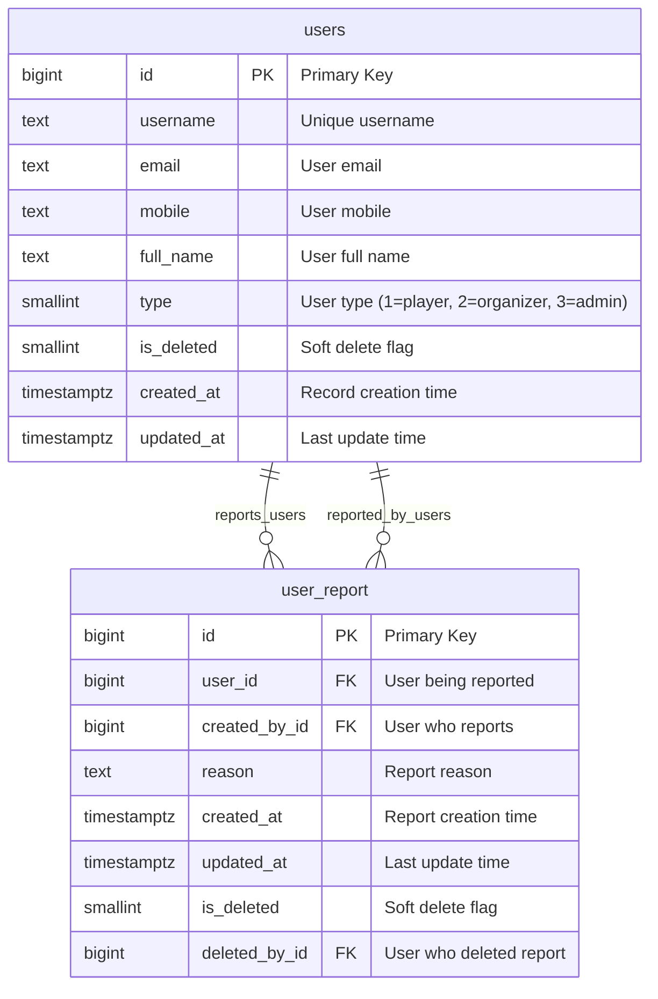
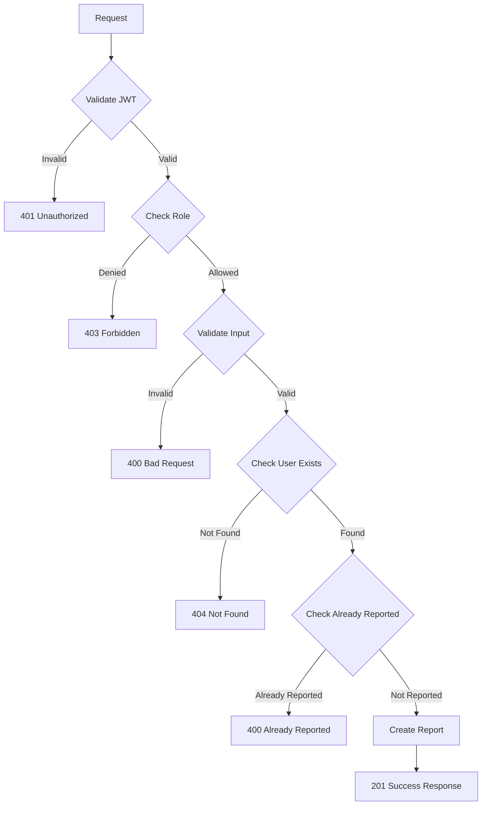

## Overview

The **Report Service** provides user reporting functionality for the Thryl platform, allowing users to report other users for inappropriate behavior, violations, or other concerns. This service helps maintain community standards and enables platform moderation.

### Tech Stack
- **Backend**: Node.js, Express.js
- **Database**: PostgreSQL
- **Authentication**: JWT, bcrypt
- **Validation**: Joi
- **Error Handling**: Custom ApiError class

---

## System Architecture



---

## Database Schema



### Relationship Details

| Relationship | Type | Description | Foreign Key |
|--------------|------|-------------|-------------|
| users → user_report (reported) | One-to-Many | User can be reported multiple times | `user_report.user_id` |
| users → user_report (reporter) | One-to-Many | User can report multiple users | `user_report.created_by_id` |

### Index Information

| Table | Index Type | Indexed Fields | Purpose |
|-------|------------|----------------|---------|
| user_report | btree | `user_id` | Fast lookup of reports for a user |
| user_report | btree | `created_by_id` | Fast lookup of reports by a user |
| user_report | btree | `reason` | Search reports by reason |
| user_report | unique | `(created_by_id, user_id)` | Prevent duplicate reports |

### Table Structure

#### user_report
| Column | Type | Constraints | Index |
|--------|------|-------------|-------|
| id | bigint | PRIMARY KEY | - |
| user_id | bigint | NOT NULL, FK to users.id | btree |
| created_by_id | bigint | NOT NULL, FK to users.id | btree |
| reason | text | - | btree |
| created_at | timestamptz | DEFAULT now() | brin |
| updated_at | timestamptz | DEFAULT now() | - |
| is_deleted | smallint | DEFAULT 0 | - |
| deleted_by_id | bigint | - | - |

**Unique Constraint**: `(created_by_id, user_id)` - Prevents duplicate reports from same user

---

## API Reference

### Authentication
All endpoints require JWT token:
```
Authorization: Bearer <jwt-token>
```

## Base URLs

| Environment   | URL                                 |
|---------------|-------------------------------------|
| Production    | `https://thryl-prod.com   ||    https://thryl-production.zapto.org`      |
| Staging       | `https://thryl-staging.zapto.org` |
| Development   | `http://localhost:3000  || http://localhost:3001`      |

---

### Complete API List

| # | Endpoint | Method | Purpose | Auth Required | Role Required |
|---|----------|--------|---------|---------------|---------------|
| 1 | `/create` | POST | Report a user | Yes | player |

---

## API 1: Report User

**Endpoint**: `POST /create`

**Purpose**: Report a user for inappropriate behavior or violations

**Headers**:
```
Authorization: Bearer <jwt-token>
Content-Type: application/json
```

**Query Parameters**:
- `report_user_id` (required): ID of the user being reported

**Request Body**:
```json
{
  "reason": "Inappropriate behavior in chat"
}
```

**Success Response** (201):
```json
{
  "status": 1,
  "message": "User reported successfully"
}
```

**Failure Responses**:

#### 400 - User already reported
```json
{
  "status": 0,
  "message": "You have already reported this user.",
  "error_code": "ALREADY_REPORTED"
}
```

#### 400 - Invalid reason
```json
{
  "status": 0,
  "message": "Reason is required.",
  "error_code": "VALIDATION_ERROR"
}
```

#### 401 - Unauthorized
```json
{
  "status": 0,
  "message": "User not authenticated",
  "error_code": "UNAUTHORIZED"
}
```

#### 403 - Insufficient permissions
```json
{
  "status": 0,
  "message": "Access denied",
  "error_code": "FORBIDDEN"
}
```

#### 404 - User not found
```json
{
  "status": 0,
  "message": "User not found.",
  "error_code": "NOT_FOUND"
}
```

**DFD**:


**Instructions & Business Logic**:
- JWT token required for authentication
- Role: player only
- report_user_id required in query parameters
- reason required in request body
- Validates that reported user exists
- Prevents duplicate reports from same user
- Creates report record with timestamp
- Returns success message

**Validation Schema**:
```javascript
const createUserReportSchema = Joi.object({
    userId: Joi.number().optional(),
    reportUserId: Joi.number().optional(),
    reason: Joi.string().allow(null).optional(),
});
```

**Database Operations**:
```sql
-- Check if user exists
SELECT * FROM users WHERE id = $1

-- Check if already reported
SELECT * FROM user_report WHERE user_id = $1 AND created_by_id = $2

-- Create report
INSERT INTO user_report (created_by_id, user_id, reason) VALUES ($1, $2, $3)
```

**Implementation Details**:
- Uses `catchAsync` wrapper for error handling
- Extracts `userId` from JWT token (`req.user.id`)
- Uses parameterized queries to prevent SQL injection
- Throws `ApiError` with appropriate status codes
- Unique constraint prevents duplicate reports
- Soft delete support with `is_deleted` flag

---

## Error Handling

### Common Error Codes

| Code | Description |
|------|-------------|
| 400 | Bad Request - Invalid input data or business rule violation |
| 401 | Unauthorized - Missing or invalid JWT |
| 403 | Forbidden - Insufficient permissions |
| 404 | Not Found - User not found |
| 500 | Internal Server Error - Server error |

### Error Response Format
```json
{
  "status": 0,
  "message": "Error description",
  "error_code": "ERROR_TYPE"
}
```

---

## Rate Limiting

- **Report Creation**: 5 reports per minute per user
- **Report Queries**: 20 requests per minute per user

---

## Security Considerations

1. **JWT Authentication**: All endpoints require valid JWT tokens
2. **Role-based Access**: Only player role can report users
3. **Input Validation**: All inputs validated using Joi schemas
4. **Duplicate Prevention**: Unique constraint prevents multiple reports
5. **User Validation**: Verifies reported user exists before creating report
6. **SQL Injection Prevention**: Uses parameterized queries
7. **Soft Delete**: Reports are soft-deleted, not permanently removed

---

## Business Rules

### Reporting Rules
1. Users can only report other users (not themselves)
2. Users can only report each user once (unique constraint)
3. Only players can report users (organizers and admins cannot report)
4. Report reason is required
5. Reported user must exist in the system
6. Reports are stored for moderation review

### Moderation Rules
1. Reports are reviewed by admin/moderator team
2. Multiple reports against same user trigger review
3. Reports can be marked as resolved or dismissed
4. False reports may result in reporter penalties
5. Serious violations may result in user suspension

---

## Monitoring & Logging

- All report operations logged with user IDs and reason
- Report frequency monitoring for abuse detection
- Failed report attempts tracked for security
- Report patterns analyzed for community health
- Admin dashboard shows report statistics

---

## Integration Examples

### Frontend Integration

```javascript
// Report a user
const reportUser = async (reportUserId, reason) => {
  const response = await fetch(`/api/v1/report-user/create?report_user_id=${reportUserId}`, {
    method: 'POST',
    headers: {
      'Authorization': `Bearer ${token}`,
      'Content-Type': 'application/json'
    },
    body: JSON.stringify({ reason })
  });
  
  const result = await response.json();
  return result;
};

// Example usage
try {
  const result = await reportUser(123, "Inappropriate behavior in chat");
  console.log(result.message); // "User reported successfully"
} catch (error) {
  console.error('Report failed:', error.message);
}
```

### Mobile App Integration

```swift
// Swift example for iOS
func reportUser(userId: Int, reason: String) async throws -> ReportResponse {
    let url = URL(string: "\(baseURL)/report-user/create?report_user_id=\(userId)")!
    var request = URLRequest(url: url)
    request.httpMethod = "POST"
    request.setValue("Bearer \(authToken)", forHTTPHeaderField: "Authorization")
    request.setValue("application/json", forHTTPHeaderField: "Content-Type")
    
    let body = ["reason": reason]
    request.httpBody = try JSONSerialization.data(withJSONObject: body)
    
    let (data, _) = try await URLSession.shared.data(for: request)
    return try JSONDecoder().decode(ReportResponse.self, from: data)
}
```

### React Component Example

```jsx
import React, { useState } from 'react';

const ReportUserModal = ({ userId, onClose }) => {
  const [reason, setReason] = useState('');
  const [loading, setLoading] = useState(false);
  const [error, setError] = useState('');

  const handleReport = async () => {
    if (!reason.trim()) {
      setError('Please provide a reason for the report');
      return;
    }

    setLoading(true);
    setError('');

    try {
      const response = await fetch(`/api/v1/report-user/create?report_user_id=${userId}`, {
        method: 'POST',
        headers: {
          'Authorization': `Bearer ${localStorage.getItem('token')}`,
          'Content-Type': 'application/json'
        },
        body: JSON.stringify({ reason })
      });

      const result = await response.json();

      if (result.status === 1) {
        alert('User reported successfully');
        onClose();
      } else {
        setError(result.message);
      }
    } catch (err) {
      setError('Failed to report user. Please try again.');
    } finally {
      setLoading(false);
    }
  };

  return (
    <div className="modal">
      <h3>Report User</h3>
      <textarea
        value={reason}
        onChange={(e) => setReason(e.target.value)}
        placeholder="Please provide a reason for reporting this user..."
        rows={4}
      />
      {error && <p className="error">{error}</p>}
      <div className="actions">
        <button onClick={onClose}>Cancel</button>
        <button onClick={handleReport} disabled={loading}>
          {loading ? 'Reporting...' : 'Report User'}
        </button>
      </div>
    </div>
  );
};
```

---

## Use Cases

### 1. Community Moderation
- Users report inappropriate behavior
- Reports trigger admin review process
- Helps maintain platform quality and safety
- Enables community self-policing

### 2. Harassment Prevention
- Users report harassers and bullies
- Multiple reports against same user trigger action
- Protects vulnerable users from abuse
- Creates safer gaming environment

### 3. Content Violation
- Users report inappropriate content
- Reports help identify policy violations
- Enables content moderation at scale
- Maintains community standards

### 4. Spam and Scam Prevention
- Users report spam accounts
- Reports help identify fake profiles
- Prevents fraudulent activities
- Protects legitimate users

---

## Performance Considerations

### Database Optimization
- Indexes on `user_id` and `created_by_id` for fast lookups
- Unique constraint on `(created_by_id, user_id)` for duplicate prevention
- BRIN index on `created_at` for time-based queries
- B-tree index on `reason` for text search

### Caching Strategy
- Cache user existence checks for frequently reported users
- Cache report counts for admin dashboard
- Invalidate cache on new report creation

### Query Optimization
- Use parameterized queries for security
- Limit result sets for admin queries
- Optimize JOIN operations with proper indexing

---

## Testing Scenarios

### Unit Tests
- Report user functionality
- Duplicate report prevention
- User existence validation
- Reason validation
- Error handling for invalid inputs

### Integration Tests
- End-to-end report flow
- Authentication and authorization
- Database consistency
- API response validation

### Performance Tests
- Load testing with multiple concurrent reports
- Database query performance
- Response time under load
- Memory usage optimization

### Security Tests
- SQL injection prevention
- JWT token validation
- Role-based access control
- Input sanitization

---

## Admin Dashboard Integration

### Report Management
```javascript
// Get all reports for admin dashboard
const getReports = async (page = 1, limit = 20) => {
  const response = await fetch(`/api/v1/admin/reports?page=${page}&limit=${limit}`, {
    headers: { 'Authorization': `Bearer ${adminToken}` }
  });
  return response.json();
};

// Mark report as resolved
const resolveReport = async (reportId, action) => {
  const response = await fetch(`/api/v1/admin/reports/${reportId}/resolve`, {
    method: 'PUT',
    headers: {
      'Authorization': `Bearer ${adminToken}`,
      'Content-Type': 'application/json'
    },
    body: JSON.stringify({ action, notes: 'Report resolved by admin' })
  });
  return response.json();
};
```

### Report Statistics
- Total reports per day/week/month
- Reports by reason category
- Most reported users
- Report resolution time
- False report percentage

---

## Future Enhancements

### Planned Features
1. **Report Categories**: Predefined categories for better organization
2. **Evidence Upload**: Allow users to attach screenshots/videos
3. **Auto-moderation**: AI-powered initial review of reports
4. **Report Analytics**: Advanced analytics for community health
5. **Bulk Actions**: Admin tools for handling multiple reports
6. **Report Appeals**: Allow users to appeal report decisions
7. **Reputation System**: Impact of reports on user reputation
8. **Notification System**: Notify users of report status changes 