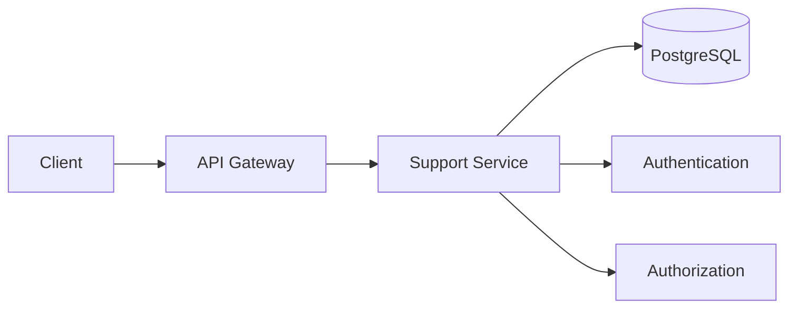
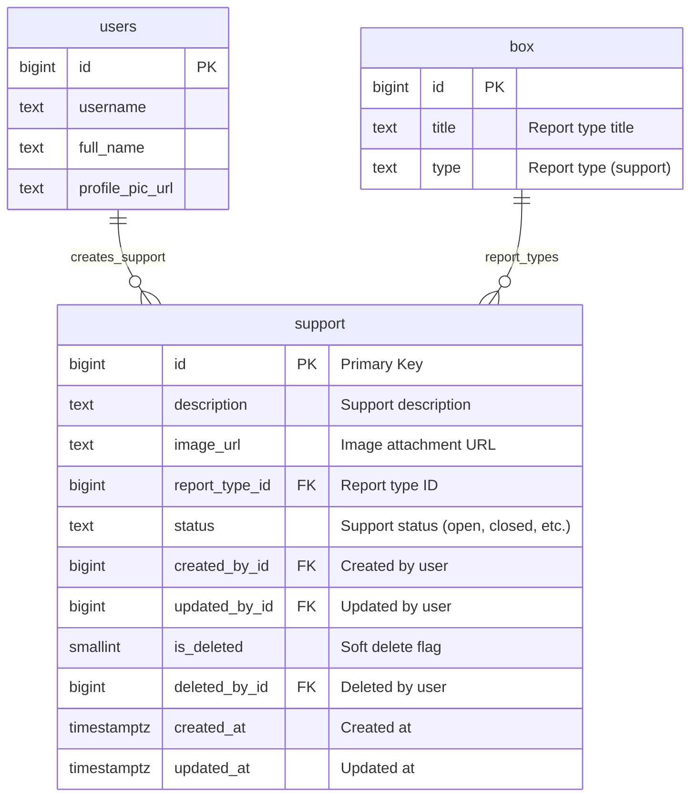
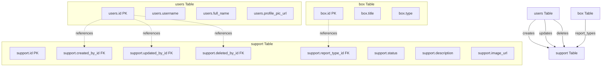
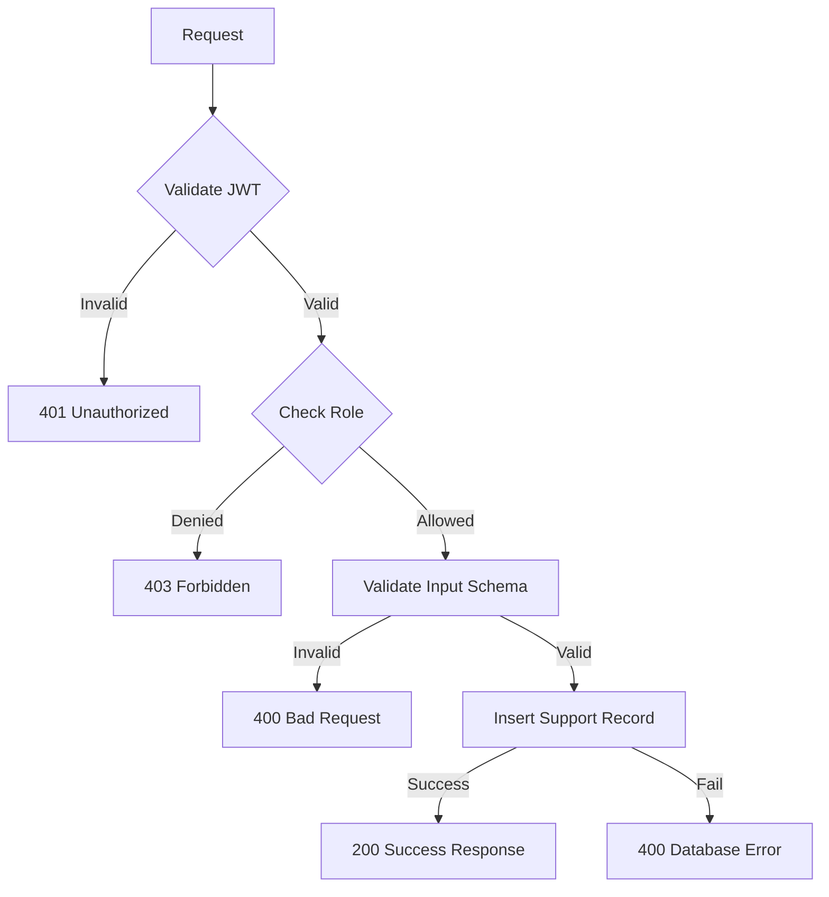
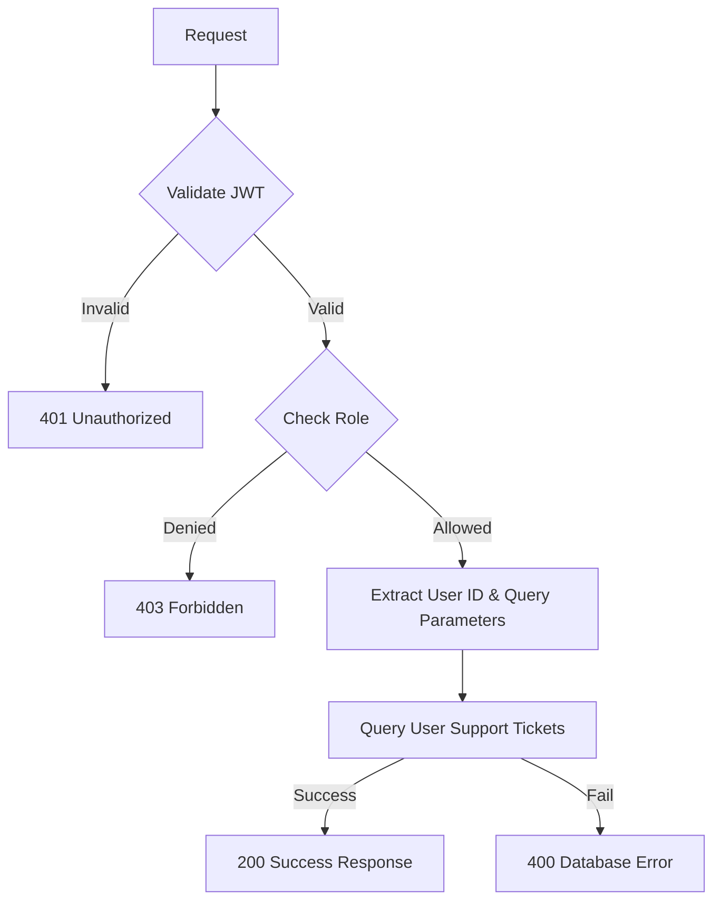
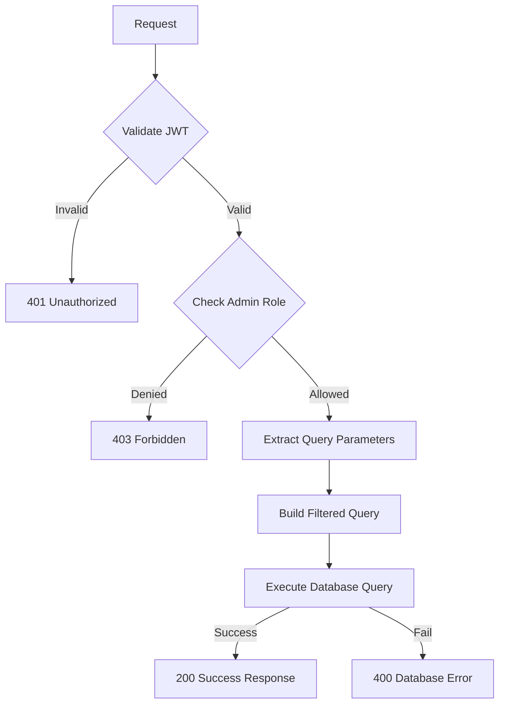
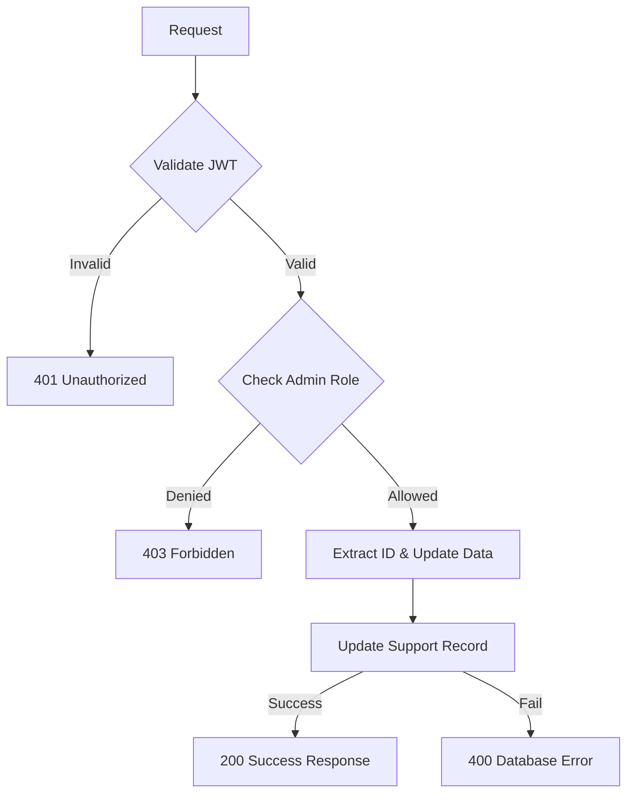
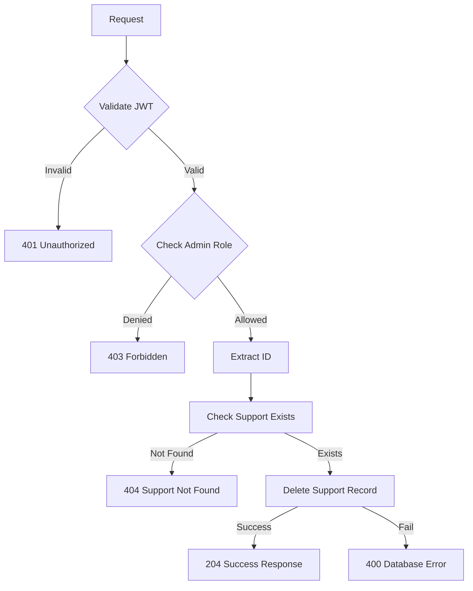
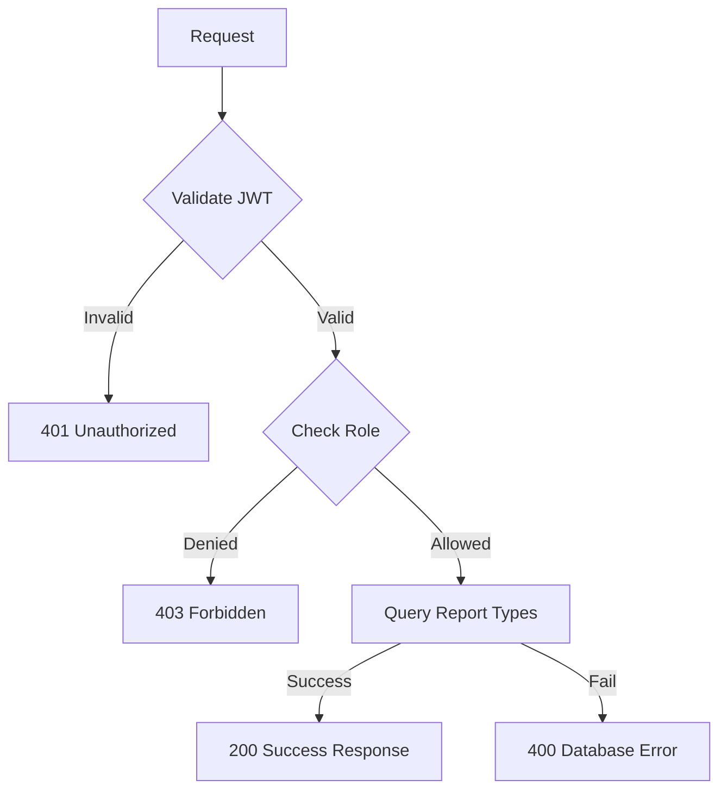

## Overview

The **Support Service** provides comprehensive customer support functionality for the Thryl platform, enabling users to create support tickets, track their status, and manage support requests. The service supports different report types, image attachments, and status tracking. Admins can view and manage all support requests with advanced filtering and search capabilities.

### Tech Stack
- **Backend**: Node.js, Express.js
- **Database**: PostgreSQL
- **Authentication**: JWT
- **Validation**: Joi
- **Authorization**: Role-based access control

---

## System Architecture



---

## Database Schema



## Table Relationship Graph



### Relationship Details

| Relationship | Type | Description | Foreign Key |
|--------------|------|-------------|-------------|
| users → support (creation) | One-to-Many | User can create multiple support tickets | `support.created_by_id` |
| users → support (update) | One-to-Many | User can update support tickets | `support.updated_by_id` |
| users → support (deletion) | One-to-Many | User can delete support tickets | `support.deleted_by_id` |
| box → support (report types) | One-to-Many | Report type can have multiple support tickets | `support.report_type_id` |

### Index Information

| Table | Index Type | Indexed Fields | Purpose |
|-------|------------|----------------|---------|
| support | btree | `created_by_id` | Creator-based queries |
| support | brin | `created_at` | Fast time-based queries |
| support | btree | `is_deleted` | Soft delete filtering |
| support | btree | `status` | Status-based filtering |

---

## Base URLs

| Environment   | URL                                 |
|---------------|-------------------------------------|
| Production    | `https://thryl-prod.com   ||    https://thryl-production.zapto.org`      |
| Staging       | `https://thryl-staging.zapto.org` |
| Development   | `http://localhost:3000  || http://localhost:3001`      |

---

## Authentication

All Support Service APIs require JWT authentication. Include the token in the Authorization header:

```http
Authorization: Bearer <your-jwt-token>
```

---

## Authorization

| Role         | Permissions                                      |
|--------------|--------------------------------------------------|
| **Admin**    | Create, read, update, delete support, get report types |
| **Player**   | Create, read support, get report types           |

---

## API Reference

### Complete API List

| # | Endpoint                    | Method | Purpose                                 | Auth Required | Role Required         |
|---|-----------------------------|--------|-----------------------------------------|---------------|----------------------|
| 1 | `/create`                   | POST   | Create a new support ticket             | Yes           | admin, player        |
| 2 | `/read`                     | GET    | Get user's support tickets              | Yes           | admin, player        |
| 3 | `/admin-read`               | GET    | Get all support tickets (admin)         | Yes           | admin                |
| 4 | `/update/:id`               | PUT    | Update support ticket                   | Yes           | admin                |
| 5 | `/delete/:id`               | DELETE | Delete support ticket                   | Yes           | admin                |
| 6 | `/type`                     | GET    | Get all report types                    | Yes           | admin, player        |
| 7 | `/update-status/:id`        | PUT    | Update support ticket status            | Yes           | admin                |

---

## Validation Schemas

### Create Support Schema
```javascript
{
  title: Joi.string().optional().allow(null),
  description: Joi.string().optional().allow(null),
  image_url: Joi.string().optional().allow(null),
  report_type_id: Joi.number().optional().allow(null)
}
```

### Update Support Schema
```javascript
{
  title: Joi.string().optional().allow(null),
  description: Joi.string().optional().allow(null),
  image_url: Joi.string().optional().allow(null),
  report_type_id: Joi.number().optional().allow(null)
}
```

### Update Support Status Schema
```javascript
{
  status: Joi.string().required()
}
```

---

## API Endpoints

### 1. Create Support Ticket

Creates a new support ticket with optional image attachment and report type.

**Endpoint:** `POST /support/create`

**Authorization:** Admin, player

**Request Body:**
```json
{
  "title": "Technical Issue",
  "description": "I'm experiencing login problems",
  "image_url": "https://example.com/screenshot.jpg",
  "report_type_id": 1
}
```

**Success Response (200):**
```json
{
  "status": 1,
  "data": {
    "id": 1,
    "description": "I'm experiencing login problems",
    "image_url": "https://example.com/screenshot.jpg",
    "report_type_id": 1,
    "status": "open",
    "created_by_id": 123,
    "created_at": "2024-01-15T10:30:00Z"
  },
  "message": "Support created successfully"
}
```

**Error Response (400):**
```json
{
  "status": 0,
  "message": "Validation error"
}
```

**DFD:**


#### Business Logic

1. **Input Validation**: Validates required fields and data types
2. **Creator Tracking**: Records who created the support ticket
3. **Default Status**: Sets status to 'open' for new tickets
4. **Image Support**: Supports optional image attachments

#### Database Operations

```sql
INSERT INTO support (description, image_url, report_type_id, status, created_by_id)
VALUES ($1, $2, $3, $4, $5)
RETURNING *;
```

---

### 2. Get User Support Tickets

Retrieves all support tickets created by the authenticated user.

**Endpoint:** `GET /support/read`

**Authorization:** Admin, player

**Query Parameters:**
- `page` (optional): Page number
- `limit` (optional): Items per page

**Example Request:**
```http
GET /support/read?page=1&limit=10
```

**Success Response (200):**
```json
{
  "status": 1,
  "data": [
    {
      "id": 1,
      "description": "I'm experiencing login problems",
      "image_url": "https://example.com/screenshot.jpg",
      "report_type_id": 1,
      "status": "open",
      "created_at": "2024-01-15T10:30:00Z",
      "updated_at": "2024-01-15T10:30:00Z",
      "type": "support",
      "title": "Technical Issue"
    }
  ],
  "message": "Support fetched successfully"
}
```

**Error Response (400):**
```json
{
  "status": 0,
  "message": "Failed to fetch support"
}
```

**DFD:**


#### Business Logic

1. **User-Specific**: Only returns tickets created by the authenticated user
2. **Report Type Info**: Includes report type details (title, type)
3. **Pagination**: Efficient offset-based pagination
4. **Ordering**: Orders by creation date (newest first)

#### Database Operations

```sql
WITH 
  s AS (SELECT * FROM support WHERE created_by_id = $1 ORDER BY id DESC OFFSET $2 LIMIT $3),
  st AS (SELECT type, id, title FROM box WHERE id IN (SELECT report_type_id FROM s))
SELECT s.*, st.type, st.title, st.id AS report_type_id 
FROM s LEFT JOIN st ON s.report_type_id = st.id 
ORDER BY s.id DESC;
```

---

### 3. Get All Support Tickets (Admin)

Retrieves all support tickets with advanced filtering and search capabilities for admin users.

**Endpoint:** `GET /support/admin-read`

**Authorization:** Admin only

**Query Parameters:**
- `status` (optional): Filter by status (open, closed, etc.)
- `date` (optional): Filter by creation date (YYYY-MM-DD format)
- `title` (optional): Search by report type title
- `page` (optional): Page number
- `limit` (optional): Items per page

**Example Request:**
```http
GET /support/admin-read?status=open&date=2024-01-15&title=Technical&page=1&limit=10
```

**Success Response (200):**
```json
{
  "status": 1,
  "data": [
    {
      "id": 1,
      "description": "I'm experiencing login problems",
      "image_url": "https://example.com/screenshot.jpg",
      "report_type_id": 1,
      "status": "open",
      "created_at": "2024-01-15T10:30:00Z",
      "updated_at": "2024-01-15T10:30:00Z",
      "type": "support",
      "title": "Technical Issue",
      "username": "user123",
      "profile_pic_url": "https://example.com/profile.jpg",
      "full_name": "John Doe"
    }
  ],
  "message": "Support fetched successfully"
}
```

**Error Response (400):**
```json
{
  "status": 0,
  "message": "Failed to fetch support"
}
```

**DFD:**


#### Business Logic

1. **Advanced Filtering**: Supports filtering by status, date, and title search
2. **User Information**: Includes creator details (username, profile pic, full name)
3. **Report Type Info**: Includes report type details
4. **Flexible Search**: Case-insensitive title search with partial matching
5. **Pagination**: Efficient offset-based pagination

#### Database Operations

```sql
WITH 
  s AS (SELECT * FROM support WHERE ($1::text IS NULL OR status = $1) AND ($2::timestamp IS NULL OR created_at::date = $2::date) ORDER BY id DESC OFFSET $3 LIMIT $4),
  st AS (SELECT type, id, title FROM box WHERE id IN (SELECT report_type_id FROM s)),
  u AS (SELECT id, username, profile_pic_url, full_name FROM users WHERE id IN (SELECT created_by_id FROM s))
SELECT s.*, st.type, st.title, st.id AS report_type_id, u.username, u.profile_pic_url, u.full_name 
FROM s LEFT JOIN st ON s.report_type_id = st.id LEFT JOIN u ON s.created_by_id = u.id 
WHERE ($5::text IS NULL OR st.title ILIKE '%' || $5 || '%') 
ORDER BY s.id DESC;
```

---

### 4. Update Support Ticket

Updates an existing support ticket (admin only).

**Endpoint:** `PUT /support/update/:id`

**Authorization:** Admin only

**Request Body:**
```json
{
  "description": "Updated description of the issue",
  "image_url": "https://example.com/updated-screenshot.jpg",
  "report_type_id": 2
}
```

**Success Response (200):**
```json
{
  "status": 1,
  "data": {
    "id": 1,
    "description": "Updated description of the issue",
    "image_url": "https://example.com/updated-screenshot.jpg",
    "report_type_id": 2,
    "status": "open",
    "created_by_id": 123,
    "created_at": "2024-01-15T10:30:00Z",
    "updated_at": "2024-01-15T12:30:00Z"
  },
  "message": "Support updated successfully"
}
```

**Error Response (400):**
```json
{
  "status": 0,
  "message": "Failed to update support"
}
```

**DFD:**


#### Business Logic

1. **Partial Updates**: Supports updating specific fields only
2. **Admin Only**: Restricted to admin users
3. **Existence Check**: Verifies support ticket exists before update
4. **Soft Delete Protection**: Only updates non-deleted tickets

#### Database Operations

```sql
UPDATE support SET 
  description = COALESCE($1, description), 
  image_url = COALESCE($2, image_url), 
  report_type_id = COALESCE($3, report_type_id)
WHERE id = $4 AND is_deleted IS DISTINCT FROM 1
RETURNING *;
```

---

### 5. Delete Support Ticket

Deletes a support ticket (admin only).

**Endpoint:** `DELETE /support/delete/:id`

**Authorization:** Admin only

**Example Request:**
```http
DELETE /support/delete/1
```

**Success Response (204):**
```json
{
  "status": 1,
  "data": {
    "id": 1,
    "description": "I'm experiencing login problems",
    "image_url": "https://example.com/screenshot.jpg",
    "report_type_id": 1,
    "status": "open",
    "created_by_id": 123
  },
  "message": "Support deleted successfully"
}
```

**Error Response (404):**
```json
{
  "status": 0,
  "message": "Support not found"
}
```

**DFD:**


#### Business Logic

1. **Existence Check**: Verifies support ticket exists before deletion
2. **Admin Only**: Restricted to admin users
3. **Soft Delete Protection**: Only deletes non-deleted tickets
4. **Hard Delete**: Permanently removes the record

#### Database Operations

```sql
-- Check if support exists
SELECT * FROM support WHERE id = $1 AND is_deleted IS DISTINCT FROM 1;

-- Delete support
DELETE FROM support WHERE id = $1 AND is_deleted IS DISTINCT FROM 1 RETURNING *;
```

---

### 6. Update Support Status

Updates the status of an existing support ticket (admin only).

**Endpoint:** `PUT /support/update-status/:id`

**Authorization:** Admin only

**Request Body:**
```json
{
  "status": "closed"
}
```

**Success Response (200):**
```json
{
  "status": 1,
  "data": {
    "id": 1,
    "description": "I'm experiencing login problems",
    "image_url": "https://example.com/screenshot.jpg",
    "report_type_id": 1,
    "status": "closed",
    "created_by_id": 123,
    "created_at": "2024-01-15T10:30:00Z",
    "updated_at": "2024-01-15T12:30:00Z"
  },
  "message": "Support status updated successfully"
}
```

**Error Response (400):**
```json
{
  "status": 0,
  "message": "Failed to update support status"
}
```

**DFD:**


#### Business Logic

1. **Status Update**: Updates only the status field of the support ticket
2. **Admin Only**: Restricted to admin users
3. **Existence Check**: Verifies support ticket exists before update
4. **Soft Delete Protection**: Only updates non-deleted tickets

#### Database Operations

```sql
UPDATE support SET status = $1 
WHERE id = $2 AND is_deleted IS DISTINCT FROM 1 
RETURNING *;
```

---

### 7. Get All Report Types

Retrieves all available report types for support tickets.

**Endpoint:** `GET /support/type`

**Authorization:** Admin, player

**Example Request:**
```http
GET /support/type
```

**Success Response (200):**
```json
{
  "status": 1,
  "data": [
    {
      "title": "Technical Issue",
      "id": 1,
      "type": "support"
    },
    {
      "title": "Billing Problem",
      "id": 2,
      "type": "support"
    },
    {
      "title": "Feature Request",
      "id": 3,
      "type": "support"
    }
  ],
  "message": "Report type fetched successfully"
}
```

**Error Response (400):**
```json
{
  "status": 0,
  "message": "Failed to fetch report types"
}
```

**DFD:**


#### Business Logic

1. **Type Filtering**: Only returns report types with type = 'support'
2. **Active Records**: Only returns non-deleted records
3. **Simple List**: Returns basic report type information

#### Database Operations

```sql
SELECT title, id, type FROM box 
WHERE is_deleted IS DISTINCT FROM 1 AND type = $1;
```

---

## Rate Limiting

| Endpoint                | Rate Limit | Window      |
|-------------------------|------------|-------------|
| All Support APIs        | 100        | 15 minutes  |

---

## Security Considerations

### Authentication
- JWT token validation on all endpoints
- Token expiration handling
- Secure token transmission

### Authorization
- Role-based access control for different user types
- Admin-only update and delete operations
- User-specific ticket access

### Input Validation
- Request body validation using Joi schemas
- Query parameter validation
- SQL injection prevention through parameterized queries
- Input sanitization

### Data Protection
- User-specific ticket access
- Admin-only management operations
- Input sanitization

---

## Business Rules

### Support Ticket Management
1. Users can only view their own support tickets
2. Only admins can update and delete support tickets
3. Support tickets are created with 'open' status by default
4. Report types are predefined and managed separately

### Access Control
1. Players can create and view their own tickets
2. Admins can view, update, and delete all tickets
3. Report types are accessible to both players and admins

### Data Integrity
1. Foreign key relationships are maintained
2. Soft delete flags prevent accidental data loss
3. Audit trails track ticket creation and modification

---

## Monitoring & Logging

### Metrics to Monitor
- API response times
- Error rates by endpoint
- Database query performance
- Support ticket creation and update rates
- Report type usage statistics

### Logging
- Request/response logging
- Error logging with stack traces
- Database operation logging
- Support ticket lifecycle event logging

### Alerts
- High error rates (>5%)
- Slow response times (>2s)
- Database connection issues
- Failed support operations

---

## Integration Examples

### Frontend Integration

```javascript
// Create support ticket
const createSupport = async (supportData) => {
  const response = await fetch('/api/v1/support/create', {
    method: 'POST',
    headers: {
      'Content-Type': 'application/json',
      'Authorization': `Bearer ${token}`
    },
    body: JSON.stringify(supportData)
  });
  return response.json();
};

// Get user support tickets
const getUserSupport = async (page = 1, limit = 10) => {
  const params = new URLSearchParams({
    page: page.toString(),
    limit: limit.toString()
  });
  const response = await fetch(`/api/v1/support/read?${params}`, {
    headers: {
      'Authorization': `Bearer ${token}`
    }
  });
  return response.json();
};

// Get all support tickets (admin)
const getAllSupport = async (filters = {}) => {
  const params = new URLSearchParams({
    ...filters,
    page: (filters.page || 1).toString(),
    limit: (filters.limit || 10).toString()
  });
  const response = await fetch(`/api/v1/support/admin-read?${params}`, {
    headers: {
      'Authorization': `Bearer ${token}`
    }
  });
  return response.json();
};

// Update support ticket
const updateSupport = async (id, updateData) => {
  const response = await fetch(`/api/v1/support/update/${id}`, {
    method: 'PUT',
    headers: {
      'Content-Type': 'application/json',
      'Authorization': `Bearer ${token}`
    },
    body: JSON.stringify(updateData)
  });
  return response.json();
};

// Delete support ticket
const deleteSupport = async (id) => {
  const response = await fetch(`/api/v1/support/delete/${id}`, {
    method: 'DELETE',
    headers: {
      'Authorization': `Bearer ${token}`
    }
  });
  return response.json();
};

// Update support status
const updateSupportStatus = async (id, status) => {
  const response = await fetch(`/api/v1/support/update-status/${id}`, {
    method: 'PUT',
    headers: {
      'Content-Type': 'application/json',
      'Authorization': `Bearer ${token}`
    },
    body: JSON.stringify({ status })
  });
  return response.json();
};

// Get report types
const getReportTypes = async () => {
  const response = await fetch('/api/v1/support/type', {
    headers: {
      'Authorization': `Bearer ${token}`
    }
  });
  return response.json();
};
```

### Error Handling

```javascript
const handleSupportOperation = async (operation) => {
  try {
    const result = await operation();
    if (result.status === 1) {
      console.log('Operation successful:', result.message);
      return result.data || result.message;
    } else {
      console.error('Operation failed:', result.message);
      throw new Error(result.message);
    }
  } catch (error) {
    console.error('Support operation failed:', error.message);
    // Handle different error types
    if (error.message.includes('Validation error')) {
      // Handle validation error
    } else if (error.message.includes('Support not found')) {
      // Handle not found error
    } else if (error.message.includes('Unauthorized')) {
      // Handle authentication error
    } else if (error.message.includes('Forbidden')) {
      // Handle authorization error
    } else {
      // Handle general error
    }
  }
};
```

---

## Use Cases

### 1. User Support
- Users create support tickets for technical issues
- Track ticket status and updates
- Attach images for better issue description

### 2. Admin Management
- Admins view and manage all support tickets
- Filter tickets by status, date, and type
- Update ticket information and status

### 3. Report Type Management
- Predefined report types for categorization
- Easy ticket classification and routing

---

## Performance Considerations

### Database Optimization
- Indexes on `created_by_id`, `status`, and `created_at` for fast lookups
- Efficient pagination with offset-based queries
- Optimized JOIN operations for user and report type data

### Query Optimization
- Use parameterized queries for security
- Limit result sets with pagination
- Efficient filtering by status and date

---

## Testing Scenarios

### Unit Tests
- Support ticket creation and validation
- Support ticket update functionality
- Report type management
- Error handling for invalid inputs

### Integration Tests
- End-to-end support ticket lifecycle
- Authentication and authorization
- Database consistency
- API response validation

### Performance Tests
- Load testing with multiple concurrent support tickets
- Database query performance

### Security Tests
- SQL injection prevention
- JWT token validation
- Role-based access control
- Input sanitization
- Authorization validation

--- 