## Overview

The **Team Service** provides robust team management functionality for the Thryl platform, including team creation, membership management, search, role assignment, and notification systems. This service enables users to create and manage teams, invite and manage members, handle join requests, and perform advanced team and member searches. The service supports role-based access, in-game identity management, and integrates with tournament and game modules.

### Tech Stack
- **Backend**: Node.js, Express.js
- **Database**: PostgreSQL
- **Authentication**: JWT
- **Validation**: Joi
- **Authorization**: Role-based access control

---

## System Architecture

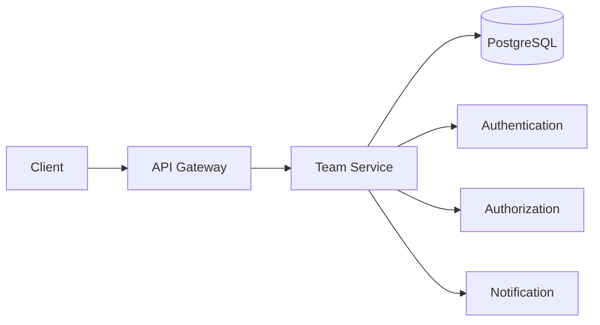
```mermaid
graph LR
    A[Client] --> B[API Gateway]
    B --> C[Team Service]
    C --> D[(PostgreSQL)]
    C --> E[Authentication]
    C --> F[Authorization]
    C --> G[Notification]
```

---

## Database Schema

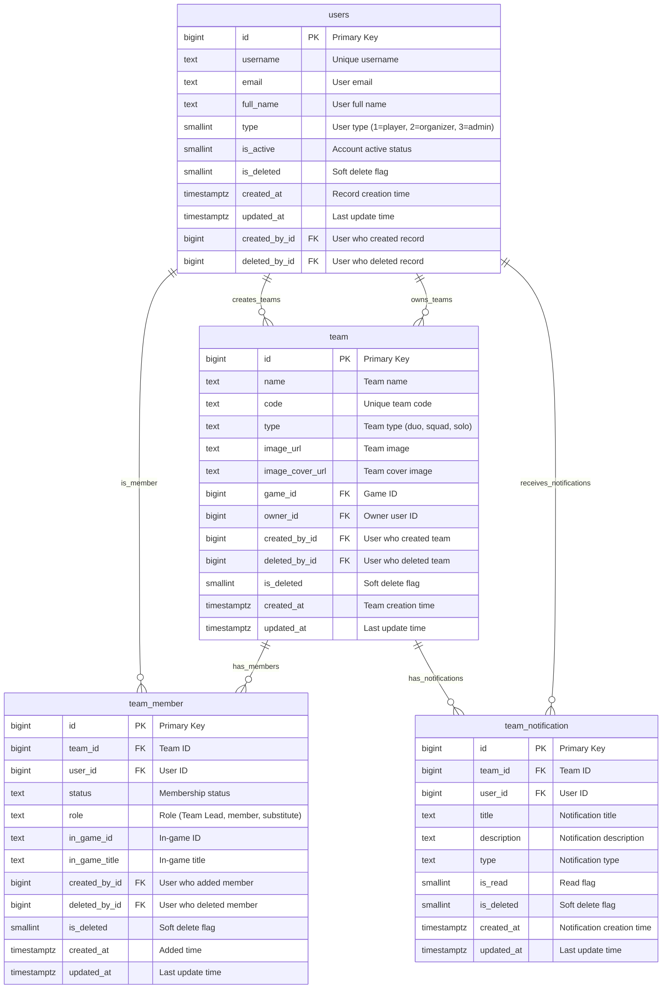
```mermaid
erDiagram
    users ||--o{ team : "creates_teams"
    users ||--o{ team : "owns_teams"
    users ||--o{ team_member : "is_member"
    team ||--o{ team_member : "has_members"
    team ||--o{ team_notification : "has_notifications"
    users ||--o{ team_notification : "receives_notifications"

    users {
        bigint id PK "Primary Key"
        text username "Unique username"
        text email "User email"
        text full_name "User full name"
        smallint type "User type (1=player, 2=organizer, 3=admin)"
        smallint is_active "Account active status"
        smallint is_deleted "Soft delete flag"
        timestamptz created_at "Record creation time"
        timestamptz updated_at "Last update time"
        bigint created_by_id FK "User who created record"
        bigint deleted_by_id FK "User who deleted record"
    }
    team {
        bigint id PK "Primary Key"
        text name "Team name"
        text code "Unique team code"
        text type "Team type (duo, squad, solo)"
        text image_url "Team image"
        text image_cover_url "Team cover image"
        bigint game_id FK "Game ID"
        bigint owner_id FK "Owner user ID"
        bigint created_by_id FK "User who created team"
        bigint deleted_by_id FK "User who deleted team"
        smallint is_deleted "Soft delete flag"
        timestamptz created_at "Team creation time"
        timestamptz updated_at "Last update time"
    }
    team_member {
        bigint id PK "Primary Key"
        bigint team_id FK "Team ID"
        bigint user_id FK "User ID"
        text status "Membership status"
        text role "Role (Team Lead, member, substitute)"
        text in_game_id "In-game ID"
        text in_game_title "In-game title"
        bigint created_by_id FK "User who added member"
        bigint deleted_by_id FK "User who deleted member"
        smallint is_deleted "Soft delete flag"
        timestamptz created_at "Added time"
        timestamptz updated_at "Last update time"
    }
    team_notification {
        bigint id PK "Primary Key"
        bigint team_id FK "Team ID"
        bigint user_id FK "User ID"
        text title "Notification title"
        text description "Notification description"
        text type "Notification type"
        smallint is_read "Read flag"
        smallint is_deleted "Soft delete flag"
        timestamptz created_at "Notification creation time"
        timestamptz updated_at "Last update time"
    }
```

### Relationship Details

| Relationship | Type | Description | Foreign Key |
|--------------|------|-------------|-------------|
| users → team (creation) | One-to-Many | User can create multiple teams | `team.created_by_id` |
| users → team (ownership) | One-to-Many | User can own multiple teams | `team.owner_id` |
| users → team_member | One-to-Many | User can be a member of multiple teams | `team_member.user_id` |
| team → team_member | One-to-Many | Team can have multiple members | `team_member.team_id` |
| team → team_notification | One-to-Many | Team can have multiple notifications | `team_notification.team_id` |
| users → team_notification | One-to-Many | User can receive multiple team notifications | `team_notification.user_id` |

### Index Information

| Table | Index Type | Indexed Fields | Purpose |
|-------|------------|----------------|---------|
| team | btree | `name` | Name-based queries |
| team | btree | `code` | Code-based queries |
| team | btree | `game_id` | Game-based queries |
| team | btree | `owner_id` | Owner-based queries |
| team | btree | `is_deleted` | Soft delete filtering |
| team_member | btree | `team_id, user_id` | Membership queries |
| team_member | btree | `status` | Status-based filtering |
| team_member | btree | `role` | Role-based filtering |
| team_member | btree | `is_deleted` | Soft delete filtering |
| team_notification | btree | `team_id, user_id` | Notification queries |
| team_notification | btree | `is_read` | Read status filtering |

### Unique Constraints

| Constraint | Fields | Description |
|------------|--------|-------------|
| `constraint_unique_team_code` | `code` | Prevents duplicate team codes |
| `constraint_unique_team_name` | `name` | Prevents duplicate team names |
| `constraint_unique_team_member_tug` | `team_id, user_id, in_game_id` | Prevents duplicate team members with same in-game ID |
| `constraint_unique_team_member_tu` | `team_id, user_id` | Prevents duplicate team members |

---

## Base URLs

| Environment   | URL                                 |
|---------------|-------------------------------------|
| Production    | `https://thryl-prod.com   ||    https://thryl-production.zapto.org`      |
| Staging       | `https://thryl-staging.zapto.org` |
| Development   | `http://localhost:3000  || http://localhost:3001`      |

---

## Authentication

All Team Service APIs require JWT authentication. Include the token in the Authorization header:

```http
Authorization: Bearer <your-jwt-token>
```

---

## Authorization

| Role         | Permissions                                      |
|--------------|--------------------------------------------------|
| **Player**   | Create, read, update, delete teams; manage members; search teams |
| **Organizer**| Read teams, manage tournaments                   |
| **Admin**    | Full access                                      |

---

## API Reference

### Complete API List

#### Team APIs

| # | Endpoint                    | Method | Purpose                                 | Auth Required | Role Required         |
|---|-----------------------------|--------|-----------------------------------------|---------------|----------------------|
| 1 | `/team/create`              | POST   | Create a new team                       | Yes           | player, admin, organizer, organizer_team |
| 2 | `/team/owner-read`          | GET    | Get all teams owned by user             | Yes           | player               |
| 3 | `/team/read`                | GET    | Get all teams user has joined           | Yes           | player               |
| 4 | `/team/update/:id`          | PUT    | Update a team                           | Yes           | player               |
| 5 | `/team/delete/:id`          | DELETE | Delete a team                           | Yes           | player               |
| 6 | `/team/thryl-code/:team_id` | GET    | Generate Thryl code for a team          | Yes           | player, admin, organizer, organizer_team |
| 7 | `/team/search`              | GET    | Search my teams                         | Yes           | player, admin, organizer, organizer_team |
| 8 | `/team/global-team-search`  | GET    | Global team search                      | Yes           | player, admin, organizer, organizer_team |
| 9 | `/team/other-profile-team`  | GET    | Get other user's teams                  | Yes           | player               |
|10 | `/team/member-details`      | GET    | Get team and member details             | Yes           | organizer, organizer_team |
|11 | `/team/team-details`        | GET    | Get team details by ID                  | Yes           | player               |
|12 | `/team/team-details-by-tournament-id` | GET | Get team details by tournament ID       | Yes           | organizer, organizer_team |
|13 | `/team/user-in-game-id-and-in-game-title` | GET | Get user in-game ID and title          | Yes           | player               |
|14 | `/team/all-team-with-team-member` | GET | Get all teams with members by game      | Yes           | player               |
|15 | `/team/in-game-titel-and-id` | PUT   | Update in-game title and ID             | Yes           | player               |

#### Team Member APIs

| # | Endpoint                    | Method | Purpose                                 | Auth Required | Role Required         |
|---|-----------------------------|--------|-----------------------------------------|---------------|----------------------|
|16 | `/team-member/update-ingame-details` | PUT | Update member in-game details           | Yes           | player               |
|17 | `/team-member/sent-request` | POST   | Send join team request                  | Yes           | player               |
|18 | `/team-member/read/:team_id`| GET    | Read team members                       | Yes           | player               |
|19 | `/team-member/search`       | GET    | Search team members                     | Yes           | player               |
|20 | `/team-member/accpet-request/:team_id` | POST | Accept team member request              | Yes           | player               |
|21 | `/team-member/reject-request/:team_id` | POST | Reject team member request              | Yes           | player               |
|22 | `/team-member/change-role`  | POST   | Change team member roles                | Yes           | player               |
|23 | `/team-member/delete`       | DELETE | Remove team member                      | Yes           | player               |
|24 | `/team-member/team-type/:team_id/:type` | GET | Get member count by type                | Yes           | player               |
|25 | `/team-member/self-exist/:team_id` | DELETE | Remove self from team                   | Yes           | player               |

--- 

## Validation Schemas

### Create Team Schema
```javascript
{
  image_url: Joi.string().optional(),
  image_cover_url: Joi.string().optional(),
  name: Joi.string().required(),
  game_id: Joi.number().integer().required(),
  type: Joi.string().valid("duo", "squad", "solo").required(),
  created_by_id: Joi.number().integer().optional(),
  code: Joi.string().optional(),
  role: Joi.string().valid("Team Lead", "none", "member", "substitute").required(),
  status: Joi.string().valid("Created", "Requested", "Accepted", "Rejected").required()
}
```

### Update Team Schema
```javascript
{
  image_url: Joi.string().optional(),
  image_cover_url: Joi.string().optional(),
  name: Joi.string().optional(),
  game_id: Joi.number().integer().optional(),
  type: Joi.string().valid("duo", "squad", "solo").optional(),
  role: Joi.string().valid("Team Lead", "member", "substitute").optional(),
  status: Joi.string().valid("Created", "Requested", "Accepted", "Rejected").optional()
}
```

### Create Team Member Schema
```javascript
{
  team_id: Joi.number().integer().optional(),
  user_id: Joi.number().integer().optional(),
  status: Joi.string().valid("Created", "Requested", "Accepted", "Rejected").required(),
  role: Joi.string().valid("Team Lead", "none", "member", "substitute").required()
}
```

### Accept/Reject Team Member Request Schema
```javascript
{
  team_id: Joi.number().integer().optional(),
  user_id: Joi.number().integer().optional(),
  role: Joi.string().valid("Team Lead", "none", "member", "substitute").optional(),
  status: Joi.string().valid("Created", "Requested", "Accepted", "Rejected").optional(),
  inGameId: Joi.string().optional(),
  inGameTitel: Joi.string().optional()
}
```

### Send Team Member Request Schema
```javascript
{
  team_id: Joi.number().integer().optional(),
  user_ids: Joi.array().items(Joi.number().integer().required()),
  invite_via_link: Joi.boolean().default(true).optional(),
  status: Joi.string().valid("Created", "Requested", "Accepted").optional(),
  role: Joi.string().valid("Team Lead", "member", "substitute").optional()
}
```

### Invite Team Member Link Schema
```javascript
{
  team_id: Joi.number().integer().required(),
  user_id: Joi.number().integer().required()
}
```

--- 

## Detailed API Endpoints

### 1. Create Team

**Endpoint:** `POST /team/create`

**Description:** Creates a new team with the specified details.

**Request Body:**
```json
{
  "name": "Team Alpha",
  "game_id": 1,
  "type": "squad",
  "image_url": "https://example.com/team-image.jpg",
  "image_cover_url": "https://example.com/team-cover.jpg",
  "role": "Team Lead",
  "status": "Created"
}
```

**Response:**
```json
{
  "status": 1,
  "data": {
    "id": 123,
    "name": "Team Alpha",
    "code": "TALPHA001",
    "type": "squad",
    "game_id": 1,
    "owner_id": 456,
    "created_by_id": 456,
    "image_url": "https://example.com/team-image.jpg",
    "image_cover_url": "https://example.com/team-cover.jpg",
    "created_at": "2024-01-15T10:30:00Z",
    "updated_at": "2024-01-15T10:30:00Z"
  }
}
```

**Error Response:**
```json
{
  "status": 0,
  "message": "Team name already exists"
}
```

**DFD:**
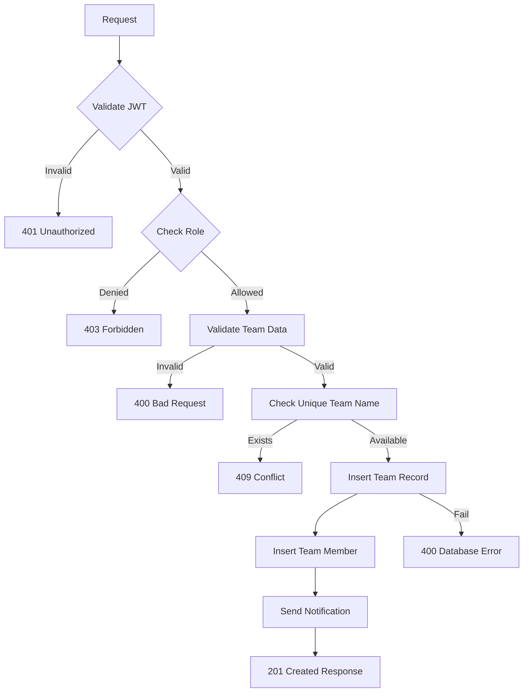
```mermaid
graph TD
    A[Request] --> B{Validate JWT}
    B -->|Invalid| C[401 Unauthorized]
    B -->|Valid| D{Check Role}
    D -->|Denied| E[403 Forbidden]
    D -->|Allowed| F[Validate Team Data]
    F -->|Invalid| G[400 Bad Request]
    F -->|Valid| H[Check Unique Team Name]
    H -->|Exists| I[409 Conflict]
    H -->|Available| J[Insert Team Record]
    J --> K[Insert Team Member]
    K --> L[Send Notification]
    L --> M[201 Created Response]
    J -->|Fail| N[400 Database Error]
```

#### Business Logic

1. **Unique Constraints**: Team name and code must be unique across the platform
2. **Game Validation**: Team must be associated with a valid game
3. **Creator Assignment**: Team creator automatically becomes the team lead
4. **Code Generation**: Unique team code is generated automatically
5. **Member Limit**: Team size is limited based on type (solo: 1, duo: 2, squad: 4)

#### Database Operations

```sql
INSERT INTO team (name, code, type, game_id, owner_id, created_by_id, image_url, image_cover_url)
VALUES ($1, $2, $3, $4, $5, $6, $7, $8)
RETURNING *;
```

---

### 2. Get All Teams (Owner)

**Endpoint:** `GET /team/owner-read?page=1&limit=10&id=123`

**Description:** Retrieves all teams owned by the authenticated user with pagination.

**Query Parameters:**
- `page` (optional): Page number (default: 1)
- `limit` (optional): Items per page (default: 10)
- `id` (optional): Filter by team ID

**Response:**
```json
{
  "status": 1,
  "data": [
    {
      "id": 123,
      "name": "Team Alpha",
      "code": "TALPHA001",
      "type": "squad",
      "game_id": 1,
      "owner_id": 456,
      "member_count": 4,
      "created_at": "2024-01-15T10:30:00Z"
    }
  ],
  "totalTeams": 5,
  "totalPages": 1,
  "currentPage": 1,
  "limit": 10
}
```

**DFD:**
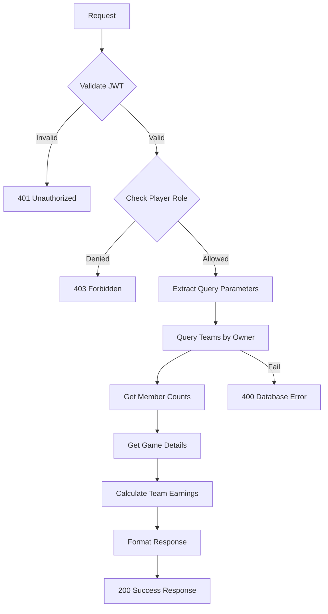
```mermaid
graph TD
    A[Request] --> B{Validate JWT}
    B -->|Invalid| C[401 Unauthorized]
    B -->|Valid| D{Check Player Role}
    D -->|Denied| E[403 Forbidden]
    D -->|Allowed| F[Extract Query Parameters]
    F --> G[Query Teams by Owner]
    G --> H[Get Member Counts]
    H --> I[Get Game Details]
    I --> J[Calculate Team Earnings]
    J --> K[Format Response]
    K --> L[200 Success Response]
    G -->|Fail| M[400 Database Error]
```

#### Business Logic

1. **Owner Filtering**: Only shows teams owned by the authenticated user
2. **Pagination**: Efficient offset-based pagination
3. **Member Count**: Calculates current member count per team
4. **Earnings Calculation**: Shows team earnings from tournaments
5. **Game Integration**: Includes game details for each team

#### Database Operations

```sql
SELECT t.*, COUNT(tm.id) as member_count
FROM team t
LEFT JOIN team_member tm ON t.id = tm.team_id AND tm.status = 'Accepted'
WHERE t.is_deleted = 0
GROUP BY t.id
ORDER BY t.created_at DESC;
```

---

### 3. Get Join Count

**Endpoint:** `GET /team/read?page=1&limit=10&id=123`

**Description:** Retrieves teams that the user has joined with pagination.

**Response:**
```json
{
  "status": 1,
  "data": [
    {
      "id": 123,
      "name": "Team Alpha",
      "code": "TALPHA001",
      "type": "squad",
      "game_id": 1,
      "role": "member",
      "status": "Accepted",
      "joined_at": "2024-01-15T10:30:00Z"
    }
  ],
  "countPage": 3,
  "page": 1
}
```

**DFD:**
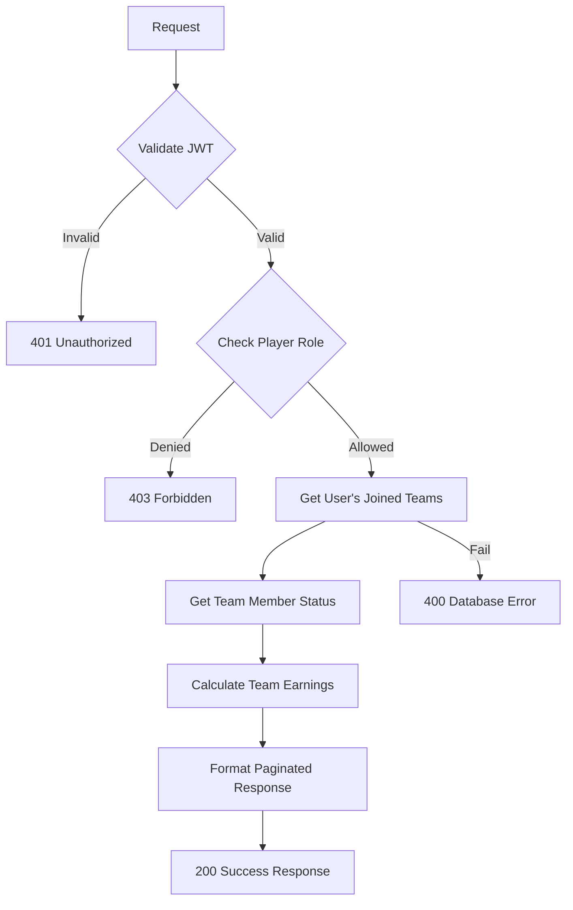
```mermaid
graph TD
    A[Request] --> B{Validate JWT}
    B -->|Invalid| C[401 Unauthorized]
    B -->|Valid| D{Check Player Role}
    D -->|Denied| E[403 Forbidden]
    D -->|Allowed| F[Get User's Joined Teams]
    F --> G[Get Team Member Status]
    G --> H[Calculate Team Earnings]
    H --> I[Format Paginated Response]
    I --> J[200 Success Response]
    F -->|Fail| K[400 Database Error]
```

#### Business Logic

1. **Joined Teams**: Shows teams where user is a member
2. **Status Filtering**: Only shows accepted team memberships
3. **Earnings Tracking**: Calculates user's earnings from team tournaments
4. **Pagination**: Efficient pagination for large result sets
5. **Role Information**: Shows user's role in each team

#### Database Operations

```sql
SELECT tm.team_id, t.name, t.type, tm.role, tm.status, tm.created_at as joined_at
FROM team_member tm
JOIN team t ON tm.team_id = t.id
WHERE tm.user_id = $1 AND tm.status = 'Accepted'
ORDER BY tm.created_at DESC;
```

---

### 4. Update Team

**Endpoint:** `PUT /team/update/:id`

**Description:** Updates an existing team's details.

**Request Body:**
```json
{
  "name": "Team Alpha Updated",
  "type": "duo",
  "image_url": "https://example.com/new-team-image.jpg"
}
```

**Response:**
```json
{
  "status": 1,
  "data": {
    "id": 123,
    "name": "Team Alpha Updated",
    "type": "duo",
    "image_url": "https://example.com/new-team-image.jpg",
    "updated_at": "2024-01-15T11:30:00Z"
  }
}
```

**DFD:**
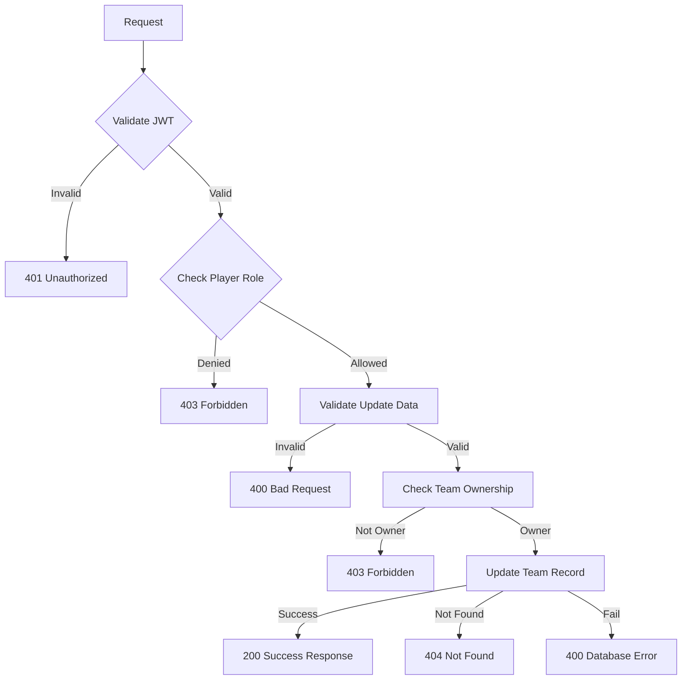
```mermaid
graph TD
    A[Request] --> B{Validate JWT}
    B -->|Invalid| C[401 Unauthorized]
    B -->|Valid| D{Check Player Role}
    D -->|Denied| E[403 Forbidden]
    D -->|Allowed| F[Validate Update Data]
    F -->|Invalid| G[400 Bad Request]
    F -->|Valid| H[Check Team Ownership]
    H -->|Not Owner| I[403 Forbidden]
    H -->|Owner| J[Update Team Record]
    J -->|Success| K[200 Success Response]
    J -->|Not Found| L[404 Not Found]
    J -->|Fail| M[400 Database Error]
```

#### Business Logic

1. **Ownership Validation**: Only team owners can update team details
2. **Partial Updates**: Supports updating specific fields only
3. **Validation**: Validates input data before update
4. **Audit Trail**: Tracks who made the update and when
5. **Unique Constraints**: Maintains unique team name and code constraints

#### Database Operations

```sql
UPDATE team 
SET 
    name = COALESCE($1, name),
    type = COALESCE($2, type),
    image_url = COALESCE($3, image_url),
    image_cover_url = COALESCE($4, image_cover_url),
    updated_at = NOW()
WHERE id = $5 AND owner_id = $6
RETURNING *;
```

---

### 5. Delete Team

**Endpoint:** `DELETE /team/delete/:id`

**Description:** Soft deletes a team (marks as deleted).

**Response:**
```json
{
  "status": 1,
  "data": {
    "id": 123,
    "is_deleted": 1,
    "deleted_by_id": 456,
    "deleted_at": "2024-01-15T12:30:00Z"
  }
}
```

**DFD:**
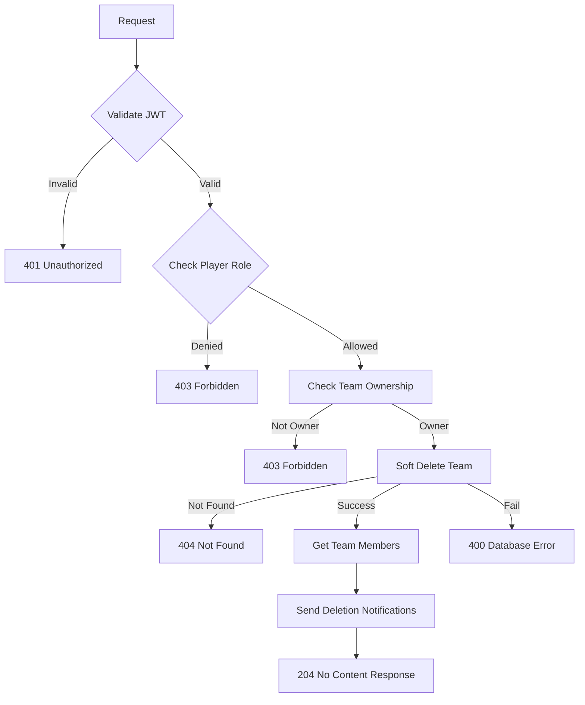
```mermaid
graph TD
    A[Request] --> B{Validate JWT}
    B -->|Invalid| C[401 Unauthorized]
    B -->|Valid| D{Check Player Role}
    D -->|Denied| E[403 Forbidden]
    D -->|Allowed| F[Check Team Ownership]
    F -->|Not Owner| G[403 Forbidden]
    F -->|Owner| H[Soft Delete Team]
    H -->|Not Found| I[404 Not Found]
    H -->|Success| J[Get Team Members]
    J --> K[Send Deletion Notifications]
    K --> L[204 No Content Response]
    H -->|Fail| M[400 Database Error]
```

#### Business Logic

1. **Ownership Validation**: Only team owners can delete teams
2. **Soft Delete**: Marks team as deleted without removing data
3. **Member Notification**: Notifies all team members about deletion
4. **Data Preservation**: Keeps team data for audit purposes
5. **Cascade Handling**: Handles related data appropriately

#### Database Operations

```sql
UPDATE team 
SET is_deleted = 1, deleted_by_id = $1, deleted_at = NOW() 
WHERE id = $2 AND owner_id = $3
RETURNING *;
```

---

### 6. Generate Thryl Code

**Endpoint:** `GET /team/thryl-code/:team_id`

**Description:** Generates a unique Thryl code for team invitations.

**Response:**
```json
{
  "status": 1,
  "data": {
    "team_id": 123,
    "thryl_code": "THRYL_TEAM_ABC123",
    "expires_at": "2024-02-15T10:30:00Z"
  }
}
```

**DFD:**
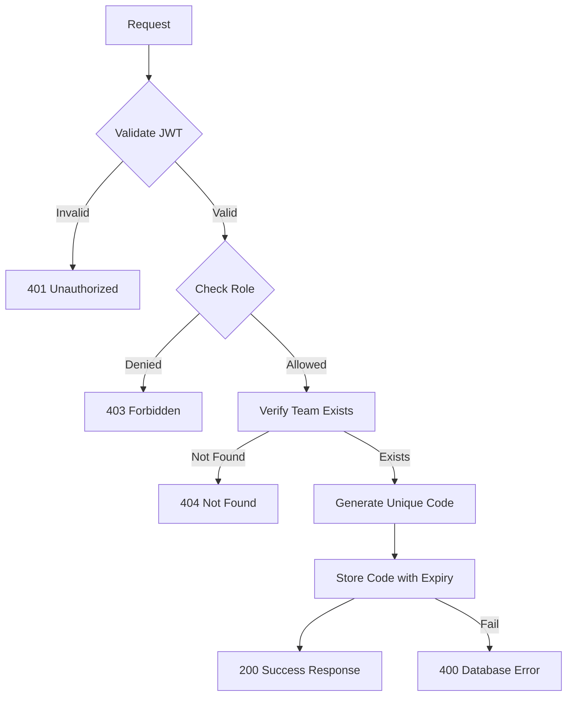
```mermaid
graph TD
    A[Request] --> B{Validate JWT}
    B -->|Invalid| C[401 Unauthorized]
    B -->|Valid| D{Check Role}
    D -->|Denied| E[403 Forbidden]
    D -->|Allowed| F[Verify Team Exists]
    F -->|Not Found| G[404 Not Found]
    F -->|Exists| H[Generate Unique Code]
    H --> I[Store Code with Expiry]
    I --> J[200 Success Response]
    I -->|Fail| K[400 Database Error]
```

#### Business Logic

1. **Team Verification**: Ensures team exists before generating code
2. **Unique Code Generation**: Creates unique invitation codes
3. **Expiry Management**: Sets expiration time for codes
4. **Access Control**: Only team members can generate codes
5. **Code Storage**: Stores codes with metadata

#### Database Operations

```sql
UPDATE team 
SET code = $1, updated_at = NOW() 
WHERE id = $2
RETURNING id, code, updated_at;
```

---

### 7. My Team Search

**Endpoint:** `GET /team/search?keyword=alpha&page=1&limit=10`

**Description:** Searches through user's own teams and games.

**Response:**
```json
{
  "status": 1,
  "teams": [
    {
      "id": 123,
      "name": "Team Alpha",
      "type": "squad",
      "game_id": 1
    }
  ],
  "games": [
    {
      "id": 1,
      "name": "PUBG Mobile",
      "category": "Battle Royale"
    }
  ],
  "totalResults": 2
}
```

**DFD:**
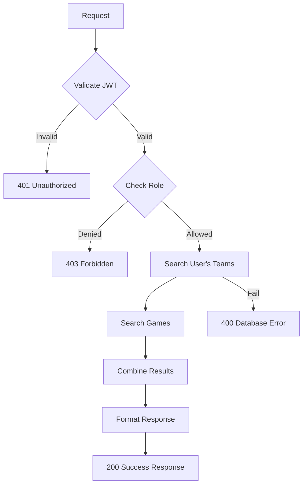
```mermaid
graph TD
    A[Request] --> B{Validate JWT}
    B -->|Invalid| C[401 Unauthorized]
    B -->|Valid| D{Check Role}
    D -->|Denied| E[403 Forbidden]
    D -->|Allowed| F[Search User's Teams]
    F --> G[Search Games]
    G --> H[Combine Results]
    H --> I[Format Response]
    I --> J[200 Success Response]
    F -->|Fail| K[400 Database Error]
```

#### Business Logic

1. **Personal Search**: Searches through user's own teams
2. **Game Integration**: Also searches through available games
3. **Keyword Matching**: Uses case-insensitive search
4. **Result Combination**: Combines team and game results
5. **Pagination**: Supports paginated results

#### Database Operations

```sql
-- Search teams
SELECT t.* FROM team t 
WHERE t.owner_id = $1 AND t.name ILIKE $2
ORDER BY t.created_at DESC;

-- Search games
SELECT g.* FROM game g 
WHERE g.title ILIKE $1
ORDER BY g.title;
```

---

### 8. Global Team Search

**Endpoint:** `GET /team/global-team-search?keyword=alpha&page=1&limit=10`

**Description:** Searches through all public teams and games.

**Response:**
```json
{
  "status": 1,
  "teams": [
    {
      "id": 123,
      "name": "Team Alpha",
      "type": "squad",
      "member_count": 4,
      "owner_name": "John Doe"
    }
  ],
  "games": [
    {
      "id": 1,
      "name": "PUBG Mobile",
      "category": "Battle Royale"
    }
  ],
  "totalResults": 5
}
```

**DFD:**
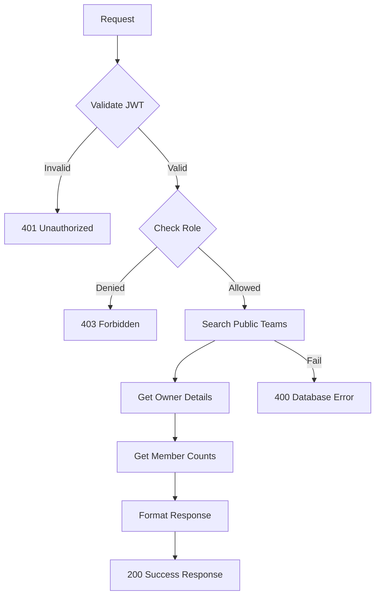
```mermaid
graph TD
    A[Request] --> B{Validate JWT}
    B -->|Invalid| C[401 Unauthorized]
    B -->|Valid| D{Check Role}
    D -->|Denied| E[403 Forbidden]
    D -->|Allowed| F[Search Public Teams]
    F --> G[Get Owner Details]
    G --> H[Get Member Counts]
    H --> I[Format Response]
    I --> J[200 Success Response]
    F -->|Fail| K[400 Database Error]
```

#### Business Logic

1. **Public Search**: Searches through all public teams
2. **Owner Information**: Includes team owner details
3. **Member Count**: Shows current member count for each team
4. **Game Integration**: Also searches through available games
5. **Pagination**: Supports paginated results

#### Database Operations

```sql
-- Search public teams
SELECT t.*, u.full_name as owner_name, COUNT(tm.id) as member_count
FROM team t
JOIN users u ON t.owner_id = u.id
LEFT JOIN team_member tm ON t.id = tm.team_id AND tm.status = 'Accepted'
WHERE t.is_deleted = 0 AND t.name ILIKE $1
GROUP BY t.id, u.full_name
ORDER BY t.created_at DESC;

-- Search games
SELECT g.* FROM game g 
WHERE g.title ILIKE $1
ORDER BY g.title;
```

---

### 9. Other Profile Teams

**Endpoint:** `GET /team/other-profile-team?user_id=789&page=1&limit=10`

**Description:** Retrieves teams of another user for profile viewing.

**Response:**
```json
{
  "status": 1,
  "data": [
    {
      "id": 123,
      "name": "Team Alpha",
      "type": "squad",
      "member_count": 4,
      "created_at": "2024-01-15T10:30:00Z"
    }
  ],
  "totalTeams": 3,
  "limit": 10
}
```

**DFD:**
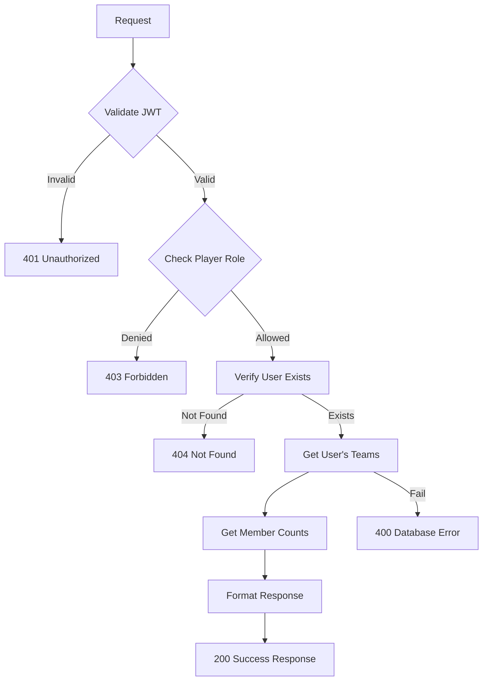
```mermaid
graph TD
    A[Request] --> B{Validate JWT}
    B -->|Invalid| C[401 Unauthorized]
    B -->|Valid| D{Check Player Role}
    D -->|Denied| E[403 Forbidden]
    D -->|Allowed| F[Verify User Exists]
    F -->|Not Found| G[404 Not Found]
    F -->|Exists| H[Get User's Teams]
    H --> I[Get Member Counts]
    I --> J[Format Response]
    J --> K[200 Success Response]
    H -->|Fail| L[400 Database Error]
```

#### Business Logic

1. **User Verification**: Ensures the target user exists
2. **Team Retrieval**: Gets all teams owned by the user
3. **Member Count**: Calculates member count for each team
4. **Privacy Control**: Only shows public team information
5. **Pagination**: Supports paginated results

#### Database Operations

```sql
SELECT t.*, COUNT(tm.id) as member_count
FROM team t
LEFT JOIN team_member tm ON t.id = tm.team_id AND tm.status = 'Accepted'
WHERE t.owner_id = $1 AND t.is_deleted = 0
GROUP BY t.id
ORDER BY t.created_at DESC
LIMIT $2 OFFSET $3;
```

---

### 10. Team and Member Details

**Endpoint:** `GET /team/member-details?team_id=123&tournament_id=456&tournament_match_id=789`

**Description:** Retrieves detailed team and member information for organizers.

**Response:**
```json
{
  "status": 1,
  "data": {
    "team": {
      "id": 123,
      "name": "Team Alpha",
      "type": "squad",
      "game_id": 1
    },
    "members": [
      {
        "id": 456,
        "user_id": 789,
        "role": "Team Lead",
        "status": "Accepted",
        "in_game_id": "PUBG_123",
        "in_game_title": "AlphaLeader"
      }
    ]
  }
}
```

**DFD:**
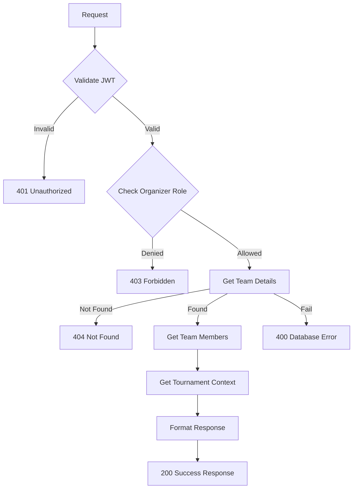
```mermaid
graph TD
    A[Request] --> B{Validate JWT}
    B -->|Invalid| C[401 Unauthorized]
    B -->|Valid| D{Check Organizer Role}
    D -->|Denied| E[403 Forbidden]
    D -->|Allowed| F[Get Team Details]
    F -->|Not Found| G[404 Not Found]
    F -->|Found| H[Get Team Members]
    H --> I[Get Tournament Context]
    I --> J[Format Response]
    J --> K[200 Success Response]
    F -->|Fail| L[400 Database Error]
```

#### Business Logic

1. **Organizer Access**: Only tournament organizers can access this data
2. **Team Context**: Shows team details in tournament context
3. **Member Details**: Includes all team member information
4. **Game Integration**: Shows in-game IDs and titles
5. **Tournament Integration**: Links to tournament registration

#### Database Operations

```sql
-- Get team details
SELECT t.* FROM team t WHERE t.id = $1;

-- Get team members
SELECT tm.*, u.in_game_id, u.in_game_title 
FROM team_member tm
JOIN users u ON tm.user_id = u.id
WHERE tm.team_id = $1;
```

---

### 11. Team Details by ID

**Endpoint:** `GET /team/team-details?team_id=123`

**Description:** Retrieves detailed information about a specific team.

**Response:**
```json
{
  "status": 1,
  "data": {
    "id": 123,
    "name": "Team Alpha",
    "code": "TALPHA001",
    "type": "squad",
    "game_id": 1,
    "owner_id": 456,
    "member_count": 4,
    "created_at": "2024-01-15T10:30:00Z"
  }
}
```

**DFD:**
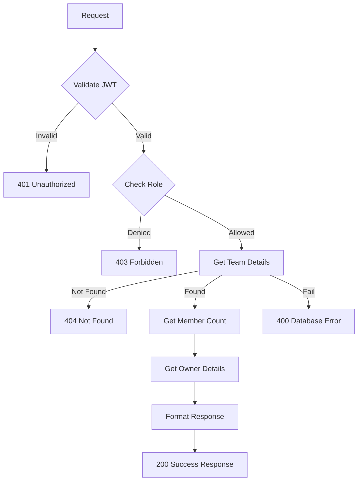
```mermaid
graph TD
    A[Request] --> B{Validate JWT}
    B -->|Invalid| C[401 Unauthorized]
    B -->|Valid| D{Check Role}
    D -->|Denied| E[403 Forbidden]
    D -->|Allowed| F[Get Team Details]
    F -->|Not Found| G[404 Not Found]
    F -->|Found| H[Get Member Count]
    H --> I[Get Owner Details]
    I --> J[Format Response]
    J --> K[200 Success Response]
    F -->|Fail| L[400 Database Error]
```

#### Business Logic

1. **Team Retrieval**: Gets detailed team information
2. **Member Count**: Calculates current member count
3. **Owner Information**: Includes team owner details
4. **Public Access**: Accessible to all authenticated users
5. **Data Validation**: Ensures team exists and is not deleted

#### Database Operations

```sql
SELECT t.*, COUNT(tm.id) as member_count, u.full_name as owner_name
FROM team t
LEFT JOIN team_member tm ON t.id = tm.team_id AND tm.status = 'Accepted'
JOIN users u ON t.owner_id = u.id
WHERE t.id = $1 AND t.is_deleted = 0
GROUP BY t.id, u.full_name;
```

---

### 12. Team Details by Tournament ID

**Endpoint:** `GET /team/team-details-by-tournament-id?team_id=123&tournament_id=456`

**Description:** Retrieves team details in the context of a specific tournament.

**Response:**
```json
{
  "status": 1,
  "data": {
    "team_id": 123,
    "tournament_id": 456,
    "team_name": "Team Alpha",
    "tournament_name": "Winter Championship",
    "registration_status": "Confirmed",
    "match_results": []
  }
}
```

**DFD:**
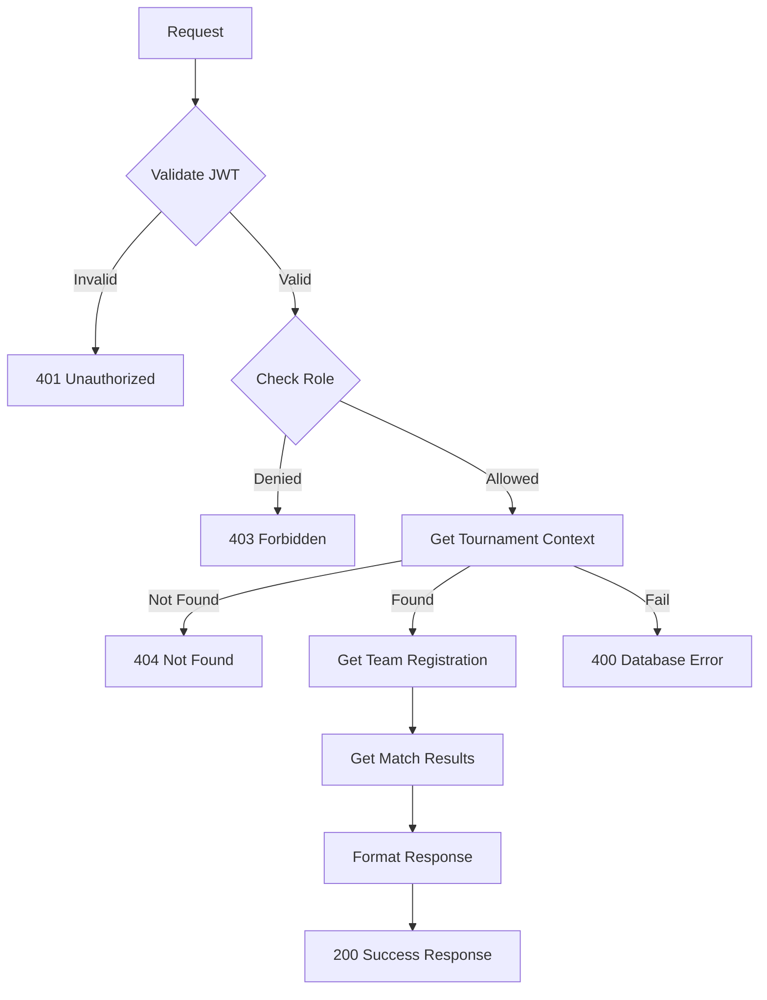
```mermaid
graph TD
    A[Request] --> B{Validate JWT}
    B -->|Invalid| C[401 Unauthorized]
    B -->|Valid| D{Check Role}
    D -->|Denied| E[403 Forbidden]
    D -->|Allowed| F[Get Tournament Context]
    F -->|Not Found| G[404 Not Found]
    F -->|Found| H[Get Team Registration]
    H --> I[Get Match Results]
    I --> J[Format Response]
    J --> K[200 Success Response]
    F -->|Fail| L[400 Database Error]
```

#### Business Logic

1. **Tournament Context**: Shows team details in specific tournament
2. **Registration Status**: Displays tournament registration status
3. **Match Results**: Includes tournament match results
4. **Team Integration**: Links team to tournament participation
5. **Data Validation**: Ensures both team and tournament exist

#### Database Operations

```sql
-- Get tournament registration
SELECT tr.*, t.name as team_name, tour.title as tournament_name
FROM tournament_registration tr
JOIN team t ON tr.team_id = t.id
JOIN tournament tour ON tr.tournament_id = tour.id
WHERE tr.team_id = $1 AND tr.tournament_id = $2;
```

---

### 13. User In-Game ID and Title

**Endpoint:** `GET /team/user-in-game-id-and-in-game-title?user_id=789&game_id=1`

**Description:** Retrieves a user's in-game ID and title for a specific game.

**Response:**
```json
{
  "status": 1,
  "data": {
    "user_id": 789,
    "game_id": 1,
    "in_game_id": "PUBG_123",
    "in_game_title": "AlphaPlayer"
  }
}
```

**DFD:**
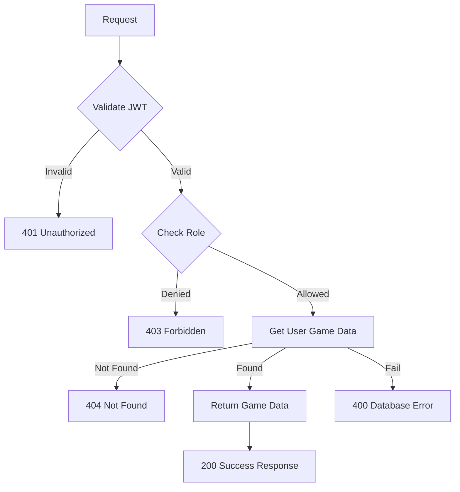
```mermaid
graph TD
    A[Request] --> B{Validate JWT}
    B -->|Invalid| C[401 Unauthorized]
    B -->|Valid| D{Check Role}
    D -->|Denied| E[403 Forbidden]
    D -->|Allowed| F[Get User Game Data]
    F -->|Not Found| G[404 Not Found]
    F -->|Found| H[Return Game Data]
    H --> I[200 Success Response]
    F -->|Fail| J[400 Database Error]
```

#### Business Logic

1. **User Game Data**: Retrieves user's in-game information
2. **Game Specific**: Shows data for specific game only
3. **Data Validation**: Ensures user and game exist
4. **Public Access**: Accessible to all authenticated users
5. **Simple Retrieval**: Direct data lookup without complex joins

#### Database Operations

```sql
SELECT u.in_game_id, u.in_game_title
FROM users u
WHERE u.id = $1 AND u.game_id = $2;
```

---

### 14. All Teams with Team Members

**Endpoint:** `GET /team/all-team-with-team-member?game_id=1&user_id=789&keyword=alpha&page=1&limit=10`

**Description:** Retrieves all teams with their members for a specific game.

**Response:**
```json
{
  "status": 1,
  "data": [
    {
      "team": {
        "id": 123,
        "name": "Team Alpha",
        "type": "squad"
      },
      "members": [
        {
          "user_id": 789,
          "role": "Team Lead",
          "in_game_id": "PUBG_123"
        }
      ]
    }
  ]
}
```

### 15. Update In-Game Title and ID

**Endpoint:** `PUT /team/in-game-titel-and-id?user_id=789`

**Description:** Updates a user's in-game title and ID.

**Request Body:**
```json
{
  "game_id": 1,
  "in_game_id": "PUBG_456",
  "in_game_title": "NewPlayerName"
}
```

**Response:**
```json
{
  "status": 1,
  "data": {
    "user_id": 789,
    "game_id": 1,
    "in_game_id": "PUBG_456",
    "in_game_title": "NewPlayerName",
    "updated_at": "2024-01-15T13:30:00Z"
  }
}
```

### 16. Update Member In-Game Details

**Endpoint:** `PUT /team-member/update-ingame-details?team_id=123`

**Description:** Updates a team member's in-game ID and title.

**Request Body:**
```json
{
  "inGameId": "PUBG_789",
  "inGameTitel": "UpdatedPlayer"
}
```

**Response:**
```json
{
  "status": 1,
  "data": {
    "team_id": 123,
    "user_id": 456,
    "in_game_id": "PUBG_789",
    "in_game_title": "UpdatedPlayer",
    "updated_at": "2024-01-15T14:30:00Z"
  }
}
```

### 17. Send Join Team Request

**Endpoint:** `POST /team-member/sent-request`

**Description:** Sends join team requests to multiple users.

**Request Body:**
```json
{
  "user_ids": [789, 790, 791],
  "team_id": 123,
  "invite_via_link": true
}
```

**Response:**
```json
{
  "status": 1,
  "data": [
    {
      "team_id": 123,
      "user_id": 789,
      "status": "Requested",
      "invite_sent": true
    }
  ]
}
```

### 18. Read Team Members

**Endpoint:** `GET /team-member/read/:team_id`

**Description:** Retrieves all members of a specific team.

**Response:**
```json
{
  "status": 1,
  "data": [
    {
      "id": 456,
      "team_id": 123,
      "user_id": 789,
      "role": "Team Lead",
      "status": "Accepted",
      "in_game_id": "PUBG_123",
      "in_game_title": "AlphaLeader",
      "user": {
        "id": 789,
        "full_name": "John Doe",
        "profile_pic_url": "https://example.com/profile.jpg"
      }
    }
  ]
}
```

### 19. Search Team Members

**Endpoint:** `GET /team-member/search?keyword=john`

**Description:** Searches for team members by keyword.

**Response:**
```json
{
  "status": 1,
  "data": [
    {
      "id": 456,
      "user_id": 789,
      "full_name": "John Doe",
      "username": "johndoe",
      "profile_pic_url": "https://example.com/profile.jpg"
    }
  ]
}
```

### 20. Accept Team Member Request

**Endpoint:** `POST /team-member/accpet-request/:team_id`

**Description:** Accepts a team member join request.

**Request Body:**
```json
{
  "inGameId": "PUBG_123",
  "inGameTitel": "NewMember"
}
```

**Response:**
```json
{
  "status": 1,
  "data": {
    "team_id": 123,
    "user_id": 789,
    "status": "Accepted",
    "role": "member",
    "in_game_id": "PUBG_123",
    "in_game_title": "NewMember"
  }
}
```

### 21. Reject Team Member Request

**Endpoint:** `POST /team-member/reject-request/:team_id`

**Description:** Rejects a team member join request.

**Response:**
```json
{
  "status": 1,
  "data": {
    "team_id": 123,
    "user_id": 789,
    "status": "Rejected"
  }
}
```

### 22. Change Team Member Roles

**Endpoint:** `POST /team-member/change-role`

**Description:** Changes roles between two team members.

**Request Body:**
```json
{
  "teamId": 123,
  "myUserId": 789,
  "targetUserId": 790
}
```

**Response:**
```json
{
  "status": 1,
  "data": [
    {
      "user_id": 789,
      "role": "member"
    },
    {
      "user_id": 790,
      "role": "Team Lead"
    }
  ]
}
```

### 23. Remove Team Member

**Endpoint:** `DELETE /team-member/delete`

**Description:** Removes a member from a team.

**Request Body:**
```json
{
  "team_id": 123,
  "user_id": 789
}
```

**Response:**
```json
{
  "status": 1,
  "data": {
    "team_id": 123,
    "user_id": 789,
    "removed_by": 456,
    "removed_at": "2024-01-15T15:30:00Z"
  }
}
```

### 24. Get Member Count by Type

**Endpoint:** `GET /team-member/team-type/:team_id/:type`

**Description:** Gets the count of team members by type (member/substitute).

**Response:**
```json
{
  "status": 1,
  "data": {
    "team_id": 123,
    "type": "member",
    "count": 3
  }
}
```

### 25. Remove Self from Team

**Endpoint:** `DELETE /team-member/self-exist/:team_id`

**Description:** Allows a user to remove themselves from a team.

**Response:**
```json
{
  "status": 1,
  "data": {
    "team_id": 123,
    "user_id": 789,
    "removed_at": "2024-01-15T16:30:00Z"
  }
}
```

---


---

## Business Logic

### Team Creation Rules
1. **Unique Constraints**: Team name and code must be unique across the platform
2. **Game Validation**: Team must be associated with a valid game
3. **Creator Assignment**: Team creator automatically becomes the team lead
4. **Code Generation**: Unique team code is generated automatically
5. **Member Limit**: Team size is limited based on type (solo: 1, duo: 2, squad: 4)

### Member Management Rules
1. **Role Hierarchy**: Only team leads can change member roles
2. **Invitation System**: Users must be invited to join teams
3. **Status Flow**: Requested → Accepted/Rejected
4. **In-Game Identity**: Members must provide in-game ID and title
5. **Leave Policy**: Members can leave teams voluntarily

### Search and Discovery
1. **Privacy Control**: Teams can be public or private
2. **Game-Based Filtering**: Search results filtered by game
3. **Member Count**: Public teams show member count
4. **Owner Information**: Public teams show owner details

---

## Database Operations

### Key SQL Queries

#### Create Team
```sql
INSERT INTO team (name, code, type, game_id, owner_id, created_by_id, image_url, image_cover_url)
VALUES ($1, $2, $3, $4, $5, $6, $7, $8)
RETURNING *;
```

#### Get Teams with Member Count
```sql
SELECT t.*, COUNT(tm.id) as member_count
FROM team t
LEFT JOIN team_member tm ON t.id = tm.team_id AND tm.status = 'Accepted'
WHERE t.is_deleted = 0
GROUP BY t.id
ORDER BY t.created_at DESC;
```

#### Search Teams
```sql
SELECT t.*, u.full_name as owner_name
FROM team t
JOIN users u ON t.owner_id = u.id
WHERE t.name ILIKE $1 
  AND t.is_deleted = 0
  AND t.game_id = $2
ORDER BY t.created_at DESC;
```

#### Get Team Members
```sql
SELECT tm.*, u.full_name, u.profile_pic_url
FROM team_member tm
JOIN users u ON tm.user_id = u.id
WHERE tm.team_id = $1 
  AND tm.is_deleted = 0
ORDER BY tm.role DESC, tm.created_at ASC;
```

#### Update Member Role
```sql
UPDATE team_member 
SET role = $1, updated_at = NOW()
WHERE team_id = $2 AND user_id = $3;
```

---

## Error Handling

### Common Error Codes

| Error Code | Description | Resolution |
|------------|-------------|------------|
| 400 | Bad Request - Invalid input data | Check request body and parameters |
| 401 | Unauthorized - Invalid token | Re-authenticate user |
| 403 | Forbidden - Insufficient permissions | Check user role and permissions |
| 404 | Not Found - Team/Member not found | Verify team/member ID |
| 409 | Conflict - Duplicate team name/code | Use different name/code |
| 422 | Validation Error - Invalid data format | Check validation schemas |
| 500 | Internal Server Error | Contact support |

### Error Response Format
```json
{
  "status": 0,
  "message": "Error description",
  "code": "ERROR_CODE",
  "details": {
    "field": "Specific field error"
  }
}
```

---

## Rate Limiting

| Endpoint Category | Rate Limit | Window |
|-------------------|------------|--------|
| Team Creation | 5 requests | 1 hour |
| Team Search | 100 requests | 1 minute |
| Member Invitations | 20 requests | 1 hour |
| Team Updates | 50 requests | 1 hour |

---

## Security Considerations

### Authentication
- All endpoints require valid JWT token
- Token expiration: 24 hours
- Refresh token mechanism available

### Authorization
- Role-based access control (RBAC)
- Team ownership validation
- Member permission checks

### Data Protection
- Input validation and sanitization
- SQL injection prevention
- XSS protection
- Rate limiting on sensitive operations

### Privacy
- User data encryption at rest
- Secure transmission (HTTPS)
- Audit logging for sensitive operations

---

## Business Rules

### Team Management
1. **Ownership Transfer**: Only team leads can transfer ownership
2. **Deletion Policy**: Teams can only be deleted by owners
3. **Member Limits**: Enforced based on team type
4. **Code Regeneration**: Thryl codes expire and can be regenerated

### Member Management
1. **Invitation Expiry**: Invitations expire after 7 days
2. **Role Restrictions**: Only one team lead per team
3. **Leave Policy**: Members can leave without approval
4. **Rejoin Policy**: Removed members can rejoin after 24 hours

### Search and Discovery
1. **Privacy Settings**: Teams can control visibility
2. **Game Filtering**: Search results filtered by game
3. **Member Count**: Public teams show current member count
4. **Owner Information**: Public teams show owner details

---

## Monitoring and Logging

### Key Metrics
- Team creation rate
- Member invitation success rate
- Search query performance
- API response times
- Error rates by endpoint

### Logging
- All team operations logged
- Member changes tracked
- Search queries logged
- Error details captured
- Performance metrics recorded

### Alerts
- High error rates
- Performance degradation
- Security violations
- Rate limit violations

---

## Integration Examples

### Frontend Integration
```javascript
// Create team
const createTeam = async (teamData) => {
  const response = await fetch('/api/v1/team/create', {
    method: 'POST',
    headers: {
      'Authorization': `Bearer ${token}`,
      'Content-Type': 'application/json'
    },
    body: JSON.stringify(teamData)
  });
  return response.json();
};

// Search teams
const searchTeams = async (keyword) => {
  const response = await fetch(`/api/v1/team/search?keyword=${keyword}`, {
    headers: {
      'Authorization': `Bearer ${token}`
    }
  });
  return response.json();
};
```

### Mobile App Integration
```swift
// Swift example for team creation
func createTeam(teamData: [String: Any]) async throws -> Team {
    let url = URL(string: "\(baseURL)/team/create")!
    var request = URLRequest(url: url)
    request.httpMethod = "POST"
    request.setValue("Bearer \(token)", forHTTPHeaderField: "Authorization")
    request.setValue("application/json", forHTTPHeaderField: "Content-Type")
    request.httpBody = try JSONSerialization.data(withJSONObject: teamData)
    
    let (data, _) = try await URLSession.shared.data(for: request)
    return try JSONDecoder().decode(Team.self, from: data)
}
```

---

## Use Cases

### 1. Team Creation and Management
- **Scenario**: User wants to create a team for PUBG Mobile tournament
- **Flow**: Create team → Invite members → Set roles → Join tournament
- **APIs Used**: Create team, Send invitations, Update roles

### 2. Team Discovery and Joining
- **Scenario**: User wants to find and join an existing team
- **Flow**: Search teams → View details → Send join request → Accept invitation
- **APIs Used**: Global search, Team details, Send request, Accept request

### 3. Tournament Team Management
- **Scenario**: Organizer needs to manage tournament teams
- **Flow**: View team details → Verify members → Check in-game IDs
- **APIs Used**: Team details, Member details, In-game ID verification

### 4. Team Member Role Management
- **Scenario**: Team lead wants to change member roles
- **Flow**: View current roles → Select members → Change roles
- **APIs Used**: Read members, Change roles

---

## Performance Considerations

### Database Optimization
- Indexed queries for team searches
- Pagination for large result sets
- Efficient joins for member queries
- Caching for frequently accessed data

### API Optimization
- Response compression
- Efficient error handling
- Rate limiting to prevent abuse
- Connection pooling

### Caching Strategy
- Team details cached for 5 minutes
- Search results cached for 2 minutes
- Member lists cached for 1 minute
- User profiles cached for 10 minutes

---

## Testing Scenarios

### Unit Tests
- Team creation with valid data
- Team creation with duplicate name
- Member invitation flow
- Role change validation
- Search functionality

### Integration Tests
- End-to-end team creation flow
- Member invitation and acceptance
- Team search and discovery
- Role management workflow

### Performance Tests
- Large dataset searches
- Concurrent team operations
- High-volume member management
- API response time validation

### Security Tests
- Authentication bypass attempts
- Authorization validation
- Input validation testing
- SQL injection prevention

---

## Troubleshooting

### Common Issues

#### Team Creation Fails
- **Issue**: "Team name already exists"
- **Solution**: Check for existing teams with same name
- **Prevention**: Implement name availability check

#### Member Invitation Fails
- **Issue**: "User not found"
- **Solution**: Verify user ID exists
- **Prevention**: Add user validation

#### Search Returns No Results
- **Issue**: Empty search results
- **Solution**: Check search parameters and filters
- **Prevention**: Implement search suggestions

#### Role Change Fails
- **Issue**: "Insufficient permissions"
- **Solution**: Verify user is team lead
- **Prevention**: Add role validation

### Debug Information
- Request/response logging
- Database query logging
- Performance metrics
- Error stack traces

---

## Support and Maintenance

### Documentation Updates
- API versioning strategy
- Changelog maintenance
- Migration guides
- Best practices updates

### Monitoring
- Real-time performance monitoring
- Error tracking and alerting
- Usage analytics
- Security monitoring

### Maintenance Schedule
- Weekly performance reviews
- Monthly security audits
- Quarterly feature updates
- Annual architecture reviews 