## Overview

The **Utility Service** provides essential utility functions for the Thryl platform, including OTP generation and delivery, file uploads, version management, environment configuration, and feature announcements.

### Tech Stack
- **Backend**: Node.js, Express.js
- **Database**: PostgreSQL
- **Storage**: AWS S3
- **Email**: AWS SES, Azure Email
- **SMS**: AWS SNS, MSG91
- **Queue**: AWS SQS
- **Authentication**: JWT
- **File Upload**: Multer

---

## System Architecture

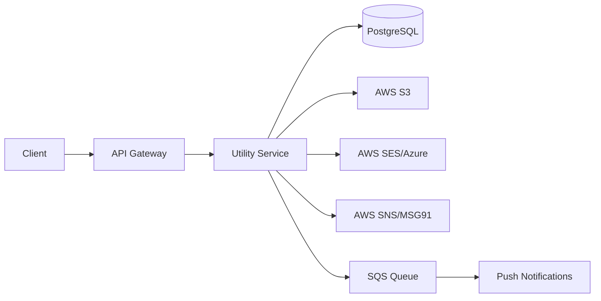

---

## Database Schema

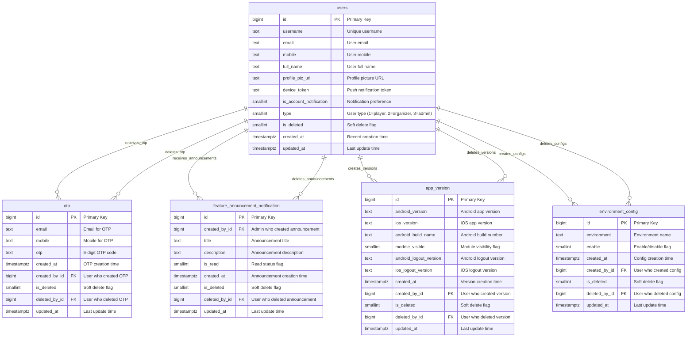

### Relationship Details

| Relationship | Type | Description | Foreign Key |
|--------------|------|-------------|-------------|
| users → otp | One-to-Many | User can have multiple OTP records | `otp.created_by_id` |
| users → feature_anouncement_notification | One-to-Many | User can receive multiple announcements | `feature_anouncement_notification.created_by_id` |
| users → app_version | One-to-Many | User can create multiple app versions | `app_version.created_by_id` |
| users → environment_config | One-to-Many | User can create multiple environment configs | `environment_config.created_by_id` |
| users → otp (delete) | One-to-Many | User can delete multiple OTP records | `otp.deleted_by_id` |
| users → feature_anouncement_notification (delete) | One-to-Many | User can delete multiple announcements | `feature_anouncement_notification.deleted_by_id` |
| users → app_version (delete) | One-to-Many | User can delete multiple app versions | `app_version.deleted_by_id` |
| users → environment_config (delete) | One-to-Many | User can delete multiple environment configs | `environment_config.deleted_by_id` |

### Index Information

| Table | Index Type | Indexed Fields | Purpose |
|-------|------------|----------------|---------|
| otp | btree | `otp`, `email`, `mobile` | Fast OTP lookup and validation |
| feature_anouncement_notification | btree | `is_read`, `title` | Notification filtering and search |
| app_version | - | `android_version`, `ios_version` | Version comparison |
| environment_config | - | `environment`, `enable` | Config filtering |

---

## API Reference

### Authentication
Most endpoints require JWT token:
```
Authorization: Bearer <jwt-token>
```

## Base URLs

| Environment   | URL                                 |
|---------------|-------------------------------------|
| Production    | `https://thryl-prod.com   ||    https://thryl-production.zapto.org`      |
| Staging       | `https://thryl-staging.zapto.org` |
| Development   | `http://localhost:3000  || http://localhost:3001`      |

---

### Complete API List

| # | Endpoint | Method | Purpose | Auth Required | Role Required |
|---|----------|--------|---------|---------------|---------------|
| 1 | `/otp/send-otp-email` | POST | Send OTP to email | No | None |
| 2 | `/otp/send-otp-mobile` | POST | Send OTP to mobile | No | None |
| 3 | `/otp/send-otp-username` | POST | Send OTP by username | No | None |
| 4 | `/upload/upload-file` | POST | Upload file to S3 | Yes | admin/player/organizer |
| 5 | `/version-check/insert-app-new-version` | POST | Insert app version | No | None |
| 6 | `/version-check/read-app-latest-version` | GET | Get latest app version | No | None |
| 7 | `/enviorment-config/create` | POST | Insert environment config | No | None |
| 8 | `/enviorment-config/read` | GET | Get environment config | No | None |
| 9 | `/announce-new-feature/new-fature` | POST | Announce new feature | Yes | admin |

---

## API 1: Send OTP to Email

**Endpoint**: `POST /otp/send-otp-email`

**Purpose**: Generate and send OTP to user's email address

**Request**:
```json
{
  "email": "user@example.com",
  "provider": "azure"
}
```

**Success Response** (201):
```json
{
  "status": 1,
  "message": "OTP sent to email.",
  "email": "user@example.com",
  "timestamp": "2024-01-15T10:30:00.000Z"
}
```

**Failure Responses**:

#### 400 - Invalid email format
```json
{
  "status": 0,
  "message": "Email must be a valid email address",
  "error_code": "VALIDATION_ERROR"
}
```

#### 400 - Invalid provider
```json
{
  "status": 0,
  "message": "Email provider must be either 'aws' or 'azure'",
  "error_code": "VALIDATION_ERROR"
}
```

#### 500 - Email service error
```json
{
  "status": 0,
  "message": "Error during OTP generation.",
  "error_code": "INTERNAL_ERROR"
}
```

**DFD**:
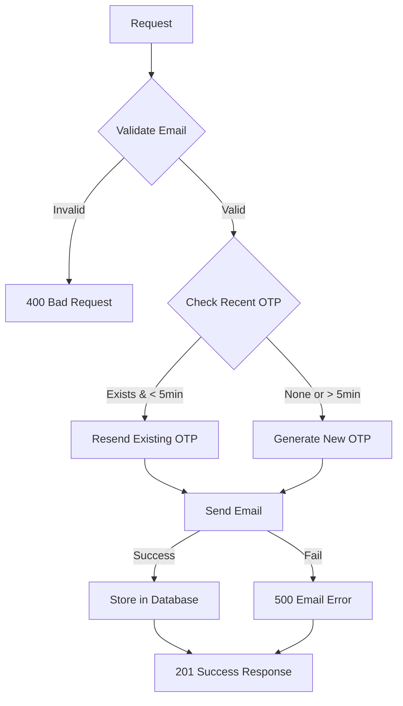

**Instructions & Business Logic**:
- Email must be valid format
- Provider must be 'aws' or 'azure' (default: 'azure')
- If OTP sent within last 5 minutes, resend same OTP
- In development, OTP is always '123456'
- OTP is stored in database with timestamp
- Email is sent asynchronously in production

**Database Operations**:
- `SELECT` from `otp` to check recent OTP
- `INSERT` into `otp` table with email and OTP

---

## API 2: Send OTP to Mobile

**Endpoint**: `POST /otp/send-otp-mobile`

**Purpose**: Generate and send OTP to user's mobile number

**Request**:
```json
{
  "mobile": "+919876543210",
  "provider": "aws"
}
```

**Success Response** (201):
```json
{
  "status": 1,
  "message": "OTP sent to mobile.",
  "mobile": "+919876543210"
}
```

**Failure Responses**:

#### 400 - Invalid mobile format
```json
{
  "status": 0,
  "message": "Mobile number must be a valid format with country code (e.g., +917881125100).",
  "error_code": "VALIDATION_ERROR"
}
```

#### 400 - Invalid provider
```json
{
  "status": 0,
  "message": "Mobile provider must be either 'aws' or 'azure'",
  "error_code": "VALIDATION_ERROR"
}
```

#### 500 - SMS service error
```json
{
  "status": 0,
  "message": "Error during OTP generation.",
  "error_code": "INTERNAL_ERROR"
}
```

**DFD**:
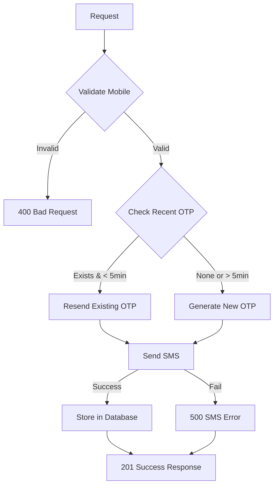

**Instructions & Business Logic**:
- Mobile must be in format: +91XXXXXXXXXX
- Provider must be 'aws' or 'azure' (default: 'azure')
- Special number +919033385088 always gets OTP '123456'
- If OTP sent within last 5 minutes, resend same OTP
- SMS is sent asynchronously in production

**Database Operations**:
- `SELECT` from `otp` to check recent OTP
- `INSERT` into `otp` table with mobile and OTP

---

## API 3: Send OTP by Username

**Endpoint**: `POST /otp/send-otp-username`

**Purpose**: Generate and send OTP to user's email or mobile based on username

**Request**:
```json
{
  "username": "alice",
  "type": 1,
  "provider": "azure"
}
```

**Success Response** (201):
```json
{
  "status": 1,
  "username": "alice",
  "data": {
    "email": "alice@example.com"
  },
  "message": "OTP sent successfully to email"
}
```

**Failure Responses**:

#### 400 - Missing username
```json
{
  "status": 0,
  "message": "Username is required.",
  "error_code": "VALIDATION_ERROR"
}
```

#### 404 - User not found
```json
{
  "status": 0,
  "message": "User not found or no contact details available.",
  "error_code": "NOT_FOUND"
}
```

#### 500 - Service error
```json
{
  "status": 0,
  "message": "Error during OTP generation.",
  "error_code": "INTERNAL_ERROR"
}
```

**DFD**:
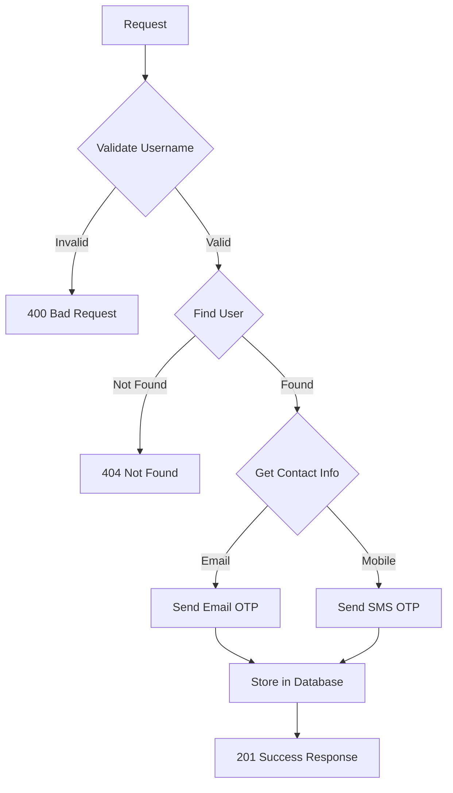

**Instructions & Business Logic**:
- Username is case-insensitive
- Type determines user lookup (1 = email, 2 = mobile)
- Finds user by username and type
- Sends OTP to available contact method
- Returns contact method used in response

**Database Operations**:
- `SELECT` from `users` to find user by username
- `SELECT` from `otp` to check recent OTP
- `INSERT` into `otp` table

---

---

## API 3: Send OTP by Username

**Endpoint**: `POST /otp/send-otp-username`

**Purpose**: Generate and send OTP to user's email or mobile based on username

**Request**:
```json
{
  "username": "alice",
  "type": 1,
  "provider": "azure"
}
```

**Success Response** (201):
```json
{
  "status": 1,
  "username": "alice",
  "data": {
    "email": "alice@example.com"
  },
  "message": "OTP sent successfully to email"
}
```

**Failure Responses**:

#### 400 - Missing username
```json
{
  "status": 0,
  "message": "Username is required.",
  "error_code": "VALIDATION_ERROR"
}
```

#### 404 - User not found
```json
{
  "status": 0,
  "message": "User not found or no contact details available.",
  "error_code": "NOT_FOUND"
}
```

#### 500 - Service error
```json
{
  "status": 0,
  "message": "Error during OTP generation.",
  "error_code": "INTERNAL_ERROR"
}
```

**DFD**:


**Instructions & Business Logic**:
- Username is case-insensitive
- Type determines user lookup (1 = email, 2 = mobile)
- Finds user by username and type
- Sends OTP to available contact method
- Returns contact method used in response

**Database Operations**:
- `SELECT` from `users` to find user by username
- `SELECT` from `otp` to check recent OTP
- `INSERT` into `otp` table

---

## API 4: Upload File

**Endpoint**: `POST /upload/upload-file`

**Purpose**: Upload file to AWS S3 based on type

**Headers**:
```
Authorization: Bearer <jwt-token>
Content-Type: multipart/form-data
```

**Form Data**:
- `file`: File to upload
- `type`: File type (user, game, community)

**Success Response** (201):
```json
{
  "status": 1,
  "message": "User file uploaded successfully",
  "data": {
    "file_url": "https://s3.amazonaws.com/thryl-bucket/user/uuid-filename.jpg"
  }
}
```

**Failure Responses**:

#### 401 - Unauthorized
```json
{
  "status": 0,
  "message": "User not authenticated",
  "error_code": "UNAUTHORIZED"
}
```

#### 403 - Insufficient permissions
```json
{
  "status": 0,
  "message": "Access denied",
  "error_code": "FORBIDDEN"
}
```

#### 400 - Invalid file
```json
{
  "status": 0,
  "message": "Invalid file format",
  "error_code": "VALIDATION_ERROR"
}
```

#### 500 - Upload error
```json
{
  "status": 0,
  "message": "File upload failed",
  "error_code": "INTERNAL_ERROR"
}
```

**DFD**:
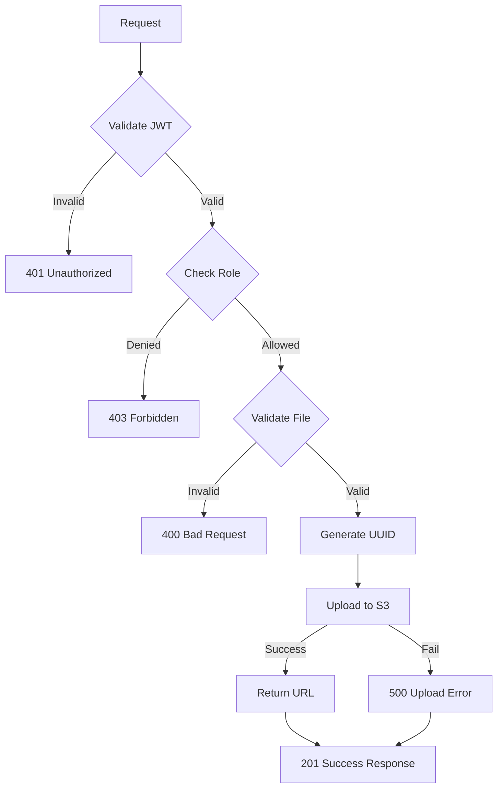

**Instructions & Business Logic**:
- JWT token required
- Roles: admin, player, organizer
- File type determines S3 folder structure
- Generates unique UUID for filename
- Uploads to AWS S3 with public read access
- Returns public URL of uploaded file

**Database Operations**:
- No database operations (file stored in S3)

---

## API 5: Insert Latest App Version

**Endpoint**: `POST /version-check/insert-app-new-version`

**Purpose**: Insert new app version information (Admin only)

**Request**:
```json
{
  "android_version": "2.0.0",
  "ios_version": "2.0.0",
  "android_build_name": "200",
  "modele_visible": 1,
  "android_logout_version": "1.9.0",
  "ios_logout_version": "1.9.0"
}
```

**Success Response** (200):
```json
{
  "status": 1,
  "data": {
    "android_version": "2.0.0",
    "ios_version": "2.0.0",
    "android_build_name": "200",
    "modele_visible": 1,
    "android_logout_version": "1.9.0",
    "ios_logout_version": "1.9.0"
  },
  "message": "Version checked successfully"
}
```

**Failure Responses**:

#### 400 - Invalid version format
```json
{
  "status": 0,
  "message": "Invalid version format",
  "error_code": "VALIDATION_ERROR"
}
```

#### 500 - Database error
```json
{
  "status": 0,
  "message": "Internal server error",
  "error_code": "INTERNAL_ERROR"
}
```

**DFD**:
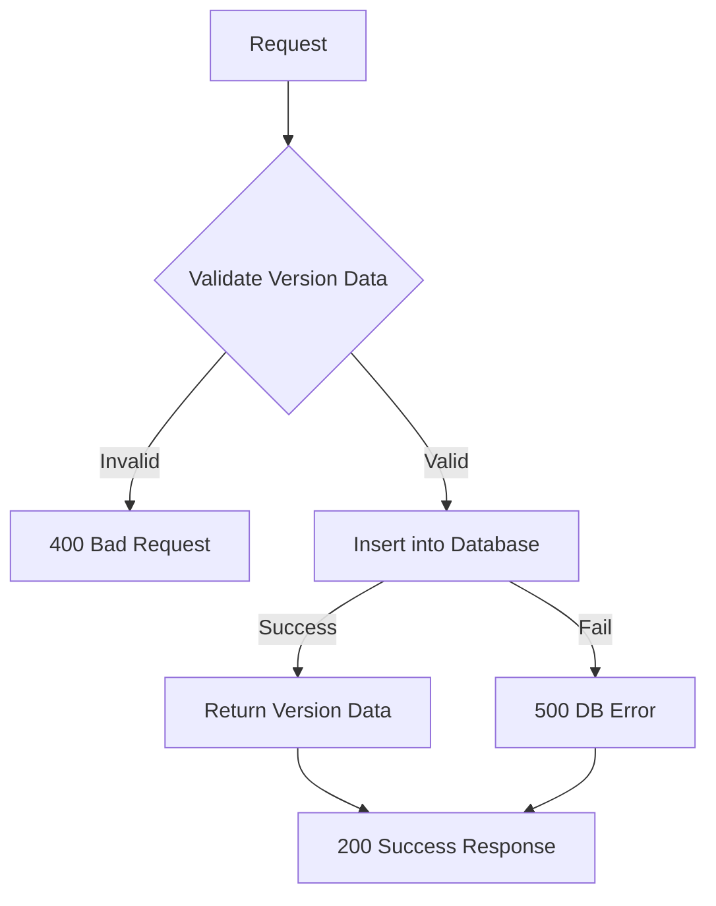

**Instructions & Business Logic**:
- All fields are optional
- `modele_visible` must be 0 or 1
- Creates new version record in database
- Used for app version management

**Database Operations**:
- `INSERT` into `app_version` table

---

## API 6: Get Latest App Version

**Endpoint**: `GET /version-check/read-app-latest-version`

**Purpose**: Retrieve the latest app version information

**Success Response** (200):
```json
{
  "status": 1,
  "message": "Latest version fetched successfully",
  "data": {
    "android_version": "2.0.0",
    "ios_version": "2.0.0",
    "android_build_name": "200",
    "modele_visible": 1,
    "android_logout_version": "1.9.0",
    "ios_logout_version": "1.9.0"
  }
}
```

**Failure Responses**:

#### 404 - No version found
```json
{
  "status": 0,
  "message": "No version information found",
  "error_code": "NOT_FOUND"
}
```

#### 500 - Database error
```json
{
  "status": 0,
  "message": "Internal server error",
  "error_code": "INTERNAL_ERROR"
}
```

**DFD**:
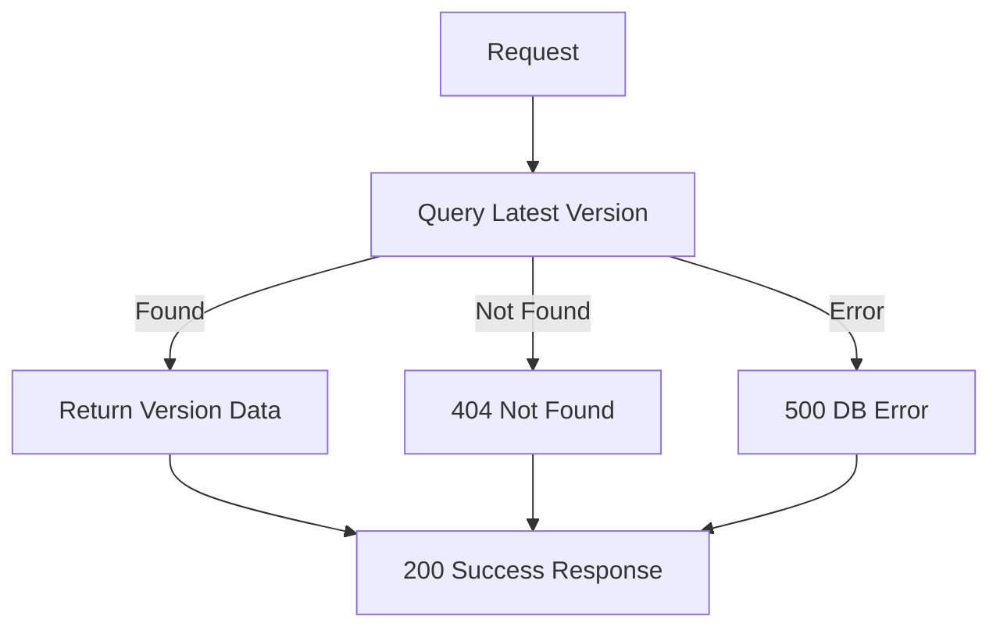

**Instructions & Business Logic**:
- No authentication required
- Returns most recent version record
- Used by mobile apps for version checking

**Database Operations**:
- `SELECT` from `app_version` ORDER BY id DESC LIMIT 1

---

## API 7: Insert Environment Config

**Endpoint**: `POST /enviorment-config/create`

**Purpose**: Insert environment configuration (Admin only)

**Request**:
```json
{
  "environment": "production",
  "enable": 1
}
```

**Success Response** (200):
```json
{
  "status": 1,
  "data": {
    "environment": "production",
    "enable": 1
  },
  "message": "environment config inserted successfully"
}
```

**Failure Responses**:

#### 400 - Invalid config data
```json
{
  "status": 0,
  "message": "Invalid environment configuration",
  "error_code": "VALIDATION_ERROR"
}
```

#### 500 - Database error
```json
{
  "status": 0,
  "message": "Internal server error",
  "error_code": "INTERNAL_ERROR"
}
```

**DFD**:
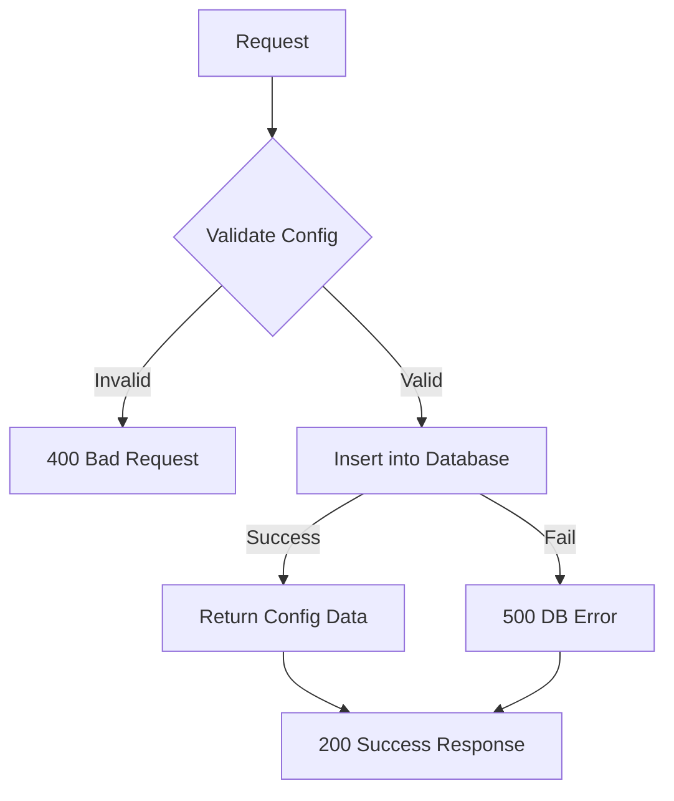

**Instructions & Business Logic**:
- Admin access required
- `enable` must be 0 or 1
- Creates new environment config record
- Used for feature flags and environment management

**Database Operations**:
- `INSERT` into `environment_config` table

---

## API 8: Get Environment Config

**Endpoint**: `GET /enviorment-config/read`

**Purpose**: Retrieve environment configuration (Admin only)

**Success Response** (200):
```json
{
  "status": 1,
  "message": "environment config fetched successfully",
  "data": {
    "environment": "production",
    "enable": 1
  }
}
```

**Failure Responses**:

#### 404 - No config found
```json
{
  "status": 0,
  "message": "No environment configuration found",
  "error_code": "NOT_FOUND"
}
```

#### 500 - Database error
```json
{
  "status": 0,
  "message": "Internal server error",
  "error_code": "INTERNAL_ERROR"
}
```

**DFD**:
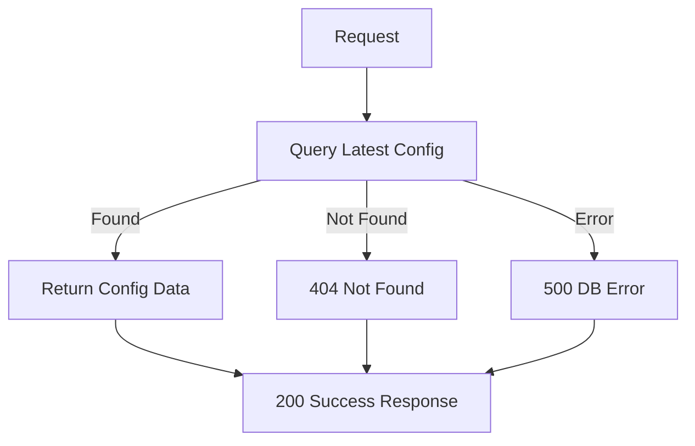

**Instructions & Business Logic**:
- Admin access required
- Returns most recent environment config
- Used for feature flag management

**Database Operations**:
- `SELECT` from `environment_config` ORDER BY id DESC LIMIT 1

---

## API 9: Announce New Feature

**Endpoint**: `POST /announce-new-feature/new-fature`

**Purpose**: Send feature announcement to all users (Admin only)

**Headers**:
```
Authorization: Bearer <admin-token>
```

**Request**:
```json
{
  "subject": "New Tournament Feature!",
  "message": "We have launched a new tournament format. Check it out!"
}
```

**Success Response** (201):
```json
{
  "status": 1,
  "message": "Notification sent successfully."
}
```

**Failure Responses**:

#### 401 - Not authenticated
```json
{
  "status": 0,
  "message": "User not authenticated",
  "error_code": "UNAUTHORIZED"
}
```

#### 403 - Not admin
```json
{
  "status": 0,
  "message": "Access denied",
  "error_code": "FORBIDDEN"
}
```

#### 404 - No users found
```json
{
  "status": 0,
  "message": "No users found",
  "error_code": "NOT_FOUND"
}
```

#### 500 - Service error
```json
{
  "status": 0,
  "message": "Internal server error",
  "error_code": "INTERNAL_ERROR"
}
```

**DFD**:
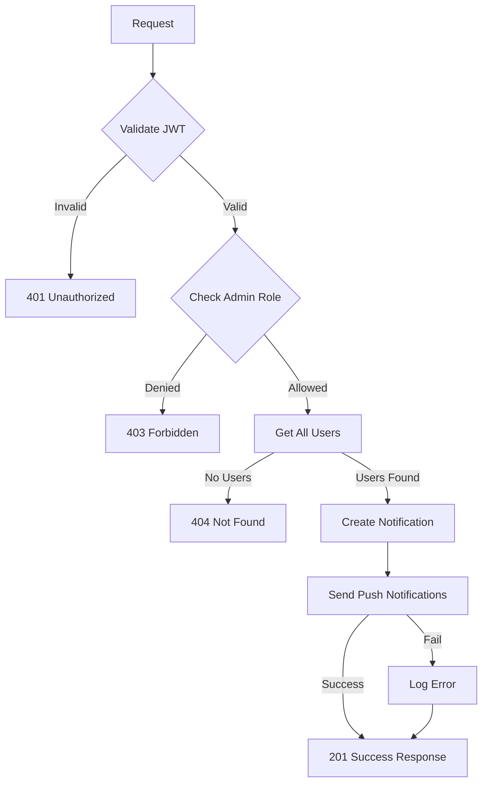

**Instructions & Business Logic**:
- Admin JWT token required
- Fetches all users with email addresses
- Creates notification record in database
- Sends push notifications to users with device tokens
- Only sends to users with `is_account_notification = 1`
- Uses SQS queue for async notification processing

**Database Operations**:
- `SELECT` from `users` WHERE email IS NOT NULL
- `INSERT` into `feature_anouncement_notification` table

---

## Error Handling

### Common Error Codes

| Code | Description |
|------|-------------|
| 400 | Bad Request - Invalid input data |
| 401 | Unauthorized - Missing or invalid JWT |
| 403 | Forbidden - Insufficient permissions |
| 404 | Not Found - Resource not found |
| 500 | Internal Server Error - Server error |

### Error Response Format
```json
{
  "status": 0,
  "message": "Error description",
  "error_code": "ERROR_TYPE"
}
```

---

## Rate Limiting

- **OTP APIs**: 5 requests per minute per IP
- **File Upload**: 10 requests per minute per user
- **Version APIs**: 100 requests per minute per IP
- **Feature Announcement**: 1 request per minute per admin

---

## Security Considerations

1. **JWT Authentication**: Required for most endpoints
2. **Role-based Access**: Admin-only endpoints properly protected
3. **Input Validation**: All inputs validated using Joi schemas
4. **File Upload Security**: File type validation and size limits
5. **OTP Security**: Rate limiting and expiration (5 minutes)
6. **Environment Variables**: Sensitive data stored in environment variables

---

## Monitoring & Logging

- All API calls logged with request/response data
- Error tracking with stack traces
- Performance metrics for file uploads
- OTP delivery success/failure tracking
- Database query performance monitoring

---

## Integration Examples

### Mobile App Integration
```javascript
// Check app version
const response = await fetch('/version-check/read-app-latest-version');
const versionData = await response.json();

if (versionData.data.android_version > currentVersion) {
  // Prompt user to update
}
```

### Web App Integration
```javascript
// Send OTP for email verification
const response = await fetch('/otp/send-otp-email', {
  method: 'POST',
  headers: { 'Content-Type': 'application/json' },
  body: JSON.stringify({ email: 'user@example.com' })
});
```

### Admin Panel Integration
```javascript
// Announce new feature
const response = await fetch('/announce-new-feature/new-fature', {
  method: 'POST',
  headers: { 
    'Authorization': 'Bearer ' + adminToken,
    'Content-Type': 'application/json' 
  },
  body: JSON.stringify({
    subject: 'New Feature',
    message: 'Check out our latest update!'
  })
});
``` 