## Table of Contents

1. [Executive Summary](#executive-summary)
2. [Technology Stack](#technology-stack)
3. [System Architecture](#system-architecture)
4. [Service Architecture](#service-architecture)
5. [Database Architecture](#database-architecture)
6. [Entity-Relationship Diagram](#entity-relationship-diagram-erd)
7. [Data Flow Diagrams](#data-flow-diagrams-dfd)
8. [Security Implementation](#security-implementation)
9. [Monitoring & Observability](#monitoring--observability)
10. [External Service Integrations](#external-service-integrations)
11. [Business Logic Implementation](#business-logic-implementation)
12. [Performance Optimizations](#performance-optimizations)
13. [Deployment & Infrastructure](#deployment--infrastructure)
14. [Error Handling & Resilience](#error-handling--resilience)
15. [Code Quality & Standards](#code-quality--standards)
16. [API Documentation](#api-documentation)
17. [Getting Started Guide](#getting-started-guide)
18. [API Endpoints Summary](#api-endpoints-summary)
19. [Database Schema Overview](#database-schema-overview)
20. [Configuration Management](#configuration-management)
21. [Development Workflow](#development-workflow)
22. [Troubleshooting Guide](#troubleshooting-guide)
23. [Performance Benchmarks](#performance-benchmarks)
24. [Third-Party Integrations](#third-party-integrations)
25. [Backup & Recovery](#backup--recovery)
26. [Scalability & Performance](#scalability--performance)
27. [Security & Compliance](#security--compliance)
28. [Business Intelligence & Analytics](#business-intelligence--analytics)
29. [Webhook System](#webhook-system)
30. [Database Migration Strategy](#database-migration-strategy)
31. [Load Testing Scenarios](#load-testing-scenarios)
32. [Future Roadmap & Enhancements](#future-roadmap--enhancements)
33. [Conclusion](#conclusion)

---

## Executive Summary

Thryl is an enterprise-grade gaming platform backend built with Node.js/Express, providing comprehensive APIs for team management, tournaments, user authentication, virtual currency systems, and various gaming features. The platform follows a modular microservices architecture with robust security, monitoring, and scalability features.

---

## Technology Stack

### Core Technologies
- **Runtime Environment**: Node.js 20.14.0
- **Web Framework**: Express.js 4.20.0
- **Database**: PostgreSQL 8.12.0 with connection pooling
- **Caching**: Redis 5.6.1 (ioredis)
- **Authentication**: JWT 9.0.2 with crypto-js encryption
- **Containerization**: Docker & Docker Compose

### Cloud Services & Integrations
- **AWS Services**: S3 (file storage), SES (email), SNS (SMS), SQS (queuing)
- **Azure Services**: Communication services (email, SMS)
- **Firebase**: Push notifications (FCM)
- **MSG91**: SMS/OTP delivery service
- **Monitoring**: Prometheus, Grafana, Loki

### Development & DevOps
- **Package Manager**: npm
- **Process Manager**: PM2 5.3.1
- **Development**: Nodemon 3.1.7
- **Validation**: Joi 17.13.3
- **Logging**: Winston 3.17.0 with Loki transport
- **Queue Management**: Bull 4.16.5, BullMQ 5.56.1

---

## Base URLs

| Environment   | URL                                 |
|---------------|-------------------------------------|
| Production    | `https://thryl-prod.com   ||    https://thryl-production.zapto.org`      |
| Staging       | `https://thryl-staging.zapto.org` |
| Development   | `http://localhost:3000  || http://localhost:3001`      |

---

## System Architecture

### High-Level System Architecture

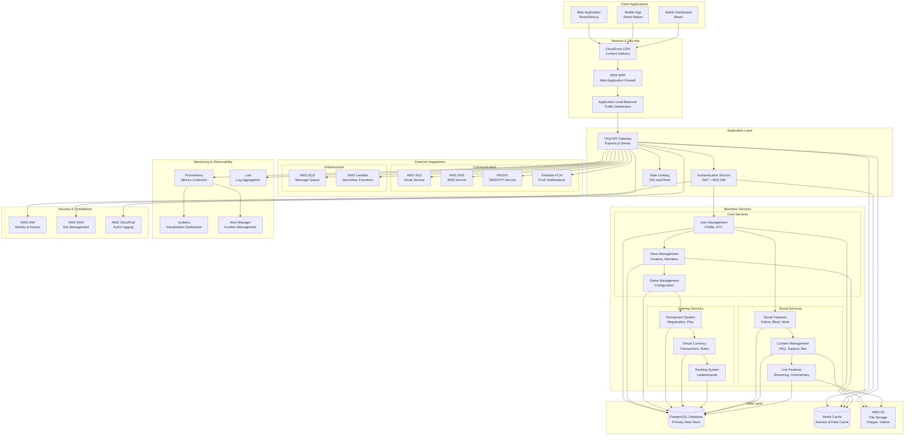

### Application Architecture

```mermaid
graph TB
    %% Entry Point
    subgraph "Application Entry"
        Entry[index.js<br/>Server Initialization]
        Config[thryl-config.js<br/>Configuration Management]
        Env[Environment Variables<br/>Development/Staging/Production]
    end
    
    %% Express Framework Layer
    subgraph "Express Framework Layer"
        Express[expressSetup.js<br/>Express Configuration]
        CORS[CORS Configuration<br/>Cross-Origin Resource Sharing]
        BodyParser[Body Parser<br/>Request Body Processing]
        Compression[Compression<br/>Response Compression]
    end
    
    %% Route Management
    subgraph "Route Management"
        Routes[routes.js<br/>Main Route Registration]
        subgraph "Service Routes"
            AuthRoutes[Authentication Routes<br/>Login, OTP, Social]
            UserRoutes[User Routes<br/>Profile, KYC, Settings]
            TeamRoutes[Team Routes<br/>CRUD, Members, Search]
            GameRoutes[Game Routes<br/>Configuration, Joining]
            TournamentRoutes[Tournament Routes<br/>Registration, Play]
            GemRoutes[Gem Routes<br/>Transactions, Rules]
            SocialRoutes[Social Routes<br/>Follow, Block, Mute]
            ContentRoutes[Content Routes<br/>FAQ, Support, Box]
            LiveRoutes[Live Routes<br/>Streaming, Commentary]
            AdminRoutes[Admin Routes<br/>Management, Reports]
        end
    end
    
    %% Middleware Layer
    subgraph "Middleware Layer"
        subgraph "Security Middleware"
            AuthMiddleware[Authentication<br/>JWT Token Validation]
            RateLimit[Rate Limiting<br/>10K req/15min per IP]
            InputValidation[Input Validation<br/>Joi Schema Validation]
            AccessControl[Access Control<br/>Role-Based Permissions]
        end
        
        subgraph "Operational Middleware"
            Logger[API Logger<br/>Request/Response Logging]
            ErrorHandler[Error Handler<br/>Global Error Management]
            Metrics[Prometheus Metrics<br/>Performance Monitoring]
            RedisMiddleware[Redis Middleware<br/>Session Management]
        end
    end
    
    %% Service Layer
    subgraph "Service Layer"
        subgraph "Core Services"
            AuthService[Authentication Service<br/>JWT, OTP, Social Login]
            ProfileService[Profile Service<br/>User Management]
            TeamService[Team Service<br/>Team Operations]
            GameService[Game Service<br/>Game Configuration]
        end
        
        subgraph "Business Services"
            TournamentService[Tournament Service<br/>Tournament Management]
            GemService[Gem Service<br/>Virtual Currency]
            SocialService[Social Service<br/>Social Features]
            ContentService[Content Service<br/>Content Management]
            LiveService[Live Service<br/>Live Streaming]
        end
        
        subgraph "Support Services"
            NotificationService[Notification Service<br/>Push Notifications]
            AdminService[Admin Service<br/>Administrative Functions]
            UtilityService[Utility Service<br/>OTP, File Upload]
            OrganizerService[Organizer Service<br/>Organizer Management]
        end
    end
    
    %% Data Access Layer
    subgraph "Data Access Layer"
        subgraph "Database Operations"
            PostgresHelper[PostgreSQL Helper<br/>Connection Pooling]
            SchemaValidation[Schema Validation<br/>Data Integrity]
            QueryBuilder[Query Builder<br/>Dynamic SQL Generation]
        end
        
        subgraph "Caching Layer"
            RedisClient[Redis Client<br/>Session & Data Cache]
            CacheManager[Cache Manager<br/>Cache Invalidation]
        end
    end
    
    %% External Integrations
    subgraph "External Service Integrations"
        subgraph "AWS Services"
            S3Client[AWS S3 Client<br/>File Storage]
            SESClient[AWS SES Client<br/>Email Service]
            SNSClient[AWS SNS Client<br/>SMS Service]
            SQSClient[AWS SQS Client<br/>Message Queue]
        end
        
        subgraph "Third-Party Services"
            FirebaseClient[Firebase FCM<br/>Push Notifications]
            MSG91Client[MSG91 Client<br/>SMS/OTP Service]
            AzureClient[Azure Client<br/>Communication Services]
        end
    end
    
    %% Utility Functions
    subgraph "Utility Functions"
        subgraph "Core Utilities"
            EncryptUtil[Encryption Utility<br/>AES-256, JWT]
            TokenUtil[Token Utility<br/>JWT Creation/Validation]
            LoggerUtil[Logger Utility<br/>Winston Configuration]
            SchedulerUtil[Scheduler Utility<br/>Background Jobs]
        end
        
        subgraph "Business Utilities"
            EmailUtil[Email Utility<br/>Template Management]
            NotificationUtil[Notification Utility<br/>Push Notifications]
            TournamentUtil[Tournament Utility<br/>Tournament Operations]
        end
    end
    
    %% Connections
    Entry --> Config
    Config --> Env
    Entry --> Express
    Express --> CORS
    Express --> BodyParser
    Express --> Compression
    
    Express --> Routes
    Routes --> AuthRoutes
    Routes --> UserRoutes
    Routes --> TeamRoutes
    Routes --> GameRoutes
    Routes --> TournamentRoutes
    Routes --> GemRoutes
    Routes --> SocialRoutes
    Routes --> ContentRoutes
    Routes --> LiveRoutes
    Routes --> AdminRoutes
    
    AuthRoutes --> AuthMiddleware
    UserRoutes --> AuthMiddleware
    TeamRoutes --> AuthMiddleware
    GameRoutes --> AuthMiddleware
    TournamentRoutes --> AuthMiddleware
    GemRoutes --> AuthMiddleware
    SocialRoutes --> AuthMiddleware
    ContentRoutes --> AuthMiddleware
    LiveRoutes --> AuthMiddleware
    AdminRoutes --> AuthMiddleware
    
    AuthMiddleware --> RateLimit
    RateLimit --> InputValidation
    InputValidation --> AccessControl
    AccessControl --> Logger
    Logger --> ErrorHandler
    ErrorHandler --> Metrics
    Metrics --> RedisMiddleware
    
    RedisMiddleware --> AuthService
    RedisMiddleware --> ProfileService
    RedisMiddleware --> TeamService
    RedisMiddleware --> GameService
    RedisMiddleware --> TournamentService
    RedisMiddleware --> GemService
    RedisMiddleware --> SocialService
    RedisMiddleware --> ContentService
    RedisMiddleware --> LiveService
    RedisMiddleware --> NotificationService
    RedisMiddleware --> AdminService
    RedisMiddleware --> UtilityService
    RedisMiddleware --> OrganizerService
    
    AuthService --> PostgresHelper
    ProfileService --> PostgresHelper
    TeamService --> PostgresHelper
    GameService --> PostgresHelper
    TournamentService --> PostgresHelper
    GemService --> PostgresHelper
    SocialService --> PostgresHelper
    ContentService --> PostgresHelper
    LiveService --> PostgresHelper
    NotificationService --> PostgresHelper
    AdminService --> PostgresHelper
    UtilityService --> PostgresHelper
    OrganizerService --> PostgresHelper
    
    PostgresHelper --> SchemaValidation
    SchemaValidation --> QueryBuilder
    
    AuthService --> RedisClient
    ProfileService --> RedisClient
    TeamService --> RedisClient
    GameService --> RedisClient
    TournamentService --> RedisClient
    GemService --> RedisClient
    SocialService --> RedisClient
    ContentService --> RedisClient
    LiveService --> RedisClient
    NotificationService --> RedisClient
    AdminService --> RedisClient
    UtilityService --> RedisClient
    OrganizerService --> RedisClient
    
    RedisClient --> CacheManager
    
    ContentService --> S3Client
    LiveService --> S3Client
    UtilityService --> S3Client
    
    AuthService --> SESClient
    NotificationService --> SESClient
    UtilityService --> SESClient
    
    AuthService --> SNSClient
    NotificationService --> SNSClient
    UtilityService --> SNSClient
    
    NotificationService --> SQSClient
    TournamentService --> SQSClient
    
    NotificationService --> FirebaseClient
    AuthService --> MSG91Client
    UtilityService --> MSG91Client
    
    AuthService --> AzureClient
    NotificationService --> AzureClient
    
    AuthService --> EncryptUtil
    AuthService --> TokenUtil
    AuthService --> LoggerUtil
    AuthService --> SchedulerUtil
    
    NotificationService --> EmailUtil
    NotificationService --> NotificationUtil
    TournamentService --> TournamentUtil
```

---


### Authentication Service Flow Details

#### **OTP-Based Login Flow:**
1. **OTP Generation**: User requests OTP via email/mobile
2. **OTP Storage**: 6-digit OTP stored in database with 5-minute expiration
3. **OTP Delivery**: OTP sent via AWS SES (email) or AWS SNS/MSG91 (SMS)
4. **OTP Validation**: User submits OTP, system validates expiration and correctness
5. **User Creation/Retrieval**: New user created or existing user retrieved
6. **Account Reactivation**: Deleted accounts reactivated if needed
7. **Token Generation**: JWT token generated and encrypted with AES-256
8. **Device Update**: Device token updated for push notifications
9. **Welcome Notifications**: Welcome email and push notification sent
10. **Session Caching**: User session cached in Redis

#### **Credential-Based Login Flow:**
1. **Credential Validation**: Username/email and password verified
2. **Password Hashing**: bcrypt comparison for password validation
3. **Token Generation**: JWT token with user data and expiration
4. **Session Management**: User session established and cached

#### **Social Login Flow:**
1. **Social Verification**: Google/Apple ID verification
2. **User Lookup**: Check if user exists with social ID
3. **Profile Creation**: Create new profile if user doesn't exist
4. **Token Generation**: Encrypted JWT token with user data

### Profile Service Flow Details

#### **Profile Management Flow:**
1. **Profile Retrieval**: Get user profile with token validation
2. **Data Validation**: Joi schema validation for all inputs
3. **Data Encryption**: Sensitive data encrypted before storage
4. **Profile Update**: User data updated with audit trail
5. **Cache Invalidation**: Redis cache cleared for updated data

#### **Security Operations Flow:**
1. **Password Change**: Old password verified, new password hashed
2. **Token Refresh**: JWT token decrypted, validated, and renewed
3. **Account Logout**: Session cleared, device token reset
4. **Account Deletion**: Soft delete with reason tracking

#### **User Search Flow:**
1. **Search Validation**: Input sanitization and validation
2. **Database Query**: Paginated search with multiple criteria
3. **Result Filtering**: Privacy-aware result filtering
4. **Response Formatting**: Structured response with pagination

---

## Complete Service DFDs (All 25 Services)

## Data Flow Diagrams (DFD)

### 1. Team Service DFD

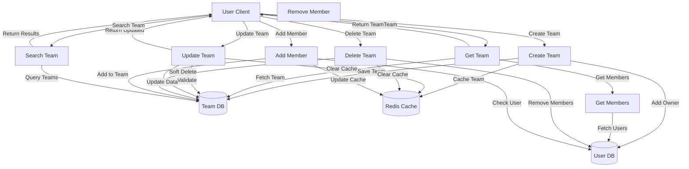

### 2. Game Service DFD

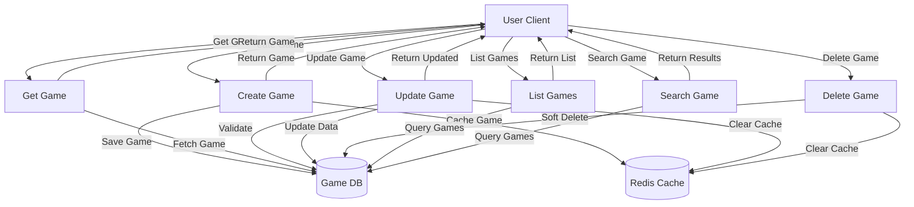

### 3. GameJoin Service DFD

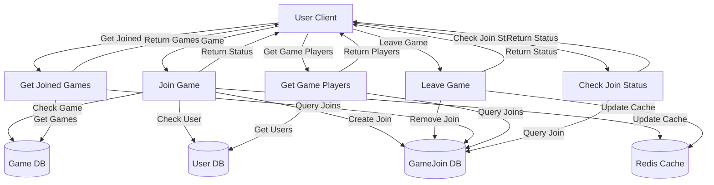

### 4. GameMap Service DFD

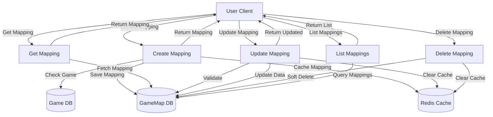

### 5. Gem Service DFD

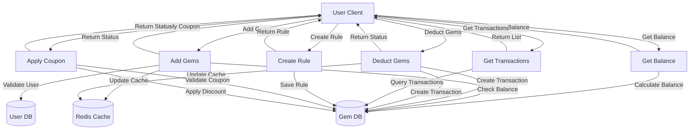

### 6. GemLog Service DFD

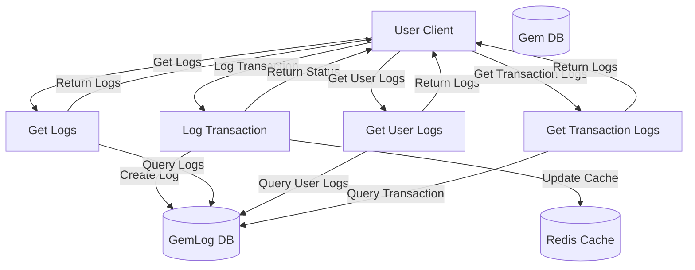

### 7. Tournament Service DFD

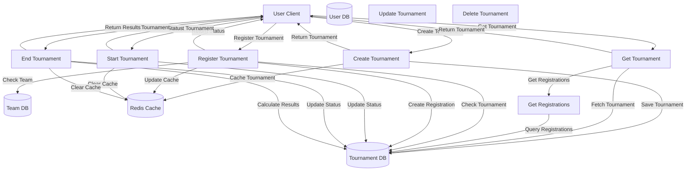

### 8. ThrylCoin Service DFD

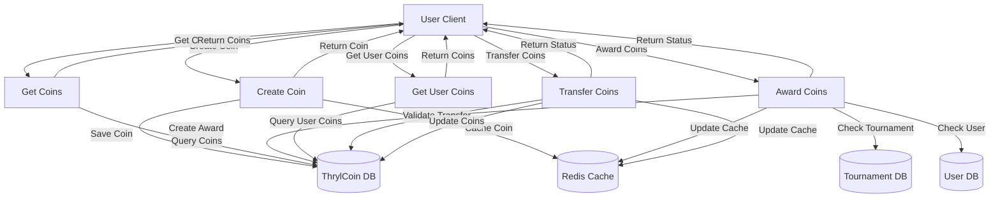

### 9. ThrylRanking Service DFD

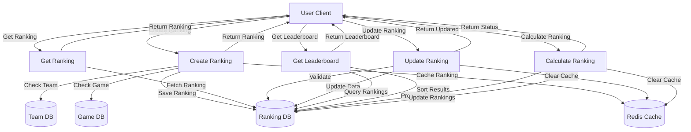

### 10. UserKyc Service DFD

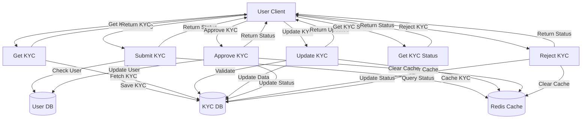

### 11. LiveCommentary Service DFD

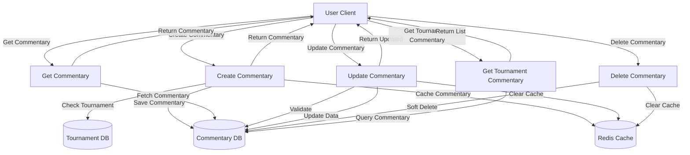

### 12. LiveStream Service DFD

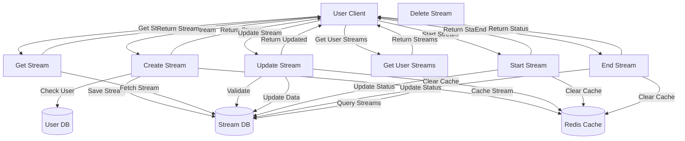

### 13. Mute Service DFD

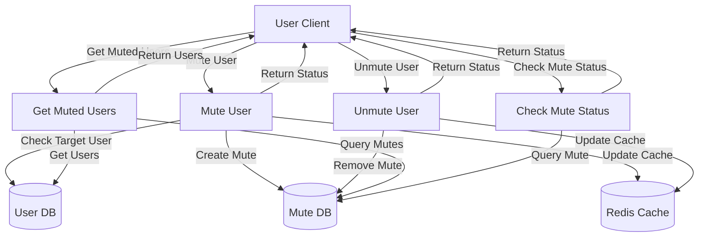

### 14. Notification Service DFD

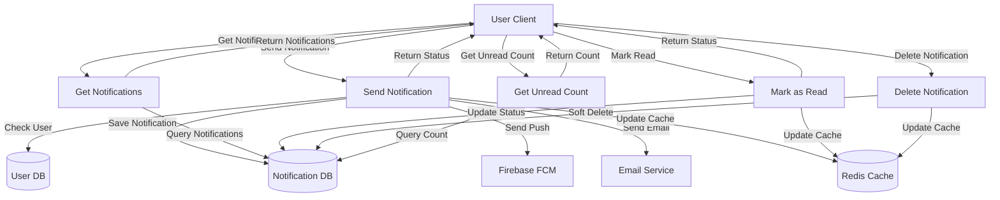

### 15. Organizer Service DFD

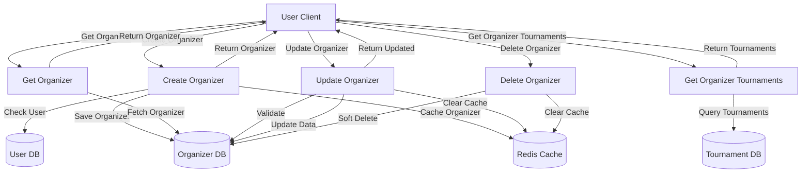

### 16. Box Service DFD

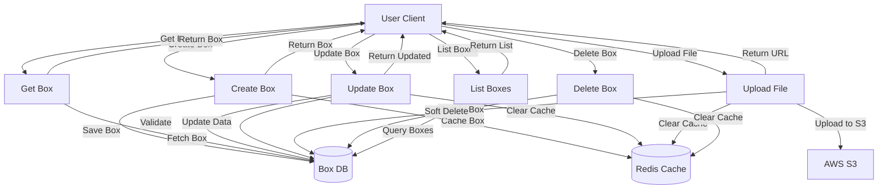

### 17. Follow Service DFD

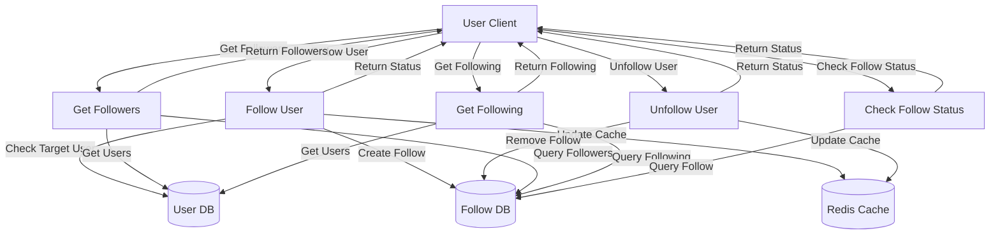

### 18. Block Service DFD

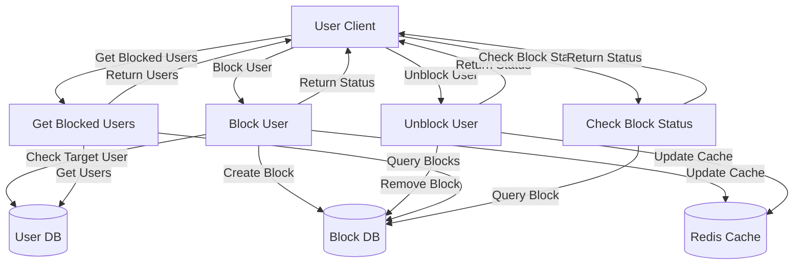

### 19. Report Service DFD

```mermaid
graph TD
    User[User Client]
    ReportDB[(Report DB)]
    UserDB[(User DB)]
    AdminDB[(Admin DB)]
    RedisCache[(Redis Cache)]
    
    CreateReport[Create Report]
    GetReport[Get Report]
    UpdateReport[Update Report]
    GetUserReports[Get User Reports]
    AdminReview[Admin Review]
    
    User -->|Create Report| CreateReport
    CreateReport -->|Check User| UserDB
    CreateReport -->|Save Report| ReportDB
    CreateReport -->|Notify Admin| AdminDB
    CreateReport -->|Update Cache| RedisCache
    CreateReport -->|Return Status| User
    
    User -->|Get Report| GetReport
    GetReport -->|Fetch Report| ReportDB
    GetReport -->|Return Report| User
    
    User -->|Update Report| UpdateReport
    UpdateReport -->|Validate| ReportDB
    UpdateReport -->|Update Data| ReportDB
    UpdateReport -->|Clear Cache| RedisCache
    UpdateReport -->|Return Updated| User
    
    User -->|Get User Reports| GetUserReports
    GetUserReports -->|Query Reports| ReportDB
    GetUserReports -->|Return Reports| User
    
    User -->|Admin Review| AdminReview
    AdminReview -->|Update Status| ReportDB
    AdminReview -->|Take Action| AdminDB
    AdminReview -->|Clear Cache| RedisCache
    AdminReview -->|Return Status| User
```

### 20. FAQ Service DFD

```mermaid
graph TD
    User[User Client]
    FAQDB[(FAQ DB)]
    RedisCache[(Redis Cache)]
    
    CreateFAQ[Create FAQ]
    GetFAQ[Get FAQ]
    UpdateFAQ[Update FAQ]
    DeleteFAQ[Delete FAQ]
    ListFAQs[List FAQs]
    SearchFAQ[Search FAQ]
    
    User -->|Create FAQ| CreateFAQ
    CreateFAQ -->|Save FAQ| FAQDB
    CreateFAQ -->|Cache FAQ| RedisCache
    CreateFAQ -->|Return FAQ| User
    
    User -->|Get FAQ| GetFAQ
    GetFAQ -->|Fetch FAQ| FAQDB
    GetFAQ -->|Return FAQ| User
    
    User -->|Update FAQ| UpdateFAQ
    UpdateFAQ -->|Validate| FAQDB
    UpdateFAQ -->|Update Data| FAQDB
    UpdateFAQ -->|Clear Cache| RedisCache
    UpdateFAQ -->|Return Updated| User
    
    User -->|Delete FAQ| DeleteFAQ
    DeleteFAQ -->|Soft Delete| FAQDB
    DeleteFAQ -->|Clear Cache| RedisCache
    
    User -->|List FAQs| ListFAQs
    ListFAQs -->|Query FAQs| FAQDB
    ListFAQs -->|Return List| User
    
    User -->|Search FAQ| SearchFAQ
    SearchFAQ -->|Query FAQs| FAQDB
    SearchFAQ -->|Return Results| User
```

### 21. Support Service DFD

```mermaid
graph TD
    User[User Client]
    SupportDB[(Support DB)]
    UserDB[(User DB)]
    EmailService[Email Service]
    RedisCache[(Redis Cache)]
    
    CreateSupport[Create Support]
    GetSupport[Get Support]
    UpdateSupport[Update Support]
    GetUserSupports[Get User Supports]
    AdminResponse[Admin Response]
    
    User -->|Create Support| CreateSupport
    CreateSupport -->|Check User| UserDB
    CreateSupport -->|Save Support| SupportDB
    CreateSupport -->|Send Email| EmailService
    CreateSupport -->|Update Cache| RedisCache
    CreateSupport -->|Return Status| User
    
    User -->|Get Support| GetSupport
    GetSupport -->|Fetch Support| SupportDB
    GetSupport -->|Return Support| User
    
    User -->|Update Support| UpdateSupport
    UpdateSupport -->|Validate| SupportDB
    UpdateSupport -->|Update Data| SupportDB
    UpdateSupport -->|Clear Cache| RedisCache
    UpdateSupport -->|Return Updated| User
    
    User -->|Get User Supports| GetUserSupports
    GetUserSupports -->|Query Supports| SupportDB
    GetUserSupports -->|Return Supports| User
    
    User -->|Admin Response| AdminResponse
    AdminResponse -->|Update Status| SupportDB
    AdminResponse -->|Send Email| EmailService
    AdminResponse -->|Clear Cache| RedisCache
    AdminResponse -->|Return Status| User
```

### 22. Admin Service DFD

```mermaid
graph TD
    Admin[Admin Client]
    AdminDB[(Admin DB)]
    UserDB[(User DB)]
    SystemDB[(System DB)]
    RedisCache[(Redis Cache)]
    
    GetUsers[Get Users]
    UpdateUser[Update User]
    DeleteUser[Delete User]
    GetSystemStats[Get System Stats]
    ManageSettings[Manage Settings]
    GetReports[Get Reports]
    
    Admin -->|Get Users| GetUsers
    GetUsers -->|Query Users| UserDB
    GetUsers -->|Return Users| Admin
    
    Admin -->|Update User| UpdateUser
    UpdateUser -->|Validate| UserDB
    UpdateUser -->|Update User| UserDB
    UpdateUser -->|Clear Cache| RedisCache
    UpdateUser -->|Return Status| Admin
    
    Admin -->|Delete User| DeleteUser
    DeleteUser -->|Soft Delete| UserDB
    DeleteUser -->|Clear Cache| RedisCache
    DeleteUser -->|Return Status| Admin
    
    Admin -->|Get System Stats| GetSystemStats
    GetSystemStats -->|Query Stats| SystemDB
    GetSystemStats -->|Return Stats| Admin
    
    Admin -->|Manage Settings| ManageSettings
    ManageSettings -->|Update Settings| SystemDB
    ManageSettings -->|Clear Cache| RedisCache
    ManageSettings -->|Return Status| Admin
    
    Admin -->|Get Reports| GetReports
    GetReports -->|Query Reports| AdminDB
    GetReports -->|Return Reports| Admin
```

### 23. Utility Service DFD

```mermaid
graph TD
    User[User Client]
    UtilityDB[(Utility DB)]
    S3Service[AWS S3]
    EmailService[Email Service]
    SMSService[SMS Service]
    RedisCache[(Redis Cache)]
    
    GenerateOTP[Generate OTP]
    SendOTP[Send OTP]
    UploadFile[Upload File]
    SendEmail[Send Email]
    SendSMS[Send SMS]
    GetSystemInfo[Get System Info]
    
    User -->|Generate OTP| GenerateOTP
    GenerateOTP -->|Create OTP| UtilityDB
    GenerateOTP -->|Cache OTP| RedisCache
    GenerateOTP -->|Return OTP| User
    
    User -->|Send OTP| SendOTP
    SendOTP -->|Get OTP| UtilityDB
    SendOTP -->|Send Email| EmailService
    SendOTP -->|Send SMS| SMSService
    SendOTP -->|Return Status| User
    
    User -->|Upload File| UploadFile
    UploadFile -->|Upload to S3| S3Service
    UploadFile -->|Save Record| UtilityDB
    UploadFile -->|Return URL| User
    
    User -->|Send Email| SendEmail
    SendEmail -->|Send via SES| EmailService
    SendEmail -->|Log Email| UtilityDB
    SendEmail -->|Return Status| User
    
    User -->|Send SMS| SendSMS
    SendSMS -->|Send via SNS| SMSService
    SendSMS -->|Log SMS| UtilityDB
    SendSMS -->|Return Status| User
    
    User -->|Get System Info| GetSystemInfo
    GetSystemInfo -->|Query Info| UtilityDB
    GetSystemInfo -->|Return Info| User
```


### 24. Authentication Service DFD

```mermaid
graph TD
    User[User Client]
    EmailService[Email Service]
    SMSService[SMS Service]
    FirebaseService[Firebase FCM]
    
    UsersDB[(Users DB)]
    OTPDB[(OTP DB)]
    RedisCache[(Redis Cache)]
    
    GenerateOTP[Generate OTP]
    SendOTP[Send OTP]
    StoreOTP[Store OTP]
    ValidateOTP[Validate OTP]
    VerifyCredentials[Verify Credentials]
    SocialLogin[Social Login]
    CreateUser[Create User]
    GenerateToken[Generate Token]
    UpdateDevice[Update Device]
    ReactivateAccount[Reactivate Account]
    SendWelcome[Send Welcome]
    LogActivity[Log Activity]
    
    User -->|Request OTP| GenerateOTP
    GenerateOTP -->|Create OTP| StoreOTP
    StoreOTP -->|Save to DB| OTPDB
    GenerateOTP -->|Send OTP| SendOTP
    SendOTP -->|Email OTP| EmailService
    SendOTP -->|SMS OTP| SMSService
    
    User -->|Submit OTP| ValidateOTP
    ValidateOTP -->|Check OTP| OTPDB
    ValidateOTP -->|Validate| CreateUser
    CreateUser -->|Check User| UsersDB
    CreateUser -->|Create New| UsersDB
    CreateUser -->|Reactivate| ReactivateAccount
    ReactivateAccount -->|Update User| UsersDB
    
    User -->|Username/Password| VerifyCredentials
    VerifyCredentials -->|Check Credentials| UsersDB
    
    User -->|Social Login| SocialLogin
    SocialLogin -->|Verify Social| UsersDB
    
    CreateUser -->|Generate Token| GenerateToken
    VerifyCredentials -->|Generate Token| GenerateToken
    SocialLogin -->|Generate Token| GenerateToken
    
    GenerateToken -->|Update Device| UpdateDevice
    UpdateDevice -->|Save Device| UsersDB
    
    CreateUser -->|Send Welcome| SendWelcome
    SendWelcome -->|Push Notification| FirebaseService
    SendWelcome -->|Welcome Email| EmailService
    
    GenerateToken -->|Cache Session| RedisCache
    GenerateToken -->|Log Activity| LogActivity
    
    GenerateToken -->|Return Token| User
```

### 25. Profile Service DFD

```mermaid
graph TD
    User[User Client]
    EmailService[Email Service]
    FirebaseService[Firebase FCM]
    
    UsersDB[(Users DB)]
    RedisCache[(Redis Cache)]
    AuditLog[(Audit Log)]
    
    GetProfile[Get Profile]
    UpdateProfile[Update Profile]
    SearchUsers[Search Users]
    ChangePassword[Change Password]
    ForgetPassword[Forget Password]
    RefreshToken[Refresh Token]
    LogoutUser[Logout User]
    DeleteAccount[Delete Account]
    ValidateInput[Validate Input]
    EncryptData[Encrypt Data]
    DecryptToken[Decrypt Token]
    
    User -->|Get Profile Request| GetProfile
    GetProfile -->|Validate Token| DecryptToken
    DecryptToken -->|Check Cache| RedisCache
    GetProfile -->|Fetch User Data| UsersDB
    GetProfile -->|Return Profile| User
    
    User -->|Update Profile| UpdateProfile
    UpdateProfile -->|Validate Input| ValidateInput
    ValidateInput -->|Encrypt Data| EncryptData
    EncryptData -->|Update User| UsersDB
    UpdateProfile -->|Log Changes| AuditLog
    UpdateProfile -->|Return Updated| User
    
    User -->|Search Request| SearchUsers
    SearchUsers -->|Query Users| UsersDB
    SearchUsers -->|Return Results| User
    
    User -->|Change Password| ChangePassword
    ChangePassword -->|Validate Old| UsersDB
    ChangePassword -->|Hash New| EncryptData
    EncryptData -->|Update Password| UsersDB
    ChangePassword -->|Log Change| AuditLog
    ChangePassword -->|Notify User| EmailService
    ChangePassword -->|Success Response| User
    
    User -->|Forget Password| ForgetPassword
    ForgetPassword -->|Reset Password| EncryptData
    EncryptData -->|Update User| UsersDB
    ForgetPassword -->|Send Email| EmailService
    ForgetPassword -->|Success Response| User
    
    User -->|Refresh Token| RefreshToken
    RefreshToken -->|Decrypt Token| DecryptToken
    DecryptToken -->|Validate Token| UsersDB
    RefreshToken -->|Generate New| EncryptData
    EncryptData -->|Return Token| User
    
    User -->|Logout Request| LogoutUser
    LogoutUser -->|Clear Cache| RedisCache
    LogoutUser -->|Update Device| UsersDB
    LogoutUser -->|Log Activity| AuditLog
    LogoutUser -->|Success Response| User
    
    User -->|Delete Account| DeleteAccount
    DeleteAccount -->|Soft Delete| UsersDB
    DeleteAccount -->|Clear Cache| RedisCache
    DeleteAccount -->|Log Deletion| AuditLog
    DeleteAccount -->|Send Notification| FirebaseService
    DeleteAccount -->|Success Response| User
```

---

## Service Architecture (25 Services)

```mermaid
graph TB
    subgraph "Core Services"
        Auth[Authentication]
        Profile[Profile]
        Follow[Follow]
        Mute[Mute]
    end
    
    subgraph "Social Features"
        Block[Block]
        Report[Report]
    end
    
    subgraph "Content & Support"
        FAQ[FAQ]
        Support[Support]
        Box[Box]
        LiveStream[LiveStream]
    end
    
    subgraph "Gaming & Rewards"
        Game[Game]
        GameJoin[GameJoin]
        GameMap[GameMap]
        Gem[Gem]
        GemLog[GemLog]
    end
    
    subgraph "Administrative"
        Admin[Admin]
        Organizer[Organizer]
        Notification[Notification]
    end
    
    subgraph "Additional Services"
        Team[Team]
        LiveCommentary[LiveCommentary]
        Utility[Utility]
    end
    
    subgraph "Undocumented Services"
        Tournament[Tournament]
        ThrylCoin[ThrylCoin]
        ThrylRanking[ThrylRanking]
        UserKyc[UserKyc]
    end
    
    %% Service Dependencies
    Auth --> Profile
    Auth --> Team
    Team --> GameJoin
    GameJoin --> Tournament
    Gem --> GemLog
    Notification --> Auth
    LiveCommentary --> Tournament
```

### Deployment Architecture

```mermaid
graph TB
    subgraph "Client Layer"
        Web[Web Application]
        Mobile[Mobile App]
    end
    
    subgraph "Load Balancer"
        LB[NGINX/ALB<br/>Load Balancer]
    end
    
    subgraph "Application Layer"
        subgraph "Blue Environment"
            Blue[Blue Container<br/>Node.js App]
        end
        subgraph "Green Environment"
            Green[Green Container<br/>Node.js App]
        end
    end
    
    subgraph "Data Layer"
        DB[(PostgreSQL<br/>Primary DB)]
        Redis[(Redis<br/>Cache)]
        S3[AWS S3<br/>File Storage]
    end
    
    subgraph "External Services"
        SES[AWS SES<br/>Email]
        SNS[AWS SNS<br/>SMS]
        FCM[Firebase FCM<br/>Push]
        MSG91[MSG91<br/>SMS/OTP]
    end
    
    subgraph "Monitoring"
        Prometheus[Prometheus<br/>Metrics]
        Grafana[Grafana<br/>Dashboard]
        Loki[Loki<br/>Logs]
    end
    
    Web --> LB
    Mobile --> LB
    LB --> Blue
    LB --> Green
    Blue --> DB
    Blue --> Redis
    Blue --> S3
    Blue --> SES
    Blue --> SNS
    Blue --> FCM
    Blue --> MSG91
    Blue --> Prometheus
    Blue --> Loki
    Prometheus --> Grafana
```


## Database Architecture

### PostgreSQL Configuration

#### Connection Pooling
```javascript
const dbClient = new Pool({
    host: process.env.DB_HOST,
    database: process.env.DB_NAME,
    user: process.env.DB_USERNAME,
    password: process.env.DB_PASSWORD,
    port: process.env.DB_PORT,
    ssl: { rejectUnauthorized: false },
    max: 10,                    // Maximum connections
    min: 0,                     // Minimum connections
    idleTimeoutMillis: 30000,   // Connection idle timeout
    connectionTimeoutMillis: 5000, // Connection timeout
    statement_timeout: 20000,   // Query timeout
    query_timeout: 20000,       // Query timeout
    keepAlive: true            // Connection persistence
});
```

#### Schema Management
- **Environment Control**: `RUN_CREATE_SCHEMA_DB` flag controls schema creation
- **Dynamic Loading**: 25 service schemas loaded programmatically
- **Migration Support**: Structured schema initialization
- **Audit Trail**: Standard audit columns across all tables

#### Standard Table Structure
```sql
-- Common columns across all tables
created_at TIMESTAMPTZ DEFAULT NOW()
created_by_id BIGINT
is_deleted SMALLINT DEFAULT 0
deleted_by_id BIGINT
updated_at TIMESTAMPTZ
is_protected SMALLINT DEFAULT 1
```

#### Indexing Strategy
- **BRIN Indexes**: For timestamp columns (created_at, updated_at)
- **BTREE Indexes**: For equality and range queries
- **GIN Indexes**: For full-text search (name, description fields)
- **Composite Indexes**: For multi-column queries

---

## Entity-Relationship Diagram (ERD)

```mermaid
graph TD
  %% Core User Relationships
  USERS -->|creates| TEAM
  USERS -->|is_member| TEAM_MEMBER
  TEAM -->|has_members| TEAM_MEMBER
  
  %% Gaming Relationships
  USERS -->|joins| GAME_JOIN
  GAME -->|has_joins| GAME_JOIN
  GAME -->|has_mapping| GAME_MAPPING_TYPE
  USERS -->|registers| TOURNAMENT_REGISTER
  TEAM -->|team_registers| TOURNAMENT_REGISTER
  TOURNAMENT -->|has_registrations| TOURNAMENT_REGISTER
  
  %% Virtual Currency Relationships
  USERS -->|has_transactions| GEM_TRANSACTION
  GEM_RULE -->|rule_applies| GEM_TRANSACTION
  GEM_COUPON -->|coupon_applies| GEM_TRANSACTION
  USERS -->|logs| GEM_LOG
  
  %% Live Content Relationships
  USERS -->|streams| LIVE_STREAM
  USERS -->|comments| LIVE_COMMENTARY
  TOURNAMENT -->|has_commentary| LIVE_COMMENTARY
  
  %% User Management Relationships
  USERS -->|has_kyc| USER_KYC
  USERS -->|blocks| USER_BLOCK
  USERS -->|mutes| USER_MUTE
  USERS -->|reports| USER_REPORT
  USERS -->|follows| FOLLOW
  
  %% Content & Support Relationships
  USERS -->|creates| FAQ
  USERS -->|creates| SUPPORT
  USERS -->|creates| BOX
  
  %% Ranking & Rewards Relationships
  TEAM -->|has_ranking| THRYL_RANKING
  GAME -->|game_ranking| THRYL_RANKING
  TOURNAMENT -->|has_awards| THRYL_COIN
  
  %% External Services (No Database Tables)
  USERS -.->|receives| NOTIFICATIONS
  USERS -.->|has_profile| PROFILE
  USERS -.->|admin_role| ADMIN
  USERS -.->|organizer_role| ORGANIZER
  USERS -.->|utility_functions| UTILITY
```

---

## Security Implementation

### Authentication System

#### JWT Token Management
```javascript
// Environment-specific algorithms
const algorithms = {
    development: 'ES256',
    staging: 'ES384', 
    production: 'ES512'
};

// Token payload structure
const payload = {
    id: Number(user.id),
    type: user.type,
    env: env,
    exp: Math.floor(Date.now() / 1000) + (365 * 24 * 60 * 60)
};
```

#### Token Encryption
- **Custom Encryption**: AES-256-CBC with PBKDF2 key derivation
- **Salt Generation**: Random 16-byte salt for each encryption
- **IV Management**: Random 16-byte IV for each encryption
- **Base64 Encoding**: Safe storage format

#### Role-Based Access Control
```javascript
const roleAccessMapping = {
    1: "admin",
    2: "player", 
    3: "organizer",
    4: "organizer_team"
};
```

### Security Middleware

#### Rate Limiting
```javascript
const rateLimiter = rateLimit({
    windowMs: 15 * 60 * 1000,  // 15 minutes
    max: 10000,                // 10,000 requests per window
    message: "Too many requests from this IP",
    keyGenerator: (req) => req.ip
});
```

#### Input Validation
- **Joi Schemas**: Request body validation for all endpoints
- **Custom Middleware**: Reusable validation functions
- **Error Handling**: Structured validation error responses

#### CORS Configuration
```javascript
app.use(cors({
    origin: [
        'http://localhost:3000',
        'http://localhost:3001',
        'https://thryl-staging.vercel.app',
        'https://thryl-prod.vercel.app',
        'https://oap-thryl-staging.vercel.app',
        'https://oap-thryl-prod.vercel.app',
        'https://payment.thryl.io'
    ],
    credentials: true
}));
```

---

## Monitoring & Observability

### Prometheus Metrics

#### Custom Metrics
```javascript
// Request/Response Time Histogram
const reqResTime = new client.Histogram({
    name: 'http_express_req_res_time',
    help: 'Request and response time histogram',
    labelNames: ["method", "route", 'status_code'],
    buckets: [1, 50, 100, 200, 300, 400, 500, 1000, 2000]
});

// Total Request Counter
const totalReqCount = new client.Counter({
    name: 'total_req',
    help: 'Total request count'
});
```

#### Health Checks
- **Application Health**: `/health` endpoint
- **Database Health**: Connection pool status
- **External Services**: AWS, Firebase connectivity
- **Container Health**: Docker health checks

### Logging System

#### Winston Configuration
```javascript
const logger = createLogger({
    format: format.combine(
        format.timestamp({ format: 'YYYY-MM-DD HH:mm:ss' }),
        format.errors({ stack: true }),
        format.splat(),
        format.json()
    ),
    transports: [
        new transports.Console({
            format: format.combine(format.colorize(), format.simple())
        }),
        new LokiTransport({
            labels: { appName: "thryl-backend" },
            host: "http://127.0.0.1:3100"
        })
    ]
});
```

#### Log Levels
- **Error**: Application errors with stack traces
- **Warn**: Warning conditions
- **Info**: General information
- **Debug**: Detailed debugging information

---

## External Service Integrations

### AWS Services Integration

#### S3 File Storage
```javascript
const { S3Client, PutObjectCommand } = require("@aws-sdk/client-s3");
const s3Client = new S3Client({
    credentials: {
        accessKeyId: process.env.AWS_ACCESS_KEY,
        secretAccessKey: process.env.AWS_SECRET_KEY
    },
    region: process.env.AWS_DEFAULT_REGION
});
```

#### SES Email Service
```javascript
const { SESClient, SendEmailCommand } = require("@aws-sdk/client-ses");
const emailParams = {
    Source: process.env.AWS_SES_FROM_EMAIL,
    Destination: { ToAddresses: [to] },
    Message: {
        Subject: { Data: subject, Charset: 'UTF-8' },
        Body: { Html: { Data: html, Charset: 'UTF-8' } }
    }
};
```

#### SNS SMS Service
```javascript
const { SNSClient, PublishCommand } = require("@aws-sdk/client-sns");
const snsParams = {
    Message: `Your Thryl OTP is ${otp}`,
    PhoneNumber: mobileNumber,
    MessageAttributes: {
        'AWS.MM.SMS.EntityId': { StringValue: process.env.AWS_MM_SMS_ENTITY_ID },
        'AWS.MM.SMS.TemplateId': { StringValue: process.env.AWS_MM_SMS_TEMPLATE_ID }
    }
};
```

### Firebase Push Notifications

#### FCM Configuration
```javascript
const admin = require('firebase-admin');
const serviceAccount = require('../helper/thryl-34cb5-firebase-adminsdk-fbsvc-747e54d00d.json');

admin.initializeApp({
    credential: admin.credential.cert(serviceAccount),
    httpAgent: new https.Agent({
        keepAlive: true,
        maxSockets: 100,
        keepAliveMsecs: 30000,
        timeout: 60000
    })
});
```

#### Notification Payload
```javascript
const message = {
    token: deviceToken,
    notification: { title: title, body: body },
    data: { screenName: "THRYL", ...extraData },
    android: {
        notification: {
            color: "#FF0000",
            icon: "ic_notification",
            priority: "high"
        }
    },
    apns: {
        payload: {
            aps: {
                badge: 1,
                sound: "default",
                priority: 10
            }
        }
    }
};
```

---

## Business Logic Implementation

### Virtual Currency System (Gem)

#### Transaction Types
- **Credit Transactions**: Gem earning through rules and activities
- **Debit Transactions**: Gem spending with balance validation
- **Third-Party Callbacks**: PubScale, Torox integration

#### Balance Calculation
```javascript
const totalQuery = `
    SELECT COALESCE(SUM(
        CASE WHEN LOWER(type) = 'credit' THEN amount
            WHEN LOWER(type) = 'debit' THEN -amount
            ELSE 0
        END
    ), 0) AS total_amount
    FROM gem_transaction
    WHERE user_id = $1
`;
```

#### Business Rules
- **Balance Validation**: Prevent overspending
- **Transaction Logging**: Complete audit trail
- **Rule Integration**: Gem earning through various activities
- **Coupon System**: Gem spending through coupons

### Team Management System

#### Team Operations
- **CRUD Operations**: Create, read, update, delete teams
- **Member Management**: Invitations, roles, status management
- **Search Functionality**: Team and game search with pagination
- **Notification System**: Team-related notifications

#### Business Rules
- **Ownership**: Team creator becomes owner
- **Member Limits**: Configurable team size restrictions
- **Role Management**: Owner, admin, member roles
- **Privacy Controls**: Team visibility and join permissions

### Authentication System

#### Login Methods
- **Email OTP**: Email-based one-time password
- **Mobile OTP**: SMS-based one-time password
- **Username/Password**: Traditional credential-based login
- **Social Login**: Google, Apple integration

#### Security Features
- **Token Encryption**: Custom encryption for JWT tokens
- **Device Management**: Device token tracking
- **Session Management**: Login/logout tracking
- **Account Protection**: Account deletion prevention

---

## Performance Optimizations

### Database Optimizations

#### Connection Pooling
- **Max Connections**: 10 concurrent connections
- **Idle Timeout**: 30 seconds
- **Connection Timeout**: 5 seconds
- **Query Timeout**: 20 seconds
- **Keep-Alive**: Connection persistence

#### Query Optimization
- **Indexed Queries**: Strategic indexing for performance
- **Prepared Statements**: Parameterized queries
- **Connection Reuse**: Efficient connection management
- **Timeout Management**: Prevent long-running queries

### Caching Strategy

#### Redis Implementation
- **Session Storage**: User session caching
- **Data Caching**: Frequently accessed data
- **Connection Pooling**: Efficient Redis connections
- **Cache Invalidation**: Strategic cache management

### External Service Optimization

#### Connection Pooling
- **Firebase**: HTTPS agent with keep-alive
- **AWS Clients**: Reusable client instances
- **Request Batching**: Efficient API calls
- **Error Handling**: Graceful degradation

---

## Deployment & Infrastructure

### Docker Configuration

#### Blue-Green Deployment
```yaml
version: '3.8'
services:
  blue:
    image: ${ECR_IMAGE}
    container_name: blue-container
    env_file: - /home/ubuntu/secrets/.env
    volumes:
      - /home/ubuntu/secrets/private.pem:/app/private-key.pem
      - /home/ubuntu/secrets/public.pem:/app/public-key.pem
      - /home/ubuntu/secrets/firebase.json:/app/firebase.json
    ports: - "3000:${APP_PORT}"
    restart: unless-stopped
    healthcheck:
      test: ["CMD", "wget", "-q", "--spider", "http://localhost:3000/health"]
      interval: 30s
      timeout: 10s
      retries: 3
      start_period: 30s
```

#### Health Checks
- **Application Health**: HTTP health check endpoint
- **Database Health**: Connection pool status
- **External Services**: AWS, Firebase connectivity
- **Container Health**: Docker health checks

### Environment Management

#### Multi-Environment Support
- **Development**: Local development environment
- **Staging**: Pre-production testing environment
- **Production**: Live production environment

#### Configuration Management
- **Environment Variables**: Secure configuration
- **Secret Management**: Encrypted credential storage
- **SSL Certificates**: Private/public key management
- **Feature Flags**: Environment-specific features

---

## Error Handling & Resilience

### Error Handling Strategy

#### Custom Error Classes
```javascript
class ApiError extends Error {
    constructor(statusCode, message) {
        super(message);
        this.statusCode = statusCode;
        this.status = `${statusCode}`.startsWith('4') ? 'fail' : 'error';
        this.isOperational = true;
        Error.captureStackTrace(this, this.constructor);
    }
}
```

#### Async Error Handling
```javascript
const catchAsync = (fn) => {
    return (req, res, next) => {
        Promise.resolve(fn(req, res, next)).catch(next);
    };
};
```

#### Global Error Handler
```javascript
app.use((err, req, res, next) => {
    logger.error('Unhandled Error', err);
    
    if (err instanceof ApiError) {
        return res.status(err.statusCode).json({ 
            status: 0, 
            message: err.message 
        });
    }
    
    return res.status(StatusCodes.INTERNAL_SERVER_ERROR).json({
        status: 0,
        message: "failed to process request"
    });
});
```

### Resilience Features

#### Graceful Degradation
- **External Service Failures**: Fallback mechanisms
- **Database Failures**: Connection retry logic
- **Network Issues**: Timeout and retry handling
- **Resource Exhaustion**: Rate limiting and throttling

#### Circuit Breaker Pattern
- **Service Health Monitoring**: External service health checks
- **Failure Detection**: Automatic failure detection
- **Recovery Mechanisms**: Automatic recovery procedures
- **Fallback Strategies**: Alternative service providers

---

## Code Quality & Standards

### Code Organization

#### Modular Architecture
- **Service-Based Structure**: 25 independent services
- **Separation of Concerns**: Controller, service, router separation
- **Shared Utilities**: Common functions in function/ directory
- **Configuration Management**: Centralized configuration

#### File Structure
```
thrylBackend/
├── service/                    # Business logic modules
│   ├── auth/                  # Authentication service
│   │   ├── controller/        # HTTP request handling
│   │   ├── services/          # Business logic
│   │   ├── router/            # Route definitions
│   │   ├── validation/        # Joi schemas
│   │   └── schema.js          # Database schema
│   ├── profile/               # User profiles
│   ├── follow/                # User following
│   ├── mute/                  # User muting
│   ├── block/                 # User blocking
│   ├── report/                # Content reporting
│   ├── FAQ/                   # Frequently asked questions
│   ├── Support/               # User support
│   ├── box/                   # Content management
│   ├── liveStreams/           # Live streaming
│   ├── game/                  # Game management
│   ├── gameJoin/              # Game participation
│   ├── gameMap/               # Game mapping
│   ├── gem/                   # Virtual currency
│   ├── gemLog/                # Transaction logging
│   ├── admin/                 # Administrative functions
│   ├── organizer/             # Tournament organizers
│   ├── notification/          # Push notifications
│   ├── team/                  # Team management
│   ├── liveCommentary/        # Live commentary
│   └── utility/               # Utility functions
├── function/                  # Shared utilities
│   ├── accessControl.js       # Role-based access control
│   ├── apiLogger.js          # API request logging
│   ├── encrypt.js            # Encryption utilities
│   ├── rateLimiter.js        # Rate limiting middleware
│   ├── redisMiddelwear.js    # Redis middleware
│   ├── tokenCreate.js        # JWT token creation
│   ├── tokenDecode.js        # JWT token decoding
│   ├── schemaValidation.js   # Schema validation
│   ├── pushNotification.js   # Push notification service
│   ├── emailContent.js       # Email template management
│   ├── notificationOnRefferal.js # Referral notifications
│   ├── tournmentCheckInNotification.js # Tournament notifications
│   ├── tournmentSupport.js   # Tournament support
│   ├── tournmentUpdate.js    # Tournament updates
│   ├── scheduler.js          # Background job scheduling
│   ├── prometheusAndgrafanaSetup.js # Monitoring setup
│   ├── dbSchemaCreate.js     # Database schema creation
│   ├── postgresHelper.js     # PostgreSQL utilities
│   ├── generateRandomCode.js # Code generation
│   ├── expressSetup.js       # Express configuration
│   └── logger.js             # Logging utilities
├── client/                    # External service clients
│   ├── aws.js                # AWS S3 integration
│   ├── azure.js              # Azure integration
│   ├── redis.js              # Redis client
│   ├── sqs.js                # SQS client
│   ├── msg91.js              # SMS/OTP service
│   └── db.js                 # Database client
├── helper/                    # Helper functions
│   ├── apiError.js           # Error handling
│   ├── catchAsync.js         # Async error wrapper
│   └── [Firebase config]/    # Firebase configuration
├── docs/api/                  # API documentation (22 MDX files)
├── templates/                 # Email templates
├── logo/                      # Application logos
├── docker-compose.yml         # Multi-service orchestration
├── Dockerfile                 # Container configuration
├── prometheus-config.yml      # Monitoring configuration
├── loki-config.yml           # Logging configuration
├── thryl-config.js           # Project configuration
├── routes.js                  # Main API route registration
├── index.js                   # Application entry point
└── package.json               # Dependencies and scripts
```

### Error Codes Reference

#### HTTP Status Codes
- **200**: Success
- **201**: Created
- **400**: Bad Request
- **401**: Unauthorized
- **403**: Forbidden
- **404**: Not Found
- **429**: Too Many Requests
- **500**: Internal Server Error
---
## Conclusion

The Thryl Backend platform represents a comprehensive, scalable, and secure gaming infrastructure designed to support competitive gaming communities. With its modular architecture, robust security measures, and extensive monitoring capabilities, the platform is well-positioned to handle the demands of modern gaming applications.

### Key Strengths

1. **Scalable Architecture**: The microservices-based architecture allows for horizontal scaling and easy maintenance
2. **Security-First Approach**: Comprehensive security measures including JWT authentication, role-based access control, and data encryption
3. **Performance Optimization**: Advanced caching strategies, database optimization, and CDN integration
4. **Monitoring & Observability**: Real-time monitoring with Prometheus, Grafana, and Loki for comprehensive system visibility
5. **Business Intelligence**: Advanced analytics and reporting capabilities for data-driven decision making
