## Table of Contents

1. [Current Infrastructure Configuration](#current-infrastructure-configuration) 
2. [System Architecture Overview](#system-architecture-overview)
3. [AWS Services](#aws-services)
   - [Compute Services](#compute-services)
   - [Storage Services](#storage-services)
   - [Networking Services](#networking-services)
   - [Communication Services](#communication-services)
   - [Security Services](#security-services)
   - [Monitoring Services](#monitoring-services)
4. [Future ECS Migration Strategy](#future-ecs-migration-strategy)

---


## Current Infrastructure Configuration

**Current Setup (EC2-Based)**:
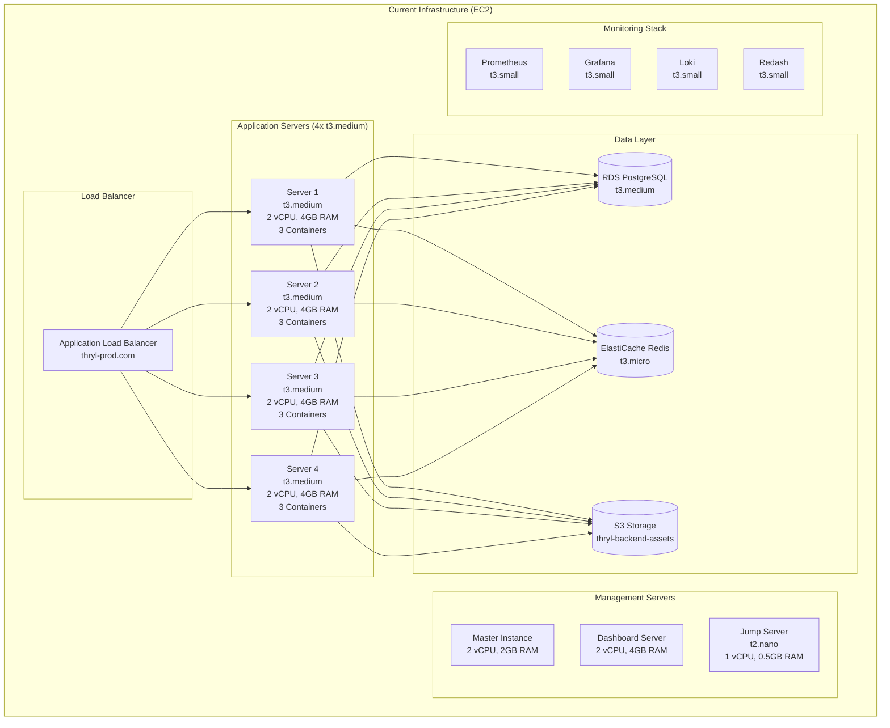
```mermaid
graph TB
    subgraph "Current Infrastructure (EC2)"
        subgraph "Load Balancer"
            ALB[Application Load Balancer<br/>thryl-prod.com]
        end
        
        subgraph "Application Servers (4x t3.medium)"
            AS1[Server 1<br/>t3.medium<br/>2 vCPU, 4GB RAM<br/>3 Containers]
            AS2[Server 2<br/>t3.medium<br/>2 vCPU, 4GB RAM<br/>3 Containers]
            AS3[Server 3<br/>t3.medium<br/>2 vCPU, 4GB RAM<br/>3 Containers]
            AS4[Server 4<br/>t3.medium<br/>2 vCPU, 4GB RAM<br/>3 Containers]
        end
        
        subgraph "Management Servers"
            MI[Master Instance<br/>2 vCPU, 2GB RAM]
            DS[Dashboard Server<br/>2 vCPU, 4GB RAM]
            JS[Jump Server<br/>t2.nano<br/>1 vCPU, 0.5GB RAM]
        end
        
        subgraph "Data Layer"
            RDS[(RDS PostgreSQL<br/>t3.medium)]
            REDIS[(ElastiCache Redis<br/>t3.micro)]
            S3[(S3 Storage<br/>thryl-backend-assets)]
        end
        
        subgraph "Monitoring Stack"
            PROM[Prometheus<br/>t3.small]
            GRAFANA[Grafana<br/>t3.small]
            LOKI[Loki<br/>t3.small]
            REDASH[Redash<br/>t3.small]
        end
    end
    
    ALB --> AS1
    ALB --> AS2
    ALB --> AS3
    ALB --> AS4
    
    AS1 --> RDS
    AS2 --> RDS
    AS3 --> RDS
    AS4 --> RDS
    
    AS1 --> REDIS
    AS2 --> REDIS
    AS3 --> REDIS
    AS4 --> REDIS
    
    AS1 --> S3
    AS2 --> S3
    AS3 --> S3
    AS4 --> S3
```

### Current Resource Specifications

#### Compute Resources
| Component | Instance Type | vCPU | RAM | Storage | Count | Purpose |
|-----------|---------------|------|-----|---------|-------|---------|
| **Application Servers** | t3.medium | 2 | 4GB | 20GB GP2 | 4 | Main application hosting |
| **Master Instance** | t3.small | 2 | 2GB | 20GB GP2 | 1 | Management & coordination |
| **Dashboard Server** | t3.small | 2 | 4GB | 20GB GP2 | 1 | Admin dashboard |
| **Jump Server** | t2.nano | 1 | 0.5GB | 8GB GP2 | 1 | Private subnet access |
| **Prometheus** | t3.small | 2 | 2GB | 20GB GP2 | 1 | Metrics collection |
| **Grafana** | t3.small | 2 | 2GB | 20GB GP2 | 1 | Visualization |
| **Loki** | t3.small | 2 | 2GB | 20GB GP2 | 1 | Log aggregation |
| **Redash** | local | 0 | - | - | 1 | Analytics |

#### Storage Resources
| Component | Type | Size | Purpose |
|-----------|------|------|---------|
| **RDS PostgreSQL** | t3.medium | 100GB GP2 | Primary database |
| **ElastiCache Redis** | t3.micro | 0.5GB | Caching & sessions |
| **S3 Bucket** | Standard | Unlimited | File storage |
| **EBS Volumes** | GP2 | 20GB each | OS & application data |

#### Network Resources
| Component | Type | Configuration |
|-----------|------|---------------|
| **VPC** | Custom | 10.0.0.0/16 CIDR |
| **Public Subnets** | 2 | 10.0.1.0/24, 10.0.2.0/24 |
| **Private Subnets** | 2 | 10.0.3.0/24, 10.0.4.0/24 |
| **Load Balancer** | ALB | Multi-AZ deployment |
| **Security Groups** | Custom | Port-specific access |

### Current Performance Metrics

#### Application Performance
- **Request Rate**: ~500 requests/second
- **Response Time**: 95th percentile < 200ms
- **Error Rate**: < 0.1%
- **Uptime**: 99.9% availability

#### Resource Utilization
- **CPU Usage**: 40-60% average
- **Memory Usage**: 60-80% average
- **Disk Usage**: 70% average
- **Network**: 50-100 Mbps

#### Database Performance
- **Connection Pool**: 10 connections per server
- **Query Performance**: < 100ms average
- **Storage Usage**: 60GB of 100GB
- **Backup**: Daily automated backups

### Current Scaling Limitations

#### EC2-Based Limitations
1. **Manual Scaling**: Requires manual intervention for scaling
2. **Fixed Resources**: Static allocation of CPU and memory
3. **Downtime**: Scaling requires application restart
4. **Cost Inefficiency**: Paying for unused resources
5. **Load Distribution**: Basic round-robin load balancing

#### Container Limitations
1. **Resource Isolation**: Limited container resource management
2. **Orchestration**: No automatic container placement
3. **Health Checks**: Basic health check mechanisms
4. **Rolling Updates**: Manual deployment process

---

## Future ECS Migration Strategy

### Target Architecture (5 Lakh Users)

**ECS + Elastic Load Balancer Setup**:
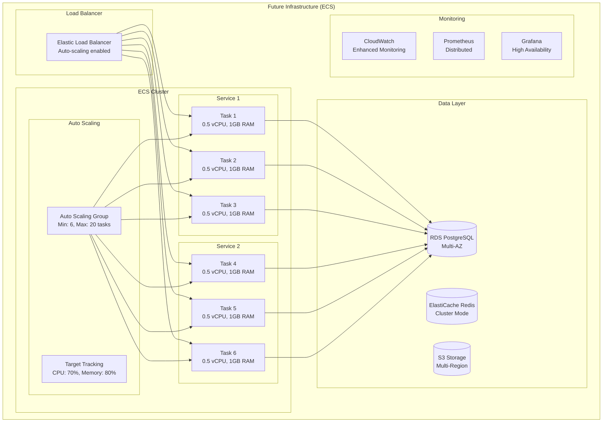
```mermaid
graph TB
    subgraph "Future Infrastructure (ECS)"
        subgraph "Load Balancer"
            ELB[Elastic Load Balancer<br/>Auto-scaling enabled]
        end
        
        subgraph "ECS Cluster"
            subgraph "Service 1"
                TASK1[Task 1<br/>0.5 vCPU, 1GB RAM]
                TASK2[Task 2<br/>0.5 vCPU, 1GB RAM]
                TASK3[Task 3<br/>0.5 vCPU, 1GB RAM]
            end
            
            subgraph "Service 2"
                TASK4[Task 4<br/>0.5 vCPU, 1GB RAM]
                TASK5[Task 5<br/>0.5 vCPU, 1GB RAM]
                TASK6[Task 6<br/>0.5 vCPU, 1GB RAM]
            end
            
            subgraph "Auto Scaling"
                ASG[Auto Scaling Group<br/>Min: 6, Max: 20 tasks]
                TARGET[Target Tracking<br/>CPU: 70%, Memory: 80%]
            end
        end
        
        subgraph "Data Layer"
            RDS[(RDS PostgreSQL<br/>Multi-AZ)]
            REDIS[(ElastiCache Redis<br/>Cluster Mode)]
            S3[(S3 Storage<br/>Multi-Region)]
        end
        
        subgraph "Monitoring"
            CW[CloudWatch<br/>Enhanced Monitoring]
            PROM[Prometheus<br/>Distributed]
            GRAFANA[Grafana<br/>High Availability]
        end
    end
    
    ELB --> TASK1
    ELB --> TASK2
    ELB --> TASK3
    ELB --> TASK4
    ELB --> TASK5
    ELB --> TASK6
    
    ASG --> TASK1
    ASG --> TASK2
    ASG --> TASK3
    ASG --> TASK4
    ASG --> TASK5
    ASG --> TASK6
    
    TASK1 --> RDS
    TASK2 --> RDS
    TASK3 --> RDS
    TASK4 --> RDS
    TASK5 --> RDS
    TASK6 --> RDS
```

### Migration Benefits

#### ECS Advantages
1. **Auto Scaling**: Automatic scaling based on demand
2. **Resource Efficiency**: Pay only for used resources
3. **Zero Downtime**: Rolling deployments without interruption
4. **Better Isolation**: Container-level resource management
5. **Health Management**: Automatic health checks and recovery

#### Elastic Load Balancer Benefits
1. **Intelligent Routing**: Advanced load balancing algorithms
2. **Health Checks**: Automatic unhealthy instance removal
3. **SSL Termination**: Centralized SSL certificate management
4. **Sticky Sessions**: Session affinity for stateful applications
5. **Cross-Zone Load Balancing**: Better availability


### Resource Requirements for 5 Lakh Users

#### Compute Resources
| Component | Specification | Count | Purpose |
|-----------|---------------|-------|---------|
| **ECS Tasks** | 0.5 vCPU, 1GB RAM | 6-20 (auto-scaling) | Application hosting |
| **RDS Instance** | db.r5.large | 1 primary + 2 read replicas | Database |
| **Redis Cluster** | cache.r5.large | 3 nodes | Caching |
| **Load Balancer** | Application Load Balancer | 1 | Traffic distribution |

#### Performance Targets
- **Request Rate**: 2000+ requests/second
- **Response Time**: 95th percentile < 150ms
- **Error Rate**: < 0.05%
- **Uptime**: 99.99% availability

#### Cost Optimization
- **Auto Scaling**: Reduce costs by 30-40%
- **Spot Instances**: Use for non-critical workloads
- **Reserved Instances**: For predictable workloads
- **Multi-AZ**: High availability with cost efficiency

## Service Dependencies

### Internal Dependencies
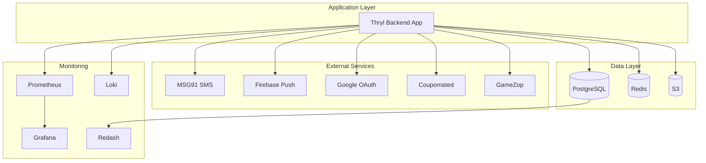
```mermaid
graph TB
    subgraph "Application Layer"
        APP[Thryl Backend App]
    end
    
    subgraph "Data Layer"
        DB[(PostgreSQL)]
        CACHE[(Redis)]
        STORAGE[(S3)]
    end
    
    subgraph "External Services"
        SMS[MSG91 SMS]
        PUSH[Firebase Push]
        AUTH[Google OAuth]
        COUPON[Coupomated]
        GAME[GameZop]
    end
    
    subgraph "Monitoring"
        PROM[Prometheus]
        GRAFANA[Grafana]
        LOKI[Loki]
        REDASH[Redash]
    end
    
    APP --> DB
    APP --> CACHE
    APP --> STORAGE
    APP --> SMS
    APP --> PUSH
    APP --> AUTH
    APP --> COUPON
    APP --> GAME
    
    APP --> PROM
    PROM --> GRAFANA
    APP --> LOKI
    DB --> REDASH
```

### Dependency Health Checks
- **Database**: Connection pool health
- **Cache**: Redis connectivity
- **Storage**: S3 bucket access
- **External APIs**: Response time monitoring
- **Monitoring**: Service availability

---

## System Architecture Overview

### High-Level Architecture Diagram

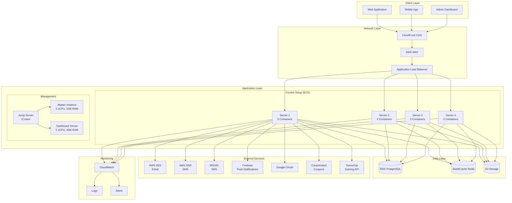
```mermaid
graph TB
    subgraph "Client Layer"
        Web[Web Application]
        Mobile[Mobile App]
        Admin[Admin Dashboard]
    end
    
    subgraph "Network Layer"
        CDN[CloudFront CDN]
        WAF[AWS WAF]
        ALB[Application Load Balancer]
    end
    
    subgraph "Application Layer"
        subgraph "Current Setup (EC2)"
            AS1[Server 1<br/>3 Containers]
            AS2[Server 2<br/>3 Containers]
            AS3[Server 3<br/>3 Containers]
            AS4[Server 4<br/>3 Containers]
        end
        
        subgraph "Management"
            MI[Master Instance<br/>2 vCPU, 2GB RAM]
            DS[Dashboard Server<br/>2 vCPU, 4GB RAM]
            JS[Jump Server<br/>t2.nano]
        end
    end
    
    subgraph "Data Layer"
        RDS[(RDS PostgreSQL)]
        EC[(ElastiCache Redis)]
        S3[(S3 Storage)]
    end
    
    subgraph "External Services"
        SES[AWS SES<br/>Email]
        SNS[AWS SNS<br/>SMS]
        MSG91[MSG91<br/>SMS]
        FIREBASE[Firebase<br/>Push Notifications]
        GOOGLE[Google OAuth]
        COUPOMATED[Coupomated<br/>Coupons]
        GAMEZOP[GameZop<br/>Gaming API]
    end
    
    subgraph "Monitoring"
        CW[CloudWatch]
        LOGS[Logs]
        ALERTS[Alerts]
    end
    
    Web --> CDN
    Mobile --> CDN
    Admin --> CDN
    CDN --> WAF
    WAF --> ALB
    ALB --> AS1
    ALB --> AS2
    ALB --> AS3
    ALB --> AS4
    JS --> MI
    JS --> DS
    
    AS1 --> RDS
    AS2 --> RDS
    AS3 --> RDS
    AS4 --> RDS
    AS1 --> EC
    AS2 --> EC
    AS3 --> EC
    AS4 --> EC
    AS1 --> S3
    AS2 --> S3
    AS3 --> S3
    AS4 --> S3
    
    AS1 --> SES
    AS1 --> SNS
    AS1 --> MSG91
    AS1 --> FIREBASE
    AS1 --> GOOGLE
    AS1 --> COUPOMATED
    AS1 --> GAMEZOP
    
    AS1 --> CW
    AS2 --> CW
    AS3 --> CW
    AS4 --> CW
    CW --> LOGS
    CW --> ALERTS
```

### Service Interaction Flow

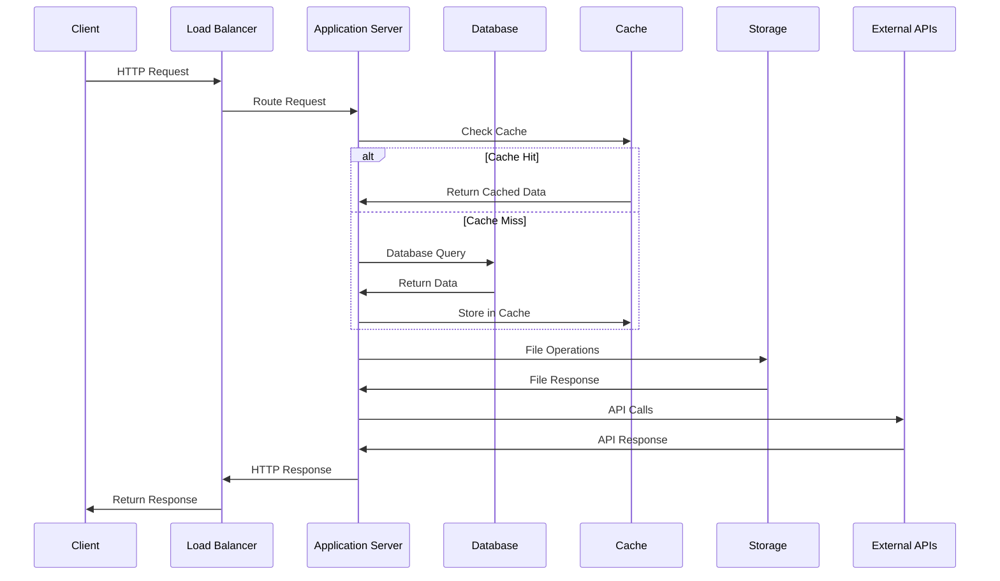
```mermaid
sequenceDiagram
    participant Client
    participant ALB as Load Balancer
    participant App as Application Server
    participant RDS as Database
    participant Redis as Cache
    participant S3 as Storage
    participant External as External APIs
    
    Client->>ALB: HTTP Request
    ALB->>App: Route Request
    App->>Redis: Check Cache
    alt Cache Hit
        Redis->>App: Return Cached Data
    else Cache Miss
        App->>RDS: Database Query
        RDS->>App: Return Data
        App->>Redis: Store in Cache
    end
    
    App->>S3: File Operations
    S3->>App: File Response
    
    App->>External: API Calls
    External->>App: API Response
    
    App->>ALB: HTTP Response
    ALB->>Client: Return Response
```

---

## AWS Services

The AWS services are organized into logical categories for better understanding and management.

---

### Compute Services

#### 1. Amazon EC2 (Elastic Compute Cloud)

**Purpose**: Primary compute instances for application hosting

**Architecture Diagram**:
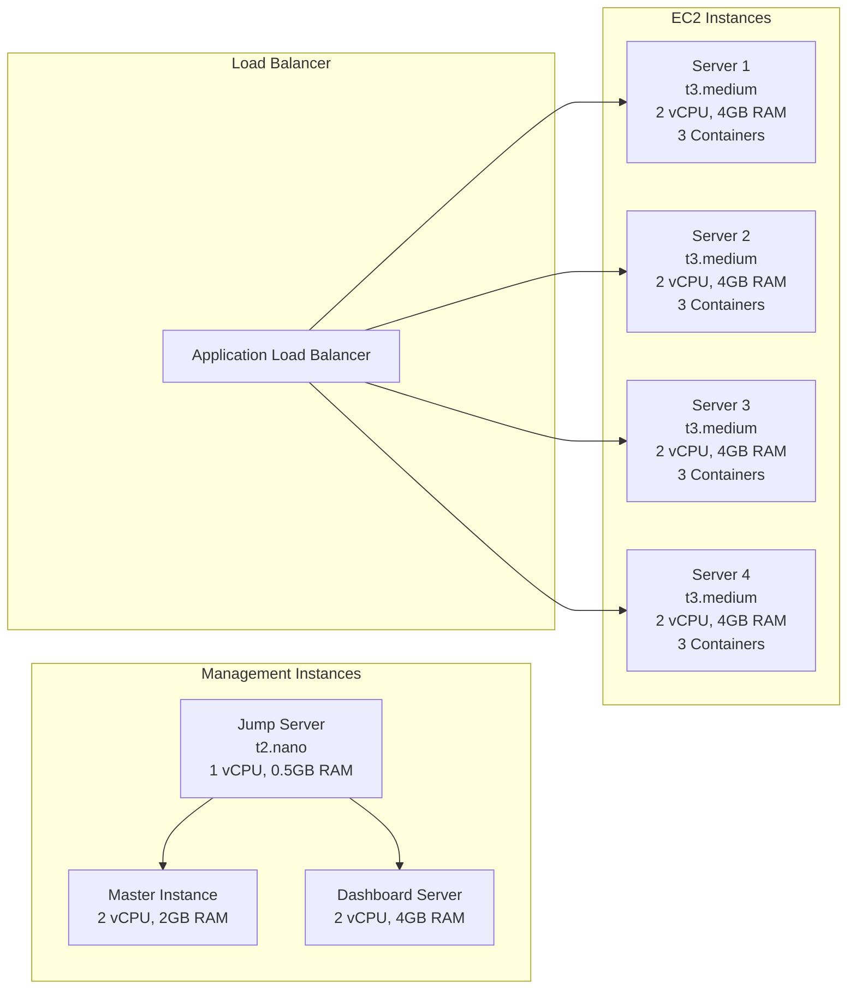
```mermaid
graph LR
    subgraph "EC2 Instances"
        AS1[Server 1<br/>t3.medium<br/>2 vCPU, 4GB RAM<br/>3 Containers]
        AS2[Server 2<br/>t3.medium<br/>2 vCPU, 4GB RAM<br/>3 Containers]
        AS3[Server 3<br/>t3.medium<br/>2 vCPU, 4GB RAM<br/>3 Containers]
        AS4[Server 4<br/>t3.medium<br/>2 vCPU, 4GB RAM<br/>3 Containers]
    end
    
    subgraph "Management Instances"
        MI[Master Instance<br/>2 vCPU, 2GB RAM]
        DS[Dashboard Server<br/>2 vCPU, 4GB RAM]
        JS[Jump Server<br/>t2.nano<br/>1 vCPU, 0.5GB RAM]
    end
    
    subgraph "Load Balancer"
        ALB[Application Load Balancer]
    end
    
    ALB --> AS1
    ALB --> AS2
    ALB --> AS3
    ALB --> AS4
    JS --> MI
    JS --> DS
```

**Current Configuration**:
- **Instance Type**: t3.medium (2 vCPU, 4GB RAM)
- **OS**: Amazon Linux 2
- **Storage**: 20GB GP2 EBS volume
- **Security Groups**: Custom firewall rules

**Scaling Plan**:
```yaml
Current Setup:
  - 4 servers total
  - 1 server = 3 containers
  - Total: 12 containers across 4 servers

Future ECS Migration (at 5 lakh users):
  - Elastic Load Balancer
  - ECS Fargate clusters
  - Auto-scaling groups
  - Container orchestration
```

**Instance Specifications**:
| Component | Specification | Purpose |
|-----------|---------------|---------|
| Application Servers | 2 vCPU, 4GB RAM each | Main application hosting |
| Master Instance | 2 vCPU, 2GB RAM | Management and coordination |
| Dashboard Server | 2 vCPU, 4GB RAM | Admin dashboard hosting |
| Jump Server | t2.nano (1 vCPU, 0.5GB RAM) | Private subnet access |

#### 2. AWS Lambda

**Purpose**: Serverless functions for background processing and automation

**Lambda Architecture**:
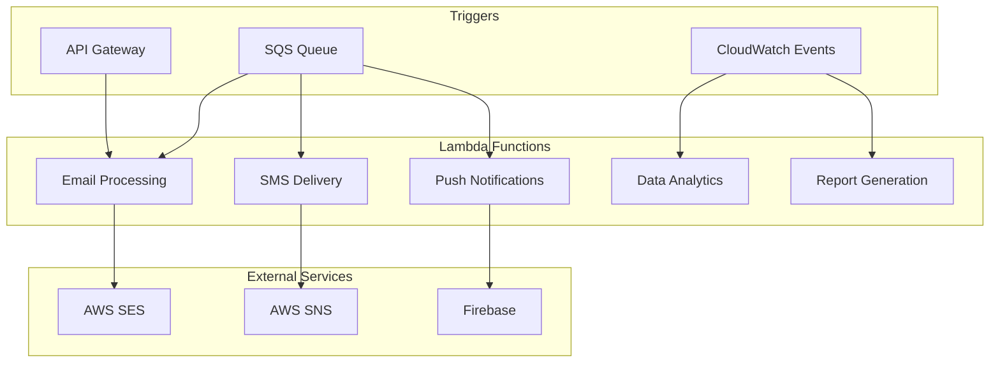
```mermaid
graph TB
    subgraph "Lambda Functions"
        L1[Email Processing]
        L2[SMS Delivery]
        L3[Push Notifications]
        L4[Data Analytics]
        L5[Report Generation]
    end
    
    subgraph "Triggers"
        SQS[SQS Queue]
        CW[CloudWatch Events]
        API[API Gateway]
    end
    
    subgraph "External Services"
        SES[AWS SES]
        SNS[AWS SNS]
        FIREBASE[Firebase]
    end
    
    SQS --> L1
    SQS --> L2
    SQS --> L3
    CW --> L4
    CW --> L5
    API --> L1
    
    L1 --> SES
    L2 --> SNS
    L3 --> FIREBASE
```

**Configuration**:
- **Runtime**: Node.js 18.x
- **Memory**: 512MB (configurable)
- **Timeout**: 30 seconds
- **Concurrency**: 1000 concurrent executions

#### 3. SQS Consumer Lambda for Firebase Push Notifications

**Purpose**: Consume messages from SQS queue and send Firebase push notifications

**Detailed Architecture**:
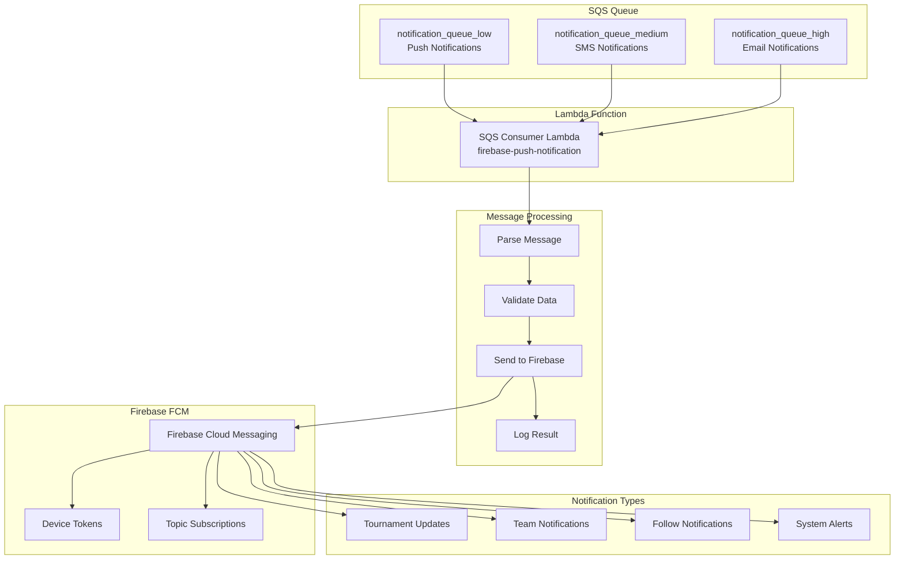
```mermaid
graph TB
    subgraph "SQS Queue"
        Q1[notification_queue_low<br/>Push Notifications]
        Q2[notification_queue_medium<br/>SMS Notifications]
        Q3[notification_queue_high<br/>Email Notifications]
    end
    
    subgraph "Lambda Function"
        LAMBDA[SQS Consumer Lambda<br/>firebase-push-notification]
    end
    
    subgraph "Message Processing"
        PARSE[Parse Message]
        VALIDATE[Validate Data]
        FIREBASE[Send to Firebase]
        LOG[Log Result]
    end
    
    subgraph "Firebase FCM"
        FCM[Firebase Cloud Messaging]
        TOKENS[Device Tokens]
        TOPICS[Topic Subscriptions]
    end
    
    subgraph "Notification Types"
        TOURNAMENT[Tournament Updates]
        TEAM[Team Notifications]
        FOLLOW[Follow Notifications]
        SYSTEM[System Alerts]
    end
    
    Q1 --> LAMBDA
    Q2 --> LAMBDA
    Q3 --> LAMBDA
    
    LAMBDA --> PARSE
    PARSE --> VALIDATE
    VALIDATE --> FIREBASE
    FIREBASE --> LOG
    
    FIREBASE --> FCM
    FCM --> TOKENS
    FCM --> TOPICS
    
    FCM --> TOURNAMENT
    FCM --> TEAM
    FCM --> FOLLOW
    FCM --> SYSTEM
```

### Storage Services

#### 1. Amazon S3 (Simple Storage Service)

**Purpose**: File storage for user uploads, images, videos, and application assets

**S3 Architecture**:
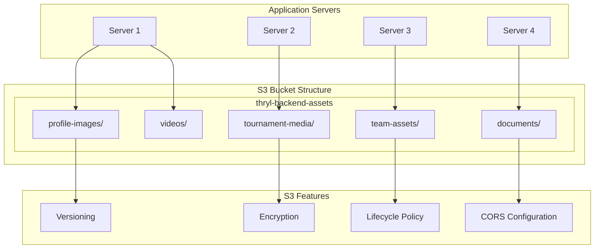
```mermaid
graph TB
    subgraph "S3 Bucket Structure"
        subgraph "thryl-backend-assets"
            PROFILE[profile-images/]
            TOURNAMENT[tournament-media/]
            TEAM[team-assets/]
            DOCS[documents/]
            VIDEOS[videos/]
        end
    end
    
    subgraph "Application Servers"
        AS1[Server 1]
        AS2[Server 2]
        AS3[Server 3]
        AS4[Server 4]
    end
    
    subgraph "S3 Features"
        VERSIONING[Versioning]
        ENCRYPTION[Encryption]
        LIFECYCLE[Lifecycle Policy]
        CORS[CORS Configuration]
    end
    
    AS1 --> PROFILE
    AS2 --> TOURNAMENT
    AS3 --> TEAM
    AS4 --> DOCS
    AS1 --> VIDEOS
    
    PROFILE --> VERSIONING
    TOURNAMENT --> ENCRYPTION
    TEAM --> LIFECYCLE
    DOCS --> CORS
```

**Usage in Application**:
- Profile pictures and cover images
- Tournament banners and media
- Team logos and assets
- Document uploads (KYC documents)
- Video content storage


#### 2. Amazon RDS PostgreSQL

**Purpose**: Primary relational database for application data

**Database Architecture**:
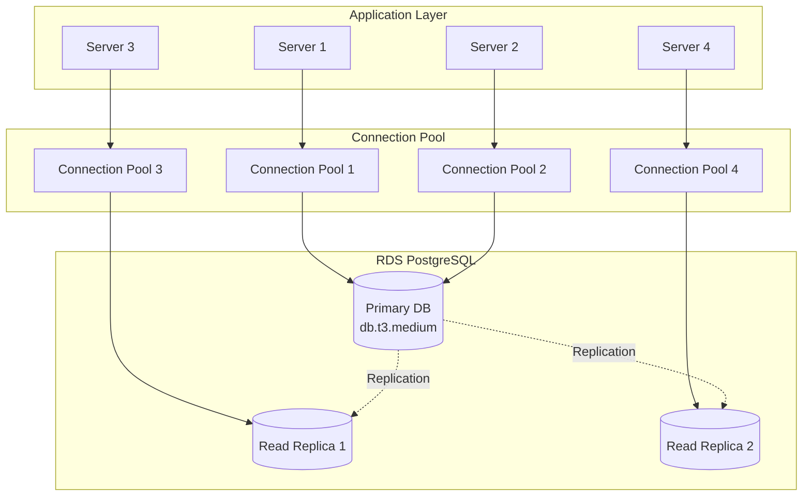
```mermaid
graph TB
    subgraph "RDS PostgreSQL"
        PRIMARY[(Primary DB<br/>db.t3.medium)]
        REPLICA1[(Read Replica 1)]
        REPLICA2[(Read Replica 2)]
    end
    
    subgraph "Application Layer"
        AS1[Server 1]
        AS2[Server 2]
        AS3[Server 3]
        AS4[Server 4]
    end
    
    subgraph "Connection Pool"
        CP1[Connection Pool 1]
        CP2[Connection Pool 2]
        CP3[Connection Pool 3]
        CP4[Connection Pool 4]
    end
    
    AS1 --> CP1
    AS2 --> CP2
    AS3 --> CP3
    AS4 --> CP4
    
    CP1 --> PRIMARY
    CP2 --> PRIMARY
    CP3 --> REPLICA1
    CP4 --> REPLICA2
    
    PRIMARY -.->|Replication| REPLICA1
    PRIMARY -.->|Replication| REPLICA2
```


**Database Features**:
- Connection pooling (max 10 connections)
- Automated backups
- Point-in-time recovery
- Read replicas for scaling
- Performance Insights enabled


#### 3. Amazon ElastiCache Redis

**Purpose**: Redis caching for session management and data caching

**Redis Architecture**:
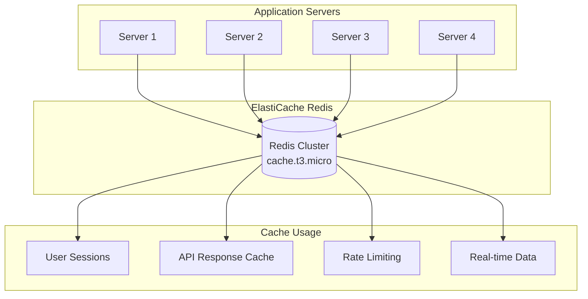
```mermaid
graph TB
    subgraph "ElastiCache Redis"
        REDIS[(Redis Cluster<br/>cache.t3.micro)]
    end
    
    subgraph "Application Servers"
        AS1[Server 1]
        AS2[Server 2]
        AS3[Server 3]
        AS4[Server 4]
    end
    
    subgraph "Cache Usage"
        SESSIONS[User Sessions]
        API_CACHE[API Response Cache]
        RATE_LIMIT[Rate Limiting]
        REAL_TIME[Real-time Data]
    end
    
    AS1 --> REDIS
    AS2 --> REDIS
    AS3 --> REDIS
    AS4 --> REDIS
    
    REDIS --> SESSIONS
    REDIS --> API_CACHE
    REDIS --> RATE_LIMIT
    REDIS --> REAL_TIME
```

**Usage**:
- Session storage
- API response caching
- Rate limiting
- Real-time data
- Queue management

---

### Networking Services

#### 1. Amazon VPC (Virtual Private Cloud)

**Purpose**: Network isolation and security for the application infrastructure

**VPC Architecture**:
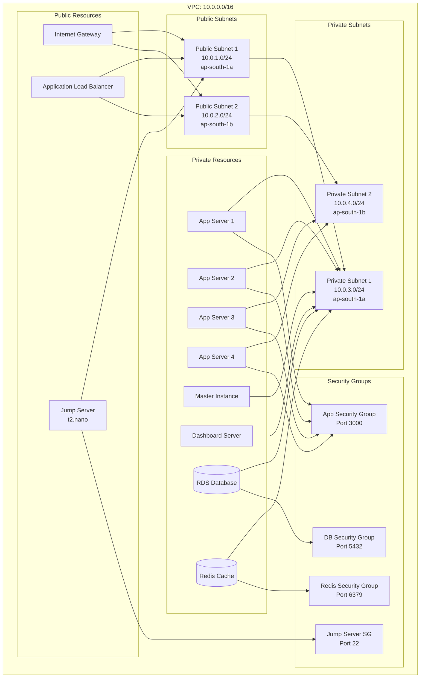
```mermaid
graph TB
    subgraph "VPC: 10.0.0.0/16"
        subgraph "Public Subnets"
            PS1[Public Subnet 1<br/>10.0.1.0/24<br/>ap-south-1a]
            PS2[Public Subnet 2<br/>10.0.2.0/24<br/>ap-south-1b]
        end
        
        subgraph "Private Subnets"
            PRS1[Private Subnet 1<br/>10.0.3.0/24<br/>ap-south-1a]
            PRS2[Private Subnet 2<br/>10.0.4.0/24<br/>ap-south-1b]
        end
        
        subgraph "Public Resources"
            IGW[Internet Gateway]
            ALB[Application Load Balancer]
            JS[Jump Server<br/>t2.nano]
        end
        
        subgraph "Private Resources"
            AS1[App Server 1]
            AS2[App Server 2]
            AS3[App Server 3]
            AS4[App Server 4]
            MI[Master Instance]
            DS[Dashboard Server]
            RDS[(RDS Database)]
            REDIS[(Redis Cache)]
        end
        
        subgraph "Security Groups"
            SG1[App Security Group<br/>Port 3000]
            SG2[DB Security Group<br/>Port 5432]
            SG3[Redis Security Group<br/>Port 6379]
            SG4[Jump Server SG<br/>Port 22]
        end
    end
    
    IGW --> PS1
    IGW --> PS2
    ALB --> PS1
    ALB --> PS2
    JS --> PS1
    
    PS1 --> PRS1
    PS2 --> PRS2
    
    AS1 --> PRS1
    AS2 --> PRS1
    AS3 --> PRS2
    AS4 --> PRS2
    MI --> PRS1
    DS --> PRS1
    RDS --> PRS1
    REDIS --> PRS1
    
    AS1 --> SG1
    AS2 --> SG1
    AS3 --> SG1
    AS4 --> SG1
    RDS --> SG2
    REDIS --> SG3
    JS --> SG4
```

**Network Configuration**:
```yaml
VPC Configuration:
  CIDR Block: 10.0.0.0/16
  
Public Subnets:
  - 10.0.1.0/24 (ap-south-1a)
  - 10.0.2.0/24 (ap-south-1b)
  
Private Subnets:
  - 10.0.3.0/24 (ap-south-1a)
  - 10.0.4.0/24 (ap-south-1b)
  
Security Groups:
  - Application SG (port 3000)
  - Database SG (port 5432)
  - Redis SG (port 6379)
  - Jump Server SG (port 22)
```

**Security Features**:
- Network ACLs
- Security Groups
- NAT Gateways
- Internet Gateways
- VPC Endpoints

#### 2. Amazon Route 53

**Purpose**: DNS management and domain routing

**DNS Architecture**:
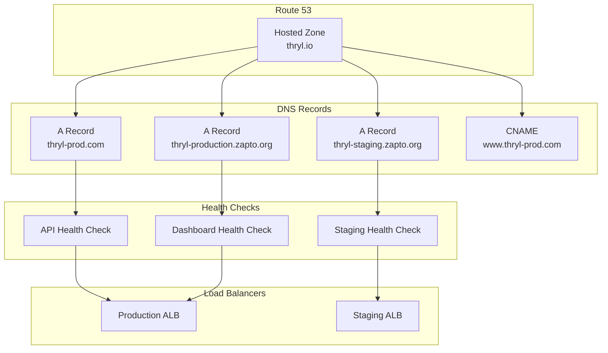
```mermaid
graph TB
    subgraph "Route 53"
        ZONE[Hosted Zone<br/>thryl.io]
    end
    
    subgraph "DNS Records"
        A1[A Record<br/>thryl-prod.com]
        A2[A Record<br/>thryl-production.zapto.org]
        A3[A Record<br/>thryl-staging.zapto.org]
        CNAME1[CNAME<br/>www.thryl-prod.com]
    end
    
    subgraph "Health Checks"
        HC1[API Health Check]
        HC2[Dashboard Health Check]
        HC3[Staging Health Check]
    end
    
    subgraph "Load Balancers"
        ALB1[Production ALB]
        ALB2[Staging ALB]
    end
    
    ZONE --> A1
    ZONE --> A2
    ZONE --> A3
    ZONE --> CNAME1
    
    A1 --> HC1
    A2 --> HC2
    A3 --> HC3
    
    HC1 --> ALB1
    HC2 --> ALB1
    HC3 --> ALB2
```

**Features**:
- DNS failover
- Health checks
- Latency-based routing
- Geographic routing
- Load balancing

---

### Communication Services

#### 1. Amazon SES (Simple Email Service)

**Purpose**: Email delivery service for transactional and marketing emails

**Email Flow Architecture**:
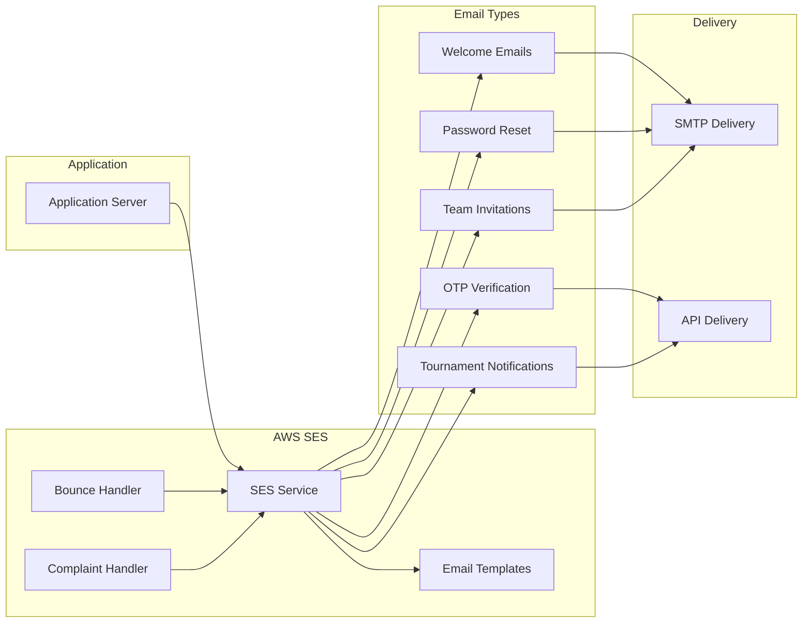
```mermaid
graph LR
    subgraph "Application"
        APP[Application Server]
    end
    
    subgraph "AWS SES"
        SES[SES Service]
        TEMPLATES[Email Templates]
        BOUNCE[Bounce Handler]
        COMPLAINT[Complaint Handler]
    end
    
    subgraph "Email Types"
        WELCOME[Welcome Emails]
        OTP[OTP Verification]
        RESET[Password Reset]
        TOURNAMENT[Tournament Notifications]
        TEAM[Team Invitations]
    end
    
    subgraph "Delivery"
        SMTP[SMTP Delivery]
        API[API Delivery]
    end
    
    APP --> SES
    SES --> TEMPLATES
    SES --> WELCOME
    SES --> OTP
    SES --> RESET
    SES --> TOURNAMENT
    SES --> TEAM
    
    WELCOME --> SMTP
    OTP --> API
    RESET --> SMTP
    TOURNAMENT --> API
    TEAM --> SMTP
    
    BOUNCE --> SES
    COMPLAINT --> SES
```

**Email Templates**:
- Welcome emails
- OTP verification
- Password reset
- Tournament notifications
- Team invitations
- Account updates

#### 2. Amazon SNS (Simple Notification Service)

**Purpose**: SMS delivery and push notification service

**SNS Architecture**:
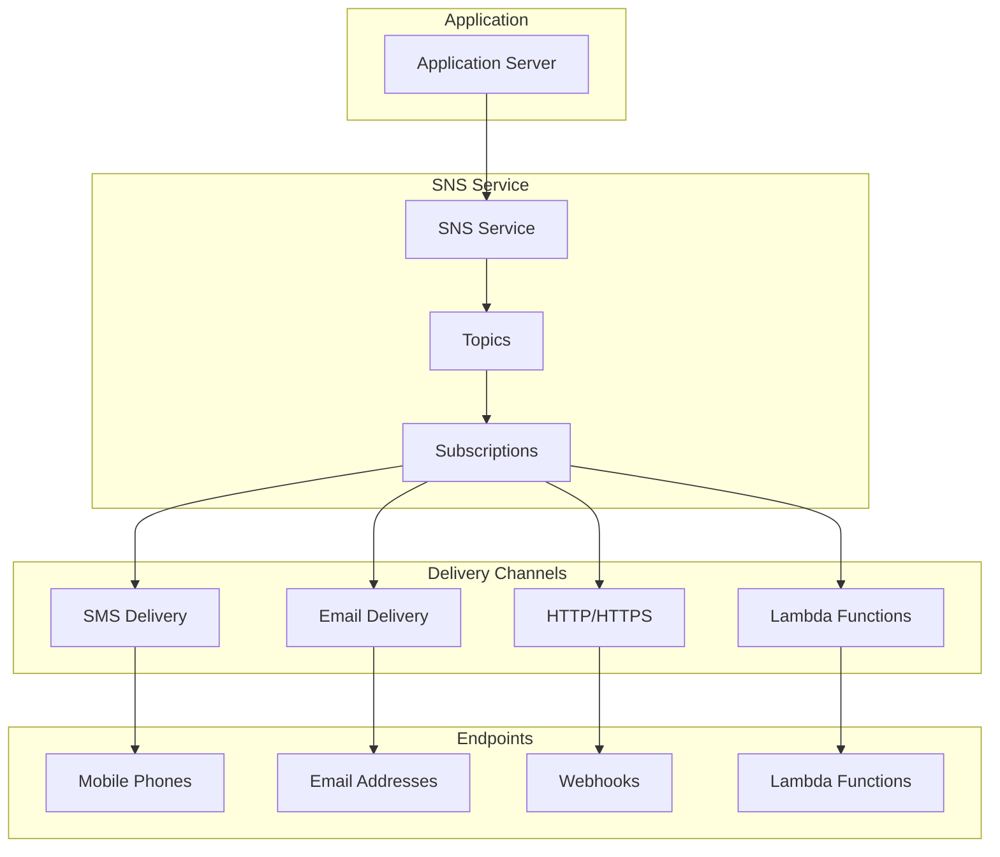
```mermaid
graph TB
    subgraph "Application"
        APP[Application Server]
    end
    
    subgraph "SNS Service"
        SNS[SNS Service]
        TOPICS[Topics]
        SUBSCRIPTIONS[Subscriptions]
    end
    
    subgraph "Delivery Channels"
        SMS[SMS Delivery]
        EMAIL[Email Delivery]
        HTTP[HTTP/HTTPS]
        LAMBDA[Lambda Functions]
    end
    
    subgraph "Endpoints"
        PHONES[Mobile Phones]
        EMAILS[Email Addresses]
        WEBHOOKS[Webhooks]
        FUNCTIONS[Lambda Functions]
    end
    
    APP --> SNS
    SNS --> TOPICS
    TOPICS --> SUBSCRIPTIONS
    SUBSCRIPTIONS --> SMS
    SUBSCRIPTIONS --> EMAIL
    SUBSCRIPTIONS --> HTTP
    SUBSCRIPTIONS --> LAMBDA
    
    SMS --> PHONES
    EMAIL --> EMAILS
    HTTP --> WEBHOOKS
    LAMBDA --> FUNCTIONS
```


**Usage**:
- OTP delivery via SMS
- Tournament notifications
- Team updates
- Account alerts
- Marketing campaigns

#### 3. Amazon SQS (Simple Queue Service)

**Purpose**: Message queuing for asynchronous processing

**SQS Architecture**:
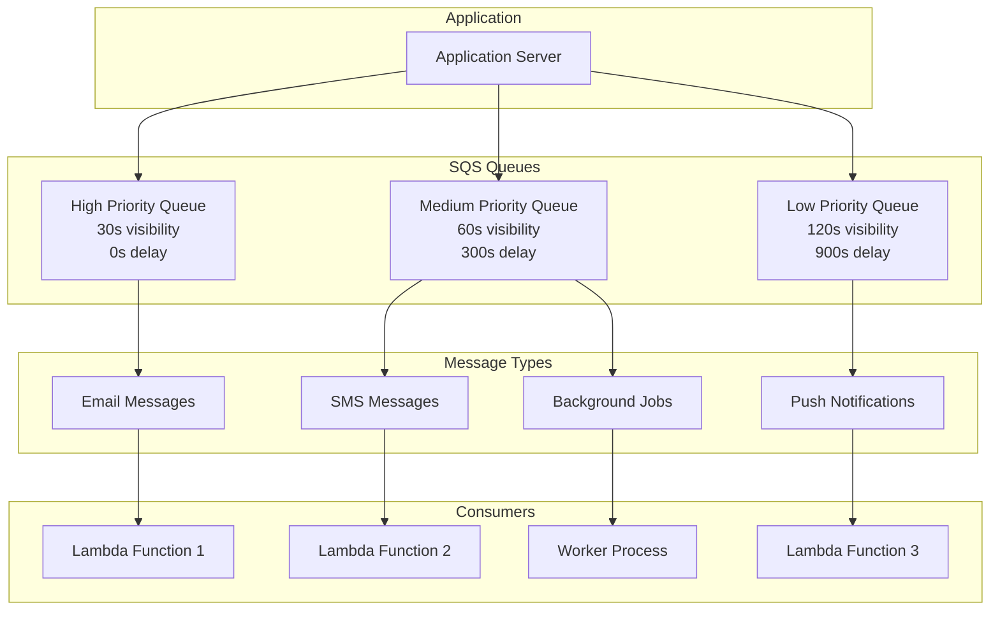
```mermaid
graph TB
    subgraph "Application"
        APP[Application Server]
    end
    
    subgraph "SQS Queues"
        HIGH[High Priority Queue<br/>30s visibility<br/>0s delay]
        MEDIUM[Medium Priority Queue<br/>60s visibility<br/>300s delay]
        LOW[Low Priority Queue<br/>120s visibility<br/>900s delay]
    end
    
    subgraph "Message Types"
        EMAIL[Email Messages]
        SMS[SMS Messages]
        PUSH[Push Notifications]
        BACKGROUND[Background Jobs]
    end
    
    subgraph "Consumers"
        LAMBDA1[Lambda Function 1]
        LAMBDA2[Lambda Function 2]
        LAMBDA3[Lambda Function 3]
        WORKER[Worker Process]
    end
    
    APP --> HIGH
    APP --> MEDIUM
    APP --> LOW
    
    HIGH --> EMAIL
    MEDIUM --> SMS
    LOW --> PUSH
    MEDIUM --> BACKGROUND
    
    EMAIL --> LAMBDA1
    SMS --> LAMBDA2
    PUSH --> LAMBDA3
    BACKGROUND --> WORKER
```

**Queue Configuration**:
```json
{
  "notification_queue_high": {
    "visibility_timeout": "30 seconds",
    "message_retention": "4 days",
    "delay_seconds": "0",
    "max_message_size": "256KB"
  },
  "notification_queue_medium": {
    "visibility_timeout": "60 seconds",
    "message_retention": "4 days",
    "delay_seconds": "300",
    "max_message_size": "256KB"
  },
  "notification_queue_low": {
    "visibility_timeout": "120 seconds",
    "message_retention": "4 days",
    "delay_seconds": "900",
    "max_message_size": "256KB"
  }
}
```

**Usage Patterns**:
- Email notifications (high priority)
- SMS notifications (medium priority)
- Push notifications (low priority)
- Background job processing
- Event-driven architecture

---

### Security Services

#### 1. AWS Secrets Manager

**Purpose**: Secure storage and management of sensitive configuration data

**Secrets Architecture**:
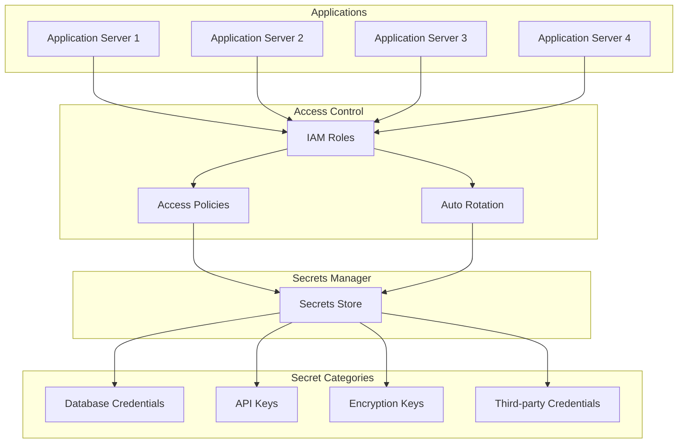
```mermaid
graph TB
    subgraph "Secrets Manager"
        SECRETS[Secrets Store]
    end
    
    subgraph "Secret Categories"
        DB[Database Credentials]
        API[API Keys]
        ENCRYPTION[Encryption Keys]
        THIRD_PARTY[Third-party Credentials]
    end
    
    subgraph "Applications"
        APP1[Application Server 1]
        APP2[Application Server 2]
        APP3[Application Server 3]
        APP4[Application Server 4]
    end
    
    subgraph "Access Control"
        IAM[IAM Roles]
        POLICIES[Access Policies]
        ROTATION[Auto Rotation]
    end
    
    SECRETS --> DB
    SECRETS --> API
    SECRETS --> ENCRYPTION
    SECRETS --> THIRD_PARTY
    
    APP1 --> IAM
    APP2 --> IAM
    APP3 --> IAM
    APP4 --> IAM
    
    IAM --> POLICIES
    IAM --> ROTATION
    
    POLICIES --> SECRETS
    ROTATION --> SECRETS
```

#### 2. Amazon ECR (Elastic Container Registry)

**Purpose**: Docker image registry for containerized applications

**ECR Architecture**:
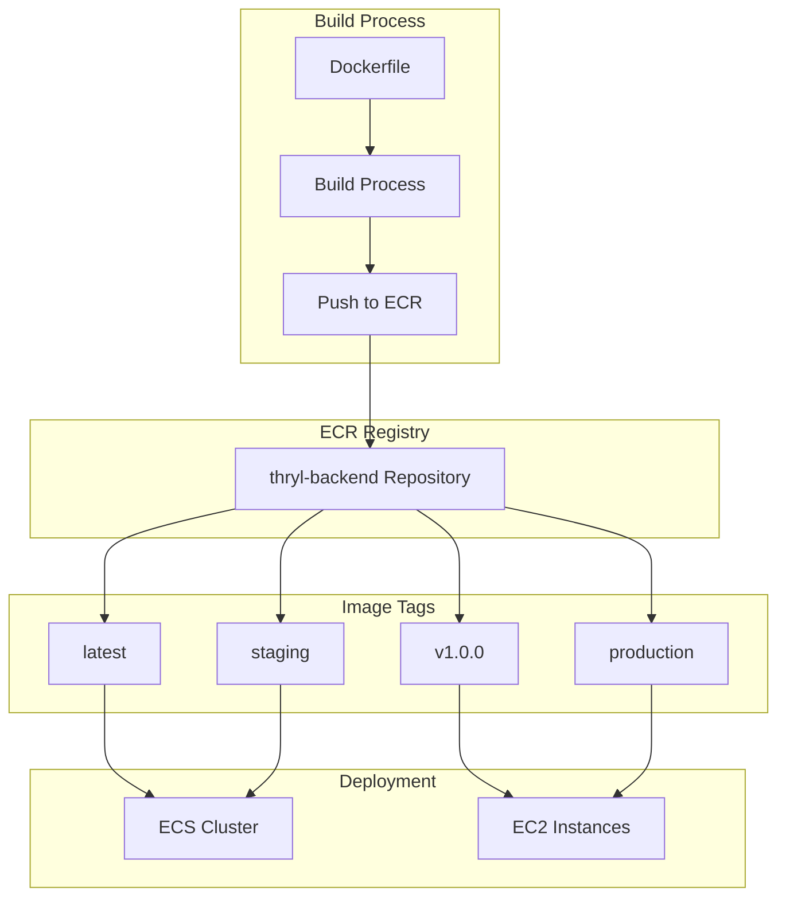
```mermaid
graph TB
    subgraph "ECR Registry"
        REPO[thryl-backend Repository]
    end
    
    subgraph "Image Tags"
        LATEST[latest]
        V1[v1.0.0]
        STAGING[staging]
        PROD[production]
    end
    
    subgraph "Build Process"
        DOCKERFILE[Dockerfile]
        BUILD[Build Process]
        PUSH[Push to ECR]
    end
    
    subgraph "Deployment"
        ECS[ECS Cluster]
        EC2[EC2 Instances]
    end
    
    DOCKERFILE --> BUILD
    BUILD --> PUSH
    PUSH --> REPO
    
    REPO --> LATEST
    REPO --> V1
    REPO --> STAGING
    REPO --> PROD
    
    LATEST --> ECS
    V1 --> EC2
    STAGING --> ECS
    PROD --> EC2
```


**Docker Images**:
- Application images
- Database images
- Monitoring images
- Utility images

---

### Monitoring Services

#### 1. Amazon CloudWatch

**Purpose**: Monitoring, logging, and alerting for the entire infrastructure

**CloudWatch Architecture**:
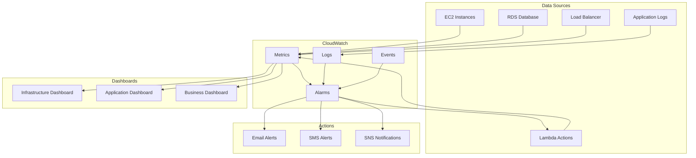
```mermaid
graph TB
    subgraph "Data Sources"
        EC2[EC2 Instances]
        RDS[RDS Database]
        ALB[Load Balancer]
        LAMBDA[Lambda Functions]
        APP[Application Logs]
    end
    
    subgraph "CloudWatch"
        METRICS[Metrics]
        LOGS[Logs]
        EVENTS[Events]
        ALARMS[Alarms]
    end
    
    subgraph "Dashboards"
        DASH1[Infrastructure Dashboard]
        DASH2[Application Dashboard]
        DASH3[Business Dashboard]
    end
    
    subgraph "Actions"
        EMAIL[Email Alerts]
        SMS[SMS Alerts]
        SNS[SNS Notifications]
        LAMBDA[Lambda Actions]
    end
    
    EC2 --> METRICS
    RDS --> METRICS
    ALB --> METRICS
    LAMBDA --> METRICS
    APP --> LOGS
    
    METRICS --> ALARMS
    LOGS --> ALARMS
    EVENTS --> ALARMS
    
    ALARMS --> EMAIL
    ALARMS --> SMS
    ALARMS --> SNS
    ALARMS --> LAMBDA
    
    METRICS --> DASH1
    METRICS --> DASH2
    METRICS --> DASH3
```

#### 2. Prometheus Monitoring Stack

**Purpose**: Advanced metrics collection, storage, and querying for application and infrastructure monitoring

**Prometheus Architecture**:
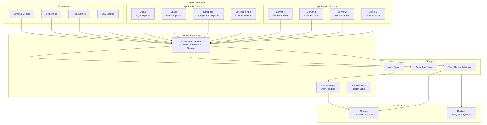
```mermaid
graph TB
    subgraph "Data Collection"
        subgraph "Application Servers"
            AS1[Server 1<br/>Node Exporter]
            AS2[Server 2<br/>Node Exporter]
            AS3[Server 3<br/>Node Exporter]
            AS4[Server 4<br/>Node Exporter]
        end
        
        subgraph "Application Metrics"
            APP1[Express.js App<br/>Custom Metrics]
            APP2[Database<br/>PostgreSQL Exporter]
            APP3[Cache<br/>Redis Exporter]
            APP4[Queue<br/>SQS Exporter]
        end
        
        subgraph "Infrastructure"
            EC2[EC2 Metrics]
            RDS[RDS Metrics]
            S3[S3 Metrics]
            LAMBDA[Lambda Metrics]
        end
    end
    
    subgraph "Prometheus Stack"
        PROM[Prometheus Server<br/>Metrics Collection & Storage]
        ALERTMANAGER[Alert Manager<br/>Alert Routing]
        PUSHGATEWAY[Push Gateway<br/>Batch Jobs]
    end
    
    subgraph "Visualization"
        GRAFANA[Grafana<br/>Dashboards & Alerts]
        REDASH[Redash<br/>Analytics & Queries]
    end
    
    subgraph "Storage"
        TSDB[Time Series Database]
        RULES[Recording Rules]
        ALERTS[Alert Rules]
    end
    
    AS1 --> PROM
    AS2 --> PROM
    AS3 --> PROM
    AS4 --> PROM
    
    APP1 --> PROM
    APP2 --> PROM
    APP3 --> PROM
    APP4 --> PROM
    
    EC2 --> PROM
    RDS --> PROM
    S3 --> PROM
    LAMBDA --> PROM
    
    PROM --> TSDB
    PROM --> RULES
    PROM --> ALERTS
    
    TSDB --> GRAFANA
    TSDB --> REDASH
    
    ALERTS --> ALERTMANAGER
    ALERTMANAGER --> GRAFANA
```

**Prometheus Configuration**:
- **Scrape Interval**: 15 seconds
- **Evaluation Interval**: 15 seconds
- **Retention**: 15 days
- **Storage**: Local time-series database
- **Alert Rules**: Custom business and infrastructure alerts

**Key Metrics Collected**:
- **Infrastructure**: CPU, memory, disk, network usage
- **Application**: Request rate, response time, error rate
- **Database**: Connection count, query performance, storage usage
- **Cache**: Hit rate, memory usage, connection count
- **Business**: User activity, tournament participation, revenue metrics

#### 3. Grafana Dashboards

**Purpose**: Advanced visualization and dashboard creation for monitoring data

**Grafana Architecture**:
```mermaid
graph TB
    subgraph "Data Sources"
        PROM[Prometheus]
        CW[CloudWatch]
        RDS[(PostgreSQL)]
        REDIS[(Redis)]
    end
    
    subgraph "Grafana"
        DASHBOARDS[Dashboards]
        ALERTS[Alerts]
        USERS[Users & Teams]
        PLUGINS[Plugins]
    end
    
    subgraph "Dashboard Categories"
        INFRA[Infrastructure<br/>CPU, Memory, Disk, Network]
        APP[Application<br/>Response Time, Error Rate, Throughput]
        DB[Database<br/>Connections, Queries, Performance]
        BUSINESS[Business<br/>Users, Transactions, Revenue]
    end
    
    subgraph "Alert Channels"
        EMAIL[Email]
        SLACK[Slack]
        PAGERDUTY[PagerDuty]
        WEBHOOK[Webhook]
    end
    
    PROM --> DASHBOARDS
    CW --> DASHBOARDS
    RDS --> DASHBOARDS
    REDIS --> DASHBOARDS
    
    DASHBOARDS --> INFRA
    DASHBOARDS --> APP
    DASHBOARDS --> DB
    DASHBOARDS --> BUSINESS
    
    ALERTS --> EMAIL
    ALERTS --> SLACK
    ALERTS --> PAGERDUTY
    ALERTS --> WEBHOOK
```

**Grafana Configuration**:
- **Port**: 3000
- **Database**: PostgreSQL for Grafana metadata
- **Authentication**: LDAP integration
- **Alerting**: Unified alerting enabled
- **SMTP**: Configured for email notifications

**Key Dashboards**:

**1. Infrastructure Overview Dashboard**:
- CPU usage by server
- Memory usage by server
- Disk usage by server
- Network traffic
- Load balancer metrics

**2. Application Performance Dashboard**:
- Request rate (requests/second)
- Response time (95th percentile)
- Error rate by endpoint
- Active users count
- API endpoint performance

**3. Database Performance Dashboard**:
- Database connections
- Query performance
- Storage usage
- Cache hit ratio
- Replication lag

**4. Business Metrics Dashboard**:
- Daily active users
- Tournament participation
- Revenue analytics
- User growth trends
- Feature usage statistics

#### 4. Loki Log Aggregation

**Purpose**: Centralized log aggregation, storage, and querying for distributed application logs

**Loki Architecture**:
```mermaid
graph TB
    subgraph "Application Servers"
        AS1[Server 1<br/>Winston Logger]
        AS2[Server 2<br/>Winston Logger]
        AS3[Server 3<br/>Winston Logger]
        AS4[Server 4<br/>Winston Logger]
    end
    
    subgraph "Log Sources"
        APP_LOGS[Application Logs]
        ERROR_LOGS[Error Logs]
        ACCESS_LOGS[Access Logs]
        SYSTEM_LOGS[System Logs]
    end
    
    subgraph "Loki Stack"
        LOKI[Loki Server<br/>Log Aggregation & Storage]
        PROMTAIL[Promtail<br/>Log Collection]
        GRAFANA[Grafana<br/>Log Visualization]
    end
    
    subgraph "Storage"
        CHUNKS[Log Chunks]
        INDEX[Log Index]
        CACHE[Query Cache]
    end
    
    subgraph "Log Types"
        API_LOGS[API Request/Response]
        DB_LOGS[Database Queries]
        AUTH_LOGS[Authentication Events]
        BUSINESS_LOGS[Business Events]
    end
    
    AS1 --> APP_LOGS
    AS2 --> ERROR_LOGS
    AS3 --> ACCESS_LOGS
    AS4 --> SYSTEM_LOGS
    
    APP_LOGS --> PROMTAIL
    ERROR_LOGS --> PROMTAIL
    ACCESS_LOGS --> PROMTAIL
    SYSTEM_LOGS --> PROMTAIL
    
    PROMTAIL --> LOKI
    LOKI --> CHUNKS
    LOKI --> INDEX
    LOKI --> CACHE
    
    LOKI --> API_LOGS
    LOKI --> DB_LOGS
    LOKI --> AUTH_LOGS
    LOKI --> BUSINESS_LOGS
    
    LOKI --> GRAFANA
```

**Loki Configuration**:
- **Host**: http://localhost:3100
- **Storage**: Local filesystem with chunk storage
- **Retention**: 30 days for application logs
- **Query Engine**: LogQL for log querying
- **Integration**: Winston transport for Node.js applications

**Key Features**:
- **Log Aggregation**: Centralized collection from all application servers
- **Real-time Processing**: Stream processing of log data
- **Efficient Storage**: Compressed log storage with indexing
- **Powerful Querying**: LogQL for complex log queries
- **Grafana Integration**: Native integration with Grafana dashboards

**Log Categories**:
- **Application Logs**: API requests, responses, and business logic
- **Error Logs**: Exceptions, stack traces, and error conditions
- **Access Logs**: User authentication and authorization events
- **System Logs**: Infrastructure and operational events
- **Performance Logs**: Response times, database queries, and resource usage

#### 5. Redash Analytics Platform

**Purpose**: Data analytics, querying, and business intelligence for the Thryl platform

**Redash Architecture**:
```mermaid
graph TB
    subgraph "Data Sources"
        POSTGRES[(PostgreSQL<br/>Application Data)]
        REDIS[(Redis<br/>Cache Data)]
        S3[(S3<br/>Logs & Analytics)]
        PROMETHEUS[(Prometheus<br/>Metrics Data)]
    end
    
    subgraph "Redash Platform"
        QUERIES[Query Editor]
        VISUALIZATIONS[Visualizations]
        DASHBOARDS[Dashboards]
        ALERTS[Alerts]
        SCHEDULES[Scheduled Queries]
    end
    
    subgraph "Analytics Categories"
        USER_ANALYTICS[User Analytics<br/>Growth, Engagement, Retention]
        BUSINESS_METRICS[Business Metrics<br/>Revenue, Transactions, KPIs]
        OPERATIONAL[Operational Analytics<br/>Performance, Errors, Usage]
        GAMING[Gaming Analytics<br/>Tournaments, Teams, Matches]
    end
    
    subgraph "Output Formats"
        CHARTS[Charts & Graphs]
        TABLES[Data Tables]
        EXPORTS[CSV/Excel Export]
        EMBED[Embedded Widgets]
    end
    
    POSTGRES --> QUERIES
    REDIS --> QUERIES
    S3 --> QUERIES
    PROMETHEUS --> QUERIES
    
    QUERIES --> VISUALIZATIONS
    VISUALIZATIONS --> DASHBOARDS
    QUERIES --> ALERTS
    QUERIES --> SCHEDULES
    
    DASHBOARDS --> USER_ANALYTICS
    DASHBOARDS --> BUSINESS_METRICS
    DASHBOARDS --> OPERATIONAL
    DASHBOARDS --> GAMING
    
    VISUALIZATIONS --> CHARTS
    VISUALIZATIONS --> TABLES
    VISUALIZATIONS --> EXPORTS
    VISUALIZATIONS --> EMBED
```

**Redash Configuration**:
- **Host**: https://localhost:8081
- **Database**: PostgreSQL for Redash metadata
- **Redis**: For caching and job queues
- **Authentication**: Google OAuth integration
- **Email**: SMTP configured for alerts

**Key Analytics Queries**:

**1. User Growth Analytics**:
- Daily active users tracking
- User retention (7-day, 30-day)
- User acquisition channels
- User engagement metrics

**2. Tournament Performance Analytics**:
- Tournament participation trends
- Check-in rates by tournament
- Revenue per tournament
- Team performance analytics

**3. Application Performance Analytics**:
- API performance by endpoint
- Database query performance
- Error rate analysis
- Response time trends

**4. Business Metrics Dashboard**:
- Key business KPIs
- Revenue analytics
- User behavior patterns
- Feature adoption rates

**Monitoring Stack Integration**:
- **Prometheus**: Custom metrics collection and application performance data
- **Grafana**: Real-time dashboards, alert management, and performance visualization
- **Loki**: Centralized log aggregation, storage, and querying
- **Redash**: Business analytics, data exploration, and custom reporting
- **CloudWatch**: AWS service metrics, log aggregation, and cost monitoring

---

